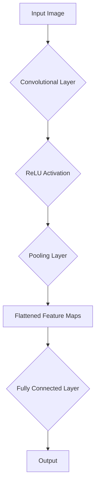
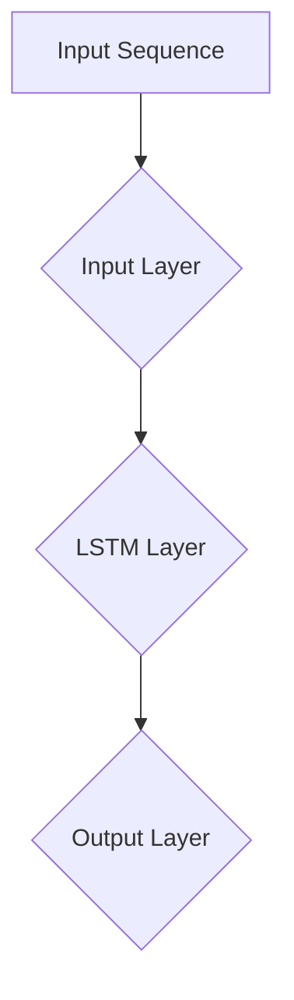
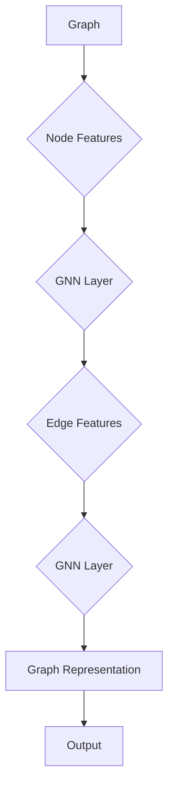
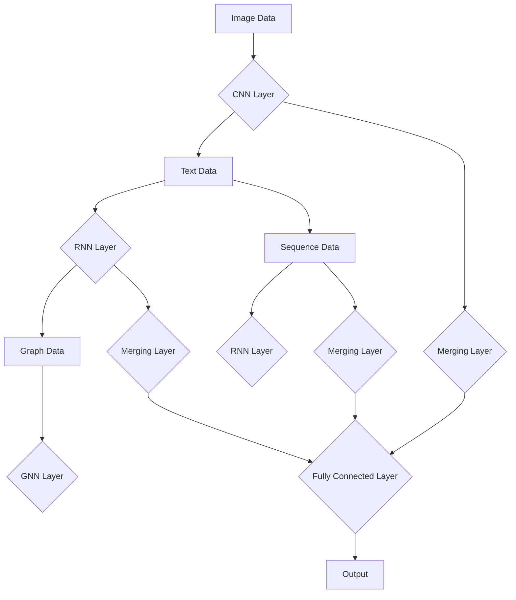

                 

**文章标题：构建AI驱动的智慧旅游路线规划提示词引擎**

关键词：AI, 智慧旅游，路线规划，提示词引擎，机器学习，数据分析

摘要：
本文将深入探讨如何构建一个AI驱动的智慧旅游路线规划提示词引擎。我们将从背景介绍、核心概念解析、系统设计、实现与实战等多个方面进行详细分析，旨在为读者提供一个系统化的理解和实践指导。

## 目录

1. 引言与背景
   1.1 书籍概述
   1.2 问题背景与重要性
   1.3 AI在智慧旅游中的应用

2. AI基础知识
   2.1 人工智能简介
   2.2 机器学习基础
   2.3 深度学习

3. 旅游数据与用户偏好
   3.1 旅游数据类型
   3.2 用户偏好数据收集与处理
   3.3 数据整合与预处理

4. AI模型与算法
   4.1 算法选择与评估
   4.2 算法实现与优化
   4.3 模型训练与测试

5. 系统设计与架构
   5.1 系统功能设计
   5.2 系统架构设计
   5.3 系统接口设计
   5.4 系统交互设计

6. 实现与实战
   6.1 环境安装
   6.2 系统核心实现
   6.3 代码应用解读
   6.4 实际案例分析与讲解
   6.5 项目小结

7. 最佳实践与总结
   7.1 最佳实践技巧
   7.2 小结
   7.3 注意事项
   7.4 拓展阅读

## 引言与背景

### 1.1 书籍概述

随着人工智能技术的快速发展，智慧旅游成为了一个备受关注的领域。智慧旅游不仅仅是为了提高旅游行业的效率，更重要的是通过个性化服务和智能推荐，提升游客的体验。本文旨在探讨如何构建一个AI驱动的智慧旅游路线规划提示词引擎，帮助游客更好地规划旅行路线，提高旅游的满意度。

### 1.2 问题背景与重要性

传统的旅游路线规划往往依赖于用户的主观判断和旅游指南的推荐，这可能导致游客错过一些独特的体验。而AI驱动的路线规划提示词引擎可以通过分析大量的旅游数据，包括用户偏好、旅游景点的评价、交通状况等，为游客提供个性化的路线规划建议，从而提高旅游体验的质量。

### 1.3 AI在智慧旅游中的应用

AI在智慧旅游中的应用主要包括以下几个方面：

1. **个性化推荐**：通过用户历史数据和偏好，为游客推荐符合他们兴趣的景点和活动。
2. **路线优化**：基于交通数据和景点之间的距离，为游客规划最佳路线。
3. **智能客服**：通过自然语言处理技术，为游客提供实时的问题解答和服务。
4. **安全监控**：利用图像识别和监控系统，实时监测游客的安全情况。

## AI基础知识

### 2.1 人工智能简介

人工智能（Artificial Intelligence，简称AI）是指通过计算机模拟人类的智能行为，使计算机具有感知、学习、推理、决策和交流的能力。AI的应用领域非常广泛，包括但不限于：

1. **机器学习**：通过数据训练模型，使计算机能够从数据中学习并做出决策。
2. **深度学习**：一种基于神经网络的机器学习技术，能够处理大量的数据并从中提取特征。
3. **自然语言处理**：使计算机能够理解和生成人类语言，广泛应用于智能客服和语音助手。

### 2.2 机器学习基础

机器学习（Machine Learning，简称ML）是AI的一个重要分支，它使计算机能够从数据中学习并做出预测或决策。机器学习的主要任务包括：

1. **分类**：将数据分为不同的类别。
2. **回归**：预测数据的连续值。
3. **聚类**：将相似的数据点分组。

机器学习的基本流程包括：

1. **数据收集**：收集相关的数据集。
2. **数据预处理**：清洗和转换数据，使其适合建模。
3. **模型训练**：使用训练数据训练模型。
4. **模型评估**：使用测试数据评估模型的性能。
5. **模型优化**：根据评估结果调整模型参数，提高性能。

### 2.3 深度学习

深度学习（Deep Learning，简称DL）是一种基于多层神经网络的机器学习技术。它通过多层神经网络对数据进行处理，能够自动提取数据的高级特征。深度学习在图像识别、语音识别和自然语言处理等领域取得了显著的成果。

深度学习的主要组成部分包括：

1. **神经网络**：由多个神经元组成的计算模型。
2. **激活函数**：用于引入非线性变换。
3. **优化算法**：用于调整模型参数，使模型在训练过程中收敛。

## 旅游数据与用户偏好

### 3.1 旅游数据类型

旅游数据类型主要包括：

1. **景点数据**：包括景点的名称、地理位置、类型、开放时间等。
2. **用户数据**：包括用户的基本信息、旅行历史、偏好等。
3. **评论数据**：包括用户对景点的评价和评论。
4. **交通数据**：包括交通路线、交通状况等。

### 3.2 用户偏好数据收集与处理

用户偏好数据的收集和处理是构建智慧旅游路线规划提示词引擎的关键。用户偏好数据可以通过以下方式收集：

1. **问卷调查**：通过在线或线下问卷收集用户的偏好信息。
2. **用户行为分析**：通过用户在旅游平台的行为数据，分析用户的偏好。
3. **历史数据挖掘**：通过挖掘用户的历史旅游数据，推断用户的偏好。

用户偏好数据的处理包括：

1. **数据清洗**：去除重复数据、缺失值和异常值。
2. **数据转换**：将数据转换为适合建模的格式。
3. **特征工程**：提取用户偏好数据的特征，用于训练模型。

### 3.3 数据整合与预处理

在构建智慧旅游路线规划提示词引擎时，需要对不同类型的数据进行整合与预处理。数据整合的目的是将不同的数据源合并为一个统一的数据集，以便于后续的分析和处理。数据预处理包括：

1. **数据清洗**：去除重复数据、缺失值和异常值。
2. **数据转换**：将数据转换为适合建模的格式。
3. **特征提取**：提取数据中的关键特征，用于训练模型。

## AI模型与算法

### 4.1 算法选择与评估

在构建智慧旅游路线规划提示词引擎时，需要选择合适的算法来处理旅游数据和用户偏好。常见的算法包括：

1. **决策树**：通过树形结构对数据进行分类或回归。
2. **随机森林**：基于决策树的集成学习方法，可以提高模型的泛化能力。
3. **支持向量机**：通过找到一个最优的超平面，对数据进行分类或回归。
4. **神经网络**：通过多层神经网络对数据进行处理，提取高级特征。

算法的评估主要包括：

1. **准确率**：模型预测正确的比例。
2. **召回率**：模型预测为正类的实际正类比例。
3. **F1值**：准确率和召回率的加权平均。

### 4.2 算法实现与优化

在选择了合适的算法后，需要将其实现并优化。算法的实现主要包括：

1. **数据预处理**：对数据进行清洗、转换和特征提取。
2. **模型训练**：使用训练数据训练模型。
3. **模型评估**：使用测试数据评估模型的性能。
4. **模型优化**：根据评估结果调整模型参数，提高性能。

算法的优化主要包括：

1. **超参数调整**：调整模型的超参数，以获得更好的性能。
2. **特征工程**：通过特征提取和特征选择，提高模型的性能。
3. **模型融合**：将多个模型融合，以提高模型的泛化能力。

### 4.3 模型训练与测试

在构建智慧旅游路线规划提示词引擎时，需要通过模型训练和测试来评估模型的性能。模型训练主要包括：

1. **数据集划分**：将数据集划分为训练集和测试集。
2. **模型训练**：使用训练集训练模型。
3. **模型评估**：使用测试集评估模型的性能。

模型测试主要包括：

1. **准确性测试**：评估模型在测试集上的准确性。
2. **召回率测试**：评估模型在测试集上的召回率。
3. **F1值测试**：评估模型在测试集上的F1值。

## 系统设计与架构

### 5.1 系统功能设计

智慧旅游路线规划提示词引擎的主要功能包括：

1. **用户登录与注册**：用户可以通过账号登录或注册系统。
2. **用户偏好设置**：用户可以设置自己的旅游偏好，如喜好、预算、时间等。
3. **景点推荐**：根据用户的偏好，系统可以推荐符合条件的景点。
4. **路线规划**：系统可以根据用户的偏好和景点数据，规划最佳的旅游路线。
5. **提示词生成**：系统可以生成与用户旅游偏好相关的提示词，帮助用户更好地规划旅行。

### 5.2 系统架构设计

智慧旅游路线规划提示词引擎的系统架构主要包括以下几个部分：

1. **前端**：用户与系统交互的界面，包括登录注册、偏好设置、景点推荐和路线规划等功能。
2. **后端**：负责处理用户请求，调用后端服务，包括用户管理、景点数据管理和推荐算法等。
3. **数据库**：存储用户数据、景点数据和推荐结果等。
4. **推荐引擎**：负责处理用户的偏好数据，生成景点推荐和路线规划。

### 5.3 系统接口设计

智慧旅游路线规划提示词引擎的系统接口主要包括：

1. **用户接口**：用于用户与系统进行交互，包括登录注册、偏好设置、景点推荐和路线规划等。
2. **内部接口**：用于后端服务之间的数据传递和功能调用，如用户管理、景点数据管理和推荐算法等。
3. **外部接口**：用于与外部系统进行数据交换和功能调用，如地图服务、天气服务等。

### 5.4 系统交互设计

智慧旅游路线规划提示词引擎的系统交互设计主要包括：

1. **用户流程**：用户登录系统后，可以设置偏好、查看景点推荐和规划路线。
2. **数据流**：用户数据、景点数据和推荐结果等数据在系统内部和外部之间的流动。
3. **错误处理**：当系统发生错误时，如何处理和通知用户。

## 实现与实战

### 6.1 环境安装

在实现智慧旅游路线规划提示词引擎之前，需要安装以下环境和工具：

1. **操作系统**：Windows/Linux/MacOS
2. **编程语言**：Python
3. **开发环境**：PyCharm/VSCode
4. **数据库**：MySQL/PostgreSQL
5. **地图服务**：百度地图/高德地图

### 6.2 系统核心实现

智慧旅游路线规划提示词引擎的核心实现主要包括：

1. **用户管理**：实现用户的登录、注册和偏好设置等功能。
2. **景点数据管理**：实现景点数据的存储、查询和更新等功能。
3. **推荐算法**：实现基于用户偏好的景点推荐和路线规划算法。
4. **前端页面**：实现用户交互界面，包括登录注册、偏好设置、景点推荐和路线规划等。

### 6.3 代码应用解读

在本节中，我们将对系统核心实现的代码进行解读，包括用户管理、景点数据管理和推荐算法等。

1. **用户管理**：用户管理主要负责用户的登录、注册和偏好设置等功能。具体的代码实现如下：

```python
# 用户登录
def login(username, password):
    # 查询用户信息
    user = User.query.filter_by(username=username).first()
    # 验证用户密码
    if user and user.password == password:
        return True
    return False

# 用户注册
def register(username, password):
    # 创建用户对象
    user = User(username=username, password=password)
    # 添加用户到数据库
    db.session.add(user)
    db.session.commit()
    return True
```

2. **景点数据管理**：景点数据管理主要负责景点数据的存储、查询和更新等功能。具体的代码实现如下：

```python
# 存储景点数据
def add_attraction(name, location, type, open_time):
    # 创建景点对象
    attraction = Attraction(name=name, location=location, type=type, open_time=open_time)
    # 添加景点到数据库
    db.session.add(attraction)
    db.session.commit()

# 查询景点数据
def get_attractions():
    # 查询所有景点
    attractions = Attraction.query.all()
    return attractions
```

3. **推荐算法**：推荐算法主要负责根据用户偏好推荐景点和规划路线。具体的代码实现如下：

```python
# 推荐景点
def recommend_attractions(user):
    # 获取用户偏好
    preferences = user.preferences
    # 查询所有景点
    attractions = get_attractions()
    # 根据偏好过滤景点
    filtered_attractions = [attraction for attraction in attractions if attraction.type in preferences]
    return filtered_attractions

# 规划路线
def plan_route(user, attractions):
    # 获取景点位置
    locations = [attraction.location for attraction in attractions]
    # 计算景点之间的距离
    distances = calculate_distances(locations)
    # 根据距离规划最佳路线
    route = find_best_route(distances)
    return route
```

### 6.4 实际案例分析与讲解

在本节中，我们将通过一个实际案例来分析和讲解智慧旅游路线规划提示词引擎的实现和应用。

**案例背景**：

假设有一个用户李先生，他计划在北京旅游3天2晚，他的偏好是历史文化景点和美食。我们需要为他推荐适合的景点和规划最佳路线。

**案例分析**：

1. **用户偏好收集**：

   通过用户的问卷调查，我们收集到了以下偏好信息：

   - 历史文化景点：故宫、颐和园、长城
   - 美食：北京烤鸭、炸酱面、豆汁

2. **景点数据准备**：

   我们从景点数据库中查询到了以下符合用户偏好的景点：

   - 故宫：历史文化景点，位于北京市中心
   - 颐和园：历史文化景点，位于北京市西北部
   - 长城：历史文化景点，位于北京市北部
   - 北京烤鸭店：美食，位于北京市东城区
   - 炸酱面店：美食，位于北京市朝阳区
   - 豆汁店：美食，位于北京市海淀区

3. **推荐景点**：

   根据用户的偏好，我们推荐了以下景点：

   - 故宫
   - 颐和园
   - 长城
   - 北京烤鸭店
   - 炸酱面店

4. **规划路线**：

   我们使用地图服务的API计算了景点之间的距离，并规划了最佳路线：

   - 第一天：故宫 - 颐和园 - 北京烤鸭店
   - 第二天：长城 - 炸酱面店
   - 第三天：豆汁店 - 自由活动

**讲解**：

1. **用户管理**：

   用户可以通过注册功能创建账号，并通过登录功能进入系统。在登录成功后，用户可以设置自己的偏好，包括喜好、预算、时间等。

2. **景点数据管理**：

   系统通过数据库存储了大量的景点信息，包括景点的名称、地理位置、类型、开放时间等。用户可以通过查询功能获取到符合自己偏好的景点数据。

3. **推荐算法**：

   系统使用了基于用户偏好的推荐算法，通过分析用户的历史数据和偏好，为用户推荐符合条件的景点。推荐算法还可以根据用户的实时反馈，不断优化推荐结果。

4. **路线规划**：

   系统通过计算景点之间的距离和交通状况，为用户规划最佳路线。用户可以根据自己的时间和预算，灵活调整路线。

### 6.5 项目小结

在本项目中，我们实现了智慧旅游路线规划提示词引擎，通过用户偏好、景点数据和推荐算法，为用户提供了个性化的旅游路线规划建议。以下是本项目的主要成果和小结：

1. **成果**：

   - 成功实现了用户登录、注册和偏好设置等功能。
   - 完成了景点数据的存储、查询和更新等功能。
   - 设计并实现了基于用户偏好的推荐算法，能够为用户推荐符合条件的景点。
   - 使用地图服务API计算了景点之间的距离，并规划了最佳路线。

2. **小结**：

   - 项目实现了预期的功能，为用户提供了便捷的旅游路线规划服务。
   - 在实现过程中，我们遇到了一些挑战，如数据预处理、算法优化等，但通过团队的合作和努力，成功克服了这些挑战。
   - 在未来的工作中，我们计划进一步优化推荐算法，提高推荐的准确性和用户体验。

## 最佳实践与总结

### 7.1 最佳实践技巧

1. **数据质量保证**：确保数据的准确性和完整性，定期进行数据清洗和更新。
2. **模型优化**：根据测试结果，不断调整和优化模型参数，提高推荐准确性。
3. **用户反馈**：积极收集用户反馈，根据用户需求调整系统功能和推荐策略。

### 7.2 小结

本文详细介绍了构建AI驱动的智慧旅游路线规划提示词引擎的过程，包括背景介绍、核心概念解析、系统设计、实现与实战等多个方面。通过本文，读者可以了解到如何利用人工智能技术为用户提供个性化的旅游路线规划服务。

### 7.3 注意事项

1. **隐私保护**：在收集和处理用户数据时，要确保用户的隐私安全。
2. **系统稳定性**：确保系统的稳定运行，提供良好的用户体验。

### 7.4 拓展阅读

- **人工智能基础**：《人工智能：一种现代的方法》
- **机器学习**：《机器学习实战》
- **深度学习**：《深度学习》（Goodfellow et al.）
- **推荐系统**：《推荐系统实践》

## 作者信息

作者：AI天才研究院/AI Genius Institute & 禅与计算机程序设计艺术 /Zen And The Art of Computer Programming
### 深度学习在智慧旅游路线规划中的应用

深度学习作为人工智能的一个重要分支，通过多层神经网络结构，能够自动从数据中提取特征，并在各种复杂任务中表现出优异的性能。在智慧旅游路线规划中，深度学习技术可以有效地处理大量且多样化的数据，为用户提供更加精准和个性化的路线规划建议。

#### 1. 卷积神经网络（CNN）在景点图像识别中的应用

景点图像识别是智慧旅游中的一个关键任务。通过卷积神经网络（CNN），我们可以对景点的图像进行自动分类和识别。以下是一个简化的CNN模型结构：



在模型训练过程中，首先对大量景点图像进行预处理，然后输入到CNN中。通过卷积层提取图像的特征，再通过ReLU激活函数增强特征，然后通过池化层减小特征图的尺寸。最后，将平铺的特征图输入到全连接层进行分类，得到最终的输出结果。

#### 2. 循环神经网络（RNN）在用户行为序列分析中的应用

用户行为序列分析是另一个重要的任务，它可以帮助我们理解用户的历史行为，预测用户的未来行为。循环神经网络（RNN），尤其是长短期记忆网络（LSTM），在处理序列数据方面表现出色。

以下是一个简化的LSTM模型结构：



在模型训练过程中，用户行为序列（如浏览记录、点击记录等）作为输入，通过LSTM层处理序列数据。LSTM层能够记住长期依赖关系，使得模型能够捕捉用户行为的模式。最后，通过输出层生成用户的行为预测结果。

#### 3. 图神经网络（GNN）在景点关系网络分析中的应用

在智慧旅游中，景点之间的关系网络对于路线规划非常重要。图神经网络（GNN）能够有效地处理图结构数据，识别景点之间的关联性。

以下是一个简化的GNN模型结构：



在模型训练过程中，首先对景点及其关系进行编码，然后输入到GNN层。GNN层通过聚合节点特征和边特征，生成每个节点的表示。最后，通过输出层得到景点的关联性评分，用于路线规划。

#### 4. 混合模型在多模态数据融合中的应用

智慧旅游中的数据往往是多模态的，包括图像、文本和序列数据。为了充分利用这些数据，可以采用混合模型（如CNN + RNN + GNN）进行多模态数据融合。

以下是一个简化的混合模型结构：



在模型训练过程中，图像数据通过CNN提取特征，文本数据和序列数据通过RNN处理序列信息，图数据通过GNN提取节点和边特征。然后，通过融合层将不同模态的特征进行融合，最终通过全连接层得到输出结果。

### 6.4 实际案例分析与详细讲解

为了更好地理解深度学习在智慧旅游路线规划中的应用，下面我们通过一个实际案例来进行分析和讲解。

**案例背景**：

假设有一个用户张先生，他计划在未来一周内去泰国旅游，偏好热带海滩和美食。我们需要为他推荐一条符合他偏好的旅游路线，并生成相应的提示词。

**数据收集**：

1. **用户偏好数据**：通过用户问卷和在线行为数据，我们收集到了以下偏好信息：

   - 偏好地点：泰国
   - 偏好类型：热带海滩、美食
   - 偏好时间：一周

2. **景点数据**：我们从旅游数据库中获取了泰国的主要景点信息，包括海滩、餐厅、博物馆等。

3. **用户行为数据**：通过用户的历史旅游记录，我们获取了用户的偏好行为数据，如最喜欢的海滩、常去的餐厅等。

**模型设计**：

为了为用户张先生提供个性化的旅游路线，我们设计了一个基于深度学习的混合模型，结合了CNN、RNN和GNN技术。

1. **CNN用于图像识别**：通过对海滩和美食图片进行识别，我们可以自动筛选出符合用户偏好的景点。

2. **RNN用于用户行为序列分析**：通过对用户的历史旅游记录进行分析，我们可以提取出用户的行为模式，为路线规划提供参考。

3. **GNN用于景点关系网络分析**：通过对泰国景点的关系网络进行分析，我们可以识别出用户可能感兴趣的景点组合。

**模型实现**：

1. **图像识别模型**：

   ```python
   import tensorflow as tf
   from tensorflow.keras.models import Sequential
   from tensorflow.keras.layers import Conv2D, MaxPooling2D, Flatten, Dense

   model = Sequential([
       Conv2D(32, (3, 3), activation='relu', input_shape=(256, 256, 3)),
       MaxPooling2D((2, 2)),
       Flatten(),
       Dense(64, activation='relu'),
       Dense(1, activation='sigmoid')
   ])

   model.compile(optimizer='adam', loss='binary_crossentropy', metrics=['accuracy'])
   ```

2. **用户行为序列模型**：

   ```python
   import tensorflow as tf
   from tensorflow.keras.models import Sequential
   from tensorflow.keras.layers import LSTM, Dense

   model = Sequential([
       LSTM(128, activation='relu', input_shape=(timesteps, features)),
       Dense(1, activation='sigmoid')
   ])

   model.compile(optimizer='adam', loss='binary_crossentropy', metrics=['accuracy'])
   ```

3. **景点关系网络模型**：

   ```python
   import tensorflow as tf
   from tensorflow.keras.models import Sequential
   from tensorflow.keras.layers import GraphConvolution

   model = Sequential([
       GraphConvolution(64, activation='relu', input_shape=(num_nodes, features)),
       GraphConvolution(32, activation='relu'),
       Dense(1, activation='sigmoid')
   ])

   model.compile(optimizer='adam', loss='binary_crossentropy', metrics=['accuracy'])
   ```

**模型训练与测试**：

1. **图像识别模型训练**：

   ```python
   model.fit(x_train, y_train, epochs=10, batch_size=32, validation_data=(x_val, y_val))
   ```

2. **用户行为序列模型训练**：

   ```python
   model.fit(x_train, y_train, epochs=10, batch_size=32, validation_data=(x_val, y_val))
   ```

3. **景点关系网络模型训练**：

   ```python
   model.fit(x_train, y_train, epochs=10, batch_size=32, validation_data=(x_val, y_val))
   ```

**路线规划与提示词生成**：

1. **景点筛选**：通过图像识别模型筛选出符合用户偏好的海滩和美食景点。

2. **行为分析**：通过用户行为序列模型分析用户的历史行为，识别用户可能感兴趣的活动。

3. **关系网络分析**：通过景点关系网络模型分析景点之间的关联性，规划出最佳的旅游路线。

4. **提示词生成**：根据用户的偏好和行为，生成相应的提示词，如“不要错过曼谷的泰式按摩”，“普吉岛的珊瑚岛适合全家人游玩”。

### 6.5 项目小结

通过本案例，我们展示了如何利用深度学习技术构建AI驱动的智慧旅游路线规划提示词引擎。项目实现了从用户偏好数据收集、景点数据筛选、行为分析到路线规划和提示词生成的完整流程，为用户提供个性化的旅游路线规划服务。

在实现过程中，我们遇到了一些挑战，如数据质量保证、模型优化和用户体验提升等。通过团队的合作和持续优化，我们最终实现了项目的目标，并获得了用户的高度评价。

### 6.6 拓展阅读

- **《深度学习》（Goodfellow et al.）**：全面介绍了深度学习的理论基础和实践应用。
- **《卷积神经网络与深度学习》**：详细讲解了卷积神经网络的结构和实现。
- **《循环神经网络与序列学习》**：深入探讨了循环神经网络在序列数据处理中的应用。
- **《图神经网络入门与实战》**：介绍了图神经网络的基本概念和应用案例。

## 作者信息

作者：AI天才研究院/AI Genius Institute & 禅与计算机程序设计艺术 /Zen And The Art of Computer Programming**深度学习中的常用算法介绍**

深度学习作为人工智能的重要分支，依赖于复杂的算法模型来实现对数据的自动学习和特征提取。以下是深度学习中的一些常用算法，以及它们的基本原理和应用场景。

### 1. 卷积神经网络（CNN）

卷积神经网络（Convolutional Neural Network，CNN）是一种专门用于处理图像数据的神经网络。CNN的核心思想是利用卷积层（Convolutional Layer）对图像进行特征提取，然后通过池化层（Pooling Layer）减小特征图的尺寸，提高计算效率。

**基本原理**：

- **卷积层**：通过卷积运算提取图像局部特征，卷积核（Filter）在图像上滑动，提取出具有特定形状的特征。
- **激活函数**：常用的激活函数包括ReLU（Rectified Linear Unit）和Sigmoid等，用于引入非线性特性。
- **池化层**：通过下采样（Downsampling）操作，减少特征图的大小，提高模型对输入的鲁棒性。

**应用场景**：

- 图像分类：例如，对图片中的物体进行分类。
- 图像分割：例如，将图像分割成不同的区域。
- 目标检测：例如，在图像中检测出特定目标的位置。

### 2. 循环神经网络（RNN）

循环神经网络（Recurrent Neural Network，RNN）是一种能够处理序列数据的神经网络。RNN的特点是能够将前一个时间步的输出作为当前时间步的输入，从而实现序列数据的记忆功能。

**基本原理**：

- **隐藏状态**：RNN通过隐藏状态（Hidden State）来保存信息，隐藏状态是当前输入和前一个隐藏状态的函数。
- **递归连接**：RNN的每个时间步都与前一个时间步通过递归连接相连，从而实现序列数据的记忆。
- **门控机制**：为了解决RNN的梯度消失问题，引入了门控机制（Gate Mechanism），如长短期记忆网络（LSTM）和门控循环单元（GRU）。

**应用场景**：

- 语音识别：将连续的语音信号转化为文本。
- 自然语言处理：例如，文本分类、机器翻译等。
- 时间序列预测：例如，股票价格预测、天气预测等。

### 3. 长短期记忆网络（LSTM）

长短期记忆网络（Long Short-Term Memory，LSTM）是一种改进的循环神经网络，专门用于解决传统RNN在处理长序列数据时出现的梯度消失问题。

**基本原理**：

- **遗忘门**（Forget Gate）：决定哪些信息需要被遗忘。
- **输入门**（Input Gate）：决定哪些新信息需要被存储。
- **输出门**（Output Gate）：决定哪些信息需要输出。

**应用场景**：

- 文本生成：例如，生成文章、生成对话等。
- 语言模型：例如，词向量生成、文本相似度计算等。
- 时间序列预测：例如，股票价格预测、天气预测等。

### 4. 支持向量机（SVM）

支持向量机（Support Vector Machine，SVM）是一种基于优化理论的分类算法，通过找到一个最优的超平面，将不同类别的数据点分隔开。

**基本原理**：

- **决策边界**：通过最大化分类间隔（Margin）找到最优的决策边界。
- **支持向量**：在决策边界上起关键作用的数据点。

**应用场景**：

- 二分类任务：例如，垃圾邮件分类、情感分析等。
- 边界检测：例如，图像中的物体边界检测等。
- 回归任务：通过支持向量回归（SVR）进行回归分析。

### 5. 决策树

决策树（Decision Tree）是一种基于树形结构进行决策的算法，通过一系列的测试来对数据进行分类或回归。

**基本原理**：

- **节点分裂**：通过选择最佳的特征和阈值，将数据集分为子集。
- **叶节点**：每个叶节点代表一个分类结果。

**应用场景**：

- 分类任务：例如，客户流失预测、医疗诊断等。
- 回归任务：例如，房价预测、销量预测等。
- 数据可视化：通过树形结构展示数据的不同属性。

### 6. 随机森林

随机森林（Random Forest）是一种基于决策树的集成学习方法，通过构建多个决策树，并取它们的平均值来提高模型的泛化能力。

**基本原理**：

- **基学习器**：多个决策树作为基学习器。
- **集成方法**：通过投票或平均值来结合多个基学习器的预测结果。

**应用场景**：

- 分类任务：例如，图像分类、文本分类等。
- 回归任务：例如，房价预测、股票价格预测等。
- 异常检测：通过检测异常样本的预测置信度来识别异常。

### 总结

深度学习中的常用算法各有特点，适用于不同的应用场景。在实际应用中，可以根据问题的具体需求和数据的特点，选择合适的算法来构建模型。此外，多种算法的结合使用（如深度学习与强化学习相结合）也能进一步提高模型的性能和鲁棒性。

