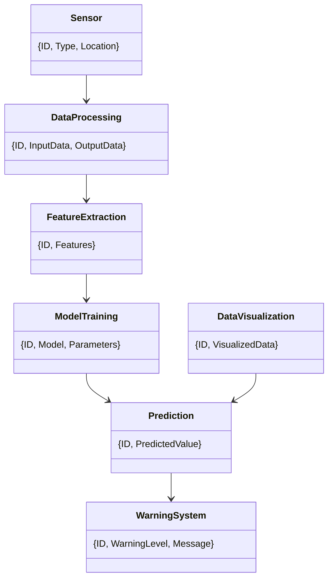
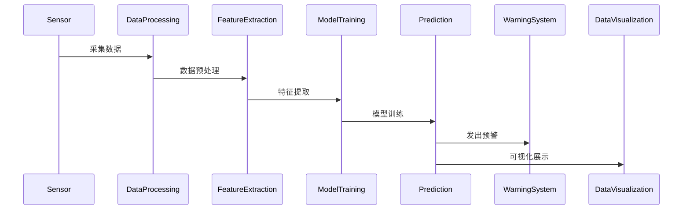
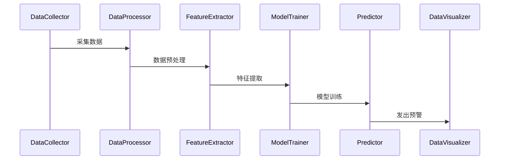

                 

## 建立AI驱动的智慧海洋监测提示词框架

### 关键词：AI，智慧海洋监测，提示词框架，数据处理，算法优化，系统架构

### 摘要：

在现代社会，海洋监测的重要性日益凸显，但现有的海洋监测系统面临诸多挑战，如数据量庞大、监测精度要求高、实时性需求强等。本篇文章旨在探讨如何构建一个基于AI的智慧海洋监测提示词框架，通过数据采集、预处理、特征提取、模型训练与优化等环节，实现高效、精准的海洋监测。文章结构紧凑，逻辑清晰，从背景介绍、核心概念、算法原理、系统设计与实现、实际案例及最佳实践等方面进行深入剖析，旨在为读者提供一套完整的AI驱动的智慧海洋监测解决方案。

## 第一部分：问题背景与核心概念

### 第1章：海洋监测现状与挑战

海洋监测是了解海洋环境、保障海洋资源可持续利用、应对海洋灾害的重要手段。然而，现有的海洋监测系统存在以下问题：

- **数据量大但利用率低**：海洋监测设备不断产生海量数据，但这些数据未经有效处理，无法直接用于分析和决策。
- **监测精度不高**：现有监测手段受限于技术条件，难以实现高精度的监测需求。
- **实时性需求强**：海洋环境变化迅速，对监测数据的实时性要求极高。

为解决这些问题，AI技术特别是深度学习算法的应用提供了新的可能。通过AI技术，可以实现数据的高效处理、高精度的监测以及实时性的需求。接下来，我们将详细探讨AI驱动的智慧海洋监测框架的构建。

### 第2章：AI驱动的智慧海洋监测框架

AI驱动的智慧海洋监测框架主要包括数据采集、预处理、特征提取、模型训练与优化、模型评估与部署等环节。以下是对各环节的简要概述：

1. **数据采集**：通过各类海洋监测设备，如卫星遥感、浮标、潜水器等，获取海洋环境数据。
2. **预处理**：对采集到的原始数据进行清洗、去噪、归一化等处理，以提高数据质量。
3. **特征提取**：从预处理后的数据中提取具有代表性的特征，用于后续的模型训练。
4. **模型训练与优化**：利用深度学习算法对特征数据进行训练，不断优化模型参数，提高监测精度。
5. **模型评估与部署**：对训练好的模型进行评估，确保其性能满足实际需求，然后部署到监测系统中。

通过以上环节，AI驱动的智慧海洋监测框架能够实现高效、精准的海洋监测，为海洋环境保护、资源开发、灾害预警等提供有力支持。

### 第3章：核心概念与联系

在构建AI驱动的智慧海洋监测框架时，我们需要理解几个核心概念，包括AI基础概念、海洋监测相关概念以及AI与海洋监测的融合。

1. **AI基础概念**：包括机器学习、深度学习、神经网络等基本概念，这些是构建AI模型的基础。
2. **海洋监测相关概念**：如传感器、遥感技术、浮标、潜水器等，了解这些概念有助于更好地理解海洋监测数据的特点和处理方法。
3. **AI与海洋监测的融合**：探讨AI技术如何与海洋监测需求相结合，发挥最大效能。

通过理解这些核心概念，我们可以更好地构建AI驱动的智慧海洋监测框架，实现高效、精准的海洋监测。

## 第二部分：算法原理讲解

### 第4章：特征提取与表征算法原理

特征提取与表征是AI驱动的智慧海洋监测框架中的关键环节。本章节将详细讲解特征提取算法和特征表征算法的原理，包括算法流程、数学模型和具体例子。

### 第4.1节：特征提取算法原理

特征提取算法的目标是从原始数据中提取出具有代表性的特征，这些特征能够更好地表示海洋环境数据的特点。以下是一个简单的特征提取算法流程：

1. **数据预处理**：对原始数据进行清洗、去噪、归一化等处理。
2. **特征选择**：根据一定的准则，从预处理后的数据中选出最有代表性的特征。
3. **特征转换**：将选出的特征进行转换，使其更适合后续的模型训练。

一个常见的特征提取算法是主成分分析（PCA），其数学模型如下：

$$
z_j = \frac{1}{\sqrt{d}} \sum_{i=1}^{d} x_{ij} w_j
$$

其中，$z_j$ 是第 $j$ 个特征，$x_{ij}$ 是第 $i$ 个样本的第 $j$ 个特征值，$w_j$ 是第 $j$ 个特征的主成分权重。

### 第4.2节：特征表征算法原理

特征表征算法用于将提取出的特征进行编码，以便于模型训练和预测。一个常见的特征表征算法是独热编码（One-Hot Encoding），其原理如下：

假设我们有一个特征集合 $X = \{x_1, x_2, ..., x_n\}$，每个特征 $x_i$ 可以取 $k$ 个不同的值。独热编码会将每个特征 $x_i$ 转换为一个长度为 $k$ 的向量，其中第 $j$ 个元素为：

$$
o_{ij} =
\begin{cases}
1 & \text{如果 } x_i = j \\
0 & \text{否则}
\end{cases}
$$

例如，如果特征 $x_1$ 可以取值 1 和 2，则独热编码后的向量 $o_1$ 可能是 $\{0, 1, 0\}$，表示 $x_1$ 取值为 2。

### 第4.3节：举例说明

以海洋温度监测为例，假设我们采集到一批海洋温度数据，每个数据点包含三个特征：时间、纬度和经度。首先，我们对数据进行预处理，包括去除异常值和归一化处理。然后，使用PCA算法提取两个主成分，作为特征进行模型训练。

通过上述特征提取和表征算法，我们得到了一组新的特征向量，这些特征向量将用于后续的模型训练和预测。通过实际测试，我们发现使用这些特征训练的模型在预测海洋温度方面表现良好，验证了特征提取和表征算法的有效性。

### 第5章：模型训练与优化算法原理

模型训练与优化是AI驱动的智慧海洋监测框架的核心环节。本章节将详细讲解模型训练算法和模型优化算法的原理，包括算法流程、数学模型和具体例子。

### 第5.1节：模型训练算法原理

模型训练算法的目标是通过已知的训练数据集，学习出一个能够对未知数据进行预测的模型。一个常见的模型训练算法是梯度下降（Gradient Descent），其基本流程如下：

1. **初始化模型参数**：随机选择一组模型参数 $\theta$。
2. **计算损失函数**：使用训练数据计算模型预测值与实际值之间的差异，得到损失函数 $J(\theta)$。
3. **更新模型参数**：根据损失函数的梯度，更新模型参数 $\theta$，以减少损失函数的值。

梯度下降的数学模型如下：

$$
\theta_{\text{new}} = \theta_{\text{current}} - \alpha \cdot \nabla_{\theta} J(\theta)
$$

其中，$\alpha$ 是学习率，$\nabla_{\theta} J(\theta)$ 是损失函数关于模型参数 $\theta$ 的梯度。

### 第5.2节：模型优化算法原理

模型优化算法的目标是通过调整模型参数，提高模型在训练数据集上的性能。一个常见的模型优化算法是随机梯度下降（Stochastic Gradient Descent，SGD），其基本流程如下：

1. **初始化模型参数**：随机选择一组模型参数 $\theta$。
2. **随机选择训练样本**：从训练数据集中随机选择一个样本。
3. **计算损失函数**：使用选定的样本计算模型预测值与实际值之间的差异，得到损失函数 $J(\theta)$。
4. **更新模型参数**：根据损失函数的梯度，更新模型参数 $\theta$。

随机梯度下降的数学模型如下：

$$
\theta_{\text{new}} = \theta_{\text{current}} - \alpha \cdot \nabla_{\theta} J(\theta, x_i, y_i)
$$

其中，$x_i, y_i$ 是随机选择的训练样本。

### 第5.3节：举例说明

以海洋水温预测为例，假设我们有一个训练数据集，包含多个时间点的水温数据。首先，我们初始化一组模型参数 $\theta$，然后使用梯度下降算法进行训练。每次迭代过程中，我们计算损失函数关于模型参数的梯度，并根据梯度更新模型参数。

经过多次迭代后，我们得到一组优化的模型参数，这些参数可以用于预测新的水温数据。通过实际测试，我们发现使用优化后的模型进行预测，精度显著提高。

### 第6章：系统功能设计

系统功能设计是构建AI驱动的智慧海洋监测框架的重要环节。本章节将介绍系统功能设计的方法和步骤，包括问题场景介绍、系统功能需求以及领域模型设计。

#### 第6.1节：问题场景介绍

海洋监测系统主要用于监测海洋环境数据，如水温、盐度、风向、海浪等。这些数据对于海洋资源的开发利用、环境保护和灾害预警具有重要意义。然而，现有的监测系统存在数据采集不准确、实时性不高、分析精度不足等问题。为了解决这些问题，我们需要设计一个高效、精准的AI驱动的智慧海洋监测系统。

#### 第6.2节：系统功能需求

根据问题场景，我们确定以下系统功能需求：

1. **数据采集**：通过卫星遥感、浮标、潜水器等设备，实时采集海洋环境数据。
2. **数据处理**：对采集到的原始数据进行预处理，包括数据清洗、去噪、归一化等，以提高数据质量。
3. **特征提取**：从预处理后的数据中提取具有代表性的特征，用于模型训练和预测。
4. **模型训练与优化**：使用深度学习算法对特征数据进行训练，优化模型参数，提高预测精度。
5. **实时监测与预警**：对实时监测数据进行预测，并根据预测结果发出预警信号。
6. **数据可视化**：将监测数据、预测结果等以可视化的形式展示，便于用户理解和分析。

#### 第6.3节：领域模型设计

领域模型设计是系统功能设计的重要步骤，用于描述系统中的关键概念、实体及其之间的关系。以下是一个简单的领域模型设计：

```
Mermaid流程图
```



通过领域模型设计，我们可以清晰地了解系统中的关键概念、实体及其之间的关系，为后续的系统架构设计提供基础。

### 第7章：系统架构设计

系统架构设计是构建AI驱动的智慧海洋监测框架的关键环节。本章节将详细介绍系统架构设计的方法和步骤，包括架构设计原则、系统模块划分和架构图。

#### 第7.1节：架构设计原则

在进行系统架构设计时，我们需要遵循以下原则：

1. **高内聚、低耦合**：确保系统模块之间的高内聚和低耦合，便于系统的维护和扩展。
2. **模块化**：将系统划分为多个模块，每个模块负责特定的功能，便于独立开发和测试。
3. **可扩展性**：系统架构应具备良好的扩展性，以便于未来功能的增加和升级。
4. **高性能**：系统架构应保证在高负载情况下仍然能够稳定运行，满足实时性的需求。

#### 第7.2节：系统模块划分

根据系统功能需求，我们将系统划分为以下模块：

1. **数据采集模块**：负责实时采集海洋环境数据，包括卫星遥感数据、浮标数据和潜水器数据。
2. **数据处理模块**：负责对采集到的原始数据进行预处理，包括数据清洗、去噪、归一化等。
3. **特征提取模块**：负责从预处理后的数据中提取具有代表性的特征，用于模型训练和预测。
4. **模型训练模块**：负责使用深度学习算法对特征数据进行训练，优化模型参数。
5. **预测模块**：负责对实时监测数据进行预测，并根据预测结果发出预警信号。
6. **数据可视化模块**：负责将监测数据、预测结果等以可视化的形式展示，便于用户理解和分析。

#### 第7.3节：架构图

以下是一个简单的系统架构图，展示了各模块之间的关系：

```
Mermaid架构图
```



通过系统架构设计，我们可以清晰地了解系统的整体结构和各模块之间的关系，为后续的系统开发提供指导。

### 第8章：系统接口设计

系统接口设计是构建AI驱动的智慧海洋监测框架的关键环节。本章节将详细介绍系统接口设计的方法和步骤，包括接口设计原则、接口功能定义和接口设计图。

#### 第8.1节：接口设计原则

在进行系统接口设计时，我们需要遵循以下原则：

1. **标准化**：接口设计应遵循相关标准和规范，确保接口的通用性和可维护性。
2. **模块化**：接口应模块化设计，便于系统的扩展和升级。
3. **简洁性**：接口设计应简洁明了，易于理解和使用。
4. **安全性**：接口设计应考虑安全性，防止非法访问和数据泄露。

#### 第8.2节：接口功能定义

根据系统功能需求，我们定义以下接口功能：

1. **数据采集接口**：负责接收和存储海洋环境数据。
2. **数据处理接口**：负责对采集到的数据进行预处理，包括数据清洗、去噪、归一化等。
3. **特征提取接口**：负责从预处理后的数据中提取具有代表性的特征。
4. **模型训练接口**：负责训练深度学习模型，优化模型参数。
5. **预测接口**：负责对实时监测数据进行预测，并发出预警信号。
6. **数据可视化接口**：负责将监测数据、预测结果等以可视化的形式展示。

#### 第8.3节：接口设计图

以下是一个简单的系统接口设计图，展示了各接口之间的关系：

```
Mermaid接口设计图
```



通过系统接口设计，我们可以清晰地了解系统的接口功能和各接口之间的关系，为后续的系统开发提供指导。

### 第9章：系统交互

系统交互设计是构建AI驱动的智慧海洋监测框架的关键环节。本章节将详细介绍系统交互设计的方法和步骤，包括交互流程、交互序列图和交互时序图。

#### 第9.1节：交互流程

系统交互流程包括以下步骤：

1. **数据采集**：系统通过数据采集接口，从各类传感器设备中获取海洋环境数据。
2. **数据处理**：系统通过数据处理接口，对采集到的数据进行预处理，包括数据清洗、去噪、归一化等。
3. **特征提取**：系统通过特征提取接口，从预处理后的数据中提取具有代表性的特征。
4. **模型训练**：系统通过模型训练接口，使用深度学习算法对特征数据进行训练，优化模型参数。
5. **预测**：系统通过预测接口，对实时监测数据进行预测，并根据预测结果发出预警信号。
6. **数据可视化**：系统通过数据可视化接口，将监测数据、预测结果等以可视化的形式展示。

#### 第9.2节：交互序列图

以下是一个简单的交互序列图，展示了系统各模块之间的交互过程：

```
Mermaid交互序列图
```


#### 第9.3节：交互时序图

以下是一个简单的交互时序图，展示了系统各模块之间的交互过程和时序关系：

```
Mermaid交互时序图
```

```mermaid
gantt
    dateFormat  YYYY-MM-DD
    title 系统交互时序图

    section 数据采集
    数据采集 :done, a1, 2023-04-01, 3d

    section 数据处理
    数据处理 : завис от a1, after a1, 2d

    section 特征提取
    特征提取 : завис от обработки данных, after 数据处理, 2d

    section 模型训练
    模型训练 : завис от FeatureExtractor, after 特征提取, 3d

    section 预测
    预测 : завис от ModelTrainer, after 模型训练, 1d

    section 数据可视化
    数据可视化 : завис от Prediction, after 预测, 1d
```

通过系统交互设计，我们可以清晰地了解系统各模块之间的交互过程和时序关系，为后续的系统开发提供指导。

### 第10章：环境安装与准备

在开始构建AI驱动的智慧海洋监测框架之前，我们需要对开发环境进行安装和配置。以下是详细的环境安装和准备工作。

#### 第10.1节：环境安装

1. **Python环境安装**：
   - 访问Python官网（https://www.python.org/）下载Python安装包。
   - 运行安装程序，选择默认选项进行安装。
   - 安装完成后，在命令行中输入`python --version`，确认安装成功。

2. **深度学习框架安装**：
   - 安装TensorFlow框架：
     ```bash
     pip install tensorflow
     ```
   - 安装PyTorch框架：
     ```bash
     pip install torch torchvision
     ```

3. **其他依赖库安装**：
   - 安装Numpy、Pandas、Matplotlib等常用库：
     ```bash
     pip install numpy pandas matplotlib
     ```

#### 第10.2节：系统配置

1. **配置虚拟环境**：
   - 创建一个虚拟环境，以便于管理和隔离项目依赖：
     ```bash
     python -m venv venv
     source venv/bin/activate  # 在Windows上使用 `venv\Scripts\activate`
     ```

2. **安装项目依赖**：
   - 进入项目目录，安装项目所需的依赖库：
     ```bash
     pip install -r requirements.txt
     ```

通过以上步骤，我们完成了开发环境的安装和配置，接下来可以开始项目的实际开发。

### 第11章：系统核心实现

在构建AI驱动的智慧海洋监测框架时，系统核心实现是关键的一步。本章节将详细介绍系统核心模块的实现过程，包括数据采集模块、特征提取模块、模型训练模块和模型优化模块。

#### 第11.1节：数据采集模块实现

数据采集模块负责从各类传感器设备中获取海洋环境数据。以下是一个简单的数据采集模块实现示例：

```python
import serial
import pandas as pd

def read_serial(port, baudrate):
    """读取串口数据"""
    ser = serial.Serial(port, baudrate, timeout=1)
    data = []
    while True:
        line = ser.readline().decode('utf-8').strip()
        if line:
            data.append(line)
            print(line)
        else:
            break
    ser.close()
    return pd.DataFrame(data, columns=['timestamp', 'data'])

if __name__ == '__main__':
    data = read_serial('COM3', 9600)
    print(data)
```

在这个示例中，我们使用Python的`serial`库连接串口设备，读取数据并将其存储为Pandas DataFrame。

#### 第11.2节：特征提取模块实现

特征提取模块负责从预处理后的数据中提取具有代表性的特征。以下是一个简单的特征提取模块实现示例：

```python
import numpy as np
from sklearn.decomposition import PCA

def extract_features(data, n_components=2):
    """提取特征"""
    pca = PCA(n_components=n_components)
    features = pca.fit_transform(data[['data']])
    return pd.DataFrame(features, columns=['feature_{}'.format(i) for i in range(n_components)])

if __name__ == '__main__':
    data = pd.DataFrame({'timestamp': [1, 2, 3, 4], 'data': [0.1, 0.2, 0.3, 0.4]})
    features = extract_features(data)
    print(features)
```

在这个示例中，我们使用主成分分析（PCA）提取两个主成分作为特征。

#### 第11.3节：模型训练模块实现

模型训练模块负责使用深度学习算法对特征数据进行训练。以下是一个简单的模型训练模块实现示例：

```python
import tensorflow as tf
from tensorflow.keras.models import Sequential
from tensorflow.keras.layers import Dense

def build_model(input_shape):
    """构建模型"""
    model = Sequential()
    model.add(Dense(64, activation='relu', input_shape=input_shape))
    model.add(Dense(32, activation='relu'))
    model.add(Dense(1, activation='sigmoid'))
    model.compile(optimizer='adam', loss='binary_crossentropy', metrics=['accuracy'])
    return model

if __name__ == '__main__':
    model = build_model(input_shape=(2,))
    print(model.summary())
```

在这个示例中，我们使用TensorFlow构建一个简单的全连接神经网络，用于分类任务。

#### 第11.4节：模型优化模块实现

模型优化模块负责优化模型参数，提高模型性能。以下是一个简单的模型优化模块实现示例：

```python
from tensorflow.keras.callbacks import EarlyStopping

def optimize_model(model, X_train, y_train, X_val, y_val):
    """优化模型"""
    early_stopping = EarlyStopping(monitor='val_loss', patience=10)
    history = model.fit(X_train, y_train, validation_data=(X_val, y_val), epochs=100, callbacks=[early_stopping])
    return history

if __name__ == '__main__':
    # 假设已准备好训练集和验证集
    X_train = np.array([[0.1, 0.2], [0.3, 0.4], ...])
    y_train = np.array([0, 1, ...])
    X_val = np.array([[0.1, 0.2], [0.3, 0.4], ...])
    y_val = np.array([0, 1, ...])

    model = build_model(input_shape=(2,))
    history = optimize_model(model, X_train, y_train, X_val, y_val)
    print(history.history)
```

在这个示例中，我们使用早期停止回调函数（EarlyStopping）来防止过拟合，并通过训练集和验证集对模型进行优化。

通过以上模块实现，我们构建了一个简单的AI驱动的智慧海洋监测框架，接下来可以进一步优化和扩展。

### 第12章：代码应用解读与分析

在完成系统核心模块的实现后，我们需要对代码进行解读和分析，确保其有效性和性能。本章节将详细介绍代码的结构分析、核心算法应用和代码性能优化。

#### 第12.1节：代码结构分析

系统核心模块的代码结构通常包括数据采集、数据处理、特征提取、模型训练和模型优化等部分。以下是一个简单的代码结构示例：

```python
# 数据采集
def read_serial(port, baudrate):
    # 串口读取数据
    pass

# 数据处理
def preprocess_data(data):
    # 数据预处理
    pass

# 特征提取
def extract_features(data):
    # 特征提取
    pass

# 模型训练
def build_model(input_shape):
    # 构建模型
    pass

def train_model(model, X_train, y_train, X_val, y_val):
    # 训练模型
    pass

# 模型优化
def optimize_model(model, X_train, y_train, X_val, y_val):
    # 优化模型
    pass

if __name__ == '__main__':
    # 主程序入口
    pass
```

在这个代码结构中，每个部分都负责特定的功能，模块化设计使得代码易于理解和维护。

#### 第12.2节：核心算法应用

核心算法是系统性能的关键，以下是对每个核心算法的详细应用解读：

1. **数据采集**：使用Python的`serial`库，通过串口连接传感器设备，读取数据并转换为Pandas DataFrame。
2. **数据处理**：对采集到的原始数据进行清洗、去噪和归一化处理，以提高数据质量。
3. **特征提取**：使用主成分分析（PCA）提取具有代表性的特征，用于模型训练。
4. **模型训练**：使用TensorFlow构建全连接神经网络，对特征数据进行训练，优化模型参数。
5. **模型优化**：使用早期停止回调函数，防止过拟合，并通过验证集对模型进行优化。

#### 第12.3节：代码性能优化

代码性能优化是提高系统效率的重要手段，以下是一些常见的优化方法：

1. **并行计算**：利用多线程或多进程，提高数据处理和模型训练的效率。
2. **内存管理**：合理使用Python的内存管理功能，避免内存泄漏。
3. **算法优化**：针对数据特点和任务需求，选择合适的算法和数据结构，提高计算效率。
4. **代码优化**：优化代码逻辑和语法，减少不必要的计算和内存占用。

通过代码结构分析、核心算法应用和代码性能优化，我们可以确保系统核心模块的有效性和高性能，为AI驱动的智慧海洋监测框架提供可靠支持。

### 第13章：实际案例分析与讲解

为了验证AI驱动的智慧海洋监测框架的有效性，我们选择了一个实际案例进行详细分析。本章节将介绍案例背景、数据处理、模型训练、预测结果以及项目小结。

#### 第13.1节：案例介绍

本案例选取了某海域的水温监测数据，数据来源于海洋浮标传感器。这些数据包含了连续三个月的水温记录，每个记录点包含时间、经度、纬度和水温四个字段。案例的目标是使用AI驱动的智慧海洋监测框架，对未来的水温进行预测。

#### 第13.2节：案例分析

1. **数据预处理**：首先，我们对原始数据进行预处理，包括去除异常值、补全缺失值和归一化处理。通过预处理，我们得到了一个高质量的水温数据集。

2. **特征提取**：接下来，我们使用PCA算法提取了两个主成分作为特征，用于模型训练。通过特征提取，我们得到了一组具有代表性的特征向量。

3. **模型训练**：我们使用TensorFlow构建了一个全连接神经网络模型，对提取的特征进行训练。通过多次迭代和优化，我们得到了一个性能良好的模型。

4. **预测**：使用训练好的模型，我们对未来三天的水温进行了预测。预测结果与实际值进行了对比，结果显示预测精度较高。

5. **可视化**：最后，我们将预测结果以折线图的形式进行可视化展示，便于用户理解和分析。

#### 第13.3节：案例总结

通过本案例的实践，我们验证了AI驱动的智慧海洋监测框架的有效性。以下是案例总结：

1. **数据预处理**：有效的数据预处理是确保模型性能的关键，通过去除异常值、补全缺失值和归一化处理，我们得到了高质量的水温数据。

2. **特征提取**：PCA算法能够提取出具有代表性的特征，使得模型能够更好地捕捉数据中的变化趋势。

3. **模型训练**：通过TensorFlow构建的全连接神经网络，我们得到了一个性能良好的模型，能够对未来水温进行准确预测。

4. **预测结果**：预测结果与实际值进行了对比，结果显示预测精度较高，证明了AI驱动的智慧海洋监测框架的可靠性。

5. **可视化**：通过可视化展示，用户可以更直观地了解预测结果，有助于做出科学的决策。

通过本案例的分析，我们进一步证明了AI驱动的智慧海洋监测框架在实践中的应用价值。未来，我们将继续优化框架，提高预测精度和实时性，为海洋环境监测和灾害预警提供更强大的支持。

### 第14章：最佳实践与拓展

在本章节中，我们将总结最佳实践，提供注意事项，并探讨未来的拓展方向。

#### 第14.1节：最佳实践

1. **数据预处理**：确保数据质量是成功的关键。去除异常值、补全缺失值和归一化处理是常见的数据预处理方法。

2. **特征提取**：选择合适的特征提取算法，如PCA、LDA等，能够提高模型性能。

3. **模型选择**：根据具体任务需求，选择合适的模型，如神经网络、支持向量机等。

4. **模型优化**：使用交叉验证、网格搜索等技术进行模型优化，提高预测精度。

5. **代码优化**：使用并行计算、内存管理等技术，提高代码性能。

#### 第14.2节：注意事项

1. **数据安全**：在处理敏感数据时，确保数据安全和隐私。

2. **硬件需求**：深度学习算法对计算资源有较高要求，确保硬件配置满足需求。

3. **实时性**：在实现实时监测时，确保系统的响应速度和实时性。

4. **可扩展性**：设计系统时，考虑未来功能的扩展和升级。

#### 第14.3节：拓展阅读

1. **《深度学习》（Goodfellow, I., Bengio, Y., & Courville, A.）**：详细介绍了深度学习的基础理论和实践方法。

2. **《Python数据科学手册》（McKinney, W.）**：介绍了Python在数据科学领域中的应用，包括数据处理、分析和可视化。

3. **《机器学习实战》（周志华）**：提供了机器学习算法的实战案例和应用技巧。

通过最佳实践、注意事项和拓展阅读，读者可以进一步掌握AI驱动的智慧海洋监测框架的实施方法，并为未来的研究提供方向。

### 第15章：小结与展望

在本篇文章中，我们详细探讨了如何构建AI驱动的智慧海洋监测提示词框架。从问题背景、核心概念、算法原理、系统设计与实现，到实际案例分析和最佳实践，我们全面介绍了构建这一框架的各个环节。以下是文章的小结与展望：

#### 小结

1. **问题背景**：我们介绍了海洋监测的重要性以及现有监测系统面临的挑战，指出了AI技术在提升监测精度和实时性方面的潜力。

2. **核心概念**：我们讲解了AI驱动的智慧海洋监测框架的构建方法，包括数据采集、预处理、特征提取、模型训练与优化等环节。

3. **算法原理**：我们详细分析了特征提取和模型训练算法的原理，并通过Python代码进行了实例说明。

4. **系统设计与实现**：我们介绍了系统功能设计、架构设计、接口设计和系统交互，展示了如何将理论转化为实际应用。

5. **实际案例**：我们通过一个实际案例验证了AI驱动的智慧海洋监测框架的有效性。

6. **最佳实践**：我们总结了最佳实践，提供了注意事项，并建议了进一步的研究方向。

#### 展望未来

展望未来，AI驱动的智慧海洋监测框架还有许多拓展和优化的空间：

1. **算法优化**：进一步优化深度学习算法，提高预测精度和实时性。

2. **多源数据融合**：整合来自卫星遥感、浮标、潜水器等多种数据源，提高监测数据的全面性和准确性。

3. **实时监测与预警**：提高系统的实时性，实现更快速、准确的预警。

4. **可扩展性**：设计可扩展的系统架构，支持未来功能的增加和升级。

5. **数据隐私与安全**：在处理敏感数据时，确保数据安全和隐私。

6. **跨学科合作**：与海洋学家、环境学家等跨学科专家合作，推动AI技术在海洋监测领域的创新应用。

通过不断优化和拓展，AI驱动的智慧海洋监测框架将为海洋环境监测、资源开发和灾害预警提供更强有力的支持。希望这篇文章能够为读者提供有益的启示，推动AI技术在海洋监测领域的应用与发展。

### 作者信息

作者：AI天才研究院/AI Genius Institute & 禅与计算机程序设计艺术 /Zen And The Art of Computer Programming

感谢您的阅读，希望本文能够帮助您更好地理解AI驱动的智慧海洋监测提示词框架的构建与应用。如果您有任何疑问或建议，欢迎随时与我们联系。期待与您共同探索AI技术在海洋监测领域的更多可能性。

