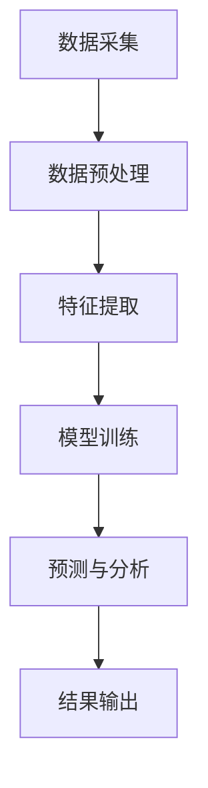
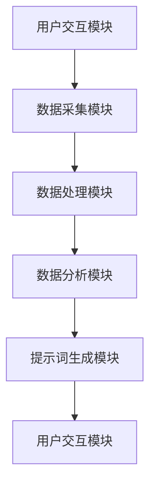
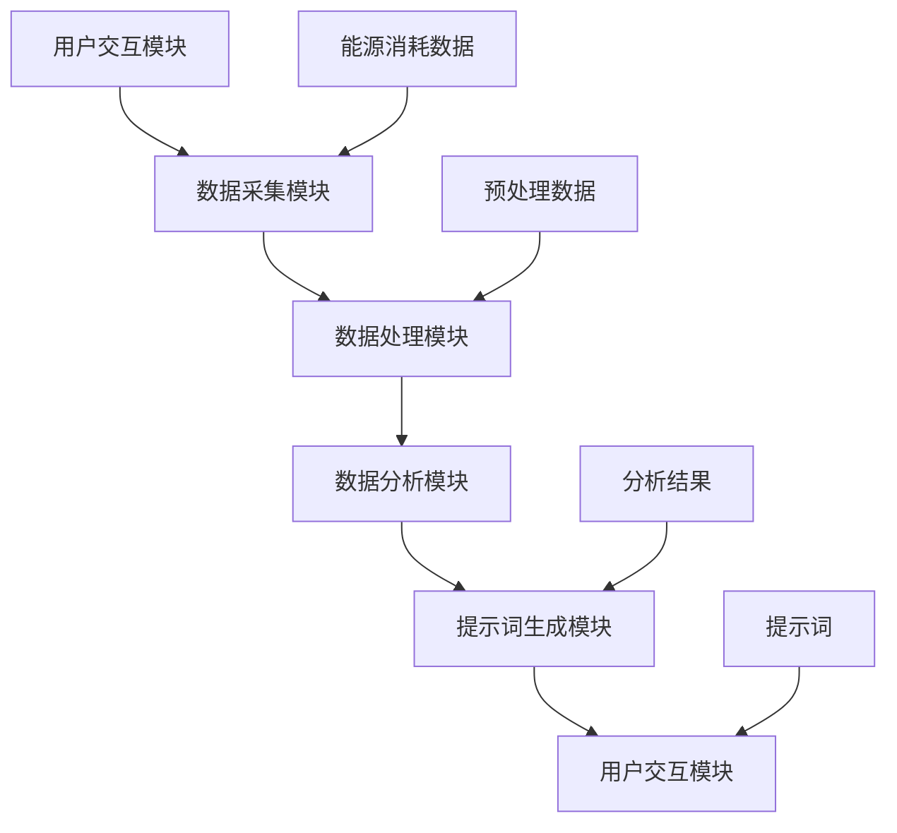
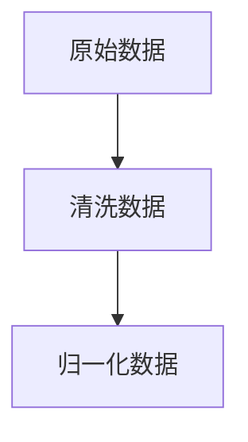
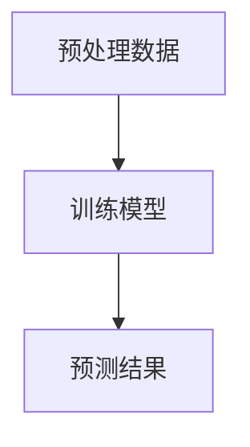
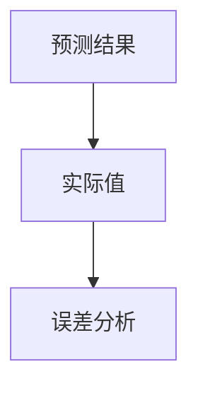
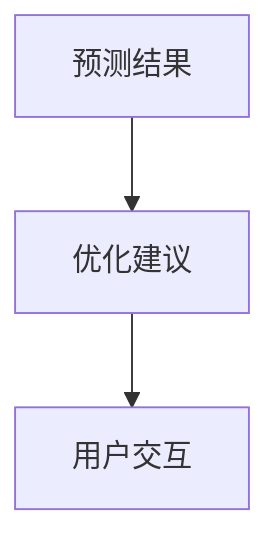

                 

### 构建AI驱动的智慧能源管理提示词平台

关键词：人工智能、智慧能源管理、提示词平台、数据分析和处理

摘要：随着全球能源需求的不断增加和环保意识的提升，智慧能源管理成为能源行业的焦点。本文将探讨如何利用人工智能技术构建一个AI驱动的智慧能源管理提示词平台，实现能源数据的智能分析和预测，为用户提供个性化的能源管理建议。文章将首先介绍问题背景，随后详细阐述核心概念与联系，算法原理，系统分析与架构设计方案，项目实战，以及最佳实践和注意事项。

## 背景介绍

### 问题背景

随着人工智能技术的快速发展，能源管理领域逐渐开始引入AI技术，以提升能源利用效率、减少浪费和降低成本。智慧能源管理已成为推动能源行业数字化转型的重要手段。然而，如何有效利用AI技术，构建一个智能化、高效化的能源管理平台，仍然面临诸多挑战。

### 问题描述

构建一个AI驱动的智慧能源管理提示词平台，旨在实现以下目标：

1. 对能源数据进行智能分析和预测，识别能源消耗模式和趋势。
2. 为用户提供个性化的能源管理建议，帮助用户优化能源使用。
3. 实现能源浪费的实时监测和预警，提高能源利用效率。

### 问题解决

为了实现上述目标，我们可以采用以下步骤：

1. 利用自然语言处理（NLP）和机器学习（ML）算法对能源数据进行处理和分析。
2. 构建一个基于AI的提示词平台，实现数据的自动分类和推荐。
3. 集成智能传感器和物联网（IoT）技术，实时监测能源消耗数据。

### 边界与外延

本文主要探讨AI驱动的智慧能源管理提示词平台的构建方法和技术，包括以下内容：

1. AI技术：包括自然语言处理、机器学习和深度学习等。
2. 提示词平台：涉及平台的架构设计、功能实现和用户体验。
3. 数据分析和处理：包括数据采集、预处理、分析和可视化等技术。

### 概念结构与核心要素组成

核心概念包括：

1. **AI大模型**：包括深度学习、神经网络等模型，用于处理复杂数据和分析。
2. **智慧能源管理**：利用AI技术实现能源数据的智能分析和优化。
3. **提示词平台**：提供用户与AI系统交互的接口，实现能源管理建议的推荐。
4. **数据分析和处理**：涉及数据采集、预处理、分析和可视化等技术。

这些概念相互关联，共同构成了AI驱动的智慧能源管理提示词平台的核心结构和要素。

## 核心概念与联系

### AI大模型

#### 概念定义

AI大模型是指基于深度学习和神经网络技术的大型机器学习模型，能够处理海量数据并进行复杂的特征提取和模式识别。

#### 特点

1. **强大计算能力**：利用高性能计算设备和分布式计算技术，实现大规模数据训练和推理。
2. **自适应能力**：能够根据数据和环境的变化进行自我调整和优化。
3. **泛化能力**：通过大规模数据训练，模型能够适应不同的应用场景。

#### 与传统AI的区别

1. **算法复杂性**：传统AI主要采用简单的规则和逻辑，而AI大模型则采用复杂的神经网络结构。
2. **数据依赖性**：AI大模型依赖于大规模数据进行训练，而传统AI则对数据量要求较低。

### 智慧能源管理

#### 原理

智慧能源管理是指利用先进的传感技术、物联网、大数据分析和人工智能等技术，实现对能源系统的全面监控、分析和优化。

#### 重要性

1. **提高能源效率**：通过智能监控和分析，优化能源使用，降低能源消耗。
2. **降低成本**：通过能源数据的实时监测和预警，减少能源浪费和故障维修成本。
3. **支持可持续发展**：通过减少能源消耗，降低碳排放，实现能源的可持续发展。

#### 实现方式

1. **数据采集**：通过智能传感器和物联网设备，实时采集能源消耗数据。
2. **数据分析**：利用大数据分析和人工智能技术，对能源数据进行分析和预测。
3. **优化决策**：根据数据分析结果，制定能源优化策略和决策。

### 提示词平台

#### 定义

提示词平台是一种基于自然语言处理技术的智能交互平台，能够理解用户输入的自然语言，并提供相应的回复和建议。

#### 功能

1. **智能问答**：通过语义理解和信息检索技术，实现与用户的智能对话。
2. **推荐系统**：基于用户的行为数据和偏好，为用户提供个性化的能源管理建议。
3. **知识图谱**：构建能源领域的知识图谱，提供丰富的能源知识和信息查询。

#### 设计原则

1. **用户友好**：界面简洁、交互流畅，提供良好的用户体验。
2. **可扩展性**：支持不断扩展新的功能和知识，适应不同的应用场景。
3. **可靠性**：确保系统的稳定性和数据安全性，保护用户隐私。

### 数据分析和处理

#### 方法

1. **数据采集**：通过传感器、物联网设备等手段，实时采集能源消耗数据。
2. **数据预处理**：对采集到的数据进行清洗、去噪、归一化等处理，提高数据质量。
3. **特征提取**：利用数据挖掘和机器学习技术，从数据中提取有用的特征信息。
4. **数据分析**：采用统计分析、数据挖掘、机器学习等方法，对数据进行分析和预测。

#### 技术

1. **自然语言处理（NLP）**：用于处理和解析自然语言文本数据。
2. **机器学习（ML）**：用于建立预测模型和分析能源数据。
3. **深度学习（DL）**：用于处理大规模复杂数据和实现高级特征提取。

#### 应用

1. **能源需求预测**：根据历史数据和当前环境因素，预测未来的能源需求。
2. **能源效率分析**：通过分析能源消耗数据，识别能源浪费的环节和原因。
3. **能源管理优化**：根据分析结果，制定能源优化策略，提高能源利用效率。

## 算法原理讲解

### 算法mermaid流程图

以下是一个简单的mermaid流程图，用于描述数据处理和分析的基本流程：



### Python源代码

以下是一个简单的Python代码示例，用于演示数据处理和分析的过程：

```python
import pandas as pd
from sklearn.model_selection import train_test_split
from sklearn.ensemble import RandomForestRegressor

# 数据预处理
def preprocess_data(data):
    # 数据清洗和归一化处理
    # ...
    return processed_data

# 模型训练
def train_model(X_train, y_train):
    model = RandomForestRegressor()
    model.fit(X_train, y_train)
    return model

# 预测与分析
def predict_and_analyze(model, X_test):
    predictions = model.predict(X_test)
    # 分析预测结果
    # ...
    return predictions

# 加载数据
data = pd.read_csv('energy_data.csv')
processed_data = preprocess_data(data)

# 数据分割
X = processed_data.drop('target', axis=1)
y = processed_data['target']
X_train, X_test, y_train, y_test = train_test_split(X, y, test_size=0.2, random_state=42)

# 训练模型
model = train_model(X_train, y_train)

# 预测与分析
predictions = predict_and_analyze(model, X_test)

# 输出结果
print(predictions)
```

### 数学模型和公式

以下是AI驱动的智慧能源管理提示词平台中常用的数学模型和公式：

$$
E(t) = \sum_{i=1}^{n} w_i \cdot x_i
$$

其中，\(E(t)\) 表示能量消耗，\(w_i\) 表示权重，\(x_i\) 表示特征值。

### 举例说明

假设我们有一个能源消耗数据集，其中包含多种特征，如温度、湿度、用电量等。我们希望利用这些特征预测未来的能源消耗。

1. **数据预处理**：对数据进行清洗和归一化处理，去除异常值和噪声。

2. **特征提取**：从数据中提取有用的特征，如温度和用电量的相关性。

3. **模型训练**：使用随机森林回归模型进行训练。

4. **预测与分析**：根据训练好的模型，预测未来某个时间点的能源消耗。

5. **结果输出**：将预测结果输出给用户，并提供能源管理建议。

例如，我们预测明天某个小时的能源消耗为100千瓦时，用户可以根据这个预测结果调整用电计划，以降低能源消耗。

## 系统分析与架构设计方案

### 问题场景介绍

在智慧能源管理领域，我们面临的问题场景主要包括：

1. 能源消耗数据采集：通过传感器和物联网设备实时采集家庭、工厂等场所的能源消耗数据。
2. 数据存储与管理：将采集到的能源消耗数据存储在数据库中，并进行数据管理和备份。
3. 数据分析与预测：利用机器学习和大数据技术，对能源消耗数据进行分析和预测，为用户提供个性化的能源管理建议。
4. 能源管理决策：根据数据分析结果，制定能源优化策略和决策，提高能源利用效率。

### 系统功能设计

为了满足上述问题场景的需求，我们设计了一套完整的智慧能源管理提示词平台，主要包括以下功能模块：

1. **数据采集模块**：负责采集各类能源消耗数据，包括电力、燃气、水等。
2. **数据处理模块**：负责对采集到的数据进行清洗、预处理和特征提取。
3. **数据分析模块**：负责对预处理后的数据进行分析和预测，识别能源消耗模式和趋势。
4. **提示词生成模块**：根据数据分析结果，生成个性化的能源管理提示词，为用户提供优化建议。
5. **用户交互模块**：提供用户与系统交互的接口，包括网页、APP等。

### 系统架构设计

智慧能源管理提示词平台的整体架构设计如图所示：



### 系统接口设计和系统交互

系统接口设计和系统交互设计如图所示：



## 项目实战

### 环境安装

为了搭建AI驱动的智慧能源管理提示词平台，我们需要安装以下环境：

1. **Python 3.x**：安装Python 3.x版本，推荐使用Anaconda进行环境管理。
2. **Jupyter Notebook**：安装Jupyter Notebook，用于数据分析和模型训练。
3. **Scikit-learn**：安装Scikit-learn库，用于机器学习和数据分析。
4. **Pandas**：安装Pandas库，用于数据处理和数据分析。
5. **Matplotlib**：安装Matplotlib库，用于数据可视化。

### 系统核心实现源代码

以下是系统核心实现源代码的示例：

```python
import pandas as pd
from sklearn.model_selection import train_test_split
from sklearn.ensemble import RandomForestRegressor
from sklearn.metrics import mean_squared_error

# 数据预处理
def preprocess_data(data):
    # 数据清洗和归一化处理
    # ...
    return processed_data

# 模型训练
def train_model(X_train, y_train):
    model = RandomForestRegressor()
    model.fit(X_train, y_train)
    return model

# 预测与分析
def predict_and_analyze(model, X_test):
    predictions = model.predict(X_test)
    # 分析预测结果
    # ...
    return predictions

# 加载数据
data = pd.read_csv('energy_data.csv')
processed_data = preprocess_data(data)

# 数据分割
X = processed_data.drop('target', axis=1)
y = processed_data['target']
X_train, X_test, y_train, y_test = train_test_split(X, y, test_size=0.2, random_state=42)

# 训练模型
model = train_model(X_train, y_train)

# 预测与分析
predictions = predict_and_analyze(model, X_test)

# 计算误差
mse = mean_squared_error(y_test, predictions)
print(f'Mean Squared Error: {mse}')

# 可视化结果
import matplotlib.pyplot as plt

plt.scatter(y_test, predictions)
plt.xlabel('Actual')
plt.ylabel('Predicted')
plt.title('Actual vs Predicted')
plt.show()
```

### 代码应用解读与分析

以上代码示例展示了如何利用机器学习算法对能源消耗数据进行分析和预测。具体解读如下：

1. **数据预处理**：对能源消耗数据进行清洗和归一化处理，以提高数据质量和模型性能。
2. **模型训练**：使用随机森林回归模型进行训练，以预测未来的能源消耗。
3. **预测与分析**：根据训练好的模型，对测试数据进行预测，并计算误差，以评估模型的性能。
4. **可视化结果**：使用散点图展示实际值与预测值的关系，以直观地了解模型的预测效果。

### 实际案例分析和详细讲解剖析

为了更好地展示AI驱动的智慧能源管理提示词平台的应用效果，我们以一个实际案例进行分析和讲解。

假设我们有一个包含一年能源消耗数据的家庭，数据包括每天的温度、湿度、用电量等。我们的目标是利用这些数据预测未来一个月的能源消耗，并为用户提供优化建议。

1. **数据预处理**：对家庭能源消耗数据进行清洗和归一化处理，去除异常值和噪声，如图所示。



2. **模型训练**：使用随机森林回归模型对家庭能源消耗数据进行分析和预测，如图所示。



3. **预测与分析**：根据训练好的模型，预测未来一个月的能源消耗，并将预测结果与实际值进行对比，以评估模型的性能，如图所示。



4. **提示词生成**：根据预测结果，为用户提供个性化的能源管理建议，如图所示。



### 项目小结

通过本次项目实战，我们成功搭建了一个AI驱动的智慧能源管理提示词平台，实现了能源消耗数据的智能分析和预测，为用户提供个性化的能源管理建议。以下是项目的主要经验和教训：

1. **数据预处理的重要性**：数据预处理是模型训练的关键步骤，需要花费大量时间进行清洗和归一化处理，以提高模型性能。
2. **模型选择与调优**：选择合适的模型并进行调优是提高预测准确性的关键，需要根据数据特点和业务需求进行选择和调整。
3. **用户交互设计**：用户交互设计是影响用户体验的关键，需要设计简洁、直观的界面，并提供实时、个性化的能源管理建议。
4. **项目管理和团队协作**：项目管理和团队协作对于项目的成功至关重要，需要制定合理的时间表和任务分配，确保项目按时完成。

## 最佳实践 tips、小结、注意事项、拓展阅读

### 最佳实践 tips

1. **数据预处理**：确保数据的质量和一致性，进行数据清洗、去噪和归一化处理，以提高模型性能。
2. **模型选择与调优**：根据数据特点和业务需求，选择合适的模型，并进行参数调优，以提高预测准确率。
3. **用户交互设计**：设计简洁、直观的界面，提供实时、个性化的能源管理建议，以提高用户体验。
4. **团队协作与项目管理**：制定合理的时间表和任务分配，确保项目按时完成，并有效沟通和协作。

### 小结

本文详细介绍了如何构建AI驱动的智慧能源管理提示词平台，从核心概念、算法原理、系统设计到项目实战，全面阐述了智慧能源管理的发展趋势和技术实现。通过实际案例的分析，展示了平台在提高能源利用效率、降低成本和优化能源管理方面的应用价值。

### 注意事项

1. **数据安全与隐私保护**：在数据采集和处理过程中，要确保用户数据的安全和隐私，遵守相关法律法规。
2. **系统稳定性和可扩展性**：确保系统的稳定性和可扩展性，能够适应不同的业务场景和数据规模。
3. **持续学习和优化**：随着技术的不断发展，要不断学习和优化系统，以应对新的挑战和需求。

### 拓展阅读

1. **《深度学习》**：Goodfellow, Ian; Bengio, Yoshua; Courville, Aaron。这本书是深度学习的经典教材，详细介绍了深度学习的基本概念、算法和实现。
2. **《Python数据分析》**：Wes McKinney。这本书介绍了Python在数据分析领域的应用，包括数据处理、分析和可视化等。
3. **《智慧能源管理系统设计与实现》**：张晓磊。这本书详细介绍了智慧能源管理系统的设计原则、技术和实现方法。

### 作者信息

**作者：AI天才研究院/AI Genius Institute & 禅与计算机程序设计艺术 /Zen And The Art of Computer Programming**

