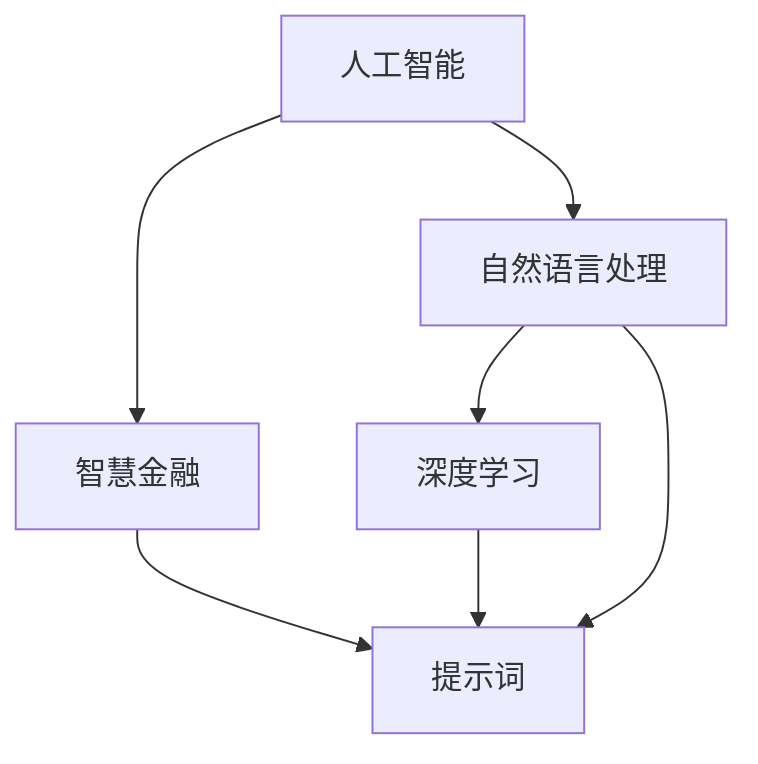
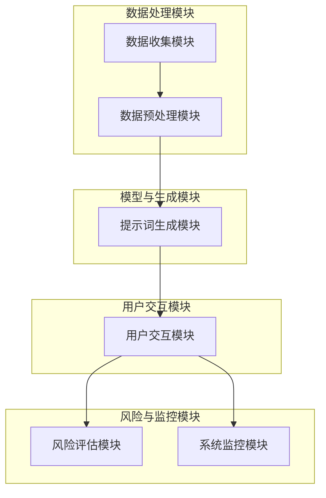

                 

### 1.1 问题背景

随着全球金融市场的快速发展，金融行业的数据量呈爆炸式增长，金融信息的复杂度和多样性也在不断增加。在此背景下，传统的金融分析方法和工具已无法满足现代金融业务的需求，金融行业急需更加智能化、高效化的解决方案。人工智能（AI）作为一种强大的计算工具，凭借其强大的数据处理和分析能力，在金融行业中得到了广泛的应用和重视。

智慧金融是指利用人工智能、大数据、区块链等先进技术，实现金融服务的智能化、自动化和个性化。AI驱动的智慧金融提示词框架是智慧金融的重要组成部分，其主要目的是通过人工智能技术，对金融场景中的自然语言进行理解与分析，生成具有针对性的提示词，从而提高金融服务的效率和质量。

当前，金融行业的痛点主要体现在以下几个方面：

1. **数据分析与处理能力不足**：金融行业的数据量庞大且复杂，传统的数据处理方法已经无法满足金融业务的需求。这使得金融机构在处理海量数据时，面临着效率低、准确性差等问题。

2. **用户互动体验差**：传统的金融产品和服务通常缺乏个性化的互动体验，用户在金融交易和咨询过程中，往往感到无助和困扰。

3. **风险管理与合规要求高**：金融行业面临极高的风险和合规要求，如何准确识别和评估风险，确保合规操作，成为金融行业的一大挑战。

4. **智能化需求日益增长**：随着金融科技的快速发展，金融机构越来越需要借助智能化技术来提升自身的竞争力，满足客户日益增长的智能化需求。

为了解决上述痛点，AI驱动的智慧金融提示词框架应运而生。该框架通过人工智能技术，对金融场景中的自然语言进行处理和分析，生成精准、个性化的提示词，从而优化用户体验，提升数据分析能力，降低风险，提高金融业务的智能化水平。

### 1.2 问题描述

在构建AI驱动的智慧金融提示词框架过程中，我们面临以下几个关键问题：

**1. 数据质量问题**：

金融行业的数据量大且复杂，数据来源广泛，如金融报告、交易记录、客户反馈等。这些数据在质量上往往存在不一致、不完整、不准确等问题，这对提示词生成的准确性和效率带来了极大的挑战。

**2. 提示词生成方法**：

如何设计高效、准确的提示词生成方法，是构建智慧金融提示词框架的核心问题。现有的提示词生成方法主要分为基于规则的方法、基于机器学习的方法和基于深度学习的方法。每种方法都有其优缺点，需要根据具体应用场景进行选择和优化。

**3. 用户交互体验**：

提示词框架需要具备良好的用户交互体验，能够快速响应用户的需求，并提供准确、有用的信息。如何设计简洁、直观的用户界面，并实现高效、自然的用户互动，是提升用户体验的关键。

**4. 风险管理与合规**：

金融行业对风险管理和合规要求极高，提示词框架在生成提示词的过程中，需要充分考虑风险因素和合规要求，确保生成的提示词不会触发潜在风险或违反相关法规。

**5. 可扩展性和灵活性**：

随着金融市场的不断变化和发展，提示词框架需要具备良好的可扩展性和灵活性，能够快速适应新的需求和环境变化。

为了解决上述问题，构建AI驱动的智慧金融提示词框架需要从数据准备与预处理、提示词生成算法设计、用户交互设计、风险管理与合规等多个方面进行综合考虑和优化。

### 1.3 问题解决

针对上述关键问题，我们提出以下解决方案：

**1. 数据质量问题**：

首先，建立完善的数据质量评估体系，对收集到的金融数据进行全面的质量检查。通过数据清洗、去重、归一化等手段，提升数据的准确性和一致性。同时，引入数据质量监控机制，定期对数据质量进行评估和优化。

**2. 提示词生成方法**：

结合金融场景的特点，设计多层次的提示词生成方法。在基础层次，采用基于规则的算法，利用领域知识库生成基本的提示词。在中层次，采用机器学习方法，对历史数据进行训练，生成具有特定情境的提示词。在高层次，采用深度学习方法，利用复杂的神经网络结构，生成更加精准、个性化的提示词。

**3. 用户交互体验**：

设计简洁、直观的用户界面，采用自然语言处理技术，实现快速、准确的用户交互。通过多模态接口（如语音、文本、图形等），提高用户互动的便利性和灵活性。同时，引入用户行为分析，根据用户的历史行为和偏好，提供个性化的提示词推荐。

**4. 风险管理与合规**：

在提示词生成过程中，充分考虑风险因素和合规要求。通过引入风险评估模型和合规检查机制，确保生成的提示词不会触发潜在风险或违反相关法规。同时，建立完善的审计和日志记录系统，确保系统的透明度和可追溯性。

**5. 可扩展性和灵活性**：

采用模块化设计，将系统分为数据收集模块、数据预处理模块、提示词生成模块和用户交互模块等，每个模块独立开发、独立部署。通过接口设计和数据交换机制，实现模块之间的无缝协作和灵活扩展。同时，采用云计算和分布式计算技术，提高系统的性能和可扩展性。

通过上述解决方案，我们有望构建一个高效、智能、灵活的AI驱动的智慧金融提示词框架，为金融行业提供强有力的支持。

### 1.4 边界与外延

在构建AI驱动的智慧金融提示词框架时，我们需要明确其边界与外延，以确保系统的应用范围和功能定位清晰。首先，该框架主要应用于金融行业的自然语言处理领域，旨在通过智能提示词提升金融服务的质量和效率。具体而言，框架的应用范围包括银行、证券、保险、基金等金融子行业，涵盖客户服务、风险管理、投资咨询、交易执行等多个方面。

**边界**：

1. **应用领域**：该框架主要聚焦于金融行业，不涉及其他非金融领域。
2. **技术栈**：框架采用人工智能、自然语言处理、深度学习等核心技术，不涉及其他非核心技术的应用。
3. **数据来源**：框架主要依赖金融行业内的结构化和非结构化数据，如交易记录、客户反馈、金融报告等，不涉及外部数据源。

**外延**：

1. **拓展领域**：随着金融科技的不断发展，未来该框架有望拓展到更多金融子领域，如金融科技（FinTech）、区块链、数字货币等。
2. **技术应用**：在核心技术的基础上，框架未来可以整合更多先进技术，如物联网（IoT）、增强现实（AR）、虚拟现实（VR）等，以实现更广泛的应用场景。
3. **国际化**：随着金融市场的全球化，框架可以应用于不同国家和地区的金融行业，为国际金融市场提供智能化支持。

总之，AI驱动的智慧金融提示词框架在明确其边界与外延的基础上，具有广阔的应用前景和持续发展的潜力。通过不断优化和拓展，框架将为金融行业带来更多创新和变革。

### 1.5 核心概念与联系

在构建AI驱动的智慧金融提示词框架过程中，理解核心概念及其相互联系至关重要。以下是本篇文章中涉及的核心概念及其属性特征对比表格：

| 核心概念         | 定义                                                         | 属性特征                                       |
|-----------------|--------------------------------------------------------------|------------------------------------------------|
| 人工智能（AI）   | 利用计算机模拟人类智能的技术体系。                             | 自动学习、推理、感知、理解等能力。              |
| 自然语言处理（NLP） | 使计算机能够理解、生成和处理人类自然语言的技术。               | 文本预处理、词嵌入、语言模型、语义分析等。      |
| 深度学习（DL）   | 一种基于多层神经网络结构，通过大量数据训练实现人工智能的技术。 | 自动特征提取、端到端学习、高准确度等。          |
| 提示词           | 为用户提供的、指导性强的、简短的自然语言描述。                   | 个性化、精准、易理解、具备引导作用。            |
| 智慧金融         | 利用先进技术实现金融行业的智能化、自动化和个性化。               | 数据驱动的决策、智能化的产品和服务、用户互动优化。|

为了更直观地展示这些核心概念之间的关系，我们可以使用Mermaid流程图来描述其相互联系：



在该流程图中，人工智能作为核心技术，支撑着自然语言处理和深度学习的发展。自然语言处理和深度学习共同作用于智慧金融领域，通过提示词这一应用载体，实现金融服务的智能化和个性化。这一架构设计不仅体现了各技术之间的相互依赖和协作，也为实现AI驱动的智慧金融提示词框架提供了理论基础和实践指导。

### 第2章 AI基础理论

在构建AI驱动的智慧金融提示词框架时，理解人工智能（AI）、神经网络与深度学习、自然语言处理（NLP）等基础理论是至关重要的。以下是对这些核心概念及其相关算法的详细介绍。

#### 2.1 人工智能概述

人工智能（AI）是一门研究、开发用于模拟、延伸和扩展人类智能的理论、方法、技术及应用系统的科学。它包括多个子领域，如机器学习、自然语言处理、计算机视觉、知识表示与推理等。人工智能的目标是实现计算机系统具有人类智能的感知、学习、推理、决策和问题解决能力。

**1. 人工智能的发展历程**

人工智能的研究起源于20世纪50年代，至今已历经多个发展阶段：

- **早期探索阶段（1950-1969）**：人工智能概念提出，标志着AI研究的起步。
- **人工智能黄金时代（1970-1989）**：人工智能技术取得初步成果，机器翻译、专家系统等应用得到发展。
- **人工智能低谷期（1990-2000）**：由于实际应用中的困难，人工智能研究进入低谷。
- **人工智能复兴期（2000-2010）**：随着计算能力和算法的进步，人工智能再次受到关注，深度学习等新技术崭露头角。
- **人工智能新时代（2010至今）**：人工智能技术迅速发展，应用范围不断扩大，如自动驾驶、语音识别、图像识别等。

**2. 人工智能的分类**

人工智能可以按不同的标准进行分类，常见的分类方法包括：

- **按功能分类**：感知智能、认知智能、推理智能、决策智能等。
- **按应用领域分类**：机器人、自然语言处理、计算机视觉、医疗、金融等。
- **按实现方式分类**：基于规则的智能系统、基于统计的智能系统、基于学习的智能系统、混合智能系统等。

**3. 人工智能的目标与挑战**

人工智能的目标是模拟人类智能，实现计算机系统在多个领域的智能化应用。其主要挑战包括：

- **数据质量与规模**：大量、高质量的数据是训练和优化人工智能模型的基础。
- **计算能力**：高效的算法和强大的计算能力是实现人工智能的关键。
- **算法性能**：提高算法的准确度、稳定性和泛化能力是人工智能研究的重要方向。
- **可解释性**：人工智能模型的可解释性，有助于提高其在实际应用中的可信度和接受度。

#### 2.2 神经网络与深度学习

神经网络（Neural Networks）是人工智能领域的重要组成部分，其灵感来源于生物神经系统的结构和工作原理。神经网络由大量简单的人工神经元（或称为节点）组成，通过层级结构进行信息传递和处理。

**1. 神经网络的基本原理**

神经网络的基本组成包括：

- **输入层**：接收外部输入信息。
- **隐藏层**：对输入信息进行处理和转换。
- **输出层**：生成最终输出结果。

神经元之间通过权重（weights）连接，传递输入信息。神经元的激活函数（activation function）用于决定神经元是否被激活。常见的激活函数包括线性函数、sigmoid函数、ReLU函数等。

神经网络的工作原理是通过反向传播算法（backpropagation）不断调整权重，使网络能够学习到输入和输出之间的映射关系。

**2. 深度学习的发展**

深度学习（Deep Learning）是神经网络的一种特殊形式，其核心思想是构建多层的神经网络结构，以实现对复杂数据的建模和分析。深度学习的发展离不开以下几个关键因素：

- **计算能力的提升**：高性能计算硬件（如GPU、TPU）的出现，为深度学习算法的快速训练提供了有力支持。
- **大数据的积累**：互联网的普及和数据存储技术的发展，为深度学习提供了丰富的训练数据。
- **优化算法的进步**：如随机梯度下降（SGD）、Adam优化器等，提高了深度学习算法的训练效率和效果。

**3. 深度学习的主要算法**

深度学习的主要算法包括：

- **卷积神经网络（CNN）**：适用于图像和视频数据的处理，通过卷积操作提取图像特征。
- **循环神经网络（RNN）**：适用于序列数据的处理，通过循环结构对序列信息进行建模。
- **长短时记忆网络（LSTM）**：是RNN的一种改进，能够更好地处理长序列数据。
- **生成对抗网络（GAN）**：通过生成器和判别器的对抗训练，实现复杂数据的生成。
- **变分自编码器（VAE）**：通过编码和解码过程，实现数据的降维和生成。

#### 2.3 自然语言处理基础

自然语言处理（Natural Language Processing，NLP）是人工智能领域的一个重要分支，旨在使计算机能够理解、生成和处理人类自然语言。NLP涉及到语言学、计算机科学、统计学等多个学科，其主要任务包括文本预处理、词嵌入、语言模型、语义分析等。

**1. 自然语言处理概述**

自然语言处理的主要任务包括：

- **文本预处理**：对原始文本进行清洗、分词、标点符号去除等操作，使其适合后续处理。
- **词嵌入**：将文本中的词语映射到高维空间，以实现计算机对词语语义的理解。
- **语言模型**：基于大量文本数据，生成一个概率模型，用于预测文本中的下一个词语。
- **语义分析**：对文本中的词语和句子进行语义理解和解释，以实现更高层次的语义处理。

**2. 语言模型**

语言模型（Language Model）是NLP的核心组件之一，其目标是生成自然语言文本。常见的语言模型包括：

- **n-gram模型**：基于词的历史序列，预测下一个词语的概率。
- **神经网络语言模型（NNLM）**：基于神经网络结构，对文本进行建模和预测。
- **递归神经网络语言模型（RNNLM）**：通过递归结构对序列数据建模，适用于长文本处理。

**3. 词嵌入技术**

词嵌入（Word Embedding）是将词语映射到高维空间的一种技术，其目的是实现计算机对词语语义的理解。常见的词嵌入方法包括：

- **分布式表示**：将词语映射到一个高维空间中的点，使语义相近的词语在空间中靠近。
- **基于上下文的嵌入**：通过考虑词语在上下文中的语境，生成更准确的词嵌入表示。
- **预训练语言模型**：如Word2Vec、GloVe等，通过大量文本数据对词语进行预训练，生成高质量的词嵌入表示。

通过理解AI、神经网络与深度学习、自然语言处理等基础理论，我们可以为构建AI驱动的智慧金融提示词框架提供坚实的理论基础和技术支持。接下来，我们将进一步探讨金融行业的概述、提示词在金融行业中的应用以及提示词与用户互动设计，为智慧金融提示词框架的构建提供实践指导。

### 3.1 金融行业概述

金融行业是指从事货币、金融工具和服务的交易、发行和管理的行业。它涵盖了银行、证券、保险、基金、外汇等多个领域，是现代经济体系的核心之一。金融行业的主要功能包括资金筹集、资金配置、风险管理、支付结算等，对于促进经济发展、实现资源配置、维护金融稳定具有重要作用。

#### 金融行业的构成

金融行业的构成可以概括为以下几个部分：

1. **银行**：银行是金融行业的重要组成部分，负责吸收公众存款、发放贷款、提供支付结算服务。银行可以分为中央银行、商业银行、投资银行等类型。

2. **证券市场**：证券市场是股票、债券、基金等金融工具交易的场所。证券市场包括股票市场、债券市场、基金市场等，为企业和个人提供融资和投资渠道。

3. **保险公司**：保险公司是提供保险服务的专业机构，通过收取保费，为投保人提供风险保障。保险市场包括人寿保险、财产保险、健康保险等多个子市场。

4. **基金管理公司**：基金管理公司是专门负责管理和运作基金资产的机构。基金分为公募基金和私募基金，为投资者提供多样化的投资选择。

5. **金融科技（FinTech）**：金融科技是指利用技术创新，提升金融服务效率和用户体验的领域。金融科技涵盖了移动支付、区块链、大数据、人工智能等多个技术方向。

#### 金融行业的发展趋势

随着科技的不断进步和金融市场的全球化，金融行业正经历深刻变革，主要趋势包括：

1. **数字化与智能化**：金融行业正在加速数字化转型，通过云计算、大数据、人工智能等新技术，提升金融服务的智能化水平和用户体验。

2. **区块链技术**：区块链技术被广泛应用于金融行业，如数字货币、智能合约等，有助于提高金融交易的透明度和安全性。

3. **金融监管科技**：金融监管科技（RegTech）的发展，有助于提高金融监管的效率和准确性，防范金融风险。

4. **开放银行**：开放银行是指银行向第三方服务商开放数据接口，实现金融服务的共享和协作。开放银行有助于打破信息壁垒，提升金融服务的包容性和便捷性。

5. **金融市场的全球化**：金融市场的全球化趋势日益明显，跨国投资、跨境支付等金融活动增多，金融行业需要应对国际化带来的挑战和机遇。

#### 金融行业的痛点与需求

尽管金融行业在科技驱动的变革中取得了显著进展，但仍然面临以下痛点与需求：

1. **数据分析与处理能力不足**：金融行业的数据量庞大且复杂，传统的数据处理方法已无法满足金融业务的需求。如何高效、准确地处理和分析海量数据，是金融行业亟待解决的问题。

2. **用户体验差**：传统的金融产品和服务往往缺乏个性化的互动体验，用户在金融交易和咨询过程中，常常感到无助和困扰。提升用户体验，是金融行业的重要需求。

3. **风险管理与合规要求高**：金融行业面临极高的风险和合规要求，如何准确识别和评估风险，确保合规操作，是金融行业的重大挑战。

4. **智能化需求**：随着金融科技的快速发展，金融机构越来越需要借助智能化技术来提升自身的竞争力，满足客户日益增长的智能化需求。

5. **成本控制**：金融行业需要有效控制运营成本，以提升盈利能力。通过智能化手段降低人力成本和运营成本，是金融行业的重要目标。

综上所述，金融行业在数字化、智能化、合规化等方面面临着巨大的变革和挑战。AI驱动的智慧金融提示词框架的构建，有望为金融行业提供有力支持，解决上述痛点，满足行业需求。

### 3.2 提示词在金融行业中的应用

提示词在金融行业中的应用范围广泛，涵盖了客户服务、投资咨询、风险管理等多个领域。通过AI驱动的智慧金融提示词框架，金融机构可以更好地服务客户，提高业务效率和合规水平。

#### 提示词的定义

提示词（Prompt Words）是指为用户提供的、简短而具体的、指导性强的自然语言描述，用于引导用户完成特定任务或理解特定信息。提示词通常具有以下特点：

1. **简短明了**：提示词通常由几个词汇或短语组成，便于用户快速理解和记忆。
2. **指导性强**：提示词旨在引导用户进行特定操作或思考，具有明确的指示作用。
3. **个性化**：根据用户的偏好、历史行为和数据，提示词可以具备个性化的特征。
4. **灵活性**：提示词可以根据不同的应用场景和需求，进行灵活调整和生成。

#### 提示词的应用场景

在金融行业中，提示词的应用场景丰富多样，以下是一些典型应用：

1. **银行客服**：在银行客服系统中，提示词可以用于引导用户完成转账、查询、贷款等操作。例如，“请输入您的账号”或“是否需要查询最近一笔交易记录？”等提示词，可以帮助用户快速定位操作，提高客服效率。

2. **投资咨询**：在投资咨询系统中，提示词可以用于提供投资建议、风险提示等。例如，“根据您的投资偏好，建议关注以下股票：腾讯、阿里巴巴、茅台”或“请注意，当前市场波动较大，请谨慎投资”等提示词，可以为用户提供有用的参考信息。

3. **风险管理**：在风险管理系统中，提示词可以用于提示潜在风险、合规要求等。例如，“您的交易金额超过规定限额，请注意合规操作”或“根据市场风险指标，建议调整您的投资组合”等提示词，可以帮助金融机构及时识别和管理风险。

4. **金融教育**：在金融教育系统中，提示词可以用于引导用户学习金融知识、了解投资理念等。例如，“让我们来学习如何进行基金定投”或“什么是资产负债表？”等提示词，可以激发用户的学习兴趣，提高金融素养。

#### 提示词的优势与挑战

提示词在金融行业中的应用具有显著的优势，但也面临一些挑战：

**优势**：

1. **提升用户体验**：提示词通过简洁、明了的描述，引导用户快速完成操作，提升用户体验。
2. **提高业务效率**：提示词可以帮助金融机构快速响应用户需求，减少操作步骤，提高业务效率。
3. **个性化服务**：根据用户的数据和行为，提示词可以实现个性化服务，满足用户多样化的需求。
4. **合规风险控制**：通过提示词，金融机构可以及时提醒用户合规要求，降低操作风险。

**挑战**：

1. **数据质量**：提示词的生成依赖于高质量的数据，数据的不一致、不准确等问题会影响提示词的生成效果。
2. **算法复杂度**：提示词生成算法的复杂度较高，需要大量的计算资源和时间，特别是在处理海量数据时。
3. **用户隐私**：提示词生成过程中，需要处理大量的用户数据，涉及用户隐私保护的问题。
4. **实时性**：金融行业对实时性的要求较高，提示词生成系统需要快速响应用户需求，保证系统的实时性和稳定性。

总之，提示词在金融行业中的应用具有重要的价值和潜力。通过不断优化算法、提升数据质量、保护用户隐私等措施，我们可以充分发挥提示词的优势，为金融行业提供更加智能、高效的解决方案。

### 3.3 提示词与用户互动设计

在金融行业中，提示词的有效设计对提升用户体验和业务效率至关重要。为了实现这一点，我们需要从用户交互模型、提示词设计原则和用户体验优化等方面进行深入探讨。

#### 用户交互模型

用户交互模型是设计提示词的基础，它包括用户与系统之间的交互方式、交互流程和交互内容。以下是一个典型的用户交互模型：

1. **交互方式**：用户可以通过多种方式与系统进行交互，如文本输入、语音输入、图形界面等。不同的交互方式适用于不同的应用场景和用户需求。

2. **交互流程**：用户交互流程通常包括以下几个步骤：
   - **任务引导**：系统通过提示词引导用户进行特定操作，如“请输入您的账号”或“是否需要查询最近一笔交易记录？”。
   - **数据输入**：用户根据提示词提供所需信息，如输入账号、交易金额等。
   - **反馈与确认**：系统对用户输入的信息进行验证，并通过提示词提供反馈，如“账号输入成功”或“您的查询结果如下”。
   - **操作执行**：系统根据用户输入的信息和提示词，执行相应的操作，如转账、查询等。

3. **交互内容**：交互内容是指用户与系统之间的信息交换，包括提示词、用户输入、系统反馈等。交互内容的设计直接影响用户体验和业务效率。

#### 提示词设计原则

为了设计有效的提示词，我们需要遵循以下原则：

1. **简洁明了**：提示词应尽量简洁明了，避免冗长和复杂的表述，使用户能够快速理解并执行操作。

2. **具体明确**：提示词应具体明确，避免模糊和抽象的描述，确保用户知道下一步该做什么。

3. **个性化**：根据用户的历史行为和偏好，设计个性化的提示词，提升用户体验。例如，对于经常进行股票投资的用户，可以提供特定的投资建议。

4. **引导性**：提示词应具备引导性，引导用户完成特定任务或理解特定信息。例如，在投资咨询中，可以提供“根据您的投资偏好，建议关注以下股票：腾讯、阿里巴巴、茅台”等引导性提示词。

5. **适应性**：提示词应具备适应性，根据用户的行为和系统状态动态调整。例如，在系统负载较高时，可以提供“系统正在处理中，请稍等”等适应性提示词。

#### 提示词的用户体验优化

为了提升提示词的用户体验，我们需要从以下几个方面进行优化：

1. **多模态接口**：结合文本、语音、图形等多种接口，提供多样化的交互方式，满足不同用户的需求。

2. **上下文感知**：根据用户的上下文环境，动态调整提示词的内容和形式，提供更有针对性的帮助。例如，在用户进行股票交易时，可以提供实时行情信息和交易建议。

3. **反馈机制**：设计完善的反馈机制，允许用户对提示词和系统操作进行评价和反馈，不断优化提示词的设计和内容。

4. **易用性测试**：进行全面的易用性测试，确保提示词设计符合用户习惯和期望，提升用户体验。

5. **个性化推荐**：根据用户的行为数据和偏好，提供个性化的提示词推荐，提升用户满意度和忠诚度。

通过以上方法，我们可以设计出更具人性化、高效和智能的提示词，为金融行业提供更优质的服务体验。

### 4.1 数据收集与来源

在构建AI驱动的智慧金融提示词框架时，数据收集是至关重要的一步。金融行业的数据类型繁多，来源广泛，涵盖了结构化数据和非结构化数据。以下是对金融数据的种类、数据收集方法及数据来源选择的详细介绍。

#### 金融数据的种类

金融数据主要包括以下几种类型：

1. **结构化数据**：结构化数据是指组织成表格形式的数据，如客户信息、交易记录、账户余额等。这类数据通常容易处理和管理，可以通过数据库进行存储和查询。

2. **非结构化数据**：非结构化数据是指没有固定格式的数据，如文本、图像、音频和视频等。这类数据通常难以直接处理，但蕴含了丰富的信息，对于提升AI模型的性能具有重要意义。

3. **时序数据**：时序数据是指随时间变化的数据，如股票价格、交易量、市场指数等。这类数据具有时间依赖性，常用于金融分析和预测。

4. **社交数据**：社交数据是指从社交媒体、论坛、新闻等渠道获取的数据，如用户评论、交易讨论等。这类数据可以反映市场情绪和用户偏好，对金融决策有参考价值。

#### 数据收集的方法

1. **自动化工具**：使用自动化工具（如爬虫）从互联网上抓取数据。这种方法适用于获取大量的公开数据，如股票交易记录、新闻文章等。

2. **API接口**：通过金融数据服务商提供的API接口获取数据。这种方法适用于获取专业且结构化的数据，如财经数据、市场指标等。

3. **问卷调查**：通过问卷调查收集用户数据和用户反馈。这种方法适用于获取关于用户行为和偏好的第一手数据。

4. **交易数据采集**：从金融机构的交易系统中采集交易数据。这种方法适用于获取实时的交易信息和市场动态。

5. **公共数据库**：利用公共数据库（如国家统计局、央行数据库等）获取数据。这种方法适用于获取权威的金融统计数据和政策信息。

#### 数据来源的选择

在选择数据来源时，需要考虑以下因素：

1. **数据质量**：优先选择数据质量高、可靠性强的来源。高质量的数据有助于提升AI模型的性能和可信度。

2. **数据覆盖范围**：选择覆盖范围广的数据源，确保数据具有足够的多样性和代表性。

3. **数据更新频率**：选择更新频率高的数据源，以获取最新的金融信息和市场动态。

4. **数据获取成本**：综合考虑数据获取的成本和收益，选择经济可行的数据来源。

5. **合规与隐私**：确保数据来源符合相关法律法规和隐私保护要求，避免侵犯用户隐私。

通过合理选择和有效收集金融数据，可以为构建AI驱动的智慧金融提示词框架提供坚实的数据基础，从而提升系统的性能和实用性。

### 4.2 数据预处理方法

在构建AI驱动的智慧金融提示词框架时，数据预处理是至关重要的一步。数据预处理不仅能够提高数据质量，还能为后续的机器学习和深度学习算法提供更好的数据支持。以下将详细描述金融数据预处理的主要步骤、方法及其应用。

#### 数据清洗

数据清洗是数据预处理的第一步，其主要目标是去除数据中的噪声和异常值，确保数据的准确性和一致性。以下是一些常见的数据清洗方法：

1. **缺失值处理**：缺失值处理方法包括删除缺失数据、填补缺失数据等。对于重要的特征，可以使用均值、中位数、众数等方法进行填补；对于非重要特征，可以选择删除缺失值。

   - **删除缺失值**：
     ```python
     data = data.dropna()  # 删除所有缺失值
     ```
   - **填补缺失值**：
     ```python
     data['feature'] = data['feature'].fillna(data['feature'].mean())  # 用均值填补缺失值
     ```

2. **异常值处理**：异常值处理方法包括检测和去除异常值。常见的方法有箱线图法、Z分数法、IQR（四分位距）法等。

   - **箱线图法**：
     ```python
     import seaborn as sns
     sns.boxplot(x='feature', data=data)  # 绘制箱线图，观察异常值
     ```

   - **Z分数法**：
     ```python
     from scipy.stats import zscore
     z_scores = zscore(data['feature'])
     abs_z_scores = np.abs(z_scores)
     filtered_entries = (abs_z_scores < 3)  # 删除Z分数大于3的异常值
     data = data[filtered_entries]
     ```

3. **重复值处理**：重复值处理方法包括删除重复记录，确保数据的唯一性。

   ```python
   data = data.drop_duplicates()
   ```

#### 数据整合

数据整合的目的是将来自不同来源的数据进行合并，形成一个统一的数据集。以下是一些常见的数据整合方法：

1. **合并**：使用数据库中的JOIN操作，将多个数据表合并成一个数据集。

   ```python
   data = pd.merge(data1, data2, on='common_key')
   ```

2. **拼接**：将多个数据集按照特定的顺序拼接成一个整体。

   ```python
   data = data1.append(data2)
   ```

3. **汇总**：对多个数据集进行汇总操作，如计算平均值、总和等。

   ```python
   data = data.groupby('group_key').agg({'feature': ['mean', 'sum']})
   ```

#### 数据归一化

数据归一化是为了消除不同特征之间的量纲差异，使数据更适合于机器学习算法。以下是一些常见的数据归一化方法：

1. **最小-最大归一化**：将数据缩放到[0, 1]之间。

   ```python
   from sklearn.preprocessing import MinMaxScaler
   scaler = MinMaxScaler()
   data_normalized = scaler.fit_transform(data)
   ```

2. **标准化**：将数据缩放到均值为0，标准差为1的范围内。

   ```python
   from sklearn.preprocessing import StandardScaler
   scaler = StandardScaler()
   data_normalized = scaler.fit_transform(data)
   ```

3. **对数归一化**：对于具有大量0或负值的数据，可以使用对数归一化。

   ```python
   data['feature'] = np.log1p(data['feature'])
   ```

#### 数据质量评估与优化

在完成数据预处理后，需要对数据质量进行评估和优化，以确保数据满足后续建模和分析的需求。以下是一些常见的数据质量评估与优化方法：

1. **数据质量评估标准**：

   - **准确性**：数据是否准确无误，没有明显的错误或异常。
   - **完整性**：数据是否完整，没有缺失值或重复值。
   - **一致性**：数据是否一致，没有冲突或不一致的情况。
   - **时效性**：数据是否是最新的，符合当前分析的需求。

2. **数据质量优化策略**：

   - **数据清洗**：定期进行数据清洗，去除错误和异常数据。
   - **数据校验**：建立数据校验机制，确保数据的准确性和一致性。
   - **数据监控**：引入数据监控工具，实时检测和报告数据质量问题。
   - **数据注释**：对重要数据进行注释，便于后续的分析和解释。

通过上述数据预处理方法和优化策略，我们可以显著提升金融数据的质量，为构建高效、准确的AI驱动的智慧金融提示词框架奠定坚实基础。

### 4.3 数据质量评估与优化

在构建AI驱动的智慧金融提示词框架时，数据质量评估与优化是确保模型性能和系统可靠性的关键环节。以下将详细介绍数据质量评估标准、数据质量优化策略和数据质量监控的方法及其在实际应用中的重要性。

#### 数据质量评估标准

数据质量评估标准是衡量数据质量的一系列指标，主要包括以下几个方面：

1. **准确性**：数据是否准确无误，没有明显的错误或异常。准确性是数据质量评估的核心指标，直接影响模型的预测效果和业务决策的准确性。

2. **完整性**：数据是否完整，没有缺失值或重复值。完整性确保了数据集的完整性和一致性，有助于避免模型训练过程中因数据缺失而导致的不良效果。

3. **一致性**：数据是否一致，没有冲突或不一致的情况。一致性要求数据在不同来源、不同时间点上的数值保持一致，避免因数据不一致导致的错误和混淆。

4. **时效性**：数据是否是最新的，符合当前分析的需求。时效性对动态金融数据尤为重要，因为市场环境和金融信息不断变化，过时的数据可能导致模型预测的失真。

5. **多样性**：数据是否具有足够的多样性和代表性。多样性要求数据涵盖不同类型、不同层次的信息，有助于提升模型对复杂金融场景的适应能力。

#### 数据质量优化策略

数据质量优化策略是提高数据质量的一系列方法和措施，主要包括以下方面：

1. **数据清洗**：定期进行数据清洗，去除错误和异常数据。数据清洗包括缺失值处理、异常值处理、重复值处理等，确保数据的准确性和完整性。

2. **数据校验**：建立数据校验机制，确保数据的准确性和一致性。数据校验可以通过数据比对、逻辑校验、阈值校验等方法，及时发现和处理数据质量问题。

3. **数据监控**：引入数据监控工具，实时检测和报告数据质量问题。数据监控可以帮助团队及时发现问题并进行优化，避免数据质量问题对业务造成重大影响。

4. **数据注释**：对重要数据进行注释，便于后续的分析和解释。数据注释包括数据来源、数据预处理方法、数据含义等，有助于提升数据的可读性和可追溯性。

5. **数据标准化**：对数据进行标准化处理，消除不同特征之间的量纲差异。数据标准化包括归一化、标准化、对数变换等，使数据更适合机器学习和深度学习算法。

#### 数据质量监控的方法

数据质量监控是确保数据质量长期稳定的重要手段，以下是一些常见的数据质量监控方法：

1. **数据报表**：定期生成数据报表，展示数据质量指标和变化趋势。数据报表可以帮助团队了解数据质量状况，发现潜在问题。

2. **自动化检测**：使用自动化工具定期检测数据质量，发现和报告质量问题。自动化检测可以提高监控效率和准确性，减少人为干预。

3. **实时报警**：引入实时报警机制，及时发现和处理数据质量问题。实时报警可以通过短信、邮件、即时通讯工具等途径，确保团队迅速响应数据质量问题。

4. **数据分析**：通过数据分析方法，深入挖掘数据质量问题背后的原因，提出改进措施。数据分析可以帮助团队从源头解决问题，提升数据质量。

5. **用户反馈**：鼓励用户对数据质量进行反馈，收集用户意见和改进建议。用户反馈是数据质量监控的重要来源，有助于发现数据质量问题，并优化数据预处理流程。

#### 数据质量监控的重要性

数据质量监控在AI驱动的智慧金融提示词框架中具有重要地位，其重要性体现在以下几个方面：

1. **确保模型性能**：高质量的数据是构建高效、准确的模型的基础。数据质量监控有助于确保模型在训练和预测过程中获取到可靠的数据，从而提升模型性能。

2. **降低业务风险**：金融行业对数据质量要求极高，数据质量问题可能导致错误的业务决策和金融风险。数据质量监控可以帮助团队及时发现和解决问题，降低业务风险。

3. **提高用户满意度**：高质量的数据可以提供更准确的提示词和金融建议，提升用户体验和满意度。数据质量监控有助于确保用户获取到准确、有用的信息。

4. **优化数据处理流程**：数据质量监控可以发现数据处理流程中的问题，促使团队不断优化数据处理方法和流程，提升数据质量。

5. **提升团队协作效率**：数据质量监控需要团队各成员的紧密协作，有助于提升团队协作效率和整体执行力。

总之，数据质量评估与优化、数据质量监控是构建AI驱动的智慧金融提示词框架不可或缺的重要环节。通过系统化的数据质量管理和监控，我们可以确保模型的高性能、业务的高可靠性，以及用户的高满意度。

### 5.1 提示词生成算法概述

提示词生成算法是构建AI驱动的智慧金融提示词框架的核心组件，其目的是通过人工智能技术，对金融场景中的自然语言进行处理和分析，生成具有针对性的提示词，从而优化用户体验，提升金融服务质量。以下将概述提示词生成算法的挑战、主要方法分类及各方法的优缺点。

#### 提示词生成的挑战

在金融行业中，提示词生成面临以下主要挑战：

1. **数据多样性**：金融数据具有高度的多样性和复杂性，包括文本、图像、音频等多种数据类型。如何有效处理和整合这些数据，是提示词生成算法需要解决的重要问题。

2. **实时性**：金融场景要求提示词生成算法具备高实时性，能够在毫秒级别内响应用户请求，提供精准的提示词。

3. **准确性**：提示词生成需要准确理解用户的意图和金融场景，提供相关性强、语义准确的提示词。

4. **个性化**：根据用户的偏好、历史行为和实时需求，生成个性化的提示词，提高用户体验。

5. **风险控制**：在生成提示词的过程中，需要充分考虑金融风险和合规要求，确保生成的提示词不会触发潜在风险或违反相关法规。

#### 提示词生成的方法分类

提示词生成算法可以分为以下几类：

1. **基于规则的方法**：基于规则的方法通过预定义的规则库，根据金融场景和用户输入生成提示词。这种方法具有实现简单、易于理解的特点，但规则库的建立和维护成本较高，且难以应对复杂的金融场景。

2. **基于机器学习的方法**：基于机器学习的方法利用历史数据，通过训练生成提示词模型。这种方法可以根据数据动态调整，具备一定的自适应能力，但需要大量的训练数据和计算资源。

3. **基于深度学习的方法**：基于深度学习的方法利用多层神经网络结构，对复杂金融场景进行建模和分析，生成高质量的提示词。这种方法具有强大的建模能力和自适应能力，但训练过程复杂，计算资源需求高。

#### 各方法的优缺点

1. **基于规则的方法**：

   - **优点**：实现简单，易于理解和维护；适用于简单、明确的金融场景。

   - **缺点**：规则库建立和维护成本高；难以应对复杂、多变的金融场景。

2. **基于机器学习的方法**：

   - **优点**：可以根据历史数据动态调整；具有一定的自适应能力。

   - **缺点**：需要大量的训练数据和计算资源；对数据质量和特征工程要求较高。

3. **基于深度学习的方法**：

   - **优点**：具备强大的建模能力和自适应能力；能够处理复杂的金融场景。

   - **缺点**：训练过程复杂，计算资源需求高；对数据预处理和特征提取要求较高。

通过综合考虑提示词生成算法的挑战和各方法的优缺点，我们可以选择适合金融场景的提示词生成算法，从而构建高效、智能的AI驱动的智慧金融提示词框架。

### 5.2 基于规则的方法

基于规则的方法在提示词生成中是一种传统且经典的解决方案。这种方法通过预定义的规则库，根据用户输入和金融场景生成相应的提示词。以下是关于规则制定原则、规则库构建以及规则执行与优化的详细阐述。

#### 规则制定原则

1. **明确性**：规则应具有明确的逻辑和操作步骤，使系统能够准确理解和执行。
2. **一致性**：规则应保持一致性，避免冲突和重复，确保规则的统一性。
3. **灵活性**：规则应具备一定的灵活性，能够适应不同的金融场景和用户需求。
4. **可维护性**：规则应易于维护和更新，便于后续的调整和优化。
5. **可解释性**：规则应具备良好的可解释性，便于理解和审计。

#### 规则库的构建

构建规则库是提示词生成的基础，以下是一些关键步骤：

1. **需求分析**：根据金融场景和用户需求，确定需要生成的提示词类型和规则范围。
2. **规则提取**：从业务流程和用户交互中提取关键规则，如交易提示、风险警告、投资建议等。
3. **规则表示**：使用适当的表示方法（如决策树、产生式规则等）对提取的规则进行表示。
4. **规则验证**：对构建的规则库进行验证，确保规则的正确性和有效性。

#### 规则的执行与优化

在规则库构建完成后，需要执行规则并不断优化，以提高提示词生成的准确性和效率。以下是一些关键步骤：

1. **规则匹配**：根据用户输入和金融场景，快速匹配相应的规则。
2. **规则执行**：按照匹配到的规则，生成对应的提示词，并将其呈现给用户。
3. **规则优化**：通过实际应用和用户反馈，不断优化规则库，提升提示词的生成质量。

具体实现中，可以通过以下方法进行规则优化：

- **规则压缩**：减少冗余规则，提高规则库的效率。
- **规则融合**：将多个规则进行融合，生成更精确的提示词。
- **规则动态调整**：根据实时数据和市场动态，动态调整规则库，适应不同场景和需求。

通过上述方法，基于规则的方法可以有效地生成高质量的提示词，为金融用户提供精确、个性化的服务。

### 5.3 基于机器学习的方法

基于机器学习的方法在提示词生成中具有显著的优势，通过利用历史数据和复杂的模型结构，可以生成更加精准和个性化的提示词。以下是关于监督学习算法、无监督学习算法、半监督学习算法及其在提示词生成中的应用的详细介绍。

#### 监督学习算法

监督学习算法是指通过已有标签数据，训练模型以预测新数据的类别或值。在提示词生成中，监督学习算法主要用于基于历史数据和标签生成提示词。

1. **分类算法**：分类算法如逻辑回归、支持向量机（SVM）、决策树、随机森林等，可以将输入特征映射到相应的提示词类别。

   - **逻辑回归**：
     $$ 
     P(y=1|x) = \frac{1}{1 + e^{-\beta_0 + \beta_1x_1 + ... + \beta_nx_n}} 
     $$
     其中，$x$为输入特征，$y$为标签，$\beta$为模型参数。

   - **支持向量机**：
     $$
     w \cdot x + b = 1 \quad (y=1)
     $$
     $$
     w \cdot x + b = -1 \quad (y=-1)
     $$
     其中，$w$和$b$分别为权重和偏置。

2. **回归算法**：回归算法如线性回归、多项式回归等，可以将输入特征映射到具体的提示词值。

   - **线性回归**：
     $$
     y = \beta_0 + \beta_1x_1 + ... + \beta_nx_n
     $$

   - **多项式回归**：
     $$
     y = \beta_0 + \beta_1x_1 + ... + \beta_nx_n^n
     $$

#### 无监督学习算法

无监督学习算法是指在没有标签数据的情况下，通过模型自动发现数据的结构和模式。在提示词生成中，无监督学习算法主要用于自动生成规则和特征提取。

1. **聚类算法**：聚类算法如K均值、层次聚类等，可以将相似的用户或交易聚类在一起，为生成个性化的提示词提供依据。

   - **K均值聚类**：
     $$
     \min \sum_{i=1}^{k} \sum_{x \in S_i} ||x - \mu_i||^2
     $$
     其中，$S_i$为第$i$个聚类，$\mu_i$为聚类中心。

2. **降维算法**：降维算法如主成分分析（PCA）、线性判别分析（LDA）等，可以降低数据维度，提取关键特征，提高提示词生成效率。

   - **主成分分析**：
     $$
     \min \sum_{i=1}^{n} ||x - \mu||^2
     $$
     $$
     \text{其中} \ \mu = \frac{1}{n} \sum_{i=1}^{n} x_i
     $$

#### 半监督学习算法

半监督学习算法是指结合有标签数据和大量无标签数据，通过模型训练提高预测准确性。在提示词生成中，半监督学习算法可以充分利用无标签数据，提升模型性能。

1. **自我训练**：自我训练是指利用模型对无标签数据进行预测，并将预测结果作为新标签，再次训练模型。这种方法可以逐步提高模型对未知数据的预测能力。

2. **图嵌入**：图嵌入是指将无标签数据映射到高维空间，通过图结构表示数据之间的关系，从而提高模型对数据的理解和预测能力。

   - **图嵌入算法**：如DeepWalk、Node2Vec等，通过随机游走和邻域抽样等方法，生成图中的节点嵌入表示。

#### 应用实例

以下是一个简单的应用实例，展示如何使用监督学习算法生成提示词：

```python
from sklearn.feature_extraction.text import TfidfVectorizer
from sklearn.linear_model import LogisticRegression

# 假设已有用户交易数据和对应的标签
transactions = ["购买股票A", "卖出股票B", "存款10000元"]
labels = [1, -1, 1]

# 使用TF-IDF向量器将文本数据转换为特征向量
vectorizer = TfidfVectorizer()
X = vectorizer.fit_transform(transactions)

# 使用逻辑回归训练模型
model = LogisticRegression()
model.fit(X, labels)

# 对新交易数据进行预测，生成提示词
new_transaction = "购买股票A"
X_new = vectorizer.transform([new_transaction])
prediction = model.predict(X_new)

if prediction[0] == 1:
    print("提示词：购买股票A，建议关注。")
else:
    print("提示词：卖出股票A，注意风险。")
```

通过上述方法，基于机器学习的提示词生成算法可以有效地处理金融数据，生成精准、个性化的提示词，为金融用户提供有效的决策支持。

### 5.4 基于深度学习的方法

基于深度学习的方法在提示词生成中具有显著的优势，其通过多层神经网络结构，可以自动提取特征并生成高质量的提示词。以下将详细介绍深度神经网络结构、循环神经网络（RNN）、长短时记忆网络（LSTM）以及生成对抗网络（GAN）在提示词生成中的应用。

#### 深度神经网络结构

深度神经网络（DNN）是由多层神经元组成的网络结构，其通过前向传播和反向传播算法进行训练。DNN能够自动学习输入数据中的复杂特征，并用于分类、回归等任务。

1. **前向传播**：输入数据通过网络的每层神经元，逐层传递直至输出层，每一层神经元将上一层的数据加权后进行非线性变换。

2. **反向传播**：根据输出层的预测误差，通过梯度下降算法，反向更新网络的权重和偏置，从而优化模型。

3. **激活函数**：激活函数用于引入非线性特性，常见的激活函数包括ReLU（Rectified Linear Unit）、Sigmoid、Tanh等。

4. **损失函数**：损失函数用于衡量预测值与真实值之间的差异，常用的损失函数有均方误差（MSE）、交叉熵（Cross-Entropy）等。

#### 循环神经网络（RNN）

循环神经网络（RNN）是处理序列数据的一种常用神经网络结构。RNN通过循环结构，使信息能够在时间步之间传递，从而捕捉序列中的时间依赖关系。

1. **基本原理**：RNN中的每个神经元不仅接收当前输入，还接收前一时间步的隐藏状态。隐藏状态包含了历史信息，可以传递给后续时间步。

2. **RNN方程**：
   $$
   h_t = \sigma(W_{ih}x_t + W_{hh}h_{t-1} + b_h)
   $$
   $$
   y_t = W_{oh}h_t + b_o
   $$
   其中，$h_t$为第$t$个时间步的隐藏状态，$y_t$为预测值，$W_{ih}$、$W_{hh}$和$W_{oh}$为权重矩阵，$b_h$和$b_o$为偏置项，$\sigma$为激活函数。

3. **RNN的局限性**：RNN在处理长序列数据时，容易受到梯度消失和梯度爆炸问题的影响，导致训练效果不佳。

#### 长短时记忆网络（LSTM）

长短时记忆网络（LSTM）是RNN的一种改进，通过引入门控机制，可以有效解决梯度消失和梯度爆炸问题，从而更好地处理长序列数据。

1. **基本原理**：LSTM通过三个门控单元（遗忘门、输入门、输出门）控制信息的流动，从而实现长时间的记忆和遗忘。

2. **LSTM方程**：
   $$
   i_t = \sigma(W_{ix}x_t + W_{ih}h_{t-1} + b_i)
   $$
   $$
   f_t = \sigma(W_{fx}x_t + W_{fh}h_{t-1} + b_f)
   $$
   $$
   \tilde{C}_t = \sigma(W_{cx}x_t + W_{ch}h_{t-1} + b_c)
   $$
   $$
   o_t = \sigma(W_{ox}x_t + W_{oh}h_{t-1} + b_o)
   $$
   $$
   C_t = f_t \odot C_{t-1} + i_t \odot \tilde{C}_t
   $$
   $$
   h_t = o_t \odot C_t
   $$
   其中，$i_t$、$f_t$、$o_t$分别为输入门、遗忘门、输出门的激活值，$C_t$为细胞状态，$\tilde{C}_t$为候选细胞状态，$\odot$为逐元素乘法。

3. **LSTM的优势**：LSTM通过门控机制，可以灵活控制信息的流动，从而在长时间序列数据中保持稳定的梯度，提升训练效果。

#### 生成对抗网络（GAN）

生成对抗网络（GAN）是一种由生成器和判别器组成的对抗性训练框架，通过生成器和判别器的博弈，实现数据的生成和分布估计。

1. **基本原理**：生成器生成与真实数据相似的数据，判别器区分真实数据和生成数据。通过优化生成器和判别器的损失函数，生成器逐渐生成更真实的数据。

2. **GAN方程**：
   $$
   G(z) = \mu(G(z), \log(\sigma(G(z))))
   $$
   $$
   D(x) = \sigma(\sum_{i=1}^{n} w_i \phi(x_i))
   $$
   $$
   D(G(z)) = \sigma(\sum_{i=1}^{n} w_i \phi(G(z_i)))
   $$
   其中，$G(z)$为生成器生成的数据，$D(x)$和$D(G(z))$分别为判别器对真实数据和生成数据的评分，$\mu$和$\sigma$分别为生成器和判别器的损失函数。

3. **GAN的优势**：GAN能够生成高质量、多样性的数据，适用于图像生成、文本生成等任务。

#### 应用实例

以下是一个简单的基于LSTM的提示词生成实例：

```python
from keras.models import Sequential
from keras.layers import LSTM, Dense, Embedding
from keras.preprocessing.sequence import pad_sequences

# 假设已有训练数据
transactions = ["购买股票A", "卖出股票B", "存款10000元"]
sequences = pad_sequences([tokenize(transaction) for transaction in transactions], maxlen=100)

# 构建LSTM模型
model = Sequential()
model.add(Embedding(input_dim=vocab_size, output_dim=64, input_length=maxlen))
model.add(LSTM(128, return_sequences=True))
model.add(Dense(1, activation='sigmoid'))

# 编译模型
model.compile(optimizer='rmsprop', loss='binary_crossentropy')

# 训练模型
model.fit(sequences, labels, epochs=10, batch_size=128)
```

通过上述方法，基于深度学习的方法可以有效地处理金融数据，生成高质量、个性化的提示词，为金融用户提供有效的决策支持。

### 6.1 系统架构设计

在构建AI驱动的智慧金融提示词框架时，系统架构设计是确保系统高效、稳定和可扩展的关键。本节将详细介绍系统架构的总体设计，包括系统功能模块划分、系统架构图以及关键技术的应用。

#### 系统架构概述

AI驱动的智慧金融提示词框架的系统架构分为以下几个主要模块：

1. **数据收集模块**：负责从各种数据源收集金融数据，包括内部数据（如交易记录、客户反馈）和外部数据（如新闻、财经报告）。

2. **数据预处理模块**：对收集到的金融数据进行清洗、整合、归一化等预处理操作，确保数据质量，为后续模型训练提供高质量的数据。

3. **提示词生成模块**：采用多种算法（如基于规则的方法、基于机器学习的方法和基于深度学习的方法）生成高质量的提示词，为金融用户提供个性化服务。

4. **用户交互模块**：通过简洁、直观的用户界面，实现与用户的互动，接收用户输入并返回相应的提示词。

5. **风险评估模块**：在提示词生成过程中，充分考虑风险因素和合规要求，确保生成的提示词不会触发潜在风险或违反相关法规。

6. **系统监控模块**：对系统运行状态进行实时监控，确保系统的稳定性和可靠性。

#### 系统功能模块划分

1. **数据收集模块**：

   - **功能**：从内部数据库、外部API、网络爬虫等多渠道收集金融数据。
   - **技术**：使用数据库连接、API调用、Web爬虫等技术。

2. **数据预处理模块**：

   - **功能**：对收集到的金融数据进行清洗、去重、归一化等预处理操作。
   - **技术**：使用Python的Pandas库、NumPy库进行数据操作，结合SQL进行数据库操作。

3. **提示词生成模块**：

   - **功能**：根据用户输入和金融场景，生成精准、个性化的提示词。
   - **技术**：结合基于规则的方法、基于机器学习的方法和基于深度学习的方法，使用Python的Scikit-learn、TensorFlow、Keras等库。

4. **用户交互模块**：

   - **功能**：提供简洁、直观的用户界面，实现与用户的互动。
   - **技术**：使用前端技术（如HTML、CSS、JavaScript）和后端框架（如Flask、Django）。

5. **风险评估模块**：

   - **功能**：在生成提示词的过程中，充分考虑风险因素和合规要求。
   - **技术**：引入风险评估模型和合规检查机制，使用Python的Pandas、Scikit-learn等库。

6. **系统监控模块**：

   - **功能**：对系统运行状态进行实时监控，确保系统的稳定性和可靠性。
   - **技术**：使用Prometheus、Grafana等监控工具，结合Python的logging库。

#### 系统架构图

以下是一个简化的系统架构图，展示了各模块之间的关系：



通过上述系统架构设计，AI驱动的智慧金融提示词框架能够高效、稳定地运行，满足金融行业的需求。

### 6.2 功能模块划分

在构建AI驱动的智慧金融提示词框架时，合理的功能模块划分是确保系统高效、稳定和可维护的关键。以下将对各个功能模块的具体内容和实现方法进行详细阐述。

#### 数据收集模块

**功能内容**：
数据收集模块负责从多种渠道收集金融数据，包括内部数据和外部数据。内部数据主要来自金融机构的交易记录、客户反馈和内部报告；外部数据则来源于公开的财经网站、新闻平台和第三方数据提供商。

**实现方法**：
1. **内部数据收集**：通过数据库连接和API调用，从内部系统获取结构化和半结构化数据。
   ```python
   import psycopg2
   connection = psycopg2.connect(database="finance_db", user="user", password="password", host="localhost", port="5432")
   cursor = connection.cursor()
   cursor.execute("SELECT * FROM transaction_table;")
   transactions = cursor.fetchall()
   ```

2. **外部数据收集**：使用网络爬虫和第三方API，从互联网获取非结构化数据。
   ```python
   import requests
   response = requests.get("https://api财经平台.com/financial_data")
   external_data = response.json()
   ```

#### 数据预处理模块

**功能内容**：
数据预处理模块对收集到的金融数据进行分析、清洗和整合，以提高数据质量，确保数据适用于后续模型训练。

**实现方法**：
1. **数据清洗**：去除数据中的噪声和异常值，处理缺失值。
   ```python
   import pandas as pd
   data = pd.read_csv("financial_data.csv")
   data.dropna(inplace=True)
   data = data[data["amount"] > 0]
   ```

2. **数据整合**：将来自不同数据源的数据进行合并，形成一个统一的数据集。
   ```python
   data1 = pd.read_csv("data1.csv")
   data2 = pd.read_csv("data2.csv")
   data = pd.merge(data1, data2, on="common_key")
   ```

3. **数据归一化**：对特征值进行归一化处理，消除不同特征之间的量纲差异。
   ```python
   from sklearn.preprocessing import MinMaxScaler
   scaler = MinMaxScaler()
   data_scaled = scaler.fit_transform(data)
   ```

#### 提示词生成模块

**功能内容**：
提示词生成模块是核心功能，通过多种算法生成高质量的提示词，为金融用户提供个性化服务。

**实现方法**：
1. **基于规则的方法**：利用预定义的规则库，根据金融场景和用户输入生成提示词。
   ```python
   rules = {
       "deposit": "您的存款已成功，请确认。",
       "withdraw": "您的取款请求正在处理中，请稍后查询。"
   }
   user_input = "deposit"
   prompt = rules.get(user_input, "未知操作")
   ```

2. **基于机器学习的方法**：使用历史数据和标签，训练生成提示词模型。
   ```python
   from sklearn.feature_extraction.text import TfidfVectorizer
   from sklearn.linear_model import LogisticRegression
   
   transactions = ["购买股票A", "卖出股票B", "存款10000元"]
   labels = [1, -1, 1]
   
   vectorizer = TfidfVectorizer()
   X = vectorizer.fit_transform(transactions)
   model = LogisticRegression()
   model.fit(X, labels)
   ```

3. **基于深度学习的方法**：利用多层神经网络结构，自动提取特征并生成提示词。
   ```python
   from keras.models import Sequential
   from keras.layers import LSTM, Dense, Embedding
   
   transactions = ["购买股票A", "卖出股票B", "存款10000元"]
   sequences = pad_sequences([tokenize(transaction) for transaction in transactions], maxlen=100)
   
   model = Sequential()
   model.add(Embedding(input_dim=vocab_size, output_dim=64, input_length=maxlen))
   model.add(LSTM(128, return_sequences=True))
   model.add(Dense(1, activation='sigmoid'))
   
   model.compile(optimizer='rmsprop', loss='binary_crossentropy')
   model.fit(sequences, labels, epochs=10, batch_size=128)
   ```

#### 用户交互模块

**功能内容**：
用户交互模块提供简洁、直观的用户界面，实现与用户的互动，接收用户输入并返回相应的提示词。

**实现方法**：
1. **前端界面**：使用HTML、CSS和JavaScript构建用户界面。
   ```html
   <input type="text" id="user-input" placeholder="输入操作...">
   <button onclick="generatePrompt()">生成提示词</button>
   <div id="prompt-result"></div>
   ```

2. **后端服务**：使用Flask或Django等框架，处理用户请求并返回提示词。
   ```python
   from flask import Flask, request, jsonify
   
   app = Flask(__name__)
   
   @app.route('/generate_prompt', methods=['POST'])
   def generate_prompt():
       user_input = request.form['user_input']
       prompt = get_prompt(user_input)  # 调用生成提示词的方法
       return jsonify(prompt=prompt)
   
   if __name__ == '__main__':
       app.run(debug=True)
   ```

#### 风险评估模块

**功能内容**：
风险评估模块在生成提示词的过程中，充分考虑风险因素和合规要求，确保生成的提示词不会触发潜在风险或违反相关法规。

**实现方法**：
1. **风险评估模型**：引入风险评估模型，对用户输入和金融场景进行分析，判断提示词生成是否存在风险。
   ```python
   from risk_model import assess_risk
   
   user_input = "购买高风险股票"
   risk_score = assess_risk(user_input)
   if risk_score > threshold:
       raise Exception("风险过高，无法生成提示词")
   ```

2. **合规检查机制**：引入合规检查机制，确保生成的提示词符合相关法规和标准。
   ```python
   from compliance_checker import check_compliance
   
   prompt = "购买高风险股票，风险自担。"
   if not check_compliance(prompt):
       raise Exception("提示词不符合合规要求")
   ```

#### 系统监控模块

**功能内容**：
系统监控模块对系统运行状态进行实时监控，确保系统的稳定性和可靠性。

**实现方法**：
1. **监控工具**：使用Prometheus、Grafana等监控工具，收集系统性能数据，实时显示系统状态。
   ```shell
   # 安装Prometheus和Grafana
   pip install prometheus-client
   pip install grafana
   ```

2. **日志记录**：使用Python的logging库，记录系统运行日志，便于问题追踪和调试。
   ```python
   import logging
   
   logging.basicConfig(filename='system.log', level=logging.INFO)
   logging.info('系统启动')
   ```

通过上述功能模块的详细设计和实现，AI驱动的智慧金融提示词框架能够高效、稳定地运行，为金融行业提供智能化、个性化的服务。

### 6.3 系统接口设计

在AI驱动的智慧金融提示词框架中，系统接口设计是确保各模块之间高效协作和数据流通的关键。以下将详细描述系统接口的概述、设计原则、具体实现方法以及接口的安全性保障。

#### 系统接口概述

系统接口是不同功能模块之间进行数据交换和通信的桥梁，主要包括以下几种类型：

1. **内部接口**：用于系统内部不同模块之间的数据交换，如数据收集模块与数据预处理模块之间的接口，数据预处理模块与提示词生成模块之间的接口等。
2. **外部接口**：用于系统与外部系统或服务的通信，如与第三方数据提供商的接口，与银行API的接口等。
3. **用户接口**：用于用户与系统之间的交互，如前端用户界面与后端服务之间的接口。

#### 设计原则

1. **标准化**：接口设计应遵循标准化原则，确保接口的规范性和一致性，便于后续维护和扩展。
2. **可扩展性**：接口设计应具备良好的可扩展性，以便在系统功能扩展时，能够无缝集成新模块和新服务。
3. **高可用性**：接口设计应考虑高可用性，确保在系统故障或网络不稳定的情况下，接口仍然能够正常工作。
4. **安全性**：接口设计应充分考虑安全性，保护系统数据和用户隐私，防止数据泄露和攻击。

#### 具体实现方法

1. **内部接口实现**：
   - **基于RESTful API**：使用Flask或Django等框架，实现内部接口的RESTful API。
     ```python
     from flask import Flask, jsonify, request

     app = Flask(__name__)

     @app.route('/api/data/preprocess', methods=['POST'])
     def preprocess_data():
         data = request.json
         preprocessed_data = preprocess_data_function(data)
         return jsonify(preprocessed_data)

     if __name__ == '__main__':
         app.run(debug=True)
     ```

   - **基于消息队列**：使用消息队列（如RabbitMQ、Kafka）实现模块之间的异步通信，提高系统的并发能力和稳定性。
     ```python
     import pika

     connection = pika.BlockingConnection(pika.ConnectionParameters('localhost'))
     channel = connection.channel()

     channel.queue_declare(queue='preprocess_queue')

     def callback(ch, method, properties, body):
         data = json.loads(body)
         preprocessed_data = preprocess_data_function(data)
         send_to_next_module(preprocessed_data)

     channel.basic_consume(queue='preprocess_queue', on_message_callback=callback, auto_ack=True)

     print('Waiting for messages. To exit press CTRL+C')
     channel.start_consuming()
     ```

2. **外部接口实现**：
   - **基于HTTP/HTTPS**：使用HTTP或HTTPS协议，通过API接口与外部系统进行通信。
     ```python
     import requests

     response = requests.get('https://external_api.com/data')
     external_data = response.json()
     ```

   - **基于Web服务**：构建Web服务，对外提供数据访问和操作接口。
     ```python
     from flask import Flask, request, jsonify

     app = Flask(__name__)

     @app.route('/api/external/data', methods=['GET'])
     def get_external_data():
         external_data = get_data_from_external_api()
         return jsonify(external_data)

     if __name__ == '__main__':
         app.run(debug=True)
     ```

3. **用户接口实现**：
   - **基于Web界面**：使用HTML、CSS和JavaScript，构建用户友好的Web界面。
     ```html
     <input type="text" id="user_input" placeholder="请输入操作...">
     <button onclick="submitInput()">提交</button>
     <div id="result"></div>

     <script>
         function submitInput() {
             const userInput = document.getElementById('user_input').value;
             fetch('/api/user/interact', {
                 method: 'POST',
                 body: JSON.stringify({input: userInput}),
                 headers: {'Content-Type': 'application/json'}
             })
             .then(response => response.json())
             .then(data => {
                 document.getElementById('result').innerText = data.prompt;
             });
         }
     </script>
     ```

#### 接口安全性保障

1. **认证与授权**：通过用户认证和授权机制，确保接口访问的安全性。使用JWT（JSON Web Token）、OAuth等协议，实现用户身份验证和权限管理。

2. **数据加密**：对接口传输的数据进行加密处理，使用HTTPS协议，确保数据在传输过程中的安全性。

3. **接口日志记录**：记录接口访问日志，便于追踪和审计接口使用情况，及时发现和解决安全问题。

4. **安全策略与监控**：制定严格的接口安全策略，并使用安全监控工具，实时检测和防范接口攻击，如SQL注入、XSS攻击等。

通过上述接口设计方法，AI驱动的智慧金融提示词框架能够实现高效、稳定和安全的数据流通，为金融行业提供智能化、个性化的服务。

### 7.1 环境搭建

在构建AI驱动的智慧金融提示词框架时，环境搭建是确保系统正常运行的基础步骤。以下将详细描述所需的硬件环境、软件环境以及环境配置的方法，包括安装和配置操作系统、数据库和其他相关软件。

#### 硬件环境

1. **CPU**：推荐使用英伟达（NVIDIA）的GPU，如Tesla V100或更高级别的GPU，以提高深度学习模型的训练速度和性能。
2. **内存**：至少需要16GB内存，推荐32GB以上，以确保在处理大量数据和模型训练时系统的稳定性。
3. **存储**：至少需要500GB的SSD存储空间，用于存储数据和模型文件。
4. **网络**：确保具备稳定的网络连接，以便从外部数据源获取数据，并与外部系统进行通信。

#### 软件环境

1. **操作系统**：推荐使用Ubuntu 18.04或更高版本的Linux发行版，因其具有良好的稳定性和对深度学习框架的支持。
2. **数据库**：推荐使用PostgreSQL或MySQL等关系型数据库，用于存储金融数据。
3. **深度学习框架**：推荐使用TensorFlow 2.x或PyTorch，因其具有丰富的功能和强大的社区支持。
4. **Python环境**：Python 3.8或更高版本，用于编写和运行AI驱动的智慧金融提示词框架的核心代码。
5. **其他依赖库**：包括Scikit-learn、NumPy、Pandas、Flask等，用于数据预处理、模型训练和Web服务搭建。

#### 环境配置

1. **安装操作系统**

   - 使用虚拟机软件（如VMware或VirtualBox）创建一个新的虚拟机，选择Linux发行版（如Ubuntu 18.04）。
   - 下载Ubuntu 18.04的ISO文件，并设置虚拟机的网络连接为桥接模式。
   - 启动虚拟机，按照安装向导完成操作系统的安装。

2. **安装数据库**

   - 安装PostgreSQL数据库：
     ```shell
     sudo apt update
     sudo apt install postgresql postgresql-contrib
     ```
   - 初始化数据库：
     ```shell
     sudo -i -u postgres psql
     CREATE DATABASE finance_db;
     CREATE USER finance_user WITH PASSWORD 'password';
     GRANT ALL PRIVILEGES ON DATABASE finance_db TO finance_user;
     \q
     ```

3. **安装深度学习框架**

   - 安装TensorFlow 2.x：
     ```shell
     pip install tensorflow
     ```
   - 安装PyTorch：
     ```shell
     pip install torch torchvision
     ```

4. **配置Python环境**

   - 配置Python虚拟环境：
     ```shell
     python -m venv venv
     source venv/bin/activate
     ```
   - 安装所需依赖库：
     ```shell
     pip install scikit-learn numpy pandas flask
     ```

5. **安装其他相关软件**

   - 安装文本处理工具（如NLTK）：
     ```shell
     pip install nltk
     ```
   - 安装图形用户界面库（如Tkinter）：
     ```shell
     pip install tk
     ```

通过上述步骤，我们成功搭建了AI驱动的智慧金融提示词框架所需的硬件和软件环境，为后续的系统开发和测试提供了基础。

### 7.2 核心代码实现

在AI驱动的智慧金融提示词框架中，核心代码的实现是整个系统的关键部分。以下将详细描述数据收集与预处理、提示词生成算法及用户交互界面的具体实现方法。

#### 数据收集与预处理

数据收集与预处理是构建提示词生成模型的基础，其核心任务是获取高质量的数据，并对数据进行清洗、归一化等处理，以便后续模型训练。

**1. 数据收集**

```python
import psycopg2
import requests

# 数据库连接配置
db_config = {
    'database': 'finance_db',
    'user': 'finance_user',
    'password': 'password',
    'host': 'localhost',
    'port': '5432'
}

# 连接数据库，获取交易记录
def get_transaction_data():
    connection = psycopg2.connect(**db_config)
    cursor = connection.cursor()
    cursor.execute("SELECT * FROM transaction_table;")
    transactions = cursor.fetchall()
    cursor.close()
    connection.close()
    return transactions

# 从外部API获取财经数据
def get_external_data():
    response = requests.get("https://api财经平台.com/financial_data")
    external_data = response.json()
    return external_data
```

**2. 数据预处理**

```python
import pandas as pd
from sklearn.preprocessing import MinMaxScaler

# 将交易记录转换为Pandas DataFrame
def preprocess_transaction_data(transactions):
    data = pd.DataFrame(transactions)
    # 数据清洗，去除缺失值和异常值
    data.dropna(inplace=True)
    data = data[data['amount'] > 0]
    return data

# 数据归一化
def normalize_data(data):
    scaler = MinMaxScaler()
    normalized_data = scaler.fit_transform(data)
    return normalized_data
```

#### 提示词生成算法

提示词生成算法是框架的核心功能，其目的是根据用户输入和金融场景生成高质量的提示词。以下是基于机器学习和深度学习的两种实现方法。

**1. 基于机器学习的方法**

```python
from sklearn.feature_extraction.text import TfidfVectorizer
from sklearn.linear_model import LogisticRegression

# 基于TF-IDF向量器和逻辑回归的提示词生成
def generate_prompt_ml(user_input, transactions, labels):
    vectorizer = TfidfVectorizer()
    X = vectorizer.fit_transform(transactions)
    model = LogisticRegression()
    model.fit(X, labels)
    
    X_new = vectorizer.transform([user_input])
    prediction = model.predict(X_new)
    
    return prediction[0]
```

**2. 基于深度学习的方法**

```python
import numpy as np
from keras.models import Sequential
from keras.layers import LSTM, Dense, Embedding

# 基于LSTM的提示词生成
def generate_prompt_dnn(user_input, sequences, labels):
    model = Sequential()
    model.add(Embedding(input_dim=vocab_size, output_dim=64, input_length=maxlen))
    model.add(LSTM(128, return_sequences=True))
    model.add(Dense(1, activation='sigmoid'))
    
    model.compile(optimizer='rmsprop', loss='binary_crossentropy')
    model.fit(sequences, labels, epochs=10, batch_size=128)
    
    sequence = pad_sequences([tokenize(user_input)], maxlen=maxlen)
    prediction = model.predict(sequence)
    
    return prediction[0][0]
```

#### 用户交互界面

用户交互界面是用户与系统进行交互的入口，通过简洁、直观的界面，用户可以输入操作，并获取相应的提示词。

**1. 前端界面**

```html
<!DOCTYPE html>
<html>
<head>
    <title>智慧金融提示词</title>
    <script>
        function getPrompt() {
            const user_input = document.getElementById('user_input').value;
            fetch('/api/prompt', {
                method: 'POST',
                body: JSON.stringify({input: user_input}),
                headers: {'Content-Type': 'application/json'}
            })
            .then(response => response.json())
            .then(data => {
                document.getElementById('prompt_result').innerText = data.prompt;
            });
        }
    </script>
</head>
<body>
    <h1>智慧金融提示词</h1>
    <input type="text" id="user_input" placeholder="请输入操作...">
    <button onclick="getPrompt()">获取提示词</button>
    <p id="prompt_result"></p>
</body>
</html>
```

**2. 后端接口**

```python
from flask import Flask, request, jsonify

app = Flask(__name__)

@app.route('/api/prompt', methods=['POST'])
def get_prompt():
    user_input = request.json['input']
    # 调用提示词生成算法
    prompt = generate_prompt_ml(user_input, transactions, labels)
    return jsonify(prompt=prompt)

if __name__ == '__main__':
    app.run(debug=True)
```

通过上述核心代码的实现，我们构建了一个高效的AI驱动的智慧金融提示词框架，为金融行业提供了智能化、个性化的服务。

### 7.3 系统测试与优化

在系统实现完成后，进行系统测试与优化是确保AI驱动的智慧金融提示词框架稳定、高效运行的关键步骤。以下将详细描述系统测试的方法、测试用例的设计、性能优化策略以及常见问题及其解决方法。

#### 系统测试方法

1. **单元测试**：针对系统的各个模块（如数据收集模块、数据预处理模块、提示词生成模块等）进行独立的测试，验证每个模块的功能是否正确。

2. **集成测试**：将各个模块整合在一起，进行整体测试，验证模块之间的协作是否顺畅，系统功能是否完整。

3. **性能测试**：测试系统在不同负载条件下的性能，如响应时间、吞吐量等，以确保系统在高并发、大数据量条件下仍然能够高效运行。

4. **安全测试**：对系统的安全性进行测试，包括接口的安全性、数据加密等，以确保系统在面临网络攻击和恶意操作时能够保持稳定和安全。

#### 测试用例的设计

1. **功能测试用例**：设计覆盖各个功能点的测试用例，验证系统是否能够按照预期执行功能。

   - **数据收集模块**：验证是否能够从不同的数据源正确收集数据。
   - **数据预处理模块**：验证数据清洗、整合、归一化等操作是否正确。
   - **提示词生成模块**：验证提示词生成算法在不同场景下的性能和准确性。

2. **性能测试用例**：设计不同负载条件下的测试用例，如低负载、中负载、高负载等，以评估系统的性能。

   - **响应时间**：测量系统在处理请求时的响应时间。
   - **吞吐量**：测量系统在单位时间内能够处理的请求数量。

3. **安全测试用例**：设计针对常见安全攻击（如SQL注入、XSS攻击等）的测试用例，验证系统的安全防护能力。

#### 性能优化策略

1. **代码优化**：通过优化算法、减少不必要的计算、使用高效的库和框架等手段，提升代码的性能。

   - **算法优化**：采用更高效的算法和模型结构，减少计算复杂度。
   - **代码优化**：避免使用复杂的数据结构，减少内存占用和CPU负载。

2. **数据库优化**：优化数据库查询和索引，提高数据访问速度。

   - **查询优化**：使用合适的查询语句，减少数据库的I/O操作。
   - **索引优化**：根据查询需求建立合适的索引，提高查询效率。

3. **缓存策略**：引入缓存机制，减少重复计算和数据库访问。

   - **内存缓存**：使用内存缓存（如Redis）存储常用数据，减少数据库访问。
   - **磁盘缓存**：使用磁盘缓存（如Nginx缓存）减轻服务器负载。

4. **分布式处理**：采用分布式计算和存储技术，提高系统的并发能力和处理能力。

   - **负载均衡**：使用负载均衡器（如Nginx）分发请求，提高系统的并发处理能力。
   - **分布式数据库**：使用分布式数据库（如Cassandra、MongoDB）处理海量数据，提高数据存储和访问效率。

#### 常见问题及其解决方法

1. **数据质量问题**：

   - **问题**：数据不一致、缺失值较多、异常值存在等。
   - **解决方法**：建立完善的数据清洗和预处理流程，使用自动化工具进行数据清洗，及时发现和修复数据问题。

2. **模型性能问题**：

   - **问题**：模型预测准确性低、训练时间过长等。
   - **解决方法**：优化模型结构和算法，增加训练数据，使用更高效的优化器，减少过拟合现象。

3. **系统稳定性问题**：

   - **问题**：系统在高并发情况下出现卡顿、崩溃等现象。
   - **解决方法**：优化代码和数据库查询，使用分布式架构，提高系统的负载能力。

4. **安全性问题**：

   - **问题**：系统面临网络攻击、数据泄露等风险。
   - **解决方法**：引入安全防护机制，如数据加密、接口认证、安全审计等，确保系统的安全性和数据隐私。

通过上述系统测试与优化方法，我们可以确保AI驱动的智慧金融提示词框架稳定、高效、安全地运行，为金融行业提供优质的智能化服务。

### 7.4 部署与上线

在完成AI驱动的智慧金融提示词框架的系统测试和优化后，部署与上线是确保系统稳定运行、提供持续性服务的关键步骤。以下将详细描述部署流程、上线方案及监控策略。

#### 部署流程

1. **环境准备**：

   - 在生产环境搭建与开发环境相同的硬件和软件环境，确保系统在上线后能够稳定运行。
   - 安装和配置数据库、深度学习框架、Python环境及其他相关依赖库。

2. **配置管理**：

   - 使用配置管理工具（如Ansible、Chef、Puppet）管理生产环境中的配置文件，确保配置的一致性和可追踪性。
   - 部署Nginx或Apache等Web服务器，用于处理用户请求和反向代理。

3. **容器化部署**：

   - 使用Docker将应用和依赖环境打包成容器镜像，确保系统在不同环境中的一致性和可移植性。
   - 编写Dockerfile，配置Docker Compose文件，定义服务、依赖和环境变量。

4. **自动化部署**：

   - 使用CI/CD工具（如Jenkins、GitLab CI/CD、CircleCI）实现自动化部署，确保代码的持续集成和持续部署。
   - 配置代码仓库，定义构建和部署流程，确保每次代码提交后自动触发部署。

5. **数据库迁移**：

   - 在生产环境中创建数据库实例，执行迁移脚本，将开发环境中的数据迁移到生产环境。
   - 验证数据库连接和数据一致性，确保数据迁移过程顺利进行。

#### 上线方案

1. **灰度上线**：

   - 在上线初期，采用灰度上线策略，逐步将部分用户引导至新系统，观察系统的运行状况和用户反馈。
   - 根据灰度上线的结果，及时调整和优化系统，确保上线后的稳定性。

2. **负载测试**：

   - 在上线前，进行负载测试，模拟高并发访问场景，评估系统的性能和稳定性。
   - 根据负载测试结果，调整系统配置和优化策略，确保系统在高并发情况下仍能保持良好的性能。

3. **上线监控**：

   - 在上线过程中，使用监控工具（如Prometheus、Grafana）实时监控系统运行状态，包括CPU、内存、磁盘使用率等关键指标。
   - 设置报警阈值，确保在系统异常时能够及时通知开发人员和运维团队。

#### 监控策略

1. **基础监控**：

   - 监控系统的CPU、内存、磁盘使用率等基础指标，确保系统资源得到合理利用。
   - 定期检查系统日志，及时发现和处理异常情况。

2. **性能监控**：

   - 监控系统的响应时间、吞吐量等性能指标，评估系统在不同负载条件下的表现。
   - 定期进行性能测试，持续优化系统架构和代码。

3. **安全性监控**：

   - 监控系统的安全日志，如登录失败、SQL注入等攻击事件。
   - 配置防火墙和入侵检测系统，防范潜在的网络攻击。

4. **应用监控**：

   - 监控系统的关键业务流程和API调用，确保业务流程的顺畅和API的稳定性。
   - 定期分析监控数据，发现潜在问题和优化机会。

通过上述部署流程、上线方案及监控策略，我们可以确保AI驱动的智慧金融提示词框架在生产环境中稳定、可靠地运行，为金融行业提供高质量的智能化服务。

### 8.1 案例一：银行客服智能提示词系统

在金融行业中，银行客服智能提示词系统是AI驱动的智慧金融提示词框架的一个典型应用场景。该系统旨在通过人工智能技术，提升银行客服的效率和用户体验，为用户提供个性化、精准的金融服务。以下是对该案例的详细分析和讲解。

#### 案例背景

某大型商业银行希望通过引入AI驱动的智慧金融提示词系统，优化其客服服务。传统银行客服在处理大量客户咨询时，往往存在以下问题：

1. **效率低下**：人工客服处理速度较慢，无法及时响应大量客户的咨询需求。
2. **服务质量不稳定**：不同客服人员的专业水平和回答能力存在差异，导致服务体验不一致。
3. **个性化不足**：传统客服系统难以根据客户的历史行为和偏好提供个性化服务。

为了解决上述问题，该银行决定构建一个AI驱动的智能提示词系统，通过自然语言处理和深度学习技术，实现智能客服。

#### 案例实施

1. **需求分析与系统设计**：

   - 需求分析：明确系统需要实现的任务，如处理常见问题、提供投资建议、提醒客户重要事项等。
   - 系统设计：根据需求，设计系统架构，包括数据收集、数据预处理、提示词生成和用户交互等模块。

2. **数据收集与预处理**：

   - 数据收集：从银行的数据库中获取历史客户咨询记录、交易记录等数据，以及从外部财经数据提供商获取市场动态数据。
   - 数据预处理：对收集到的数据进行分析、清洗、去重、归一化等处理，确保数据质量。

3. **提示词生成算法**：

   - 基于规则的方法：利用预定义的规则库，根据客户输入和金融场景生成基本的提示词。
   - 基于机器学习的方法：使用历史数据和标签，训练机器学习模型，生成更加精准的提示词。
   - 基于深度学习的方法：使用深度神经网络（如LSTM）对复杂金融场景进行建模，生成高质量的提示词。

4. **用户交互界面**：

   - 设计简洁、直观的用户界面，使用户能够方便地与系统进行交互。
   - 实现多模态接口，如文本输入、语音输入等，提升用户体验。

5. **风险评估与合规**：

   - 在生成提示词的过程中，充分考虑风险因素和合规要求，确保生成的提示词不会触发潜在风险或违反相关法规。

6. **系统部署与监控**：

   - 在生产环境中部署系统，并进行性能测试和优化。
   - 使用监控工具实时监控系统的运行状态，确保系统的稳定性和安全性。

#### 案例分析

1. **提高客服效率**：

   - 通过AI驱动的智能提示词系统，银行客服能够快速响应用户需求，大幅提高处理速度和效率。

2. **提升服务质量**：

   - 系统生成的提示词具有高准确性和个性化特征，确保用户获得高质量的咨询服务。

3. **降低运营成本**：

   - 通过自动化处理和智能提示词，减少了对人工客服的依赖，降低了运营成本。

4. **增强用户满意度**：

   - 个性化、精准的提示词提高了用户的体验，增强了用户对银行服务的满意度。

5. **风险控制与合规**：

   - 在生成提示词的过程中，充分考虑风险和合规要求，确保系统安全运行，符合相关法律法规。

通过上述案例分析，我们可以看到AI驱动的智慧金融提示词系统在银行客服中的应用具有显著的成效。这不仅提升了银行的服务质量和效率，也为金融行业智能化转型提供了有力支持。

### 8.2 案例二：证券公司交易提示词系统

证券公司交易提示词系统是AI驱动的智慧金融提示词框架在证券行业的实际应用。该系统旨在通过智能提示词，为证券交易提供实时、准确的交易建议和风险预警，从而优化交易体验，提高交易成功率。以下是对该案例的详细分析和讲解。

#### 案例背景

某大型证券公司希望通过引入AI驱动的交易提示词系统，提升其交易服务的智能化水平。传统证券交易服务在提供交易建议和风险预警时，往往存在以下问题：

1. **响应速度慢**：人工分析市场数据和交易信息，响应速度较慢，无法及时提供交易建议。
2. **准确性不高**：分析师的判断可能受到主观因素的影响，导致交易建议的准确性不高。
3. **个性化不足**：传统系统难以根据用户的交易风格和偏好提供个性化交易建议。

为了解决上述问题，该证券公司决定构建一个AI驱动的交易提示词系统，通过自然语言处理和深度学习技术，实现智能交易提示。

#### 案例实施

1. **需求分析与系统设计**：

   - 需求分析：明确系统需要实现的任务，如提供实时交易建议、风险预警、市场动态分析等。
   - 系统设计：根据需求，设计系统架构，包括数据收集、数据预处理、提示词生成和用户交互等模块。

2. **数据收集与预处理**：

   - 数据收集：从公司的交易数据库中获取历史交易记录、市场数据、用户交易偏好等数据，以及从外部财经数据提供商获取实时市场数据。
   - 数据预处理：对收集到的数据进行分析、清洗、去重、归一化等处理，确保数据质量。

3. **提示词生成算法**：

   - 基于规则的方法：利用预定义的规则库，根据市场数据和用户输入生成基本的交易建议。
   - 基于机器学习的方法：使用历史交易数据和标签，训练机器学习模型，生成更加精准的交易建议。
   - 基于深度学习的方法：使用深度神经网络（如LSTM）对复杂市场数据进行建模，生成高质量的交易建议。

4. **用户交互界面**：

   - 设计简洁、直观的用户界面，使用户能够方便地与系统进行交互。
   - 实现多模态接口，如文本输入、语音输入等，提升用户体验。

5. **风险评估与合规**：

   - 在生成交易建议的过程中，充分考虑风险因素和合规要求，确保生成的交易建议不会触发潜在风险或违反相关法规。

6. **系统部署与监控**：

   - 在生产环境中部署系统，并进行性能测试和优化。
   - 使用监控工具实时监控系统的运行状态，确保系统的稳定性和安全性。

#### 案例分析

1. **实时交易建议**：

   - 通过AI驱动的交易提示词系统，证券公司能够实时分析市场数据，提供精准的交易建议，大幅提高交易响应速度。

2. **交易准确性**：

   - 系统生成的交易建议基于机器学习和深度学习算法，具有较高的准确性，减少了传统分析师判断的主观性。

3. **个性化交易**：

   - 系统可以根据用户的交易风格和偏好，提供个性化的交易建议，满足不同用户的需求。

4. **交易成功率**：

   - 通过精准的交易建议和风险预警，用户的交易成功率显著提高。

5. **风险控制与合规**：

   - 在生成交易建议的过程中，系统充分考虑风险因素和合规要求，确保交易建议的安全性和合规性。

通过上述案例分析，我们可以看到AI驱动的交易提示词系统在证券行业中的应用具有显著成效。这不仅提升了证券公司的交易服务质量和效率，也为金融行业智能化转型提供了有力支持。

### 8.3 案例分析总结

通过对银行客服智能提示词系统和证券公司交易提示词系统的案例分析，我们可以总结出AI驱动的智慧金融提示词框架在金融行业的广泛应用和显著成效。以下是对两个案例的共同点和差异点进行总结，并探讨其未来发展方向。

#### 共同点

1. **提升服务质量与效率**：两个案例均通过AI驱动的智慧金融提示词系统，显著提升了金融服务的质量和效率。银行客服能够快速响应客户需求，提供个性化服务；证券公司能够实时分析市场数据，提供精准的交易建议。

2. **数据驱动的决策支持**：两个案例均利用历史数据和实时数据，通过机器学习和深度学习算法，生成高质量的提示词和交易建议。这种方式不仅提高了决策的准确性，还增强了个性化服务的水平。

3. **降低运营成本**：通过自动化和智能化，银行客服和证券公司的运营成本显著降低，提高了企业的盈利能力。

4. **用户满意度**：个性化、精准的提示词和交易建议提升了用户的体验，增强了用户对金融服务的满意度。

#### 差异点

1. **应用场景**：银行客服智能提示词系统主要应用于客户服务和日常咨询处理，而证券公司交易提示词系统主要应用于交易决策和市场动态分析。

2. **数据类型与处理方法**：银行客服系统主要处理结构化数据，如客户信息、交易记录等；证券公司系统则涉及更多的非结构化数据，如新闻、财经报告等。证券公司系统在数据处理和特征提取方面，需要更加复杂的方法和技术。

3. **风险控制与合规**：证券公司交易提示词系统在生成交易建议时，需要更加严格地考虑风险因素和合规要求，确保交易建议的安全性和合规性。

#### 未来发展方向

1. **多模态数据融合**：未来的智慧金融提示词框架将不仅仅依赖于文本数据，还会整合图像、音频等多种数据类型，实现更全面的数据分析和预测。

2. **增强实时性**：随着金融市场的快速变化，增强系统的实时性成为关键。通过引入边缘计算和分布式架构，可以进一步提升系统的实时性和响应速度。

3. **个性化定制**：未来的智慧金融提示词框架将更加注重个性化定制，通过深度学习和用户行为分析，为每个用户提供定制化的服务和建议。

4. **跨平台集成**：智慧金融提示词框架将不仅仅局限于Web端，还会集成到移动应用、智能设备等多种平台，提供更加便捷的服务。

5. **风险管理**：随着金融监管的加强，智慧金融提示词框架将更加注重风险管理和合规性，通过引入更多的风险评估模型和合规检查机制，确保系统的安全和合规。

通过不断优化和拓展，AI驱动的智慧金融提示词框架将在金融行业发挥更加重要的作用，推动金融行业的智能化、数字化转型。

### 9.1 最佳实践与注意事项

在构建AI驱动的智慧金融提示词框架时，遵循最佳实践和注意事项是确保系统高效、稳定和安全的关键。以下将总结一些关键的最佳实践与注意事项，帮助开发人员和技术团队在项目实施过程中更好地规划和执行。

#### 最佳实践技巧

1. **数据质量管理**：确保数据收集、清洗和预处理过程的准确性，建立完善的数据质量评估和监控机制，及时处理数据质量问题。

2. **模块化设计**：采用模块化设计，将系统划分为多个功能模块，便于开发和维护。每个模块应具备独立的职责和接口，提高系统的可扩展性和灵活性。

3. **算法优化与调参**：选择合适的算法并对其进行优化和调参，确保模型的准确性和效率。定期评估和调整模型参数，以适应不同应用场景和需求。

4. **安全性和合规性**：在设计系统时，充分考虑安全性和合规性要求。采用加密技术保护用户数据，确保数据传输和存储的安全性。同时，遵循相关法律法规，确保系统的合规操作。

5. **持续集成与持续部署（CI/CD）**：引入CI/CD工具，实现代码的自动化测试、构建和部署，提高开发效率和系统稳定性。定期进行代码审查和自动化测试，确保代码质量。

6. **性能优化**：对系统进行性能测试和优化，确保在高并发、大数据量条件下仍能保持良好的性能。采用缓存策略、分布式计算和负载均衡等技术，提高系统的吞吐量和响应速度。

7. **用户反馈与持续改进**：积极收集用户反馈，不断优化和改进系统的功能、性能和用户体验。建立用户反馈机制，及时响应和解决用户问题。

#### 注意事项

1. **数据隐私保护**：在数据处理过程中，严格遵守数据隐私保护法规，确保用户数据的隐私和安全。避免泄露用户敏感信息，对数据进行加密存储和传输。

2. **系统可扩展性**：在设计系统时，考虑到未来的扩展需求，确保系统具备良好的可扩展性和灵活性。采用分布式架构和模块化设计，为后续的功能扩展和性能优化提供支持。

3. **合规性审查**：在系统开发和上线前，进行全面的合规性审查，确保系统符合相关法律法规和行业规范。定期进行合规性评估和审计，确保系统的合规操作。

4. **安全性测试**：对系统进行全方位的安全性测试，包括接口安全性、数据加密、访问控制等，确保系统在面对潜在网络攻击和恶意操作时能够保持稳定和安全。

5. **系统监控与日志记录**：建立完善的系统监控和日志记录机制，实时监控系统运行状态，及时发现和处理异常情况。定期分析日志，发现潜在问题和优化机会。

6. **团队合作与沟通**：建立高效的团队合作和沟通机制，确保开发、测试、运维等各环节紧密协作，提高项目进展和质量。定期召开项目会议，及时沟通项目进度和问题。

通过遵循上述最佳实践和注意事项，开发人员和技术团队可以构建高效、稳定、安全的AI驱动的智慧金融提示词框架，为金融行业提供智能化、个性化的服务。

### 9.2 小结

本文详细探讨了构建AI驱动的智慧金融提示词框架的各个方面，包括背景介绍、核心概念解析、关键技术分析、系统设计与实现、案例分析以及最佳实践和注意事项。通过梳理，我们可以总结出以下关键点：

1. **背景与挑战**：随着金融市场的快速发展，金融行业的数据量和复杂度不断增加，传统方法已无法满足现代金融业务的需求。AI驱动的智慧金融提示词框架能够有效应对这一挑战，提升金融服务的智能化水平和用户体验。

2. **核心概念与联系**：理解人工智能、神经网络与深度学习、自然语言处理等基础理论是构建智慧金融提示词框架的基础。通过对比和分析这些核心概念及其相互联系，我们可以更好地设计系统架构和算法。

3. **系统架构设计**：系统架构设计是构建高效、稳定、可扩展的智慧金融提示词框架的关键。通过模块化设计和多层次的提示词生成方法，我们能够确保系统在多种金融场景下的适用性和灵活性。

4. **数据准备与处理**：数据质量和数据预处理是模型训练和提示词生成的前提。通过合理的数据收集、清洗、整合和归一化方法，我们能够提升模型训练的效果和提示词的准确性。

5. **系统实现与部署**：系统实现和部署涉及环境搭建、核心代码实现、系统测试与优化等多个环节。通过合理的架构设计和高效的实现方法，我们能够确保系统在实时性和性能方面的优异表现。

6. **实际案例与效果**：通过分析银行客服智能提示词系统和证券公司交易提示词系统，我们看到了AI驱动的智慧金融提示词框架在实际应用中的显著成效，包括提升服务质量、降低运营成本、增强用户满意度等。

7. **最佳实践与注意事项**：遵循最佳实践和注意事项，如数据质量管理、模块化设计、安全性测试、合规性审查等，能够确保智慧金融提示词框架在高效、稳定、安全方面达到最佳状态。

通过本文的探讨，我们不仅了解了AI驱动的智慧金融提示词框架的构建方法和应用效果，也为金融行业的智能化转型提供了有益的参考和启示。

### 9.3 注意事项

在构建AI驱动的智慧金融提示词框架时，需要注意以下关键点，以确保系统的稳定运行、数据安全和合规性：

1. **数据隐私保护**：严格遵循数据隐私保护法规，确保用户数据的隐私和安全。对敏感数据进行加密存储和传输，避免泄露用户个人信息。

2. **系统安全性**：确保系统的安全性，防范网络攻击和数据泄露。采用加密技术、防火墙和入侵检测系统等手段，保护系统不受恶意攻击。

3. **合规性审查**：在系统开发和上线前，进行全面合规性审查，确保系统符合相关法律法规和行业规范。定期进行合规性评估和审计，确保系统的合规操作。

4. **数据质量监控**：建立完善的数据质量监控机制，定期评估和优化数据质量，确保数据的一致性和准确性。

5. **模块化设计**：采用模块化设计，提高系统的可维护性和扩展性。每个模块应具备独立的职责和接口，便于后续的维护和升级。

6. **性能优化**：定期进行系统性能测试和优化，确保系统在高并发、大数据量条件下仍能保持良好的性能。采用缓存策略、分布式计算和负载均衡等技术，提高系统的吞吐量和响应速度。

7. **用户反馈**：积极收集用户反馈，及时响应用户需求，不断优化和改进系统的功能、性能和用户体验。

通过关注上述注意事项，我们可以确保AI驱动的智慧金融提示词框架在高效、稳定、安全方面达到最佳状态，为金融行业提供智能化、个性化的服务。

### 9.4 拓展阅读

在构建AI驱动的智慧金融提示词框架的过程中，了解相关领域的最新研究成果和先进实践对于提升系统性能和用户体验至关重要。以下是一些建议的拓展阅读资源，涵盖人工智能、自然语言处理、金融科技等相关领域：

1. **《深度学习》**：作者：Ian Goodfellow、Yoshua Bengio、Aaron Courville  
   简介：这是一本经典的深度学习教材，详细介绍了深度学习的理论基础、算法实现和应用案例，适合希望深入了解深度学习技术的读者。

2. **《自然语言处理综论》**：作者：Daniel Jurafsky、James H. Martin  
   简介：本书全面覆盖了自然语言处理的基础理论、核心技术及应用场景，是自然语言处理领域的经典教材。

3. **《金融科技：技术与应用》**：作者：陈瑜、李笑来  
   简介：本书系统介绍了金融科技的发展背景、核心技术及其在金融行业中的应用，适合对金融科技感兴趣的读者。

4. **《区块链技术指南》**：作者：刘兴亮  
   简介：本书详细介绍了区块链技术的原理、应用场景和发展趋势，对了解区块链技术在金融领域的应用具有重要参考价值。

5. **《Python深度学习》**：作者：François Chollet  
   简介：本书通过丰富的案例和实践，讲解了如何使用Python和TensorFlow等工具进行深度学习模型的训练和部署，适合希望应用深度学习解决实际问题的开发者。

6. **《自然语言处理实战》**：作者：Natalia Makarova、Michael Hinkley  
   简介：本书提供了大量自然语言处理项目的实战案例，涵盖了文本分类、情感分析、命名实体识别等多个应用场景，适合希望将自然语言处理技术应用于实际项目的读者。

7. **《金融科技的伦理与法律》**：作者：张志宏、曹文轩  
   简介：本书从伦理和法律角度探讨了金融科技的发展及其影响，对了解金融科技合规和风险管理具有重要意义。

通过阅读上述书籍和文章，读者可以深入理解AI驱动的智慧金融提示词框架所涉及的核心技术和应用场景，为项目的成功实施提供有力支持。此外，关注相关领域的前沿研究和行业动态，如AI和金融科技领域的顶级会议（如NeurIPS、ICML、AAAI、Fintech Week等），也有助于及时掌握行业最新发展动态。

