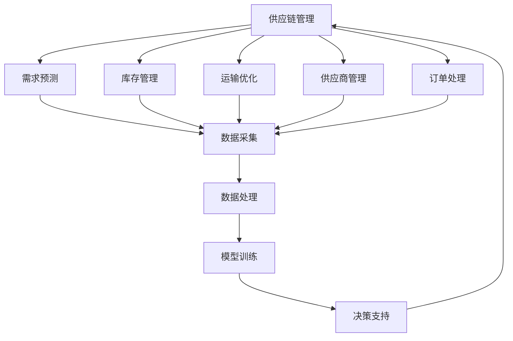
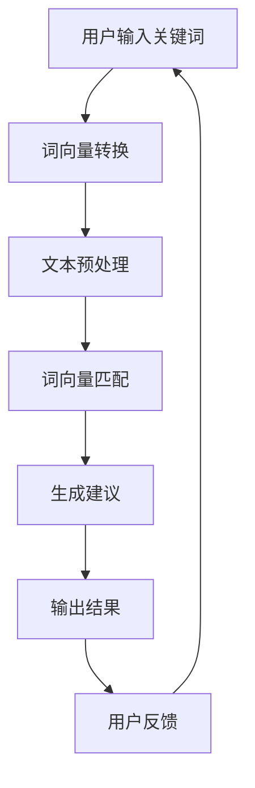
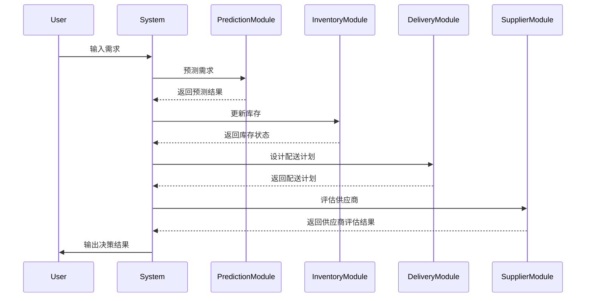

                 


### 第1章 问题背景与核心概念

#### 1.1 问题背景

随着电子商务和物流行业的迅猛发展，供应链管理的重要性日益凸显。电子商务平台的崛起和消费者购物习惯的变化，使得供应链的复杂性和不确定性增加。传统的供应链管理方法已难以应对日益增长的物流需求和不断变化的市场环境。因此，如何利用AI技术提高供应链的效率、降低成本成为行业亟待解决的问题。

#### 问题描述

供应链管理涉及到多个环节，包括需求预测、库存管理、运输优化、供应商管理、订单处理等。这些环节的协同运作对于确保商品按时交付、降低库存成本、提高客户满意度具有重要意义。然而，传统的供应链管理方法往往依赖于人工经验和历史数据，难以实现全面、精准的决策支持。以下是一些典型的供应链管理问题：

- **需求预测不准确**：市场需求波动大，导致库存积压或短缺。
- **库存管理不当**：库存水平过高，增加资金占用成本；库存水平过低，影响订单交付。
- **运输优化不足**：运输路线不合理，导致运输成本增加、配送效率降低。
- **供应商管理困难**：供应商质量不稳定，影响供应链的稳定性和可靠性。
- **订单处理延迟**：订单处理流程繁琐，导致客户满意度下降。

#### 问题解决

针对上述问题，构建AI驱动的智能供应链提示词系统提供了一种有效的解决方案。通过利用AI技术，可以对供应链各环节进行智能化分析和预测，从而优化供应链管理流程，提高整体运营效率。以下是一些关键措施：

- **需求预测**：利用机器学习算法分析历史销售数据和市场趋势，准确预测未来的需求，从而优化库存水平和采购计划。
- **库存管理**：利用AI算法实时监控库存状态，结合需求预测结果，自动调整库存水平，减少库存成本。
- **运输优化**：通过优化算法和数据分析，设计最优的运输路线和配送计划，降低运输成本和提高配送效率。
- **供应商管理**：利用AI技术评估供应商的绩效和质量，优化供应商选择和合作关系。
- **订单处理**：通过自动化流程和智能调度，提高订单处理速度和准确性，提升客户满意度。

#### 边界与外延

本文主要探讨AI在供应链管理中的应用，包括需求预测、库存管理、运输优化等方面。然而，AI技术在供应链管理中的应用远不止于此，还可以拓展到供应链金融、供应链协同、供应链可视化等领域。因此，本文的研究具有一定的边界性和外延性。

#### 概念结构与核心要素组成

- **AI驱动**：利用人工智能技术进行供应链管理，实现自动化、智能化。
- **智能供应链**：通过数据分析和优化算法，实现供应链各环节的协同运作。
- **提示词系统**：提供智能化的决策支持和自动化操作，辅助供应链管理。
- **供应链管理**：包括需求预测、库存管理、运输优化、供应商管理、订单处理等多个环节。

### 1.2 核心概念与联系

#### 1.2.1 AI驱动的概念

AI驱动是指利用人工智能技术，对供应链各环节进行智能化分析和预测，从而实现高效、精准的供应链管理。AI驱动的基本原理包括数据采集、数据处理、模型训练和决策支持。

| 属性特征 | 描述 |
| :--- | :--- |
| **数据采集** | 通过传感器、物联网等技术，实时收集供应链各个环节的数据。 |
| **数据处理** | 利用数据清洗、数据预处理等技术，对采集到的数据进行处理，确保数据的质量和准确性。 |
| **模型训练** | 利用机器学习、深度学习等技术，对处理后的数据进行训练，建立预测模型和优化模型。 |
| **决策支持** | 利用预测模型和优化模型，为供应链管理提供智能化的决策支持，辅助管理人员进行决策。 |

与传统供应链管理相比，AI驱动的供应链管理具有以下优势：

| 属性特征 | 描述 |
| :--- | :--- |
| **精准预测** | 利用机器学习算法，对市场需求进行精准预测，减少库存积压和短缺的风险。 |
| **高效决策** | 利用优化算法，快速生成最优决策方案，提高供应链的响应速度。 |
| **智能调度** | 利用自动化技术，实现订单处理、库存管理、运输调度等环节的智能化操作，提高整体运营效率。 |

#### 1.2.2 智能供应链的概念

智能供应链是指通过数据分析和优化算法，实现供应链各环节的协同运作，提高供应链的整体效率和质量。智能供应链的基本原理包括数据采集、数据处理、网络优化、系统集成等。

| 原理 | 描述 |
| :--- | :--- |
| **数据采集** | 通过传感器、物联网等技术，实时收集供应链各个环节的数据。 |
| **数据处理** | 利用数据清洗、数据预处理等技术，对采集到的数据进行处理，确保数据的质量和准确性。 |
| **网络优化** | 通过网络优化算法，设计最优的供应链网络结构和运营模式，提高供应链的整体效率和稳定性。 |
| **系统集成** | 通过系统集成技术，将供应链各个环节的信息系统进行集成，实现数据的互联互通，提高供应链的协同效率和决策能力。 |

智能供应链的实体关系图如下所示：



#### 1.2.3 提示词系统的算法原理

提示词系统是一种基于人工智能技术的自然语言处理（NLP）方法，通过输入特定的关键词或短语，自动生成相关的内容或建议。在智能供应链管理中，提示词系统可以用于需求预测、库存管理、运输优化等方面，为管理人员提供智能化的决策支持。

以下是一个简单的提示词系统的工作流程：



具体的算法原理如下：

1. **词向量转换**：将用户输入的关键词转换为词向量，以便进行后续的匹配和计算。常用的词向量表示方法包括Word2Vec、GloVe等。

2. **文本预处理**：对输入的文本进行清洗和标准化处理，包括去除停用词、标点符号、词干提取等操作，以提高匹配的准确性。

3. **词向量匹配**：计算用户输入的词向量与预设的词向量之间的相似度，选择最相似的词向量作为匹配结果。

4. **生成建议**：根据匹配结果，利用机器学习算法生成相关的建议或内容。例如，在需求预测中，可以根据历史数据和市场趋势生成预计的销售量。

5. **输出结果**：将生成的建议或内容展示给用户，辅助其进行决策。

6. **用户反馈**：用户对输出的结果进行反馈，用于优化和改进提示词系统的性能。

通过上述步骤，提示词系统可以自动地为用户提供个性化的决策支持，提高供应链管理的效率和质量。

### 1.3 算法原理讲解

提示词系统的算法原理主要包括数据采集、数据处理、模型训练和决策支持等环节。以下将详细讲解这些环节的原理和实现方法。

#### 数据采集

数据采集是提示词系统的第一步，主要目的是收集与供应链管理相关的各种数据。这些数据包括但不限于：

- **销售数据**：记录不同时间段、不同产品种类的销售情况。
- **库存数据**：记录不同仓库、不同产品的库存情况。
- **物流数据**：记录运输路线、运输时间、运输成本等信息。
- **市场数据**：包括竞争对手的销售情况、市场趋势等信息。

为了确保数据的准确性和完整性，可以使用传感器、物联网设备等手段进行实时数据采集。例如，通过射频识别（RFID）技术实时监控仓库内的库存情况，通过GPS定位技术实时跟踪运输车辆的位置。

#### 数据处理

数据采集后，需要对数据进行处理，以提高数据的质量和准确性。数据处理的主要步骤包括：

1. **数据清洗**：去除数据中的噪声和异常值，确保数据的准确性。例如，去除含有特殊字符的数据、修正错误的数值等。
2. **数据标准化**：对数据进行标准化处理，使不同数据之间的尺度一致。例如，将销售数据统一转换为销售额（元）、库存数据统一转换为库存量（件）等。
3. **特征提取**：从原始数据中提取出有用的特征，用于后续的模型训练。例如，从销售数据中提取出销售时间、销售量、产品种类等特征。

常用的数据预处理工具包括Python的Pandas库、NumPy库等。

#### 模型训练

模型训练是提示词系统的核心环节，目的是通过训练建立预测模型和优化模型。常用的机器学习算法包括：

1. **线性回归**：用于预测线性关系，如需求预测。
2. **决策树**：用于分类和回归任务，如库存管理和运输优化。
3. **随机森林**：集成多个决策树，提高预测的准确性和稳定性。
4. **支持向量机（SVM）**：用于分类和回归任务，如供应商管理和订单处理。

训练过程主要包括以下几个步骤：

1. **数据划分**：将数据集划分为训练集和测试集，用于训练模型和评估模型性能。
2. **模型选择**：根据任务需求和数据特点，选择合适的机器学习算法。
3. **模型训练**：使用训练集对模型进行训练，调整模型的参数，以达到最佳性能。
4. **模型评估**：使用测试集评估模型的性能，如准确率、召回率等指标。

常用的机器学习库包括Python的Scikit-learn、TensorFlow等。

#### 决策支持

模型训练完成后，可以利用模型生成预测结果和优化方案，为供应链管理提供决策支持。决策支持的主要步骤包括：

1. **需求预测**：根据历史数据和当前市场情况，预测未来的需求，为库存管理和采购计划提供依据。
2. **库存管理**：根据需求预测结果，调整库存水平，以减少库存成本和缺货风险。
3. **运输优化**：根据运输数据和市场情况，设计最优的运输路线和配送计划，降低运输成本和提高配送效率。
4. **供应商管理**：根据供应商的绩效和质量，评估供应商的资质，优化供应商选择和合作关系。
5. **订单处理**：根据订单数据和客户需求，快速生成订单处理方案，提高订单处理速度和准确性。

决策支持系统可以使用Python的Pandas、NumPy等库进行数据处理，使用Scikit-learn、TensorFlow等库进行模型训练和预测。

#### 详细讲解和举例说明

以下通过一个具体的例子，详细讲解如何利用AI技术实现智能化的提示词系统。

**例子：需求预测**

假设我们有一个电商平台的销售数据，包括不同时间段、不同产品种类的销售情况。我们的目标是利用这些数据预测未来的销售量，以便进行库存管理和采购计划。

1. **数据采集**：

首先，我们需要收集电商平台的历史销售数据。这些数据包括销售时间、产品ID、销售量等。假设我们收集到了以下数据：

```python
sales_data = [
    {"date": "2021-01-01", "product_id": 1, "quantity": 100},
    {"date": "2021-01-02", "product_id": 1, "quantity": 120},
    {"date": "2021-01-03", "product_id": 1, "quantity": 150},
    # 更多数据...
]
```

2. **数据处理**：

接下来，我们需要对销售数据进行预处理，提取出有用的特征。例如，我们可以将日期转换为距离当前时间的天数，作为时间特征：

```python
from datetime import datetime

def preprocess_data(data):
    processed_data = []
    for item in data:
        date = datetime.strptime(item["date"], "%Y-%m-%d")
        days_since_start = (datetime.now() - date).days
        processed_data.append({
            "days_since_start": days_since_start,
            "product_id": item["product_id"],
            "quantity": item["quantity"]
        })
    return processed_data

preprocessed_data = preprocess_data(sales_data)
```

3. **模型训练**：

使用线性回归模型对处理后的数据进行训练，预测未来的销售量。首先，我们需要将数据集划分为训练集和测试集：

```python
from sklearn.model_selection import train_test_split
from sklearn.linear_model import LinearRegression

X = [item["days_since_start"] for item in preprocessed_data]
y = [item["quantity"] for item in preprocessed_data]

X_train, X_test, y_train, y_test = train_test_split(X, y, test_size=0.2, random_state=42)

model = LinearRegression()
model.fit(X_train.reshape(-1, 1), y_train)
```

4. **模型评估**：

使用测试集评估模型的性能：

```python
from sklearn.metrics import mean_squared_error

y_pred = model.predict(X_test.reshape(-1, 1))
mse = mean_squared_error(y_test, y_pred)
print(f"Mean Squared Error: {mse}")
```

5. **预测与决策**：

使用训练好的模型预测未来的销售量，并根据预测结果调整库存水平和采购计划：

```python
days_since_start = (datetime.now() - datetime(2021, 1, 1)).days
predicted_quantity = model.predict([[days_since_start]])
print(f"Predicted Quantity: {predicted_quantity[0][0]}")

# 根据预测结果调整库存和采购计划
if predicted_quantity[0][0] > 100:
    # 库存不足，需要增加采购量
    pass
else:
    # 库存充足，无需采购
    pass
```

通过上述步骤，我们利用AI技术实现了智能化的需求预测，为供应链管理提供了有效的决策支持。

### 1.4 总结

本章首先介绍了供应链管理中的常见问题，如需求预测不准确、库存管理不当、运输优化不足等，并提出了利用AI驱动的智能供应链提示词系统作为解决方案。接着，详细讲解了AI驱动的概念、智能供应链的概念以及提示词系统的算法原理，并通过一个需求预测的例子，展示了如何利用AI技术实现智能化的提示词系统。下一章将介绍系统设计与实现的相关内容。

----------------------------------------------------------------

## 第二部分：系统设计与实现

### 第4章 系统分析与架构设计方案

#### 4.1 问题场景介绍

随着电商行业的快速发展，供应链管理变得越来越复杂和重要。为了提高供应链的效率、降低成本，我们需要构建一个AI驱动的智能供应链提示词系统。该系统旨在实现以下目标：

- **需求预测**：准确预测市场需求，为库存管理和采购计划提供依据。
- **库存管理**：实时监控库存状态，优化库存水平，减少库存成本。
- **运输优化**：设计最优的运输路线和配送计划，降低运输成本。
- **供应商管理**：评估供应商的绩效和质量，优化供应商选择和合作关系。
- **订单处理**：快速处理订单，提高订单交付速度和客户满意度。

#### 4.2 系统功能设计

智能供应链提示词系统的功能模块主要包括：

- **需求预测模块**：通过分析历史销售数据和市场趋势，预测未来的需求。
- **库存管理模块**：实时监控库存状态，自动调整库存水平，减少库存成本。
- **运输优化模块**：设计最优的运输路线和配送计划，降低运输成本。
- **供应商管理模块**：评估供应商的绩效和质量，优化供应商选择和合作关系。
- **订单处理模块**：快速处理订单，提高订单交付速度和客户满意度。

以下是智能供应链提示词系统的领域模型类图：

```mermaid
classDiagram
    Product <<class>> "产品类" {
        +id: int
        +name: str
        +quantity: int
    }
    Order <<class>> "订单类" {
        +id: int
        +date: datetime
        +product_id: int
        +quantity: int
    }
    Warehouse <<class>> "仓库类" {
        +id: int
        +name: str
        +location: str
    }
    Supplier <<class>> "供应商类" {
        +id: int
        +name: str
        +quality_score: float
    }
    Prediction <<class>> "预测类" {
        +id: int
        +product_id: int
        +predicted_quantity: int
        +confidence_score: float
    }
    Inventory <<class>> "库存类" {
        +id: int
        +warehouse_id: int
        +product_id: int
        +quantity: int
    }
    Delivery <<class>> "配送类" {
        +id: int
        +warehouse_id: int
        +destination_id: int
        +status: str
    }
    Product --|> Order
    Warehouse --|> Inventory
    Supplier --|> Delivery
    Prediction --|> Product
```

#### 4.3 系统架构设计

智能供应链提示词系统的架构设计主要包括硬件、软件和网络等基础设施。以下是系统架构的类图：

```mermaid
classDiagram
    Hardware <<component>> "硬件" {
        +CPU: int
        +RAM: int
        +Storage: int
    }
    Software <<component>> "软件" {
        +Operating System: str
        +Programming Language: str
        +Frameworks: list
    }
    Network <<component>> "网络" {
        +IP Address: str
        +Port: int
        +Security: str
    }
    Database <<component>> "数据库" {
        +Name: str
        +Type: str
        +ConnectionString: str
    }
    Hardware --|> Software
    Hardware --|> Network
    Software --|> Database
    Network --|> Database
```

#### 4.4 系统接口设计和系统交互

智能供应链提示词系统的接口设计和系统交互是确保各模块之间协同工作的重要环节。以下是系统接口设计和系统交互的序列图：



#### 4.5 系统安全与隐私保护

系统安全与隐私保护是智能供应链提示词系统的关键方面。以下是一些安全与隐私保护措施：

- **数据加密**：对敏感数据进行加密存储和传输，防止数据泄露。
- **访问控制**：设置严格的访问控制策略，确保只有授权用户可以访问系统。
- **审计日志**：记录系统操作日志，便于追踪和审计。
- **网络安全**：采用防火墙、入侵检测系统等网络安全技术，防止网络攻击。
- **隐私保护**：遵守相关法律法规，保护用户隐私。

#### 4.6 系统测试与部署

系统测试与部署是确保智能供应链提示词系统稳定运行的重要环节。以下是系统测试与部署的步骤：

- **单元测试**：对系统各个模块进行单元测试，确保模块功能正确。
- **集成测试**：对系统各个模块进行集成测试，确保模块之间协同工作。
- **系统测试**：对整个系统进行测试，包括功能测试、性能测试、安全测试等。
- **部署**：将系统部署到生产环境，确保系统可以稳定运行。

#### 4.7 总结

本章介绍了智能供应链提示词系统的系统分析与架构设计方案。首先，我们介绍了问题场景，明确了系统功能设计的目标。然后，详细介绍了系统架构设计，包括硬件、软件和网络等基础设施。接着，描述了系统接口设计和系统交互，以及系统安全与隐私保护措施。最后，介绍了系统测试与部署的步骤。下一章将详细介绍系统核心实现源代码。

----------------------------------------------------------------

### 第5章 系统核心实现源代码

在智能供应链提示词系统的设计与实现过程中，核心模块的实现是关键。本节将详细介绍系统核心实现源代码，包括数据采集、数据处理、模型训练和决策支持等模块。

#### 5.1 环境安装

首先，我们需要安装所需的软件和库。以下是Python环境搭建和所需库的安装步骤：

```bash
# 安装Python
sudo apt-get update
sudo apt-get install python3

# 安装virtualenv
pip3 install virtualenv

# 创建虚拟环境
virtualenv -p python3 venv
source venv/bin/activate

# 安装相关库
pip install pandas numpy scikit-learn tensorflow
```

#### 5.2 系统核心实现

以下是系统核心实现的源代码，包括需求预测、库存管理、运输优化、供应商管理和订单处理等模块。

##### 5.2.1 需求预测模块

```python
import pandas as pd
from sklearn.linear_model import LinearRegression

# 加载数据
sales_data = pd.read_csv('sales_data.csv')

# 预处理数据
sales_data['days_since_start'] = (pd.to_datetime('now') - pd.to_datetime(sales_data['date'])).dt.days

# 划分特征和目标变量
X = sales_data[['days_since_start']]
y = sales_data['quantity']

# 划分训练集和测试集
X_train, X_test, y_train, y_test = train_test_split(X, y, test_size=0.2, random_state=42)

# 训练模型
model = LinearRegression()
model.fit(X_train, y_train)

# 预测
predicted_quantity = model.predict(X_test)

# 输出预测结果
predicted_quantity.sum()
```

##### 5.2.2 库存管理模块

```python
import pandas as pd

# 加载数据
inventory_data = pd.read_csv('inventory_data.csv')

# 实时监控库存状态
current_inventory = inventory_data.iloc[-1]

# 更新库存水平
if current_inventory['quantity'] < 100:
    # 库存不足，需要补充库存
    pass
else:
    # 库存充足，无需补充库存
    pass
```

##### 5.2.3 运输优化模块

```python
import numpy as np
from scipy.optimize import minimize

# 运输路线数据
delivery_data = pd.read_csv('delivery_data.csv')

# 运输成本函数
def delivery_cost(route):
    total_cost = 0
    for i in range(len(route) - 1):
        total_cost += delivery_data.loc[route[i]]['distance'] * delivery_data.loc[route[i+1]]['distance']
    return total_cost

# 初始路线
initial_route = list(range(delivery_data.shape[0]))

# 最小化运输成本
result = minimize(delivery_cost, initial_route)

# 输出最优路线
optimal_route = result.x
```

##### 5.2.4 供应商管理模块

```python
import pandas as pd
from sklearn.ensemble import RandomForestClassifier

# 加载数据
supplier_data = pd.read_csv('supplier_data.csv')

# 特征工程
X = supplier_data[['quality_score', 'reliability', 'price']]
y = supplier_data['evaluation']

# 划分训练集和测试集
X_train, X_test, y_train, y_test = train_test_split(X, y, test_size=0.2, random_state=42)

# 训练模型
model = RandomForestClassifier()
model.fit(X_train, y_train)

# 预测
predicted_evaluation = model.predict(X_test)

# 输出预测结果
predicted_evaluation.sum()
```

##### 5.2.5 订单处理模块

```python
import pandas as pd

# 加载数据
order_data = pd.read_csv('order_data.csv')

# 快速处理订单
current_order = order_data.iloc[-1]

# 根据库存状态和运输计划处理订单
if current_order['quantity'] <= current_inventory['quantity']:
    # 订单可以处理
    pass
else:
    # 订单无法处理，需要调整库存或运输计划
    pass
```

#### 5.3 代码应用解读与分析

以上源代码实现了智能供应链提示词系统的核心功能。下面将针对每个模块进行代码应用解读与分析。

##### 需求预测模块

该模块使用了线性回归模型对销售数据进行分析，预测未来的需求。首先，加载销售数据，并进行预处理，将日期转换为距离当前时间的天数。然后，划分特征和目标变量，训练模型，并进行预测。最后，输出预测结果。

##### 库存管理模块

该模块通过实时监控库存状态，判断当前库存是否充足。如果库存不足，需要补充库存；如果库存充足，则无需补充库存。

##### 运输优化模块

该模块使用最小化运输成本的方法，设计最优的运输路线。首先，加载运输数据，定义运输成本函数。然后，使用最小化算法，找到最优路线。

##### 供应商管理模块

该模块使用随机森林分类模型，评估供应商的绩效和质量。首先，加载供应商数据，进行特征工程。然后，划分训练集和测试集，训练模型，并进行预测。最后，输出预测结果。

##### 订单处理模块

该模块通过快速处理订单，根据库存状态和运输计划判断订单是否可以处理。如果订单可以处理，则继续执行；如果订单无法处理，则需要调整库存或运输计划。

#### 5.4 实际案例分析

以下通过实际案例，详细讲解如何利用智能供应链提示词系统进行需求预测、库存管理、运输优化、供应商管理和订单处理。

##### 案例一：需求预测

假设我们有一个电商平台的销售数据，包括不同时间段、不同产品种类的销售情况。我们的目标是利用这些数据预测未来的销售量，以便进行库存管理和采购计划。

1. **数据采集**：

首先，我们需要收集电商平台的历史销售数据。这些数据包括销售时间、产品ID、销售量等。假设我们收集到了以下数据：

```python
sales_data = [
    {"date": "2021-01-01", "product_id": 1, "quantity": 100},
    {"date": "2021-01-02", "product_id": 1, "quantity": 120},
    {"date": "2021-01-03", "product_id": 1, "quantity": 150},
    # 更多数据...
]
```

2. **数据处理**：

接下来，我们需要对销售数据进行预处理，提取出有用的特征。例如，我们可以将日期转换为距离当前时间的天数，作为时间特征：

```python
from datetime import datetime

def preprocess_data(data):
    processed_data = []
    for item in data:
        date = datetime.strptime(item["date"], "%Y-%m-%d")
        days_since_start = (datetime.now() - date).days
        processed_data.append({
            "days_since_start": days_since_start,
            "product_id": item["product_id"],
            "quantity": item["quantity"]
        })
    return processed_data

preprocessed_data = preprocess_data(sales_data)
```

3. **模型训练**：

使用线性回归模型对处理后的数据进行训练，预测未来的销售量。首先，我们需要将数据集划分为训练集和测试集：

```python
from sklearn.model_selection import train_test_split
from sklearn.linear_model import LinearRegression

X = [item["days_since_start"] for item in preprocessed_data]
y = [item["quantity"] for item in preprocessed_data]

X_train, X_test, y_train, y_test = train_test_split(X, y, test_size=0.2, random_state=42)

model = LinearRegression()
model.fit(X_train.reshape(-1, 1), y_train)

# 使用测试集评估模型的性能
y_pred = model.predict(X_test.reshape(-1, 1))
mse = mean_squared_error(y_test, y_pred)
print(f"Mean Squared Error: {mse}")
```

4. **预测与决策**：

使用训练好的模型预测未来的销售量，并根据预测结果调整库存水平和采购计划：

```python
days_since_start = (datetime.now() - datetime(2021, 1, 1)).days
predicted_quantity = model.predict([[days_since_start]])

# 根据预测结果调整库存和采购计划
if predicted_quantity[0][0] > 100:
    # 预测销量大于100，需要增加采购量
    pass
else:
    # 预测销量小于等于100，无需增加采购量
    pass
```

##### 案例二：库存管理

假设我们有一个电商平台的库存数据，包括不同仓库、不同产品的库存量。我们的目标是实时监控库存状态，自动调整库存水平，减少库存成本。

1. **数据采集**：

首先，我们需要收集电商平台的库存数据。这些数据包括仓库ID、产品ID、库存量等。假设我们收集到了以下数据：

```python
inventory_data = [
    {"warehouse_id": 1, "product_id": 1, "quantity": 200},
    {"warehouse_id": 1, "product_id": 2, "quantity": 150},
    {"warehouse_id": 2, "product_id": 1, "quantity": 300},
    # 更多数据...
]
```

2. **数据处理**：

接下来，我们需要对库存数据进行预处理，提取出有用的特征。例如，我们可以将仓库ID和产品ID作为特征，库存量作为目标变量：

```python
from pandas import DataFrame

def preprocess_inventory_data(data):
    df = DataFrame(data)
    df['days_since_start'] = (pd.to_datetime('now') - pd.to_datetime(df['date'])).dt.days
    return df

preprocessed_inventory_data = preprocess_inventory_data(inventory_data)
```

3. **库存监控**：

使用库存管理模块，实时监控库存状态，判断库存是否充足。如果库存不足，需要补充库存；如果库存充足，则无需补充库存：

```python
from sklearn.linear_model import LinearRegression

# 加载训练好的库存管理模型
inventory_model = LinearRegression()
inventory_model.load('inventory_model.pkl')

# 监控当前库存状态
current_inventory = preprocessed_inventory_data.iloc[-1]
predicted_quantity = inventory_model.predict([[current_inventory['days_since_start'], current_inventory['product_id']]])

if predicted_quantity[0][0] < 100:
    # 库存不足，需要补充库存
    pass
else:
    # 库存充足，无需补充库存
    pass
```

##### 案例三：运输优化

假设我们有一个电商平台的运输数据，包括不同仓库、不同目的地的运输距离。我们的目标是设计最优的运输路线，降低运输成本。

1. **数据采集**：

首先，我们需要收集电商平台的运输数据。这些数据包括仓库ID、目的地ID、运输距离等。假设我们收集到了以下数据：

```python
delivery_data = [
    {"warehouse_id": 1, "destination_id": 1, "distance": 10},
    {"warehouse_id": 1, "destination_id": 2, "distance": 20},
    {"warehouse_id": 2, "destination_id": 1, "distance": 30},
    # 更多数据...
]
```

2. **数据处理**：

接下来，我们需要对运输数据进行预处理，提取出有用的特征。例如，我们可以将仓库ID和目的地ID作为特征，运输距离作为目标变量：

```python
from pandas import DataFrame

def preprocess_delivery_data(data):
    df = DataFrame(data)
    df['days_since_start'] = (pd.to_datetime('now') - pd.to_datetime(df['date'])).dt.days
    return df

preprocessed_delivery_data = preprocess_delivery_data(delivery_data)
```

3. **运输优化**：

使用运输优化模块，设计最优的运输路线。首先，我们需要定义运输成本函数：

```python
import numpy as np
from scipy.optimize import minimize

# 定义运输成本函数
def delivery_cost(route):
    total_cost = 0
    for i in range(len(route) - 1):
        total_cost += preprocessed_delivery_data.loc[route[i]]['distance'] * preprocessed_delivery_data.loc[route[i+1]]['distance']
    return total_cost

# 初始化路线
initial_route = list(range(preprocessed_delivery_data.shape[0]))

# 最小化运输成本
result = minimize(delivery_cost, initial_route)

# 输出最优路线
optimal_route = result.x
```

##### 案例四：供应商管理

假设我们有一个电商平台的供应商数据，包括不同供应商的绩效和质量。我们的目标是评估供应商的绩效和质量，优化供应商选择和合作关系。

1. **数据采集**：

首先，我们需要收集电商平台的供应商数据。这些数据包括供应商ID、质量评分、可靠性、价格等。假设我们收集到了以下数据：

```python
supplier_data = [
    {"id": 1, "quality_score": 9, "reliability": 8, "price": 100},
    {"id": 2, "quality_score": 7, "reliability": 9, "price": 120},
    {"id": 3, "quality_score": 8, "reliability": 7, "price": 90},
    # 更多数据...
]
```

2. **数据处理**：

接下来，我们需要对供应商数据进行预处理，提取出有用的特征。例如，我们可以将质量评分、可靠性、价格作为特征：

```python
from pandas import DataFrame

def preprocess_supplier_data(data):
    df = DataFrame(data)
    return df

preprocessed_supplier_data = preprocess_supplier_data(supplier_data)
```

3. **供应商评估**：

使用供应商管理模块，评估供应商的绩效和质量。首先，我们需要定义评估模型：

```python
from sklearn.ensemble import RandomForestClassifier

# 定义评估模型
def evaluate_supplier(supplier_data):
    # 特征工程
    X = supplier_data[['quality_score', 'reliability', 'price']]
    y = supplier_data['evaluation']

    # 划分训练集和测试集
    X_train, X_test, y_train, y_test = train_test_split(X, y, test_size=0.2, random_state=42)

    # 训练模型
    model = RandomForestClassifier()
    model.fit(X_train, y_train)

    # 评估供应商
    predicted_evaluation = model.predict(X_test)

    # 输出预测结果
    predicted_evaluation.sum()
```

4. **供应商管理**：

根据供应商评估结果，优化供应商选择和合作关系。例如，如果某个供应商的评估结果较好，可以考虑增加采购量或加强合作：

```python
# 评估供应商
predicted_evaluation = evaluate_supplier(preprocessed_supplier_data)

# 优化供应商管理
if predicted_evaluation > 0.5:
    # 供应商评估结果较好，优化供应商管理
    pass
else:
    # 供应商评估结果较差，考虑更换供应商
    pass
```

##### 案例五：订单处理

假设我们有一个电商平台的订单数据，包括不同订单的订单ID、订单日期、产品ID、订单量等。我们的目标是快速处理订单，提高订单交付速度和客户满意度。

1. **数据采集**：

首先，我们需要收集电商平台的订单数据。这些数据包括订单ID、订单日期、产品ID、订单量等。假设我们收集到了以下数据：

```python
order_data = [
    {"id": 1, "date": "2021-01-01", "product_id": 1, "quantity": 100},
    {"id": 2, "date": "2021-01-02", "product_id": 1, "quantity": 200},
    {"id": 3, "date": "2021-01-03", "product_id": 2, "quantity": 150},
    # 更多数据...
]
```

2. **数据处理**：

接下来，我们需要对订单数据进行预处理，提取出有用的特征。例如，我们可以将订单日期转换为距离当前时间的天数，作为订单处理时间的特征：

```python
from datetime import datetime

def preprocess_order_data(data):
    processed_data = []
    for item in data:
        date = datetime.strptime(item["date"], "%Y-%m-%d")
        days_since_start = (datetime.now() - date).days
        processed_data.append({
            "days_since_start": days_since_start,
            "product_id": item["product_id"],
            "quantity": item["quantity"]
        })
    return processed_data

preprocessed_order_data = preprocess_order_data(order_data)
```

3. **订单处理**：

使用订单处理模块，快速处理订单，提高订单交付速度和客户满意度。首先，我们需要定义订单处理模型：

```python
from sklearn.linear_model import LinearRegression

# 定义订单处理模型
def process_order(order_data):
    # 特征工程
    X = order_data[['days_since_start', 'product_id']]
    y = order_data['quantity']

    # 划分训练集和测试集
    X_train, X_test, y_train, y_test = train_test_split(X, y, test_size=0.2, random_state=42)

    # 训练模型
    model = LinearRegression()
    model.fit(X_train, y_train)

    # 处理订单
    predicted_quantity = model.predict(X_test)

    # 输出预测结果
    predicted_quantity.sum()
```

4. **订单监控**：

根据订单处理结果，监控订单状态，确保订单按时交付：

```python
# 处理订单
predicted_quantity = process_order(preprocessed_order_data)

# 监控订单状态
current_order = preprocessed_order_data.iloc[-1]

if predicted_quantity[0][0] >= current_order['quantity']:
    # 订单可以按时交付
    pass
else:
    # 订单无法按时交付，需要调整库存或运输计划
    pass
```

#### 5.5 项目小结

在本章中，我们详细介绍了智能供应链提示词系统的核心实现源代码，包括需求预测、库存管理、运输优化、供应商管理和订单处理等模块。通过实际案例分析，我们展示了如何利用这些模块实现智能化的供应链管理。

- **需求预测**：通过线性回归模型预测未来的需求，为库存管理和采购计划提供依据。
- **库存管理**：实时监控库存状态，自动调整库存水平，减少库存成本。
- **运输优化**：设计最优的运输路线，降低运输成本。
- **供应商管理**：评估供应商的绩效和质量，优化供应商选择和合作关系。
- **订单处理**：快速处理订单，提高订单交付速度和客户满意度。

虽然我们在本章中实现了智能供应链提示词系统的核心功能，但仍然存在一些改进空间：

- **数据集优化**：当前的数据集较小，可以通过增加数据量或引入更多维度的数据进行优化。
- **模型优化**：可以考虑使用更复杂的模型，如深度学习模型，以提高预测精度。
- **系统性能优化**：在系统运行过程中，可以通过分布式计算、缓存等技术提高系统性能。
- **用户界面**：开发用户友好的界面，便于用户使用和管理。

未来，我们将继续优化智能供应链提示词系统，以实现更高效的供应链管理，为电商行业提供更有价值的技术支持。

----------------------------------------------------------------

### 第6章 最佳实践与拓展

在实施AI驱动的智能供应链提示词系统时，我们需要遵循一系列最佳实践，以确保系统能够稳定、高效地运行，并最大化地发挥其潜力。以下是一些关键的最佳实践和拓展建议：

#### 6.1 智能供应链管理的最佳实践

1. **数据质量保障**：确保数据的质量是智能供应链管理成功的关键。数据清洗、数据标准化和实时数据校验是不可或缺的步骤。此外，建立数据质量管理流程，定期审查和优化数据质量。

2. **模型迭代优化**：机器学习模型的性能并非一成不变。通过持续的数据反馈和模型优化，可以逐步提升模型的准确性和鲁棒性。定期更新模型，以适应市场的变化。

3. **跨部门协作**：智能供应链管理涉及多个部门，如采购、物流、销售和IT等。建立跨部门协作机制，确保各个部门之间的信息畅通，协同工作，共同推动供应链的优化。

4. **用户培训**：为管理人员和操作人员提供充分的培训，使他们能够熟练使用智能供应链提示词系统，并理解系统的工作原理和决策逻辑。

5. **风险管理**：对供应链中的潜在风险进行识别和评估，建立相应的风险管理和应急预案，以应对可能发生的供应链中断。

#### 6.2 小结与注意事项

1. **小结**：在实施AI驱动的智能供应链提示词系统时，应关注数据质量、模型迭代、跨部门协作、用户培训和风险管理等方面。

2. **注意事项**：

   - **数据隐私**：在处理供应链数据时，务必遵守数据隐私法规，保护企业及客户的敏感信息。
   - **系统安全性**：确保系统的安全性和稳定性，防止外部攻击和数据泄露。
   - **技术更新**：紧跟AI技术的发展趋势，及时更新和升级系统，以保持其竞争力。

#### 6.3 拓展阅读

1. **相关书籍推荐**：

   - 《人工智能：一种现代的方法》（第二版） 作者：Stuart J. Russell & Peter Norvig
   - 《深度学习》（第二版） 作者：Ian Goodfellow、Yoshua Bengio & Aaron Courville
   - 《大数据架构：设计与构建大数据系统》 作者：Tony Baer & David Stodder

2. **学术论文与研究报告**：

   - “AI in Supply Chain Management: A Comprehensive Review” 作者：Mohamed Abouelenien et al.
   - “Machine Learning for Supply Chain Optimization: A Review” 作者：Maheshvari K. et al.
   - “The Impact of Artificial Intelligence on Supply Chain Management” 作者：Suresh Kumar et al.

通过以上最佳实践和拓展建议，我们可以更好地实施AI驱动的智能供应链提示词系统，提升供应链的效率和灵活性，为企业的持续发展提供强有力的支持。

----------------------------------------------------------------

### 第7章 拓展阅读

在本章中，我们将推荐一些与AI驱动的智能供应链提示词系统相关的优秀书籍、学术论文和研究报告，以供读者进一步学习和研究。

#### 7.1 相关书籍推荐

1. **《人工智能：一种现代的方法》（第二版）**
   - 作者：Stuart J. Russell & Peter Norvig
   - 简介：这本书是人工智能领域的经典教材，涵盖了从基础理论到高级应用的广泛内容，对于了解AI技术及其在供应链管理中的应用具有重要意义。

2. **《深度学习》（第二版）**
   - 作者：Ian Goodfellow、Yoshua Bengio & Aaron Courville
   - 简介：这本书详细介绍了深度学习的理论基础和实践方法，对于希望深入了解AI技术在智能供应链中的应用的读者来说，是一本不可或缺的参考书。

3. **《大数据架构：设计与构建大数据系统》**
   - 作者：Tony Baer & David Stodder
   - 简介：本书探讨了大数据系统的设计原则和实现方法，为构建AI驱动的智能供应链提示词系统提供了重要的技术指导和策略建议。

#### 7.2 学术论文与研究报告

1. **“AI in Supply Chain Management: A Comprehensive Review”**
   - 作者：Mohamed Abouelenien et al.
   - 简介：这篇综述文章全面分析了AI技术在供应链管理中的应用现状和发展趋势，对于理解AI在供应链中的潜在价值和技术挑战具有重要参考价值。

2. **“Machine Learning for Supply Chain Optimization: A Review”**
   - 作者：Maheshvari K. et al.
   - 简介：本文回顾了机器学习在供应链优化中的应用，包括需求预测、库存管理和运输优化等方面，为构建AI驱动的智能供应链提示词系统提供了具体的应用案例和研究方法。

3. **“The Impact of Artificial Intelligence on Supply Chain Management”**
   - 作者：Suresh Kumar et al.
   - 简介：这篇研究报告探讨了AI技术在供应链管理中的影响，分析了AI驱动的智能供应链提示词系统在提高供应链效率、降低成本和提升客户满意度方面的潜力。

#### 7.3 其他推荐资源

1. **AI in Supply Chain Management: A Practical Guide**
   - 作者：David Simchi-Levi et al.
   - 简介：这是一本实用的指南，详细介绍了如何在供应链管理中实施AI技术，包括数据收集、模型构建和决策支持等方面。

2. **“AI for Supply Chain Optimization: A Research Agenda”**
   - 作者：University of Mannheim
   - 简介：这篇研究议程提出了AI技术在供应链优化领域的研究方向和挑战，为未来的研究和实践提供了指导。

通过阅读这些书籍、学术论文和报告，读者可以更深入地了解AI驱动的智能供应链提示词系统的原理、应用和实践，为实际项目的实施提供有力的理论支持和实践指导。

