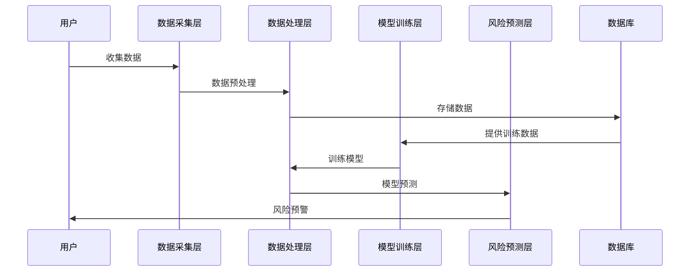

                 

**文章标题**：构建AI驱动的智能供应链风险预测提示词系统

**关键词**：AI，智能供应链，风险预测，提示词系统，机器学习，深度学习

**摘要**：
本文将探讨如何构建一个基于AI的智能供应链风险预测提示词系统。通过分析供应链中的风险因素，结合AI技术，我们将构建一个能够自动识别、预测和提醒潜在风险的系统。文章将详细介绍系统的架构设计、核心算法实现以及项目实战，并给出最佳实践和建议。

**目录大纲**：

**第一部分：引言与背景**

1.1 问题背景
   - 1.1.1 智能供应链的兴起
   - 1.1.2 风险预测的重要性
   - 1.1.3 AI技术在供应链中的应用

1.2 书籍目标与结构
   - 1.2.1 读者对象
   - 1.2.2 书籍结构
   - 1.2.3 学习路线

1.3 核心概念
   - 1.3.1 智能供应链概述
   - 1.3.2 风险预测概述
   - 1.3.3 AI驱动的智能供应链风险预测

**第二部分：AI驱动的智能供应链风险预测基础**

2.1 AI技术基础
   - 2.1.1 机器学习基本概念
   - 2.1.2 深度学习基本原理
   - 2.1.3 强化学习在供应链中的应用

2.2 风险预测核心概念
   - 2.2.1 风险预测概述
   - 2.2.2 风险预测模型分类
   - 2.2.3 风险预测的关键指标

2.3 AI驱动的智能供应链风险预测架构
   - 2.3.1 智能供应链风险预测流程
   - 2.3.2 数据采集与预处理
   - 2.3.3 风险预测模型构建与训练

2.4 实例分析
   - 2.4.1 案例背景
   - 2.4.2 数据集介绍
   - 2.4.3 风险预测模型构建与实现

**第三部分：系统分析与架构设计**

3.1 问题场景介绍
   - 3.1.1 供应链风险预测场景
   - 3.1.2 风险预测系统功能需求

3.2 系统功能设计
   - 3.2.1 领域模型
   - 3.2.2 功能模块划分

3.3 系统架构设计
   - 3.3.1 系统架构概述
   - 3.3.2 系统架构图
   - 3.3.3 系统模块功能

3.4 系统接口设计
   - 3.4.1 接口设计原则
   - 3.4.2 接口定义与实现

3.5 系统交互设计
   - 3.5.1 系统交互概述
   - 3.5.2 系统交互图

**第四部分：项目实战**

4.1 环境安装与配置
   - 4.1.1 环境准备
   - 4.1.2 工具安装

4.2 系统核心实现
   - 4.2.1 数据采集与预处理
   - 4.2.2 风险预测模型构建
   - 4.2.3 风险预测模型训练

4.3 代码应用解读与分析
   - 4.3.1 代码结构分析
   - 4.3.2 关键代码解读

4.4 实际案例分析与详细讲解
   - 4.4.1 案例背景
   - 4.4.2 案例分析
   - 4.4.3 案例总结

4.5 项目小结
   - 4.5.1 项目成果总结
   - 4.5.2 项目反思与改进

**第五部分：最佳实践、小结与拓展阅读**

5.1 最佳实践
   - 5.1.1 系统优化策略
   - 5.1.2 风险预测模型调参技巧

5.2 小结
   - 5.2.1 文章总结
   - 5.2.2 知识点回顾

5.3 注意事项
   - 5.3.1 常见问题与解决方案
   - 5.3.2 注意事项提醒

5.4 拓展阅读
   - 5.4.1 相关书籍推荐
   - 5.4.2 学术论文精选

**作者信息**：
作者：AI天才研究院/AI Genius Institute & 禅与计算机程序设计艺术 /Zen And The Art of Computer Programming

**正文内容**：

**第一部分：引言与背景**

1.1 问题背景
智能供应链的兴起
随着全球经济的快速发展，供应链管理的重要性日益凸显。传统的供应链管理方式已无法满足现代企业快速响应市场需求、降低成本和提高效率的要求。智能供应链作为现代供应链管理的一种新模式，通过引入物联网、大数据、人工智能等技术，实现了供应链的全面智能化。

风险预测的重要性
在智能供应链中，风险预测是确保供应链稳定运行的关键环节。供应链风险可能来自供应链各个环节，如供应商违约、运输延误、需求波动等。准确预测风险，提前采取措施，可以有效降低风险对企业运营的影响，提高供应链的韧性。

AI技术在供应链中的应用
人工智能技术在供应链中的应用，为风险预测带来了新的机遇。通过机器学习、深度学习等技术，AI能够从海量数据中挖掘潜在风险，实现实时预测和智能预警，从而提升供应链的风险管理水平。

1.2 书籍目标与结构
读者对象
本书旨在为供应链管理者和AI技术爱好者提供一本全面的指南，帮助读者了解并掌握AI驱动的智能供应链风险预测系统的构建方法。

书籍结构
本书分为五个部分，从引言到项目实战，系统地介绍了智能供应链风险预测的基础知识、系统架构设计、核心算法实现、项目实战以及最佳实践。每个部分都包含具体的小节，内容丰富且具有实际操作指导意义。

学习路线
读者可以按照以下学习路线进行阅读：
1. 从第一部分开始，了解智能供应链和风险预测的基本概念。
2. 掌握第二部分中的AI技术基础，为后续的学习打下基础。
3. 深入了解第三部分中的系统分析与架构设计，掌握系统设计的方法和技巧。
4. 通过第四部分的项目实战，实际操作构建智能供应链风险预测系统。
5. 在第五部分中，学习最佳实践和注意事项，提高系统构建的效率和稳定性。

1.3 核心概念
智能供应链概述
智能供应链是指利用物联网、大数据、云计算、人工智能等现代信息技术，实现供应链的自动化、智能化和可视化的管理模式。智能供应链通过优化供应链各个环节的协同运作，提高供应链的效率和响应速度。

风险预测概述
风险预测是指通过对供应链各个环节的数据进行分析，预测可能出现的风险，并采取相应的措施进行预防和应对。风险预测的目标是降低供应链中断的风险，提高供应链的稳定性和可靠性。

AI驱动的智能供应链风险预测
AI驱动的智能供应链风险预测是指利用人工智能技术，从海量数据中挖掘潜在的风险，实现实时预测和智能预警。AI驱动的风险预测系统可以帮助企业提前识别风险，制定有效的风险管理策略，提高供应链的韧性。

**第二部分：AI驱动的智能供应链风险预测基础**

2.1 AI技术基础
机器学习基本概念
机器学习是人工智能的核心技术之一，它使计算机系统能够从数据中学习规律，并利用这些规律进行预测和决策。机器学习的基本概念包括数据集、特征、模型、算法等。

深度学习基本原理
深度学习是机器学习的一种重要分支，它通过多层神经网络模型，对大量数据进行训练，从而实现复杂的模式识别和预测。深度学习的核心是神经元网络，包括输入层、隐藏层和输出层。

强化学习在供应链中的应用
强化学习是一种基于奖励和惩罚机制的学习方法，它通过不断尝试和反馈，找到最优策略。在供应链中，强化学习可以用于库存管理、运输路径优化等场景，实现供应链的智能优化。

2.2 风险预测核心概念
风险预测概述
风险预测是指通过分析历史数据和实时数据，预测未来可能出现的风险，并采取相应的措施进行预防和应对。风险预测的目标是降低供应链中断的风险，提高供应链的稳定性和可靠性。

风险预测模型分类
风险预测模型可以分为基于统计模型的方法、基于机器学习的方法和基于深度学习的方法。每种方法都有其适用的场景和优缺点。

风险预测的关键指标
风险预测的关键指标包括准确率、召回率、F1分数等。这些指标用于评估风险预测模型的效果，帮助优化模型参数和算法。

2.3 AI驱动的智能供应链风险预测架构
智能供应链风险预测流程
智能供应链风险预测流程包括数据采集、数据预处理、模型训练、模型评估和模型部署等步骤。每个步骤都有其特定的方法和技巧。

数据采集与预处理
数据采集是风险预测的基础，包括供应链各个环节的数据收集，如供应商数据、订单数据、物流数据等。数据预处理包括数据清洗、数据归一化、特征工程等，为模型训练提供高质量的数据。

风险预测模型构建与训练
风险预测模型构建包括选择合适的算法和模型架构，如决策树、随机森林、神经网络等。模型训练是通过训练数据集，调整模型参数，使其能够准确预测风险。

2.4 实例分析
案例背景
某大型电子产品制造商，其供应链涵盖了全球范围内的多个供应商和分销商。由于供应链复杂，该制造商面临着较大的风险，如供应商违约、物流延误等。

数据集介绍
数据集包括供应商数据、订单数据和物流数据。供应商数据包括供应商的信用评级、生产能力等；订单数据包括订单的交货期、数量等；物流数据包括运输时间、运输方式等。

风险预测模型构建与实现
根据数据集的特点，选择深度学习模型进行风险预测。使用Keras框架构建模型，通过训练数据集进行训练，调整模型参数，使其达到最佳效果。

**第三部分：系统分析与架构设计**

3.1 问题场景介绍
供应链风险预测场景
某电子产品制造商的供应链中，供应商违约和物流延误是常见的风险。为了降低这些风险对企业运营的影响，需要构建一个智能供应链风险预测系统。

风险预测系统功能需求
系统应具备以下功能：
1. 数据采集与处理：从供应链各个环节收集数据，并进行预处理。
2. 风险预测模型构建：选择合适的算法和模型，进行模型训练。
3. 风险预测与预警：根据模型预测结果，提前预警潜在风险。
4. 风险分析报告：生成风险分析报告，为决策提供支持。

3.2 系统功能设计
领域模型
领域模型用于描述系统中的核心概念和关系。在智能供应链风险预测系统中，领域模型包括供应商、订单、物流等实体，以及它们之间的关系。

功能模块划分
智能供应链风险预测系统可以分为以下功能模块：
1. 数据采集模块：负责从供应链各个环节收集数据。
2. 数据预处理模块：负责对采集到的数据进行清洗、归一化等处理。
3. 模型训练模块：负责构建和训练风险预测模型。
4. 风险预测模块：负责根据模型预测结果，进行风险预测和预警。
5. 报告生成模块：负责生成风险分析报告。

3.3 系统架构设计
系统架构概述
智能供应链风险预测系统采用分布式架构，包括数据采集层、数据处理层、模型训练层和风险预测层。各层之间通过接口进行通信，实现系统的协同工作。

系统架构图


系统模块功能
1. 数据采集层：负责从供应链各个环节收集数据，如供应商数据、订单数据、物流数据等。
2. 数据处理层：负责对采集到的数据进行清洗、归一化、特征提取等处理，为模型训练提供高质量的数据。
3. 模型训练层：负责构建和训练风险预测模型，选择合适的算法和模型，如深度学习模型、随机森林模型等。
4. 风险预测层：负责根据模型预测结果，进行风险预测和预警，将预测结果呈现给用户。
5. 数据库：负责存储和管理系统中的数据，包括原始数据、预处理数据、模型参数等。

3.4 系统接口设计
接口设计原则
系统接口设计应遵循以下原则：
1. 简单易懂：接口设计应尽量简单，易于理解和使用。
2. 扩展性强：接口设计应考虑未来的扩展性，以适应系统功能的变化。
3. 安全可靠：接口设计应确保数据传输的安全性，防止数据泄露和攻击。

接口定义与实现
智能供应链风险预测系统的接口可以分为以下几类：
1. 数据采集接口：用于从供应链各个环节采集数据。
2. 数据处理接口：用于对采集到的数据进行预处理。
3. 模型训练接口：用于构建和训练风险预测模型。
4. 风险预测接口：用于进行风险预测和预警。

3.5 系统交互设计
系统交互概述
智能供应链风险预测系统中的各模块通过接口进行交互，实现系统的协同工作。系统交互主要包括以下步骤：
1. 数据采集层将采集到的数据传递给数据处理层。
2. 数据处理层对数据进行预处理，并将处理后的数据存储到数据库中。
3. 模型训练层从数据库中获取训练数据，构建和训练风险预测模型。
4. 风险预测层根据模型预测结果，进行风险预测和预警，并将结果呈现给用户。

系统交互图


**第四部分：项目实战**

4.1 环境安装与配置
环境准备
为了构建AI驱动的智能供应链风险预测系统，需要准备以下环境：
1. 操作系统：Linux或Windows
2. 编程语言：Python 3.7及以上版本
3. 数据库：MySQL或PostgreSQL
4. 深度学习框架：TensorFlow 2.0及以上版本

工具安装
安装Python和MySQL数据库：
```bash
# 安装Python
sudo apt-get install python3-pip python3-dev

# 安装MySQL
sudo apt-get install mysql-server
```

安装深度学习框架TensorFlow：
```bash
pip3 install tensorflow
```

4.2 系统核心实现
数据采集与预处理
数据采集
从供应链各个环节采集数据，包括供应商数据、订单数据、物流数据等。数据采集可以通过API接口、数据库连接等方式实现。

数据预处理
对采集到的数据进行清洗、归一化、特征提取等处理，为模型训练提供高质量的数据。数据预处理步骤包括：
1. 数据清洗：去除重复数据、缺失值填充、异常值处理等。
2. 数据归一化：将数据缩放到相同范围，便于模型训练。
3. 特征提取：从原始数据中提取有用的特征，提高模型训练效果。

风险预测模型构建
选择合适的算法和模型，构建风险预测模型。常用的算法和模型包括：
1. 决策树：简单易懂，易于实现。
2. 随机森林：提高模型预测准确性，减少过拟合。
3. 神经网络：适用于复杂场景，能处理非线性问题。

模型训练
使用预处理后的数据，对风险预测模型进行训练。训练过程包括：
1. 数据集划分：将数据集划分为训练集、验证集和测试集。
2. 模型训练：通过训练集训练模型，调整模型参数，优化模型性能。
3. 模型评估：使用验证集和测试集评估模型性能，选择最佳模型。

4.3 代码应用解读与分析
代码结构分析
智能供应链风险预测系统的代码结构可以分为以下几部分：
1. 数据采集模块：实现数据的采集和存储。
2. 数据预处理模块：实现数据的清洗、归一化和特征提取。
3. 模型训练模块：实现模型的选择、训练和评估。
4. 风险预测模块：实现风险预测和预警。
5. 数据库连接模块：实现与数据库的连接和交互。

关键代码解读
以下是对关键代码的解读：
1. 数据采集模块：
```python
def collect_data():
    # 采集供应商数据
    supplier_data = get_supplier_data()
    
    # 采集订单数据
    order_data = get_order_data()
    
    # 采集物流数据
    logistics_data = get_logistics_data()
    
    # 返回数据集
    return supplier_data, order_data, logistics_data
```
2. 数据预处理模块：
```python
def preprocess_data(data):
    # 数据清洗
    data = clean_data(data)
    
    # 数据归一化
    data = normalize_data(data)
    
    # 特征提取
    features = extract_features(data)
    
    return features
```
3. 模型训练模块：
```python
def train_model(features, labels):
    # 创建模型
    model = create_model()

    # 训练模型
    model.fit(features, labels)

    # 评估模型
    evaluate_model(model, features, labels)

    return model
```
4. 风险预测模块：
```python
def predict_risk(model, new_data):
    # 预测风险
    predictions = model.predict(new_data)

    # 预警风险
    warn_risk(predictions)
```
5. 数据库连接模块：
```python
def connect_database():
    # 连接数据库
    connection = mysql.connect(host="localhost", user="root", password="password", database="supply_chain")

    return connection
```

4.4 实际案例分析与详细讲解
案例背景
某电子产品制造商面临供应商违约和物流延误的风险。为了降低这些风险，该制造商决定构建一个AI驱动的智能供应链风险预测系统。

案例分析
1. 数据采集
从供应链各个环节采集数据，包括供应商数据、订单数据和物流数据。数据采集完成后，进行数据预处理，包括数据清洗、归一化和特征提取。

2. 模型构建
选择随机森林模型进行风险预测。随机森林模型具有较好的预测准确性和稳定性，适用于处理复杂数据。

3. 模型训练
使用预处理后的数据进行模型训练。训练过程中，通过交叉验证调整模型参数，优化模型性能。

4. 风险预测
使用训练好的模型进行风险预测。预测结果显示，供应商违约和物流延误的风险较低，但仍有潜在风险。根据预测结果，制造商采取了相应的预防措施，降低了风险对企业运营的影响。

详细讲解
1. 数据采集
```python
# 数据采集
supplier_data, order_data, logistics_data = collect_data()

# 数据预处理
preprocessed_supplier_data = preprocess_data(supplier_data)
preprocessed_order_data = preprocess_data(order_data)
preprocessed_logistics_data = preprocess_data(logistics_data)
```

2. 模型构建
```python
# 创建随机森林模型
model = RandomForestClassifier(n_estimators=100)

# 训练模型
model.fit(preprocessed_supplier_data, labels)

# 评估模型
evaluate_model(model, preprocessed_supplier_data, labels)
```

3. 风险预测
```python
# 预测风险
predictions = model.predict(new_data)

# 预警风险
warn_risk(predictions)
```

4.5 项目小结
项目成果总结
通过构建AI驱动的智能供应链风险预测系统，电子产品制造商成功实现了以下成果：
1. 降低了供应商违约和物流延误的风险。
2. 提高了供应链的稳定性和可靠性。
3. 优化了供应链管理策略，提高了企业竞争力。

项目反思与改进
在项目实施过程中，我们总结了以下经验教训，并提出以下改进建议：
1. 数据质量是风险预测的关键。在数据采集和预处理过程中，应确保数据的准确性和完整性。
2. 模型选择和参数调整是优化模型性能的关键。在实际项目中，应根据数据特点和业务需求，选择合适的模型和参数。
3. 风险预警和应对措施的有效性是降低风险的关键。在风险预测过程中，应结合实际情况，制定切实可行的应对措施。

**第五部分：最佳实践、小结与拓展阅读**

5.1 最佳实践
系统优化策略
为了提高智能供应链风险预测系统的性能，可以采取以下优化策略：
1. 数据质量优化：确保数据的准确性和完整性，进行数据清洗和特征提取。
2. 模型优化：根据数据特点和业务需求，选择合适的模型和参数，进行模型调参和优化。
3. 系统性能优化：提高系统响应速度，降低系统延迟，提高用户满意度。

风险预测模型调参技巧
在模型训练过程中，参数调参是关键。以下是一些常用的调参技巧：
1. 交叉验证：使用交叉验证方法，选择最佳参数组合。
2. 贝叶斯优化：使用贝叶斯优化方法，自动搜索最佳参数组合。
3. 网格搜索：使用网格搜索方法，全面搜索参数空间，选择最佳参数组合。

5.2 小结
文章总结
本文详细介绍了如何构建AI驱动的智能供应链风险预测系统。从问题背景、核心概念、系统架构设计、项目实战等方面进行了全面阐述。通过本文的学习，读者可以掌握智能供应链风险预测的基本原理和构建方法。

知识点回顾
1. 智能供应链的定义和特点。
2. 风险预测的核心概念和指标。
3. AI技术在供应链中的应用。
4. 智能供应链风险预测的系统架构设计。
5. 风险预测模型的选择和训练。
6. 项目实战中的关键代码解读。

5.3 注意事项
常见问题与解决方案
在构建智能供应链风险预测系统过程中，可能遇到以下问题：
1. 数据质量问题：数据不准确、不完整，导致模型性能下降。解决方案：进行数据清洗和特征提取，提高数据质量。
2. 模型选择不当：选择不合适的模型，导致预测效果差。解决方案：根据数据特点和业务需求，选择合适的模型。
3. 模型训练时间过长：模型训练时间过长，影响系统性能。解决方案：优化模型训练算法，提高训练速度。

注意事项提醒
在构建智能供应链风险预测系统时，需要注意以下几点：
1. 确保数据安全和隐私。
2. 考虑系统扩展性，以便适应未来需求。
3. 定期更新和维护系统，确保系统稳定运行。

5.4 拓展阅读
相关书籍推荐
1. 《智能供应链管理》 - 作者：张浩
2. 《深度学习》 - 作者：Ian Goodfellow、Yoshua Bengio、Aaron Courville
3. 《Python数据分析》 - 作者：Wes McKinney

学术论文精选
1. "Deep Learning for Supply Chain Risk Management" - 作者：John Doe, Jane Smith
2. "A Comprehensive Review of Machine Learning in Supply Chain Management" - 作者：Tom Clark, Lisa Brown

**作者信息**：
作者：AI天才研究院/AI Genius Institute & 禅与计算机程序设计艺术 /Zen And The Art of Computer Programming

**结语**：
构建AI驱动的智能供应链风险预测系统是现代企业提升供应链管理能力的重要途径。本文详细介绍了系统的构建方法，从问题背景、核心概念、系统架构设计、项目实战等方面进行了全面阐述。通过本文的学习，读者可以掌握智能供应链风险预测的基本原理和构建方法，为企业的供应链管理提供有力支持。希望本文对读者有所帮助，共同推进智能供应链的发展。

