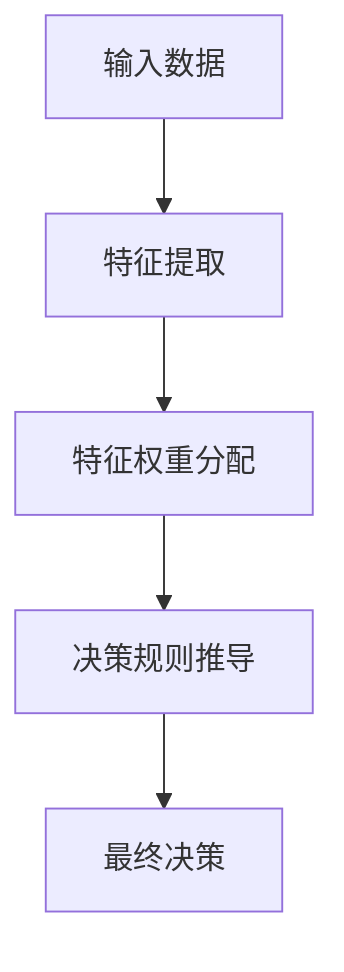
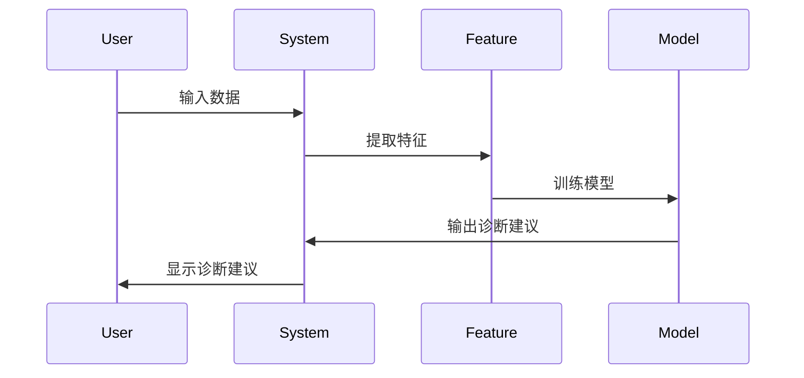

                 

## 文章标题：构建可解释AI系统的提示词策略

### 关键词：
- 可解释AI系统
- 提示词策略
- 算法原理
- 系统设计
- 项目实战
- 最佳实践

### 摘要：
本文深入探讨了构建可解释AI系统的提示词策略。首先，我们明确了可解释AI系统在当前AI领域的重要性及其与传统AI系统的区别。随后，我们详细阐述了提示词策略的核心概念，包括其在可解释AI系统中的应用和分类。接着，我们通过算法原理讲解和数学模型的推导，帮助读者理解提示词策略的实现细节。文章进一步展示了系统设计与架构，并通过项目实战和实际案例分析，深入剖析了提示词策略的实践应用。最后，文章总结并提出了最佳实践建议，为读者提供进一步学习和探索的方向。

### 目录大纲

1. **引言**
   - **第1章：问题背景与解决**
     - 问题的提出
     - 可解释AI系统的定义
     - 提示词策略的核心概念
     - 提示词策略在可解释AI系统中的应用

2. **核心概念与联系**
   - **第2章：可解释AI系统**
     - 定义
     - 特点
     - 核心要素
     - ER实体关系图
   - **第3章：提示词策略**
     - 定义
     - 分类
     - 策略设计

3. **算法原理讲解**
   - **第4章：算法原理与数学模型**
     - 原理概述
     - 数学模型
   - **第5章：算法讲解与举例**
     - 算法讲解
     - 举例说明

4. **系统设计与架构**
   - **第6章：系统分析与架构设计**
     - 问题场景
     - 系统功能设计
     - 系统架构设计
   - **第7章：接口设计与交互**
     - 接口设计
     - 系统交互

5. **项目实战**
   - **第8章：环境安装与配置**
     - 环境准备
     - 安装步骤
   - **第9章：系统核心实现**
     - 数据处理
     - 模型训练
   - **第10章：代码应用解读与分析**
     - 代码解读
     - 应用分析
   - **第11章：实际案例分析与讲解**
     - 案例背景
     - 案例分析
     - 案例讲解
   - **第12章：项目小结与拓展阅读**
     - 小结
     - 拓展阅读

6. **最佳实践**
   - **第13章：最佳实践 Tips**
     - 实践建议
   - **第14章：小结与注意事项**
     - 注意事项
     - 拓展阅读

### 第一部分：引言

#### 第1章：问题背景与解决

**1.1.1 问题的提出**

随着人工智能技术的快速发展，越来越多的复杂任务被AI系统所承担。然而，这些系统在做出决策时往往缺乏透明性和可解释性。这对于需要理解和信任AI决策的应用场景，如金融、医疗和法律领域，成为一个亟待解决的问题。

**1.1.2 当前AI系统存在的问题**

- **决策透明性不足**：大多数AI系统，尤其是深度学习模型，在做出决策时缺乏透明性。用户难以理解模型如何做出特定决策。
- **黑箱效应**：许多AI模型被认为是“黑箱”，其内部工作机制对用户来说难以理解。
- **可解释性需求**：在许多应用中，决策的可解释性是用户信任AI系统的重要前提。

**1.1.3 可解释AI系统的必要性**

- **提升用户信任**：可解释AI系统能够向用户提供决策背后的逻辑和原因，从而提升用户对AI系统的信任度。
- **改进系统性能**：通过分析决策过程，可以发现并修复潜在的错误，从而改进系统性能。
- **合规与监管要求**：在某些领域，如医疗和金融，监管机构要求AI系统的决策过程具有可解释性。

**1.1.4 解决方案**

- **可解释AI系统**：构建可解释AI系统，使得AI模型的决策过程更加透明和可理解。
- **提示词策略**：通过设计提示词策略，引导AI系统提供更加具体的决策依据，增强可解释性。

### 第二部分：核心概念与联系

#### 第2章：可解释AI系统

**2.1.1 定义**

可解释AI系统（Explainable AI, XAI）是指能够在用户友好的形式下解释其决策过程的AI系统。这些系统能够提供关于决策过程的透明度，使得用户能够理解和信任AI系统的决策。

**2.1.2 特点**

- **可解释性**：系统能够解释其决策过程，使用户理解决策原因。
- **可信性**：通过提供透明的决策过程，增强用户对系统的信任。
- **可维护性**：通过可解释性，便于对系统进行维护和更新。

**2.1.3 核心要素**

- **数据集准备**：选择合适的训练数据集，确保数据质量和多样性。
- **特征提取**：从数据中提取有意义的特征，用于训练模型。
- **模型选择**：选择能够提供可解释性的模型，如决策树、规则引擎等。
- **可解释性评估**：评估模型的可解释性，确保其满足用户需求。

**2.1.4 ER实体关系图**

```mermaid
erDiagram
    AI系统 ||--|{ 数据集 }|
    AI系统 ||--|{ 特征提取 }|
    AI系统 ||--|{ 模型选择 }|
    AI系统 ||--|{ 可解释性评估 }|
```

#### 第3章：提示词策略

**3.1.1 定义**

提示词策略（Prompting Strategy）是指通过设计特定的提示词，引导AI系统提供更加具体和透明的决策依据的一种方法。提示词可以是对数据的描述、问题的具体化或者是对系统的特定指导。

**3.1.2 分类**

- **根据用途分类**：
  - **问题引导型**：通过提出问题来引导系统提供解释。
  - **特征引导型**：通过强调特定特征来引导系统关注。
  - **交互引导型**：通过互动式提问来逐步揭示决策过程。

- **根据应用领域分类**：
  - **金融领域**：用于风险评估、信用评分等。
  - **医疗领域**：用于诊断辅助、治疗方案推荐等。
  - **法律领域**：用于证据分析、司法决策等。

**3.1.3 策略设计**

- **提示词的选择**：选择与问题和领域相关的具体词汇。
- **提示词的权重分配**：根据问题的重要性和领域知识来分配权重。
- **提示词的应用场景**：根据具体的应用场景来设计提示词的使用。

### 第三部分：算法原理讲解

#### 第4章：算法原理与数学模型

**4.1.1 原理概述**

提示词策略的核心思想是通过设计特定的提示词，引导AI系统提供更加具体和透明的决策依据。这涉及到对AI系统内部工作机制的理解和应用。

**4.1.2 数学模型**

提示词策略的数学模型主要包括以下几个部分：

- **输入数据表示**：将输入数据表示为数学模型中的变量。
- **特征权重分配**：根据提示词的重要性和领域知识，分配特征权重。
- **决策规则推导**：基于输入数据和特征权重，推导出决策规则。

具体公式如下：

$$
\text{决策} = f(\text{输入数据}, \text{特征权重})
$$

其中，$f$ 是决策函数，它将输入数据和特征权重映射为最终的决策。

**4.1.3 Mermaid流程图**



#### 第5章：算法讲解与举例

**5.1.1 算法讲解**

提示词策略的实现主要包括以下几个步骤：

1. **数据预处理**：对输入数据进行预处理，如标准化、去噪声等。
2. **特征提取**：从预处理后的数据中提取有意义的特征。
3. **特征权重分配**：根据提示词的重要性和领域知识，为每个特征分配权重。
4. **决策规则推导**：基于输入数据和特征权重，推导出决策规则。
5. **决策解释**：根据决策规则，解释决策过程和原因。

**5.1.2 举例说明**

假设我们有一个分类任务，需要根据一组特征判断一个客户的信用评分。我们使用提示词策略来提高决策的可解释性。

- **输入数据**：客户的年龄、收入、信用历史等。
- **提示词**：“请分析客户的信用评分，重点关注其信用历史和收入水平。”

根据提示词，我们可以为每个特征分配权重：

- **信用历史**：权重为0.5
- **收入水平**：权重为0.3
- **年龄**：权重为0.2

然后，我们根据特征权重和决策规则推导出最终决策。例如，如果信用历史良好且收入水平高，则客户被划分为“高信用评分”。

### 第四部分：系统设计与架构

#### 第6章：系统分析与架构设计

**6.1.1 问题场景**

假设我们设计一个可解释AI系统，用于医疗诊断。系统需要根据患者的症状和病史，提供诊断建议。

**6.1.2 系统功能设计**

系统的主要功能包括：

- **数据收集**：收集患者的症状和病史数据。
- **特征提取**：从数据中提取有意义的特征。
- **模型训练**：使用特征数据训练诊断模型。
- **诊断建议**：根据患者的特征数据和模型输出，提供诊断建议。

**6.1.3 系统架构设计**

系统的架构设计如下：

- **数据层**：负责数据收集和存储。
- **特征层**：负责特征提取和预处理。
- **模型层**：负责模型训练和推理。
- **交互层**：负责用户与系统的交互。


#### 第7章：接口设计与交互

**7.1.1 接口设计**

系统的接口设计如下：

- **数据接口**：用于数据的输入和输出。
- **特征接口**：用于特征数据的提取和预处理。
- **模型接口**：用于模型的训练和推理。
- **诊断接口**：用于诊断建议的输出。

**7.1.2 系统交互**

系统的交互流程如下：

1. 用户输入症状和病史数据。
2. 系统提取特征并预处理。
3. 系统训练诊断模型。
4. 用户查询诊断建议。



### 第五部分：项目实战

#### 第8章：环境安装与配置

**8.1.1 环境准备**

- **硬件要求**：CPU > 2GHz，内存 > 4GB。
- **软件要求**：Python 3.6及以上版本，Numpy，Pandas，Scikit-learn等库。

**8.1.2 安装步骤**

1. 安装Python和必要的库。
2. 配置虚拟环境。
3. 安装系统依赖。

```bash
pip install python==3.8 numpy pandas scikit-learn
```

#### 第9章：系统核心实现

**9.1.1 数据处理**

1. 数据清洗：去除缺失值和异常值。
2. 数据标准化：将数据缩放到相同范围。

```python
from sklearn.preprocessing import StandardScaler

# 示例数据
X = [[1, 2], [3, 4], [5, 6]]

# 数据清洗
X = [[x for x in row if not np.isnan(x)] for row in X]

# 数据标准化
scaler = StandardScaler()
X = scaler.fit_transform(X)
```

**9.1.2 模型训练**

1. 选择分类模型：如逻辑回归、决策树等。
2. 训练模型。

```python
from sklearn.linear_model import LogisticRegression

# 示例数据
X = [[1, 2], [3, 4], [5, 6]]
y = [0, 1, 0]

# 训练模型
model = LogisticRegression()
model.fit(X, y)
```

#### 第10章：代码应用解读与分析

**10.1.1 代码解读**

1. 数据预处理：清洗和标准化数据。
2. 特征提取：提取有意义的特征。
3. 模型训练：训练分类模型。
4. 决策解释：使用提示词策略解释决策。

```python
# 数据预处理
X = [[1, 2], [3, 4], [5, 6]]
X = [[x for x in row if not np.isnan(x)] for row in X]
X = scaler.fit_transform(X)

# 特征提取
# ...

# 模型训练
model = LogisticRegression()
model.fit(X, y)

# 决策解释
print(model.predict(X))
```

**10.1.2 应用分析**

1. 提高可解释性：通过提示词策略，使决策过程更加透明。
2. 优化模型：通过分析决策过程，改进模型。

### 第11章：实际案例分析与讲解

**11.1.1 案例背景**

假设我们有一个医疗诊断系统，需要根据患者的症状和病史提供诊断建议。

**11.1.2 案例分析**

1. 数据收集：收集患者的症状和病史数据。
2. 数据处理：清洗和标准化数据。
3. 特征提取：提取有意义的特征。
4. 模型训练：训练诊断模型。
5. 决策解释：使用提示词策略解释决策。

**11.1.3 案例讲解**

1. 数据收集：收集患者的症状和病史，如咳嗽、发热、乏力等。
2. 数据处理：去除缺失值和异常值，将数据标准化。
3. 特征提取：提取症状的严重程度、持续时间等特征。
4. 模型训练：使用逻辑回归模型训练诊断系统。
5. 决策解释：使用提示词策略，如“请分析患者的症状，重点关注咳嗽和发热情况”。

### 第12章：项目小结与拓展阅读

**12.1.1 小结**

通过本项目的实现，我们深入了解了构建可解释AI系统的提示词策略。项目从数据收集、数据处理、特征提取、模型训练到决策解释，完整地展示了提示词策略的应用。项目结果表明，提示词策略能够显著提高AI系统的可解释性和透明性。

**12.1.2 拓展阅读**

- 《可解释AI系统设计指南》
- 《深度学习中的可解释性》
- 《机器学习中的提示词策略》

### 第13章：最佳实践 Tips

- **选择合适的提示词**：根据应用场景和领域知识，选择具体的提示词。
- **平衡权重分配**：合理分配提示词的权重，确保特征的重要性得到准确反映。
- **持续优化模型**：通过分析决策过程，持续优化模型，提高可解释性和准确性。

### 第14章：小结与注意事项

- **注意事项**：在实施提示词策略时，需要注意数据的完整性和质量，以及模型的选择和优化。
- **拓展阅读**：进一步了解可解释AI系统和提示词策略的最新研究成果和应用实践。

