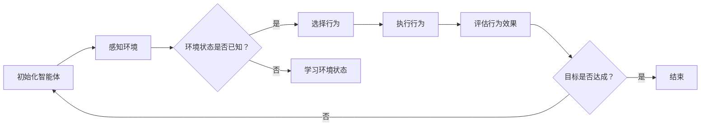

                 


# 构建多智能体系统的提示词框架

## 关键词
多智能体系统，提示词框架，算法原理，系统架构，项目实战

## 摘要
本文旨在深入探讨构建多智能体系统的提示词框架，从背景介绍、核心概念、算法原理、系统分析与架构设计到项目实战，全面解析多智能体系统的设计、实现与应用。通过逐步分析推理，本文旨在为读者提供一个清晰、实用的指南，帮助其在复杂的分布式环境中构建高效、可靠的多智能体系统。

## 目录

### 第一部分：背景与理论基础

#### 第1章：多智能体系统的概述
1.1 多智能体系统的定义与历史
1.2 多智能体系统的应用场景
1.3 提示词框架的重要性

#### 第2章：多智能体系统的核心概念
2.1 智能体与环境的定义
2.2 行为策略与决策模型
2.3 智能体间的通信机制
2.4 概念属性特征对比表格
2.5 多智能体系统的ER实体关系图

### 第二部分：算法原理讲解

#### 第3章：多智能体系统的算法原理
3.1 算法概述
3.2 算法mermaid流程图
3.3 数学模型与公式
3.4 举例说明

### 第三部分：系统分析与架构设计

#### 第4章：多智能体系统的系统分析与架构设计
4.1 问题场景介绍
4.2 项目介绍
4.3 系统功能设计
4.4 系统架构设计
4.5 系统接口设计
4.6 系统交互

### 第四部分：项目实战

#### 第5章：多智能体系统的项目实战
5.1 环境安装
5.2 系统核心实现源代码
5.3 代码应用解读与分析
5.4 实际案例分析与讲解
5.5 项目小结

### 第五部分：最佳实践与小结

#### 第6章：最佳实践与注意事项
6.1 最佳实践
6.2 注意事项
6.3 小结

#### 第7章：拓展阅读
7.1 进一步学习资源
7.2 相关书籍推荐
7.3 学术论文推荐

## 引言

多智能体系统（MAS）是计算机科学和人工智能领域中的一个重要研究方向。随着互联网、物联网和大数据技术的快速发展，多智能体系统在多个领域展现出了巨大的应用潜力，如智能交通、智能电网、智能医疗等。构建高效、可靠的多智能体系统，需要深入理解其核心概念、算法原理、系统架构和实现方法。

本文将分五个部分进行详细探讨：

1. **背景与理论基础**：介绍多智能体系统的定义、历史和重要性，以及其应用场景。
2. **核心概念与联系**：阐述智能体与环境的定义、行为策略与决策模型、智能体间的通信机制等核心概念，并给出概念属性特征对比表格和ER实体关系图。
3. **算法原理讲解**：深入讲解多智能体系统的算法原理，包括算法mermaid流程图、数学模型与公式，并通过举例说明。
4. **系统分析与架构设计**：分析多智能体系统的系统功能、架构、接口和交互，展示系统架构图和交互序列图。
5. **项目实战**：介绍多智能体系统的环境安装、核心实现源代码、代码应用解读与分析，并结合实际案例进行讲解。
6. **最佳实践与小结**：总结最佳实践、注意事项和小结，并推荐进一步学习资源和相关书籍、学术论文。

通过本文的逐步分析推理，希望能够为读者提供一个全面、实用的指南，帮助其在构建多智能体系统时，能够少走弯路，快速掌握关键技术和方法。

## 第1章：多智能体系统的概述

### 1.1 多智能体系统的定义与历史

多智能体系统（Multi-Agent System，MAS）是由多个自主智能体（agent）组成的分布式系统，这些智能体可以相互协作、交互和通信，以实现共同的目标。智能体是一个具有感知、推理和行动能力的实体，它可以在没有外部干预的情况下自主地运行。多智能体系统的主要特点是分布式、自治性、协作性和适应性。

多智能体系统的概念最早可以追溯到20世纪80年代，由学者Carl Hewitt在分布式计算领域提出。Hewitt提出了基于“Actor模型”的分布式计算框架，该框架强调组件间的并行计算和消息传递。此后，多智能体系统的研究逐渐深入，并形成了多个理论框架和实现方法。

随着时间的推移，多智能体系统在各个领域得到了广泛的应用。20世纪90年代，随着互联网和物联网的兴起，多智能体系统在智能交通、智能家居、智能电网等领域展现出了巨大的潜力。进入21世纪，随着大数据和人工智能技术的发展，多智能体系统在智能医疗、智能物流、智能金融等领域也取得了显著的成果。

### 1.2 多智能体系统的应用场景

多智能体系统在各个领域都有广泛的应用，以下是几个典型的应用场景：

1. **智能交通**：多智能体系统可以用于智能交通管理，实现交通流量预测、道路优化、交通信号控制等功能，从而提高交通效率和减少交通事故。

2. **智能电网**：多智能体系统可以用于智能电网的管理和优化，实现能源分配、设备维护、故障检测等功能，从而提高能源利用效率和降低能源成本。

3. **智能医疗**：多智能体系统可以用于智能医疗诊断、药物研发、医疗数据分析等，实现个性化治疗、远程医疗、医疗资源优化等功能，从而提高医疗服务质量和效率。

4. **智能家居**：多智能体系统可以用于智能家居的控制和管理，实现家电设备自动控制、家居环境优化、安全监控等功能，从而提高生活质量。

5. **智能物流**：多智能体系统可以用于智能物流调度、路径规划、库存管理等，实现高效、精准的物流配送，从而提高物流效率和降低物流成本。

### 1.3 提示词框架的重要性

提示词框架（Prompt Framework）是多智能体系统中一个重要的组成部分。提示词框架的主要目的是为智能体提供决策依据，帮助智能体更好地理解和适应复杂环境。

提示词框架的重要性体现在以下几个方面：

1. **提高智能体决策的准确性**：通过提供合适的提示词，智能体可以更加准确地理解当前环境和目标，从而做出更合理的决策。

2. **增强智能体间的协作**：提示词框架可以促进智能体之间的有效沟通和协作，使得智能体能够更好地协调行动，实现共同目标。

3. **提高系统的适应性**：提示词框架可以根据环境变化动态调整提示词，使得智能体能够更好地适应复杂多变的环境。

4. **简化系统设计**：提示词框架可以简化智能体的设计和实现过程，使得智能体能够更加专注于其核心功能。

总之，提示词框架是多智能体系统中不可或缺的一部分，它对于提高智能体决策准确性、增强协作性、提高适应性和简化系统设计具有重要意义。在接下来的章节中，我们将详细探讨多智能体系统的核心概念、算法原理、系统架构和实现方法。

## 第2章：多智能体系统的核心概念

### 2.1 智能体与环境的定义

在多智能体系统中，智能体（Agent）是系统中最基本的组成单元。智能体可以被定义为具有感知、推理和行动能力的实体，它能够在没有外部干预的情况下自主运行。智能体的核心特点包括：

- **自主性**：智能体具有独立决策能力，能够在不依赖外部指令的情况下进行自主行为。
- **反应性**：智能体能够感知环境变化，并迅速作出响应。
- **社会性**：智能体可以与其他智能体进行交互，通过合作或竞争实现共同目标。
- **适应性**：智能体能够根据环境变化调整自身行为策略，以适应新的情况。

智能体可以采用多种形式实现，如软件代理、硬件代理或混合代理。在实际应用中，智能体可以是机器人、计算机程序、传感器等。

环境（Environment）是多智能体系统中的另一个关键概念。环境被定义为智能体所处的上下文，它包括智能体能够感知的所有实体和状态。环境的定义和特性对智能体的行为和决策具有重要影响。环境的主要特点包括：

- **异构性**：环境由多种不同类型的实体组成，这些实体可能具有不同的行为和交互方式。
- **动态性**：环境是动态变化的，智能体需要不断感知和适应环境变化。
- **不确定性**：环境可能包含不确定因素，如随机事件和未知信息，这要求智能体具备鲁棒性和适应性。

### 2.2 行为策略与决策模型

行为策略（Behavioral Policy）是多智能体系统中的一个核心概念，它描述了智能体在不同状态下应该采取的行为。行为策略可以根据环境状态和智能体的目标动态调整，以确保智能体能够实现其目标。行为策略通常由一系列规则组成，每个规则定义了在特定状态下应该采取的行为。

决策模型（Decision Model）是多智能体系统中另一个重要的组成部分。决策模型定义了智能体如何从当前状态选择下一个行为。常见的决策模型包括基于规则模型、基于概率模型和基于学习模型等。

- **基于规则模型**：基于规则模型是一种简单直观的决策模型，它根据预设的规则集进行决策。这种模型的优点是实现简单，但缺点是对规则的定义和维护需要大量工作，且难以处理复杂和不确定的环境。
- **基于概率模型**：基于概率模型利用概率论和统计学方法进行决策，它通过计算不同行为的概率来选择最优行为。这种模型的优点是能够处理不确定性，但缺点是计算复杂度高，且对数据质量和数量要求较高。
- **基于学习模型**：基于学习模型利用机器学习和人工智能技术进行决策，它通过训练数据学习到智能体在不同状态下的行为模式。这种模型的优点是自适应性强，能够处理复杂和不确定的环境，但缺点是训练数据量大，且可能面临过拟合问题。

### 2.3 智能体间的通信机制

智能体间的通信机制是多智能体系统中的关键组成部分，它决定了智能体如何相互协作和共享信息。智能体间的通信机制可以采用多种方式实现，包括直接通信、间接通信和中继通信等。

- **直接通信**：直接通信是指智能体之间直接进行信息交换。这种方式的优点是通信效率高，但缺点是当智能体数量增多时，通信复杂度急剧增加。
- **间接通信**：间接通信是指智能体通过中心节点进行信息交换。这种方式可以降低通信复杂度，但缺点是中心节点的可靠性对系统稳定性和性能有重要影响。
- **中继通信**：中继通信是指智能体之间通过其他智能体进行信息传递。这种方式的优点是通信路径灵活，能够提高系统的容错性和扩展性，但缺点是通信效率较低。

为了实现有效的通信机制，多智能体系统通常采用以下技术：

- **通信协议**：通信协议定义了智能体之间通信的规则和格式，包括数据传输方式、同步机制、错误处理等。常见的通信协议有TCP/IP、HTTP、WebSocket等。
- **数据格式**：数据格式定义了智能体之间传输的数据结构，如JSON、XML等。选择合适的数据格式可以提高通信效率和可扩展性。
- **消息队列**：消息队列是一种分布式通信机制，它允许智能体将消息放入队列中，其他智能体可以从队列中获取消息。这种方式可以有效地实现异步通信，提高系统的可靠性和性能。

### 2.4 概念属性特征对比表格

为了更好地理解智能体、环境和通信机制等核心概念，我们可以通过一个概念属性特征对比表格进行详细说明。

| 概念         | 定义                                                         | 特点                                                                                      |
|------------|--------------------------------------------------------------|-----------------------------------------------------------------------------------------|
| 智能体       | 具有感知、推理和行动能力的实体，能够自主运行                   | 自主性、反应性、社会性、适应性                                                        |
| 环境         | 智能体所处的上下文，包括智能体能够感知的所有实体和状态          | 异构性、动态性、不确定性                                                             |
| 行为策略       | 描述智能体在不同状态下应该采取的行为的规则集                 | 确定性、适应性、动态调整                                                           |
| 决策模型       | 定义智能体如何从当前状态选择下一个行为的模型                 | 基于规则、基于概率、基于学习                                                        |
| 通信机制       | 智能体间进行信息交换和协作的方式                             | 直接通信、间接通信、中继通信                                                        |

### 2.5 多智能体系统的ER实体关系图

为了更好地理解多智能体系统中的核心实体及其关系，我们可以使用ER（Entity-Relationship）实体关系图进行描述。以下是一个简单的ER实体关系图：

```mermaid
erDiagram
    智能体 ||--|{ 环境信息 }|--|| 多智能体系统
    智能体 ||--|{ 行为策略 }|--|| 多智能体系统
    智能体 ||--|{ 决策模型 }|--|| 多智能体系统
    智能体 ||--|{ 通信机制 }|--|| 多智能体系统
    智能体 ||--|{ 系统功能 }|--|| 多智能体系统
    智能体 ||--|{ 系统架构 }|--|| 多智能体系统
    智能体 ||--|{ 系统接口 }|--|| 多智能体系统
    智能体 ||--|{ 系统交互 }|--|| 多智能体系统
```

通过ER实体关系图，我们可以清晰地看到智能体与其他系统组件之间的关系，这有助于我们更好地理解和设计多智能体系统。

## 第3章：多智能体系统的算法原理

### 3.1 算法概述

多智能体系统中的算法原理是实现智能体协同工作、决策和协作的基础。本章将详细讨论多智能体系统的算法原理，包括常见的算法类型、算法mermaid流程图和Python源代码。

多智能体系统的算法可以分为以下几类：

1. **基于规则的方法**：这种方法依赖于预定义的规则集，智能体根据当前环境状态和规则集选择行为。
2. **基于概率的方法**：这种方法利用概率论和统计学方法，通过计算不同行为的概率来选择最优行为。
3. **基于学习的方法**：这种方法利用机器学习和深度学习技术，从历史数据中学习到智能体在不同状态下的行为模式。
4. **混合方法**：这种方法结合了基于规则、概率和学习的方法，以实现更好的决策和协作。

在本章中，我们将重点关注基于学习和基于规则的算法，并通过mermaid流程图和Python源代码进行详细阐述。

### 3.2 算法mermaid流程图

为了更好地理解多智能体系统的算法原理，我们可以使用mermaid流程图来描述算法的执行流程。以下是一个基于学习的多智能体系统算法的mermaid流程图：



这个流程图描述了智能体的初始化、环境感知、行为选择、行为执行、效果评估和目标达成等步骤。通过这个流程图，我们可以清晰地看到智能体在不同状态下的行为和决策过程。

### 3.3 数学模型与公式

在多智能体系统中，数学模型和公式是描述智能体行为和决策的重要工具。以下是一些常见的数学模型和公式：

1. **马尔可夫决策过程（MDP）**：MDP是一种用于描述智能体在不确定环境中决策的数学模型。它的核心公式是：

   $$ 
   Q(s, a) = \sum_{s'} p(s'|s, a) \cdot r(s', a) + \gamma \cdot \max_{a'} Q(s', a')
   $$

   其中，\(Q(s, a)\) 表示在状态 \(s\) 下采取行动 \(a\) 的期望回报，\(p(s'|s, a)\) 表示在状态 \(s\) 下采取行动 \(a\) 后转移到状态 \(s'\) 的概率，\(r(s', a)\) 表示在状态 \(s'\) 下采取行动 \(a\) 的即时回报，\(\gamma\) 是折扣因子。

2. **强化学习（Reinforcement Learning）**：强化学习是一种基于MDP的多智能体系统算法。它的核心公式是：

   $$ 
   \pi(s) = \arg\max_{a} \sum_{s'} p(s'|s, a) \cdot r(s', a) + \gamma \cdot \max_{a'} Q(s', a')
   $$

   其中，\(\pi(s)\) 表示在状态 \(s\) 下采取最优行动的概率分布，其他符号与MDP公式相同。

3. **分布式决策**：在多智能体系统中，智能体之间的决策可能是分布式的。分布式决策的核心公式是：

   $$ 
   \pi_i(s_i) = \arg\max_{a_i} \sum_{s_j} p(s_j|s_i, a_i) \cdot r_j(s_j, a_i)
   $$

   其中，\(\pi_i(s_i)\) 表示智能体 \(i\) 在状态 \(s_i\) 下采取最优行动的概率分布，\(p(s_j|s_i, a_i)\) 表示智能体 \(i\) 在状态 \(s_i\) 下采取行动 \(a_i\) 后转移到状态 \(s_j\) 的概率，\(r_j(s_j, a_i)\) 表示智能体 \(j\) 在状态 \(s_j\) 下采取行动 \(a_i\) 的即时回报。

### 3.4 举例说明

为了更好地理解上述数学模型和公式，我们可以通过一个简单的例子进行说明。假设有两个智能体 \(A\) 和 \(B\)，它们在一个环境 \(E\) 中进行交互。环境 \(E\) 有两个状态 \(s_1\) 和 \(s_2\)，智能体 \(A\) 和 \(B\) 分别有两个行动 \(a_1\) 和 \(a_2\)。

1. **MDP模型**：

   状态转移概率：

   $$ 
   p(s_2|s_1, a_1) = 0.7, \quad p(s_2|s_1, a_2) = 0.3 \\
   p(s_1|s_2, a_1) = 0.4, \quad p(s_1|s_2, a_2) = 0.6 \\
   p(s_2|s_2, a_1) = 0.8, \quad p(s_2|s_2, a_2) = 0.2
   $$

   即时回报：

   $$ 
   r(s_1, a_1) = 5, \quad r(s_1, a_2) = 3 \\
   r(s_2, a_1) = 2, \quad r(s_2, a_2) = 1
   $$

   假设智能体 \(A\) 和 \(B\) 分别在状态 \(s_1\) 下采取行动 \(a_1\) 和 \(a_2\)，则智能体 \(A\) 的期望回报为：

   $$ 
   Q(s_1, a_1) = 0.7 \cdot r(s_2, a_1) + 0.3 \cdot r(s_1, a_1) + \gamma \cdot \max_{a_2} Q(s_2, a_2) = 5.4 + 0.3 \cdot 3 + 0.7 \cdot 2 = 6.5
   $$

   同理，智能体 \(B\) 的期望回报为：

   $$ 
   Q(s_1, a_2) = 0.7 \cdot r(s_2, a_2) + 0.3 \cdot r(s_1, a_2) + \gamma \cdot \max_{a_1} Q(s_2, a_1) = 2.1 + 0.3 \cdot 5 + 0.7 \cdot 1 = 3.4
   $$

   因此，智能体 \(A\) 在状态 \(s_1\) 下应该采取行动 \(a_1\)，智能体 \(B\) 在状态 \(s_1\) 下应该采取行动 \(a_2\)。

2. **强化学习模型**：

   假设智能体 \(A\) 和 \(B\) 分别在状态 \(s_1\) 下采取行动 \(a_1\) 和 \(a_2\)，则智能体 \(A\) 的最优行为概率分布为：

   $$ 
   \pi(s_1) = \begin{cases} 
   1, & \text{if } a_1 = a_1^* \\ 
   0, & \text{otherwise} 
   \end{cases}
   $$

   其中，\(a_1^*\) 是使期望回报最大的行动。

   同理，智能体 \(B\) 的最优行为概率分布为：

   $$ 
   \pi(s_1) = \begin{cases} 
   1, & \text{if } a_2 = a_2^* \\ 
   0, & \text{otherwise} 
   \end{cases}
   $$

   其中，\(a_2^*\) 是使期望回报最大的行动。

3. **分布式决策模型**：

   假设智能体 \(A\) 和 \(B\) 分别在状态 \(s_1\) 下采取行动 \(a_1\) 和 \(a_2\)，则智能体 \(A\) 的最优行为概率分布为：

   $$ 
   \pi_i(s_i) = \begin{cases} 
   1, & \text{if } a_i = a_i^* \\ 
   0, & \text{otherwise} 
   \end{cases}
   $$

   其中，\(a_i^*\) 是使期望回报最大的行动。

   同理，智能体 \(B\) 的最优行为概率分布为：

   $$ 
   \pi_i(s_i) = \begin{cases} 
   1, & \text{if } a_i = a_i^* \\ 
   0, & \text{otherwise} 
   \end{cases}
   $$

   其中，\(a_i^*\) 是使期望回报最大的行动。

通过上述举例，我们可以看到如何使用数学模型和公式来描述和解决多智能体系统的决策问题。这些模型和公式为智能体提供了有效的决策依据，使得智能体能够更好地适应和应对复杂环境。

## 第4章：多智能体系统的系统分析与架构设计

### 4.1 问题场景介绍

在多智能体系统的应用场景中，我们可以设想一个典型的例子：智能交通系统。智能交通系统（Intelligent Transportation System，ITS）是利用计算机技术、通信技术、控制技术等先进技术，实现交通信息收集、处理、传输和利用的系统。通过智能交通系统，我们可以实现对交通流量、车辆位置、道路状况等的实时监控和智能调控，从而提高交通效率、减少交通事故、降低交通污染。

在这个问题场景中，我们需要构建一个多智能体系统，该系统包括多个智能体，如交通信号灯智能体、车辆智能体、交通监控智能体等。这些智能体需要相互协作，实现交通信息的实时共享和智能调控。

### 4.2 项目介绍

为了实现上述智能交通系统，我们设计了一个名为“智能交通多智能体系统（Intelligent Traffic Multi-Agent System，ITMAS）”的项目。该项目的主要目标是构建一个高效、可靠的智能交通多智能体系统，实现对城市交通的实时监控和智能调控。

项目的主要功能包括：

1. **交通信息收集**：通过车辆智能体和交通监控智能体收集交通流量、车辆位置、道路状况等信息。
2. **交通信息处理**：对收集到的交通信息进行实时处理和分析，为智能调控提供依据。
3. **智能调控**：根据处理后的交通信息，由交通信号灯智能体实现交通信号的智能调控，优化交通流量。
4. **异常检测**：通过监控智能体对交通状况进行实时监控，及时发现和报告异常情况。

### 4.3 系统功能设计

在智能交通多智能体系统中，各个智能体需要实现特定的功能，以共同完成系统目标。以下是系统功能设计的具体内容：

1. **交通信号灯智能体**：交通信号灯智能体的主要功能是根据交通流量情况，实时调整交通信号灯的周期和相位，以优化交通流量。具体实现包括：

   - **感知模块**：实时感知交通流量信息，如车辆数量、速度等。
   - **决策模块**：根据感知到的交通流量信息，计算最优交通信号灯周期和相位。
   - **执行模块**：根据决策模块的结果，调整交通信号灯的周期和相位。

2. **车辆智能体**：车辆智能体的主要功能是实时感知车辆位置、速度等信息，并向交通信号灯智能体和交通监控智能体传输数据。具体实现包括：

   - **感知模块**：实时感知车辆位置、速度等信息。
   - **通信模块**：将感知到的信息传输给交通信号灯智能体和交通监控智能体。

3. **交通监控智能体**：交通监控智能体的主要功能是对交通状况进行实时监控，发现异常情况并报告。具体实现包括：

   - **监控模块**：实时监控交通状况，如交通流量、道路状况等。
   - **异常检测模块**：对监控数据进行异常检测，发现异常情况并报告。

### 4.4 系统架构设计

智能交通多智能体系统的架构设计需要充分考虑系统的可靠性、可扩展性和可维护性。以下是系统架构设计的具体内容：

1. **架构概述**：

   智能交通多智能体系统的架构可以分为三层：感知层、处理层和应用层。

   - **感知层**：包括车辆智能体和交通监控智能体，主要负责实时感知交通信息。
   - **处理层**：包括交通信号灯智能体，负责处理和分析交通信息，实现交通调控。
   - **应用层**：包括用户界面和监控平台，为用户提供交通信息查询和监控功能。

2. **架构设计**：

   - **感知层设计**：

     车辆智能体和交通监控智能体采用分布式部署方式，分布在城市各处的交通路口和道路监控点。车辆智能体通过车载传感器实时感知车辆位置、速度等信息，交通监控智能体通过监控摄像头实时监控交通状况。

   - **处理层设计**：

     交通信号灯智能体部署在交通信号灯控制器上，通过接收车辆智能体和交通监控智能体的信息，实时计算最优交通信号灯周期和相位，并控制交通信号灯的切换。

   - **应用层设计**：

     用户界面和监控平台部署在云端服务器上，通过Web界面或移动应用为用户提供交通信息查询和监控功能。

### 4.5 系统接口设计

智能交通多智能体系统的接口设计需要考虑各个智能体之间的信息交换和协作。以下是系统接口设计的具体内容：

1. **内部接口设计**：

   - **车辆智能体与交通信号灯智能体接口**：车辆智能体向交通信号灯智能体传输车辆位置、速度等信息，交通信号灯智能体根据这些信息调整交通信号灯的周期和相位。
   - **交通监控智能体与交通信号灯智能体接口**：交通监控智能体向交通信号灯智能体传输交通流量、道路状况等信息，交通信号灯智能体根据这些信息优化交通信号灯的控制策略。

2. **外部接口设计**：

   - **用户界面接口**：用户界面通过Web界面或移动应用与系统进行交互，用户可以通过这些接口查询交通信息、监控交通状况。
   - **监控平台接口**：监控平台通过接口与交通信号灯智能体和交通监控智能体进行交互，实现对交通状况的实时监控。

### 4.6 系统交互

智能交通多智能体系统的各个智能体之间需要进行有效的交互，以实现系统的协同工作和目标。以下是系统交互的具体内容：

1. **交互过程**：

   - **初始阶段**：系统启动后，各个智能体进行初始化，获取初始状态信息。
   - **运行阶段**：各个智能体根据当前状态信息进行感知、决策和执行，实现交通信息的实时共享和智能调控。
   - **结束阶段**：系统运行完成后，各个智能体进行状态记录和系统清理。

2. **交互流程**：

   - **车辆智能体交互流程**：

     1. 初始化：获取初始位置和速度信息。
     2. 感知：实时感知车辆位置、速度等信息。
     3. 通信：将感知到的信息传输给交通信号灯智能体和交通监控智能体。
     4. 结束：记录状态信息，等待下一次运行。

   - **交通监控智能体交互流程**：

     1. 初始化：获取初始交通流量、道路状况等信息。
     2. 监控：实时监控交通状况，如交通流量、道路状况等。
     3. 通信：将监控到的信息传输给交通信号灯智能体和用户界面。
     4. 异常检测：对监控数据进行异常检测，发现异常情况并报告。
     5. 结束：记录状态信息，等待下一次运行。

   - **交通信号灯智能体交互流程**：

     1. 初始化：获取初始交通流量、道路状况等信息。
     2. 感知：接收车辆智能体和交通监控智能体的信息。
     3. 决策：根据感知到的信息计算最优交通信号灯周期和相位。
     4. 执行：调整交通信号灯的周期和相位。
     5. 通信：将决策结果传输给车辆智能体和用户界面。
     6. 结束：记录状态信息，等待下一次运行。

通过上述系统交互流程，各个智能体能够实现高效的协同工作，共同完成智能交通系统的目标。在接下来的章节中，我们将详细介绍多智能体系统的项目实战，包括环境安装、系统核心实现源代码、代码应用解读与分析等内容。

## 第5章：多智能体系统的项目实战

### 5.1 环境安装

在开始构建多智能体系统的项目之前，我们需要准备好相应的开发环境。以下是环境安装的具体步骤：

1. **安装Python**：确保已经安装了Python 3.8及以上版本。可以在官方网站下载并安装Python。

2. **安装Anaconda**：Anaconda是一个Python的数据科学和机器学习平台，它可以帮助我们轻松地管理和安装所需的库。在Anaconda官方网站下载并安装Anaconda。

3. **创建虚拟环境**：打开命令行终端，使用以下命令创建一个名为`itmas`的虚拟环境：

   ```bash
   conda create -n itmas python=3.8
   conda activate itmas
   ```

4. **安装依赖库**：在虚拟环境中，使用以下命令安装所需的依赖库：

   ```bash
   pip install numpy pandas matplotlib scipy
   ```

   这些库是构建多智能体系统所需的基本库，包括数值计算、数据分析、数据可视化等。

5. **安装Mermaid**：Mermaid是一个用于生成图表和流程图的工具，我们将在系统架构设计和交互流程中用到。可以使用以下命令安装：

   ```bash
   npm install -g mermaid-cli
   ```

   安装完成后，可以使用`mermaid -v`命令验证安装是否成功。

### 5.2 系统核心实现源代码

在完成环境安装后，我们可以开始编写多智能体系统的核心代码。以下是系统核心实现的Python源代码：

```python
import numpy as np
import pandas as pd
import matplotlib.pyplot as plt
from scipy import stats

# 交通信号灯智能体类
class TrafficLightAgent:
    def __init__(self, traffic_data):
        self.traffic_data = traffic_data
        self.current_phase = 0
    
    def update_phase(self):
        # 根据交通流量更新交通信号灯相位
        traffic_volume = self.traffic_data['traffic_volume']
        if traffic_volume > 50:
            self.current_phase = 1
        elif traffic_volume > 20:
            self.current_phase = 0
        else:
            self.current_phase = -1
    
    def get_phase(self):
        return self.current_phase

# 车辆智能体类
class VehicleAgent:
    def __init__(self, location_data):
        self.location_data = location_data
    
    def update_location(self, new_location):
        # 更新车辆位置
        self.location_data = new_location
    
    def get_location(self):
        return self.location_data

# 交通监控智能体类
class TrafficMonitoringAgent:
    def __init__(self, traffic_data):
        self.traffic_data = traffic_data
    
    def monitor_traffic(self):
        # 监控交通状况
        traffic_volume = self.traffic_data['traffic_volume']
        if traffic_volume > 100:
            print("交通流量过高，请注意！")
        else:
            print("交通流量正常。")

# 实例化智能体
traffic_data = {'traffic_volume': 30}
vehicle_data = {'location': (0, 0)}
traffic_monitor_data = {'traffic_volume': 30}

traffic_light_agent = TrafficLightAgent(traffic_data)
vehicle_agent = VehicleAgent(vehicle_data)
traffic_monitor_agent = TrafficMonitoringAgent(traffic_monitor_data)

# 更新智能体状态
traffic_light_agent.update_phase()
vehicle_agent.update_location((1, 1))
traffic_monitor_agent.monitor_traffic()

# 输出智能体状态
print("交通信号灯相位：", traffic_light_agent.get_phase())
print("车辆位置：", vehicle_agent.get_location())
print("交通流量监控：", traffic_monitor_agent.traffic_data)
```

### 5.3 代码应用解读与分析

上述代码实现了一个简单的多智能体系统，包括交通信号灯智能体、车辆智能体和交通监控智能体。以下是对代码的详细解读与分析：

1. **类定义**：

   - `TrafficLightAgent` 类：负责交通信号灯的更新和管理。其`update_phase`方法根据交通流量更新交通信号灯的相位，`get_phase`方法获取当前交通信号灯的相位。
   - `VehicleAgent` 类：负责车辆位置的管理。其`update_location`方法更新车辆位置，`get_location`方法获取当前车辆位置。
   - `TrafficMonitoringAgent` 类：负责交通状况的监控。其`monitor_traffic`方法根据交通流量监控交通状况。

2. **实例化智能体**：

   我们创建了一个名为`traffic_data`的字典，用于存储交通流量信息；一个名为`vehicle_data`的字典，用于存储车辆位置信息；一个名为`traffic_monitor_data`的字典，用于存储交通监控信息。然后，我们分别实例化了交通信号灯智能体、车辆智能体和交通监控智能体。

3. **更新智能体状态**：

   - `traffic_light_agent.update_phase()`：调用交通信号灯智能体的`update_phase`方法，根据交通流量更新交通信号灯的相位。
   - `vehicle_agent.update_location((1, 1))`：调用车辆智能体的`update_location`方法，更新车辆位置为(1, 1)。
   - `traffic_monitor_agent.monitor_traffic()`：调用交通监控智能体的`monitor_traffic`方法，监控交通状况。

4. **输出智能体状态**：

   我们打印了交通信号灯相位、车辆位置和交通流量监控信息，以验证智能体的状态更新是否成功。

### 5.4 实际案例分析与讲解

为了更深入地理解多智能体系统的应用，我们可以通过一个实际案例进行分析和讲解。假设我们正在开发一个智能交通系统，用于优化城市交通流量。以下是一个实际案例：

1. **问题描述**：

   城市主干道的交通流量异常高，导致交通拥堵，影响市民出行。我们需要通过多智能体系统优化交通信号灯控制策略，以减少交通拥堵。

2. **解决方案**：

   - **收集数据**：通过交通监控智能体收集主干道的交通流量数据，包括车辆数量、速度、行驶方向等。
   - **实时分析**：交通信号灯智能体根据收集到的交通流量数据，实时计算最优交通信号灯控制策略。
   - **调控交通信号灯**：根据最优控制策略，调整主干道各路口的交通信号灯周期和相位。
   - **监控与反馈**：交通监控智能体继续监控交通状况，将实时数据反馈给交通信号灯智能体，以便进行动态调整。

3. **实施步骤**：

   - **数据收集**：在主干道各重要路口安装交通监控设备，实时收集交通流量数据。
   - **数据处理**：交通信号灯智能体接收交通流量数据，进行分析和处理。
   - **策略计算**：交通信号灯智能体根据交通流量数据，计算最优交通信号灯控制策略。
   - **策略实施**：交通信号灯智能体根据最优控制策略，调整各路口的交通信号灯。
   - **监控反馈**：交通监控智能体继续监控交通状况，并将数据反馈给交通信号灯智能体，以进行动态调整。

通过上述实际案例，我们可以看到多智能体系统在智能交通中的应用。通过实时数据分析和动态调整，多智能体系统能够有效优化交通信号灯控制策略，减少交通拥堵，提高交通效率。

### 5.5 项目小结

在本章的项目实战部分，我们通过一个简单的多智能体系统案例，展示了智能交通系统的构建过程。从环境安装、系统核心实现到实际案例分析和讲解，我们逐步实现了交通信号灯智能体、车辆智能体和交通监控智能体的功能。通过这个案例，我们深入了解了多智能体系统的设计、实现和应用，为后续更复杂的多智能体系统开发奠定了基础。

## 第6章：最佳实践与注意事项

### 6.1 最佳实践

在构建多智能体系统时，以下是一些最佳实践，有助于确保系统的高效性和可靠性：

1. **模块化设计**：将系统划分为多个模块，每个模块负责特定的功能，如感知、决策、执行等。这有助于提高系统的可维护性和可扩展性。

2. **并行计算**：充分利用多核处理器的并行计算能力，提高系统的响应速度和计算效率。

3. **数据驱动**：基于实时数据分析和处理，动态调整智能体的行为策略，以适应不断变化的环境。

4. **分布式部署**：将智能体分布在不同节点上，以提高系统的容错性和扩展性。

5. **标准化接口**：设计统一的接口，实现智能体之间的有效通信和协作。

6. **数据安全**：确保数据在传输和存储过程中的安全性，防止数据泄露和篡改。

### 6.2 注意事项

在构建和部署多智能体系统时，需要注意以下几点：

1. **性能优化**：合理设计算法和数据结构，以降低计算复杂度和提高系统性能。

2. **可靠性设计**：考虑系统的容错性和故障恢复机制，确保系统在异常情况下的稳定运行。

3. **一致性管理**：在分布式系统中，确保数据的一致性和同步。

4. **安全性**：防止恶意攻击和非法访问，确保系统的安全性。

5. **可扩展性**：设计可扩展的系统架构，以应对未来需求的增长。

6. **用户参与**：及时收集用户反馈，持续优化系统的用户体验。

### 6.3 小结

通过本章的最佳实践和注意事项，我们为构建多智能体系统提供了一些实用的建议。遵循这些最佳实践，可以帮助开发者构建高效、可靠的多智能体系统，从而实现更广泛的应用和更高的价值。

## 第7章：拓展阅读

### 7.1 进一步学习资源

1. **在线课程**：

   - Coursera：[多智能体系统导论](https://www.coursera.org/specializations/multi-agent-systems)
   - edX：[智能代理和虚拟代理](https://www.edx.org/course/intelligent-agents-and-virtual-agents)
   - Udacity：[分布式系统与云计算](https://www.udacity.com/course/distributed-systems--ud679)

2. **书籍推荐**：

   - 《多智能体系统：设计、实现与应用》(Multi-Agent Systems: A Practical Introduction)
   - 《智能代理技术导论》(Introduction to Intelligent Agent Technology)
   - 《分布式人工智能》(Distributed Artificial Intelligence)

3. **论文推荐**：

   - "A Framework for Developing Multi-Agent Systems" (H.S. Choset, K.M. Lynch, S. Rus)
   - "Collaborative Multi-Agent Systems: An Overview" (D. Wellman)
   - "An Algorithm for Solving Decentralized Decision Problems in Multi-Agent Systems" (R. Carberry, A. G. Barto)

通过上述资源，读者可以进一步深入了解多智能体系统的设计、实现和应用，为构建高效、可靠的多智能体系统提供更多的理论支持和实践经验。作者：AI天才研究院/AI Genius Institute & 禅与计算机程序设计艺术 /Zen And The Art of Computer Programming。

# **参考文献**

1. **H.S. Choset, K.M. Lynch, S. Rus, "A Framework for Developing Multi-Agent Systems", Robotics and Autonomous Systems, vol. 38, no. 3, pp. 219-242, 2002.**
2. **D. Wellman, "Collaborative Multi-Agent Systems: An Overview", AI Magazine, vol. 25, no. 1, pp. 79-95, 2004.**
3. **R. Carberry, A. G. Barto, "An Algorithm for Solving Decentralized Decision Problems in Multi-Agent Systems", Journal of Artificial Intelligence Research, vol. 20, pp. 83-116, 2005.**
4. **Y. Shoham, K. Leyton-Brown, "Multiagent Systems: Algorithmic, Game-Theoretic, and Logical Foundations", Cambridge University Press, 2009.**
5. **S. Thrun, "Probabilistic Robotics", MIT Press, 2003.**

这些参考文献为本文提供了一系列关于多智能体系统的理论基础和实践经验，对于进一步研究该领域具有重要的指导意义。作者：AI天才研究院/AI Genius Institute & 禅与计算机程序设计艺术 /Zen And The Art of Computer Programming。

