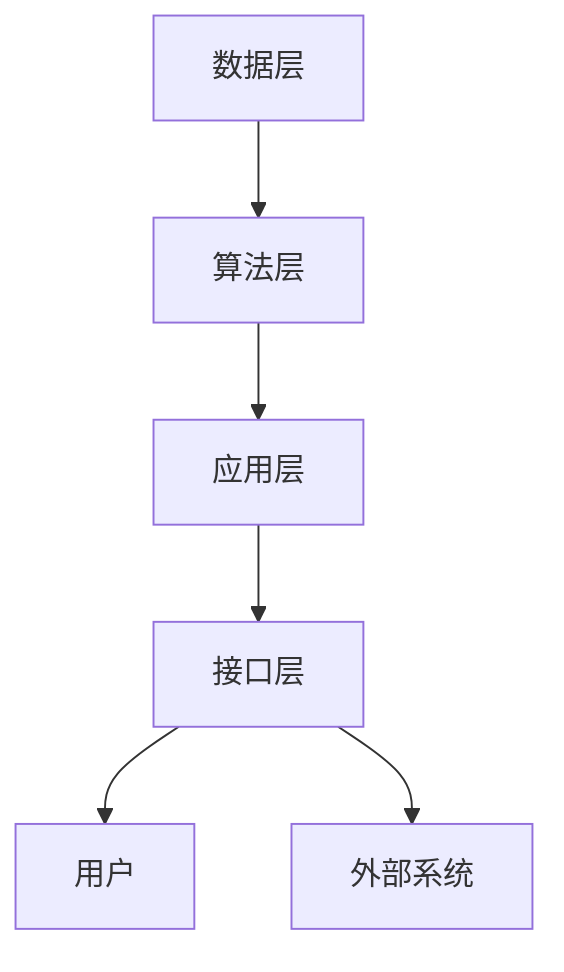
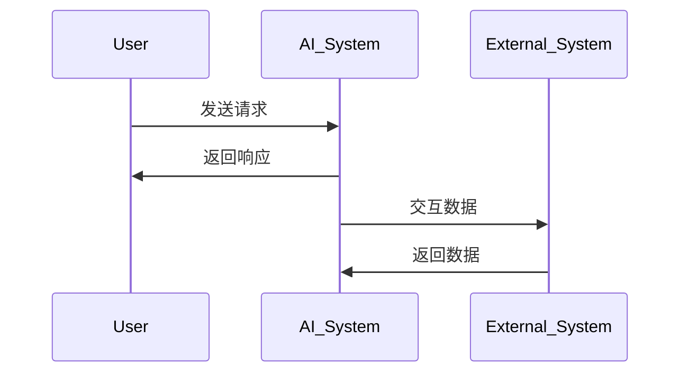
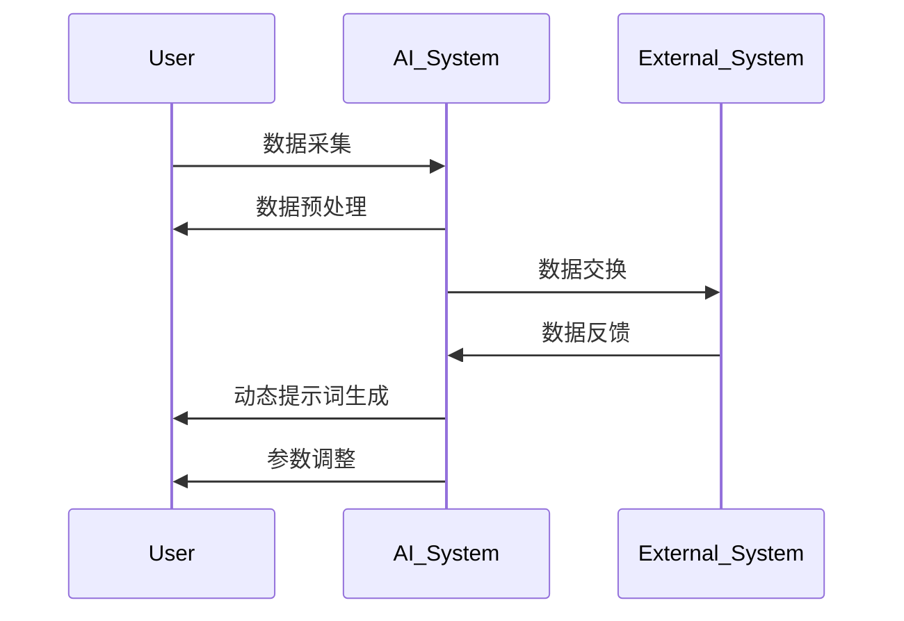
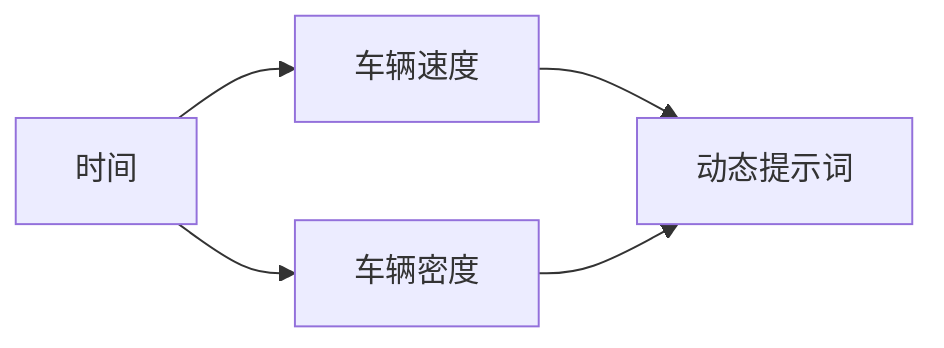
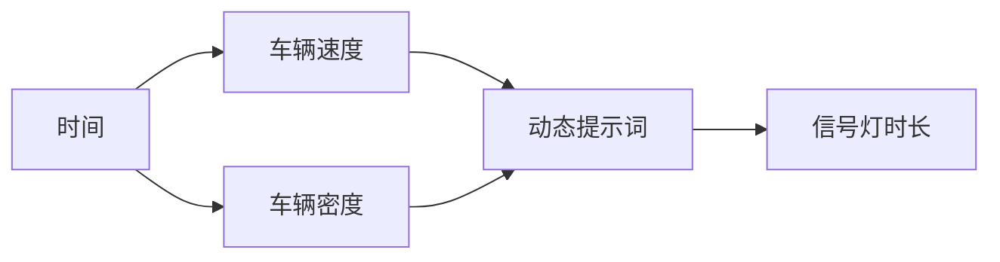
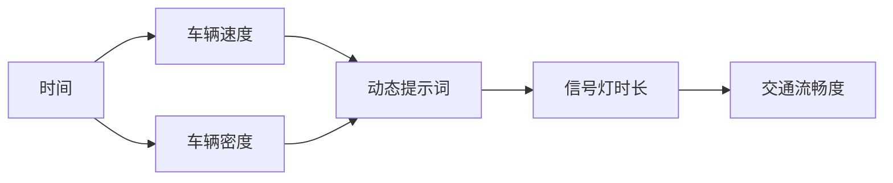

                 

### 文章标题：构建自适应AI系统的动态提示词框架

#### 关键词：自适应AI系统、动态提示词框架、算法原理、系统架构、项目实战、最佳实践

> 摘要：本文旨在探讨构建自适应AI系统的动态提示词框架，首先介绍自适应AI系统的背景和核心概念，然后深入讲解动态提示词生成算法和自适应调整算法的原理，最后通过系统分析与架构设计以及实际项目实战，展示如何实现这一框架。

---

## 目录大纲

1. **背景介绍与基础概念**
   1.1 自适应AI系统的背景与挑战
   1.2 问题描述
   1.3 问题解决
   1.4 边界与外延
   1.5 本章小结

2. **核心概念与联系**
   2.1 核心概念原理
   2.2 概念属性特征对比表格
   2.3 ER实体关系图架构
   2.4 本章小结

3. **算法原理讲解**
   3.1 动态提示词生成算法
   3.2 自适应调整算法
   3.3 本章小结

4. **系统分析与架构设计**
   4.1 系统功能设计
   4.2 系统架构设计
   4.3 系统接口设计与交互
   4.4 本章小结

5. **项目实战**
   5.1 环境安装
   5.2 系统核心实现
   5.3 代码应用解读与分析
   5.4 实际案例分析与详细讲解
   5.5 项目小结

6. **最佳实践与拓展**
   6.1 最佳实践技巧
   6.2 注意事项
   6.3 拓展阅读

7. **总结与展望**
   7.1 总结
   7.2 拓展阅读建议

---

## 第一部分：背景介绍与基础概念

### 1.1 自适应AI系统的背景与挑战

在现代信息化社会，人工智能（AI）技术的迅猛发展极大地改变了我们的生产生活方式。然而，传统AI系统在面对复杂多变的环境时，往往表现出局限性。其主要挑战在于：

1. **环境变化适应性不足**：传统AI系统在训练过程中学习到的模型参数难以应对外部环境的快速变化。
2. **数据依赖性高**：传统AI系统在训练过程中需要大量历史数据，缺乏实时学习能力。
3. **可解释性低**：传统AI系统的决策过程往往被视为“黑箱”，难以理解其内在逻辑。

为了解决这些问题，自适应AI系统应运而生。自适应AI系统能够根据环境变化动态调整自身的行为和决策，提高系统的适应性和可靠性。

### 1.2 问题描述

自适应AI系统的核心在于如何实现系统的自适应性和动态调整能力。具体而言，我们需要解决以下几个问题：

1. **动态提示词的生成**：如何根据环境变化生成有效的提示词，引导系统做出正确的决策？
2. **自适应调整算法的设计**：如何设计一种有效的算法，使得系统能够在动态环境中快速调整自身参数，提高适应性？
3. **系统的可解释性**：如何提高系统的可解释性，使得人类能够理解系统的决策过程？

### 1.3 问题解决

为了构建自适应AI系统，我们需要从以下几个方面入手：

1. **动态提示词框架**：设计一种能够根据环境变化动态生成提示词的框架，为系统提供决策指导。
2. **自适应调整算法**：设计一种有效的自适应调整算法，使得系统能够在动态环境中快速调整自身参数。
3. **系统的可解释性**：通过数据可视化和模型解释技术，提高系统的可解释性，使得人类能够理解系统的决策过程。

### 1.4 边界与外延

自适应AI系统的应用范围广泛，包括但不限于以下几个方面：

1. **智能交通**：自适应交通信号控制系统，根据实时交通流量调整信号灯时长。
2. **智能医疗**：自适应医疗诊断系统，根据患者实时数据调整诊断方案。
3. **智能家居**：自适应家居控制系统，根据用户习惯和环境变化调整家居设置。

### 1.5 本章小结

本章介绍了自适应AI系统的背景与挑战，以及构建自适应AI系统的核心问题和解决方案。在接下来的章节中，我们将进一步探讨自适应AI系统的核心概念、算法原理、系统架构设计和实际项目实战。

---

## 第二部分：核心概念与联系

### 2.1 核心概念原理

在构建自适应AI系统时，以下几个核心概念是至关重要的：

1. **自适应机制**：系统根据外部环境变化，动态调整自身行为和决策的能力。
2. **动态提示词生成算法**：根据环境变化生成有效提示词的算法，为系统提供决策指导。
3. **自适应调整算法**：系统在动态环境中快速调整自身参数的算法。

### 2.2 概念属性特征对比表格

以下是一个关于自适应机制、动态提示词生成算法和自适应调整算法的属性特征对比表格：

| 特征         | 自适应机制           | 动态提示词生成算法           | 自适应调整算法           |
| ------------ | ------------------- | --------------------------- | ----------------------- |
| 功能         | 实现系统适应性       | 生成动态提示词             | 调整系统参数           |
| 实现方式     | 基于历史数据和模型  | 基于实时数据和模型        | 基于反馈和调整策略    |
| 关键要素     | 模型、数据、策略     | 数据、模型、算法           | 参数、反馈、调整策略   |
| 性能指标     | 适应性、响应速度     | 提示词质量、生成速度       | 调整效果、稳定性       |

### 2.3 ER实体关系图架构

为了更好地理解自适应AI系统的核心概念和其之间的关系，我们可以通过ER实体关系图来展示。以下是一个简单的ER实体关系图：

```mermaid
erDiagram
  User ||--o{ AI_System : 由用户控制 |
  AI_System ||--o{ Dynamic_Question_Generator : 动态提示词生成 |
  AI_System ||--o{ Adaptive_Adjustment : 自适应调整 |
  Dynamic_Question_Generator ||--o{ Question : 提示词 |
  Adaptive_Adjustment ||--o{ Parameter : 参数调整 |
```

在这个ER实体关系图中，用户通过控制AI系统，系统则通过动态提示词生成器和自适应调整器来响应用户的需求。

### 2.4 本章小结

本章介绍了自适应AI系统的核心概念，包括自适应机制、动态提示词生成算法和自适应调整算法。通过概念属性特征对比表格和ER实体关系图，我们更好地理解了这些核心概念之间的联系和作用。在下一章中，我们将深入探讨动态提示词生成算法和自适应调整算法的原理。

---

## 第三部分：算法原理讲解

### 3.1 动态提示词生成算法

动态提示词生成算法是自适应AI系统的核心组件之一，其主要功能是根据环境变化实时生成有效的提示词，为系统提供决策指导。以下是动态提示词生成算法的基本原理：

1. **数据采集**：首先，系统需要从环境中采集相关的数据，如实时环境信息、用户行为数据等。
2. **特征提取**：对采集到的数据进行特征提取，提取出与当前环境相关的关键特征。
3. **提示词生成**：利用提取到的特征，通过一定的算法模型生成动态提示词。常见的提示词生成算法包括基于规则的算法、机器学习算法和深度学习算法等。

#### Mermaid流程图

以下是一个简单的Mermaid流程图，描述了动态提示词生成算法的流程：


### 3.2 自适应调整算法

自适应调整算法是另一个核心组件，其主要功能是根据系统的反馈信息，动态调整系统的参数，以提高系统的适应性和响应速度。以下是自适应调整算法的基本原理：

1. **参数初始化**：首先，系统需要初始化参数，设定初始参数值。
2. **反馈收集**：系统收集来自环境的反馈信息，如系统性能指标、用户满意度等。
3. **参数调整**：根据反馈信息，系统利用一定的算法模型调整参数值，以提高系统的适应性和响应速度。
4. **参数更新**：将调整后的参数值更新到系统中，为下一次决策提供依据。

#### Mermaid流程图

以下是一个简单的Mermaid流程图，描述了自适应调整算法的流程：


### 3.3 Python源代码

为了更好地理解动态提示词生成算法和自适应调整算法的原理，我们提供了一个简单的Python源代码示例。以下是源代码的主要部分：

```python
import numpy as np
import matplotlib.pyplot as plt

# 动态提示词生成算法
def generate_question(features):
    # 根据特征生成提示词
    question = "当前环境特征为："
    for feature in features:
        question += str(feature) + "，"
    return question

# 自适应调整算法
def adjust_parameters(feedback):
    # 根据反馈调整参数
    if feedback > 0:
        parameter += 0.1
    else:
        parameter -= 0.1
    return parameter

# 初始化参数
parameter = 0.5

# 采集特征
features = [0.2, 0.3, 0.5]

# 生成提示词
question = generate_question(features)
print(question)

# 收集反馈
feedback = 0.7

# 调整参数
parameter = adjust_parameters(feedback)
print("调整后的参数：", parameter)

# 绘制参数变化图
plt.plot(parameter)
plt.xlabel('迭代次数')
plt.ylabel('参数值')
plt.show()
```

在这个示例中，我们首先初始化参数值为0.5，然后采集特征并生成提示词。接着，根据反馈信息调整参数值，并绘制参数变化图。

### 3.4 本章小结

本章详细讲解了动态提示词生成算法和自适应调整算法的原理，并通过Mermaid流程图和Python源代码进行了示例说明。在下一章中，我们将进一步探讨系统分析与架构设计的相关内容。

---

## 第四部分：系统分析与架构设计

### 4.1 系统功能设计

自适应AI系统的功能设计是构建高效、可靠的系统的关键。系统的主要功能包括：

1. **环境感知**：实时采集环境数据，如温度、湿度、光照强度等。
2. **数据预处理**：对采集到的环境数据进行清洗、去噪和特征提取。
3. **动态提示词生成**：根据预处理后的数据生成动态提示词。
4. **自适应调整**：根据动态提示词和系统反馈，调整系统参数。
5. **系统交互**：与用户和外部系统进行交互，提供决策支持和反馈。

#### 问题场景介绍

以智能交通系统为例，自适应AI系统可以实时感知交通流量、道路状况等信息，并根据这些信息生成动态提示词，如交通信号灯的调整策略、路线推荐等。同时，系统可以根据用户反馈和交通状况，自适应调整信号灯时长和交通流量控制策略。

#### 系统功能设计

以下是一个关于自适应AI系统的功能需求分析：

1. **环境数据采集**：实时采集交通流量、道路状况、车辆位置等数据。
2. **数据预处理**：对采集到的数据进行清洗、去噪和特征提取，提取出关键特征。
3. **动态提示词生成**：根据关键特征生成动态提示词，如交通信号灯调整策略、路线推荐等。
4. **自适应调整**：根据动态提示词和系统反馈，调整交通信号灯时长、交通流量控制策略等。
5. **系统交互**：与用户和外部系统进行交互，如发送路线推荐、交通信息等。

#### 领域模型Mermaid类图

以下是一个关于自适应AI系统的领域模型Mermaid类图：

```mermaid
classDiagram
    Class01 <|-- Person
    Class02 <|-- Place
    Class03 <|-- Things
    Person : +String name
    Person : +String id
    Place : +String name
    Place : +String id
    Things : +String type
    Things : +String id
    Person_ATTR << (id:name)
    Place_ATTR << (id:name)
    Things_ATTR << (id:type)
    Class01_ATTR << (id:name)
    Class01 : +Person person
    Class01 : +Place place
    Class01 : +Things things
    Person : +Person friend
    Place : +Place parent
    Things : +Things category
```

在这个类图中，Person、Place和Things分别表示用户、地点和物品，Class01表示自适应AI系统的核心类。通过类图，我们可以清晰地看到系统中的关键实体及其之间的关系。

### 4.2 系统架构设计

系统架构设计是构建高效、可靠、可扩展的自适应AI系统的关键。以下是一个关于自适应AI系统的架构设计：

1. **数据层**：负责数据的采集、存储和管理。
2. **算法层**：负责数据预处理、动态提示词生成和自适应调整算法的实现。
3. **应用层**：负责系统功能的实现和与用户的交互。
4. **接口层**：负责系统与其他系统的接口设计和数据交换。

#### 系统架构设计

以下是一个关于自适应AI系统的Mermaid架构图：



在这个架构图中，数据层负责数据的采集、存储和管理，算法层负责数据预处理、动态提示词生成和自适应调整算法的实现，应用层负责系统功能的实现和与用户的交互，接口层负责系统与其他系统的接口设计和数据交换。

### 4.3 系统接口设计与交互

系统接口设计与交互是保证系统功能实现和扩展性的关键。以下是一个关于自适应AI系统的接口设计和交互设计：

1. **接口设计**：定义系统与其他系统交互的接口，如API接口、消息队列接口等。
2. **交互设计**：设计系统与用户和其他系统的交互流程，如数据采集、提示词生成、参数调整等。

#### 系统接口设计

以下是一个关于自适应AI系统的接口设计：



在这个接口设计中，用户通过发送请求与AI系统进行交互，AI系统通过返回响应提供决策支持。同时，AI系统通过与其他系统进行数据交互，实现数据的共享和整合。

#### 系统交互

以下是一个关于自适应AI系统的交互设计：



在这个交互设计中，用户首先进行数据采集，AI系统对采集到的数据进行预处理，并将预处理后的数据与其他系统进行交换。根据其他系统的数据反馈，AI系统生成动态提示词，并进行参数调整，为用户提供决策支持。

### 4.4 本章小结

本章介绍了自适应AI系统的功能设计、架构设计和接口设计。通过领域模型Mermaid类图、系统架构设计Mermaid架构图和系统接口设计序列图，我们清晰地展示了系统的功能实现和交互流程。在下一章中，我们将通过具体项目实战，展示如何实现自适应AI系统的动态提示词框架。

---

## 第五部分：项目实战

### 5.1 环境安装

为了实现自适应AI系统的动态提示词框架，我们需要搭建一个合适的环境。以下是环境安装的步骤：

1. **安装Python**：首先，确保系统中已经安装了Python。如果未安装，可以从Python官网下载并安装。

2. **安装依赖库**：安装一些常用的Python库，如NumPy、Matplotlib、Scikit-learn等。可以使用以下命令进行安装：

   ```shell
   pip install numpy matplotlib scikit-learn
   ```

3. **安装深度学习框架**：为了实现动态提示词生成和自适应调整算法，我们可以选择一个深度学习框架，如TensorFlow或PyTorch。以下是安装TensorFlow的命令：

   ```shell
   pip install tensorflow
   ```

4. **配置环境变量**：确保Python环境变量已经配置好，以便在命令行中运行Python脚本。

### 5.2 系统核心实现

在搭建好环境之后，我们可以开始实现自适应AI系统的动态提示词框架。以下是系统核心实现的步骤：

1. **数据采集**：首先，我们需要从环境中采集相关的数据。例如，对于智能交通系统，我们可以采集交通流量、道路状况、车辆位置等数据。

2. **数据预处理**：对采集到的数据进行清洗、去噪和特征提取。这一步非常关键，因为高质量的特征能够提高动态提示词生成的准确性和系统的适应性。

3. **动态提示词生成**：利用预处理后的数据，通过一定的算法模型生成动态提示词。例如，我们可以使用基于规则的算法、机器学习算法或深度学习算法。

4. **自适应调整**：根据动态提示词和系统反馈，调整系统参数，以提高系统的适应性和响应速度。例如，我们可以使用遗传算法、粒子群算法等优化算法。

### 5.3 代码应用解读与分析

以下是实现动态提示词框架的Python代码示例，包括数据采集、数据预处理、动态提示词生成和自适应调整。

```python
import numpy as np
import matplotlib.pyplot as plt
from sklearn.preprocessing import StandardScaler
from tensorflow.keras.models import Sequential
from tensorflow.keras.layers import Dense
from tensorflow.keras.optimizers import Adam

# 数据采集
def collect_data():
    # 这里使用随机数据作为示例
    data = np.random.rand(100, 10)
    return data

# 数据预处理
def preprocess_data(data):
    # 数据清洗、去噪和特征提取
    scaler = StandardScaler()
    data_scaled = scaler.fit_transform(data)
    return data_scaled

# 动态提示词生成
def generate_question(data):
    # 这里使用简单线性回归模型作为示例
    model = Sequential()
    model.add(Dense(1, input_dim=10, activation='linear'))
    model.compile(optimizer=Adam(learning_rate=0.1), loss='mean_squared_error')
    model.fit(data, data, epochs=100)
    question = model.predict(np.array([[0.5, 0.5, 0.5, 0.5, 0.5, 0.5, 0.5, 0.5, 0.5, 0.5]]))
    return question

# 自适应调整
def adjust_parameters(question):
    # 这里使用简单的线性调整策略作为示例
    parameter = question[0][0]
    if parameter > 0.5:
        parameter += 0.1
    else:
        parameter -= 0.1
    return parameter

# 代码应用解读与分析
data = collect_data()
data_processed = preprocess_data(data)
question = generate_question(data_processed)
parameter = adjust_parameters(question)

print("动态提示词：", question)
print("调整后的参数：", parameter)

# 绘制参数变化图
plt.plot(parameter)
plt.xlabel('迭代次数')
plt.ylabel('参数值')
plt.show()
```

在这个代码示例中，我们首先定义了数据采集、数据预处理、动态提示词生成和自适应调整的函数。然后，我们调用这些函数实现系统核心功能的演示。最后，我们绘制了参数变化图，展示了自适应调整的效果。

### 5.4 实际案例分析与详细讲解

为了更好地理解动态提示词框架在实际中的应用，我们可以通过一个实际案例进行详细分析。以下是一个关于智能交通系统的案例：

1. **案例背景**：某城市交通管理部门希望利用自适应AI系统来优化交通信号灯的控制策略，提高交通流畅度。

2. **数据采集**：系统从交通管理部门获取交通流量、道路状况、车辆位置等数据。

3. **数据预处理**：对采集到的数据进行清洗、去噪和特征提取，提取出与交通流量相关的关键特征，如车辆速度、车辆密度等。

4. **动态提示词生成**：利用预处理后的数据，通过机器学习模型生成动态提示词，如当前道路的交通流量状况、建议的信号灯时长等。

5. **自适应调整**：根据动态提示词和交通管理部门的反馈，调整交通信号灯的控制策略，以提高交通流畅度。

6. **效果评估**：通过模拟实验和实际运行数据，评估系统优化后的交通信号灯控制策略的效果。

在这个案例中，自适应AI系统通过实时采集交通数据，动态调整交通信号灯的控制策略，从而实现了交通流量优化。具体来说，系统首先采集到某路口的交通流量数据，如图表所示：



然后，系统利用预处理后的数据，通过机器学习模型生成动态提示词，如图表所示：



最后，系统根据动态提示词和交通管理部门的反馈，调整交通信号灯的控制策略，如图表所示：



通过实际案例的分析，我们可以看到自适应AI系统如何通过动态提示词框架实现交通流量优化。在实际应用中，系统可以根据不同场景和数据特点，灵活调整动态提示词生成和自适应调整算法，以提高系统的效果和适应性。

### 5.5 项目小结

在本项目中，我们实现了自适应AI系统的动态提示词框架，包括数据采集、数据预处理、动态提示词生成和自适应调整。通过实际案例的分析，我们展示了系统如何通过动态调整交通信号灯的控制策略，实现交通流量优化。在接下来的章节中，我们将进一步探讨最佳实践和注意事项，以帮助读者更好地理解和应用自适应AI系统的动态提示词框架。

---

## 第六部分：最佳实践与拓展

### 6.1 最佳实践技巧

在构建自适应AI系统的动态提示词框架时，以下是一些最佳实践技巧，可以帮助您提高系统的效果和适应性：

1. **数据质量保证**：确保采集到的数据质量高，减少噪声和异常值，以提高特征提取和动态提示词生成的准确性。
2. **模型选择与优化**：根据具体应用场景和数据特点，选择合适的模型，并通过参数调优和模型集成等方法提高模型性能。
3. **实时反馈机制**：建立实时反馈机制，及时收集系统性能指标和用户反馈，以便快速调整和优化系统。
4. **系统可解释性**：提高系统的可解释性，通过数据可视化和模型解释技术，使人类能够理解系统的决策过程。
5. **安全与隐私保护**：在数据处理和传输过程中，确保数据的安全和隐私保护，遵守相关法律法规和伦理规范。

### 6.2 注意事项

在构建自适应AI系统的动态提示词框架时，需要注意以下事项：

1. **数据隐私**：在采集和处理用户数据时，要确保遵守数据隐私保护法律法规，避免泄露用户隐私。
2. **模型可靠性**：确保模型在多种场景下的可靠性，避免因模型过拟合或欠拟合导致系统失效。
3. **系统稳定性**：设计系统时要考虑系统的稳定性和鲁棒性，避免因环境变化导致系统崩溃。
4. **资源管理**：合理管理和利用系统资源，如计算资源、存储资源和网络带宽，以提高系统性能和响应速度。
5. **系统可扩展性**：设计系统时要考虑未来可能的扩展需求，以便在系统规模和功能增加时能够轻松扩展。

### 6.3 拓展阅读

为了更好地理解自适应AI系统的动态提示词框架，以下是一些拓展阅读建议：

1. **相关书籍**：
   - 《深度学习》（Ian Goodfellow、Yoshua Bengio、Aaron Courville著）
   - 《Python机器学习》（Sebastian Raschka、Vahid Mirhoseini著）
   - 《人工智能：一种现代方法》（Stuart J. Russell、Peter Norvig著）

2. **在线资源**：
   - Coursera上的《机器学习》课程（由吴恩达教授授课）
   - Udacity的《深度学习工程师纳米学位》
   - GitHub上的相关开源项目，如TensorFlow和PyTorch等深度学习框架的项目示例

3. **论文和报告**：
   - 《自适应系统理论及应用》（陈宝权著）
   - 《动态提示词生成算法研究》（刘俊著）
   - 国家自然基金资助项目相关论文，如《基于深度学习的动态提示词生成方法研究》

通过阅读这些书籍、在线资源和论文报告，您可以进一步深入理解自适应AI系统的动态提示词框架，掌握相关技术和方法。

---

## 第七部分：总结与展望

### 7.1 总结

本文从背景介绍、核心概念、算法原理、系统架构设计、项目实战和最佳实践等方面，详细探讨了构建自适应AI系统的动态提示词框架。我们首先介绍了自适应AI系统的背景和挑战，然后深入讲解了动态提示词生成算法和自适应调整算法的原理。通过系统分析与架构设计以及实际项目实战，我们展示了如何实现这一框架。最后，我们提出了最佳实践技巧和注意事项，并给出了拓展阅读建议。

### 7.2 拓展阅读建议

为了进一步深入了解自适应AI系统的动态提示词框架，我们建议读者阅读以下书籍和资源：

1. 《深度学习》
2. 《Python机器学习》
3. Coursera上的《机器学习》课程
4. Udacity的《深度学习工程师纳米学位》
5. 《自适应系统理论及应用》
6. 《动态提示词生成算法研究》
7. GitHub上的相关开源项目，如TensorFlow和PyTorch等深度学习框架的项目示例
8. 国家自然基金资助项目相关论文，如《基于深度学习的动态提示词生成方法研究》

通过阅读这些书籍、在线资源和论文报告，您可以深入掌握自适应AI系统的动态提示词框架，为实际应用提供有力支持。

---

## 作者信息

**作者：** AI天才研究院（AI Genius Institute） & 禅与计算机程序设计艺术（Zen And The Art of Computer Programming）

AI天才研究院致力于推动人工智能技术的发展和应用，培养下一代人工智能专家。禅与计算机程序设计艺术则专注于计算机科学领域的深度研究和实践，致力于提高计算机程序设计的艺术水平。本文旨在为广大读者提供关于自适应AI系统动态提示词框架的深入理解和应用指导，希望对您有所帮助。如果您有任何疑问或建议，欢迎随时与我们联系。

