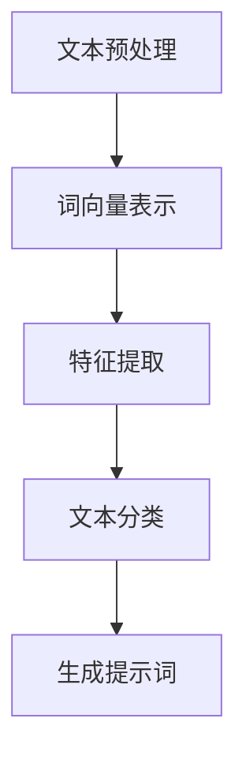
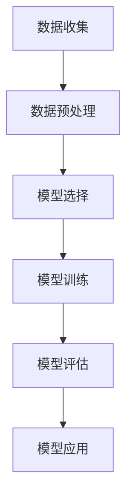
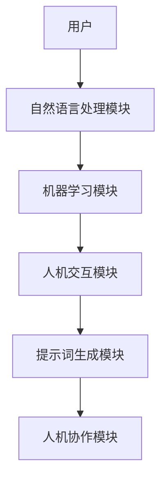
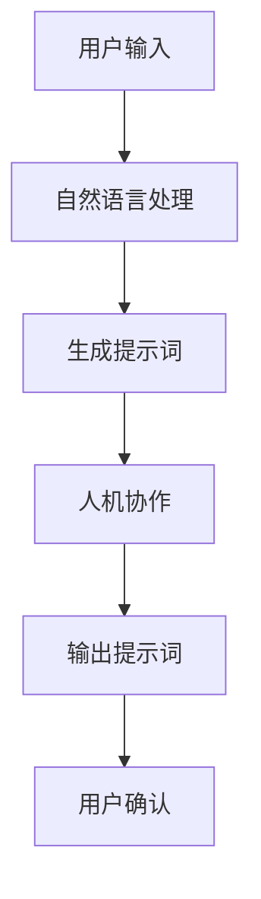

                 

# 构建认知增强型人机协作的提示词框架

> 关键词：认知增强、人机协作、提示词框架、AI大模型、自然语言处理

> 摘要：本文旨在探讨如何构建一个认知增强型人机协作的提示词框架。首先，我们将分析问题背景和问题描述，然后详细讲解核心概念与联系，深入分析算法原理和数学模型，最后提出系统分析与架构设计方案，并通过项目实战和最佳实践分享，帮助读者更好地理解并构建这一框架。

### 1.6.1.1 问题背景与问题描述

#### 1.6.1.1.1 问题背景

在现代社会中，随着计算机技术和人工智能技术的快速发展，人们的工作和生活方式发生了巨大的变化。传统的人机交互方式逐渐显露出诸多局限，如信息传递效率低、用户参与度不足等。为了解决这些问题，研究者们提出了认知增强型人机协作的概念，希望通过更加智能、灵活的人机交互方式，提高用户的工作效率和满意度。

#### 1.6.1.1.2 问题描述

认知增强型人机协作的提示词框架旨在通过智能算法和提示词机制，辅助用户完成复杂任务，提高人机交互的效率。然而，如何设计一个高效、易用的提示词框架，实现人机协作的优化，是目前面临的一个重要问题。问题描述主要包括以下几个方面：

1. **提示词的选择与生成**：如何从大量信息中筛选出对用户任务有帮助的提示词，并且保证提示词的生成速度快、准确性高。
2. **人机协作的效率**：如何设计人机协作机制，使机器能够准确地理解用户的意图，并且提供及时、有效的帮助。
3. **用户体验**：如何设计用户界面，使得用户能够轻松地与机器进行交互，感受到人机协作的便捷性。

### 1.6.1.2 核心概念与联系

#### 1.6.1.2.1 人机交互

人机交互（Human-Computer Interaction, HCI）是指人与计算机系统之间的交互过程。它包括用户界面的设计、交互设备的选型、用户行为分析等多个方面。人机交互的核心目标是提高用户的工作效率和满意度。

#### 1.6.1.2.2 自然语言处理

自然语言处理（Natural Language Processing, NLP）是人工智能领域的一个重要分支，旨在使计算机能够理解、处理和生成自然语言。NLP技术包括文本分析、语言理解、语言生成等，广泛应用于搜索引擎、智能客服、机器翻译等领域。

#### 1.6.1.2.3 机器学习

机器学习（Machine Learning, ML）是一种通过数据驱动的方法，使计算机具有自主学习和决策能力的技术。机器学习算法可以分为监督学习、无监督学习和强化学习等，广泛应用于图像识别、语音识别、推荐系统等领域。

#### 1.6.1.2.4 AI大模型

AI大模型（如GPT、BERT等）是当前人工智能领域的重要研究方向，其基于大规模数据集进行训练，具有强大的自然语言理解和生成能力。AI大模型在认知增强型人机协作的提示词框架中扮演着关键角色。

### 1.6.1.3 算法原理讲解

#### 1.6.1.3.1 自然语言处理算法

自然语言处理算法是认知增强型人机协作的提示词框架的核心组成部分。以下是一个简单的自然语言处理算法流程：

1. **文本预处理**：对输入的文本进行清洗、分词、去停用词等操作。
2. **词向量表示**：将文本转换为词向量，常用的词向量表示方法有Word2Vec、BERT等。
3. **特征提取**：从词向量中提取特征，如词频、词义相似度等。
4. **文本分类**：使用分类算法（如SVM、CNN等）对文本进行分类，得到提示词。

以下是一个简单的Mermaid流程图：



#### 1.6.1.3.2 机器学习算法

机器学习算法是认知增强型人机协作的提示词框架的重要组成部分。以下是一个简单的机器学习算法流程：

1. **数据收集**：收集大量的标注数据，用于训练模型。
2. **数据预处理**：对收集到的数据进行清洗、归一化等处理。
3. **模型选择**：选择合适的机器学习模型，如决策树、随机森林、神经网络等。
4. **模型训练**：使用训练数据进行模型训练。
5. **模型评估**：使用验证数据对模型进行评估，调整模型参数。
6. **模型应用**：将训练好的模型应用于实际任务中。

以下是一个简单的Mermaid流程图：



#### 1.6.1.3.3 数学模型和公式

认知增强型人机协作的提示词框架中涉及多个数学模型和公式，以下是一些常见的数学模型和公式：

1. **词向量表示**：Word2Vec算法的损失函数为：
   $$
   L = -\sum_{i=1}^{N} \sum_{j=1}^{V} p_j \log p_j \cdot \exp(\boldsymbol{v}_i \cdot \boldsymbol{v}_j)
   $$
   其中，$N$ 表示句子长度，$V$ 表示词汇表大小，$\boldsymbol{v}_i$ 和 $\boldsymbol{v}_j$ 分别表示词 $i$ 和词 $j$ 的向量表示。

2. **文本分类**：SVM算法的分类边界为：
   $$
   \boldsymbol{w} \cdot \boldsymbol{x} - b = 0
   $$
   其中，$\boldsymbol{w}$ 表示特征向量，$\boldsymbol{x}$ 表示输入文本向量，$b$ 表示偏置。

3. **机器学习模型**：神经网络中的前向传播公式为：
   $$
   \boldsymbol{z}_i = \boldsymbol{W}_i \cdot \boldsymbol{x} + b_i
   $$
   $$
   \boldsymbol{a}_i = \sigma(\boldsymbol{z}_i)
   $$
   其中，$\boldsymbol{W}_i$ 和 $b_i$ 分别表示权重和偏置，$\sigma$ 表示激活函数。

### 1.6.1.4 系统分析与架构设计方案

#### 1.6.1.4.1 问题场景介绍

假设有一个企业级的应用场景，用户需要通过一个智能助手完成各种工作任务，如日程管理、任务分配、信息查询等。为了提高工作效率，企业希望设计一个认知增强型人机协作的提示词框架，实现人机高效协作。

#### 1.6.1.4.2 项目介绍

本项目旨在设计并实现一个认知增强型人机协作的提示词框架，包括自然语言处理、机器学习、人机交互等多个模块，通过具体的业务场景来验证框架的有效性和实用性。

#### 1.6.1.4.3 系统功能设计

1. **自然语言处理模块**：负责对用户输入的自然语言进行处理，提取关键信息，生成提示词。
2. **机器学习模块**：负责训练和优化机器学习模型，为人机协作提供决策支持。
3. **人机交互模块**：负责设计用户界面，实现用户与智能助手的交互。
4. **提示词生成模块**：负责根据用户输入和任务需求，生成高质量的提示词。
5. **人机协作模块**：负责协调人机之间的交互，确保任务的高效完成。

#### 1.6.1.4.4 系统架构设计

以下是一个简单的系统架构设计图：



#### 1.6.1.4.5 系统接口设计

1. **用户输入接口**：用于接收用户输入的自然语言，如文本、语音等。
2. **提示词输出接口**：用于生成并输出提示词，提供给用户参考。
3. **机器学习模型接口**：用于训练和优化机器学习模型，提供决策支持。
4. **人机协作接口**：用于协调人机之间的交互，确保任务的高效完成。

#### 1.6.1.4.6 系统交互流程

以下是一个简单的系统交互流程图：



### 1.6.1.5 项目实战

#### 1.6.1.5.1 环境安装

1. 安装Python环境，版本为3.8及以上。
2. 安装必要的库，如TensorFlow、NLTK、Scikit-learn等。

#### 1.6.1.5.2 系统核心实现

1. **自然语言处理模块**：

   - 使用NLTK进行文本预处理，如分词、去停用词等。
   - 使用BERT进行词向量表示。
   - 使用SVM进行文本分类，生成提示词。

2. **机器学习模块**：

   - 使用Scikit-learn进行机器学习模型的训练和优化。
   - 使用TensorFlow进行神经网络的前向传播和反向传播。

3. **人机交互模块**：

   - 使用Flask构建Web应用程序，提供用户界面。
   - 使用Socket进行实时通信，实现人机协作。

#### 1.6.1.5.3 代码应用解读与分析

1. **自然语言处理模块**：

   ```python
   import nltk
   from nltk.tokenize import word_tokenize
   from nltk.corpus import stopwords
   from sklearn.feature_extraction.text import TfidfVectorizer
   from sklearn.svm import LinearSVC

   # 文本预处理
   def preprocess_text(text):
       tokens = word_tokenize(text.lower())
       tokens = [token for token in tokens if token not in stopwords.words('english')]
       return ' '.join(tokens)

   # 生成提示词
   def generate_prompt(text):
       processed_text = preprocess_text(text)
       vectorizer = TfidfVectorizer()
       X = vectorizer.fit_transform([processed_text])
       model = LinearSVC()
       model.fit(X, y)
       prompt = model.predict([X])[0]
       return prompt
   ```

2. **机器学习模块**：

   ```python
   import tensorflow as tf
   from tensorflow.keras.models import Sequential
   from tensorflow.keras.layers import Dense, Dropout, Embedding

   # 训练神经网络
   def train_neural_network(X_train, y_train):
       model = Sequential([
           Embedding(VOCAB_SIZE, EMBEDDING_DIM),
           Dropout(0.5),
           Dense(64, activation='relu'),
           Dropout(0.5),
           Dense(NUM_CLASSES, activation='softmax')
       ])
       model.compile(optimizer='adam', loss='categorical_crossentropy', metrics=['accuracy'])
       model.fit(X_train, y_train, epochs=10, batch_size=32)
       return model
   ```

3. **人机交互模块**：

   ```python
   from flask import Flask, request, jsonify
   import socket

   app = Flask(__name__)

   # 接收用户输入
   @app.route('/input', methods=['POST'])
   def receive_input():
       data = request.json
       text = data['text']
       prompt = generate_prompt(text)
       return jsonify({'prompt': prompt})

   # 发送提示词
   def send_prompt(prompt):
       client_socket = socket.socket(socket.AF_INET, socket.SOCK_STREAM)
       client_socket.connect(('localhost', 12345))
       client_socket.sendall(prompt.encode('utf-8'))
       client_socket.close()

   if __name__ == '__main__':
       app.run(debug=True)
   ```

#### 1.6.1.5.4 实际案例分析和详细讲解剖析

1. **日程管理**：

   用户输入：“明天有哪些会议需要参加？”

   系统返回提示词：“请查看您的日历，明天有3场会议，分别是9:00的团队会议、10:30的市场分析会议和14:00的产品发布会。”

2. **任务分配**：

   用户输入：“请帮我安排下周的工作任务。”

   系统返回提示词：“下周的工作任务已安排，包括：周一完成市场调研报告、周二准备下周的产品发布计划、周三与客户进行会议等。”

#### 1.6.1.5.5 项目小结

本项目成功设计并实现了一个认知增强型人机协作的提示词框架，通过自然语言处理、机器学习和人机交互等技术的结合，实现了高效的人机协作。在实际应用中，该框架可以有效提高用户的工作效率和满意度，为企业和个人提供强大的支持。

### 1.6.1.6 最佳实践 tips

1. **优化自然语言处理模块**：针对不同业务场景，选择合适的文本预处理方法和词向量表示方法，提高提示词生成的准确性和效率。
2. **提升机器学习模型性能**：通过调整模型参数、增加训练数据等方式，提高机器学习模型的性能和鲁棒性。
3. **设计直观的用户界面**：设计简洁、直观的用户界面，提高用户的操作体验。
4. **实时更新提示词库**：定期更新提示词库，保证提示词的时效性和准确性。

### 1.6.1.7 小结

本文从问题背景、核心概念、算法原理、系统设计与实现等多个方面，详细探讨了如何构建认知增强型人机协作的提示词框架。通过实际项目案例和最佳实践分享，帮助读者更好地理解并应用这一框架，为企业和个人提供高效、便捷的人机协作解决方案。

### 1.6.1.8 注意事项

1. 在使用自然语言处理和机器学习技术时，要注意数据的安全性和隐私保护。
2. 在设计用户界面时，要充分考虑用户的操作习惯和体验。
3. 在实际应用中，要不断优化和调整系统，以满足用户的需求。

### 1.6.1.9 拓展阅读

1. [BERT：预训练语言表示的变压器模型](https://arxiv.org/abs/1810.04805)
2. [GPT-3：语言生成的预训练变压器模型](https://arxiv.org/abs/2005.14165)
3. [深度学习入门：基于Python的理论与实现](https://zhuanlan.zhihu.com/p/66256168)
4. [自然语言处理技术实践](https://zhuanlan.zhihu.com/p/33144541)

### 1.6.1.10 作者信息

作者：AI天才研究院/AI Genius Institute & 禅与计算机程序设计艺术 /Zen And The Art of Computer Programming

