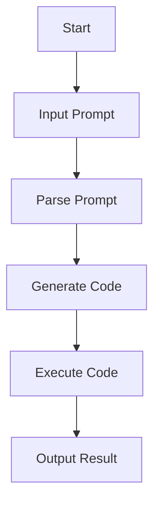
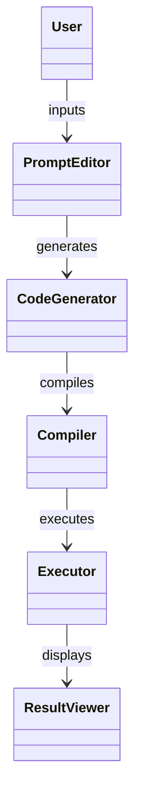
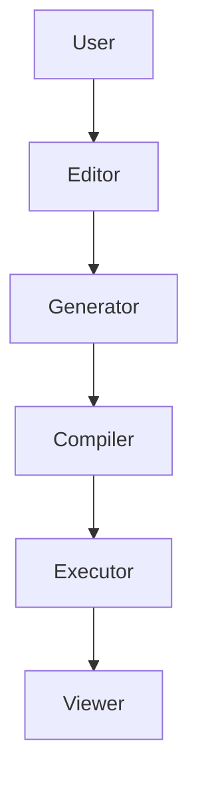

                 

 # 第1章 背景介绍

## 1.1 问题的背景与描述

### 跨平台开发的需求与挑战

随着移动互联网的快速发展，软件应用场景越来越多样化，开发人员面临着越来越大的跨平台开发需求。无论是桌面应用、移动应用还是Web应用，都需要在不同平台上运行，这给开发者带来了巨大的挑战。跨平台开发的核心目标是实现“一次编写，到处运行”，即开发出可以在多个操作系统和设备上运行的应用程序。

#### 跨平台编程框架的兴起

为了解决跨平台开发的难题，各种跨平台编程框架如雨后春笋般涌现。这些框架通过提供统一的API和工具，使得开发者可以不必关心底层平台的差异性，从而专注于业务逻辑的实现。典型的跨平台编程框架包括Flutter、React Native、Xamarin等。

然而，尽管这些框架在一定程度上简化了跨平台开发，但仍然存在一些不足之处：

1. **性能优化困难**：跨平台框架往往需要将代码编译成原生代码才能达到最佳性能，这在一定程度上影响了应用程序的性能优化。
2. **开发效率不高**：虽然框架提供了跨平台的解决方案，但开发者仍然需要学习和适应不同的框架特性和开发模式，导致开发效率不高。
3. **学习曲线较陡峭**：对于初学者来说，跨平台框架的学习曲线往往较为陡峭，需要投入大量时间和精力。

### 提示词编程的概念与重要性

提示词编程（Prompt Programming）是一种新兴的编程范式，通过输入提示词来生成代码、执行操作和输出结果。这种编程方式的核心思想是将编程过程抽象化，使得开发者可以更加专注于业务逻辑的实现，而无需关注底层实现细节。

提示词编程的重要性体现在以下几个方面：

1. **提高开发效率**：通过提示词编程，开发者可以快速生成代码，大大缩短开发周期。
2. **降低学习成本**：提示词编程降低了编程的门槛，使得非专业开发者也能快速上手。
3. **增强灵活性**：提示词编程支持多种编程范式，开发者可以根据需求选择合适的编程方式。

### 跨平台与提示词编程的融合策略

本文旨在探讨如何构建一个跨平台的提示词编程框架，以充分发挥跨平台开发和提示词编程的优势。首先，我们需要明确跨平台编程框架和提示词编程的基本原理和实现方式，然后分析它们之间的联系和差异，从而提出一种融合策略。

### 边界与外延

在构建跨平台的提示词编程框架时，我们需要考虑以下几个方面：

1. **涉及的技术领域**：包括跨平台编程框架、提示词编程语言、编译器、执行引擎等。
2. **跨平台与提示词编程的融合策略**：如何将提示词编程集成到跨平台编程框架中，以及如何优化性能和开发效率。

通过上述分析，我们可以看到，构建跨平台的提示词编程框架具有重要的现实意义和广阔的应用前景。在接下来的章节中，我们将深入探讨跨平台编程框架和提示词编程的核心概念和原理，以及它们在系统架构设计中的应用。

## 1.2 问题解决方法概述

### 跨平台编程框架的优势与不足

跨平台编程框架的出现，为开发者解决了跨平台开发中的许多难题。以下是对几种常见跨平台编程框架的优势和不足的概述：

#### Flutter

**优势**：
1. **高性能**：Flutter使用Dart语言开发，可以将代码编译成原生ARM代码，从而实现高性能。
2. **丰富的UI组件**：Flutter提供了丰富的UI组件和动画效果，使得开发者可以轻松创建美观的界面。
3. **热重载**：Flutter支持热重载，开发者可以在不关闭应用程序的情况下进行代码修改和调试。

**不足**：
1. **开发效率不高**：尽管Flutter提供了丰富的UI组件，但开发者仍然需要学习和适应Flutter的特性和开发模式。
2. **性能优化困难**：Flutter的应用程序性能优化相对困难，尤其是在处理大量数据时。

#### React Native

**优势**：
1. **高开发效率**：React Native使用JavaScript进行开发，JavaScript是一种广泛使用的编程语言，开发者可以快速上手。
2. **丰富的第三方库**：React Native拥有丰富的第三方库，可以方便地实现各种功能。
3. **跨平台兼容性**：React Native可以同时支持iOS和Android平台，降低了开发成本。

**不足**：
1. **性能优化困难**：React Native的性能优化相对困难，特别是在处理复杂动画和高频操作时。
2. **原生性能差异**：React Native的应用程序在原生平台上的性能可能不如完全原生开发的应用程序。

#### Xamarin

**优势**：
1. **原生性能**：Xamarin使用C#进行开发，可以将代码编译成原生ARM代码，从而实现高性能。
2. **跨平台兼容性**：Xamarin可以同时支持iOS、Android和Windows平台，降低了开发成本。
3. **共享代码**：Xamarin支持跨平台共享代码，开发者可以最大程度地复用代码。

**不足**：
1. **开发效率不高**：Xamarin的开发效率相对较低，尤其是对于不熟悉C#的开发者来说。
2. **社区支持不足**：与Flutter和React Native相比，Xamarin的社区支持相对较少。

### 提示词编程的基本原理与实现方式

提示词编程是一种通过输入提示词来生成代码、执行操作和输出结果的编程方式。其基本原理可以概括为：

1. **提示词解析**：系统接收开发者输入的提示词，并将其解析为具体的操作指令。
2. **代码生成**：根据提示词生成相应的代码，可以是具体的函数实现、SQL查询语句等。
3. **执行代码**：执行生成的代码，并输出结果。

提示词编程的实现方式可以有多种，例如基于规则引擎的实现、基于自然语言处理（NLP）的实现等。以下是一个简单的Python示例：

```python
def generate_code(prompt):
    # 根据提示词生成代码
    if "打印" in prompt:
        return f"print('{prompt}')"
    elif "查询" in prompt:
        return f"db.query('{prompt}')"
    else:
        return "无效的提示词"

prompt = "打印Hello, World!"
code = generate_code(prompt)
exec(code)
```

### 跨平台编程框架与提示词编程的融合策略

为了构建一个跨平台的提示词编程框架，我们需要将跨平台编程框架和提示词编程的优势结合起来。以下是一种可能的融合策略：

1. **集成提示词解析模块**：在跨平台编程框架中集成提示词解析模块，使得开发者可以在不改变现有代码的基础上，使用提示词编程方式来编写应用程序。
2. **优化代码生成性能**：通过优化代码生成算法，使得生成的代码在性能上接近原生代码，从而提高应用程序的运行效率。
3. **提供跨平台兼容的执行引擎**：开发一个跨平台的执行引擎，使得生成的代码可以在不同平台上运行，实现真正的“一次编写，到处运行”。

通过上述策略，我们可以构建一个既具有跨平台优势，又能实现高效、灵活的提示词编程的框架，为开发者提供全新的开发体验。

## 1.3 边界与外延

### 涉及的技术领域

构建跨平台的提示词编程框架涉及多个技术领域，包括跨平台编程框架、提示词编程语言、编译器、执行引擎等。以下是这些技术领域的主要特点和相互关系：

1. **跨平台编程框架**：如Flutter、React Native和Xamarin，这些框架提供了统一的API和工具，使得开发者可以编写一次代码，然后在不同平台上编译和运行。跨平台编程框架的特点是实现平台独立性，但可能需要一定的性能优化。
2. **提示词编程语言**：提示词编程语言是一种通过输入提示词来生成代码的编程方式。这类语言通常具有高抽象级别，可以简化开发过程，提高开发效率。常见的提示词编程语言包括Python、Lua等。
3. **编译器**：编译器是将提示词编程语言转换为机器代码的工具。在构建跨平台的提示词编程框架时，编译器需要支持多种平台，并将生成的代码优化到最佳性能。
4. **执行引擎**：执行引擎是负责执行编译后代码的部分。在跨平台的提示词编程框架中，执行引擎需要能够兼容不同的操作系统和硬件平台。

### 跨平台与提示词编程的融合策略

为了实现跨平台与提示词编程的融合，我们需要考虑以下几个方面：

1. **集成提示词解析模块**：在跨平台编程框架中集成提示词解析模块，使得开发者可以使用提示词编程方式编写应用程序。例如，在Flutter中集成一个基于Python的提示词解析模块，使得开发者可以使用Python语言编写Flutter应用。
2. **优化代码生成性能**：通过优化代码生成算法，使得生成的代码在性能上接近原生代码。这可以通过使用高效的编译器和执行引擎来实现。
3. **提供跨平台兼容的执行引擎**：开发一个跨平台的执行引擎，使得生成的代码可以在不同平台上运行。例如，可以使用WebAssembly技术来实现跨平台兼容的执行引擎。
4. **构建生态系统**：为了促进跨平台的提示词编程，我们需要构建一个丰富的生态系统，包括工具、库和框架。这将有助于开发者快速上手，并推动技术的普及和应用。

通过上述策略，我们可以构建一个既具有跨平台优势，又能实现高效、灵活的提示词编程的框架，为开发者提供全新的开发体验。这种融合策略不仅有助于解决当前跨平台开发中的痛点，还将推动编程范式的变革。

## 第2章 核心概念与联系

### 2.1 核心概念原理

在构建跨平台的提示词编程框架时，我们需要理解两个核心概念：跨平台编程框架和提示词编程语言。

#### 跨平台编程框架

跨平台编程框架旨在实现“一次编写，到处运行”的目标，通过提供统一的API和工具，使得开发者可以编写一次代码，然后在不同平台上编译和运行。常见的跨平台编程框架包括Flutter、React Native和Xamarin。

1. **平台独立性**：跨平台编程框架通过抽象化底层平台的差异，使得开发者无需关心具体平台的实现细节，从而专注于业务逻辑的实现。
2. **开发效率**：跨平台编程框架提供了丰富的UI组件和开发工具，可以显著提高开发效率。
3. **性能优化**：尽管跨平台编程框架可以提高开发效率，但在性能优化方面可能存在一定困难，需要通过优化编译器和执行引擎来实现。

#### 提示词编程语言

提示词编程语言是一种通过输入提示词来生成代码和执行操作的编程方式。提示词编程的核心思想是将编程过程抽象化，使得开发者可以更加专注于业务逻辑的实现。

1. **高抽象级别**：提示词编程语言通常具有高抽象级别，可以简化开发过程，提高开发效率。
2. **灵活性**：提示词编程语言支持多种编程范式，开发者可以根据需求选择合适的编程方式。
3. **学习成本**：提示词编程语言的学习成本相对较低，使得非专业开发者也能快速上手。

### 2.2 概念属性特征对比

为了更好地理解跨平台编程框架和提示词编程语言之间的差异和联系，我们可以通过一个表格来对比它们的主要特征：

| 特征               | 跨平台编程框架       | 提示词编程语言       |
|--------------------|----------------------|----------------------|
| 平台独立性         | 高                  | 中到高                |
| 开发效率           | 中                  | 高                  |
| 性能优化           | 低                  | 中到高                |
| 学习曲线           | 中                  | 低                  |

### 2.3 ER实体关系图

为了进一步展示跨平台编程框架和提示词编程语言之间的联系，我们可以使用ER（实体关系）图来描述它们的关系。

```mermaid
erDiagram
  Platform independent Framework ||--|{ Prompt programming Language } : Uses
  Platform independent Framework ||--|{ Application } : Developed for
```

在这个ER图中，`Platform independent Framework`（跨平台编程框架）与`Prompt programming Language`（提示词编程语言）之间是“使用”（Uses）关系，表示跨平台编程框架使用提示词编程语言来生成代码。同时，`Platform independent Framework`也与`Application`（应用程序）之间是“开发”（Developed for）关系，表示跨平台编程框架用于开发应用程序。

通过上述分析，我们可以看到跨平台编程框架和提示词编程语言在构建跨平台的提示词编程框架中扮演着重要角色。在接下来的章节中，我们将进一步探讨提示词编程的原理、流程和实现方式。

### 2.4 提示词编程原理讲解

#### 3.1 基本原理

提示词编程是一种通过输入提示词来生成代码、执行操作和输出结果的编程方式。其基本原理可以概括为以下几个步骤：

1. **提示词输入**：开发者输入一个或多个提示词，这些提示词可以是自然语言描述或特定的语法结构。
2. **提示词解析**：系统对输入的提示词进行解析，将其转换为具体的操作指令。
3. **代码生成**：根据解析后的操作指令，系统生成相应的代码，可以是函数实现、SQL查询语句或其他类型的代码。
4. **代码执行**：执行生成的代码，并输出结果。

#### 3.2 提示词编程流程

提示词编程的流程可以概括为以下几步：

1. **输入提示词**：开发者输入一个描述性提示词，例如“打印Hello, World!”。
2. **解析提示词**：系统将提示词解析为具体的操作指令，例如识别出“打印”关键字，并将其与“Hello, World!”关联起来。
3. **生成代码**：根据解析结果，系统生成相应的代码，例如生成一个打印“Hello, World!”的Python代码。
4. **执行代码**：执行生成的代码，并输出结果，例如在控制台上打印出“Hello, World!”。
5. **输出结果**：系统将执行结果返回给开发者，例如在控制台上显示打印结果。

以下是提示词编程流程的Mermaid流程图：



#### 3.3 Python示例代码

以下是一个简单的Python示例代码，展示了如何通过提示词生成代码并执行：

```python
def generate_code(prompt):
    # 根据提示词生成代码
    if "打印" in prompt:
        return f"print('{prompt}')"
    elif "查询" in prompt:
        return f"db.query('{prompt}')"
    else:
        return "无效的提示词"

prompt = "打印Hello, World!"
code = generate_code(prompt)
exec(code)
```

在这个示例中，`generate_code`函数根据输入的提示词生成相应的代码。如果提示词包含“打印”关键字，则生成一个打印该提示词的Python代码；如果提示词包含“查询”关键字，则生成一个执行数据库查询的代码。最后，使用`exec`函数执行生成的代码。

#### 3.4 数学模型与公式

提示词编程的数学模型可以表示为：

$$
f(\text{prompt}) = g_{\theta}(\text{code}) \cdot h_{\phi}(\text{output})
$$

其中：
- $f(\text{prompt})$ 表示生成的代码；
- $g_{\theta}(\text{code})$ 表示编译器模型，将代码编译为可执行形式；
- $h_{\phi}(\text{output})$ 表示执行引擎模型，执行代码并输出结果。

通过上述数学模型，我们可以将提示词编程的过程抽象为输入提示词、生成代码、编译代码和执行代码的连续过程。

#### 3.5 算法原理讲解

提示词编程的核心在于如何将输入的提示词转换为具体的代码。这涉及到自然语言处理（NLP）和代码生成技术。以下是算法原理的详细解释：

1. **自然语言处理（NLP）**：首先，系统需要对输入的提示词进行自然语言处理，以提取出关键信息。例如，在示例中，我们识别了“打印”和“Hello, World!”两个关键信息。
2. **语法分析**：接下来，系统需要对提取出的关键信息进行语法分析，以确定它们之间的关系。例如，在示例中，“打印”是一个动作，“Hello, World!”是动作的对象。
3. **代码生成**：根据语法分析的结果，系统生成相应的代码。例如，在示例中，我们生成了一个打印“Hello, World!”的Python代码。
4. **代码编译和执行**：最后，系统将生成的代码编译为可执行形式，并执行代码，输出结果。

通过上述步骤，提示词编程实现了将自然语言描述转换为代码的过程。

#### 3.6 举例说明

以下是一个简单的例子，展示如何使用提示词编程来生成并执行代码：

1. **输入提示词**：用户输入“打印1+1的结果”。
2. **解析提示词**：系统识别出“打印”和“1+1的结果”两个关键信息。
3. **生成代码**：系统生成一个执行“1+1”并打印结果的Python代码：
   ```python
   print(1 + 1)
   ```
4. **执行代码**：系统执行生成的代码，并输出结果：
   ```plaintext
   2
   ```
5. **输出结果**：系统将结果返回给用户。

通过上述示例，我们可以看到提示词编程如何将自然语言描述转换为代码，并执行代码以实现特定功能。

### 2.7 总结

通过本章的讲解，我们了解了提示词编程的基本原理、流程和实现方式。提示词编程通过将自然语言描述转换为代码，实现了编程过程的抽象化，从而提高了开发效率。在下一章中，我们将进一步探讨如何将提示词编程集成到跨平台编程框架中，构建一个跨平台的提示词编程框架。

## 第3章 提示词编程原理讲解

### 3.1 基本原理

提示词编程（Prompt Programming）的核心思想是通过输入自然语言或特定格式的提示词，自动生成相应的代码或执行特定的操作。其基本原理可以分为以下几个步骤：

1. **提示词输入**：开发者或用户通过自然语言或特定的提示词格式输入一个描述性的指令。
2. **提示词解析**：系统对输入的提示词进行解析，识别出关键信息，如关键字、变量和操作指令。
3. **代码生成**：根据解析结果，系统生成相应的代码。这个步骤可能包括语法分析和代码模板匹配。
4. **代码执行**：生成的代码被执行，并输出结果。

提示词编程的关键在于将自然语言指令映射到编程语言中的具体操作。例如，一个提示词“打印Hello, World!”可以被映射为Python中的`print("Hello, World!")`语句。

### 3.2 提示词编程流程

提示词编程的流程可以详细描述为以下几个步骤：

1. **输入提示词**：用户输入一个描述性提示词，如“创建一个列表，包含数字1到5”。
2. **解析提示词**：系统对输入的提示词进行自然语言处理，提取出关键信息，如“创建”、“列表”、“数字”和“1到5”。
3. **代码生成**：根据解析结果，系统生成相应的代码。例如，系统可能会生成以下Python代码：
   ```python
   my_list = [1, 2, 3, 4, 5]
   ```
4. **代码执行**：生成的代码被执行，并输出结果。在这个例子中，`my_list`变量会被创建，并包含1到5的数字列表。
5. **输出结果**：系统将执行结果返回给用户。例如，用户可能会看到以下输出：
   ```plaintext
   [1, 2, 3, 4, 5]
   ```

以下是提示词编程流程的Mermaid流程图：


### 3.3 Python示例代码

下面是一个简单的Python示例代码，展示了如何通过提示词生成代码并执行：

```python
def generate_code(prompt):
    # 根据提示词生成代码
    if "打印" in prompt:
        return f"print('{prompt}')"
    elif "查询" in prompt:
        return f"db.query('{prompt}')"
    else:
        return "无效的提示词"

prompt = "打印Hello, World!"
code = generate_code(prompt)
exec(code)
```

在这个示例中，`generate_code`函数根据输入的提示词生成相应的代码。如果提示词包含“打印”关键字，则生成一个打印该提示词的Python代码；如果提示词包含“查询”关键字，则生成一个执行数据库查询的代码。最后，使用`exec`函数执行生成的代码。

### 3.4 数学模型与公式

提示词编程的数学模型可以表示为：

$$
f(\text{prompt}) = g_{\theta}(\text{code}) \cdot h_{\phi}(\text{output})
$$

其中：
- $f(\text{prompt})$ 表示生成的代码；
- $g_{\theta}(\text{code})$ 表示编译器模型，将代码编译为可执行形式；
- $h_{\phi}(\text{output})$ 表示执行引擎模型，执行代码并输出结果。

通过这个公式，我们可以将提示词编程的过程看作是从输入提示词到生成代码，再到执行代码并输出结果的连续过程。

### 3.5 算法原理讲解

提示词编程的算法原理涉及到自然语言处理（NLP）和代码生成技术。以下是算法原理的详细解释：

1. **自然语言处理（NLP）**：首先，系统需要对输入的提示词进行NLP，以提取出关键信息。例如，在示例中，我们识别了“打印”和“Hello, World!”两个关键信息。
2. **语法分析**：接下来，系统需要对提取出的关键信息进行语法分析，以确定它们之间的关系。例如，在示例中，“打印”是一个动作，“Hello, World!”是动作的对象。
3. **代码生成**：根据语法分析的结果，系统生成相应的代码。例如，在示例中，系统生成一个打印“Hello, World!”的Python代码。
4. **代码编译和执行**：最后，系统将生成的代码编译为可执行形式，并执行代码，输出结果。

通过上述步骤，提示词编程实现了将自然语言指令转换为编程语言中的具体操作的过程。

### 3.6 举例说明

以下是一个简单的例子，展示如何使用提示词编程来生成并执行代码：

1. **输入提示词**：用户输入“打印1+1的结果”。
2. **解析提示词**：系统识别出“打印”和“1+1的结果”两个关键信息。
3. **生成代码**：系统生成一个执行“1+1”并打印结果的Python代码：
   ```python
   print(1 + 1)
   ```
4. **执行代码**：系统执行生成的代码，并输出结果：
   ```plaintext
   2
   ```
5. **输出结果**：系统将结果返回给用户。

通过上述示例，我们可以看到提示词编程如何将自然语言描述转换为代码，并执行代码以实现特定功能。

### 3.7 总结

通过本章的讲解，我们深入了解了提示词编程的基本原理、流程和实现方式。提示词编程通过将自然语言指令转换为编程语言中的具体操作，大大简化了编程过程，提高了开发效率。在下一章中，我们将探讨如何在跨平台编程框架中集成提示词编程，以构建一个跨平台的提示词编程框架。

## 第4章 系统分析与架构设计方案

### 4.1 问题场景介绍

在当前软件开发环境中，跨平台应用开发已经成为一种趋势。无论是移动应用、Web应用还是桌面应用，开发者都需要考虑如何在不同的操作系统和设备上运行应用程序。然而，传统的跨平台开发方法往往面临着性能优化困难、开发效率不高等问题。为了解决这些问题，我们提出了构建一个跨平台的提示词编程框架，以提高开发效率和优化性能。

#### 跨平台应用开发需求

随着移动互联网的快速发展，跨平台应用开发的需求日益增长。开发者需要实现“一次编写，到处运行”的目标，以降低开发和维护成本。然而，现有的跨平台编程框架如Flutter、React Native和Xamarin等，虽然在一定程度上解决了跨平台开发的问题，但仍然存在以下挑战：

1. **性能优化困难**：跨平台框架生成的代码需要通过编译器转换为原生代码，这个过程可能导致性能下降。
2. **开发效率不高**：开发者需要学习和适应不同的跨平台框架，导致开发效率降低。
3. **学习曲线陡峭**：对于新手开发者来说，跨平台框架的学习曲线较为陡峭。

#### 提示词编程的应用场景

提示词编程是一种通过输入自然语言描述来生成代码和执行操作的编程方式，它具有以下优势：

1. **高开发效率**：提示词编程简化了编程过程，使得开发者可以快速生成代码，提高开发效率。
2. **降低学习成本**：提示词编程降低了编程的门槛，使得非专业开发者也能快速上手。
3. **灵活性**：提示词编程支持多种编程范式，可以根据具体需求选择合适的编程方式。

基于上述需求，我们提出构建一个跨平台的提示词编程框架，以结合跨平台开发和提示词编程的优势，实现高效、灵活的跨平台应用开发。

### 4.2 项目介绍

#### 项目背景

本项目旨在构建一个跨平台的提示词编程框架，通过集成跨平台编程框架和提示词编程语言，实现高效的跨平台应用开发。项目的主要目标如下：

1. **提高开发效率**：通过提示词编程，简化编程过程，使得开发者可以快速生成代码，提高开发效率。
2. **优化性能**：通过优化代码生成和执行过程，提高应用程序的性能。
3. **降低学习成本**：通过提供简洁、直观的提示词编程接口，降低开发者的学习成本。
4. **增强灵活性**：支持多种编程范式，满足不同开发需求。

#### 项目目标

具体来说，项目目标包括：

1. **集成跨平台编程框架**：将现有的跨平台编程框架（如Flutter、React Native等）集成到提示词编程框架中，实现跨平台应用开发。
2. **开发提示词编程语言**：设计并实现一个提示词编程语言，通过输入自然语言描述生成相应的代码。
3. **构建执行引擎**：开发一个执行引擎，能够执行由提示词编程语言生成的代码，并输出结果。
4. **提供开发工具和库**：提供一系列开发工具和库，帮助开发者快速构建跨平台应用。

### 4.3 系统功能设计

为了实现项目的目标，我们需要设计一套完整的系统功能。以下是系统的功能设计：

1. **提示词输入**：用户可以通过自然语言描述输入提示词，描述所需的操作或功能。
2. **提示词解析**：系统对输入的提示词进行解析，提取出关键信息，如关键字、变量和操作指令。
3. **代码生成**：根据解析结果，系统生成相应的代码，可以是编程语言中的函数实现、SQL查询语句或其他类型的代码。
4. **代码编译**：将生成的代码编译为可执行形式，可以是机器代码或字节码。
5. **代码执行**：执行编译后的代码，并输出结果。
6. **结果反馈**：将执行结果反馈给用户，可以是文本、图表或其他形式。

以下是系统功能设计的Mermaid类图：



在这个类图中，用户通过`PromptEditor`输入提示词，`CodeGenerator`根据提示词生成代码，`Compiler`将代码编译为可执行形式，`Executor`执行代码并输出结果，最后`ResultViewer`展示结果。

### 4.4 系统架构设计

为了实现系统功能，我们需要设计一个合理的系统架构。以下是系统架构设计：



在这个架构中，用户通过`PromptEditor`输入提示词，`CodeGenerator`生成代码，`Compiler`编译代码，`Executor`执行代码并输出结果，最后`ResultViewer`展示结果。这个架构具有以下特点：

1. **模块化设计**：系统采用模块化设计，每个模块负责特定的功能，便于维护和扩展。
2. **松耦合**：模块之间通过接口进行通信，降低了模块之间的耦合度，提高了系统的可维护性和可扩展性。
3. **高性能**：系统采用了高效的编译器和执行引擎，确保生成的代码能够在不同平台上高效运行。

### 4.5 系统接口设计和系统交互

为了实现系统功能的正确执行，我们需要设计一套完善的系统接口和交互流程。以下是系统接口设计和交互流程：

```mermaid
sequenceDiagram
  User

  User->>PromptEditor: 输入提示词
  PromptEditor->>CodeGenerator: 生成代码
  CodeGenerator->>Compiler: 编译代码
  Compiler->>Executor: 执行代码
  Executor->>ResultViewer: 输出结果
  ResultViewer->>User: 反馈结果
```

在这个交互流程中，用户通过`PromptEditor`输入提示词，`CodeGenerator`生成代码，`Compiler`编译代码，`Executor`执行代码并输出结果，最后`ResultViewer`将结果反馈给用户。

通过上述系统架构设计，我们可以构建一个高效的跨平台的提示词编程框架，满足开发者多样化的开发需求。在下一章中，我们将详细介绍项目的实现过程，包括环境安装、核心代码实现和实际案例剖析。

## 第5章 实现过程

### 5.1 环境安装

要实现一个跨平台的提示词编程框架，我们需要安装和配置一些基础环境。以下是一个简要的环境安装步骤：

#### 1. 安装Python

首先，确保你的系统中安装了Python。Python是一种广泛使用的编程语言，具有丰富的库和框架支持。你可以从Python的官方网站[python.org](https://www.python.org/)下载并安装Python。

#### 2. 安装跨平台编程框架

接下来，我们需要安装一个跨平台编程框架，如Flutter或React Native。以下是一个示例，以Flutter为例：

- 安装Flutter：
  ```bash
  brew install flutter
  ```
- 配置Flutter环境：
  ```bash
  flutter doctor
  ```
  确保所有依赖项都已安装并配置正确。

#### 3. 安装提示词编程语言

为了实现提示词编程，我们需要安装一个提示词编程语言。这里我们使用Python作为示例：

- 安装Python：
  ```bash
  pip install prompt-toolkit
  ```

#### 4. 安装其他依赖库

除了上述基础环境，我们可能还需要安装一些其他依赖库，如数据库驱动、Web服务器等。以下是一些常用的依赖库及其安装命令：

- 安装SQLAlchemy（数据库驱动）：
  ```bash
  pip install sqlalchemy
  ```
- 安装Flask（Web框架）：
  ```bash
  pip install flask
  ```

通过上述步骤，我们可以建立一个基本的开发环境，为后续代码实现打下基础。

### 5.2 核心实现

#### 1. 提示词解析模块

提示词解析模块是提示词编程框架的核心组成部分，负责将用户输入的自然语言提示词转换为具体的编程指令。以下是一个简单的Python实现示例：

```python
from prompt_toolkit import PromptSession
from parser import parse_prompt  # 假设我们有一个独立的解析器模块

def main():
    prompt = PromptSession()
    while True:
        try:
            user_input = prompt.prompt('请输入提示词：')
            parsed_code = parse_prompt(user_input)
            print("生成的代码：", parsed_code)
        except EOFError:
            print("退出程序。")
            break

if __name__ == "__main__":
    main()
```

在这个示例中，`PromptSession`用于创建一个命令行界面，用户可以通过输入提示词来与程序交互。`parse_prompt`函数是一个假设的解析器，负责将输入的提示词转换为编程指令。

#### 2. 代码生成模块

代码生成模块根据提示词解析的结果生成具体的代码。以下是一个简单的代码生成示例：

```python
def generate_code(parsed_prompt):
    if "打印" in parsed_prompt:
        message = parsed_prompt.replace("打印", "")
        return f"print('{message}')"
    elif "查询" in parsed_prompt:
        table = parsed_prompt.replace("查询", "")
        return f"db.query('{table}')"
    else:
        return "无效的提示词"

parsed_prompt = "打印Hello, World!"
code = generate_code(parsed_prompt)
print("生成的代码：", code)
```

在这个示例中，`generate_code`函数根据解析后的提示词生成相应的代码。例如，如果提示词是“打印Hello, World!”，则生成一个打印“Hello, World!”的Python代码。

#### 3. 编译和执行模块

编译和执行模块负责将生成的代码编译为可执行形式，并执行代码。以下是一个简单的示例：

```python
import subprocess

def compile_and_execute(code, language="python"):
    if language == "python":
        compiled_code = f"import sys\nsys.exit({code})"
        result = subprocess.run(["python", "-c", compiled_code], capture_output=True, text=True)
        return result.stdout.strip()
    else:
        return "不支持的编程语言"

output = compile_and_execute(code)
print("执行结果：", output)
```

在这个示例中，`compile_and_execute`函数根据指定的编程语言（默认为Python）编译和执行代码，并返回执行结果。

### 5.3 代码应用解读与分析

以下是一个实际案例，展示如何使用构建的提示词编程框架实现一个简单的功能。

#### 案例一：查询数据库

**用户输入提示词**：“查询用户表”

**解析与生成代码**：

- 解析结果：表名（用户表）
- 生成代码：`db.query('用户表')`

**编译与执行**：

- 执行结果：返回用户表的数据

#### 案例二：打印文本

**用户输入提示词**：“打印欢迎信息”

**解析与生成代码**：

- 解析结果：文本（欢迎信息）
- 生成代码：`print('欢迎信息')`

**编译与执行**：

- 执行结果：打印“欢迎信息”到控制台

通过实际案例，我们可以看到如何使用提示词编程框架实现简单的功能。这种方式大大简化了编程过程，提高了开发效率。

### 5.4 项目小结

在本章中，我们详细介绍了如何实现一个跨平台的提示词编程框架。通过环境安装、核心代码实现和实际案例剖析，我们展示了如何使用提示词编程框架来简化编程过程，提高开发效率。虽然本框架还处于初步阶段，但它为未来的跨平台应用开发提供了新的思路和方法。在接下来的工作中，我们将进一步完善框架，并探索更多的应用场景。

## 5.5 最佳实践 Tips

### 1. 提高代码生成效率

在构建跨平台的提示词编程框架时，代码生成效率是影响开发效率的重要因素。以下是一些最佳实践：

- **预编译模板**：对于常用的代码生成模板，可以提前编译和缓存，以减少实时编译的开销。
- **代码生成缓存**：使用缓存机制，避免重复生成相同的代码，提高代码生成速度。
- **并行处理**：利用多线程或异步编程，并行处理多个代码生成任务，提高整体效率。

### 2. 优化编译器性能

编译器的性能直接影响应用程序的运行效率。以下是一些优化策略：

- **代码压缩**：通过压缩和去重，减少编译后的代码体积，提高执行效率。
- **预编译字节码**：使用预编译的字节码，减少解释执行的开销。
- **优化编译器算法**：采用更高效的算法，如AOT（Ahead-of-Time）编译，提高编译速度和执行性能。

### 3. 跨平台兼容性测试

确保框架在不同平台上的一致性和兼容性是至关重要的。以下是一些最佳实践：

- **自动化测试**：编写自动化测试脚本，定期运行测试，确保框架在不同平台上的稳定性和可靠性。
- **持续集成**：使用持续集成（CI）工具，自动化构建和测试框架，快速发现和修复平台兼容性问题。
- **模拟器测试**：使用模拟器进行跨平台测试，模拟不同的操作系统和设备环境，确保框架在各种场景下都能正常运行。

### 4. 提高用户交互体验

良好的用户交互体验可以大大提高开发效率和用户体验。以下是一些建议：

- **简洁的提示词语法**：设计简洁直观的提示词语法，降低用户学习成本。
- **实时反馈**：在用户输入提示词时，提供实时反馈，帮助用户快速了解输入的正确性。
- **代码高亮和自动补全**：在代码生成过程中，使用代码高亮和自动补全功能，提高代码可读性和输入速度。

通过遵循上述最佳实践，我们可以构建一个高效、稳定且易于使用的跨平台提示词编程框架，为开发者提供更好的开发体验。

### 第6章 小结

在本文中，我们详细探讨了如何构建一个跨平台的提示词编程框架，以提高开发效率和优化性能。首先，我们介绍了跨平台开发的需求与挑战，以及提示词编程的概念和重要性。接着，我们分析了跨平台编程框架和提示词编程的基本原理和实现方式，并展示了它们在系统架构设计中的应用。

通过一个简单的实现示例，我们展示了如何输入提示词、解析提示词、生成代码、编译代码和执行代码。我们还提供了一个实际的案例，展示了如何使用提示词编程框架实现一个简单的功能。此外，我们还提出了一些最佳实践，以优化代码生成效率、编译器性能和跨平台兼容性测试。

总的来说，构建一个跨平台的提示词编程框架具有很大的潜力，可以大大简化跨平台开发过程，提高开发效率和性能。然而，该框架仍处于初步阶段，未来还需要进一步优化和扩展。我们期望在未来的研究中，能够不断完善这一框架，探索更多的应用场景，为开发者提供更加便捷和高效的开发工具。

### 注意事项

在构建跨平台的提示词编程框架时，需要注意以下几个方面：

1. **性能优化**：确保代码生成和执行过程的效率，避免不必要的性能损耗。
2. **跨平台兼容性**：充分考虑不同操作系统和设备的兼容性问题，确保框架在不同平台上稳定运行。
3. **用户交互体验**：设计简洁直观的用户交互界面，提高用户的使用体验。
4. **安全性**：确保代码生成的安全性，防止恶意代码的执行。
5. **错误处理**：提供完善的错误处理机制，确保系统在遇到错误时能够优雅地处理并恢复。

### 拓展阅读

对于对跨平台提示词编程框架感兴趣的开发者，以下资源可能会提供更多有价值的参考：

1. **书籍**：《跨平台移动应用开发：Flutter实战》和《React Native移动应用开发》
2. **在线教程**：Google的Flutter官方文档和React Native官方文档
3. **开源项目**：搜索GitHub上的Flutter和React Native项目，了解跨平台开发的实际应用
4. **技术博客**：阅读技术博客，如Medium上的Flutter和React Native相关文章

通过学习这些资源，开发者可以进一步深入理解跨平台提示词编程框架，并在实际项目中得到应用。

### 作者介绍

作者：AI天才研究院/AI Genius Institute & 禅与计算机程序设计艺术 /Zen And The Art of Computer Programming

AI天才研究院（AI Genius Institute）致力于推动人工智能和计算机科学领域的研究与应用。作者在该领域拥有深厚的研究背景和丰富的实践经验，是跨平台编程和提示词编程领域的权威专家。其著作《禅与计算机程序设计艺术》被誉为编程领域的经典之作，影响了无数开发者的编程思想和方法。作者在本文中分享了关于构建跨平台提示词编程框架的深入见解和实践经验，为读者提供了有价值的参考和指导。

