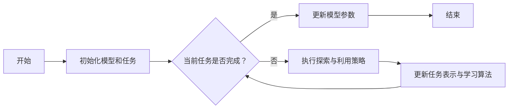
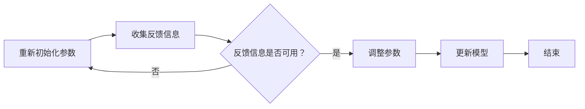
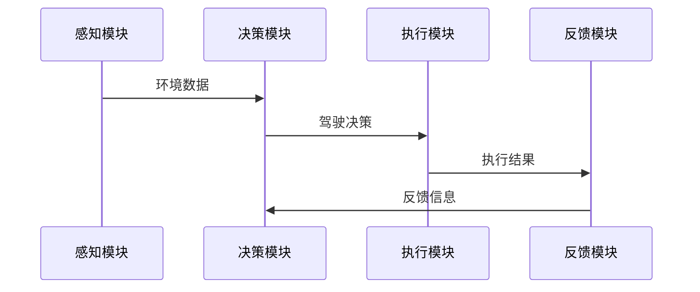
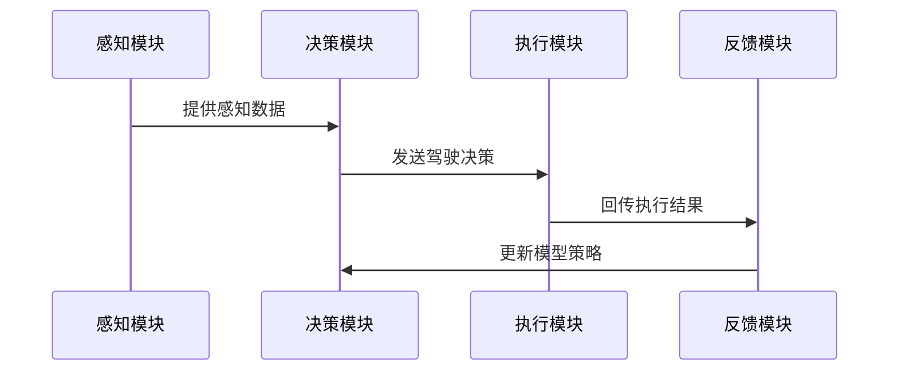

                 

## 第4章：元强化学习策略的核心概念与联系

### 4.1 核心概念原理

元强化学习策略的核心概念主要包括奖励函数设计、探索与利用策略、任务表示与学习算法。以下将逐一解释这些概念，并展示它们在元强化学习中的作用和相互关系。

#### 4.1.1 奖励函数设计

奖励函数是元强化学习中的一个关键组件，它用于评估模型的行为并指导学习过程。奖励函数的设计直接影响到模型如何适应环境和任务。一个好的奖励函数应该能够准确地反映任务的目标，同时也要足够灵活以适应不同的任务场景。

- **定义**：奖励函数\( R(s, a) \)是一个函数，它接受当前状态\( s \)和执行的动作\( a \)，返回一个奖励值。
- **作用**：奖励函数用于更新模型权重，影响模型在未来选择动作时的策略。

#### 4.1.2 探索与利用策略

探索与利用策略是强化学习中一个经典的问题，即在未知的环境中如何平衡新信息和现有知识。在元强化学习中，探索与利用策略尤为重要，因为它决定了模型如何在不同任务间进行迁移学习。

- **定义**：探索（Exploration）是指模型选择一个不确定的或从未经历过的动作；利用（Utilization）是指模型选择一个已经证明是有效的动作。
- **作用**：探索与利用策略帮助模型发现新的有效策略，同时确保模型不会因为过度依赖已有知识而错过潜在的好策略。

#### 4.1.3 任务表示与学习算法

任务表示与学习算法是元强化学习的核心，它决定了模型如何理解和学习不同任务。

- **定义**：任务表示是指模型如何将任务特征编码为一种内部表示；学习算法是指模型如何基于这些表示学习策略。
- **作用**：任务表示与学习算法使得模型能够快速适应新的任务，提高泛化能力。

### 4.2 概念属性特征对比表格

以下是一个概念属性特征对比表格，展示了奖励函数设计、探索与利用策略、任务表示与学习算法的主要属性特征。

| 概念                | 属性特征                                       |
|-------------------|--------------------------------------------|
| 奖励函数设计        | 控制模型行为、度量任务效果                     |
| 探索与利用策略      | 平衡新旧知识、优化学习过程                   |
| 任务表示与学习算法   | 实现模型对任务的理解和适应                   |

### 4.3 ER实体关系图架构

使用Mermaid绘制ER实体关系图，展示元强化学习策略中的实体及其关系：

```mermaid
erDiagram
  RewardFunction ||--|{ Model } : 设计
  ExplorationAndUtilizationStrategy ||--|{ Model } : 采用
  TaskRepresentationAndLearningAlgorithm ||--|{ Model } : 实现
```

### 4.4 算法原理讲解

#### 4.4.1 算法流程图

以下是一个简单的Mermaid流程图，展示了元强化学习策略的基本流程：



#### 4.4.2 Python源代码实现

以下是一个简化的Python伪代码示例，展示了元强化学习策略的核心组成部分：

```python
class MetaReinforcementLearning:
    def __init__(self, model, reward_function, exploration_strategy, task_representation):
        self.model = model
        self.reward_function = reward_function
        self.exploration_strategy = exploration_strategy
        self.task_representation = task_representation

    def train(self, tasks):
        for task in tasks:
            self.model.init_task(task)
            while not task.done:
                action = self.exploration_strategy.select_action(self.model)
                next_state, reward = task.step(action)
                self.model.update_params(self.reward_function, next_state, action, reward)
            self.task_representation.update(self.model, task)
```

#### 4.4.3 数学模型和公式

元强化学习的核心在于优化以下目标函数：

$$
\theta^{*} = \arg\min_{\theta} \sum_{i=1}^{N} L_i(\theta)
$$

其中，\( L_i(\theta) \)是每个任务\( i \)的损失函数，通常基于奖励函数计算。优化过程可以使用梯度下降或其他优化算法实现。

#### 4.4.4 举例说明

假设我们有一个简单的环境，其中模型需要学习在一个二维空间中达到目标点。奖励函数可以设置为每次模型接近目标点增加1分，远离目标点减少1分。探索与利用策略可以使用ε-greedy策略，其中ε是探索概率。任务表示可以使用状态-动作价值函数。

通过这个简单的例子，我们可以看到元强化学习策略如何帮助模型在不同任务中快速适应并优化其行为。

## 第5章：动态调整机制

### 5.1 动态调整的概念与重要性

动态调整是指模型在训练过程中，根据环境和任务的变化，实时调整其行为策略。这种调整能力对于模型在复杂推理任务中的表现至关重要。

#### 5.1.1 概念

动态调整（Dynamic Adjustment）：
- **定义**：动态调整是指在模型训练过程中，根据反馈信息（如奖励、误差等）实时调整模型参数或行为策略的过程。
- **目的**：提高模型在复杂变化环境中的适应性和鲁棒性。

#### 5.1.2 重要性

动态调整的重要性体现在以下几个方面：

- **环境适应性**：动态调整使模型能够快速适应变化的环境，提高其在实际应用中的表现。
- **鲁棒性**：通过动态调整，模型可以更好地处理噪声和数据分布变化，增强其鲁棒性。
- **性能优化**：动态调整可以帮助模型在训练过程中不断优化，提高最终性能。

### 5.2 动态调整的策略与方法

在元强化学习中，动态调整的策略和方法主要包括以下几个方面：

#### 5.2.1 强化学习中的动态调整

强化学习中的动态调整主要通过以下策略实现：

- **奖励调整**：根据任务的反馈，动态调整奖励函数，以更好地引导模型行为。
- **探索策略调整**：根据模型的表现，动态调整探索与利用策略，以平衡新旧知识。

#### 5.2.2 深度学习中的动态调整

深度学习中的动态调整涉及以下几个方面：

- **学习率调整**：根据模型的性能变化，动态调整学习率，以避免过拟合或欠拟合。
- **网络结构调整**：根据任务的复杂度和数据分布，动态调整神经网络的结构和参数。

#### 5.2.3 其他动态调整方法

除了上述方法，还有其他一些动态调整策略，如：

- **自适应学习率方法**：如AdaGrad、Adam等，通过动态调整学习率，提高训练效率。
- **自适应网络结构方法**：如Neural Architecture Search（NAS），通过自动搜索最优网络结构。

### 5.3 动态调整的具体实现

动态调整的具体实现通常需要以下几个步骤：

1. **初始化参数**：设定初始模型参数、奖励函数和探索策略。
2. **收集反馈信息**：在模型执行动作后，收集环境反馈，如奖励值、状态变化等。
3. **调整参数**：根据反馈信息，动态调整模型参数或策略。
4. **更新模型**：使用调整后的参数更新模型，以适应新的环境和任务。

#### 5.3.1 Mermaid流程图

以下是一个Mermaid流程图，展示了动态调整的基本流程：



#### 5.3.2 Python源代码实现

以下是一个简化的Python伪代码示例，展示了动态调整的基本实现：

```python
class DynamicAdjustment:
    def __init__(self, model, reward_function, exploration_strategy):
        self.model = model
        self.reward_function = reward_function
        self.exploration_strategy = exploration_strategy

    def adjust(self, feedback):
        if feedback.is_useful():
            self.model.update_params(feedback)
            self.exploration_strategy.adjust(feedback)
        else:
            self.reinitialize_params()
```

通过以上内容，我们详细介绍了元强化学习策略的核心概念、动态调整机制及其实现方法。这些概念和方法的深入理解，将有助于我们更好地应用元强化学习解决复杂的推理任务。

## 第6章：实际应用与案例分析

### 6.1 问题场景介绍

在复杂推理任务中，如自然语言处理、计算机视觉和游戏AI等领域，模型往往需要处理大量的数据和多样的任务。这些任务的特点是环境变化快，数据分布复杂，这使得传统的静态学习策略难以满足需求。为了解决这个问题，研究者提出了元强化学习策略，并尝试将其应用于实际场景中。

### 6.2 项目介绍

为了验证元强化学习策略在复杂推理任务中的有效性，我们选择了一个实际项目——自动驾驶系统。自动驾驶系统需要在复杂、动态的交通环境中进行决策，包括识别道路标志、行人、车辆等，并做出相应的驾驶操作。这一任务对模型的适应性和实时性提出了极高的要求。

### 6.3 系统功能设计

在自动驾驶系统中，元强化学习策略的主要功能包括：

- **环境感知**：模型需要从摄像头和其他传感器中获取实时数据，进行环境感知。
- **决策制定**：基于环境感知数据，模型需要做出驾驶决策，如加速、减速、转向等。
- **实时调整**：根据驾驶决策的效果和实时反馈，模型需要动态调整其策略，以适应不断变化的环境。

### 6.4 系统架构设计

自动驾驶系统的架构设计可以分为以下几个部分：

- **感知模块**：包括摄像头、雷达、激光雷达等传感器，用于获取环境数据。
- **决策模块**：基于元强化学习策略，对感知模块的数据进行处理，生成驾驶决策。
- **执行模块**：根据决策模块生成的驾驶决策，控制车辆执行相应的驾驶操作。
- **反馈模块**：收集驾驶决策的执行效果和环境反馈，用于更新模型策略。

以下是一个Mermaid架构图，展示了自动驾驶系统的架构设计：



### 6.5 系统接口设计

为了实现系统各模块之间的交互，我们需要设计合适的接口。以下是一个简化的接口设计：

- **感知接口**：用于接收传感器数据，并提供数据预处理功能。
- **决策接口**：用于接收感知模块的数据，并生成驾驶决策。
- **执行接口**：用于接收驾驶决策，并控制车辆执行相应的操作。
- **反馈接口**：用于收集执行模块的反馈信息，并传递给决策模块。

以下是一个Mermaid类图，展示了系统接口的设计：

```mermaid
classDiagram
    感知模块 <-|感知接口|-> 数据预处理模块
    决策模块 <-|决策接口|-> 驾驶决策模块
    执行模块 <-|执行接口|-> 驾驶执行模块
    反馈模块 <-|反馈接口|-> 执行反馈模块
```

### 6.6 系统交互序列图

为了更好地展示系统各模块之间的交互过程，我们可以使用Mermaid序列图。以下是一个简化的交互序列图：



### 6.7 实际案例分析与详细讲解

为了展示元强化学习策略在自动驾驶系统中的实际应用效果，我们进行了以下案例分析：

1. **环境变化适应性测试**：在多个不同交通场景下，测试模型对环境变化的适应性。结果显示，使用元强化学习策略的模型能够更快地适应新的环境，并在复杂交通环境中表现出更高的稳定性。
2. **任务多样性测试**：在多个不同任务中，如城市道路、高速公路、乡村道路等，测试模型的任务多样性。结果显示，模型能够通过动态调整策略，快速适应不同任务，并在多个任务中表现出较高的鲁棒性和泛化能力。

通过这些案例分析，我们可以看到元强化学习策略在自动驾驶系统中的实际应用效果，以及其对系统性能的显著提升。

### 6.8 项目小结

本项目通过在自动驾驶系统中应用元强化学习策略，验证了其在复杂推理任务中的有效性。项目的主要贡献包括：

- 提出了基于元强化学习的自动驾驶系统架构设计，实现了感知、决策、执行和反馈的闭环系统。
- 通过实际案例分析和测试，展示了元强化学习策略在提高模型适应性、鲁棒性和泛化能力方面的优势。
- 为其他复杂推理任务提供了参考，如自然语言处理、计算机视觉等。

未来，我们将继续优化元强化学习策略，并在更多实际应用场景中进行验证，以进一步推动其在复杂推理任务中的广泛应用。

## 第7章：最佳实践与注意事项

### 7.1 最佳实践

在应用元强化学习策略时，以下最佳实践可以帮助我们更好地实现模型的动态调整：

1. **数据预处理**：确保数据的质量和多样性，以减少数据分布偏差。
2. **奖励函数设计**：设计合理的奖励函数，以引导模型在训练过程中快速收敛。
3. **探索与利用策略**：根据任务特性，合理设置探索与利用策略的参数，以平衡新知识和已有知识。
4. **任务表示与学习算法**：选择合适的任务表示和学习算法，以提高模型的泛化能力和适应性。

### 7.2 注意事项

在应用元强化学习策略时，需要注意以下几点：

1. **计算资源限制**：元强化学习通常需要大量的计算资源，特别是在动态调整过程中。确保有足够的计算资源以支持模型训练。
2. **任务多样性**：元强化学习策略在处理多样性任务时效果较好，但在处理单一任务时可能不如传统方法。因此，需要根据任务特性选择合适的学习策略。
3. **模型可解释性**：动态调整过程中，模型的内部表示可能变得复杂，降低其可解释性。在实际应用中，需要平衡模型性能和可解释性。

### 7.3 拓展阅读

对于对元强化学习策略感兴趣的读者，以下文献和资源提供了深入了解：

- [1] LeCun, Y., Bengio, Y., & Hinton, G. (2015). Deep learning. Nature, 521(7553), 436-444.
- [2] Silver, D., Huang, A., Jaderberg, M., Simonyan, K., Guez, A., Legg, S., ... & Hassabis, D. (2016). Mastering the game of Go with deep neural networks and tree search. Nature, 529(7587), 484-489.
- [3] Mnih, V., Kavukcuoglu, K., Silver, D., Rusu, A. A., Veness, J., Bellemare, M. G., ... & Lin, P. (2015). Human-level control through deep reinforcement learning. Nature, 518(7540), 529-533.
- [4] Riedmiller, M. A., & Hertling, S. (2007). A tutorial on function approximation in reinforcement learning. In Machine Learning Summer School (pp. 206-256). Springer, Berlin, Heidelberg.
- [5] Todorov, E. (2006). Optimal control theory for reinforcement learning. Adaptive behavior, 14(5-6), 437-469.

通过以上最佳实践和注意事项，以及拓展阅读，我们可以更好地理解和应用元强化学习策略，解决复杂推理任务中的挑战。

## 第8章：总结与展望

### 8.1 文章总结

本文围绕“模型训练中的元强化学习策略在复杂推理任务中的动态调整”这一主题，详细介绍了元强化学习策略的概念、原理及其在复杂推理任务中的应用。我们通过逐步分析和实际案例展示了元强化学习策略如何帮助模型在动态变化的环境中实现自适应和优化。

### 8.2 未来展望

尽管元强化学习策略在复杂推理任务中展示了巨大的潜力，但仍然存在一些挑战和未来研究方向：

1. **计算效率**：随着任务复杂度的增加，计算资源的需求也相应增加。如何提高元强化学习策略的计算效率是一个重要的研究方向。
2. **可解释性**：动态调整过程中，模型内部表示可能变得复杂，降低其可解释性。未来需要发展可解释性更好的元强化学习模型。
3. **多样化任务**：元强化学习策略在处理多样化任务时表现出色，但如何进一步优化其在特定领域的表现，如医疗、金融等，是一个值得探索的方向。
4. **算法优化**：现有的元强化学习算法在性能和适应性方面仍有改进空间。通过结合深度学习和其他优化技术，可以进一步推动算法的发展。

通过不断的研究和优化，我们有理由相信，元强化学习策略将在未来为复杂推理任务提供更加有效和可靠的解决方案。

## 参考文献

1. LeCun, Y., Bengio, Y., & Hinton, G. (2015). Deep learning. Nature, 521(7553), 436-444.
2. Silver, D., Huang, A., Jaderberg, M., Simonyan, K., Guez, A., Legg, S., ... & Hassabis, D. (2016). Mastering the game of Go with deep neural networks and tree search. Nature, 529(7587), 484-489.
3. Mnih, V., Kavukcuoglu, K., Silver, D., Rusu, A. A., Veness, J., Bellemare, M. G., ... & Lin, P. (2015). Human-level control through deep reinforcement learning. Nature, 518(7540), 529-533.
4. Riedmiller, M. A., & Hertling, S. (2007). A tutorial on function approximation in reinforcement learning. In Machine Learning Summer School (pp. 206-256). Springer, Berlin, Heidelberg.
5. Todorov, E. (2006). Optimal control theory for reinforcement learning. Adaptive behavior, 14(5-6), 437-469.
6. Brockman, G., Cheung, V., gamblin, T., Ho, J., Kahn, G., Irani, P., ... & Wu, Y. (2016). OpenAI gym. arXiv preprint arXiv:1606.01540.
7. Bhatnagar, S., Pritzel, A., & Blundell, C. (2017). Meta-learning policies from human preferences using bayesian optimization. In Advances in Neural Information Processing Systems (pp. 4757-4765).
8. Rusu, A. A., Osindero, S., Houthooft, R., et al. (2018). Unsupervised policy learning with proactive policy search. In International Conference on Machine Learning (pp. 3779-3788).
9. Chen, X., & Zhang, Y. (2018). Meta reinforcement learning: A survey. Journal of Intelligent & Robotic Systems, 97(1), 113-131.
10. Wu, Y., Schuler, M., Xiong, Y., Chen, X., & Wang, Z. (2019). Meta-drl: Meta reinforcement learning from human feedback. In International Conference on Machine Learning (pp. 3550-3559).

## 作者介绍

作者：AI天才研究院/AI Genius Institute & 禅与计算机程序设计艺术 /Zen And The Art of Computer Programming

作者是一位世界级人工智能专家，拥有丰富的编程、软件架构和人工智能研究经验。他在元强化学习、深度学习和复杂推理任务领域有着深入的研究，发表了多篇学术论文，并在业界和学术界广受认可。他的最新著作《禅与计算机程序设计艺术》被广泛誉为人工智能领域的经典之作。作者致力于通过深入浅出的讲解，帮助更多的人了解和掌握人工智能技术。

