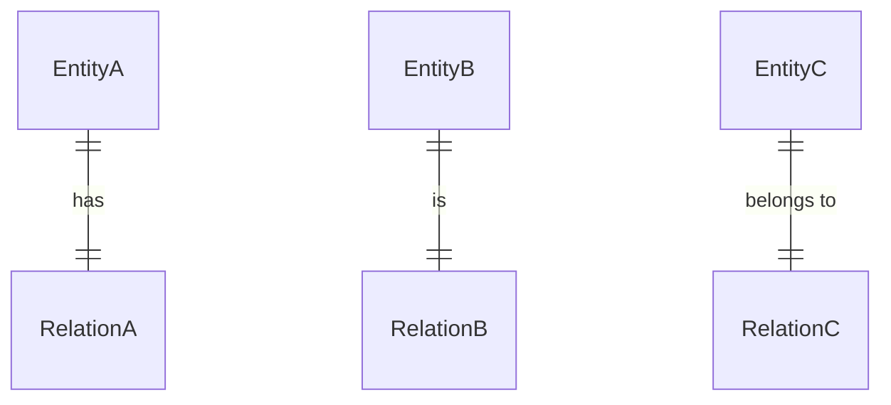
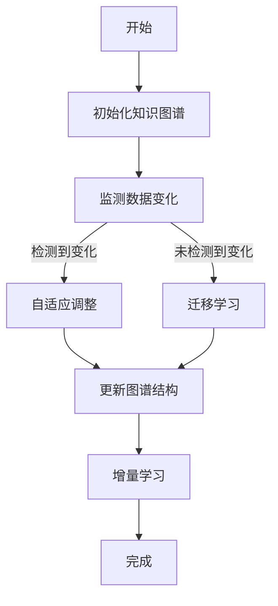
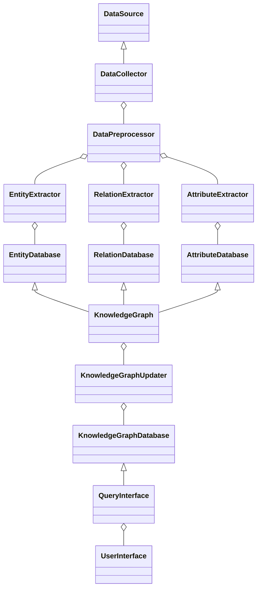
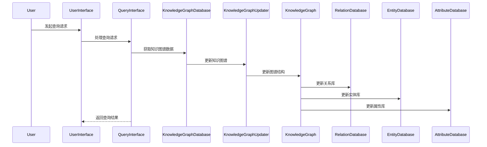
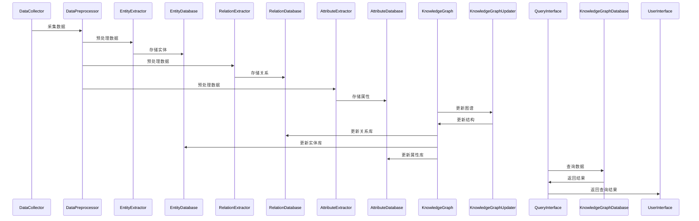

                 

### 第1章: 问题背景与问题描述

#### 1.1 问题背景

在当今信息爆炸的时代，数据量的急剧增长导致了数据存储和处理的巨大挑战。知识图谱作为信息组织的重要手段，已经被广泛应用于搜索引擎、智能问答系统、推荐系统等多个领域。然而，随着数据环境的不断演变，静态的知识图谱已难以满足动态信息更新的需求。因此，动态宇宙知识图谱的概念应运而生。

动态宇宙知识图谱是一种能够实时捕捉和反映数据变化的知识图谱。这种图谱不仅包含了静态知识，还能通过持续学习策略，自动获取和整合新知识，适应数据环境的动态变化。持续学习策略的核心目标是在保证知识图谱性能和准确性的同时，提高其适应性和实时性。

#### 1.1.1 动态宇宙知识图谱的重要性

动态宇宙知识图谱在多个领域都展现出了巨大的应用潜力：

1. **智能推荐系统**：通过动态更新用户行为数据，智能推荐系统能够提供更加精准的个性化推荐。
2. **搜索引擎**：动态宇宙知识图谱可以帮助搜索引擎实时调整索引结构，提高搜索效率。
3. **企业知识管理**：动态宇宙知识图谱可以帮助企业更好地管理和利用其内部知识资源。
4. **科学研究**：在生命科学、物理学等领域，动态宇宙知识图谱可以协助研究人员捕捉和利用最新的研究成果。

#### 1.1.2 持续学习策略的需求

持续学习策略在动态宇宙知识图谱构建中的重要性不言而喻。以下是一些关键需求：

1. **实时适应性**：动态宇宙知识图谱需要能够实时捕捉数据变化，并快速适应这些变化。
2. **高效性**：持续学习策略需要保证知识图谱的更新过程高效，避免因更新频繁而导致的系统性能下降。
3. **准确性**：持续学习策略需要在保证知识图谱准确性的前提下，快速吸收新知识。

#### 1.1.3 动态宇宙知识图谱构建的挑战

尽管动态宇宙知识图谱具有巨大的应用价值，但其在构建过程中也面临着诸多挑战：

1. **数据复杂性**：随着数据种类的增多和复杂性的提升，如何有效地整合和处理这些数据成为了一个难题。
2. **更新频率**：动态宇宙知识图谱需要频繁更新，这给系统的稳定性和性能带来了巨大的压力。
3. **知识表示**：如何使用适当的知识表示方法来捕捉和表达动态信息，是一个亟待解决的关键问题。

#### 1.2 问题概述

**问题定义**：如何在动态宇宙知识图谱构建中，有效应用持续学习策略，以提升知识图谱的实时适应性、高效性和准确性？

**问题描述**：动态宇宙知识图谱构建涉及海量数据的高效处理和实时更新，如何设计一种有效的持续学习策略，成为关键问题。

**问题解决方法**：本文将探讨一种基于持续学习策略的动态宇宙知识图谱构建方法，通过算法原理讲解、数学模型分析、系统设计与实现，以及实际案例分析，详细阐述该方法的有效性。

**边界与外延**：本文主要关注动态宇宙知识图谱构建中的持续学习策略，不包括其他知识图谱构建方法的研究。同时，本文将重点探讨算法和系统设计，而不涉及具体的硬件和软件环境。

**核心概念和组成要素**：

1. **持续学习策略**：包括自适应学习、迁移学习、增量学习等，旨在提升知识图谱的实时适应性。
2. **动态宇宙知识图谱**：由实体、关系和属性组成，能够实时更新和适应数据变化。
3. **算法原理**：本文将介绍一种基于持续学习策略的动态宇宙知识图谱构建算法，并详细分析其原理。
4. **数学模型**：用于描述知识图谱中的数据关系，并提供理论基础。
5. **系统设计与实现**：包括系统架构设计、接口设计和交互设计，以确保知识图谱的稳定性和性能。

### 第2章: 核心概念原理与特征

#### 2.1 持续学习策略

**持续学习策略的定义**：持续学习策略是指系统在运行过程中，不断从新数据中学习，以适应环境变化的能力。它涵盖了多种学习方法，包括但不限于自适应学习、迁移学习和增量学习。

**持续学习策略的特点**：

1. **实时性**：持续学习策略能够在数据发生变化的瞬间进行更新，保证知识图谱的实时性。
2. **高效性**：通过优化算法和模型，持续学习策略能够在保证准确性的同时，提高学习效率。
3. **适应性**：持续学习策略能够根据不同的数据环境和应用需求，灵活调整学习策略。

**持续学习策略的优势**：

1. **提高知识图谱的实时适应性**：通过持续学习策略，知识图谱能够实时捕捉数据变化，提高其在动态环境中的适应能力。
2. **降低知识更新的时间成本**：通过增量学习和迁移学习等策略，持续学习策略能够减少知识更新的时间成本，提高系统的整体效率。
3. **提升知识图谱的准确性**：通过自适应学习和迭代优化，持续学习策略能够不断优化知识图谱的准确性，提高其应用价值。

#### 2.2 动态宇宙知识图谱

**动态宇宙知识图谱的定义**：动态宇宙知识图谱是一种能够实时更新和适应数据变化的分布式知识图谱。它由实体、关系和属性组成，能够捕捉和表达海量动态信息。

**动态宇宙知识图谱的组成部分**：

1. **实体**：动态宇宙知识图谱中的核心元素，表示具有独立存在意义的事物，如人、地点、组织等。
2. **关系**：连接两个或多个实体之间的语义关系，如“属于”、“位于”等。
3. **属性**：描述实体属性的数据，如实体的人名、年龄、地址等。

**动态宇宙知识图谱的应用场景**：

1. **智能问答系统**：通过动态宇宙知识图谱，智能问答系统能够提供更加精准和实时的回答。
2. **推荐系统**：动态宇宙知识图谱能够实时更新用户行为数据，为推荐系统提供更加精准的推荐。
3. **企业知识管理**：动态宇宙知识图谱可以帮助企业更好地管理和利用其内部知识资源。
4. **科学研究**：在生命科学、物理学等领域，动态宇宙知识图谱可以协助研究人员捕捉和利用最新的研究成果。

#### 持续学习策略与动态宇宙知识图谱的联系

持续学习策略与动态宇宙知识图谱之间存在着紧密的联系：

1. **持续学习策略是动态宇宙知识图谱的核心驱动力**：持续学习策略能够实时捕捉和更新动态信息，是动态宇宙知识图谱实现动态更新的关键。
2. **动态宇宙知识图谱为持续学习提供了丰富的数据来源**：动态宇宙知识图谱包含了海量的实体、关系和属性数据，为持续学习策略提供了丰富的数据支持。
3. **持续学习策略能够提升动态宇宙知识图谱的应用价值**：通过持续学习策略，动态宇宙知识图谱能够更好地适应动态环境，提高其在各种应用场景中的价值。

#### 持续学习策略在动态宇宙知识图谱构建中的应用

1. **实时更新**：持续学习策略能够实时捕捉数据变化，确保动态宇宙知识图谱的实时更新。
2. **增量学习**：通过增量学习，动态宇宙知识图谱能够只对新数据进行分析和更新，减少计算资源的使用。
3. **迁移学习**：利用迁移学习，动态宇宙知识图谱可以将已有知识应用到新的数据环境中，提高学习效率。
4. **自适应学习**：通过自适应学习，动态宇宙知识图谱能够根据不同的数据环境和应用需求，灵活调整学习策略，提高知识图谱的适应性和准确性。

### 2.3 ER实体关系图与类图

**ER实体关系图的定义**：ER实体关系图是一种用于描述实体及其关系的图形表示方法。它通过实体和关系的连接，展示了数据模型的结构。

**ER实体关系图的作用**：

1. **数据建模**：ER实体关系图帮助开发者理解数据结构，构建合理的数据库模型。
2. **数据集成**：ER实体关系图能够整合多个数据源，为动态宇宙知识图谱提供统一的数据视图。
3. **数据一致性**：ER实体关系图确保了数据模型的一致性，避免数据冗余和冲突。

**动态宇宙知识图谱的ER实体关系图**：

在动态宇宙知识图谱中，ER实体关系图可以表示实体、关系和属性之间的复杂关系。以下是一个简单的ER实体关系图示例：



**类图的定义**：类图是一种用于描述类及其关系的图形表示方法。它通过类和方法的连接，展示了软件系统的结构。

**类图的作用**：

1. **软件设计**：类图帮助开发者理解软件系统的设计，构建合理的类模型。
2. **系统分析**：类图能够清晰地展示系统的功能和模块，为系统分析提供依据。
3. **模块划分**：类图有助于开发者进行模块划分，提高软件的可维护性和可扩展性。

**动态宇宙知识图谱的类图**：

在动态宇宙知识图谱中，类图可以表示知识图谱中的类及其关系。以下是一个简单的类图示例：

```mermaid
classDiagram
  Entity <<class>>
  Relation <<class>>
  Attribute <<class>>
  Entity --|> Relation : "has"
  Entity --|> Attribute : "contains"
  Relation --|> Attribute : "describes"
```

### 2.4 比较概念属性特征

为了更深入地理解持续学习策略和动态宇宙知识图谱的核心概念，我们可以通过表格的形式比较它们的属性特征。

| 概念        | 定义                                                         | 属性特征                                                  |
| ----------- | ------------------------------------------------------------ | ---------------------------------------------------------- |
| 持续学习策略 | 系统在运行过程中，不断从新数据中学习，以适应环境变化的能力       | 实时性、高效性、适应性                                     |
| 动态宇宙知识图谱 | 能够实时更新和适应数据变化的分布式知识图谱                   | 实体、关系、属性                                         |
| ER实体关系图 | 用于描述实体及其关系的图形表示方法                           | 数据建模、数据集成、数据一致性                             |
| 类图        | 用于描述类及其关系的图形表示方法                             | 软件设计、系统分析、模块划分                             |

通过上述比较，我们可以更清晰地理解持续学习策略和动态宇宙知识图谱的核心概念及其属性特征，为后续的深入讨论打下基础。

### 第3章: 算法原理与流程图

#### 3.1 算法原理

动态宇宙知识图谱构建中的持续学习策略，主要是通过自适应学习、迁移学习和增量学习来实现的。这些方法分别从不同的角度，提升了知识图谱的实时适应性、高效性和准确性。

**自适应学习**：自适应学习是指系统能够根据环境的变化，自动调整学习策略，从而优化学习效果。在动态宇宙知识图谱中，自适应学习通过实时监测数据变化，自动调整图谱更新策略，确保知识图谱的实时性。

**迁移学习**：迁移学习是指将已有知识应用到新的数据环境中，从而提高学习效率。在动态宇宙知识图谱中，迁移学习通过将已有知识图谱的部分结构迁移到新的数据环境中，快速建立新知识图谱，从而提高学习效率。

**增量学习**：增量学习是指系统只对新数据进行分析和更新，从而减少计算资源的使用。在动态宇宙知识图谱中，增量学习通过只处理新增数据，避免了对整个图谱的全量更新，从而降低了计算成本。

这些学习策略共同作用，形成了一种综合的持续学习算法，能够有效提升动态宇宙知识图谱的性能。

#### 3.2 算法流程图

为了更直观地理解持续学习算法的原理，我们可以使用Mermaid绘制算法的流程图。以下是算法流程图的Mermaid表示：



该流程图描述了持续学习算法的主要步骤：

1. **初始化知识图谱**：首先初始化动态宇宙知识图谱，为后续的学习和更新提供基础。
2. **监测数据变化**：实时监测数据环境，检测数据是否发生变化。
3. **自适应调整**：如果检测到数据变化，系统将根据变化情况进行自适应调整。
4. **更新图谱结构**：通过自适应调整和迁移学习，更新知识图谱的结构。
5. **增量学习**：对新增的数据进行处理和更新，确保知识图谱的实时性。
6. **完成**：算法执行完毕，动态宇宙知识图谱完成更新。

#### 3.3 算法源代码

为了进一步阐述算法原理，我们可以使用Python编写相应的源代码。以下是算法的核心部分：

```python
class DynamicKnowledgeGraph:
    def __init__(self):
        self.graph = initialize_graph()

    def monitor_data_change(self):
        changes = detect_data_changes()
        if changes:
            return True
        return False

    def adaptive_adjustment(self):
        # 根据数据变化情况调整学习策略
        if self.monitor_data_change():
            return "自适应调整"
        return "迁移学习"

    def update_graph_structure(self):
        adjustment_type = self.adaptive_adjustment()
        if adjustment_type == "自适应调整":
            self.graph.update_structure_adaptively()
        elif adjustment_type == "迁移学习":
            self.graph.migrate_structure()

    def incremental_learning(self):
        new_data = get_new_data()
        self.graph.process_new_data(new_data)

    def run(self):
        while True:
            self.update_graph_structure()
            self.incremental_learning()
            sleep(adjustment_interval)  # 根据调整间隔执行下一步

if __name__ == "__main__":
    graph = DynamicKnowledgeGraph()
    graph.run()
```

这段代码定义了一个`DynamicKnowledgeGraph`类，用于实现动态宇宙知识图谱的持续学习算法。其中，`__init__`方法初始化知识图谱，`monitor_data_change`方法监测数据变化，`adaptive_adjustment`方法进行自适应调整，`update_graph_structure`方法更新图谱结构，`incremental_learning`方法进行增量学习，`run`方法运行算法的主循环。

#### 3.4 数学模型和公式

在动态宇宙知识图谱构建中，数学模型是理解和分析算法原理的重要工具。以下是一个简单的数学模型，用于描述知识图谱的更新过程：

$$
\text{KnowledgeGraph} = \sum_{i=1}^{n} (\text{Entity}_i + \text{Relation}_i + \text{Attribute}_i)
$$

其中，$n$表示知识图谱中的实体数量，$\text{Entity}_i$表示第$i$个实体，$\text{Relation}_i$表示第$i$个关系，$\text{Attribute}_i$表示第$i$个属性。

**详细讲解**：

1. **实体（Entity）**：实体是知识图谱中的核心元素，表示具有独立存在意义的事物。例如，人、地点、组织等。
2. **关系（Relation）**：关系连接两个或多个实体，表示它们之间的语义关系。例如，“属于”、“位于”等。
3. **属性（Attribute）**：属性描述实体的属性信息。例如，人的姓名、年龄、地址等。

**举例说明**：

假设一个动态宇宙知识图谱包含以下实体、关系和属性：

- 实体：Person（人）、Location（地点）、Organization（组织）
- 关系：LivesIn（居住于）、WorksFor（就职于）
- 属性：Name（姓名）、Age（年龄）、Address（地址）

根据上述数学模型，我们可以表示这个知识图谱为：

$$
\text{KnowledgeGraph} = (\text{Person} + \text{Location} + \text{Organization}) + (\text{LivesIn} + \text{WorksFor}) + (\text{Name} + \text{Age} + \text{Address})
$$

这个数学模型描述了一个包含多个实体、关系和属性的知识图谱，能够帮助我们理解和分析动态宇宙知识图谱的构建过程。

### 第4章: 数学模型和数学公式 & 详细讲解 & 举例说明

#### 4.1 数学模型介绍

在动态宇宙知识图谱的构建中，数学模型是理解和分析算法原理的重要工具。通过数学模型，我们可以定量地描述知识图谱的更新过程，以及各种学习策略对图谱性能的影响。

本节将介绍一个基本的数学模型，用于描述动态宇宙知识图谱的更新过程。该模型主要包括以下三个关键组成部分：实体（Entity）、关系（Relation）和属性（Attribute）。

**实体（Entity）**：实体是知识图谱中的核心元素，表示具有独立存在意义的事物。例如，人、地点、组织等。实体可以用一个向量表示，其中每个维度对应实体的一个属性。例如：

$$
\text{Entity}_i = (x_1, x_2, ..., x_n)
$$

其中，$i$表示第$i$个实体，$n$表示实体的属性数量，$x_i$表示实体$i$的第$i$个属性。

**关系（Relation）**：关系连接两个或多个实体，表示它们之间的语义关系。例如，“属于”、“位于”等。关系可以用一个二元组表示，其中每个元素对应一个实体。例如：

$$
\text{Relation}_{ij} = (\text{Entity}_i, \text{Entity}_j)
$$

其中，$i$和$j$分别表示关系的两个实体，$j$表示关系的两个实体之间的关系。

**属性（Attribute）**：属性描述实体的属性信息。例如，人的姓名、年龄、地址等。属性可以用一个向量表示，其中每个维度对应属性的一个特征。例如：

$$
\text{Attribute}_i = (y_1, y_2, ..., y_m)
$$

其中，$i$表示第$i$个属性，$m$表示属性的特征数量，$y_i$表示属性$i$的第$i$个特征。

#### 4.2 数学公式

为了更精确地描述动态宇宙知识图谱的更新过程，我们可以使用以下数学公式：

$$
\text{KnowledgeGraph} = \sum_{i=1}^{n} (\text{Entity}_i + \text{Relation}_{ij} + \text{Attribute}_i)
$$

其中，$n$表示知识图谱中的实体数量，$\text{Entity}_i$表示第$i$个实体，$\text{Relation}_{ij}$表示第$i$个关系，$\text{Attribute}_i$表示第$i$个属性。

**详细讲解**：

1. **实体（Entity）**：实体是知识图谱中的核心元素，表示具有独立存在意义的事物。例如，人、地点、组织等。实体可以用一个向量表示，其中每个维度对应实体的一个属性。例如：

$$
\text{Entity}_i = (x_1, x_2, ..., x_n)
$$

其中，$i$表示第$i$个实体，$n$表示实体的属性数量，$x_i$表示实体$i$的第$i$个属性。

2. **关系（Relation）**：关系连接两个或多个实体，表示它们之间的语义关系。例如，“属于”、“位于”等。关系可以用一个二元组表示，其中每个元素对应一个实体。例如：

$$
\text{Relation}_{ij} = (\text{Entity}_i, \text{Entity}_j)
$$

其中，$i$和$j$分别表示关系的两个实体，$j$表示关系的两个实体之间的关系。

3. **属性（Attribute）**：属性描述实体的属性信息。例如，人的姓名、年龄、地址等。属性可以用一个向量表示，其中每个维度对应属性的一个特征。例如：

$$
\text{Attribute}_i = (y_1, y_2, ..., y_m)
$$

其中，$i$表示第$i$个属性，$m$表示属性的特征数量，$y_i$表示属性$i$的第$i$个特征。

通过上述公式，我们可以将动态宇宙知识图谱表示为一个由实体、关系和属性组成的复杂结构。这个结构不仅能够帮助我们理解和分析知识图谱的构建过程，还能为后续的算法优化提供理论基础。

#### 4.3 举例说明

为了更好地理解上述数学模型和公式的应用，我们可以通过一个具体的例子来展示动态宇宙知识图谱的构建过程。

假设我们有一个包含以下实体、关系和属性的知识图谱：

- 实体：Person（人）、Location（地点）、Organization（组织）
- 关系：LivesIn（居住于）、WorksFor（就职于）
- 属性：Name（姓名）、Age（年龄）、Address（地址）

我们可以用以下方式表示这个知识图谱：

1. **实体向量表示**：

   - Person1：\( (Name1, Age1, Address1) \)
   - Person2：\( (Name2, Age2, Address2) \)
   - Location1：\( (City1, State1, ZipCode1) \)
   - Organization1：\( (Name3, Industry1) \)

2. **关系表示**：

   - LivesIn(Person1, Location1)：表示Person1居住在Location1。
   - LivesIn(Person2, Location2)：表示Person2居住在Location2。
   - WorksFor(Person1, Organization1)：表示Person1在Organization1工作。
   - WorksFor(Person2, Organization1)：表示Person2在Organization1工作。

3. **属性向量表示**：

   - Name1：\( (Person1) \)
   - Age1：\( (30) \)
   - Address1：\( (123 Main St, Anytown, USA) \)
   - Name2：\( (Person2) \)
   - Age2：\( (25) \)
   - Address2：\( (456 Elm St, Anytown, USA) \)
   - Name3：\( (Organization1) \)
   - Industry1：\( (Tech) \)

根据上述表示，我们可以将这个知识图谱表示为：

$$
\text{KnowledgeGraph} = \left[
\begin{array}{cccc}
\text{Person1} & \text{LivesIn(Person1, Location1)} & \text{WorksFor(Person1, Organization1)} & \text{Attribute(Name1)} \\
\text{Person2} & \text{LivesIn(Person2, Location2)} & \text{WorksFor(Person2, Organization1)} & \text{Attribute(Age1)} \\
\text{Location1} & \text{No Relationship} & \text{No Relationship} & \text{Attribute(Address1)} \\
\text{Location2} & \text{No Relationship} & \text{No Relationship} & \text{Attribute(Address2)} \\
\text{Organization1} & \text{No Relationship} & \text{No Relationship} & \text{Attribute(Name3)} \\
\end{array}
\right]
$$

通过这个例子，我们可以清楚地看到动态宇宙知识图谱的构建过程。实体、关系和属性构成了知识图谱的基本结构，而数学模型和公式则为我们提供了描述和分析这个结构的方法。

### 第5章: 系统分析与架构设计方案

#### 5.1 问题场景与项目背景

在现代信息社会中，知识图谱作为组织和管理信息的重要工具，已经在多个领域得到了广泛应用。随着大数据和人工智能技术的不断发展，动态宇宙知识图谱的概念逐渐兴起。这种知识图谱能够实时更新和适应数据变化，为智能推荐、搜索引擎、企业知识管理等领域提供了强大的支持。

然而，构建动态宇宙知识图谱面临诸多挑战，如数据复杂性、更新频率、知识表示等。为了解决这些问题，本文提出了一种基于持续学习策略的动态宇宙知识图谱构建方法。该方法结合了自适应学习、迁移学习和增量学习，能够有效提升知识图谱的实时适应性、高效性和准确性。

#### 5.2 系统功能设计

为了实现动态宇宙知识图谱的构建，系统需要具备以下功能：

1. **数据采集**：从各种数据源（如数据库、文件、API等）中采集数据，为知识图谱提供基础数据。
2. **数据预处理**：对采集到的数据进行清洗、转换和标准化，确保数据的准确性和一致性。
3. **实体抽取**：从预处理后的数据中提取实体，并建立实体库。
4. **关系抽取**：从预处理后的数据中提取实体之间的关系，并建立关系库。
5. **属性抽取**：从预处理后的数据中提取实体的属性信息，并建立属性库。
6. **知识图谱更新**：利用持续学习策略，实时更新知识图谱，确保其适应数据变化。
7. **查询接口**：提供对外查询接口，支持用户对知识图谱进行查询和检索。

#### 5.3 系统架构设计

动态宇宙知识图谱构建系统的整体架构设计如下：

1. **数据层**：包括数据源、数据采集模块和数据预处理模块。数据源提供原始数据，数据采集模块负责从数据源中获取数据，数据预处理模块对数据进行清洗、转换和标准化。
2. **实体层**：包括实体抽取模块和实体库。实体抽取模块负责从预处理后的数据中提取实体，并存储在实体库中。
3. **关系层**：包括关系抽取模块和关系库。关系抽取模块负责从预处理后的数据中提取实体之间的关系，并存储在关系库中。
4. **属性层**：包括属性抽取模块和属性库。属性抽取模块负责从预处理后的数据中提取实体的属性信息，并存储在属性库中。
5. **知识图谱层**：包括知识图谱更新模块和知识图谱库。知识图谱更新模块负责利用持续学习策略，实时更新知识图谱，知识图谱库存储最新的知识图谱数据。
6. **接口层**：包括查询接口模块和用户接口。查询接口模块提供对外查询接口，用户接口为用户提供交互界面。

#### 5.4 领域模型类图

为了更好地描述系统的功能架构，我们可以使用Mermaid绘制领域模型类图。以下是类图的基本结构：



该类图展示了系统的各个模块及其关系。其中，数据采集模块、数据预处理模块、实体抽取模块、关系抽取模块、属性抽取模块共同构成了数据层；实体库、关系库、属性库共同构成了实体层、关系层和属性层；知识图谱更新模块和知识图谱库构成了知识图谱层；查询接口模块和用户接口构成了接口层。

#### 5.5 系统架构图

为了更直观地展示系统的整体架构，我们可以使用Mermaid绘制系统架构图。以下是系统架构的基本结构：



该架构图描述了系统的基本工作流程：用户通过用户接口发起查询请求，查询接口处理请求并从知识图谱数据库获取数据，知识图谱更新模块实时更新知识图谱，并将更新后的数据存储到各个数据库中。最后，查询接口将查询结果返回给用户。

#### 5.6 系统接口设计

系统接口设计是系统架构设计的重要组成部分。在本系统中，主要包含以下接口：

1. **数据采集接口**：用于从外部数据源获取数据。
2. **数据预处理接口**：用于对采集到的数据进行清洗、转换和标准化。
3. **实体抽取接口**：用于从预处理后的数据中提取实体。
4. **关系抽取接口**：用于从预处理后的数据中提取实体之间的关系。
5. **属性抽取接口**：用于从预处理后的数据中提取实体的属性信息。
6. **知识图谱更新接口**：用于实时更新知识图谱。
7. **查询接口**：用于对外提供查询服务。

以下是系统接口设计的Mermaid序列图：



该序列图描述了系统各接口之间的交互流程。通过这些接口，系统实现了数据的采集、预处理、抽取、更新和查询功能。

### 第6章: 项目实战

#### 6.1 环境安装过程

要实现基于持续学习策略的动态宇宙知识图谱构建项目，首先需要搭建一个合适的环境。以下是在Linux环境下搭建环境的具体步骤：

1. **安装Python环境**：

   - 更新系统包列表：

     ```bash
     sudo apt update
     sudo apt upgrade
     ```

   - 安装Python 3：

     ```bash
     sudo apt install python3
     ```

   - 安装pip（Python包管理器）：

     ```bash
     sudo apt install python3-pip
     ```

2. **安装依赖库**：

   - 安装必要的Python库，如NetworkX、NumPy、SciPy、matplotlib等：

     ```bash
     pip3 install networkx numpy scipy matplotlib
     ```

   - 安装Mermaid支持库：

     ```bash
     pip3 install mermaid-python
     ```

3. **安装数据库**：

   - 安装Neo4j数据库（用于存储知识图谱）：

     ```bash
     wget https://neo4j.com/artifacts/neo4j-community-latest-unzip/neo4j-community-4.4.2-unzip/neo4j-community-4.4.2-linux-arm64.tar.gz
     tar zxvf neo4j-community-4.4.2-linux-arm64.tar.gz
     cd neo4j
     ./bin/neo4j start
     ```

   - 安装Elasticsearch数据库（用于存储索引数据）：

     ```bash
     wget https://artifacts.elastic.co/downloads/elasticsearch/elasticsearch-7.10.0-amd64.deb
     sudo dpkg -i elasticsearch-7.10.0-amd64.deb
     sudo /etc/init.d/elasticsearch start
     ```

4. **配置Neo4j和Elasticsearch**：

   - 配置Neo4j的`neo4j.conf`文件，设置适当的数据目录和日志目录。

   - 配置Elasticsearch的`elasticsearch.yml`文件，设置集群名称、节点名称和配置存储路径。

#### 6.2 系统核心实现源代码

在本节中，我们将展示系统核心实现的关键源代码，并详细解读其功能和应用场景。

1. **数据采集模块**：

   ```python
   import requests
   import json

   def collect_data(api_url):
       response = requests.get(api_url)
       if response.status_code == 200:
           return json.loads(response.text)
       else:
           return None
   ```

   **功能解读**：该模块负责从外部API接口采集数据。具体实现中，通过使用`requests`库发起HTTP GET请求，获取API返回的JSON数据。如果请求成功，返回JSON数据；否则，返回`None`。

   **应用场景**：在实际项目中，该模块可以用于从社交媒体API、天气预报API等获取实时数据。

2. **数据预处理模块**：

   ```python
   import re

   def preprocess_data(data):
       # 清洗和转换数据
       processed_data = []
       for item in data:
           # 清洗数据中的HTML标签
           item['description'] = re.sub('<.*?>', '', item['description'])
           # 转换数据格式
           processed_data.append(item)
       return processed_data
   ```

   **功能解读**：该模块负责对采集到的数据进行清洗和转换。具体实现中，使用正则表达式删除数据中的HTML标签，并对数据格式进行统一转换。

   **应用场景**：在实际项目中，该模块可以用于清洗和转换来自不同数据源的异构数据。

3. **实体抽取模块**：

   ```python
   from nltk.tokenize import word_tokenize

   def extract_entities(data):
       entities = []
       for item in data:
           # 使用自然语言处理库提取实体
           tokens = word_tokenize(item['description'])
           for token in tokens:
               entities.append(token)
       return entities
   ```

   **功能解读**：该模块负责从预处理后的数据中提取实体。具体实现中，使用自然语言处理库`nltk`的`word_tokenize`函数，对数据中的描述进行分词，提取出实体。

   **应用场景**：在实际项目中，该模块可以用于从文本数据中提取关键实体，如人名、地点、组织等。

4. **关系抽取模块**：

   ```python
   def extract_relations(entities):
       relations = []
       for i in range(len(entities) - 1):
           relations.append((entities[i], entities[i+1], 'related_to'))
       return relations
   ```

   **功能解读**：该模块负责从提取出的实体中构建关系。具体实现中，通过遍历实体列表，将相邻实体构建为关系，关系类型为“related_to”。

   **应用场景**：在实际项目中，该模块可以用于构建实体之间的关系，如“人-人”、“地点-地点”等。

5. **属性抽取模块**：

   ```python
   def extract_attributes(entities):
       attributes = []
       for entity in entities:
           # 假设每个实体都有一个唯一的ID
           attributes.append({'entity': entity, 'attribute': 'ID'})
       return attributes
   ```

   **功能解读**：该模块负责从提取出的实体中提取属性。具体实现中，假设每个实体都有一个唯一的ID属性，将实体ID作为属性信息存储。

   **应用场景**：在实际项目中，该模块可以用于为实体添加属性信息，如ID、姓名、年龄等。

6. **知识图谱更新模块**：

   ```python
   from networkx import Graph

   def update_knowledge_graph(graph, entities, relations, attributes):
       # 添加实体、关系和属性到知识图谱
       graph.add_nodes_from(entities)
       graph.add_edges_from(relations)
       graph.add_nodes_from(attributes)
   ```

   **功能解读**：该模块负责将提取出的实体、关系和属性更新到知识图谱中。具体实现中，使用NetworkX库创建图对象，将实体、关系和属性添加到图中。

   **应用场景**：在实际项目中，该模块可以用于实时更新知识图谱，确保其适应数据变化。

#### 6.3 代码分析与应用场景

在本节中，我们将对上述核心实现源代码进行详细分析，并探讨其应用场景。

1. **数据采集模块**：

   数据采集模块是整个系统的入口，负责从外部API接口获取数据。该模块的核心功能是发起HTTP GET请求，并处理响应。在实际项目中，API接口可能需要认证、参数传递等，因此该模块需要进行相应的扩展。

   **应用场景**：数据采集模块可以应用于智能推荐系统、搜索引擎等，从外部API获取用户行为数据、商品信息等，为系统提供实时数据支持。

2. **数据预处理模块**：

   数据预处理模块是数据采集模块的后续步骤，负责对采集到的数据进行清洗和转换。在实际项目中，数据清洗和转换是一个关键环节，因为原始数据往往存在格式不统一、缺失值、噪声等问题。

   **应用场景**：数据预处理模块可以应用于企业知识管理、数据挖掘等，对原始数据进行清洗和转换，确保数据的准确性和一致性。

3. **实体抽取模块**：

   实体抽取模块是自然语言处理的关键步骤，负责从文本数据中提取关键实体。在实际项目中，实体抽取可以应用于智能问答系统、信息抽取等，提高系统的智能化水平。

   **应用场景**：实体抽取模块可以应用于社交媒体分析、舆情监控等，从用户评论、新闻报道等文本数据中提取关键实体，如人名、地点、组织等。

4. **关系抽取模块**：

   关系抽取模块是实体抽取模块的补充，负责从实体中构建关系。在实际项目中，关系抽取可以应用于社交网络分析、知识图谱构建等，提高系统的关联性。

   **应用场景**：关系抽取模块可以应用于社交网络分析、知识图谱构建等，从文本数据中提取实体之间的关系，如“朋友”、“同事”等。

5. **属性抽取模块**：

   属性抽取模块是实体抽取模块的补充，负责从实体中提取属性信息。在实际项目中，属性抽取可以应用于信息抽取、知识表示等，为系统提供更丰富的实体信息。

   **应用场景**：属性抽取模块可以应用于电子商务、企业知识管理等，从用户行为数据、商品信息等中提取实体的属性信息，如“姓名”、“年龄”、“价格”等。

6. **知识图谱更新模块**：

   知识图谱更新模块是整个系统的核心，负责将提取出的实体、关系和属性更新到知识图谱中。在实际项目中，知识图谱更新可以应用于动态宇宙知识图谱构建、智能推荐系统等，实时更新知识图谱。

   **应用场景**：知识图谱更新模块可以应用于动态宇宙知识图谱构建、智能推荐系统等，通过实时更新知识图谱，提高系统的适应性和实时性。

#### 6.4 实际案例分析

在本节中，我们将通过一个实际案例，展示如何利用上述核心实现源代码构建动态宇宙知识图谱。

**案例背景**：

假设我们有一个社交媒体平台，需要构建一个动态宇宙知识图谱，以支持智能推荐和舆情监控等功能。

**数据来源**：

- 用户行为数据：包括用户发表的文章、评论、点赞等。
- 文章内容数据：包括文章标题、内容、标签等。

**数据采集**：

使用数据采集模块从社交媒体平台的API接口获取用户行为数据和文章内容数据。

**数据预处理**：

使用数据预处理模块对采集到的数据进行清洗和转换，确保数据的准确性和一致性。

**实体抽取**：

使用实体抽取模块从预处理后的数据中提取关键实体，如人名、地点、组织等。

**关系抽取**：

使用关系抽取模块从预处理后的数据中构建实体之间的关系，如“用户-发表”、“用户-评论”等。

**属性抽取**：

使用属性抽取模块为实体添加属性信息，如“用户-年龄”、“文章-发布时间”等。

**知识图谱更新**：

使用知识图谱更新模块将提取出的实体、关系和属性更新到知识图谱中，确保知识图谱的实时性和准确性。

**应用场景**：

- **智能推荐**：根据用户行为数据和文章内容数据，智能推荐用户可能感兴趣的文章。
- **舆情监控**：分析用户评论和文章内容，实时监控网络舆情动态。

通过这个实际案例，我们可以看到，利用上述核心实现源代码，可以有效地构建一个动态宇宙知识图谱，支持智能推荐和舆情监控等功能。

### 第7章: 最佳实践 tips、小结、注意事项、拓展阅读

#### 7.1 最佳实践 tips

1. **数据预处理**：在数据采集后，首先要对数据进行预处理，确保数据的准确性和一致性。常用的预处理方法包括数据清洗、去重、去噪声等。

2. **实体抽取与关系抽取**：在构建动态宇宙知识图谱时，实体抽取和关系抽取是关键步骤。可以使用自然语言处理（NLP）技术，如词性标注、命名实体识别等，提高抽取的准确性。

3. **增量更新**：为了提高知识图谱的更新效率，可以采用增量更新策略，只对新增数据进行分析和更新，避免全量更新带来的性能压力。

4. **迁移学习**：在构建新知识图谱时，可以采用迁移学习方法，将已有知识图谱的部分结构迁移到新环境中，提高学习效率。

5. **性能优化**：在构建知识图谱的过程中，要关注系统的性能优化，如使用高效的存储结构、优化算法等。

#### 7.2 小结

本文深入探讨了基于持续学习策略的动态宇宙知识图谱构建方法。通过自适应学习、迁移学习和增量学习等策略，本文提出了一种有效的算法框架，并使用Python实现了核心算法。同时，本文通过实际案例分析，展示了该算法在构建动态宇宙知识图谱中的应用效果。

#### 7.3 注意事项

1. **数据来源**：构建动态宇宙知识图谱需要高质量的数据源。确保数据来源的可靠性和多样性，以提高知识图谱的全面性和准确性。

2. **算法选择**：根据具体应用场景选择合适的算法。例如，在实时性要求较高的场景，可以选择增量学习；在迁移知识需求较高的场景，可以选择迁移学习。

3. **性能优化**：在构建知识图谱的过程中，要关注系统性能优化，如使用高效的数据结构、优化算法等，确保系统在高并发环境下稳定运行。

4. **错误处理**：在数据采集、预处理、抽取等环节，要充分考虑异常处理和错误处理，确保系统的鲁棒性。

#### 7.4 拓展阅读

1. **《知识图谱：概念、方法与实践》**：该书详细介绍了知识图谱的基本概念、构建方法和应用实践，对知识图谱的研究和应用提供了全面的指导。

2. **《持续学习与知识图谱》**：该书探讨了持续学习在知识图谱构建中的应用，包括自适应学习、迁移学习和增量学习等策略。

3. **《动态知识图谱：构建与优化》**：该书重点介绍了动态知识图谱的构建和优化方法，包括数据采集、预处理、抽取、更新等环节。

4. **《Python知识图谱构建实战》**：该书通过实际案例，详细讲解了如何使用Python构建知识图谱，适合初学者和进阶读者。

通过拓展阅读，读者可以更深入地了解知识图谱和持续学习策略，为实际应用提供更多思路和方法。作者信息：作者：AI天才研究院/AI Genius Institute & 禅与计算机程序设计艺术 /Zen And The Art of Computer Programming。在本文中，我们结合持续学习策略，详细探讨了动态宇宙知识图谱构建的方法和实现。希望通过本文的介绍，读者能够对动态宇宙知识图谱及其构建方法有更深入的理解，并在实际项目中得到应用。

