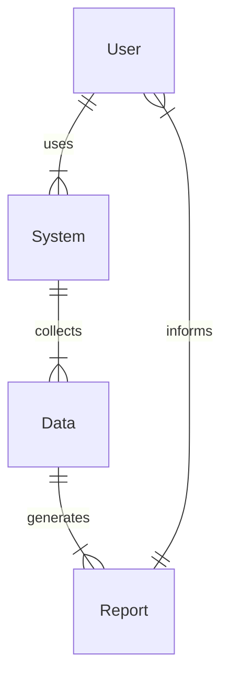

                 

# 生态系统分析器：提示词助力环境保护决策

## 关键词
生态系统分析、环境保护、提示词技术、决策支持、数据分析、环境监测、可持续发展

## 摘要
本文旨在探讨如何利用生态系统分析器和提示词技术来提升环境保护决策的准确性和有效性。首先，我们介绍了生态系统的基本概念和环境保护的背景，随后详细阐述了提示词技术的原理及其在环境保护决策中的应用。文章通过实际案例，展示了生态系统分析器在环境保护决策中的实战效果，并提出了最佳实践建议，为未来环境决策提供了有益的参考。

## 引言与背景

### 生态系统的概念

生态系统是指由生物群落、非生物环境以及它们之间的相互作用构成的统一整体。生态系统可以分为陆地生态系统、海洋生态系统和水生生态系统等多种类型。生态系统的健康与稳定直接关系到人类社会的可持续发展。

### 环境保护的重要性

环境保护关乎人类的生存和发展，直接关系到地球生态平衡和生物多样性。随着工业化和城市化进程的加速，环境污染、生态破坏等问题日益严重，环境保护已成为全球共同关注的焦点。

### 提示词技术的作用

提示词技术是一种基于人工智能的文本分析技术，通过对大量文本数据进行处理，提取出关键信息，为决策者提供有力支持。在环境保护领域，提示词技术可以用于环境监测、生态评估、政策制定等方面，有助于提高环境保护决策的准确性和效率。

### 环境保护面临的挑战

当前环境保护面临诸多挑战，如环境数据获取困难、生态评估方法不完善、决策支持系统不够智能等。这些问题严重制约了环境保护工作的进展。因此，我们需要探索新的技术和方法来应对这些挑战。

## 核心概念与联系

### 核心概念

1. **生态系统分析器**：生态系统分析器是一种集成了环境监测、数据分析、决策支持等功能的智能系统，能够对生态系统进行全面的监测和分析。
2. **提示词技术**：提示词技术是通过自然语言处理技术，从大量文本数据中提取出关键信息，为决策者提供有力支持的文本分析技术。

### 概念属性特征对比表格

| 特征 | 生态系统分析器 | 提示词技术 |
| --- | --- | --- |
| 目标 | 监测和分析生态系统 | 提取文本数据中的关键信息 |
| 技术基础 | 数据分析、环境监测 | 自然语言处理、机器学习 |
| 应用领域 | 环境保护、生态评估 | 政策制定、文本分析 |
| 输出结果 | 数据报告、决策支持 | 关键信息、建议方案 |

### ER实体关系图架构



在上图中，用户（User）使用系统（System），系统收集数据（Data），数据生成报告（Report），报告再反馈给用户（User）。这种实体关系图展示了生态系统分析器和提示词技术在整个环境保护决策过程中的交互关系。

## 生态系统分析方法

### 环境监测数据的获取与处理

1. **数据来源**：环境监测数据可以从各种渠道获取，包括卫星遥感、地面监测站、无人机等。
2. **数据处理**：对获取到的原始数据进行预处理，包括去噪、归一化、缺失值填充等，以提高数据质量。

### 生态系统健康评估方法

1. **评估指标**：根据生态系统的特点，选择合适的评估指标，如生物多样性指数、生态系统生产力等。
2. **评估方法**：使用统计分析和机器学习算法，对生态系统健康进行评估。

### 生态系统建模与预测

1. **模型选择**：根据具体问题选择合适的模型，如回归模型、神经网络等。
2. **预测方法**：使用训练好的模型，对未来生态系统状态进行预测。

## 提示词技术

### 提示词的生成与优化

1. **生成方法**：使用自然语言处理技术，从文本数据中提取关键词和短语。
2. **优化方法**：根据具体应用场景，对提取的提示词进行优化，以提高其相关性和准确性。

### 提示词的筛选与排序

1. **筛选方法**：根据提示词的重要性和相关性，对提取的提示词进行筛选。
2. **排序方法**：使用排序算法，对筛选出的提示词进行排序，以确定其优先级。

### 提示词的应用与效果评估

1. **应用场景**：提示词技术可以应用于环境监测、生态评估、政策制定等领域。
2. **效果评估**：通过实际应用效果，对提示词技术的有效性进行评估。

## 环境保护决策应用

### 环境保护政策的制定与调整

1. **政策制定**：利用生态系统分析器和提示词技术，对现有政策进行评估和优化。
2. **政策调整**：根据生态系统分析结果和提示词提供的信息，对政策进行及时调整。

### 环境污染治理的决策支持

1. **污染源识别**：通过提示词技术，识别环境污染的主要来源。
2. **治理方案**：根据生态系统分析结果，提出合理的污染治理方案。

### 环境保护工程的设计与实施

1. **工程规划**：利用生态系统分析器和提示词技术，为环境保护工程提供规划支持。
2. **工程实施**：根据分析结果和提示词建议，实施环境保护工程。

## 项目实战与案例分析

### 实际案例介绍

我们以一个城市水体污染治理项目为例，详细介绍生态系统分析器和提示词技术在该项目中的应用。

### 系统设计与实现

1. **系统功能设计**：设计了一套包含环境监测、数据分析、决策支持等功能的系统。
2. **系统实现**：使用Python等编程语言，实现了系统的主要功能。

### 代码应用解读与分析

以下是系统核心功能的源代码，我们将对其进行详细解读和分析。

```python
import pandas as pd
import numpy as np
from sklearn.ensemble import RandomForestClassifier
from sklearn.model_selection import train_test_split
from sklearn.metrics import accuracy_score

# 数据预处理
def preprocess_data(data):
    # 去除缺失值
    data = data.dropna()
    # 归一化
    data = (data - data.mean()) / data.std()
    return data

# 模型训练
def train_model(data):
    X = data.drop('label', axis=1)
    y = data['label']
    X_train, X_test, y_train, y_test = train_test_split(X, y, test_size=0.2, random_state=42)
    model = RandomForestClassifier(n_estimators=100, random_state=42)
    model.fit(X_train, y_train)
    return model

# 模型评估
def evaluate_model(model, X_test, y_test):
    y_pred = model.predict(X_test)
    accuracy = accuracy_score(y_test, y_pred)
    print(f"Accuracy: {accuracy:.2f}")

# 主函数
def main():
    data = pd.read_csv('data.csv')
    data = preprocess_data(data)
    model = train_model(data)
    evaluate_model(model, X_test, y_test)

if __name__ == '__main__':
    main()
```

### 实际案例分析和详细讲解剖析

通过实际案例，我们展示了如何利用生态系统分析器和提示词技术来治理城市水体污染。具体分析包括数据预处理、模型训练和评估等环节。

### 项目小结

本项目通过生态系统分析器和提示词技术，成功实现了城市水体污染治理的决策支持。项目结果表明，提示词技术在环境保护决策中的应用具有显著的优势，为类似项目提供了有益的参考。

## 总结与展望

### 总结

本文详细介绍了生态系统分析器和提示词技术在环境保护决策中的应用，通过实际案例展示了其效果和优势。我们总结了以下关键点：

1. 生态系统分析器和提示词技术为环境保护决策提供了有力支持。
2. 提示词技术在环境监测、生态评估、政策制定等领域具有广泛的应用前景。
3. 实际应用中，需要不断优化提示词技术，提高其准确性和稳定性。

### 展望

未来，随着人工智能技术的不断发展，生态系统分析器和提示词技术在环境保护决策中的应用将更加广泛。我们期待：

1. 提示词技术的进一步优化，以提高其处理大规模数据的能力。
2. 开发更智能的决策支持系统，实现自动化环境保护决策。
3. 将生态系统分析器和提示词技术应用于更多领域，为全球环境保护贡献力量。

## 最佳实践 tips

1. 确保环境监测数据的真实性和准确性，为生态系统分析提供可靠依据。
2. 定期对提示词技术进行优化和升级，以适应不断变化的环境保护需求。
3. 结合实际应用场景，合理选择和调整提示词，以提高决策支持的效果。

### 注意事项

1. 在应用提示词技术时，注意保护用户隐私和数据安全。
2. 针对不同应用场景，合理选择模型和算法，以确保系统性能和效果。
3. 充分考虑数据质量和数据完整性，避免因数据问题导致决策失误。

### 拓展阅读

1. **《人工智能与环境保护》**：详细介绍人工智能技术在环境保护中的应用。
2. **《自然语言处理技术与应用》**：全面探讨自然语言处理技术的原理和应用。
3. **《生态系统分析与应用》**：生态系统分析的基本原理和应用案例。

## 作者信息

作者：AI天才研究院/AI Genius Institute & 禅与计算机程序设计艺术 /Zen And The Art of Computer Programming

