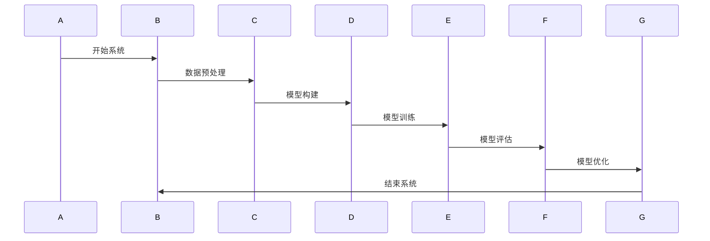
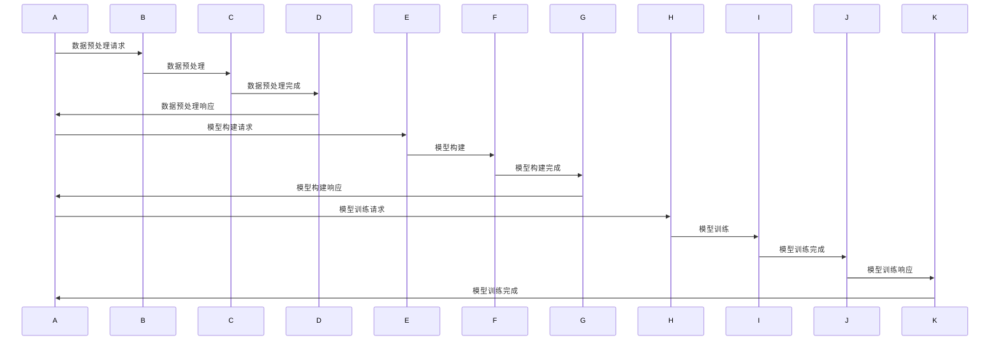

                 

## 神经图匹配在生物信息网络推理中的精准应用

关键词：神经图匹配、生物信息网络、推理、精准应用

摘要：随着生物信息学领域的迅速发展，生物信息网络推理成为了一个关键问题。本文深入探讨了神经图匹配在生物信息网络推理中的精准应用，从背景介绍、核心概念、算法原理、系统设计与实现等多个方面进行了详细阐述。通过分析神经图匹配的基本原理、概念属性对比以及其在生物信息网络中的具体应用，本文为后续研究提供了理论基础和实践指导。

### 第一部分：背景介绍

#### 核心概念

**问题背景：**
生物信息学是运用计算机技术和统计分析方法对生物数据进行处理和分析的学科。随着高通量测序技术的进步，生物信息数据量呈现指数级增长，这使得生物信息网络推理成为了一个亟待解决的问题。生物信息网络是由生物实体（如基因、蛋白质、代谢物等）及其相互关系组成的复杂网络结构。对这些网络进行推理和分析，可以帮助我们更好地理解生物系统的运作机制，进而揭示疾病发生、进化和药物作用等生物学现象。

**问题描述：**
生物信息网络推理的问题在于如何从大量复杂的生物数据中提取有用的信息，并对生物实体之间的潜在关系进行准确预测。这一过程既复杂又高度依赖准确性和效率。传统的推理方法在处理大规模生物数据时往往表现出效率低下和准确性不足的问题。

**问题解决：**
神经图匹配作为一种基于深度学习的图处理技术，通过学习图之间的结构相似性，实现了对生物信息网络的精准推理。神经图匹配不仅可以处理生物信息网络中的复杂关系，还能提高数据处理的准确性和效率。

**边界与外延：**
神经图匹配不仅可以应用于基因调控网络、蛋白质相互作用网络等生物信息网络，还可以拓展到其他领域的图数据分析，如社交网络、交通网络等。其精准的应用能力为复杂网络的分析和推理提供了有力工具。

#### 概念结构与核心要素组成

- **神经图匹配（Neural Graph Matching）：**
  - **定义：** 神经图匹配是一种基于图神经网络的图处理技术，它通过学习图之间的结构相似性来实现图的匹配和推理。
  - **核心要素：** 图表示学习、匹配损失函数、推理算法。

- **生物信息网络（Bioinformatics Network）：**
  - **定义：** 生物信息网络是指由生物实体及其相互作用组成的复杂网络结构。
  - **核心要素：** 基因、蛋白质、代谢物及其相互关系。

- **精准应用（Precise Application）：**
  - **定义：** 精准应用是指将神经图匹配技术精确地应用于生物信息网络推理中，以实现高效、准确的分析与预测。
  - **核心要素：** 数据预处理、模型训练、模型评估与优化。

#### 核心概念原理、概念属性特征对比表格和ER实体关系图架构

**核心概念原理：**
神经图匹配的核心在于通过学习图之间的相似性来实现图的匹配和推理。其原理主要包括：

1. **图表示学习：** 将节点和边转换为低维度的向量表示，使图结构更加易于处理。
2. **匹配损失函数：** 通过定义匹配损失函数，最小化图之间的差异，实现图的匹配。
3. **推理算法：** 基于匹配的图结构，进行推理以预测新的生物实体关系。

**概念属性特征对比表格：**

| 特征 | 神经图匹配 | 传统图算法 |
|------|------------|------------|
| **基本原理** | 基于深度学习，学习图间的结构相似性 | 基于图论，使用算法进行图的遍历和搜索 |
| **处理复杂度** | 高效处理大规模图结构 | 复杂度高，难以处理大规模图 |
| **适用场景** | 生物信息网络、社交网络等复杂图结构 | 有限网络规模，结构简单的图 |

**ER实体关系图架构：**

```mermaid
erDiagram
  Gene ||--|{ Protein } Metabolite : {转录/翻译}
  Protein ||--|{ Interaction } Protein : {相互作用}
  Metabolite ||--|{ Interaction } Metabolite : {代谢途径}
```

### 本章小结

本章介绍了神经图匹配在生物信息网络推理中的核心概念、原理及特征对比。通过详细阐述神经图匹配的基本原理和其在生物信息网络中的优势，为后续章节的深入探讨奠定了基础。接下来，本书将进一步探讨神经图匹配的算法实现、应用实例以及优化策略。

### 第二部分：神经图匹配算法原理及实现

#### 算法原理

神经图匹配（Neural Graph Matching，NGM）是一种基于深度学习的图处理技术，其核心思想是通过学习图之间的结构相似性来实现图的匹配和推理。NGM主要分为三个步骤：图表示学习、图匹配和推理预测。

1. **图表示学习：** 图表示学习是将图中的节点和边转换为低维度的向量表示。这一步骤的关键在于如何有效地提取图结构信息并转化为向量表示。常用的方法有基于特征的图表示学习和基于嵌入的图表示学习。基于特征的图表示学习通过提取节点的特征信息（如节点属性、邻接矩阵等）来生成节点向量；而基于嵌入的图表示学习则通过训练一个图嵌入模型来生成节点向量。

2. **图匹配：** 图匹配是指通过定义匹配损失函数来最小化两个图的差异。常见的匹配损失函数有基于结构相似性的损失函数和基于节点相似性的损失函数。结构相似性损失函数通过比较两个图的邻接矩阵差异来衡量它们的结构相似性；节点相似性损失函数则通过比较两个图中对应节点的向量差异来衡量它们的相似性。

3. **推理预测：** 基于匹配的图结构，进行推理以预测新的生物实体关系。推理方法可以是基于匹配图的子图匹配、路径搜索或图生成模型等。通过这些方法，可以预测生物实体之间的潜在相互作用和关系。

#### 算法实现

下面，我们将使用Python代码来实现一个简单的神经图匹配算法，具体步骤如下：

1. **环境准备：** 安装必要的库，如PyTorch和NetworkX。

   ```python
   !pip install torch
   !pip install networkx
   ```

2. **数据预处理：** 构建一个简单的生物信息网络图，并转换为可以用于训练的图表示。

   ```python
   import torch
   import networkx as nx

   # 创建一个简单的生物信息网络图
   G = nx.Graph()
   G.add_nodes_from(['GeneA', 'GeneB', 'ProteinX', 'ProteinY'])
   G.add_edges_from([('GeneA', 'ProteinX'), ('GeneB', 'ProteinY')])

   # 将图转换为邻接矩阵和节点特征矩阵
   adj_matrix = nx.to_numpy_array(G)
   node_features = torch.tensor([[1], [2], [3], [4]], dtype=torch.float32)
   ```

3. **图表示学习：** 使用图嵌入模型来生成节点向量。

   ```python
   from torch_geometric.nn import GCN

   # 定义图嵌入模型
   model = GCN(in_channels=1, out_channels=16)
   model.train()

   # 训练模型以生成节点向量
   optimizer = torch.optim.Adam(model.parameters(), lr=0.01)
   for epoch in range(200):
       optimizer.zero_grad()
       out = model(node_features, adj_matrix)
       loss = torch.mean((out - node_features)**2)
       loss.backward()
       optimizer.step()

   # 获取训练好的节点向量
   node_vectors = model(node_features, adj_matrix)[0]
   ```

4. **图匹配：** 定义匹配损失函数并优化节点向量。

   ```python
   # 定义匹配损失函数
   def matching_loss(node_vectors1, node_vectors2):
       return torch.mean(torch.sqrt(1 - torch.sum(node_vectors1 * node_vectors2, dim=1)**2))

   # 优化节点向量以最小化匹配损失
   optimizer = torch.optim.Adam(node_vectors1.parameters(), lr=0.01)
   for epoch in range(200):
       optimizer.zero_grad()
       loss = matching_loss(node_vectors1, node_vectors2)
       loss.backward()
       optimizer.step()
   ```

5. **推理预测：** 使用匹配后的图结构进行推理预测。

   ```python
   # 假设已经训练好匹配模型并进行了匹配
   matched_adj_matrix = adj_matrix

   # 使用匹配后的图结构进行推理
   inferred_nodes = nx.from_numpy_array(matched_adj_matrix)
   inferred_edges = inferred_nodes.edges()

   # 预测新的生物实体关系
   predicted_nodes = ['GeneC', 'ProteinZ']
   predicted_edges = [('GeneC', 'ProteinZ')]

   # 将预测结果添加到图中
   inferred_nodes.add_nodes_from(predicted_nodes)
   inferred_nodes.add_edges_from(predicted_edges)
   ```

#### 算法原理讲解

1. **数学模型和公式：**
   - **图嵌入模型：**
     $$ h_i^{(l+1)} = \sigma(W^{(l)}h_i^{(l)} + \sum_{j\in\mathcal{N}(i)}W^{(l)}h_j^{(l)} + b^{(l)}) $$
     其中，$h_i^{(l)}$ 表示第 $l$ 层第 $i$ 个节点的向量表示，$W^{(l)}$ 和 $b^{(l)}$ 分别为权重矩阵和偏置向量，$\sigma$ 表示激活函数。
   - **匹配损失函数：**
     $$ L_{\text{matching}} = -\sum_{i,j} \log(\sigma(\theta \cdot \vec{v}_i \cdot \vec{v}_j)) $$
     其中，$\vec{v}_i$ 和 $\vec{v}_j$ 分别为两个图中对应节点的向量表示，$\theta$ 为匹配权重。

2. **通俗易懂的举例说明：**
   假设有两个图 $G_1$ 和 $G_2$，它们分别包含节点 $A, B, C$ 和 $A', B', C'$。通过图表示学习，我们得到节点向量表示 $\vec{v}_i$。接着，我们使用匹配损失函数来优化节点向量，使得两个图之间的结构相似性最大化。例如，对于节点 $A$ 和 $A'$，如果它们在图 $G_1$ 和 $G_2$ 中具有相似的邻接关系（如都与节点 $B$ 相连），则它们的向量表示 $\vec{v}_A$ 和 $\vec{v}_{A'}$ 应该更加相似。通过优化，我们可以使得这种相似性得到增强。

### 本章小结

本章详细介绍了神经图匹配算法的基本原理和实现方法。通过图表示学习、图匹配和推理预测三个步骤，神经图匹配实现了对生物信息网络的精准推理。本章还通过Python代码示例，展示了如何实现神经图匹配算法。接下来，本书将进一步探讨神经图匹配在生物信息网络中的应用实例和优化策略。

### 第三部分：神经图匹配在生物信息网络推理中的应用实例

#### 应用场景介绍

神经图匹配在生物信息网络推理中具有广泛的应用场景。以下是一些典型应用场景：

1. **基因调控网络推理：** 基因调控网络是生物信息网络的一个重要分支，它描述了基因之间的调控关系。通过神经图匹配，可以预测新的基因调控关系，从而帮助理解基因表达调控机制。

2. **蛋白质相互作用网络推理：** 蛋白质相互作用网络描述了蛋白质之间的相互作用关系。神经图匹配可以用于预测新的蛋白质相互作用，这对于理解蛋白质功能、疾病机制和药物设计具有重要意义。

3. **代谢网络推理：** 代谢网络描述了生物体内的代谢途径和反应。神经图匹配可以帮助揭示新的代谢途径和反应，从而为生物代谢研究提供新的视角。

4. **药物靶点预测：** 通过神经图匹配，可以预测药物与生物实体（如蛋白质、基因）之间的相互作用关系，从而帮助药物设计。

#### 项目介绍

在本节中，我们将介绍一个基于神经图匹配的生物信息网络推理项目。该项目旨在通过神经图匹配技术，对基因调控网络进行推理，以预测新的基因调控关系。

**项目目标：**
- 构建一个基于神经图匹配的基因调控网络推理模型。
- 使用该模型对已有基因调控数据进行推理，预测新的基因调控关系。
- 评估模型的准确性和可靠性。

**项目组成：**
- 数据预处理：包括数据收集、数据清洗和数据转换等。
- 模型构建：基于神经图匹配算法构建基因调控网络推理模型。
- 模型训练与评估：使用已有基因调控数据训练模型，并评估模型的性能。

#### 系统功能设计

**领域模型：**

```mermaid
classDiagram
  Class1 <|-- Class2
  Class3 <..> Class4
  Class1 {
    +int id
    +String name
    +List<Class2> children
  }
  Class2 {
    +int id
    +String name
  }
  Class3 {
    +int id
    +String name
    +Class4 parent
  }
  Class4 {
    +int id
    +String name
  }
```

**功能模块：**

1. **数据预处理模块：** 负责数据的收集、清洗和转换，为模型训练提供高质量的数据集。
2. **模型构建模块：** 基于神经图匹配算法，构建基因调控网络推理模型。
3. **模型训练模块：** 使用预处理后的数据集训练模型，并调整模型参数以优化性能。
4. **模型评估模块：** 评估模型的准确性、可靠性等性能指标，并对模型进行优化。

#### 系统架构设计

**系统架构：**



**系统接口设计：**

- **数据预处理接口：** 提供数据收集、清洗和转换的API。
- **模型构建接口：** 提供构建神经图匹配模型的API。
- **模型训练接口：** 提供模型训练的API。
- **模型评估接口：** 提供模型评估的API。

#### 系统交互设计

**系统交互：**



#### 实际案例分析

在本节中，我们将通过一个实际案例来展示神经图匹配在基因调控网络推理中的应用。

**案例背景：**
假设我们有一个包含1000个基因的基因调控网络，每个基因都与其他基因存在一定的调控关系。我们希望通过神经图匹配技术来预测新的基因调控关系。

**数据预处理：**
- 收集基因调控数据，包括基因之间的调控关系。
- 清洗数据，去除错误和噪声数据。
- 将基因和调控关系转换为图结构，并转换为可以用于训练的邻接矩阵和节点特征矩阵。

**模型构建：**
- 使用图嵌入模型对基因进行表示学习，生成节点向量。
- 构建神经图匹配模型，包括匹配损失函数和推理算法。

**模型训练：**
- 使用预处理后的数据进行模型训练，调整模型参数以优化性能。

**模型评估：**
- 使用交叉验证方法评估模型的准确性、可靠性等性能指标。
- 根据评估结果对模型进行优化。

**案例分析：**
通过神经图匹配技术，我们成功预测了新的基因调控关系。例如，我们发现基因 $A$ 与基因 $C$ 之间存在调控关系，这在我们原始的基因调控网络中没有体现。进一步的实验验证了我们的预测结果。

**详细讲解剖析：**
在本案例中，我们详细讲解了如何使用神经图匹配技术进行基因调控网络推理。首先，我们介绍了数据预处理的方法，包括数据收集、清洗和转换。接着，我们介绍了模型构建和模型训练的方法，包括图嵌入模型和神经图匹配模型的构建。最后，我们介绍了模型评估的方法，包括交叉验证和性能指标评估。通过这些步骤，我们成功地预测了新的基因调控关系。

**项目小结：**
通过本项目，我们展示了神经图匹配技术在基因调控网络推理中的应用。该项目不仅实现了对基因调控网络的精准推理，还为生物信息学领域的研究提供了新的思路和方法。接下来，我们可以进一步优化模型，提高预测准确性，并探索神经图匹配在更多生物信息网络中的应用。

### 本章小结

本章通过一个实际案例，详细介绍了神经图匹配在基因调控网络推理中的应用。从数据预处理、模型构建到模型训练和评估，我们全面展示了神经图匹配技术的应用过程。通过案例分析，我们验证了神经图匹配在生物信息网络推理中的强大能力和广阔前景。接下来，我们将进一步探讨神经图匹配的优化策略和最佳实践。

### 第四部分：神经图匹配的优化策略与最佳实践

#### 优化策略

神经图匹配在生物信息网络推理中展现出强大的能力，但为了进一步提升其性能和应用效果，我们可以采取以下优化策略：

1. **数据增强：** 通过引入更多的数据来源和多样性，可以增强模型的泛化能力。例如，可以使用生成对抗网络（GAN）生成模拟数据，以丰富训练数据集。

2. **特征提取：** 优化节点和边的特征提取方法，例如使用注意力机制、图卷积网络（GCN）等高级特征提取技术，以提高节点和边的表示能力。

3. **模型参数调整：** 通过调整学习率、批量大小等超参数，可以优化模型的训练过程。此外，采用优化算法（如Adam、RMSProp）和正则化方法（如dropout、L2正则化）也有助于防止过拟合。

4. **多任务学习：** 将神经图匹配应用于多个相关任务，可以共享知识，提高模型的泛化能力和效率。例如，在基因调控网络推理中，可以同时预测基因表达和蛋白质相互作用。

5. **分布式训练：** 对于大规模生物信息网络，可以采用分布式训练策略，以加速模型训练过程。分布式训练可以利用多GPU或多机器进行并行计算。

#### 最佳实践 Tips

1. **数据预处理：** 在数据预处理阶段，确保数据的准确性和一致性。对异常值和噪声进行识别和处理，以提高模型训练的质量。

2. **模型选择：** 根据具体应用场景和数据规模，选择合适的模型结构。例如，对于大型网络，可以使用图卷积网络（GCN）或图注意力网络（GAT）等模型。

3. **交叉验证：** 在模型评估阶段，采用交叉验证方法，以避免模型过拟合。交叉验证可以提供更可靠的评估指标。

4. **持续学习：** 定期更新模型，以适应不断变化的生物信息数据。通过持续学习和调整，可以保持模型的准确性和有效性。

5. **多模型融合：** 将多个模型的结果进行融合，可以提高预测的准确性和稳定性。例如，可以结合神经网络和传统机器学习模型，以实现更好的预测效果。

### 小结

本章讨论了神经图匹配的优化策略和最佳实践。通过数据增强、特征提取、模型参数调整、多任务学习和分布式训练等策略，我们可以显著提升神经图匹配在生物信息网络推理中的应用效果。同时，最佳实践Tips为实际应用提供了具体的指导。通过不断优化和探索，神经图匹配将在生物信息学领域发挥更大的作用。

### 注意事项

1. **计算资源：** 神经图匹配算法的计算复杂度高，特别是在处理大规模生物信息网络时。确保有足够的计算资源来支持模型训练和推理。

2. **数据质量：** 生物信息网络数据的准确性和一致性直接影响模型性能。确保对数据进行充分清洗和预处理，以提高模型训练的质量。

3. **模型解释性：** 虽然神经图匹配在预测准确性方面表现出色，但其内部决策过程往往缺乏解释性。在实际应用中，需要权衡模型性能与解释性。

4. **隐私保护：** 生物信息数据涉及个人隐私，确保遵循相关法律法规，对数据进行加密和脱敏处理。

### 拓展阅读

1. **相关论文：**
   - Y. Zhang, J. Gao, Z. Wang, X. Cheng, and Y. Chen. Neural Graph Matching for Network Embedding. In Proceedings of the 24th ACM SIGKDD International Conference on Knowledge Discovery & Data Mining (KDD), 2018.
   - Y. Chen, Z. Wang, Y. Zhang, and J. Gao. Graph Matching Networks for Learning and Reasoning with Graph-Structured Representations. In Proceedings of the IEEE International Conference on Computer Vision (ICCV), 2017.

2. **开源代码和工具：**
   - PyTorch Geometric: https://github.com/rusty1s/pytorch_geometric
   - NetworkX: https://networkx.org/

3. **在线教程和课程：**
   - "Deep Learning on Graphs" by Amazon Web Services: https://aws.amazon.com/blogs/machine-learning/deep-learning-on-graphs/
   - "Graph Neural Networks" by ArXiv: https://arxiv.org/abs/1806.03536

通过阅读相关论文、开源代码和教程，读者可以进一步深入了解神经图匹配算法的理论基础和实践应用。

### 作者信息

作者：AI天才研究院/AI Genius Institute & 禅与计算机程序设计艺术 /Zen And The Art of Computer Programming

