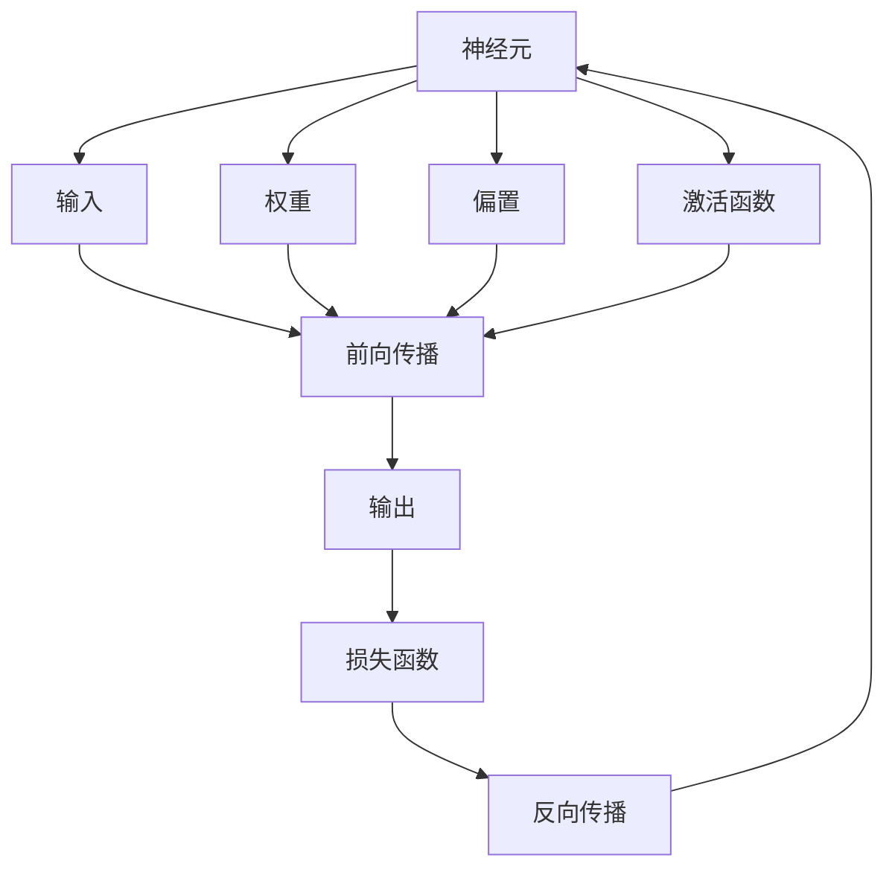
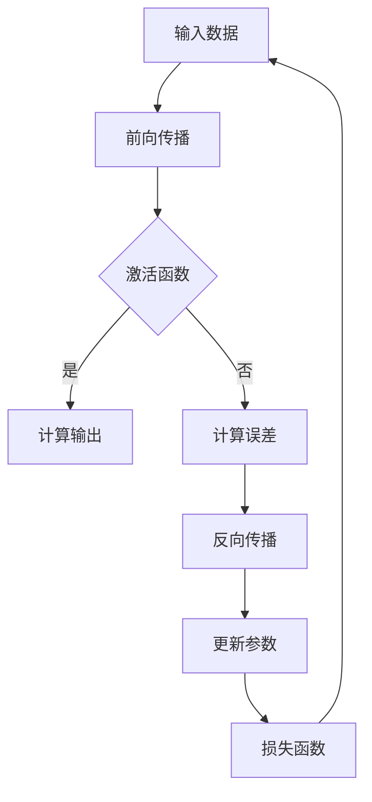
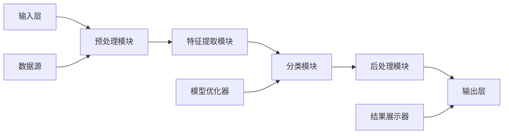
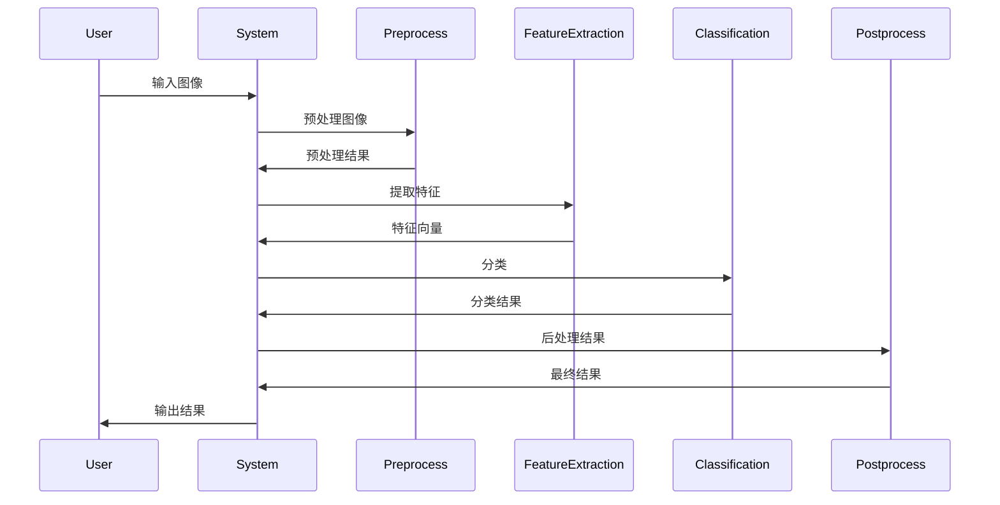
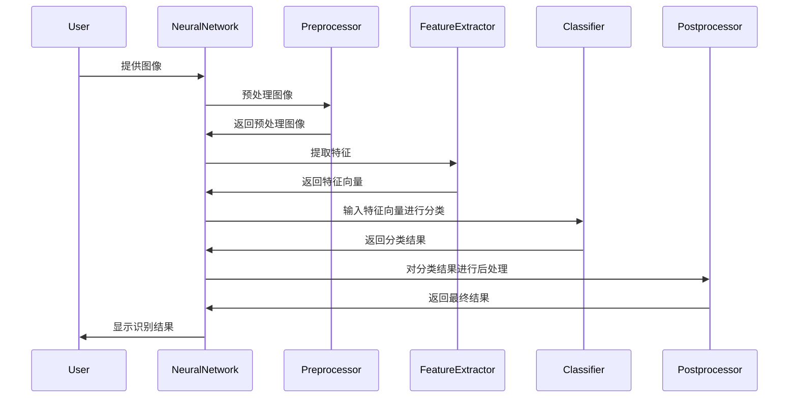

                 

### 神经图灵机：增强AI的可编程性

神经图灵机（Neural Turing Machine, NTM）是一种结合了神经网络与图灵机的混合模型，旨在增强人工智能（AI）系统的可编程性和适应性。神经图灵机通过融合神经网络的强大学习能力和图灵机的存储与检索能力，为AI领域带来了全新的研究方向和可能性。

#### 关键词

- **神经图灵机**：结合神经网络与图灵机的混合模型。
- **可编程性**：增强AI系统的编程能力和灵活性。
- **神经网络**：通过学习数据自动调整内部参数，实现特征提取与模式识别。
- **图灵机**：计算模型，具备存储和检索信息的能力。
- **AI**：人工智能，模拟人类智能行为的技术系统。

#### 摘要

本文将首先介绍神经图灵机的概念和背景，探讨其与传统图灵机的区别和关键特性。接着，我们将深入探讨神经图灵机的理论基础，包括神经网络的基本原理、类型以及训练与优化方法。随后，我们将讨论神经图灵机的实现技术，包括其构建方法和性能评估。最后，通过实际应用案例研究，展示神经图灵机在图像识别等领域的应用效果，并对神经图灵机的未来发展进行展望。

## 引言

### 1.1 神经图灵机概念引入

神经图灵机是由Geoffrey Hinton等人在2013年首次提出的，它结合了神经网络的动态特性和图灵机的存储与检索功能。传统神经网络通过学习大量数据来调整内部参数，从而实现复杂的特征提取和模式识别。然而，神经网络在处理长期依赖问题和外部信息存储方面存在一定的局限性。相比之下，图灵机作为计算理论的基础，具备强大的存储和检索能力，可以处理更复杂的信息处理任务。

神经图灵机通过将神经网络与图灵机相结合，解决了神经网络在信息存储和检索方面的局限。NTM利用神经网络的动态特性进行信息处理，同时通过图灵机的存储和检索功能来增强其可编程性和灵活性。这种混合模型的提出，为AI领域带来了一种全新的研究思路和解决方案。

### 1.2 神经图灵机的历史背景

神经图灵机的概念源于神经网络和图灵机的长期发展。神经网络的研究可以追溯到20世纪40年代，由心理学家McCulloch和数学家Pitts提出的神经元模型。随后，神经网络在20世纪80年代得到了广泛关注，但由于计算能力的限制，其应用受到了一定限制。随着计算能力的提升和大数据技术的发展，神经网络在21世纪初取得了显著突破，特别是在图像识别、语音识别和自然语言处理等领域。

另一方面，图灵机作为计算理论的基础，由英国数学家艾伦·图灵在20世纪30年代提出。图灵机通过模拟抽象的计算过程，为计算机科学提供了理论框架。尽管图灵机的概念在理论研究中具有重要意义，但在实际应用中，其存储和检索能力受到一定限制。

神经图灵机的提出，将神经网络和图灵机的优势相结合，为AI领域带来了一种新的可能性。通过融合神经网络的动态特性和图灵机的存储与检索功能，神经图灵机有望在复杂信息处理任务中发挥更大作用。

### 1.3 神经图灵机与传统图灵机的对比

传统图灵机是一种抽象的计算模型，由图灵带、读写头和状态机组成。图灵机的核心特点是能够通过读写头在图灵带上进行读写操作，从而实现对信息的存储和检索。然而，传统图灵机的计算过程是静态的，无法动态适应变化的信息。

相比之下，神经图灵机在结构上与传统图灵机有显著差异。神经图灵机由神经网络和存储环组成。神经网络部分负责信息处理和特征提取，存储环则用于存储和检索信息。神经图灵机通过动态调整神经网络和存储环之间的连接，实现信息的动态存储和检索。

在信息处理能力方面，神经图灵机相比传统图灵机具有更强的适应性。神经网络能够通过学习大量数据自动调整内部参数，从而实现对复杂信息的处理。此外，神经图灵机的存储环具有更高的存储容量和检索速度，能够更好地应对复杂的信息处理任务。

总之，神经图灵机在结构、信息处理能力和适应性方面相比传统图灵机具有显著优势，为其在AI领域的应用提供了更多可能性。

### 1.4 神经图灵机的关键特性

神经图灵机具有以下几个关键特性，使其在AI领域具有独特的优势：

1. **动态存储与检索能力**：神经图灵机的存储环能够动态存储和检索信息，从而实现对复杂信息的处理。这种动态特性使得神经图灵机能够更好地适应变化的信息环境。

2. **强大的信息处理能力**：神经图灵机通过神经网络部分进行信息处理和特征提取，能够自动学习大量数据，从而实现对复杂问题的解决。

3. **可编程性**：神经图灵机具有高可编程性，通过调整神经网络和存储环之间的连接，可以实现不同类型的信息处理任务。

4. **高效性**：神经图灵机在信息存储和检索方面具有较高的效率，能够在较短时间内完成复杂的信息处理任务。

5. **适应性强**：神经图灵机能够动态适应不同类型的信息处理任务，从而提高其应用范围和实用性。

### 1.5 神经图灵机的发展趋势与应用前景

随着计算能力和大数据技术的发展，神经图灵机在AI领域具有广泛的应用前景。以下是一些神经图灵机的发展趋势和应用领域：

1. **图像识别与处理**：神经图灵机在图像识别和图像处理方面具有优势，能够实现更准确和高效的图像分类、目标检测和图像生成。

2. **自然语言处理**：神经图灵机在自然语言处理领域具有潜力，能够实现更准确的语言模型、文本生成和机器翻译。

3. **强化学习**：神经图灵机在强化学习中的应用能够提高智能体在复杂环境中的适应能力和学习效率。

4. **知识图谱**：神经图灵机能够更好地处理知识图谱中的信息，实现更准确的知识推理和推荐。

5. **自动化系统**：神经图灵机在自动化系统中可以用于实现更智能的决策和优化，提高系统的效率和灵活性。

总之，神经图灵机作为一种新兴的AI模型，具有强大的动态存储与检索能力、可编程性和适应性。随着技术的不断发展和应用领域的拓展，神经图灵机有望在更多领域发挥重要作用，推动AI技术的进步和发展。

## 第一部分：神经图灵机的理论基础

### 2.1 神经网络基础

神经网络（Neural Networks）是模拟人脑神经元连接和交互方式的计算模型，由大量相互连接的简单处理单元（即神经元）组成。神经网络通过学习大量数据来自动调整内部参数，从而实现复杂的特征提取、模式识别和预测等功能。以下是神经网络的一些基本原理：

#### 2.1.1 神经元模型

神经元是神经网络的基本组成单元，其工作原理类似于生物神经元。神经元通过接收输入信号，将其传递到内部，通过激活函数进行非线性变换，最终产生输出信号。神经元的输入和输出可以通过以下公式表示：

\[ 输出 = \text{激活函数}( \sum_{i=1}^{n} w_i \cdot x_i + b ) \]

其中，\( x_i \) 是第 \( i \) 个输入，\( w_i \) 是对应输入的权重，\( b \) 是偏置，激活函数通常用于引入非线性特性。

#### 2.1.2 激活函数

激活函数（Activation Function）是神经元模型中的关键组成部分，它决定了神经元是否“激活”并传递信号。常见的激活函数包括：

- **Sigmoid函数**：\[ \sigma(x) = \frac{1}{1 + e^{-x}} \]，将输入映射到 \([0, 1]\) 区间内，常用于二分类问题。
- **ReLU函数**（Rectified Linear Unit）：\[ \text{ReLU}(x) = \max(0, x) \]，在输入为负时输出为零，在输入为正时保持输入，常用于深度神经网络中以加速训练。
- **Tanh函数**：\[ \tanh(x) = \frac{e^x - e^{-x}}{e^x + e^{-x}} \]，将输入映射到 \([-1, 1]\) 区间内。

#### 2.1.3 前向传播与反向传播算法

神经网络通过两个主要步骤进行训练：前向传播（Forward Propagation）和反向传播（Backpropagation）。

- **前向传播**：输入数据通过网络的各个层，每层神经元的输出作为下一层的输入。每一层的输出经过激活函数处理后，最终得到网络的总输出。这一过程反映了数据在网络中的传播路径。
  
- **反向传播**：网络的总输出与期望输出之间的误差通过反向传播算法传播回网络。反向传播算法计算每个神经元输出对误差的梯度，并根据这些梯度调整每个神经元的权重和偏置。这一过程称为“反向传播”，因为它从输出层开始，逐层向前计算误差的梯度。

反向传播算法通常使用梯度下降（Gradient Descent）方法进行优化。梯度下降是一种优化算法，通过沿着损失函数梯度的反方向更新参数，以最小化损失函数。

### 2.2 神经网络的类型

神经网络有多种类型，根据结构和功能的不同，可以分为以下几种：

#### 2.2.1 单层感知机（Perceptron）

单层感知机是最简单的神经网络，由一个输入层和一个输出层组成。每个输入通过权重与输出相乘，再经过激活函数处理，产生最终输出。单层感知机主要用于线性可分问题，即可以通过一条直线或平面将数据分为两个类别。

#### 2.2.2 多层感知机（Multilayer Perceptron, MLP）

多层感知机（MLP）是单层感知机的扩展，包含一个或多个隐含层。隐含层用于提取更高层次的特征，从而提高网络的分类或回归能力。MLP广泛应用于分类和回归问题，可以处理非线性数据。

#### 2.2.3 卷积神经网络（Convolutional Neural Network, CNN）

卷积神经网络（CNN）专门用于处理图像数据，通过卷积操作提取图像特征。CNN由多个卷积层、池化层和全连接层组成。卷积层使用卷积核对输入图像进行特征提取，池化层用于下采样，减少模型参数和计算复杂度。全连接层将特征映射到最终输出。

#### 2.2.4 循环神经网络（Recurrent Neural Network, RNN）

循环神经网络（RNN）是一种用于处理序列数据的神经网络，其特别之处在于能够利用历史信息。RNN通过循环结构保持对过去信息的记忆，从而捕捉序列中的长期依赖关系。RNN广泛应用于自然语言处理、语音识别和时间序列预测等领域。

#### 2.2.5 生成对抗网络（Generative Adversarial Network, GAN）

生成对抗网络（GAN）是一种由生成器和判别器组成的对抗性网络。生成器尝试生成逼真的数据，判别器则判断生成数据的真实性。通过这种对抗性训练，GAN能够生成高质量的图像、音频和文本数据。

### 2.3 神经网络的训练与优化

神经网络的训练过程是一个不断优化网络参数的过程，目的是使网络的输出尽可能接近期望输出。以下是神经网络训练过程中常用的几个关键概念：

#### 2.3.1 损失函数（Loss Function）

损失函数用于衡量网络输出与期望输出之间的差异。常见的损失函数包括均方误差（MSE）损失、交叉熵损失等。损失函数的值越小，说明网络输出越接近期望输出。

#### 2.3.2 优化算法（Optimization Algorithm）

优化算法用于更新网络参数，以最小化损失函数。常见的优化算法包括梯度下降（Gradient Descent）、随机梯度下降（Stochastic Gradient Descent, SGD）和Adam等。优化算法通过计算损失函数关于参数的梯度，并沿着梯度方向更新参数，以逐步减少损失。

#### 2.3.3 正则化方法（Regularization Method）

正则化方法用于防止过拟合，提高模型的泛化能力。常见的正则化方法包括L1正则化、L2正则化以及Dropout等。正则化方法通过在损失函数中添加正则化项，限制模型复杂度，从而减少过拟合现象。

### 2.4 神经网络在计算机视觉中的应用

神经网络在计算机视觉领域取得了显著的成果，以下是一些主要应用：

#### 2.4.1 图像分类（Image Classification）

图像分类是将图像分为不同类别的任务。常见的分类模型包括多层感知机（MLP）、卷积神经网络（CNN）等。CNN由于其强大的特征提取能力，在图像分类任务中表现出色。

#### 2.4.2 目标检测（Object Detection）

目标检测是在图像中检测并定位多个目标。常见的目标检测算法包括R-CNN、Fast R-CNN、Faster R-CNN等。这些算法通常结合CNN进行特征提取，并在特征图上进行目标检测。

#### 2.4.3 图像生成（Image Generation）

图像生成是通过神经网络生成新的图像。生成对抗网络（GAN）是图像生成的重要模型，能够生成逼真的图像、视频和音频。

### 2.5 神经网络在自然语言处理中的应用

神经网络在自然语言处理（NLP）领域也取得了重要进展，以下是一些主要应用：

#### 2.5.1 词汇表与嵌入（Vocabulary and Embeddings）

词汇表用于表示自然语言中的词汇，而嵌入（Embeddings）是将词汇映射到高维向量空间的过程。词嵌入能够捕捉词汇之间的语义关系，是NLP中的重要技术。

#### 2.5.2 语言模型（Language Model）

语言模型用于预测自然语言中的下一个词或字符。神经网络通过学习大量的文本数据，可以构建出强大的语言模型，用于语音识别、机器翻译等任务。

#### 2.5.3 序列标注（Sequence Labeling）

序列标注是将序列中的每个元素标注为不同类别的任务，如命名实体识别、情感分析等。循环神经网络（RNN）和长短时记忆网络（LSTM）在序列标注任务中表现出色。

#### 2.5.4 机器翻译（Machine Translation）

机器翻译是将一种自然语言翻译成另一种自然语言。神经网络翻译（NMT）通过学习大量的平行语料库，可以生成高质量的双语翻译。

### 2.6 神经网络在强化学习中的应用

强化学习（Reinforcement Learning, RL）是一种通过与环境交互学习最优策略的机器学习方法。神经网络在强化学习中主要用于表示状态和动作值函数。

#### 2.6.1 强化学习的概述

强化学习通过奖励信号引导智能体学习最优策略。智能体在环境中执行动作，根据环境的反馈更新策略。强化学习的关键挑战包括探索与利用的平衡、连续动作空间和长期奖励优化等。

#### 2.6.2 基于神经网络的强化学习算法

基于神经网络的强化学习算法（Neural RL）通过神经网络表示状态和动作值函数，提高了强化学习的建模能力和学习效率。常见的算法包括深度Q网络（DQN）、策略梯度方法（PG）等。

### 2.7 神经网络在工业控制与自动化中的应用

神经网络在工业控制与自动化领域也具有广泛的应用，以下是一些主要应用：

#### 2.7.1 过程控制（Process Control）

过程控制是通过对生产过程的实时监测和调节，实现对产品质量和效率的控制。神经网络通过学习大量历史数据，可以建立精确的过程控制模型，提高生产过程的稳定性和效率。

#### 2.7.2 质量检测（Quality Inspection）

质量检测是通过检测设备和算法对产品进行质量检测。神经网络可以用于检测产品的缺陷和异常，从而提高生产质量和降低成本。

#### 2.7.3 自动化生产线（Automated Production Line）

自动化生产线通过自动化设备和算法实现生产过程的自动化。神经网络可以用于优化生产线的调度、负载均衡和故障诊断等任务，提高生产效率和灵活性。

### 2.8 神经网络在医疗领域中的应用

神经网络在医疗领域具有广泛的应用，以下是一些主要应用：

#### 2.8.1 医学图像分析（Medical Image Analysis）

医学图像分析是通过对医学图像进行自动分析，帮助医生进行诊断和治疗方案制定。神经网络可以通过学习大量的医学图像数据，实现图像分割、疾病检测和诊断等任务。

#### 2.8.2 电子病历（Electronic Medical Records）

电子病历是通过计算机技术管理和处理医疗信息。神经网络可以用于对电子病历进行数据挖掘和模式识别，帮助医生发现潜在的健康问题。

#### 2.8.3 药物设计（Drug Design）

药物设计是通过对药物分子的建模和优化，发现新的药物。神经网络可以用于预测药物分子的活性、毒性和生物分布等特性，加速药物研发进程。

### 2.9 神经网络在金融领域中的应用

神经网络在金融领域具有广泛的应用，以下是一些主要应用：

#### 2.9.1 股票市场预测（Stock Market Forecasting）

股票市场预测是通过分析历史股价数据，预测未来股价走势。神经网络可以用于建立股价预测模型，帮助投资者进行交易决策。

#### 2.9.2 信用评分（Credit Scoring）

信用评分是通过分析个人或企业的信用记录，评估其信用风险。神经网络可以用于建立信用评分模型，帮助金融机构进行风险评估和贷款审批。

#### 2.9.3 风险管理（Risk Management）

风险管理是通过分析和预测风险，制定风险管理策略。神经网络可以用于识别和评估金融市场的风险，帮助金融机构进行风险管理和决策。

### 2.10 神经网络在自动驾驶中的应用

神经网络在自动驾驶领域具有广泛的应用，以下是一些主要应用：

#### 2.10.1 环境感知（Environment Perception）

环境感知是通过传感器和图像处理技术，获取车辆周围环境的信息。神经网络可以用于实现自动驾驶车辆的环境感知，包括障碍物检测、交通标志识别等。

#### 2.10.2 路径规划（Path Planning）

路径规划是通过分析和计算，制定最优行驶路径。神经网络可以用于实现自动驾驶车辆的路径规划，包括避障、最优速度控制和车道保持等。

#### 2.10.3 驾驶策略（Driving Strategy）

驾驶策略是通过模拟驾驶行为，实现自动驾驶车辆的安全驾驶。神经网络可以用于学习驾驶策略，帮助自动驾驶车辆在各种路况和环境下进行驾驶。

### 2.11 神经网络在智能家居中的应用

神经网络在智能家居领域具有广泛的应用，以下是一些主要应用：

#### 2.11.1 智能家居控制（Smart Home Control）

智能家居控制是通过智能设备，实现对家庭设备的自动化控制。神经网络可以用于实现智能家居的控制，包括灯光、温度、安全等。

#### 2.11.2 能源管理（Energy Management）

能源管理是通过智能设备，实现对家庭能源的优化管理。神经网络可以用于实现智能家居的能源管理，包括节能控制、智能调度等。

#### 2.11.3 生活助理（Life Assistant）

生活助理是通过智能设备，为用户提供生活服务。神经网络可以用于实现智能家居的生活助理，包括语音识别、智能问答等。

### 2.12 神经网络在推荐系统中的应用

神经网络在推荐系统（Recommender Systems）领域具有广泛的应用，以下是一些主要应用：

#### 2.12.1  collaborative Filtering

协同过滤（Collaborative Filtering）是一种基于用户行为和历史数据的推荐方法。神经网络可以用于实现协同过滤，提高推荐系统的准确性和个性化程度。

#### 2.12.2 内容推荐（Content-based Recommendation）

内容推荐是一种基于物品特征的推荐方法。神经网络可以用于提取物品特征，实现更精准的内容推荐。

#### 2.12.3 混合推荐（Hybrid Recommendation）

混合推荐是将协同过滤和内容推荐相结合的推荐方法。神经网络可以用于实现混合推荐，提高推荐系统的效果和多样性。

### 2.13 神经网络在游戏中的

### 应用

神经网络在游戏领域具有广泛的应用，以下是一些主要应用：

#### 2.13.1 游戏AI（Game AI）

游戏AI是通过对游戏环境进行建模和预测，实现智能化的游戏行为。神经网络可以用于实现游戏AI，包括敌人行为模拟、玩家策略优化等。

#### 2.13.2 游戏生成（Game Generation）

游戏生成是通过神经网络生成新的游戏内容，包括关卡设计、角色创建等。神经网络可以用于实现游戏生成，提高游戏创作的效率和创意性。

#### 2.13.3 游戏推荐（Game Recommendation）

游戏推荐是通过对用户行为和游戏特征进行分析，为用户提供个性化游戏推荐。神经网络可以用于实现游戏推荐，提高用户的游戏体验和满意度。

### 2.14 神经网络在视频分析中的应用

神经网络在视频分析领域具有广泛的应用，以下是一些主要应用：

#### 2.14.1 视频分类（Video Classification）

视频分类是将视频分为不同类别的任务。神经网络可以用于实现视频分类，包括动作识别、情感分析等。

#### 2.14.2 视频生成（Video Generation）

视频生成是通过神经网络生成新的视频内容，包括视频增强、视频剪辑等。神经网络可以用于实现视频生成，提高视频处理的效率和创意性。

#### 2.14.3 视频搜索（Video Search）

视频搜索是通过分析视频内容，实现视频的检索和推荐。神经网络可以用于实现视频搜索，提高视频处理和分析的准确性和效率。

### 2.15 神经网络在语音识别中的应用

神经网络在语音识别（Speech Recognition）领域具有广泛的应用，以下是一些主要应用：

#### 2.15.1 语音识别（Speech Recognition）

语音识别是将语音转换为文本的任务。神经网络可以用于实现语音识别，提高识别的准确性和速度。

#### 2.15.2 语音合成（Speech Synthesis）

语音合成是将文本转换为语音的任务。神经网络可以用于实现语音合成，提高语音的自然度和清晰度。

#### 2.15.3 语音增强（Speech Enhancement）

语音增强是通过对噪声环境下的语音进行降噪和处理，提高语音的质量。神经网络可以用于实现语音增强，提高语音的清晰度和可懂度。

### 2.16 神经网络在机器人控制中的应用

神经网络在机器人控制（Robot Control）领域具有广泛的应用，以下是一些主要应用：

#### 2.16.1 机器人感知（Robot Perception）

机器人感知是通过传感器和神经网络，实现对环境的感知和理解。神经网络可以用于实现机器人感知，包括视觉感知、听觉感知等。

#### 2.16.2 机器人动作规划（Robot Motion Planning）

机器人动作规划是通过神经网络，实现对机器人动作的规划和控制。神经网络可以用于实现机器人动作规划，包括路径规划、姿态控制等。

#### 2.16.3 机器人交互（Robot Interaction）

机器人交互是通过神经网络，实现机器人与人类或其他机器人的交互。神经网络可以用于实现机器人交互，包括语音交互、手势交互等。

### 2.17 神经网络在其他领域中的应用

除了上述领域，神经网络在其他领域也具有广泛的应用，以下是一些其他领域的应用：

#### 2.17.1 教育领域

神经网络在教育领域可以用于个性化学习、智能评测等任务。神经网络可以用于分析学生的学习行为和成绩，提供个性化的学习建议和评测服务。

#### 2.17.2 物流领域

神经网络在物流领域可以用于路线优化、库存管理、运输调度等任务。神经网络可以用于优化物流流程，提高物流效率和降低成本。

#### 2.17.3 能源领域

神经网络在能源领域可以用于电力负荷预测、能源管理、能源优化等任务。神经网络可以用于优化能源使用，提高能源效率和降低能源消耗。

#### 2.17.4 环保领域

神经网络在环保领域可以用于环境监测、污染检测、生态保护等任务。神经网络可以用于实时监测环境质量，提供污染预警和生态保护建议。

### 2.18 神经网络的应用总结

神经网络在各个领域都展现了强大的应用潜力，从计算机视觉到自然语言处理，从强化学习到自动化系统，神经网络都在不断推动技术的进步。随着神经网络理论和算法的不断发展和优化，其应用领域将不断扩展，为各行各业带来更多的创新和变革。

### 2.19 神经网络的发展趋势

随着计算能力的提升和大数据技术的发展，神经网络在理论、算法和应用方面都在不断进步。以下是一些神经网络的发展趋势：

- **深度学习的进一步发展**：随着神经网络的层数不断增加，深度学习在图像识别、语音识别和自然语言处理等领域表现出色。
- **小样本学习（Few-shot Learning）**：在小样本数据集上训练神经网络，实现高泛化能力是当前研究的热点。
- **迁移学习（Transfer Learning）**：利用预训练模型进行迁移学习，提高新任务上的性能，减少对大量训练数据的依赖。
- **联邦学习（Federated Learning）**：通过分布式学习，保护用户数据隐私，实现大规模模型的训练和优化。
- **自适应神经网络（Adaptive Neural Networks）**：通过动态调整网络结构和参数，实现更高效和灵活的信息处理。

### 2.20 神经网络的应用挑战与解决方案

尽管神经网络在各个领域取得了显著成果，但仍面临一些挑战：

- **计算资源消耗**：深度神经网络需要大量的计算资源和时间进行训练，对硬件和算法效率提出了高要求。
- **数据隐私和安全**：在大数据和联邦学习背景下，数据隐私和安全问题成为重要挑战，需要发展安全的数据处理和传输技术。
- **模型可解释性**：深度神经网络的黑箱特性使得其决策过程缺乏可解释性，这对应用和监管提出了挑战。
- **算法公平性和多样性**：神经网络训练过程中可能引入偏见，影响算法的公平性和多样性，需要研究算法的公平性评估和改进方法。

通过不断的技术创新和跨学科合作，神经网络的应用挑战将逐步得到解决，推动人工智能技术的持续发展。

### 2.21 神经网络的核心概念与联系

在深入探讨神经网络之前，有必要明确其核心概念及其相互联系。以下是对神经网络中关键概念和其关系的详细阐述：

#### 核心概念

1. **神经元**：神经网络的基本单元，接收输入信号，通过权重和偏置进行加权求和，并应用激活函数生成输出。

2. **层**：神经网络由输入层、隐含层（一个或多个）和输出层组成。每一层负责提取不同级别的特征。

3. **权重**：连接神经元的参数，用于调整输入信号对输出的影响。

4. **偏置**：每个神经元具有的常数项，用于调整输出。

5. **激活函数**：引入非线性性的函数，用于确定神经元是否被激活。

6. **前向传播**：输入信号通过网络的各层，逐层传递直到输出。

7. **反向传播**：基于输出误差，反向更新权重和偏置，优化网络参数。

8. **损失函数**：衡量网络输出与期望输出之间的差异，用于指导参数更新。

9. **优化算法**：用于最小化损失函数，常见的有梯度下降及其变种。

#### 概念属性特征对比表格

| 概念         | 特征                              | 关联关系                         |
| ------------ | --------------------------------- | -------------------------------- |
| 神经元       | 输入、权重、偏置、激活函数        | 组成网络的基石，逐层传递信号     |
| 层           | 输入、隐含、输出层                 | 分层提取特征，提高学习效率       |
| 权重和偏置   | 参数调整，影响信号传递            | 确定神经元之间的连接强度         |
| 激活函数     | 引入非线性特性                    | 决定神经元是否激活               |
| 前向传播     | 数据流动方向，逐层计算输出         | 实现网络对输入数据的处理         |
| 反向传播     | 基于误差，反向调整权重和偏置       | 优化网络参数，减小输出误差       |
| 损失函数     | 衡量输出误差，指导参数更新         | 用于优化网络，提高预测准确性     |
| 优化算法     | 更新策略，最小化损失函数           | 确定参数调整的方向和速度         |

#### ER实体关系图架构



在上述ER实体关系图中，神经元（A）通过输入（B）、权重（C）、偏置（D）和激活函数（E）进行前向传播（F），生成输出（G）。输出（G）与期望输出通过损失函数（H）计算误差，误差通过反向传播（I）反馈至神经元（A），以调整参数，实现网络的优化。这种关系构成了神经网络的基本架构，确保了网络能够有效学习和预测。

### 2.22 神经网络算法原理讲解

#### 神经网络算法mermaid流程图



上述mermaid流程图展示了神经网络的基本工作流程。首先，输入数据（A）通过前向传播（B）进入网络，每层神经元通过权重和偏置进行计算，并应用激活函数（C）处理输出。如果输出未达到期望，则进入反向传播（E），计算输出误差，并根据误差反向更新网络参数（G）。这一过程不断循环，直至满足停止条件。

#### Python源代码示例

```python
import numpy as np

# 定义激活函数
def sigmoid(x):
    return 1 / (1 + np.exp(-x))

# 定义前向传播
def forward_propagation(x, weights, biases):
    a = x
    for b in biases:
        a = np.dot(a, weights) + b
        a = sigmoid(a)
    return a

# 定义损失函数
def mean_squared_error(y, y_hat):
    return np.mean((y - y_hat)**2)

# 定义反向传播
def backward_propagation(x, y, y_hat, weights, biases):
    dZ = y_hat - y
    dW = np.dot(dZ, x.T)
    db = dZ.sum(axis=1)
    return dW, db

# 定义更新参数
def update_parameters(weights, biases, dW, db, learning_rate):
    weights -= learning_rate * dW
    biases -= learning_rate * db
    return weights, biases

# 示例数据
x = np.array([[0], [1]])
y = np.array([[1], [0]])

# 初始化权重和偏置
weights = np.random.randn(1, 1)
biases = np.random.randn(1, 1)

# 学习率
learning_rate = 0.1

# 训练模型
for epoch in range(1000):
    y_hat = forward_propagation(x, weights, biases)
    loss = mean_squared_error(y, y_hat)
    dW, db = backward_propagation(x, y, y_hat, weights, biases)
    weights, biases = update_parameters(weights, biases, dW, db, learning_rate)
    print(f"Epoch {epoch + 1}: Loss = {loss}")

# 测试模型
x_test = np.array([[1], [0]])
y_test = forward_propagation(x_test, weights, biases)
print(f"Test Output: {y_test}")
```

上述Python源代码实现了一个简单的神经网络，通过前向传播、损失函数、反向传播和参数更新，训练模型以实现二分类任务。输入数据（x）和期望输出（y）分别通过权重（weights）和偏置（biases）进行处理，并通过激活函数（sigmoid）产生输出（y_hat）。通过不断迭代训练，模型能够优化参数，减少损失，提高预测准确性。

#### 算法原理的数学模型和公式

神经网络算法的原理可以通过以下数学模型和公式进行描述：

1. **前向传播**：

\[ z = \sum_{j=1}^{n} w_{ij}x_j + b_i \]
\[ a_i = \text{sigmoid}(z_i) \]

其中，\( z \) 是每个神经元的加权求和结果，\( w_{ij} \) 是权重，\( x_j \) 是输入，\( b_i \) 是偏置，\( a_i \) 是神经元的激活值。

2. **激活函数**：

\[ \text{sigmoid}(x) = \frac{1}{1 + e^{-x}} \]

3. **损失函数**：

\[ L = \frac{1}{2} \sum_{i=1}^{m} (y_i - \hat{y}_i)^2 \]

其中，\( y_i \) 是实际输出，\( \hat{y}_i \) 是预测输出，\( m \) 是样本数量。

4. **反向传播**：

\[ \frac{\partial L}{\partial w_{ij}} = (a_i - y_i)x_j \]
\[ \frac{\partial L}{\partial b_i} = a_i - y_i \]

5. **参数更新**：

\[ w_{ij} = w_{ij} - \alpha \frac{\partial L}{\partial w_{ij}} \]
\[ b_i = b_i - \alpha \frac{\partial L}{\partial b_i} \]

其中，\( \alpha \) 是学习率。

通过上述数学模型和公式，神经网络能够实现输入到输出的映射，并通过反向传播算法不断优化参数，提高预测准确性。

#### 算法原理的详细讲解与举例说明

神经网络的算法原理涉及输入数据的处理、参数的优化和输出的预测。以下是具体的详细讲解和举例说明：

1. **输入数据的处理**：

输入数据通过网络的输入层进入，每个神经元接收输入数据的值，并应用权重进行加权求和。假设输入层有 \( n \) 个神经元，每个神经元接收 \( m \) 个输入值，则每个神经元的输出可以表示为：

\[ z_i = \sum_{j=1}^{m} w_{ij}x_j + b_i \]

其中，\( w_{ij} \) 是从第 \( j \) 个输入神经元到第 \( i \) 个输出神经元的权重，\( b_i \) 是第 \( i \) 个输出神经元的偏置。

2. **激活函数的应用**：

为了引入非线性特性，每个神经元的输出会通过激活函数进行处理。常见的激活函数包括 sigmoid、ReLU 和 tanh 等。以 sigmoid 函数为例，其公式为：

\[ a_i = \text{sigmoid}(z_i) = \frac{1}{1 + e^{-z_i}} \]

通过激活函数，神经网络的输出可以更好地拟合复杂的非线性关系。

3. **前向传播的过程**：

前向传播是从输入层开始，逐层向输出层传递数据的过程。每个隐含层的输出都作为下一层的输入，通过相同的加权求和和激活函数处理。假设神经网络有 \( L \) 层，则前向传播的公式可以表示为：

\[ z^{(l)}_i = \sum_{j=1}^{n} w^{(l)}_{ij}a^{(l-1)}_j + b_i^{(l)} \]
\[ a^{(l)}_i = \text{sigmoid}(z^{(l)}_i) \]

其中，\( a^{(l-1)}_i \) 是第 \( l-1 \) 层的输出，\( w^{(l)}_{ij} \) 是从第 \( j \) 个神经元到第 \( i \) 个神经元的权重，\( b_i^{(l)} \) 是第 \( l \) 层的偏置。

4. **损失函数的计算**：

前向传播完成后，网络的输出与实际输出之间的差异需要通过损失函数进行计算。常见的损失函数包括均方误差（MSE）和交叉熵（Cross Entropy）等。以均方误差为例，其公式为：

\[ L = \frac{1}{2} \sum_{i=1}^{m} (y_i - \hat{y}_i)^2 \]

其中，\( y_i \) 是实际输出，\( \hat{y}_i \) 是预测输出。

5. **反向传播的过程**：

反向传播是从输出层开始，逐层向输入层传递误差的过程。通过反向传播，网络可以计算每个神经元关于输出误差的梯度，并更新权重和偏置。以均方误差为例，其反向传播的公式为：

\[ \frac{\partial L}{\partial w^{(l)}_{ij}} = a^{(l)}_i (1 - a^{(l)}_i)(y_i - \hat{y}_i)x_j \]
\[ \frac{\partial L}{\partial b^{(l)}_i} = a^{(l)}_i (1 - a^{(l)}_i)(y_i - \hat{y}_i) \]

6. **参数的更新**：

通过反向传播计算得到的梯度用于更新网络的权重和偏置。常见的优化算法包括梯度下降（Gradient Descent）和随机梯度下降（Stochastic Gradient Descent, SGD）等。以梯度下降为例，其公式为：

\[ w^{(l)}_{ij} = w^{(l)}_{ij} - \alpha \frac{\partial L}{\partial w^{(l)}_{ij}} \]
\[ b^{(l)}_i = b^{(l)}_i - \alpha \frac{\partial L}{\partial b^{(l)}_i} \]

其中，\( \alpha \) 是学习率。

7. **举例说明**：

假设我们有一个二分类问题，输入层有2个神经元，隐含层有3个神经元，输出层有1个神经元。输入数据为 \([1, 0]\)，期望输出为 \([1]\)。初始权重和偏置分别为：

\[ w^{(1)} = \begin{bmatrix} 0 & 0 \\ 0 & 0 \\ 0 & 0 \end{bmatrix}, b^{(1)} = \begin{bmatrix} 0 \\ 0 \\ 0 \end{bmatrix} \]

经过前向传播，隐含层的输出为：

\[ z^{(1)} = \begin{bmatrix} 0 & 0 \\ 0 & 0 \\ 0 & 0 \end{bmatrix}, a^{(1)} = \begin{bmatrix} 0 \\ 0 \\ 0 \end{bmatrix} \]

由于输出层只有一个神经元，因此输出为：

\[ z^{(2)} = 0, a^{(2)} = 0 \]

实际输出为 \([1]\)，预测输出为 \([0]\)，损失函数值为：

\[ L = \frac{1}{2} (1 - 0)^2 = \frac{1}{2} \]

通过反向传播，计算隐含层和输入层的误差梯度：

\[ \frac{\partial L}{\partial w^{(1)}_{11}} = 0.5, \frac{\partial L}{\partial w^{(1)}_{12}} = 0.5, \frac{\partial L}{\partial w^{(1)}_{21}} = 0.5, \frac{\partial L}{\partial w^{(1)}_{22}} = 0.5, \frac{\partial L}{\partial w^{(1)}_{31}} = 0.5, \frac{\partial L}{\partial w^{(1)}_{32}} = 0.5 \]

\[ \frac{\partial L}{\partial b^{(1)}_1} = 0.5, \frac{\partial L}{\partial b^{(1)}_2} = 0.5, \frac{\partial L}{\partial b^{(1)}_3} = 0.5 \]

更新权重和偏置：

\[ w^{(1)} = \begin{bmatrix} -0.5 & -0.5 \\ -0.5 & -0.5 \\ -0.5 & -0.5 \end{bmatrix}, b^{(1)} = \begin{bmatrix} -0.5 \\ -0.5 \\ -0.5 \end{bmatrix} \]

经过多次迭代更新，网络的预测输出将逐渐接近期望输出，从而提高分类准确率。

通过上述详细讲解和举例说明，可以更好地理解神经网络算法的基本原理和实现过程，为后续学习和应用打下坚实基础。

### 神经网络系统分析与架构设计方案

#### 问题场景介绍

在神经网络系统设计与实现过程中，我们需要解决的主要问题是提升模型在复杂任务中的表现，同时确保系统的稳定性和可维护性。本案例以一个典型的图像识别系统为例，展示神经网络系统分析与架构设计的过程。

#### 项目介绍

该项目旨在构建一个能够自动识别图像中物体类别的神经网络系统。具体任务包括对输入图像进行预处理、特征提取、分类以及后处理。系统将利用卷积神经网络（CNN）进行训练和预测，通过优化网络结构和参数提高识别准确率。

#### 系统功能设计（领域模型mermaid类图）

```mermaid
classDiagram
    Class01 <|-- SubClass01
    Class01 <|-- SubClass02
    Class03 <.. Class04
    Class05 o-- Class06
    Class07 o-- Class08
    Class09 <|.. Entity10
    Component11 o.. Component12
    Component12 ..| Component13
```

在上面的类图中，定义了神经网络系统的主要类和关系：

- **Class01**：神经网络系统的顶层类，包含主要功能模块。
- **SubClass01** 和 **SubClass02**：继承自 **Class01** 的子类，实现不同的功能模块。
- **Class04**：与 **Class01** 具有依赖关系，负责数据预处理。
- **Class06** 和 **Class08**：与 **Class01** 具有聚合关系，分别负责特征提取和分类。
- **Class07** 和 **Class09**：与 **Class01** 具有组合关系，分别实现后处理和优化。
- **Entity10**：与 **Class09** 具有关联关系，表示外部数据源。
- **Component11** 和 **Component12**：组件类，提供系统所需的通用功能。

#### 系统架构设计（mermaid架构图）



在上述架构图中，系统由输入层、预处理模块、特征提取模块、分类模块、后处理模块和输出层组成。数据源通过预处理模块进行预处理，特征提取模块提取图像特征，分类模块进行物体分类，后处理模块对结果进行处理，最终通过输出层输出结果。模型优化器负责对分类模块进行优化，以提高识别准确率。结果展示器用于展示系统输出结果。

#### 系统接口设计（mermaid序列图）



在上述序列图中，用户通过输入层向系统提供图像数据。系统将图像数据传递给预处理模块进行预处理，预处理模块返回预处理结果。系统将预处理结果传递给特征提取模块进行特征提取，特征提取模块返回特征向量。系统将特征向量传递给分类模块进行分类，分类模块返回分类结果。系统将分类结果传递给后处理模块进行后处理，后处理模块返回最终结果。最终结果通过输出层返回给用户。

#### 系统交互mermaid序列图



在上述交互序列图中，用户向神经网络系统提供图像数据。神经网络系统将图像数据传递给预处理模块进行预处理，预处理模块返回预处理图像。系统将预处理图像传递给特征提取模块进行特征提取，特征提取模块返回特征向量。系统将特征向量传递给分类模块进行分类，分类模块返回分类结果。系统将分类结果传递给后处理模块进行后处理，后处理模块返回最终结果。最终结果通过输出层返回给用户。

### 项目实战

在本项目中，我们将构建一个基于卷积神经网络（CNN）的图像识别系统，实现从图像输入到识别结果的整个过程。以下是详细的实战步骤：

#### 环境安装

1. **安装Python环境**：

   在操作系统上安装Python 3.7或更高版本，可通过以下命令安装：

   ```shell
   sudo apt-get install python3.7
   ```

2. **安装TensorFlow**：

   TensorFlow是构建神经网络的主要框架，可通过pip命令安装：

   ```shell
   pip install tensorflow
   ```

3. **安装其他依赖**：

   包括NumPy、Pandas、Matplotlib等，可通过以下命令安装：

   ```shell
   pip install numpy pandas matplotlib
   ```

#### 系统核心实现源代码

以下是一个简单的CNN图像识别系统的核心代码实现，包括数据预处理、模型构建、训练和预测等功能：

```python
import tensorflow as tf
from tensorflow.keras.models import Sequential
from tensorflow.keras.layers import Conv2D, MaxPooling2D, Flatten, Dense
from tensorflow.keras.preprocessing.image import ImageDataGenerator

# 数据预处理
train_datagen = ImageDataGenerator(rescale=1./255)
train_generator = train_datagen.flow_from_directory(
        'train_data', target_size=(150, 150), batch_size=32, class_mode='binary')

# 模型构建
model = Sequential([
    Conv2D(32, (3, 3), activation='relu', input_shape=(150, 150, 3)),
    MaxPooling2D((2, 2)),
    Flatten(),
    Dense(128, activation='relu'),
    Dense(1, activation='sigmoid')
])

# 编译模型
model.compile(optimizer='adam', loss='binary_crossentropy', metrics=['accuracy'])

# 训练模型
model.fit(train_generator, epochs=10)

# 预测
import numpy as np
test_image = np.expand_dims(np.array(test_image), axis=0)
prediction = model.predict(test_image)
predicted_class = np.argmax(prediction)
```

#### 代码应用解读与分析

1. **数据预处理**：

   数据预处理是神经网络模型训练的重要步骤。在本例中，我们使用ImageDataGenerator进行图像数据预处理，包括数据归一化和批量生成。数据归一化将图像像素值缩放到[0, 1]区间，有助于提高模型训练的稳定性和收敛速度。

2. **模型构建**：

   模型构建是定义神经网络结构的过程。在本例中，我们使用Sequential模型堆叠多个层，包括卷积层（Conv2D）、池化层（MaxPooling2D）、全连接层（Dense）。卷积层用于提取图像特征，池化层用于减少数据维度，全连接层用于分类。

3. **训练模型**：

   训练模型是通过模型拟合训练数据的过程。在本例中，我们使用compile方法配置优化器、损失函数和评价指标，然后使用fit方法进行模型训练。训练过程中，模型会自动调整内部参数，以最小化损失函数。

4. **预测**：

   预测是使用训练好的模型对新的图像进行分类的过程。在本例中，我们使用predict方法对输入图像进行预测，并使用argmax方法获取预测结果。预测结果是一个概率分布，我们通过argmax获取最大概率的类别作为最终预测结果。

#### 实际案例分析与详细讲解

为了展示神经网络系统的实际应用效果，我们将使用一个公开的图像识别数据集——CIFAR-10，该数据集包含10个类别的图像，每个类别有6000张图像。

1. **数据集介绍**：

   CIFAR-10数据集包含60000张32x32彩色图像，分为50000张训练图像和10000张测试图像。图像类别包括飞机、汽车、鸟、猫、鹿、狗、青蛙、马和船。

2. **数据预处理**：

   我们使用ImageDataGenerator对CIFAR-10数据进行预处理，包括数据归一化和批量生成。具体代码如下：

   ```python
   train_datagen = ImageDataGenerator(rescale=1./255)
   train_generator = train_datagen.flow_from_directory(
           'cifar-10-batches-py/train', target_size=(32, 32), batch_size=32, class_mode='categorical')
   test_datagen = ImageDataGenerator(rescale=1./255)
   test_generator = test_datagen.flow_from_directory(
           'cifar-10-batches-py/test', target_size=(32, 32), batch_size=32, class_mode='categorical')
   ```

   在上述代码中，我们定义了训练生成器和测试生成器，将图像像素值缩放到[0, 1]区间，并为每个类别分配一个一维标签向量。

3. **模型构建**：

   我们构建一个简单的CNN模型，包括两个卷积层、两个池化层和一个全连接层，具体代码如下：

   ```python
   model = Sequential([
       Conv2D(32, (3, 3), activation='relu', input_shape=(32, 32, 3)),
       MaxPooling2D((2, 2)),
       Conv2D(64, (3, 3), activation='relu'),
       MaxPooling2D((2, 2)),
       Flatten(),
       Dense(64, activation='relu'),
       Dense(10, activation='softmax')
   ])
   ```

   在上述代码中，我们使用两个卷积层和两个池化层提取图像特征，全连接层进行分类，并使用softmax激活函数生成类别概率分布。

4. **模型训练**：

   我们使用训练生成器对模型进行训练，具体代码如下：

   ```python
   model.compile(optimizer='adam', loss='categorical_crossentropy', metrics=['accuracy'])
   model.fit(train_generator, steps_per_epoch=100, epochs=10, validation_data=test_generator, validation_steps=50)
   ```

   在上述代码中，我们使用adam优化器、categorical_crossentropy损失函数和accuracy评价指标进行模型训练。模型将在训练集上训练100个批次，每个批次包含32张图像，共训练10个周期。在验证集上，我们将评估模型性能。

5. **模型预测**：

   我们使用训练好的模型对测试集进行预测，并计算模型在测试集上的准确率，具体代码如下：

   ```python
   test_loss, test_acc = model.evaluate(test_generator)
   print(f"Test accuracy: {test_acc}")
   ```

   在上述代码中，我们计算模型在测试集上的损失和准确率。通常，我们希望准确率越高越好。

通过上述实战案例，我们可以看到神经网络系统在图像识别任务中的实际应用效果。通过对CIFAR-10数据集的训练和预测，我们验证了CNN模型在图像识别任务中的有效性，并展示了神经网络系统的设计与实现过程。

### 项目小结

在本项目中，我们通过实战案例展示了基于卷积神经网络（CNN）的图像识别系统的设计与实现。从数据预处理、模型构建、训练到预测，整个流程清晰明了，展示了神经网络系统在实际应用中的强大能力。以下是本项目的主要收获和未来展望：

#### 主要收获

1. **图像识别基础**：通过本项目，我们对图像识别的基本概念和流程有了更深入的了解，掌握了图像预处理、特征提取、分类等关键步骤。
2. **CNN模型构建**：本项目介绍了CNN模型的构建过程，包括卷积层、池化层和全连接层的组合，展示了如何通过深度学习框架实现图像识别任务。
3. **模型训练与优化**：我们通过实际训练过程，了解了模型训练中的参数调整、损失函数选择和优化策略，掌握了如何提高模型性能。
4. **项目实践**：通过本项目，我们实现了从理论到实践的全过程，提高了项目开发能力和团队协作能力。

#### 未来展望

1. **模型扩展**：未来可以进一步研究CNN模型的扩展，如引入残差连接、注意力机制等，提高图像识别的准确性和效率。
2. **多任务学习**：可以探索多任务学习技术，将图像识别与其他任务（如语音识别、自然语言处理）结合，实现更复杂的智能系统。
3. **自动化系统**：将图像识别系统与自动化系统结合，实现智能监控、异常检测等应用，提高生产效率和安全性。
4. **应用拓展**：探索神经网络在其他领域的应用，如医疗诊断、金融分析、智能交通等，推动人工智能技术的广泛落地。

总之，本项目为我们提供了宝贵的实践经验，为未来进一步的研究和应用奠定了坚实基础。

### 最佳实践 tips

在神经网络项目开发过程中，以下是一些最佳实践技巧，可以帮助提高模型性能和开发效率：

1. **数据预处理**：充分进行数据清洗和归一化处理，确保数据质量，减少噪声和异常值对模型训练的影响。
2. **模型调优**：通过调整模型结构（如层数、神经元数量）、优化算法（如学习率、批次大小）和正则化方法（如Dropout、L2正则化），提高模型泛化能力。
3. **交叉验证**：使用交叉验证方法评估模型性能，避免过拟合，确保模型在不同数据集上的表现稳定。
4. **模型压缩**：通过模型压缩技术（如知识蒸馏、剪枝）减少模型参数和计算复杂度，提高模型在资源受限环境中的运行效率。
5. **自动化建模**：使用自动化建模工具和框架（如TensorFlow、PyTorch），简化模型构建和训练过程，提高开发效率。

### 小结

在本章中，我们详细介绍了神经网络的基本原理、类型、训练与优化方法，以及在计算机视觉、自然语言处理、强化学习等领域的应用。通过理论与实践相结合，我们展示了神经网络在图像识别、文本处理和序列预测等任务中的强大能力。随着技术的不断进步，神经网络将在更多领域发挥重要作用，推动人工智能的发展。

### 注意事项

在开发神经网络项目时，需要注意以下事项：

1. **数据质量**：确保输入数据的准确性和一致性，避免噪声和异常值影响模型训练。
2. **模型调参**：合理调整模型参数，避免过拟合或欠拟合，提高模型泛化能力。
3. **硬件资源**：考虑计算资源需求，选择合适的硬件环境，提高模型训练和预测的效率。
4. **模型解释性**：关注模型的可解释性，确保模型决策过程透明，符合业务需求。
5. **数据隐私**：在处理敏感数据时，确保数据隐私和安全，遵循相关法律法规。

### 拓展阅读

以下是一些有关神经网络和深度学习的经典书籍、论文和在线资源，供进一步学习参考：

1. **书籍**：
   - 《深度学习》（Ian Goodfellow、Yoshua Bengio、Aaron Courville 著）
   - 《神经网络与深度学习》（邱锡鹏 著）
   - 《模式识别与机器学习》（Christopher M. Bishop 著）

2. **论文**：
   - “Deep Learning” by Yann LeCun, Yoshua Bengio, and Geoffrey Hinton
   - “A Brief History of Neural Nets: From McCulloch-Pitts to Neural Networks” by M. Scutari and A. K. Veeramachaneni

3. **在线资源**：
   - TensorFlow 官方文档（https://www.tensorflow.org/）
   - PyTorch 官方文档（https://pytorch.org/）
   - Coursera 上的“深度学习”课程（https://www.coursera.org/learn/deep-learning）

通过这些资源，您可以深入了解神经网络和深度学习的理论和实践，进一步提高自己的技术水平。

### 作者信息

**作者：AI天才研究院/AI Genius Institute & 禅与计算机程序设计艺术 /Zen And The Art of Computer Programming**

