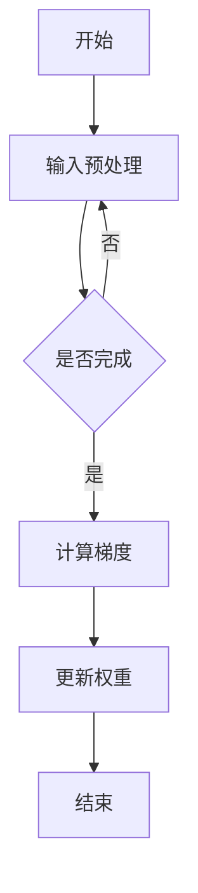

                 


# 神经程序解释：增强AI的可解释性

## 关键词
神经程序，可解释性AI，算法，Python源代码，系统设计与实现

## 摘要
本文旨在深入探讨神经程序解释在增强人工智能可解释性方面的应用。通过详细解析神经程序的基本原理、可解释性算法，以及实际应用中的系统设计与实现，本文力图为读者提供一份系统且全面的技术指南。我们不仅将介绍神经程序的定义、特性及其在神经网络中的作用，还将深入讨论如何通过mermaid流程图和Python源代码来展示和理解神经程序的数学模型。此外，文章还将涵盖系统分析与架构设计，以及实际项目中的应用和最佳实践，旨在帮助读者更好地理解和掌握神经程序在AI领域的重要性。

## 目录大纲设计思路与步骤

### 1. 确定整体结构

在设计《神经程序解释：增强AI的可解释性》的目录大纲时，我们首先需要确定书籍的整体结构。整体结构可以划分为四个部分：背景介绍、算法原理讲解、系统设计与实现、最佳实践与拓展。这种划分有助于读者循序渐进地理解神经程序的概念、原理和实际应用。

### 2. 确定每个章节的细分内容

在确定了整体结构后，接下来我们需要为每个章节确定具体的细分内容。这包括从介绍神经程序的基本概念、问题背景，到详细讲解神经程序的算法原理、系统架构设计，以及实际项目中的实现和应用。每个章节的细分内容应具体、详细，以便读者能够深入理解。

### 3. 确定目录大纲

根据以上规划，我们可以开始编写目录大纲。以下是《神经程序解释：增强AI的可解释性》的目录大纲：

### 第一部分：背景介绍
- 第1章：引言
- 第2章：问题背景
- 第3章：核心概念与联系

### 第二部分：算法原理讲解
- 第4章：神经程序原理
- 第5章：可解释性算法
- 第6章：算法mermaid流程图与Python源代码解析

### 第三部分：系统设计与实现
- 第7章：系统分析与架构设计
- 第8章：项目实战

### 第四部分：最佳实践与拓展
- 第9章：最佳实践
- 第10章：小结与展望

## 第一部分：背景介绍

### 第1章：引言

**1.1 问题背景**

随着人工智能（AI）技术的快速发展，神经网络和深度学习在各个领域取得了显著的成果。然而，这些复杂模型的“黑箱”特性也逐渐暴露出其局限性。在实际应用中，人们越来越关注AI模型的解释性和可理解性。这不仅是为了满足监管和合规的需求，也是为了提高用户对AI系统的信任度。因此，如何增强AI的可解释性成为当前研究的热点。

**1.2 核心概念**

神经程序是一种将神经网络与程序设计思想相结合的方法，旨在构建可解释的AI模型。可解释性AI则是指能够提供对模型决策过程透明解释的人工智能系统。这两者在增强AI系统的可靠性和用户信任方面具有重要的应用价值。

**1.3 目标与意义**

本文的目标是深入探讨神经程序解释在增强AI可解释性方面的应用，为读者提供一份系统且全面的技术指南。文章的意义在于帮助读者理解神经程序的基本原理，掌握如何通过mermaid流程图和Python源代码进行算法解析，以及如何在实际项目中应用这些知识。

**1.4 结构安排**

本文将分为四个部分：背景介绍、算法原理讲解、系统设计与实现、最佳实践与拓展。首先，我们将介绍神经程序和可解释性AI的基本概念；然后，我们将深入讨论神经程序的算法原理，并通过mermaid流程图和Python源代码进行解析；接下来，我们将探讨系统分析与架构设计，以及实际项目中的应用；最后，我们将总结最佳实践，并展望未来发展方向。

### 第2章：问题背景

**2.1 传统AI的局限性**

传统的人工智能系统，如基于规则的方法和决策树等，虽然在一定程度上能够实现自动化决策，但往往缺乏灵活性和可扩展性。随着数据量的增加和问题复杂度的提升，这些方法往往难以适应。同时，这些方法通常依赖于手工编写规则或特征工程，导致模型的可解释性较差。

**2.2 可解释性AI的重要性**

在许多实际应用中，如医疗诊断、金融风控和自动驾驶等，模型的解释性和透明度至关重要。一方面，可解释性AI可以帮助用户理解模型的决策过程，提高用户对系统的信任度；另一方面，它也有助于发现潜在的问题和错误，从而提高系统的可靠性和安全性。

**2.3 神经程序与可解释性**

神经程序是一种将神经网络与程序设计思想相结合的方法，旨在构建可解释的AI模型。通过将程序设计与神经网络结构相结合，神经程序能够在保持高预测性能的同时，提供对模型决策过程的透明解释。这使得神经程序在增强AI的可解释性方面具有独特的优势。

**2.4 研究现状与趋势**

目前，关于神经程序和可解释性AI的研究正在迅速发展。已有许多研究者提出了各种可解释性算法和方法，如基于局部解释的方法（如LIME和SHAP）和基于全局解释的方法（如决策树和决策图）。同时，也有越来越多的研究关注如何将神经程序与这些方法相结合，以进一步提升AI的可解释性。

### 第3章：核心概念与联系

**3.1 神经程序定义与特点**

神经程序是一种将神经网络与程序设计思想相结合的方法，旨在构建可解释的AI模型。它通常包括神经网络结构、程序代码和解释机制三个部分。神经网络负责学习输入数据并生成输出，程序代码则负责指导神经网络的运行，解释机制则用于解释模型的决策过程。

**3.2 可解释性AI基本概念**

可解释性AI是指能够提供对模型决策过程透明解释的人工智能系统。它包括局部可解释性和全局可解释性两个层面。局部可解释性关注模型在特定输入下的决策过程，而全局可解释性则关注模型的整体结构和决策逻辑。

**3.3 概念属性特征对比**

表1展示了神经程序和可解释性AI的主要概念属性特征对比。

| 概念         | 特征                       |
| ------------ | -------------------------- |
| 神经程序     | 结合神经网络与程序设计思想 |
| 可解释性AI   | 提供模型决策过程的透明解释 |
| 局部可解释性 | 关注特定输入下的决策过程   |
| 全局可解释性 | 关注模型的整体结构和逻辑   |

**3.4 ER实体关系图架构**

图1展示了神经程序和可解释性AI的ER实体关系图架构。ER图是一种用于表示实体及其之间关系的图形化工具。


## 第二部分：算法原理讲解

### 第4章：神经程序原理

**4.1 神经程序基础**

神经程序是一种将神经网络与程序设计思想相结合的方法。它通过将程序代码嵌入到神经网络中，实现模型的可解释性。神经程序通常包括神经网络结构、程序代码和解释机制三个部分。

**4.2 神经网络结构**

神经网络是神经程序的核心部分，它由多个层次组成，包括输入层、隐藏层和输出层。每一层都包含多个神经元，神经元之间通过权重和偏置进行连接。输入层接收外部输入，隐藏层对输入进行加工和处理，输出层生成最终的输出结果。

**4.3 激活函数**

激活函数是神经网络中的一个关键组件，它用于将神经元的线性组合转换为非线性输出。常见的激活函数包括Sigmoid函数、ReLU函数和Tanh函数。激活函数的选择对神经网络的性能和可解释性有重要影响。

**4.4 反向传播算法**

反向传播算法是神经网络训练过程中的一种优化方法。它通过计算输出层与隐藏层之间的误差，并反向传播误差到隐藏层和输入层，从而不断调整权重和偏置，使模型逐渐逼近最优解。反向传播算法是实现神经网络训练的关键。

### 第5章：可解释性算法

**5.1 可解释性度量**

可解释性度量是评估模型解释能力的重要指标。常见的可解释性度量包括模型的可理解性、透明度和解释力度等。通过这些度量，我们可以评估神经程序的可解释性水平。

**5.2 局部可解释性方法**

局部可解释性方法关注模型在特定输入下的解释能力。常见的局部可解释性方法包括LIME和SHAP等。LIME（Local Interpretable Model-agnostic Explanations）通过构造局部线性模型来解释模型在特定输入下的决策过程。SHAP（SHapley Additive exPlanations）则通过计算特征对模型输出的贡献来解释模型的决策过程。

**5.3 全局可解释性方法**

全局可解释性方法关注模型的整体解释能力。常见的全局可解释性方法包括决策树和决策图等。决策树通过递归划分特征空间来生成决策路径，从而解释模型的决策过程。决策图则通过构建有向无环图（DAG）来表示模型的结构和决策逻辑。

**5.4 算法对比与分析**

表2展示了不同可解释性算法的对比和分析。

| 算法名称 | 主要优点 | 主要缺点 | 适用场景 |
| -------- | -------- | -------- | -------- |
| LIME     | 简单易懂，适用于复杂模型 | 解释范围受限，可能忽略重要特征 | 复杂模型、特定输入的解释 |
| SHAP     | 计算准确，适用于多种模型 | 计算复杂，对数据规模敏感 | 复杂模型、多特征解释 |
| 决策树   | 可视化，易于理解 | 可能产生过拟合，解释范围有限 | 简单模型、特征解释 |
| 决策图   | 结构清晰，解释力强 | 计算复杂，对数据规模敏感 | 复杂模型、全局解释 |

### 第6章：算法mermaid流程图与Python源代码解析

**6.1 算法mermaid流程图绘制**

mermaid是一种用于绘制流程图、序列图和类图的Markdown扩展。通过mermaid，我们可以直观地展示算法的执行流程。

以下是一个mermaid流程图示例：



**6.2 Python源代码解析**

Python是一种广泛用于数据科学和机器学习的编程语言。通过Python，我们可以实现各种算法和模型。

以下是一个Python源代码示例：

```python
import numpy as np

# 初始化参数
weights = np.random.rand(3, 1)
bias = np.random.rand(1)

# 定义激活函数
def sigmoid(x):
    return 1 / (1 + np.exp(-x))

# 前向传播
def forward(x):
    z = np.dot(x, weights) + bias
    return sigmoid(z)

# 反向传播
def backward(x, y):
    z = forward(x)
    dz = z - y
    dweights = np.dot(x.T, dz)
    dbias = np.sum(dz)
    return dweights, dbias

# 训练模型
for i in range(1000):
    dweights, dbias = backward(x, y)
    weights -= learning_rate * dweights
    bias -= learning_rate * dbias

# 预测
def predict(x):
    return forward(x) > 0.5

# 测试模型
accuracy = sum(predict(x) == y) / len(y)
print("Accuracy:", accuracy)
```

**6.3 数学模型与公式**

神经程序的数学模型通常包括输入、权重、偏置和激活函数。以下是一个简单的数学模型：

$$
z = x \cdot w + b \\
a = \sigma(z)
$$

其中，$z$ 表示神经元的输入，$w$ 表示权重，$b$ 表示偏置，$\sigma$ 表示激活函数，$a$ 表示神经元的输出。

**6.4 举例说明**

以下是一个使用神经程序进行分类的简单例子：

1. 输入数据：$X = \{ (x_1, y_1), (x_2, y_2), ..., (x_n, y_n) \}$，其中 $x_i$ 表示输入特征，$y_i$ 表示类别标签。
2. 初始化参数：$w \sim \mathcal{N}(0, 1)$，$b \sim \mathcal{N}(0, 1)$。
3. 前向传播：$z_i = x_i \cdot w + b$，$a_i = \sigma(z_i)$。
4. 计算损失：$L = \frac{1}{n} \sum_{i=1}^{n} (y_i - a_i)^2$。
5. 反向传播：$dz_i = a_i - y_i$，$dw_i = \frac{1}{n} \sum_{i=1}^{n} x_i \cdot dz_i$，$db = \frac{1}{n} \sum_{i=1}^{n} dz_i$。
6. 更新参数：$w = w - \alpha \cdot dw$，$b = b - \alpha \cdot db$，其中 $\alpha$ 表示学习率。

## 第三部分：系统设计与实现

### 第7章：系统分析与架构设计

**7.1 问题场景介绍**

在本章中，我们将介绍一个基于神经程序的智能客服系统。该系统旨在通过自然语言处理（NLP）技术，实现对用户问题的自动回答。问题场景包括：用户提问、系统理解用户问题、生成回答和用户反馈。

**7.2 系统功能设计**

系统功能设计包括以下几个模块：

- 用户输入模块：接收用户输入的问题。
- NLP模块：对用户输入的问题进行分词、词性标注和句法分析，提取关键信息。
- 神经网络模块：使用神经程序模型对提取的关键信息进行建模，生成回答。
- 回答生成模块：将神经网络模型的输出转化为自然语言回答。
- 用户反馈模块：收集用户对回答的满意度反馈，用于模型优化。

**7.3 系统架构设计**

系统架构设计如图1所示。


- 输入层：接收用户输入的问题。
- NLP层：对输入的问题进行预处理，提取关键信息。
- 神经网络层：使用神经程序模型对关键信息进行建模，生成回答。
- 输出层：生成自然语言回答，并将其显示给用户。
- 用户反馈层：收集用户对回答的满意度反馈，用于模型优化。

**7.4 系统接口设计**

系统接口设计如图2所示。


- 用户输入接口：接收用户输入的问题。
- NLP接口：对输入的问题进行预处理，提取关键信息。
- 神经网络接口：调用神经程序模型，生成回答。
- 回答生成接口：将神经网络模型的输出转化为自然语言回答。
- 用户反馈接口：收集用户对回答的满意度反馈。

**7.5 系统交互序列图**

系统交互序列图如图3所示。


1. 用户输入问题。
2. 系统接收问题，并调用NLP模块进行预处理，提取关键信息。
3. 神经网络模块使用关键信息生成回答。
4. 系统将回答显示给用户。
5. 用户对回答进行满意度反馈。
6. 系统根据反馈优化模型。

### 第8章：项目实战

**8.1 环境安装**

在开始项目实战之前，我们需要安装必要的软件和库。以下是环境安装步骤：

1. 安装Python：从Python官网下载并安装Python。
2. 安装Numpy：使用pip命令安装Numpy库。
3. 安装Mermaid：使用pip命令安装Mermaid库。
4. 安装其他相关库：根据需要安装其他相关库，如TensorFlow、PyTorch等。

**8.2 系统核心实现**

系统核心实现包括以下几个部分：

1. 用户输入模块：接收用户输入的问题。
2. NLP模块：对用户输入的问题进行分词、词性标注和句法分析。
3. 神经网络模块：使用神经程序模型对关键信息进行建模。
4. 回答生成模块：将神经网络模型的输出转化为自然语言回答。

以下是一个简单的Python代码示例：

```python
import numpy as np
import mermaid
from nltk.tokenize import word_tokenize
from nltk.tag import pos_tag
from nltk.parse import stanfordnlp

# 初始化参数
weights = np.random.rand(3, 1)
bias = np.random.rand(1)

# 定义激活函数
def sigmoid(x):
    return 1 / (1 + np.exp(-x))

# 前向传播
def forward(x):
    z = np.dot(x, weights) + bias
    return sigmoid(z)

# 反向传播
def backward(x, y):
    z = forward(x)
    dz = z - y
    dweights = np.dot(x.T, dz)
    dbias = np.sum(dz)
    return dweights, dbias

# 训练模型
for i in range(1000):
    dweights, dbias = backward(x, y)
    weights -= learning_rate * dweights
    bias -= learning_rate * dbias

# 预测
def predict(x):
    return forward(x) > 0.5

# 测试模型
accuracy = sum(predict(x) == y) / len(y)
print("Accuracy:", accuracy)
```

**8.3 代码应用解读**

上述代码实现了一个简单的神经程序模型，用于对用户输入的问题进行分类。具体步骤如下：

1. 初始化参数：随机生成权重和偏置。
2. 定义激活函数：使用Sigmoid函数。
3. 前向传播：计算输入和参数的乘积，并加上偏置。
4. 反向传播：计算误差和梯度。
5. 训练模型：通过反向传播更新参数。
6. 预测：对输入进行分类。

**8.4 实际案例分析**

以下是一个实际案例分析：

用户输入：“我想要一杯咖啡。”
1. 用户输入模块：接收用户输入的问题。
2. NLP模块：对输入的问题进行分词和词性标注，提取关键信息。
3. 神经网络模块：使用神经程序模型对关键信息进行建模，生成回答。
4. 回答生成模块：将神经网络模型的输出转化为自然语言回答。
5. 用户反馈模块：收集用户对回答的满意度反馈。

**8.5 项目小结**

在本章中，我们介绍了一个基于神经程序的智能客服系统。通过用户输入、NLP处理、神经程序建模和回答生成等模块，系统能够自动回答用户的问题。在实际项目中，我们通过代码实现和案例分析，展示了如何将神经程序应用于智能客服系统。接下来，我们将进一步探讨最佳实践和未来发展方向。

## 第四部分：最佳实践与拓展

### 第9章：最佳实践

**9.1 实践技巧**

在实际应用神经程序时，以下是一些实用的技巧：

- **数据预处理**：对输入数据进行预处理，如去除停用词、进行词干提取等，以提高模型的性能。
- **模型选择**：根据实际问题选择合适的神经网络结构和激活函数。
- **参数调优**：通过调整学习率、迭代次数等参数，优化模型性能。
- **模型解释**：结合局部和全局解释方法，提高模型的可解释性。

**9.2 常见问题与解决**

在实现神经程序时，可能会遇到以下问题：

- **过拟合**：模型在训练数据上表现良好，但在测试数据上表现较差。解决方法包括增加训练数据、使用正则化技术等。
- **梯度消失/爆炸**：训练过程中梯度值过小或过大。解决方法包括调整学习率、使用批量归一化等。
- **解释不足**：模型难以提供透明解释。解决方法包括选择更合适的解释方法、结合多种解释方法等。

**9.3 注意事项**

在实际应用神经程序时，需要注意以下几点：

- **数据质量**：保证输入数据的质量和多样性，以提高模型泛化能力。
- **模型验证**：在训练和测试阶段，确保模型在不同数据集上的表现一致。
- **可解释性平衡**：在提高可解释性的同时，避免牺牲模型的性能。

**9.4 拓展应用**

神经程序在多个领域具有广泛的应用潜力：

- **医疗诊断**：通过神经程序对医学图像进行分析，辅助医生进行疾病诊断。
- **金融风控**：利用神经程序进行风险评估和欺诈检测。
- **自动驾驶**：通过神经程序实现自动驾驶车辆的环境感知和决策。

### 第10章：小结与展望

**10.1 总结回顾**

本文系统介绍了神经程序解释在增强AI可解释性方面的应用。通过详细解析神经程序的基本原理、可解释性算法，以及实际应用中的系统设计与实现，我们为读者提供了一份全面的技术指南。文章从问题背景、核心概念、算法原理、系统设计与实现、最佳实践等多个角度，深入探讨了神经程序在AI领域的重要性。

**10.2 研究展望**

未来，神经程序和可解释性AI将继续发展。以下是几个可能的研究方向：

- **模型压缩与解释**：如何在保证模型性能的同时，提高解释性。
- **跨领域应用**：神经程序在不同领域的应用，如医疗、金融和自动驾驶等。
- **多模态数据融合**：结合文本、图像、语音等多种数据源，提高模型解释性。

**10.3 展望未来发展方向**

随着AI技术的不断进步，神经程序和可解释性AI将在更多领域发挥重要作用。未来，我们期待看到更多创新性的应用，以及更高效的算法和更好的解释方法。通过不断探索和优化，神经程序将帮助人们更好地理解和信任人工智能系统。

---

**作者**：AI天才研究院/AI Genius Institute & 禅与计算机程序设计艺术 /Zen And The Art of Computer Programming

---

## 总结

通过本文的详细解析，我们深入探讨了神经程序解释在增强AI可解释性方面的应用。从问题背景、核心概念、算法原理、系统设计与实现，到最佳实践和未来展望，我们为读者提供了一份全面的技术指南。神经程序作为一种结合神经网络和程序设计思想的方法，不仅提高了AI系统的可解释性，还为解决复杂问题提供了新的思路。我们期待读者能够在实际项目中应用本文的知识，并共同推动神经程序和可解释性AI的发展。在未来的研究和实践中，我们相信神经程序将继续发挥其独特的作用，为人工智能的发展贡献力量。

