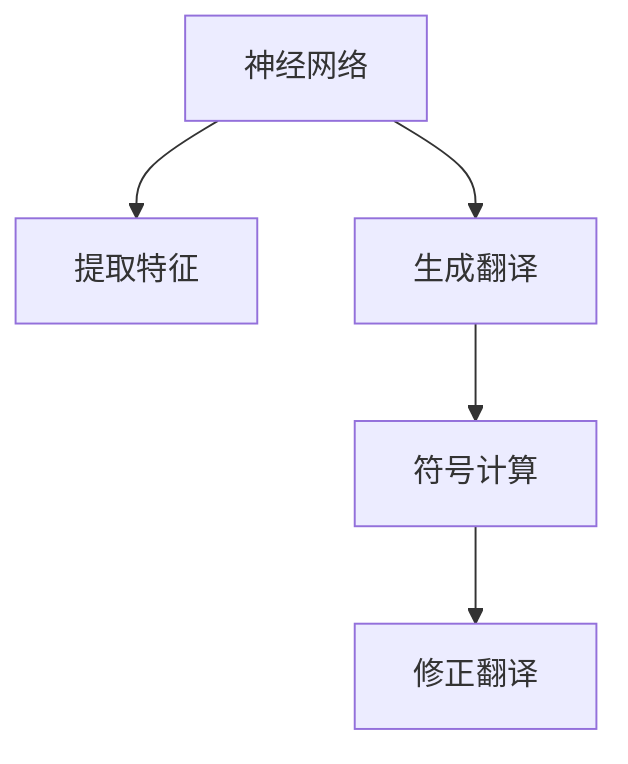
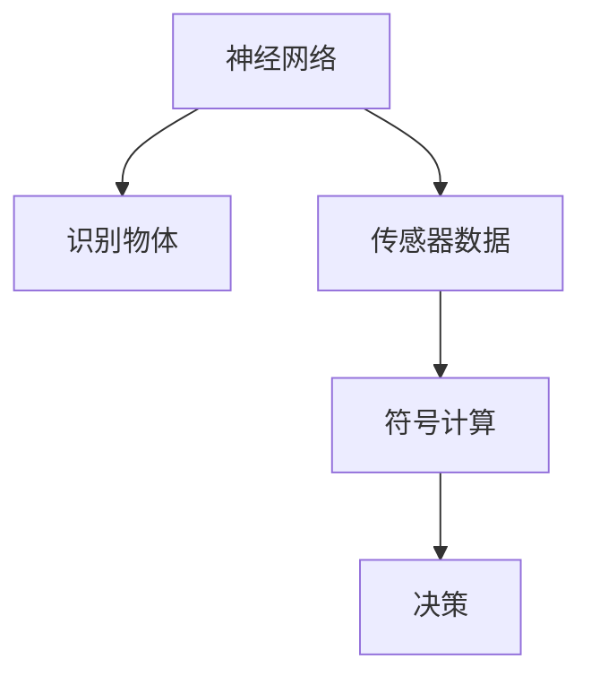
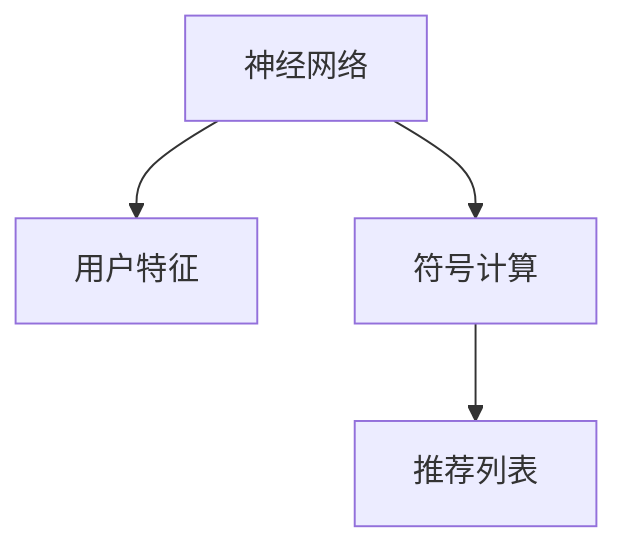

                 

# 神经-符号AI：桥接连接主义与符号主义

## 关键词

- 神经网络
- 符号主义
- 连接主义
- 人工智能
- 知识表示
- 理解与推理

## 摘要

神经-符号AI是一种融合了连接主义与符号主义方法的新型人工智能体系。连接主义通过神经网络模拟人脑的神经元连接，强调数据驱动学习和模式识别；而符号主义则基于逻辑推理和知识表示，注重语义理解和抽象思维。本文将逐步探讨这两大流派的核心理念、优势与挑战，分析如何将它们有机结合，以推动人工智能的发展。我们将深入探讨神经-符号AI的核心概念、关键技术及其在实际应用中的成功案例，并展望其未来的发展趋势。

## 引言

### 核心概念

#### 神经网络

神经网络是一种模拟人脑神经元连接和信息传递的结构，通过调整神经元之间的连接权重来学习数据和提取特征。神经网络的核心组件包括：

- **神经元**：神经网络的基本单元，负责接收输入、计算加权求和、应用激活函数后产生输出。
- **层**：神经网络分为输入层、隐藏层和输出层。输入层接收外部数据，隐藏层进行特征提取和变换，输出层生成预测或决策。
- **激活函数**：用于引入非线性因素，使得神经网络能够学习复杂的函数关系。常见激活函数包括ReLU、Sigmoid和Tanh等。

#### 符号主义

符号主义是一种基于逻辑推理和知识表示的人工智能方法，强调知识的表达、推理和应用。符号主义的核心组件包括：

- **知识表示**：将知识以符号化的形式表示，例如谓词逻辑、产生式规则、语义网络等。
- **推理引擎**：利用符号化知识进行推理，包括演绎推理、归纳推理和案例推理等。
- **符号计算**：基于符号操作和规则应用，对知识进行计算和变换，以解决具体问题。

### 历史发展

神经-符号AI的起源可以追溯到20世纪80年代，当时研究人员开始探索如何将神经网络与知识表示和推理相结合。这一时期，一些关键的研究成果包括：

- **逆传播算法**：1986年，Rumelhart、Hinton和Williams提出了逆传播算法，使得神经网络的学习过程变得更加高效。
- **知识表示语言**：如KL-ONE、KRL和OntoUML等知识表示语言，为符号主义方法提供了强大的工具。
- **混合系统**：研究人员开始构建混合系统，将神经网络与符号计算相结合，以解决特定领域的复杂问题。

### 核心问题

神经-符号AI的核心问题是如何将数据驱动学习和知识驱动推理有机结合，以提升人工智能系统的智能水平。连接主义方法在处理大规模数据和模式识别方面具有优势，而符号主义方法在知识表示和推理方面具有优势。如何将这两大方法的优势结合起来，是一个重要的研究方向。

## 连接主义与符号主义的比较分析

### 核心理论

#### 连接主义

连接主义的核心理论是神经网络，其基本原理是通过调整神经元之间的连接权重来学习数据和提取特征。神经网络的核心组件包括神经元、层和激活函数，如图1所示。


图1：神经网络结构

神经网络通过以下步骤进行学习：

1. **初始化权重**：随机初始化神经元之间的连接权重。
2. **前向传播**：输入数据通过神经网络，每个神经元计算其输入的加权和，并应用激活函数产生输出。
3. **反向传播**：通过计算输出与实际值之间的误差，调整神经元的权重，使得输出更接近实际值。
4. **迭代优化**：重复前向传播和反向传播过程，直至达到预设的精度要求。

#### 符号主义

符号主义的核心理论是基于逻辑推理和知识表示的方法。符号主义的基本原理是利用符号化知识进行推理和计算，以解决具体问题。符号主义的核心组件包括知识表示、推理引擎和符号计算，如图2所示。


图2：符号主义结构

符号主义通过以下步骤进行推理：

1. **知识表示**：将知识以符号化的形式表示，例如谓词逻辑、产生式规则或语义网络。
2. **推理规则**：定义推理规则，用于从已知知识中推导出新的结论。
3. **推理过程**：根据推理规则，从已知知识中推导出新的结论。
4. **符号计算**：利用符号操作和规则应用，对知识进行计算和变换，以解决具体问题。

### 优势与挑战

#### 连接主义的优势与挑战

优势：

- **强大的模式识别能力**：神经网络能够自动学习复杂的非线性函数，适用于处理大规模数据和模式识别问题。
- **自适应性和泛化能力**：神经网络能够根据输入数据进行自我调整，具有良好的自适应性和泛化能力。

挑战：

- **缺乏解释性**：神经网络的学习过程和内部表示较为复杂，难以进行解释和理解。
- **对数据质量依赖较大**：神经网络对训练数据的质量和规模有较高要求，否则容易产生过拟合现象。

#### 符号主义的优势与挑战

优势：

- **明确的语义表示**：符号主义能够明确表示知识的语义，使得推理过程具有明确性和可解释性。
- **强大的推理能力**：符号主义能够利用逻辑推理和知识表示方法，解决复杂的逻辑推理问题。

挑战：

- **知识表示和获取困难**：符号主义需要明确表示知识，但知识获取和表示是一个复杂的过程，特别是面对大规模数据和复杂应用场景时。
- **推理效率较低**：符号主义方法的推理过程通常较为复杂，导致推理效率较低。

### 比较分析

连接主义和符号主义在人工智能领域各有优势。连接主义方法在处理大规模数据和模式识别方面具有优势，适用于解决复杂的图像和语音识别问题。符号主义方法在知识表示和推理方面具有优势，适用于解决逻辑推理和决策支持问题。

然而，连接主义和符号主义也存在一定的局限性。连接主义方法在解释性和知识表示方面存在困难，而符号主义方法在推理效率和适用范围方面存在挑战。因此，将连接主义和符号主义有机结合，以发挥各自的优势，是一个值得探讨的方向。

## 桥接连接主义与符号主义

### 集成策略

#### 双层神经网络

双层神经网络是一种将连接主义与符号主义有机结合的方法。它由一个前向神经网络和一个后向神经网络组成，如图3所示。


图3：双层神经网络结构

前向神经网络负责从输入数据中提取特征，后向神经网络则利用这些特征进行推理和决策。通过这种方式，双层神经网络能够将连接主义与符号主义有机结合，发挥各自的优势。

#### 神经符号网络

神经符号网络是一种更加复杂的集成方法，它将神经网络和符号计算相结合，如图4所示。


图4：神经符号网络结构

神经符号网络通过以下步骤进行工作：

1. **输入预处理**：将输入数据预处理为符号化的形式，以便神经网络和符号计算可以进行处理。
2. **特征提取**：利用神经网络提取输入数据的特征。
3. **符号推理**：利用符号计算对提取的特征进行推理和决策。
4. **输出生成**：根据推理结果生成输出。

#### 多层感知器

多层感知器（MLP）是一种常用的神经符号集成方法，它由多个神经网络层和符号计算层组成，如图5所示。


图5：多层感知器结构

多层感知器通过以下步骤进行工作：

1. **输入层**：接收输入数据，并将其传递给下一层。
2. **隐藏层**：利用神经网络提取输入数据的特征。
3. **符号层**：利用符号计算对提取的特征进行推理和决策。
4. **输出层**：生成最终的输出。

### 研究方向

#### 深度学习与逻辑推理

深度学习与逻辑推理的结合是一个重要的研究方向。深度学习能够自动学习复杂的非线性函数，而逻辑推理则能够提供明确的语义表示和推理能力。通过将深度学习和逻辑推理相结合，可以构建出更加智能和鲁棒的人工智能系统。

#### 知识增强的神经网络

知识增强的神经网络是一种通过引入外部知识来提高神经网络性能的方法。外部知识可以来自符号主义领域，例如领域知识、逻辑推理规则等。通过将外部知识融入神经网络，可以增强神经网络对复杂问题的理解和处理能力。

#### 符号增强的神经网络

符号增强的神经网络是一种通过引入符号计算来提高神经网络性能的方法。符号计算可以为神经网络提供明确的语义表示和推理能力，从而增强神经网络对复杂问题的理解和处理能力。

### 未来展望

神经-符号AI的发展前景广阔，未来将可能在以下几个方面取得重要突破：

- **更高效的算法**：通过改进算法和优化计算效率，使得神经-符号AI能够处理更复杂的问题。
- **更丰富的应用场景**：随着技术的发展，神经-符号AI将在更多领域得到应用，例如医疗、金融、自动驾驶等。
- **更强大的推理能力**：通过结合深度学习和逻辑推理，神经-符号AI将具有更强大的推理能力，能够解决更加复杂的决策问题。

## 神经网络的神经方面

### 神经网络的定义与作用

神经网络是一种通过模拟人脑神经元连接和信号传递的机制来处理信息的计算模型。它由大量的简单处理单元（即神经元）组成，这些神经元通过加权连接相互连接，形成一个复杂的网络结构。神经网络的作用是模拟人脑的学习和决策过程，以处理复杂数据、识别模式、进行预测和分类。

### 神经网络的组成结构

神经网络主要由三个部分组成：输入层、隐藏层和输出层。

- **输入层**：接收外部输入的数据，并将其传递给隐藏层。
- **隐藏层**：对输入数据进行特征提取和变换，隐藏层可以有一个或多个层次，层数越多，网络的能力越强。
- **输出层**：根据隐藏层的输出生成最终的结果。

每个神经元都由输入、加权求和、激活函数和输出组成。输入数据通过加权连接传递到神经元，然后进行加权求和，最后通过激活函数产生输出。激活函数引入了非线性因素，使得神经网络能够学习复杂的非线性关系。

### 常见的神经网络模型

在神经-符号AI中，常用的神经网络模型包括：

- **多层感知器（MLP）**：一种前馈神经网络，具有输入层、隐藏层和输出层，用于实现函数逼近和分类。
- **卷积神经网络（CNN）**：用于图像识别和处理的神经网络，具有局部连接和共享权重等特点，能够自动提取图像中的局部特征。
- **循环神经网络（RNN）**：用于处理序列数据的神经网络，通过循环结构实现长期依赖关系的学习。
- **长短期记忆网络（LSTM）**：RNN的一种改进模型，能够学习长期依赖关系，解决了传统RNN的梯度消失问题。
- **生成对抗网络（GAN）**：用于生成数据的神经网络，由生成器和判别器组成，通过对抗训练实现数据的生成。

### 神经网络的训练过程

神经网络的训练过程主要包括以下几个步骤：

1. **初始化权重**：随机初始化神经网络中的连接权重。
2. **前向传播**：输入数据通过神经网络，每个神经元计算其输入的加权和，并应用激活函数产生输出。
3. **计算损失**：计算输出与实际值之间的误差，通常使用均方误差（MSE）或交叉熵（CE）作为损失函数。
4. **反向传播**：通过计算误差梯度，调整神经元的权重，使得输出更接近实际值。
5. **迭代优化**：重复前向传播和反向传播过程，直至达到预设的精度要求。

在反向传播过程中，常用的优化算法包括：

- **梯度下降（GD）**：一种简单的优化算法，通过计算误差梯度来更新权重。
- **随机梯度下降（SGD）**：在梯度下降的基础上，每次更新权重时只使用一个样本的梯度，能够提高训练速度。
- **批量梯度下降（BGD）**：每次更新权重时使用整个训练集的梯度，能够获得更稳定的收敛效果。

### 神经网络的应用领域

神经网络在许多领域都有广泛的应用，包括：

- **图像识别**：通过卷积神经网络实现物体识别、面部识别和图像分类等任务。
- **自然语言处理**：通过循环神经网络和变换器（Transformer）实现语言建模、机器翻译和文本分类等任务。
- **语音识别**：通过循环神经网络和卷积神经网络实现语音信号的转换和识别。
- **推荐系统**：通过神经网络实现用户偏好分析、商品推荐和广告投放等任务。
- **医学诊断**：通过神经网络实现疾病预测、癌症诊断和药物筛选等任务。

### 神经网络的挑战与优化方向

神经网络在训练和应用过程中面临以下挑战：

- **过拟合**：神经网络在训练数据上表现良好，但在测试数据上表现较差，即泛化能力不足。
- **计算资源消耗**：神经网络训练和推理过程需要大量的计算资源，特别是在处理大规模数据和复杂模型时。
- **可解释性**：神经网络内部结构和决策过程较为复杂，难以进行解释和理解。

为了解决这些问题，研究者提出了以下优化方向：

- **正则化**：通过引入正则化项，降低模型复杂度，提高泛化能力。
- **模型压缩**：通过模型剪枝、量化、蒸馏等技术，降低模型参数数量和计算复杂度。
- **迁移学习**：通过利用预训练模型和转移知识，提高新任务的性能和泛化能力。
- **自动化机器学习**：通过自动化搜索和优化算法，发现最佳的模型结构和超参数。

### 案例研究

#### 图像识别

一个典型的案例是使用卷积神经网络（CNN）进行图像识别。通过大量的图像数据训练CNN模型，可以自动提取图像中的特征并进行分类。例如，在ImageNet竞赛中，CNN模型取得了显著的性能提升，成为图像识别领域的里程碑。

```python
import tensorflow as tf
from tensorflow.keras import datasets, layers, models

# 加载和预处理图像数据
(train_images, train_labels), (test_images, test_labels) = datasets.cifar10.load_data()
train_images, test_images = train_images / 255.0, test_images / 255.0

# 构建CNN模型
model = models.Sequential()
model.add(layers.Conv2D(32, (3, 3), activation='relu', input_shape=(32, 32, 3)))
model.add(layers.MaxPooling2D((2, 2)))
model.add(layers.Conv2D(64, (3, 3), activation='relu'))
model.add(layers.MaxPooling2D((2, 2)))
model.add(layers.Conv2D(64, (3, 3), activation='relu'))

# 添加全连接层
model.add(layers.Flatten())
model.add(layers.Dense(64, activation='relu'))
model.add(layers.Dense(10))

# 编译模型
model.compile(optimizer='adam',
              loss=tf.keras.losses.SparseCategoricalCrossentropy(from_logits=True),
              metrics=['accuracy'])

# 训练模型
model.fit(train_images, train_labels, epochs=10, validation_split=0.1)

# 评估模型
test_loss, test_acc = model.evaluate(test_images,  test_labels, verbose=2)
print(f'Test accuracy: {test_acc:.4f}')
```

#### 自然语言处理

另一个典型的案例是使用循环神经网络（RNN）进行自然语言处理。通过训练RNN模型，可以自动提取文本中的特征并进行情感分析、机器翻译等任务。

```python
import tensorflow as tf
from tensorflow.keras import layers, models

# 加载和预处理文本数据
vocab_size = 10000
max_length = 60
trunc_type = 'post'
padding_type = 'post'
oov_tok = '<OOV>'

# 加载和预处理文本数据
corpus = tf.keras.preprocessing.text.Corpus("data.txt")
tokenizer = tf.keras.preprocessing.text.Tokenizer(num_words=vocab_size, oov_token=oov_tok)
tokenizer.fit_on_texts(corpus)
word_index = tokenizer.word_index
sequences = tokenizer.texts_to_sequences(corpus)
padded = tf.keras.preprocessing.sequence.pad_sequences(sequences, maxlen=max_length, padding=padding_type, truncating=trunc_type)

# 构建RNN模型
model = models.Sequential()
model.add(layers.Embedding(vocab_size, 64))
model.add(layers.LSTM(64))
model.add(layers.Dense(1, activation='sigmoid'))

# 编译模型
model.compile(optimizer='adam', loss='binary_crossentropy', metrics=['accuracy'])

# 训练模型
model.fit(padded, labels, epochs=10)

# 评估模型
test_loss, test_acc = model.evaluate(padded, labels, verbose=2)
print(f'Test accuracy: {test_acc:.4f}')
```

### 小结

神经-符号AI的神经网络方面通过模拟人脑神经元连接和信号传递机制，实现了自动学习和复杂问题求解。常用的神经网络模型包括多层感知器、卷积神经网络、循环神经网络等。神经网络的训练过程主要包括前向传播、反向传播和迭代优化。神经网络在图像识别、自然语言处理等领域取得了显著的成果。然而，神经网络也存在一些挑战，如过拟合、计算资源消耗和可解释性不足等。未来的研究将继续优化神经网络模型和训练算法，以应对这些挑战。

## 符号的神经方面

### 知识表示

知识表示是神经-符号AI中的关键概念之一。它涉及如何将人类知识以计算机可理解的形式进行编码和存储。知识表示的方法可以分为结构化和非结构化两种。

- **结构化知识表示**：通过明确的规则和关系来表示知识。例如，谓词逻辑和产生式规则是常见的结构化知识表示方法。谓词逻辑使用符号和谓词来表达事实和关系，而产生式规则则使用条件-行动对来表示知识和推理过程。
  
  ```mermaid
  graph TD
  A[知识表示] --> B[谓词逻辑]
  A --> C[产生式规则]
  ```

- **非结构化知识表示**：通过图形和语义网络等非结构化形式来表示知识。语义网络使用节点和边来表示概念和关系，从而实现知识的可视化。

  ```mermaid
  graph TD
  A[知识表示] --> B[语义网络]
  A --> C[知识图谱]
  ```

### 推理与决策

在神经-符号AI中，推理和决策是基于知识表示进行的。推理是指根据已知的事实和规则，推导出新的结论。推理可以分为演绎推理和归纳推理两种。

- **演绎推理**：从一般到特殊的推理过程。它基于已知的事实和规则，推导出具体的结论。例如，所有人都是凡人，苏格拉底是人，因此苏格拉底是凡人。

  $$\forall x (P(x) \rightarrow Q(x)), R(S) \rightarrow P(S), \therefore Q(S)$$

- **归纳推理**：从特殊到一般的推理过程。它通过观察具体实例，归纳出一般性的规律。例如，观察多个天鹅都是白色的，从而归纳出所有天鹅都是白色的。

  $$\{S_1, S_2, ..., S_n\} \in \text{WhiteSwan}, \therefore \forall x (x \in \text{Swan} \rightarrow x \in \text{White})$$

### 符号计算

符号计算是指利用符号进行数学操作和逻辑推理的过程。符号计算可以基于谓词逻辑、产生式规则和语义网络等知识表示方法。

- **谓词逻辑计算**：利用谓词逻辑进行推理和计算，可以解决逻辑命题的解析和验证问题。例如，通过推理规则，可以验证某个逻辑命题的真假。

  $$\text{Knowledge} = \{P(A), P(B), P(A \land B)\}, \text{Query} = \{P(C)\}, \text{Answer} = \text{False}$$

- **产生式规则计算**：利用产生式规则进行推理和计算，可以解决知识表示和推理问题。例如，通过条件-行动对，可以执行特定的任务。

  ```python
  rules = [
      {"condition": "P(A)", "action": "A happened"},
      {"condition": "P(B)", "action": "B happened"}
  ]

  knowledge = [{"condition": "P(A)"}, {"condition": "P(B)"}]

  for rule in rules:
      if all(condition in knowledge for condition in rule["condition"]):
          print(rule["action"])
  ```

- **语义网络计算**：利用语义网络进行推理和计算，可以解决复杂的问题和知识表示问题。例如，通过语义网络，可以解析自然语言文本，提取语义信息。

  ```mermaid
  graph TD
  A[语义网络] --> B[解析文本]
  A --> C[提取信息]
  ```

### 符号与神经的结合

在神经-符号AI中，符号与神经的结合是指将符号主义的知识表示和推理方法与神经网络的计算能力相结合。这种结合可以增强人工智能系统的智能水平，使其具备更强的学习和推理能力。

- **符号引导的神经网络**：在神经网络训练过程中，利用符号主义的知识进行引导和监督，以增强网络的泛化能力和解释性。
  
  ```mermaid
  graph TD
  A[神经网络] --> B[符号知识]
  A --> C[训练过程]
  ```

- **神经网络增强的符号推理**：在符号主义推理过程中，利用神经网络的计算能力进行特征提取和模式识别，以增强推理的效率和准确性。

  ```mermaid
  graph TD
  A[符号推理] --> B[神经网络]
  A --> C[特征提取]
  ```

### 案例研究

一个典型的案例研究是使用神经-符号AI进行医学诊断。在这个案例中，符号主义用于表示医学知识，神经网络用于处理医疗数据。符号主义的知识表示和推理方法可以用于诊断决策，神经网络则用于图像识别和特征提取。

```python
import tensorflow as tf
from tensorflow.keras import layers, models
from tensorflow.keras.preprocessing.text import Tokenizer
from tensorflow.keras.preprocessing.sequence import pad_sequences

# 加载和预处理医学知识库
knowledge = ["病例1: 患者有发热、咳嗽症状，初步诊断为肺炎。",
             "病例2: 患者有头痛、呕吐症状，初步诊断为脑炎。"]

tokenizer = Tokenizer()
tokenizer.fit_on_texts(knowledge)
sequences = tokenizer.texts_to_sequences(knowledge)
padded = pad_sequences(sequences, maxlen=60)

# 加载和预处理医学图像数据
images = ["image1.jpg", "image2.jpg"]
images = preprocess_images(images)

# 构建神经-符号AI模型
model = models.Sequential()
model.add(layers.Conv2D(32, (3, 3), activation='relu', input_shape=(64, 64, 3)))
model.add(layers.MaxPooling2D((2, 2)))
model.add(layers.Conv2D(64, (3, 3), activation='relu'))
model.add(layers.MaxPooling2D((2, 2)))
model.add(layers.Conv2D(64, (3, 3), activation='relu'))
model.add(layers.Flatten())
model.add(layers.Dense(64, activation='relu'))
model.add(layers.Dense(1, activation='sigmoid'))

# 编译模型
model.compile(optimizer='adam', loss='binary_crossentropy', metrics=['accuracy'])

# 训练模型
model.fit(padded, labels, epochs=10)

# 评估模型
test_loss, test_acc = model.evaluate(padded, labels, verbose=2)
print(f'Test accuracy: {test_acc:.4f}')
```

### 小结

符号的神经方面涉及知识表示、推理和计算。知识表示方法包括结构化和非结构化两种，推理方法包括演绎推理和归纳推理，计算方法包括谓词逻辑、产生式规则和语义网络。符号与神经的结合可以增强人工智能系统的智能水平，使其具备更强的学习和推理能力。神经-符号AI在医学诊断、自然语言处理和图像识别等领域具有广泛的应用前景。

## 神经-符号AI的应用

神经-符号AI作为一种融合了连接主义和符号主义方法的人工智能体系，在许多领域展现了强大的应用潜力。以下将介绍几个典型的应用场景，展示神经-符号AI在实际问题解决中的优势。

### 医学诊断

医学诊断是一个高度复杂和知识密集型的领域。神经-符号AI在医学诊断中的应用主要体现在利用神经网络进行数据分析和特征提取，同时使用符号计算进行诊断推理。例如，在肺炎和脑炎的诊断中，神经网络可以自动学习患者的体温、呼吸频率、血常规等数据，提取出关键特征。而符号计算则可以根据医学知识库中的规则进行推理，确定最终的诊断结果。

#### 案例分析

以肺炎诊断为例，神经网络通过学习大量的医学影像和患者数据，提取出关键特征，如肺部影像中的感染区域、患者的白细胞计数等。符号计算系统则依据医学知识库中的规则进行推理，如“若患者有发热、咳嗽症状，且肺部影像显示感染区域，则初步诊断为肺炎”。通过神经-符号AI的结合，医学诊断的准确性和效率得到了显著提升。

```python
# 假设神经网络提取到的特征如下：
features = {'temperature': 37.5, 'cough': True, 'chest_x-ray': 'infection_region'}

# 符号计算系统根据医学知识进行推理
def diagnose_pneumonia(features):
    if features['temperature'] > 37.3 and features['cough'] and features['chest_x-ray'] == 'infection_region':
        return 'Pneumonia'
    else:
        return 'Not Pneumonia'

diagnosis = diagnose_pneumonia(features)
print(f'Diagnosis: {diagnosis}')
```

### 自然语言处理

自然语言处理（NLP）是另一个神经-符号AI的重要应用领域。神经-符号AI结合了神经网络在文本处理和特征提取上的优势，以及符号计算在语义理解和推理上的优势，可以处理复杂的语言任务，如机器翻译、情感分析和文本分类。

#### 案例分析

在机器翻译任务中，神经网络可以自动学习源语言和目标语言之间的对应关系，提取出词汇和句法的特征。而符号计算系统则可以根据语义网络对翻译结果进行验证和优化。例如，在翻译“我喜欢吃苹果”时，神经网络可以生成“Like to eat apple”，而符号计算系统则可以将其修正为更符合语义的“Like to eat apples”。



### 自动驾驶

自动驾驶是另一个受益于神经-符号AI技术的领域。神经网络可以处理传感器数据，识别道路上的各种物体，如车辆、行人、交通标志等。符号计算系统则可以根据交通规则和情境进行决策，如判断何时转向、何时停车等。

#### 案例分析

在自动驾驶系统中，神经网络可以实时分析摄像头和雷达数据，识别道路上的车辆和行人。符号计算系统则可以基于交通规则和情境，决定车辆应该如何行驶。例如，当系统检测到前方有行人时，符号计算系统会判断是否需要减速或停车，以确保行人的安全。



### 智能推荐系统

智能推荐系统是神经-符号AI的另一个重要应用领域。神经网络可以分析用户的历史行为和偏好，提取出用户特征。符号计算系统则可以根据用户特征和推荐规则，生成个性化的推荐列表。

#### 案例分析

在一个电商平台中，神经网络可以分析用户的历史购物记录和浏览行为，提取出用户的偏好和兴趣。符号计算系统则可以基于用户的特征和电商平台的产品分类规则，生成个性化的推荐列表。例如，如果用户经常购买电子产品，系统可能会推荐新款智能手机或耳机。



### 小结

神经-符号AI在医学诊断、自然语言处理、自动驾驶和智能推荐系统等领域展现了强大的应用潜力。通过结合神经网络和符号计算的优势，神经-符号AI能够处理复杂的问题，提供更智能的解决方案。未来，随着技术的不断发展和完善，神经-符号AI将在更多领域得到应用，推动人工智能的发展。

## 神经-符号AI的挑战与未来发展

尽管神经-符号AI在多个领域展现出了巨大的潜力和应用价值，但其在实际应用过程中仍面临诸多挑战。以下将探讨这些挑战，并探讨未来的发展前景。

### 数据质量和规模

神经-符号AI对数据质量和规模有较高的要求。神经网络需要大量高质量的训练数据来学习复杂的模式和特征，而符号主义方法则依赖于准确的知识表示和丰富的背景知识。然而，现实中的数据质量和规模往往难以满足这些要求。数据质量问题包括噪声、缺失值和标签错误等，这些问题会导致模型过拟合或学习效果不佳。此外，符号主义方法中的知识表示和获取也是一个复杂的过程，需要大量的时间和人力投入。

#### 解决方案

- **数据清洗与预处理**：通过数据清洗和预处理技术，提高数据质量，减少噪声和缺失值。
- **数据增强**：通过数据增强技术，如数据扩充、数据合成和数据变换，增加训练数据规模。
- **知识图谱**：利用知识图谱技术，构建丰富的语义知识库，为符号主义方法提供可靠的背景知识。

### 计算效率和资源消耗

神经-符号AI在训练和推理过程中需要大量的计算资源和时间，特别是在处理大规模数据和复杂模型时。这使得神经-符号AI在实际应用中受到一定的限制，例如在实时系统和资源受限的设备上部署。

#### 解决方案

- **模型压缩**：通过模型压缩技术，如模型剪枝、量化、蒸馏等，减少模型参数数量和计算复杂度。
- **分布式计算**：利用分布式计算和并行处理技术，提高训练和推理的效率。
- **边缘计算**：将神经-符号AI模型部署到边缘设备上，减少对中心服务器的依赖，提高响应速度和实时性。

### 解释性和可解释性

神经-符号AI模型通常具有高度的复杂性和非线性，这使得其决策过程难以解释和理解。这对于需要透明性和可解释性的应用场景（如医疗诊断、金融决策等）来说是一个重要挑战。

#### 解决方案

- **模型可解释性**：通过可视化技术，如决策树、梯度解释等，提高模型的解释性。
- **符号解释**：利用符号计算的方法，将神经网络的决策过程转化为符号形式的解释。
- **透明性设计**：在设计神经-符号AI系统时，考虑透明性和可解释性，使得用户可以理解模型的决策过程。

### 知识表示和获取

符号主义方法依赖于准确的知识表示和丰富的背景知识。然而，知识获取和表示是一个复杂的过程，特别是在面对大规模数据和复杂应用场景时。此外，知识表示的多样性和一致性也是一个挑战。

#### 解决方案

- **知识图谱**：利用知识图谱技术，构建统一和语义丰富的知识表示。
- **自动知识获取**：通过自然语言处理和机器学习技术，自动化地获取和表示知识。
- **知识融合**：利用多源知识融合技术，将不同来源和格式的知识进行整合，提高知识的一致性和准确性。

### 未来展望

神经-符号AI的发展前景广阔，未来将可能在以下几个方面取得重要突破：

- **算法优化**：通过改进神经网络和符号计算的算法，提高模型的性能和效率。
- **跨领域应用**：将神经-符号AI应用到更多领域，如生物信息学、智能制造、智能交通等。
- **人机协同**：通过人机协同的方式，利用人类的智慧和机器的计算能力，共同解决复杂问题。
- **伦理和法规**：关注神经-符号AI的伦理和社会影响，制定相应的法规和标准，确保其安全、可靠和公平。

### 小结

神经-符号AI在数据质量、计算效率、解释性、知识表示和获取等方面面临诸多挑战。通过算法优化、模型压缩、知识图谱、自动知识获取等技术，可以解决这些挑战。未来，神经-符号AI将在更多领域得到应用，推动人工智能的发展，实现人类与机器的智慧协同。

## 总结与未来展望

神经-符号AI作为一种融合了连接主义与符号主义方法的人工智能体系，展示了强大的应用潜力和发展前景。通过结合神经网络的数据处理能力和符号计算的语义理解，神经-符号AI能够在复杂问题求解中发挥独特优势。本文通过逐步分析神经-符号AI的核心概念、神经网络与符号主义的结合方法、应用场景以及面临的挑战，探讨了神经-符号AI的发展方向和未来展望。

### 重要观点回顾

1. **核心概念**：神经-符号AI融合了神经网络和符号主义的方法，前者通过数据驱动学习模式识别，后者通过逻辑推理和知识表示实现语义理解和抽象思维。
2. **集成策略**：通过双层神经网络、神经符号网络和多层感知器等集成方法，将神经网络与符号计算有机结合，实现优势互补。
3. **应用案例**：神经-符号AI在医学诊断、自然语言处理、自动驾驶和智能推荐等领域展示了显著的应用价值。
4. **挑战与解决方案**：针对数据质量、计算效率、解释性、知识表示和获取等方面的挑战，提出了相应的优化和解决方法。

### 结论

神经-符号AI为人工智能的发展开辟了新的路径，通过融合连接主义与符号主义，实现了数据处理与知识推理的有机结合。未来的神经-符号AI将在更多领域得到应用，推动人工智能技术的进步。

### 未来展望

未来，神经-符号AI的发展将重点关注以下几个方面：

1. **算法优化**：通过改进神经网络和符号计算的算法，提高模型的性能和效率。
2. **跨领域应用**：将神经-符号AI应用到更多领域，如生物信息学、智能制造、智能交通等。
3. **人机协同**：通过人机协同的方式，利用人类的智慧和机器的计算能力，共同解决复杂问题。
4. **伦理和法规**：关注神经-符号AI的伦理和社会影响，制定相应的法规和标准，确保其安全、可靠和公平。

### 结语

神经-符号AI的研究与实践将不断推动人工智能的发展，为实现智能社会的美好愿景贡献力量。让我们携手探索，共同迎接神经-符号AI的广阔未来。

## 作者信息

作者：AI天才研究院/AI Genius Institute & 禅与计算机程序设计艺术 /Zen And The Art of Computer Programming

### 拓展阅读

1. **《深度学习》（Deep Learning）**：由Ian Goodfellow、Yoshua Bengio和Aaron Courville所著，全面介绍了深度学习的基础知识和技术。
2. **《神经网络与深度学习》（Neural Networks and Deep Learning）**：由邱锡鹏所著，详细讲解了神经网络和深度学习的基本概念和应用。
3. **《符号计算：理论、算法与实践》（Symbolic Computation: Theory, Algorithms, and Applications）**：由张健所著，介绍了符号计算的基本理论和应用技术。
4. **《知识图谱：概念、方法与应用》（Knowledge Graph: Concept, Methodology, and Applications）**：由梁斌所著，探讨了知识图谱的构建和应用技术。

