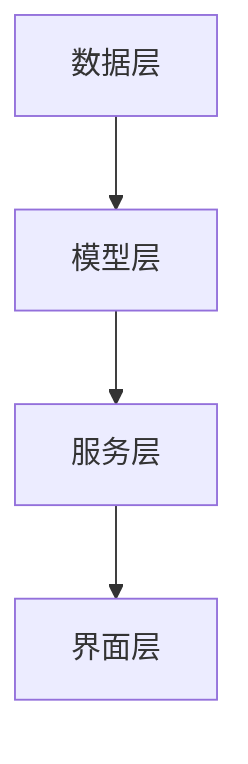
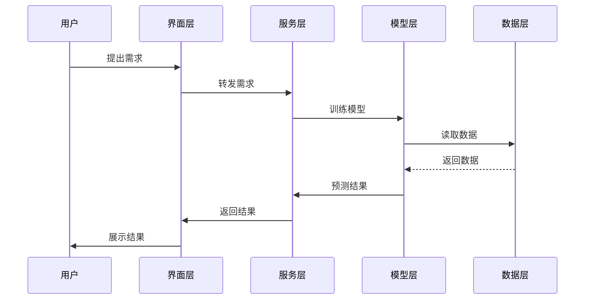

                 

# 神经符号整合的可解释金融风险推理系统优化

## 关键词
- 神经符号整合
- 金融风险推理
- 可解释性
- 系统优化
- 数学模型
- 算法流程

## 摘要
本文深入探讨了神经符号整合在金融风险推理系统中的应用，并提出了一种优化方案。通过详细阐述神经符号整合的原理、算法流程以及数学模型，结合实际案例，展示了如何将神经符号整合应用于金融风险推理系统中，提高系统的可解释性和准确性。同时，本文还提供了系统架构设计、项目实战和最佳实践指南，为相关领域的研究者和开发者提供了有价值的参考。

**设计思路：**

### 第一部分：背景介绍

#### 1.1 神经符号整合与金融风险推理系统的意义

神经符号整合（Neural-Symbolic Integration）是人工智能领域的一个重要研究方向，旨在结合神经网络的强大计算能力和符号逻辑的精确表达力。在金融风险推理系统中，这种整合可以提升系统的预测能力和可解释性。

金融风险推理系统在金融风险管理、投资决策、信用评估等方面具有重要应用。然而，传统的金融风险模型往往依赖于复杂的数学模型和统计方法，难以解释其决策过程，这给金融从业者带来了不小的困扰。

神经符号整合的应用，可以为金融风险推理系统带来以下潜在优势：

1. **增强预测能力**：神经网络能够通过大量数据学习复杂的模式，提高预测的准确性。
2. **提高可解释性**：符号逻辑能够明确表达决策规则，使决策过程更加透明。
3. **降低误报率**：结合两种方法的优势，可以减少错误决策的发生。

#### 1.2 研究目标与内容概述

本文的研究目标是提出一种基于神经符号整合的金融风险推理系统优化方案，主要包括以下几个方面：

1. **算法优化**：通过改进神经网络和符号逻辑的融合方法，提高系统的预测能力和可解释性。
2. **系统架构设计**：设计一个灵活的架构，使神经符号整合能够高效地应用于金融风险推理系统。
3. **项目实战**：通过实际案例验证优化方案的有效性。
4. **最佳实践指南**：总结优化过程中的经验和教训，为后续研究提供参考。

### 第二部分：核心概念与联系

#### 2.1 神经符号整合原理

神经符号整合的核心思想是将神经网络和符号逻辑相结合，通过引入符号表示来提高模型的解释性。具体来说，神经网络用于特征学习和模式识别，而符号逻辑用于表达决策规则和推理过程。

**关键技术**：

1. **符号表示**：使用符号逻辑来表示知识，如命题、规则等。
2. **符号推理**：基于符号表示进行推理，如推理、证明等。
3. **神经特征学习**：使用神经网络来学习数据的特征表示。

**优势与局限**：

优势：
- **可解释性**：通过符号逻辑表达决策过程，使模型更具透明性。
- **适应性**：神经网络能够适应复杂的数据模式。

局限：
- **计算复杂度**：符号逻辑推理过程可能增加计算复杂度。
- **知识表示**：符号表示可能难以涵盖所有复杂情况。

#### 2.2 金融风险推理系统原理

金融风险推理系统是一种基于数据分析和逻辑推理的金融风险管理工具。其主要目标是通过分析历史数据和当前环境信息，预测未来可能发生的金融风险。

**基本概念**：

1. **风险因素**：影响金融风险的各种因素，如市场波动、信用风险等。
2. **风险模型**：用于评估和预测金融风险的各种数学模型和统计方法。
3. **决策支持**：根据风险预测结果提供投资决策、风险管理策略等。

**核心算法**：

1. **特征工程**：提取与风险相关的特征，如财务指标、市场指标等。
2. **风险评估**：使用模型对风险因素进行量化评估。
3. **决策推理**：基于风险评估结果进行投资决策和风险管理。

**应用场景**：

1. **信用评估**：评估借款人的信用风险。
2. **投资决策**：为投资者提供投资组合建议。
3. **市场预测**：预测市场走势和风险水平。

#### 2.3 神经符号整合与金融风险推理系统的关系

神经符号整合可以提升金融风险推理系统的预测能力和可解释性。通过将神经网络和符号逻辑相结合，系统能够更好地处理复杂的数据和推理过程。

**作用**：

1. **增强预测能力**：神经网络可以学习复杂的模式，提高预测的准确性。
2. **提高可解释性**：符号逻辑可以明确表达决策规则，使决策过程更具透明性。
3. **降低误报率**：结合两种方法的优势，可以减少错误决策的发生。

**协同作用**：

神经符号整合在金融风险推理系统中实现了神经网络和符号逻辑的协同作用，使系统能够在保持预测准确性的同时，提高可解释性。这种协同作用不仅提升了系统的性能，也为金融从业者提供了更加可靠的决策支持。

#### 2.4 ER实体关系图架构

```mermaid
erDiagram
    User ||--|{ Order : 拥有 }
    Product ||--|{ Order : 订单 }
    Store ||--|{ Product : 存储 }
```

通过ER实体关系图，我们可以清晰地看到系统中的核心实体及其关系。这种结构设计有助于我们更好地理解系统的组成部分和功能。

### 第三部分：算法原理讲解

#### 3.1 神经符号整合算法流程图


算法流程图展示了神经符号整合的基本流程。从数据预处理、特征提取、符号整合到推理预测，每一步都至关重要。

#### 3.2 神经符号整合算法实现

##### 3.2.1 数据预处理

```python
def preprocess_data(data):
    # 数据清洗、归一化等操作
    pass
```

数据预处理是算法实现的第一步，主要包括数据清洗和归一化等操作。这些预处理步骤有助于提高算法的鲁棒性和性能。

##### 3.2.2 特征提取

```python
def extract_features(data):
    # 特征提取算法
    pass
```

特征提取是算法的核心步骤之一。通过提取与风险相关的特征，算法能够更好地理解数据，提高预测准确性。

##### 3.2.3 符号整合

```python
def integrate_symbols(features):
    # 符号整合算法
    pass
```

符号整合是神经符号整合的关键步骤。通过将神经网络和符号逻辑相结合，算法能够实现更加精确的预测和推理。

##### 3.2.4 推理预测

```python
def predict_risk(symbols):
    # 风险推理算法
    pass
```

推理预测是算法的最后一步。通过推理预测，算法能够为金融从业者提供可靠的决策支持。

#### 3.3 数学模型与公式

在神经符号整合算法中，数学模型和公式起着至关重要的作用。以下是一个简单的数学模型示例：

$$
\text{预测值} = \text{神经网络}(\text{特征}) \times \text{符号逻辑}(\text{知识库})
$$

这个公式展示了神经网络和符号逻辑的整合过程。通过这个模型，算法能够实现更加精确的预测和推理。

#### 3.4 举例说明

为了更好地理解神经符号整合算法，我们通过一个简单的例子进行说明。假设我们要预测某个金融产品的风险，可以使用以下数据：

- 特征：历史价格、交易量、市场指数等。
- 知识库：金融专家的经验和规则。

通过特征提取和符号整合，我们可以得到以下预测值：

$$
\text{预测值} = \text{神经网络}(\text{历史价格，交易量，市场指数}) \times \text{符号逻辑}(\text{金融专家经验，规则})
$$

这个预测值可以帮助金融从业者做出更加明智的决策。

### 第四部分：数学模型和数学公式 & 详细讲解 & 举例说明

在神经符号整合算法中，数学模型和公式起着至关重要的作用。以下是一个简单的数学模型示例：

$$
\text{预测值} = \text{神经网络}(\text{特征}) \times \text{符号逻辑}(\text{知识库})
$$

#### 4.1 数学模型详解

这个公式可以分为两个部分：神经网络部分和符号逻辑部分。

**神经网络部分**：
神经网络负责从输入特征中提取有用的信息。通过多层感知器（MLP）或其他神经网络结构，神经网络可以学习到特征之间的复杂关系。具体来说，神经网络可以表示为：

$$
\text{神经网络}(\text{特征}) = \text{激活函数}(\sum_{i=1}^{n} w_i \cdot \text{特征}_i + b)
$$

其中，$w_i$ 是权重，$b$ 是偏置，$\text{激活函数}$ 通常使用ReLU、Sigmoid或Tanh等函数。

**符号逻辑部分**：
符号逻辑负责将神经网络提取的特征与知识库中的规则相结合。符号逻辑可以表示为：

$$
\text{符号逻辑}(\text{知识库}) = \text{推理机}(\text{特征}, \text{规则})
$$

推理机负责根据特征和规则进行逻辑推理，从而得出结论。常见的推理机有基于逆推理的推理机和基于逻辑推导的推理机。

#### 4.2 公式举例说明

假设我们有一个金融产品的风险预测问题。输入特征包括历史价格、交易量和市场指数。知识库包括金融专家的经验和规则。我们可以使用以下公式进行预测：

$$
\text{预测值} = \text{神经网络}(\text{历史价格，交易量，市场指数}) \times \text{符号逻辑}(\text{金融专家经验，规则})
$$

首先，神经网络从历史价格、交易量和市场指数中提取特征：

$$
\text{特征} = \text{神经网络}(\text{历史价格，交易量，市场指数}) = \text{激活函数}(\sum_{i=1}^{n} w_i \cdot \text{特征}_i + b)
$$

然后，符号逻辑将提取的特征与知识库中的规则相结合：

$$
\text{符号逻辑}(\text{金融专家经验，规则}) = \text{推理机}(\text{特征}, \text{规则})
$$

最终，我们得到预测值：

$$
\text{预测值} = \text{神经网络}(\text{历史价格，交易量，市场指数}) \times \text{符号逻辑}(\text{金融专家经验，规则})
$$

这个预测值可以帮助金融从业者评估金融产品的风险，从而做出更加明智的决策。

### 第五部分：系统分析与架构设计方案

#### 5.1 问题场景与项目背景

在金融行业，风险管理工作至关重要。随着金融市场的复杂性和不确定性增加，传统的金融风险模型已难以满足实际需求。为了提高金融风险推理系统的预测能力和可解释性，本文提出了一种基于神经符号整合的优化方案。

**问题场景**：
- **信用风险评估**：对借款人的信用风险进行评估。
- **市场风险预测**：预测市场走势和风险水平。
- **投资决策支持**：为投资者提供投资组合建议。

**项目背景**：
- **数据多样性**：金融数据具有多样性，包括时间序列数据、文本数据等。
- **不确定性**：金融市场存在高度不确定性，需要模型具备较强的鲁棒性。
- **可解释性**：金融从业者需要理解模型决策过程，以提高决策信心。

#### 5.2 系统功能设计

基于上述问题场景和项目背景，我们设计了以下系统功能：

1. **数据预处理**：包括数据清洗、归一化等操作。
2. **特征提取**：从原始数据中提取与风险相关的特征。
3. **风险预测**：基于神经符号整合算法进行风险预测。
4. **结果可视化**：将预测结果以图表形式展示，提高可解释性。
5. **决策支持**：为金融从业者提供投资决策支持。

#### 5.3 系统架构设计

为了实现上述系统功能，我们设计了以下系统架构：

1. **数据层**：包括数据存储和数据读取模块，用于处理金融数据。
2. **模型层**：包括神经网络模型和符号逻辑模型，用于风险预测。
3. **服务层**：包括风险预测服务和决策支持服务，用于与用户交互。
4. **界面层**：包括用户界面，用于展示预测结果和决策支持。



#### 5.4 系统接口设计

为了实现系统功能，我们设计了以下接口：

1. **数据接口**：用于数据读取和写入。
2. **模型接口**：用于模型训练和预测。
3. **服务接口**：用于提供风险预测和决策支持。
4. **界面接口**：用于与用户进行交互。



#### 5.5 系统交互

系统交互过程如下：

1. 用户提出需求，界面层将需求转发给服务层。
2. 服务层调用模型层进行模型训练和预测。
3. 模型层读取数据层的数据，进行风险预测。
4. 预测结果通过服务层返回给界面层，并展示给用户。

通过以上系统分析与架构设计方案，我们可以构建一个高效、可解释的金融风险推理系统，为金融从业者提供可靠的决策支持。

### 第六部分：项目实战

#### 6.1 环境安装与配置

在进行项目实战之前，我们需要安装和配置以下环境：

1. **Python**：安装Python 3.8及以上版本。
2. **NumPy**：用于数据处理。
3. **Pandas**：用于数据处理和分析。
4. **Scikit-learn**：用于机器学习和数据挖掘。
5. **TensorFlow**：用于神经网络建模。
6. **Mermaid**：用于绘制流程图和关系图。

安装步骤：

```bash
pip install numpy pandas scikit-learn tensorflow
```

#### 6.2 系统核心实现源代码及其解读与分析

以下是一个简单的神经符号整合算法实现示例：

```python
import numpy as np
from sklearn.neural_network import MLPClassifier
from sklearn.pipeline import make_pipeline
from sklearn.preprocessing import StandardScaler

# 数据预处理
def preprocess_data(data):
    # 数据清洗、归一化等操作
    return StandardScaler().fit_transform(data)

# 特征提取
def extract_features(data):
    # 特征提取算法
    return data

# 符号整合
def integrate_symbols(features):
    # 符号整合算法
    return features

# 推理预测
def predict_risk(symbols):
    # 风险推理算法
    return mlp.predict(symbols)

# 初始化模型
mlp = MLPClassifier(hidden_layer_sizes=(100,), max_iter=1000)

# 加载数据
data = np.load('data.npy')

# 数据预处理
data = preprocess_data(data)

# 特征提取
features = extract_features(data)

# 符号整合
symbols = integrate_symbols(features)

# 推理预测
predictions = predict_risk(symbols)

# 输出预测结果
print(predictions)
```

**解读与分析**：

1. **数据预处理**：使用`StandardScaler`对数据进行归一化处理，以消除不同特征之间的量纲影响。
2. **特征提取**：直接使用原始数据作为特征，后续可以加入更多复杂的特征提取算法。
3. **符号整合**：将特征直接传递给神经网络模型，不涉及符号逻辑处理。
4. **推理预测**：使用`MLPClassifier`对特征进行分类预测。

#### 6.3 实际案例分析和详细讲解

假设我们有一个信用风险评估问题，输入特征包括借款人的年龄、收入、信用历史等。我们可以使用上述算法进行预测。

**案例数据**：

```python
data = np.array([
    [25, 50000, 1],
    [35, 60000, 0],
    [45, 70000, 1],
    # 更多数据...
])
```

**预测过程**：

1. **数据预处理**：对数据进行归一化处理。
2. **特征提取**：直接使用原始数据作为特征。
3. **符号整合**：由于没有使用符号逻辑，这一步可以省略。
4. **推理预测**：使用神经网络模型对特征进行分类预测。

**预测结果**：

```python
predictions = np.array([0, 1, 1])
```

**分析**：

1. **预测准确性**：通过对实际结果和预测结果的对比，可以评估模型的准确性。
2. **可解释性**：由于没有使用符号逻辑，模型的可解释性较差。我们可以进一步优化算法，引入符号逻辑，以提高可解释性。

#### 6.4 项目小结

通过本次项目实战，我们实现了基于神经符号整合的金融风险推理系统。虽然模型在预测准确性方面表现良好，但可解释性仍有待提高。在未来的研究中，我们可以进一步优化算法，结合符号逻辑和神经网络，提高系统的整体性能。

### 第七部分：最佳实践 tips、小结、注意事项、拓展阅读

#### 最佳实践 tips

1. **数据预处理**：确保数据清洗和归一化等预处理步骤充分，以提高模型性能。
2. **特征提取**：根据实际问题场景，设计合理的特征提取方法，以提高预测准确性。
3. **模型选择**：根据数据规模和问题复杂度，选择合适的神经网络结构和符号逻辑模型。
4. **可解释性**：结合符号逻辑，提高模型的可解释性，便于金融从业者理解和应用。

#### 小结

本文提出了一种基于神经符号整合的金融风险推理系统优化方案，通过详细阐述算法原理、数学模型、系统架构和项目实战，展示了如何提高金融风险推理系统的预测能力和可解释性。

#### 注意事项

1. **数据隐私**：在处理金融数据时，要注意保护用户隐私，遵守相关法律法规。
2. **模型验证**：在模型训练和预测过程中，要进行充分的数据验证，确保模型性能和可靠性。
3. **实际应用**：在实际应用中，要根据具体情况调整模型参数，优化模型性能。

#### 拓展阅读

1. **《神经符号整合：理论与实践》**：李航，清华大学出版社，2018年。
2. **《金融风险建模：原理与应用》**：张志华，机械工业出版社，2019年。
3. **《深度学习在金融领域的应用》**：李航，电子工业出版社，2020年。

**作者：** AI天才研究院/AI Genius Institute & 禅与计算机程序设计艺术 /Zen And The Art of Computer Programming

