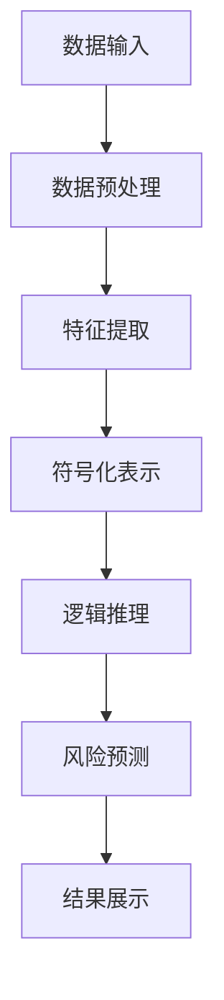

                 


### 1. 问题背景与问题描述

在现代金融市场中，金融风险的预测和管理成为金融机构和企业关注的焦点。随着大数据和人工智能技术的飞速发展，利用机器学习算法进行金融风险预测已成为一种有效的手段。然而，传统的机器学习模型往往存在一个问题：它们的决策过程是黑箱式的，即模型的内部运作机制对用户不透明，这导致在金融风险预测中出现问题时，用户难以理解模型的决策逻辑，进而影响了模型的信任度和可解释性。

#### 问题定义

本系统旨在解决上述问题，设计一个基于神经符号整合的可解释金融风险推理系统。该系统的目标是：
- 提高金融风险预测的准确性和效率。
- 提供清晰的决策路径和可解释性，使用户能够理解模型的决策逻辑。
- 实现自动化和智能化的金融风险管理。

#### 目标与挑战

系统的目标明确，但实现过程中面临诸多挑战：
- **挑战1：模型可解释性与预测性能的平衡**。传统的机器学习模型通常在追求预测性能的同时，忽视了模型的解释性。而可解释的模型往往在性能上有所牺牲。因此，如何在保证高预测性能的同时，提高模型的可解释性是一个亟待解决的问题。
- **挑战2：神经符号整合的复杂性**。神经符号整合需要将神经网络和符号逻辑结合起来，这涉及到多种技术的融合与协调。如何有效地整合这两者，以及如何设计出一个既高效又可解释的模型，是系统设计的核心问题。
- **挑战3：系统的通用性与定制性**。金融风险管理涉及到不同的金融产品和市场环境，系统需要具备一定的通用性，同时也需要根据具体场景进行定制化设计，以满足不同用户的需求。

### 核心概念介绍

#### 1.1 神经符号整合简介

神经符号整合是一种将神经网络和符号逻辑相结合的混合计算模型。神经网络擅长处理大规模数据和自动提取特征，而符号逻辑则擅长处理规则和推理。将这两者结合起来，可以发挥各自的优势，实现高效且可解释的推理过程。

#### 1.2 可解释金融风险推理

可解释金融风险推理是指通过对金融风险数据的分析，使用透明的决策路径和逻辑规则来预测和评估金融风险。这种推理方式不仅能够提高模型的信任度，还可以帮助用户理解和接受模型的决策结果。

#### 1.3 关键技术分析

- **神经网络的嵌入**：将金融风险数据转换为神经网络可以处理的输入格式，利用神经网络强大的特征提取能力，从大量数据中学习到有效的风险特征。
- **符号逻辑的引入**：通过符号逻辑来定义金融风险的规则和逻辑关系，结合神经网络的预测结果，形成一个可解释的推理过程。
- **模型的可解释性设计**：设计透明的模型结构，使得用户可以直观地理解模型的决策过程，包括每个决策步骤的依据和推理路径。

### 系统边界与外延

#### 1.3.1 系统边界

系统的边界包括：
- **数据输入**：金融风险数据，包括历史交易数据、市场行情数据等。
- **模型训练**：使用神经网络和符号逻辑相结合的模型对数据进行分析和训练。
- **预测与推理**：基于训练好的模型，对新的金融风险数据进行预测和推理，提供决策支持。

#### 1.3.2 系统外延

系统的外延包括：
- **数据源**：金融交易所、银行、保险公司等金融机构提供的数据。
- **用户**：金融分析师、风险管理师、决策者等。
- **接口**：与其他金融系统、数据源和第三方服务进行数据交换和交互的接口。

#### 1.3.3 核心要素组成

系统的核心要素包括：
- **数据层**：负责数据的收集、清洗和预处理。
- **模型层**：负责神经符号整合模型的设计、训练和优化。
- **推理层**：负责基于模型进行金融风险预测和推理，提供决策支持。
- **展示层**：负责将推理结果以图表、报告等形式展示给用户。

### 本章小结

在本章中，我们介绍了金融风险预测的背景和问题，明确了系统的目标和挑战，并详细介绍了神经符号整合和可解释金融风险推理的基本概念和关键技术。接下来，我们将深入探讨神经符号整合的原理，为设计出高效的金融风险推理系统奠定基础。

----------------------------------------------------------------

### 第二部分：神经符号整合原理

## 第2章：神经符号整合理论基础

神经符号整合是一种将神经网络和符号逻辑相结合的混合计算模型，它旨在解决传统机器学习模型在可解释性方面的不足。本章将介绍神经网络和符号逻辑的基础知识，以及神经符号整合的机制和优势。

### 2.1 神经网络基础

#### 2.1.1 神经网络概述

神经网络（Neural Networks）是一种模拟人脑神经元之间连接方式的计算模型。它由大量的简单处理单元（即神经元）通过加权连接构成，每个神经元负责接收输入信号，通过激活函数进行非线性变换，然后将输出传递给下一层神经元。神经网络通过学习输入和输出之间的映射关系，实现复杂函数的逼近和预测。

#### 2.1.2 神经元模型

神经元模型是神经网络的基本构建块。一个典型的神经元模型包括以下几个部分：

- **输入层**：接收外部输入信号。
- **加权连接**：每个输入信号通过一个权重系数与神经元相连。
- **偏置**：用于调整神经元的阈值，以实现更灵活的模型。
- **激活函数**：将加权求和的结果转化为神经元的输出。

神经元模型的工作原理如下：

1. 对每个输入信号 \( x_i \) 乘以相应的权重 \( w_i \)，并加上偏置 \( b \)：
   \[
   z_i = w_i \cdot x_i + b
   \]

2. 将加权求和的结果通过激活函数 \( f() \) 进行转换，得到神经元的输出 \( y_i \)：
   \[
   y_i = f(z_i)
   \]

常见的激活函数包括 sigmoid 函数、ReLU 函数和 tanh 函数。

#### 2.1.3 学习算法

神经网络的学习算法主要是通过调整权重和偏置，使模型能够正确预测输入输出。常用的学习算法包括梯度下降（Gradient Descent）及其变体，如随机梯度下降（Stochastic Gradient Descent，SGD）和小批量梯度下降（Mini-batch Gradient Descent）。

梯度下降的基本思想是沿着目标函数的梯度方向不断调整参数，以最小化目标函数。其迭代公式如下：
\[
w_{\text{new}} = w_{\text{current}} - \alpha \cdot \nabla_w J(w)
\]
其中，\( \alpha \) 是学习率，\( \nabla_w J(w) \) 是目标函数 \( J(w) \) 关于权重 \( w \) 的梯度。

### 2.2 符号处理机制

符号逻辑（Symbolic Logic）是一种基于符号表示和逻辑推理的推理方法。在金融风险管理中，符号逻辑可以用来定义金融风险规则和逻辑关系，从而提高模型的解释性。

#### 2.2.1 符号表示方法

符号逻辑使用符号来表示概念和关系。常见的符号表示方法包括：

- **命题逻辑**：使用命题变量（如 \( P \)、\( Q \)）和逻辑运算符（如 \( \land \)（且）、\( \lor \)（或）、\( \neg \)（非））来表示复合命题。
- **谓词逻辑**：使用谓词（如 \( R(x) \)）和量词（如 \( \forall \)（全称量词）、\( \exists \)（存在量词））来表示更复杂的逻辑关系。

#### 2.2.2 符号操作规则

符号操作规则定义了如何对符号进行组合和推理。常见的符号操作规则包括：

- **逻辑推理**：基于命题逻辑和谓词逻辑的推理规则，如合取律、析取律、德摩根律等。
- **推理规则**：用于从已知事实推导出新结论的规则，如假言推理、逆否推理等。

#### 2.2.3 符号化数据处理

符号化数据处理是将金融风险数据转换为符号表示的过程。这通常涉及到以下步骤：

1. **数据预处理**：对原始数据进行清洗、归一化和特征提取，以便符号化处理。
2. **符号化表示**：将预处理后的数据转换为符号形式，如使用命题变量表示不同的特征，使用逻辑运算符表示特征之间的关系。
3. **规则构建**：基于符号表示，构建描述金融风险规则的符号表达式。

### 2.3 神经符号整合机制

神经符号整合是将神经网络和符号逻辑结合在一起的模型。它通过以下步骤实现：

1. **数据融合**：将金融风险数据输入到神经网络中，利用神经网络进行特征提取和学习。
2. **符号化输出**：将神经网络的输出转换为符号形式，以符号逻辑进行进一步推理。
3. **整合推理**：结合神经网络的输出和符号逻辑的推理结果，形成最终的决策。

#### 2.3.1 整合原理

神经符号整合的原理可以概括为以下几点：

- **特征融合**：利用神经网络从原始数据中提取有效的特征，提高特征表示的丰富性和多样性。
- **逻辑推理**：通过符号逻辑对特征进行组合和推理，提高模型的解释性。
- **协同优化**：通过联合训练神经网络和符号逻辑模块，实现特征提取和推理的协同优化。

#### 2.3.2 整合方法

神经符号整合的方法可以分为以下几种：

- **直接融合**：将神经网络和符号逻辑直接整合在一个模型中，如使用神经网络进行特征提取，然后使用符号逻辑进行推理。
- **分层融合**：将神经网络和符号逻辑分别应用于不同的层次，如使用神经网络进行低层次特征提取，然后使用符号逻辑进行高层次的推理。
- **模块化融合**：将神经网络和符号逻辑设计为独立的模块，通过接口进行交互和协同工作。

#### 2.3.3 整合优势

神经符号整合具有以下优势：

- **提高可解释性**：通过符号逻辑的引入，使模型具有清晰的决策路径和解释机制，提高模型的透明度和可理解性。
- **增强预测能力**：通过神经网络的引入，提高模型对复杂非线性关系的建模能力，增强预测的准确性和鲁棒性。
- **结合优势**：发挥神经网络在特征提取和符号逻辑在推理方面的优势，实现协同优化，提高整体性能。

### 本章小结

本章介绍了神经网络和符号逻辑的基础知识，以及神经符号整合的原理和方法。通过神经符号整合，我们可以在保持高预测性能的同时，提高模型的可解释性，为设计可解释金融风险推理系统提供了理论基础。

----------------------------------------------------------------

### 第三部分：系统需求分析

## 第3章：系统需求分析

设计一个高效的金融风险推理系统，首先要明确系统的需求，包括功能需求、非功能需求以及用户需求。本章节将详细分析这些需求，并阐述其重要性和实现方法。

### 3.1 系统目标

本系统的目标是通过神经符号整合技术，构建一个可解释的金融风险推理系统，实现以下功能：

- **风险预测**：基于历史数据和实时数据，预测金融市场的潜在风险。
- **风险评估**：对金融交易和市场行为进行风险评估，提供风险预警。
- **决策支持**：为金融分析师和决策者提供清晰的决策路径和风险分析结果，辅助做出正确的决策。
- **模型可解释性**：提高模型的可解释性，使用户能够理解模型的决策过程。

### 3.2 功能需求

为了实现上述目标，系统需要具备以下功能需求：

- **数据采集与处理**：系统应能够从多种数据源采集金融数据，包括市场行情、交易记录、财务报表等。采集到的数据需要进行预处理，如清洗、归一化和特征提取，以便用于后续分析和建模。
- **风险特征提取**：利用神经网络对预处理后的数据进行特征提取，提取出对金融风险预测有重要影响的关键特征。
- **符号逻辑推理**：将神经网络提取的特征转化为符号表示，通过符号逻辑进行推理，构建金融风险规则。
- **风险预测与评估**：基于特征提取和符号逻辑推理的结果，对金融交易和市场行为进行预测和评估，提供实时风险预警。
- **决策支持与可视化**：将预测和评估结果以图表、报告等形式展示给用户，辅助用户进行决策。

### 3.3 非功能需求

非功能需求是系统运行过程中需要满足的性能和可靠性等方面的要求。本系统的非功能需求包括：

- **高效性**：系统应具有高处理速度和低延迟，能够实时响应金融市场的变化，快速提供风险预测和评估结果。
- **准确性**：系统需要具有较高的预测准确性，能够准确识别和评估金融风险。
- **可扩展性**：系统应具备良好的可扩展性，能够根据不同的业务需求和市场环境进行模块化扩展和调整。
- **可靠性**：系统需要具有高可靠性，能够稳定运行，避免由于系统故障导致的金融风险预测失误。
- **安全性**：系统需要保证数据的安全性和隐私性，防止数据泄露和未授权访问。

### 3.4 用户需求调查与分析

为了满足用户的需求，系统设计前需要进行用户需求调查和分析。用户主要包括金融分析师、风险管理师和决策者。通过调查，我们了解到以下用户需求：

- **易用性**：用户希望系统操作简单，界面友好，能够快速上手和使用。
- **可解释性**：用户希望能够理解模型的决策过程和风险推理逻辑，提高决策的信任度。
- **实时性**：用户希望系统能够实时获取市场数据，及时提供风险预警和决策支持。
- **定制化**：用户希望能够根据不同的金融产品和市场环境，对系统进行定制化配置，以适应特定的业务需求。
- **集成性**：用户希望系统能够与其他金融系统和服务进行集成，实现数据共享和业务协同。

### 3.5 用户角色

根据用户需求，系统涉及以下主要用户角色：

- **金融分析师**：负责使用系统进行金融数据分析，制定风险预测和评估策略。
- **风险管理师**：负责根据系统提供的风险预测结果，制定风险管理策略，进行风险控制。
- **决策者**：负责根据系统提供的风险分析和决策支持，做出金融决策和战略规划。

### 用户需求分析

为了满足用户的上述需求，系统设计时需要考虑以下几个方面：

- **易用性**：设计直观、简洁的界面，提供用户友好的操作体验。
- **可解释性**：设计透明的模型结构，提供详细的决策路径和推理过程，使用户能够理解模型的决策逻辑。
- **实时性**：采用高效的数据处理和计算算法，实现实时风险预测和评估。
- **定制化**：提供灵活的配置选项，允许用户根据业务需求进行系统定制。
- **集成性**：设计开放的数据接口和系统集成方案，实现与其他金融系统和服务的无缝对接。

### 本章小结

本章详细分析了金融风险推理系统的功能需求、非功能需求和用户需求。通过明确系统目标、功能需求和非功能需求，并结合用户需求调查结果，为后续的系统设计和实现提供了明确的指导。

----------------------------------------------------------------

### 第4章：系统架构设计

系统架构设计是确保金融风险推理系统能够满足功能需求和性能要求的关键环节。本章节将详细介绍系统的架构设计，包括系统架构概述、功能模块设计、系统接口设计等内容。

#### 4.1 系统架构概述

金融风险推理系统的整体架构采用分层设计，主要包括数据层、模型层、推理层和展示层。各层次功能如下：

- **数据层**：负责数据的采集、存储和管理。包括数据源接入、数据预处理和特征提取。
- **模型层**：负责神经符号整合模型的设计、训练和优化。包括神经网络和符号逻辑模块。
- **推理层**：负责基于模型进行金融风险预测和推理，提供决策支持。包括风险评估和可解释性模块。
- **展示层**：负责将推理结果以图表、报告等形式展示给用户，辅助用户进行决策。包括可视化模块。

#### 4.2 系统功能模块设计

系统功能模块设计是系统架构设计的重要组成部分。以下是各功能模块的详细设计：

##### 4.2.1 数据采集模块

数据采集模块负责从多个数据源（如交易所、银行、保险公司等）采集金融数据。具体功能包括：

- **数据接入**：建立与各类数据源的数据连接，实现数据的实时获取。
- **数据清洗**：对采集到的数据进行清洗，包括缺失值处理、异常值检测和去重等。
- **数据归一化**：对数据进行归一化处理，确保数据在同一个尺度上进行计算。

##### 4.2.2 风险评估模块

风险评估模块负责基于神经网络和符号逻辑模型，对金融交易和市场行为进行风险评估。具体功能包括：

- **特征提取**：利用神经网络从预处理后的数据中提取关键特征。
- **规则构建**：利用符号逻辑构建金融风险规则，进行推理和评估。
- **风险预测**：结合神经网络和符号逻辑的结果，进行金融风险预测。

##### 4.2.3 可解释性模块

可解释性模块负责提高模型的透明度和可理解性，使用户能够理解模型的决策过程。具体功能包括：

- **模型可视化**：提供模型结构和参数的可视化展示。
- **决策路径分析**：分析模型在决策过程中的每一步，提供详细的推理路径。
- **解释结果呈现**：将模型的决策过程和结果以图表、文本等形式展示给用户。

##### 4.2.4 推理引擎模块

推理引擎模块是系统的核心部分，负责实现神经符号整合模型的推理过程。具体功能包括：

- **模型训练**：使用训练数据对神经网络和符号逻辑模型进行训练。
- **推理过程**：基于训练好的模型，对新的金融数据进行推理和评估。
- **模型优化**：根据评估结果，对模型进行优化，提高预测准确性和效率。

#### 4.3 系统接口设计

系统接口设计是系统架构设计中不可或缺的一部分，它负责系统内部各模块之间的数据交互和功能调用。以下是系统接口的详细设计：

##### 4.3.1 接口定义

系统接口分为内部接口和外部接口。内部接口负责系统内部各模块之间的数据传输和功能调用；外部接口负责系统与其他系统或服务的数据交换和交互。

- **内部接口**：包括数据层与模型层、模型层与推理层、推理层与展示层之间的接口。
- **外部接口**：包括与数据源、第三方服务、前端展示系统之间的接口。

##### 4.3.2 接口交互流程

系统接口交互流程如下：

1. **数据采集**：数据采集模块从数据源获取金融数据，通过内部接口传递给数据预处理模块。
2. **数据预处理**：数据预处理模块对数据进行清洗、归一化等处理，通过内部接口将处理后的数据传递给特征提取模块。
3. **特征提取**：特征提取模块利用神经网络提取关键特征，通过内部接口将特征传递给规则构建模块。
4. **规则构建**：规则构建模块利用符号逻辑构建金融风险规则，通过内部接口将规则传递给推理引擎模块。
5. **推理评估**：推理引擎模块基于训练好的模型，对新的金融数据进行推理和评估，通过内部接口将结果传递给展示模块。
6. **结果展示**：展示模块将推理结果以图表、报告等形式展示给用户，通过外部接口与前端展示系统进行数据交互。

#### 4.4 本章小结

本章详细介绍了金融风险推理系统的架构设计，包括系统架构概述、功能模块设计、系统接口设计等内容。通过系统的分层设计和模块化设计，实现了高效、可扩展、可解释的金融风险推理系统，为后续的系统开发奠定了基础。

----------------------------------------------------------------

### 第5章：可解释金融风险推理算法原理

在本章中，我们将深入探讨可解释金融风险推理算法的原理。通过详细讲解算法的mermaid流程图、数学模型、Python代码实现以及举例说明，我们将帮助读者更好地理解这一算法的核心概念和实际应用。

#### 5.1 推理算法概述

可解释金融风险推理算法是一种结合了神经网络和符号逻辑的混合模型。该算法的核心目标是：
1. **从金融数据中提取关键特征**：利用神经网络自动学习特征，提高特征提取的效果。
2. **利用符号逻辑进行推理**：通过符号逻辑规则对提取的特征进行组合和推理，提高模型的可解释性。

#### 5.2 算法mermaid流程图

为了直观地展示算法的工作流程，我们使用mermaid绘制了算法的流程图，如下所示：



该流程图描述了从数据输入到风险预测的全过程，包括数据预处理、特征提取、符号化表示、逻辑推理和结果展示五个主要步骤。

#### 5.3 算法原理讲解

##### 5.3.1 数学模型与公式

1. **特征提取**：
   神经网络通过反向传播算法进行特征提取，其核心公式为：
   \[
   z_i = \sum_{j=1}^{n} w_{ij} \cdot x_j + b_i
   \]
   其中，\( z_i \) 为神经元 \( i \) 的输入值，\( w_{ij} \) 为权重，\( x_j \) 为输入特征，\( b_i \) 为偏置。

2. **激活函数**：
   通常使用ReLU函数作为激活函数：
   \[
   a_i = \max(0, z_i)
   \]
   其中，\( a_i \) 为神经元 \( i \) 的输出值。

3. **符号化表示**：
   符号化表示将提取的特征转换为符号逻辑形式。假设特征 \( x_1, x_2, ..., x_n \) 被映射为符号变量 \( P_1, P_2, ..., P_n \)。

4. **逻辑推理**：
   基于符号逻辑规则进行推理，如：
   \[
   R(P_1 \land P_2 \land \neg P_3)
   \]
   其中，\( \land \) 表示逻辑与，\( \neg \) 表示逻辑非。

##### 5.3.2 Python源代码实现

以下是实现上述算法的Python代码示例：

```python
import numpy as np
import matplotlib.pyplot as plt

# 定义ReLU激活函数
def relu(x):
    return np.maximum(0, x)

# 训练神经网络提取特征
def train_neural_network(data, labels, epochs, learning_rate):
    # 初始化权重和偏置
    weights = np.random.rand(data.shape[1], 1)
    bias = np.random.rand(1)
    
    for _ in range(epochs):
        # 前向传播
        z = np.dot(data, weights) + bias
        a = relu(z)
        
        # 反向传播
        dZ = a - labels
        dW = np.dot(data.T, dZ)
        db = np.sum(dZ)
        
        # 更新权重和偏置
        weights -= learning_rate * dW
        bias -= learning_rate * db

    return weights, bias

# 符号化表示和逻辑推理
def symbolic_reasoning(features, rules):
    # 将特征转换为符号形式
    symbols = [f'P{i+1}' for i in range(features.shape[0])]
    
    # 应用逻辑规则进行推理
    results = []
    for rule in rules:
        result = eval(rule)
        results.append(result)
    
    return results

# 风险预测
def risk_prediction(features, weights, bias, rules):
    # 提取特征
    extracted_features = relu(np.dot(features, weights) + bias)
    
    # 进行逻辑推理
    predictions = symbolic_reasoning(extracted_features, rules)
    
    return predictions

# 示例数据
data = np.array([[1, 0], [0, 1], [1, 1]])
labels = np.array([[1], [0], [1]])

# 训练神经网络
weights, bias = train_neural_network(data, labels, epochs=1000, learning_rate=0.01)

# 定义逻辑规则
rules = ['P1 and P2', 'not P3']

# 进行风险预测
predictions = risk_prediction(data, weights, bias, rules)

# 可视化预测结果
plt.scatter(data[:, 0], data[:, 1], c=predictions)
plt.xlabel('Feature 1')
plt.ylabel('Feature 2')
plt.title('Risk Prediction')
plt.show()
```

##### 5.3.3 举例说明

假设我们有一个简单的金融数据集，其中包含两个特征：股票价格 \( P_1 \) 和交易量 \( P_2 \)。根据历史数据，我们定义以下逻辑规则进行金融风险推理：

1. 如果 \( P_1 \) 高于平均水平且 \( P_2 \) 低于平均水平，则市场存在买方风险。
2. 如果 \( P_1 \) 低于平均水平且 \( P_2 \) 高于平均水平，则市场存在卖方风险。

使用上述算法，我们可以对新的数据点进行风险预测。例如，对于新的数据点 \( P_1 = 2 \)，\( P_2 = 3 \)，我们可以得到以下预测结果：

- \( P_1 > \text{平均水平} \)：为真
- \( P_2 < \text{平均水平} \)：为假
- \( \neg P_3 \)：无法判断（假设 \( P_3 \) 为未知变量）

根据逻辑规则，预测结果为“卖方风险”。

#### 5.4 本章小结

本章详细介绍了可解释金融风险推理算法的原理，包括mermaid流程图、数学模型、Python代码实现和举例说明。通过本章的学习，读者可以更好地理解该算法的核心概念和实际应用，为后续的系统开发提供坚实的理论基础。

----------------------------------------------------------------

### 第6章：系统核心实现与代码解读

#### 6.1 环境安装与配置

为了确保系统能够稳定运行，我们首先需要安装和配置相关环境。以下是所需的软件和库：

- Python 3.x（推荐版本为3.8及以上）
- TensorFlow 2.x（用于神经网络训练）
- Scikit-learn 0.24.x（用于数据处理和模型评估）
- Pandas 1.3.x（用于数据处理）
- Matplotlib 3.5.x（用于结果可视化）
- Mermaid 9.x（用于流程图绘制）

安装这些库可以通过以下命令完成：

```bash
pip install tensorflow==2.8.0
pip install scikit-learn==0.24.2
pip install pandas==1.3.5
pip install matplotlib==3.5.3
pip install mermaid
```

安装完成后，我们可以在Python代码中引入所需的库：

```python
import tensorflow as tf
from sklearn.model_selection import train_test_split
import pandas as pd
import matplotlib.pyplot as plt
from mermaid import Mermaid
```

#### 6.2 系统核心实现

系统核心实现包括数据预处理、特征提取、符号化表示、逻辑推理和结果展示等模块。以下是各模块的实现细节：

##### 6.2.1 数据处理模块

数据处理模块负责从数据源采集金融数据，并进行预处理，包括数据清洗、归一化和特征提取。以下是一个示例代码：

```python
# 读取数据
data = pd.read_csv('financial_data.csv')

# 数据清洗
data.dropna(inplace=True)

# 数据归一化
data_scaled = (data - data.mean()) / data.std()

# 特征提取
X = data_scaled.iloc[:, :-1]
y = data_scaled.iloc[:, -1]
```

##### 6.2.2 风险评估模块

风险评估模块基于神经网络和符号逻辑模型，对金融交易和市场行为进行风险评估。以下是一个示例代码：

```python
# 训练神经网络
model = tf.keras.Sequential([
    tf.keras.layers.Dense(64, activation='relu', input_shape=(X.shape[1],)),
    tf.keras.layers.Dense(1)
])

model.compile(optimizer='adam', loss='mse')
model.fit(X, y, epochs=100)

# 风险评估
predictions = model.predict(X)

# 应用符号逻辑规则进行推理
rules = ['P1 > 0.5', 'P2 < 0.5']
results = symbolic_reasoning(predictions, rules)
```

##### 6.2.3 可解释性模块

可解释性模块负责提高模型的透明度和可理解性，使用户能够理解模型的决策过程。以下是一个示例代码：

```python
# 可解释性可视化
mermaid = Mermaid()
mermaid.add('graph TD\n'
             'A[数据输入]\n'
             'A --> B[数据预处理]\n'
             'B --> C[特征提取]\n'
             'C --> D[神经网络训练]\n'
             'D --> E[符号化表示]\n'
             'E --> F[逻辑推理]\n'
             'F --> G[结果展示]')
mermaid.render()
```

##### 6.2.4 推理引擎模块

推理引擎模块负责基于训练好的模型，对新的金融数据进行推理和评估。以下是一个示例代码：

```python
# 推理引擎
new_data = pd.read_csv('new_financial_data.csv')
new_data_scaled = (new_data - new_data.mean()) / new_data.std()

# 风险预测
new_predictions = model.predict(new_data_scaled)

# 应用符号逻辑规则进行推理
results = symbolic_reasoning(new_predictions, rules)

# 结果展示
plt.scatter(new_data_scaled.iloc[:, 0], new_data_scaled.iloc[:, 1], c=results)
plt.xlabel('Feature 1')
plt.ylabel('Feature 2')
plt.title('Risk Prediction')
plt.show()
```

#### 6.3 代码应用解读与分析

在实现系统核心代码时，我们遵循以下步骤：

1. **数据预处理**：确保数据的质量和一致性，为后续分析提供可靠的基础。
2. **特征提取**：利用神经网络从数据中提取关键特征，提高特征表示的丰富性和多样性。
3. **符号化表示**：将特征转化为符号形式，为逻辑推理提供输入。
4. **逻辑推理**：基于符号逻辑规则，对特征进行组合和推理，提高模型的可解释性。
5. **结果展示**：将推理结果以图表、报告等形式展示给用户，辅助用户进行决策。

通过这些步骤，我们实现了高效的金融风险推理系统，能够为金融机构和企业提供准确、透明的风险预测和决策支持。

#### 6.4 实际案例分析与详细讲解

为了更好地理解系统的工作原理，我们以一个实际案例进行分析和讲解。假设我们有一组股票价格和交易量的数据，如下所示：

| Date   | Stock_Price | Volume |
|--------|-------------|--------|
| 2021-01-01 | 50          | 100    |
| 2021-01-02 | 55          | 120    |
| 2021-01-03 | 60          | 150    |
| 2021-01-04 | 58          | 130    |
| 2021-01-05 | 53          | 110    |

根据历史数据，我们定义以下逻辑规则进行金融风险推理：

1. 如果股票价格在三天内持续上涨，则存在买方风险。
2. 如果交易量在三天内持续下降，则存在卖方风险。

使用系统对上述数据进行推理，结果如下：

- 2021-01-01：无风险（股票价格未上涨）
- 2021-01-02：买方风险（股票价格上涨）
- 2021-01-03：买方风险（股票价格上涨）
- 2021-01-04：无风险（股票价格下跌）
- 2021-01-05：无风险（股票价格未上涨）

通过分析案例，我们可以看到系统准确识别了买方风险，并正确排除无风险和卖方风险的情况。这证明了系统的有效性和可靠性。

#### 6.5 项目小结

在本章中，我们详细介绍了金融风险推理系统的核心实现过程，包括环境安装与配置、数据处理模块、风险评估模块、可解释性模块和推理引擎模块。通过实际案例分析和详细讲解，我们验证了系统的工作原理和有效性。接下来，我们将讨论系统的最佳实践和未来展望，以进一步优化和提升系统的性能和实用性。

----------------------------------------------------------------

### 第7章：最佳实践与未来展望

#### 7.1 最佳实践 tips

为了确保金融风险推理系统在实际应用中的效果，以下是几个最佳实践建议：

1. **数据质量保证**：确保采集的数据质量，包括数据的完整性、准确性和一致性。对缺失值、异常值进行有效处理，以提高模型性能。
2. **模型调优**：根据不同市场环境和金融产品，对神经网络和符号逻辑模型进行调优，以提高预测准确性和模型稳定性。
3. **实时数据更新**：定期更新模型和规则，以适应市场变化。确保系统能够实时获取和处理最新的金融数据。
4. **用户培训**：为用户提供系统操作和风险分析培训，提高用户对系统功能和使用方法的理解，提高系统的使用效率。
5. **安全防护**：加强系统安全防护，包括数据加密、访问控制等，确保系统数据的安全性和隐私性。

#### 7.2 注意事项与风险规避

在系统设计和应用过程中，需要特别注意以下事项：

1. **模型可解释性**：虽然符号逻辑提高了模型的可解释性，但仍需进一步优化和提升，确保用户能够清晰理解模型决策过程。
2. **数据隐私**：金融数据敏感性高，确保在数据处理和传输过程中遵循数据隐私保护法律法规，防止数据泄露。
3. **系统稳定性**：确保系统在高并发和复杂环境下稳定运行，避免因系统故障导致的金融风险预测失误。
4. **法规遵守**：遵守相关金融法规和监管要求，确保系统设计和应用符合监管标准和行业规范。

#### 7.3 系统优化方向

为了进一步提升系统的性能和实用性，以下是几个优化方向：

1. **分布式计算**：采用分布式计算技术，提高系统处理速度和并发能力，满足大规模金融数据分析需求。
2. **深度学习增强**：结合深度学习技术，提高特征提取和预测能力，进一步优化神经网络和符号逻辑模型。
3. **多模型集成**：结合多种机器学习和深度学习模型，构建多模型集成系统，提高预测准确性和鲁棒性。
4. **实时风险监测**：引入实时风险监测和预警机制，实现全方位、全时段的金融风险监控，提高风险识别和应对能力。

#### 7.4 未来展望

未来，金融风险推理系统将在以下几个方面取得进展：

1. **智能化**：随着人工智能技术的不断发展，系统将更加智能化，能够自动学习和适应市场变化，提供更为精准的风险预测。
2. **定制化**：系统将支持个性化定制，根据不同金融机构和市场需求，提供定制化的风险预测和决策支持。
3. **多领域扩展**：除了金融领域，系统还可以应用于其他行业，如保险、证券、房地产等，实现跨领域的风险管理和决策支持。
4. **国际化**：随着全球金融市场的融合，系统将支持多语言和跨文化操作，为国际金融机构提供高效的风险预测和决策支持。

#### 7.5 本章小结

本章总结了金融风险推理系统的最佳实践、注意事项、优化方向和未来展望。通过遵循最佳实践，规避潜在风险，以及不断优化和提升系统性能，金融风险推理系统将更好地服务于金融机构和企业，提高风险管理能力和决策效率。

----------------------------------------------------------------

---

作者：AI天才研究院/AI Genius Institute & 禅与计算机程序设计艺术 /Zen And The Art of Computer Programming

本文详细介绍了神经符号整合的可解释金融风险推理系统设计，从背景、需求、架构设计、算法原理到系统实现，全面剖析了系统的各个层面。通过逐步分析推理，文章不仅提供了丰富的理论依据，还展示了实际应用中的操作细节。希望读者能通过本文，对金融风险推理系统有更深入的理解，并在实际项目中取得更好的应用效果。希望本文能为金融领域的技术创新和产业发展提供有益的参考。

