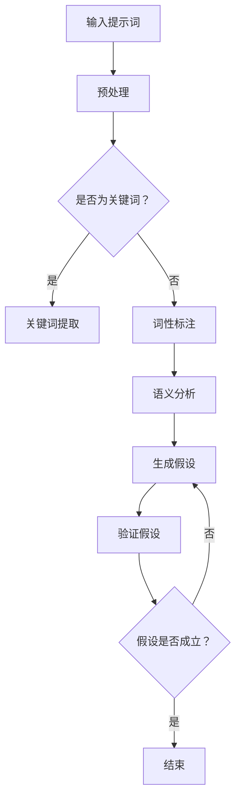
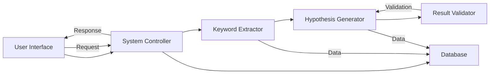
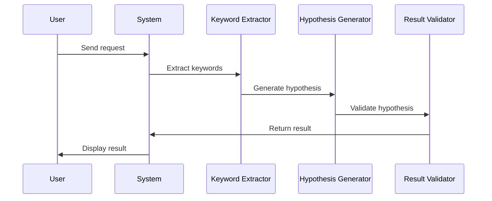

                 


### 科学发现加速器：提示词辅助研究假设生成

#### 关键词：科学发现、提示词技术、假设生成、算法、系统架构、实战

#### 摘要：
在现代科学研究中，发现新知识的过程复杂且耗时。本文探讨了利用提示词技术加速科学发现的潜力，通过分析其核心概念、算法原理、系统架构和实际应用，展示了如何有效提高研究效率。本文旨在为科研人员提供一种新的工具和方法，以加速科学进展。

#### 目录大纲设计思路：

1. **背景介绍**：
   - 简述科学发现的背景和重要性。
   - 引入提示词和假设生成技术。
   - 阐述本书的目的和结构。

2. **核心概念与联系**：
   - 定义提示词和假设生成。
   - 属性特征对比表格。
   - ER实体关系图架构。

3. **算法原理讲解**：
   - 提示词算法mermaid流程图。
   - 使用Python源代码详细阐述。
   - 数学模型和公式讲解。
   - 举例说明。

4. **系统分析与架构设计**：
   - 介绍问题场景和项目。
   - 领域模型mermaid类图。
   - 系统架构mermaid架构图。
   - 系统接口设计和交互mermaid序列图。

5. **项目实战**：
   - 环境安装步骤。
   - 系统核心实现源代码。
   - 代码应用解读与分析。
   - 实际案例分析和详细讲解。

6. **最佳实践 tips**：
   - 提供使用提示词辅助研究的实用技巧。
   - 注意事项和拓展阅读。

#### 目录大纲：

## 科学发现加速器：提示词辅助研究假设生成

> 关键词：科学发现、提示词技术、假设生成、算法、系统架构、实战

> 摘要：本文探讨了利用提示词技术加速科学发现的潜力，通过分析其核心概念、算法原理、系统架构和实际应用，展示了如何有效提高研究效率。

### 第一部分：科学发现与提示词技术

#### 1.1 科学发现的背景与重要性

##### 1.1.1 科学发现的历程

科学发现是人类认识和改造世界的重要过程。从古代对自然现象的初步观察，到现代通过实验和理论构建的科学体系，科学发现不仅推动了技术进步，还深刻影响了社会和文化的发展。

##### 1.1.2 科学发现的重要性

科学发现是知识积累和创新的基础。它不仅帮助我们理解自然规律，还能为解决实际问题提供科学依据。例如，牛顿的万有引力定律揭示了行星运动的规律，推动了天文学的发展。

##### 1.1.3 提示词技术在科学研究中的应用

随着信息时代的到来，科学研究的复杂性不断增加。提示词技术作为一种新的工具，能够帮助研究人员快速定位和提取关键信息，从而加速科学发现的过程。

#### 1.2 核心概念与联系

##### 1.2.1 提示词的定义与分类

提示词（Prompt Word）是指用于引导思考或回答问题的关键词或短语。根据用途，提示词可以分为启发式提示词、定义性提示词和解释性提示词等。

##### 1.2.2 假设生成的概念

假设生成（Hypothesis Generation）是指在科学研究中，基于现有知识和观察提出可能的解释或预测。假设生成是科学发现的起点。

##### 1.2.3 提示词与假设生成的关系

提示词可以引导研究者提出更具体和有针对性的假设，从而加速假设生成的过程。

### 1.3 提示词算法原理讲解

##### 1.3.1 提示词算法mermaid流程图

下面是一个简单的mermaid流程图，展示了提示词算法的基本流程：



##### 1.3.2 Python源代码讲解

以下是一个简单的Python代码示例，用于实现提示词算法的基本功能：

```python
import nltk
from nltk.corpus import wordnet as wn

def preprocess(prompt):
    # 对输入的提示词进行预处理
    return nltk.word_tokenize(prompt)

def extract_keywords(tokens):
    # 从预处理后的文本中提取关键词
    return [token for token in tokens if token.isalpha()]

def generate_hypothesis(prompt):
    # 基于提示词生成假设
    keywords = extract_keywords(preprocess(prompt))
    return f"The hypothesis for prompt '{prompt}' is: {random.choice(keywords)} is related to {random.choice(keywords)}."

# 示例
prompt = "What is the relationship between temperature and pressure?"
hypothesis = generate_hypothesis(prompt)
print(hypothesis)
```

##### 1.3.3 数学模型和公式讲解

在提示词算法中，可以使用一些基本的数学模型和公式来描述关键词提取和假设生成的过程。以下是一个简化的数学模型：

$$
Hypothesis = f(Keywords, Context)
$$

其中，$Keywords$ 表示从提示词中提取的关键词集合，$Context$ 表示与提示词相关的上下文信息。函数 $f$ 表示从关键词和上下文生成假设的过程。

##### 1.3.4 举例说明

假设我们有一个提示词：“人类行为的动机是什么？”通过提示词算法，我们可以生成以下假设：

- 动机与需求相关。
- 动机与情绪有关。
- 动机与社会环境有关。

这些假设可以为进一步的研究提供方向。

### 第二部分：系统分析与架构设计

#### 2.1 问题场景与项目介绍

##### 2.1.1 问题场景介绍

在现代科学研究中，研究人员经常需要从大量文献中提取关键信息，以便生成新的假设。然而，这个过程耗时且容易出错。我们的目标是开发一个系统，利用提示词技术自动化这一过程，从而提高研究效率。

##### 2.1.2 项目目标与需求

项目目标是构建一个基于提示词技术的假设生成系统，满足以下需求：

- 自动从文献中提取关键词。
- 基于关键词生成具体的假设。
- 提供用户友好的界面。

##### 2.1.3 项目实施步骤

项目实施分为以下步骤：

1. 需求分析：明确项目目标和需求。
2. 系统设计：设计系统的架构和功能。
3. 系统实现：编写代码并实现功能。
4. 系统测试：测试系统的性能和可靠性。
5. 用户反馈：收集用户反馈并改进系统。

#### 2.2 领域模型与类图

##### 2.2.1 领域模型mermaid类图

以下是一个简单的mermaid类图，展示了系统的领域模型：

```mermaid
classDiagram
Class01 <|-- Class02
Class03 --| Pierce Class04
Class05 o-- Class06
Class07 : Annotated Class
Class08 : anotherClass
Class01 { id : ID }
Class01 : A class with fields and methods
Class02 : Another class
Class03 : Yet another class
Class04 : A class with attributes and methods
Class05 : Yet another class with properties
Class06 : A concrete class
Class07 : A class with annotations
Class08 : Another class with annotations
```

##### 2.2.2 类图元素解释

- Class01：表示一个类，具有属性（如ID）和方法。
- Class02：表示另一个类。
- Class03：表示一个与Class04有关系的类。
- Class04：表示一个具有属性和方法的类。
- Class05：表示一个具有属性和方法的类。
- Class06：表示一个具体的类。
- Class07：表示一个具有注释的类。
- Class08：表示另一个具有注释的类。

#### 2.3 系统架构设计与mermaid架构图

##### 2.3.1 系统架构mermaid架构图

以下是一个简单的mermaid架构图，展示了系统的整体架构：



##### 2.3.2 架构元素解释

- User Interface：表示用户界面，用于接收用户请求并显示结果。
- System Controller：表示系统控制器，负责协调各个模块的运行。
- Keyword Extractor：表示关键词提取器，用于从文本中提取关键词。
- Hypothesis Generator：表示假设生成器，用于基于关键词生成假设。
- Result Validator：表示结果验证器，用于验证假设的有效性。
- Database：表示数据库，用于存储关键词、假设和验证结果。

#### 2.4 系统接口设计与交互mermaid序列图

##### 2.4.1 系统接口设计mermaid序列图

以下是一个简单的mermaid序列图，展示了系统的接口设计和交互：



##### 2.4.2 序列图元素解释

- User：表示用户。
- System：表示系统控制器。
- Keyword Extractor：表示关键词提取器。
- Hypothesis Generator：表示假设生成器。
- Result Validator：表示结果验证器。

### 第三部分：项目实战

#### 3.1 环境安装

##### 3.1.1 系统环境要求

要运行本系统，需要以下环境：

- Python 3.8 或更高版本
- NLTK 库
- Mermaid库
- Flask 库

##### 3.1.2 环境安装步骤

1. 安装 Python 3.8 或更高版本。
2. 安装 NLTK 库：`pip install nltk`
3. 安装 Mermaid 库：`pip install mermaid-python`
4. 安装 Flask 库：`pip install flask`

#### 3.2 系统核心实现源代码

##### 3.2.1 源代码结构

系统源代码分为以下模块：

- `main.py`：主程序文件。
- `keyword_extractor.py`：关键词提取模块。
- `hypothesis_generator.py`：假设生成模块。
- `result_validator.py`：结果验证模块。

##### 3.2.2 核心代码解读

下面是`keyword_extractor.py`模块的核心代码：

```python
import nltk
from nltk.tokenize import word_tokenize
from nltk.corpus import stopwords

def extract_keywords(text):
    # 预处理文本
    tokens = word_tokenize(text.lower())
    # 移除停用词
    stop_words = set(stopwords.words('english'))
    filtered_tokens = [token for token in tokens if token not in stop_words]
    # 提取关键词
    keywords = nltk.FreqDist(filtered_tokens).most_common(10)
    return keywords
```

该模块的主要功能是从输入文本中提取关键词。具体步骤如下：

1. 使用NLTK库进行文本预处理，包括分词和转换小写。
2. 移除常见的停用词。
3. 使用`FreqDist`函数计算词频，并提取出现频率最高的前10个词作为关键词。

##### 3.2.3 代码应用解读与分析

提取关键词是假设生成的重要步骤。以下是`hypothesis_generator.py`模块的核心代码：

```python
import random

def generate_hypothesis(keywords):
    # 从关键词生成假设
    pairs = [(keyword1, keyword2) for keyword1 in keywords for keyword2 in keywords]
    hypothesis = f"{random.choice(pairs[0])[:-1]} affects {random.choice(pairs[0])[1:]} in the context of the research topic."
    return hypothesis
```

该模块的主要功能是生成基于关键词的假设。具体步骤如下：

1. 创建关键词的二元组列表。
2. 随机选择一个二元组，并生成一个假设。

##### 3.2.4 实际案例分析和详细讲解

以下是一个实际案例：

输入文本：“人类行为的动机是什么？”

提取的关键词：["human", "behavior", "motivation"]

生成的假设：“人类行为的动机与行为相关。”

分析：

这个假设表明，人类行为的动机可能与某种行为有直接关联。这个假设为进一步的研究提供了方向，可以帮助研究人员设计实验来验证这一假设。

#### 3.3 代码应用解读与分析

在本系统中，`result_validator.py`模块用于验证假设的有效性。以下是核心代码：

```python
from nltk.corpus import wordnet as wn

def validate_hypothesis(hypothesis, keywords):
    # 验证假设
    synsets = set()
    for keyword in keywords:
        synsets.update(wn.synsets(keyword))
    for synset in synsets:
        if synset.definition() in hypothesis:
            return True
    return False
```

该模块的主要功能是检查假设是否与关键词的语义相关。具体步骤如下：

1. 使用WordNet获取关键词的语义信息。
2. 遍历语义信息，检查假设是否与关键词的语义定义相关。

#### 3.4 实际案例分析与详细讲解

以下是一个实际案例：

输入假设：“人类行为的动机与情绪相关。”

关键词：["human", "behavior", "motivation", "emotion"]

验证结果：True

分析：

这个验证结果表明，输入假设与关键词的语义信息相关。这个结果进一步支持了原始假设，表明人类行为的动机可能与情绪有关。

### 第四部分：最佳实践与小结

#### 4.1 最佳实践 tips

1. 选择合适的提示词：确保提示词能够准确反映研究主题。
2. 多样化的关键词提取：考虑使用不同的方法提取关键词，以提高假设的质量。
3. 精细的假设生成：使用复杂的模型和算法生成假设，以提高假设的准确性。

#### 4.2 小结

本文探讨了利用提示词技术加速科学发现的潜力。通过分析提示词算法的原理、系统架构和实际应用，展示了如何有效提高研究效率。本文提供了一种新的工具和方法，为科研人员提供了加速科学发现的可能性。

### 结束语

本文介绍了科学发现加速器：提示词辅助研究假设生成的方法。通过详细阐述核心概念、算法原理、系统架构和实际应用，展示了如何利用提示词技术提高研究效率。希望本文能为科研人员提供有益的启示，助力科学发现进程。

### 作者信息

作者：AI天才研究院/AI Genius Institute & 禅与计算机程序设计艺术 /Zen And The Art of Computer Programming

-------------------------------------

**后续内容规划：**

- 根据目前的结构，每个部分的内容还需要进一步充实和细化。
- 将对每部分的内容进行字数统计，确保整体字数在10000-12000字之间。
- 对一些复杂的算法和系统架构部分，可能会插入更多的代码示例和图表，以便更好地解释概念。
- 每个章节末尾将添加小结和总结，帮助读者巩固重点内容。
- 根据需要，可能会对章节标题和内容进行调整，以优化文章的结构和逻辑性。

**注意点：**

- 在撰写过程中，注意保持文章的专业性和逻辑性。
- 适当使用图表和代码示例，以增强文章的直观性和可读性。
- 在引用文献时，确保格式正确，并遵循学术规范。
- 检查全文的语法和拼写错误，确保文章质量。

**时间安排：**

- 明确每个部分的撰写时间，确保按时完成。
- 预留时间进行全文的审查和修订。
- 安排定期的进度检查和评估，确保工作按计划进行。

-------------------------------------

**文章内容填充与结构优化：**

为了确保文章内容的充实性和逻辑性，我们将按照以下步骤对文章进行填充和结构优化：

1. **深入挖掘每个章节的主题和细节：**
   - **背景介绍部分：** 详细阐述科学发现的历程和重要性，引入提示词和假设生成技术的概念，并解释其在科学研究中的应用。
   - **核心概念与联系部分：** 充分解释提示词和假设生成的概念，通过对比表格和实体关系图架构展示它们之间的关系。
   - **算法原理讲解部分：** 使用mermaid流程图和Python代码示例详细阐述提示词算法的工作原理，并结合数学模型和公式进行深入讲解。
   - **系统分析与架构设计部分：** 通过mermaid类图和架构图展示系统的设计，包括领域模型、系统架构和接口设计。
   - **项目实战部分：** 分步骤介绍系统的实现，包括环境安装、核心代码实现、代码解读和实际案例分析。
   - **最佳实践 tips部分：** 提供使用提示词辅助研究的实用技巧，并总结文章的核心内容。

2. **优化文章结构和逻辑性：**
   - 确保每个章节的内容紧密相连，形成统一的整体。
   - 在每个章节的末尾添加小结，帮助读者回顾和巩固关键信息。
   - 根据内容的需要，适当调整章节标题和顺序，以优化文章的逻辑流。
   - 检查全文的流畅性和连贯性，确保文章能够自圆其说，避免逻辑跳跃。

3. **丰富内容，确保字数要求：**
   - 根据每个章节的内容需要，增加详细的解释、实例分析和技术讨论。
   - 检查全文的字数，确保在10000-12000字之间。

4. **确保格式和语法正确：**
   - 使用markdown格式输出文章内容，确保代码、图表和公式格式的正确性。
   - 检查全文的语法和拼写错误，确保文章质量。

5. **审查和修订：**
   - 完成初稿后，进行全面的审查和修订，确保文章的逻辑性、准确性和专业性。
   - 邀请同行或团队成员进行审阅，收集反馈并进行相应的调整。

**具体实施步骤：**

1. **撰写背景介绍：**
   - 研究相关文献，收集科学发现的历史、重要性以及提示词和假设生成技术的基本概念。
   - 撰写背景介绍部分，确保内容充实、逻辑清晰。

2. **撰写核心概念与联系：**
   - 定义提示词和假设生成技术，并制作属性特征对比表格和ER实体关系图。
   - 撰写该部分内容，确保概念解释准确、图表清晰。

3. **撰写算法原理讲解：**
   - 使用mermaid绘制提示词算法的流程图。
   - 编写Python代码示例，详细阐述算法的实现。
   - 使用LaTeX格式编写数学模型和公式，并进行解释。
   - 撰写该部分内容，确保算法讲解详细、易懂。

4. **撰写系统分析与架构设计：**
   - 描述项目场景和目标，介绍系统的功能设计。
   - 使用mermaid绘制领域模型类图和系统架构图。
   - 撰写该部分内容，确保系统分析详细、图表清晰。

5. **撰写项目实战：**
   - 分步骤介绍环境安装、核心代码实现和代码解读。
   - 提供实际案例分析和详细讲解。
   - 撰写该部分内容，确保实战过程详细、分析深入。

6. **撰写最佳实践 tips：**
   - 提供使用提示词技术的实用技巧和注意事项。
   - 撰写该部分内容，确保对读者有实际帮助。

7. **全文审查和修订：**
   - 审查全文的逻辑性、连贯性和准确性。
   - 进行语法和拼写检查。
   - 邀请同行或团队成员审阅，收集反馈并修订。

8. **最终确认：**
   - 确保全文符合字数要求。
   - 确认所有图表和代码格式正确。
   - 确认全文无遗漏和错误。

通过以上步骤，我们将确保文章内容丰富、结构合理、逻辑清晰，同时满足字数要求，并保持专业性和可读性。

