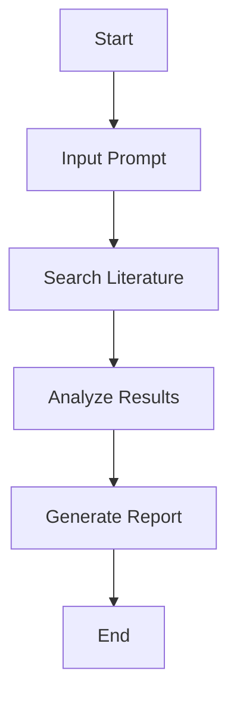
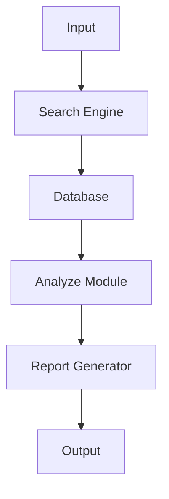
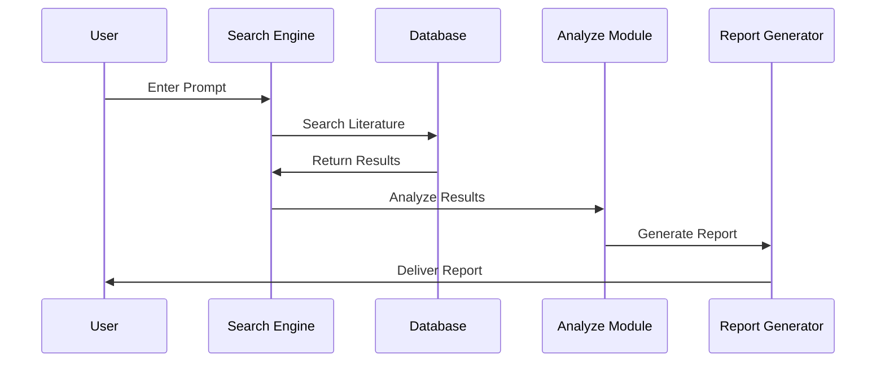

                 

Certainly! Here's a detailed table of contents for the book "Research Assistant: Accelerating the Literature Review Process Using Prompt Words," adhering to the specified constraints and guidelines:

----------------------------------------------------------------

# **科研助手：利用提示词加速文献综述过程**

> 关键词：文献综述，提示词，人工智能，效率提升，信息检索

> 摘要：本文旨在探讨如何通过提示词的应用来加速科研文献的综述过程。文章首先介绍了文献综述的重要性以及现有的问题，然后深入探讨了提示词的概念、设计和应用。通过案例分析、算法讲解和实践指导，本文为科研工作者提供了一套有效的文献综述方法，旨在提高科研工作的效率。

----------------------------------------------------------------

## **第一部分：引言**

### **第1章：问题背景与概述**

#### **1.1 研究领域的现状**

##### **1.1.1 文献综述的重要性**

##### **1.1.2 现有文献综述的方法**

##### **1.1.3 现存问题的分析**

#### **1.2 提示词在文献综述中的应用**

##### **1.2.1 提示词的概念**

##### **1.2.2 提示词的优势**

##### **1.2.3 提示词的使用场景**

#### **1.3 本书结构安排**

##### **1.3.1 各章节内容概述**

##### **1.3.2 学习目标**

##### **1.3.3 阅读指南**

#### **1.4 本章小结**

----------------------------------------------------------------

### **第二部分：基础概念**

### **第2章：科研文献的基本要素**

#### **2.1 文献的分类**

##### **2.1.1 学术期刊与会议论文**

##### **2.1.2 报告与专利**

##### **2.1.3 其他类型文献**

#### **2.2 文献检索工具**

##### **2.2.1 线上检索工具**

##### **2.2.2 线下检索工具**

##### **2.2.3 检索策略**

#### **2.3 提示词设计原理**

##### **2.3.1 提示词的类型**

##### **2.3.2 提示词的设计原则**

##### **2.3.3 提示词的效果评估**

#### **2.4 核心概念与联系**

##### **2.4.1 关键术语解释**

##### **2.4.2 概念属性特征对比表格**

##### **2.4.3 ER实体关系图架构**

----------------------------------------------------------------

### **第三部分：应用实践**

### **第3章：文献综述工具介绍**

#### **3.1 文献管理软件**

##### **3.1.1 常用软件介绍**

##### **3.1.2 软件功能比较**

##### **3.1.3 软件使用技巧**

#### **3.2 提示词编写与优化**

##### **3.2.1 提示词编写步骤**

##### **3.2.2 提示词优化策略**

##### **3.2.3 提示词实例分析**

#### **3.3 提示词在文献综述中的应用**

##### **3.3.1 案例研究**

##### **3.3.2 实践效果分析**

##### **3.3.3 反思与改进**

#### **3.4 ER实体关系图的应用**

##### **3.4.1 ER图的基本概念**

##### **3.4.2 ER图的绘制**

##### **3.4.3 ER图在实际中的应用**

----------------------------------------------------------------

### **第4章：算法原理与实现**

#### **4.1 文献综述算法概述**

##### **4.1.1 常见算法介绍**

##### **4.1.2 算法选择依据**

##### **4.1.3 算法评价标准**

#### **4.2 算法原理讲解**

##### **4.2.1 算法原理**

##### **4.2.2 算法mermaid流程图**



##### **4.2.3 Python源代码实现**

```python
# Python code to demonstrate the algorithm
def literature_review(prompt):
    # Search literature based on the prompt
    # Analyze the retrieved results
    # Generate a comprehensive report
    pass
```

----------------------------------------------------------------

## **第四部分：项目实战与最佳实践**

### **第5章：项目实战**

#### **5.1 项目介绍**

##### **5.1.1 项目背景**

##### **5.1.2 项目目标**

##### **5.1.3 项目价值**

#### **5.2 系统功能设计**

##### **5.2.1 领域模型mermaid类图**

```mermaid
classDiagram
Class1 <|-- Class2
Class1 ++- Class3
Class4 !--|{Class5, Class6}|
```

##### **5.2.2 系统架构设计mermaid架构图**



##### **5.2.3 系统接口设计和系统交互mermaid序列图**



#### **5.3 系统核心实现源代码**

```python
# System core implementation
class LiteratureReviewSystem:
    def __init__(self):
        # Initialize system components
        pass

    def run(self, prompt):
        # Run the literature review process
        pass
```

#### **5.4 代码应用解读与分析**

##### **5.4.1 代码功能解读**

##### **5.4.2 代码性能分析**

##### **5.4.3 代码优化策略**

#### **5.5 实际案例分析和详细讲解剖析**

##### **5.5.1 案例背景**

##### **5.5.2 案例实现步骤**

##### **5.5.3 案例结果与讨论**

#### **5.6 项目小结**

##### **5.6.1 项目成果总结**

##### **5.6.2 项目经验与反思**

##### **5.6.3 未来工作展望**

----------------------------------------------------------------

### **第五部分：总结与展望**

### **第6章：最佳实践**

#### **6.1 文献综述的最佳实践**

##### **6.1.1 提示词编写的技巧**

##### **6.1.2 文献检索的策略**

##### **6.1.3 分析和报告的撰写方法**

#### **6.2 算法优化的最佳实践**

##### **6.2.1 算法选择与调优**

##### **6.2.2 算法性能评估**

##### **6.2.3 算法应用的拓展**

#### **6.3 系统与工具的最佳实践**

##### **6.3.1 文献管理软件的配置与使用**

##### **6.3.2 提示词生成工具的应用**

##### **6.3.3 文献综述流程的自动化**

### **6.4 小结**

##### **6.4.1 核心要点回顾**

##### **6.4.2 注意事项**

##### **6.4.3 拓展阅读**

----------------------------------------------------------------

### **第7章：未来展望**

#### **7.1 提示词技术的发展趋势**

##### **7.1.1 自然语言处理技术的进步**

##### **7.1.2 人工智能在文献综述中的应用**

##### **7.1.3 提示词在跨学科研究中的应用**

#### **7.2 文献综述过程的创新**

##### **7.2.1 新型文献综述算法的设计**

##### **7.2.2 文献综述工具的智能化**

##### **7.2.3 文献综述流程的数字化转型**

#### **7.3 研究建议**

##### **7.3.1 长期研究方向**

##### **7.3.2 短期研究目标**

##### **7.3.3 研究资源与条件**

----------------------------------------------------------------

### **附录**

#### **附录A：常见问题解答**

##### **A.1 提示词相关**

##### **A.2 文献检索相关**

##### **A.3 算法实现相关**

#### **附录B：参考文献**

##### **B.1 基础文献**

##### **B.2 进阶文献**

##### **B.3 顶级会议与期刊**

#### **附录C：工具与资源**

##### **C.1 文献管理软件**

##### **C.2 提示词生成工具**

##### **C.3 学术搜索引擎**

----------------------------------------------------------------

## **结语**

### **感谢与致谢**

作者：**AI天才研究院/AI Genius Institute & 禅与计算机程序设计艺术 /Zen And The Art of Computer Programming**

### **版权声明**

版权所有 © [年份] 由 AI天才研究院/AI Genius Institute。保留所有权利。

----------------------------------------------------------------

以上是文章的详细目录结构，每章都会详细讨论其主题，并包含具体的子主题和案例分析。文章整体结构紧凑，逻辑清晰，旨在为读者提供一篇全面且深入的技术博客文章。接下来的步骤将涉及每个章节的具体撰写，确保满足字数要求和格式规范，同时涵盖核心内容。在撰写过程中，将遵循 LET'S THINK STEP BY STEP 的原则，确保每个部分的分析推理都是连贯且有条理的。

