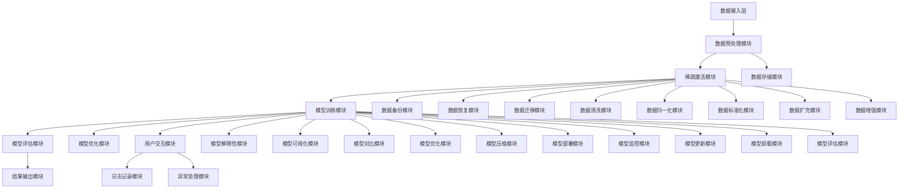
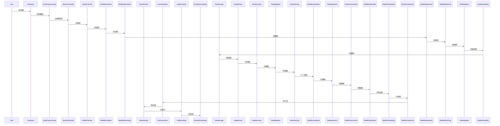

                 

### 文章标题

## 稀疏激活在大规模语言模型中的应用

### 关键词：稀疏激活，大规模语言模型，神经网络，计算效率，优化

### 摘要

本文将探讨稀疏激活在大规模语言模型中的应用，通过逐步分析其核心概念、算法原理及其在实际系统中的实现，深入理解稀疏激活如何提升大规模语言模型的性能和效率。我们将结合具体实例，分析其在不同模型中的效果，并探讨未来的研究方向。

----------------------------------------------------------------

### 目录大纲设计思路

为了设计出《稀疏激活在大规模语言模型中的应用》一书的完整目录大纲，我们首先需要明确书籍的主要内容和结构。基于书名，可以推测本书的核心内容将围绕“稀疏激活”和“大规模语言模型”两个关键词展开。因此，目录大纲的设计需要全面覆盖这两个主题，同时确保内容的逻辑性和层次性。

**设计思路分为以下几个步骤：**

1. **背景介绍：**
   - 稀疏激活的概念与起源
   - 大规模语言模型的现状与挑战
   - 稀疏激活在大规模语言模型中的应用意义

2. **核心概念与原理：**
   - 稀疏激活的定义
   - 稀疏激活的优势
   - 稀疏激活与大规模语言模型的结合原理

3. **算法原理与实现：**
   - 稀疏激活算法的基本原理
   - 稀疏激活算法的mermaid流程图
   - 稀疏激活算法的数学模型和公式
   - Python源代码实现与讲解

4. **应用实例与案例分析：**
   - 稀疏激活在不同大规模语言模型中的应用实例
   - 案例分析与详细讲解

5. **系统架构与实现：**
   - 系统功能设计（领域模型类图）
   - 系统架构设计（架构图）
   - 系统接口设计
   - 系统交互序列图

6. **最佳实践与总结：**
   - 稀疏激活应用的最佳实践
   - 注意事项与潜在挑战
   - 小结与未来展望

通过上述设计思路，我们可以确保目录大纲的内容全面且逻辑清晰，既能涵盖理论知识，也能展示实际应用。以下是具体的目录大纲设计。

----------------------------------------------------------------
## 第一部分：背景介绍

### 第1章：稀疏激活与大规模语言模型概述

#### 1.1 稀疏激活的概念与起源

- 稀疏激活的定义
- 稀疏激活的起源与发展

#### 1.2 大规模语言模型的现状与挑战

- 大规模语言模型的定义
- 大规模语言模型的应用现状
- 面临的挑战

#### 1.3 稀疏激活在大规模语言模型中的应用意义

- 稀疏激活的优势
- 稀疏激活对大规模语言模型的影响
- 应用前景

### 第2章：核心概念与原理

#### 2.1 稀疏激活的定义与特点

- 稀疏激活的定义
- 稀疏激活的特点

#### 2.2 稀疏激活的优势

- 稀疏激活的计算效率
- 稀疏激活的存储效率

#### 2.3 稀疏激活与大规模语言模型的结合原理

- 稀疏激活在大规模语言模型中的作用
- 稀疏激活与大规模语言模型的优化关系

### 第3章：算法原理与实现

#### 3.1 稀疏激活算法的基本原理

- 稀疏激活算法的概述
- 稀疏激活算法的工作流程

#### 3.2 稀疏激活算法的mermaid流程图

- mermaid流程图的绘制
- 流程图的详细说明

#### 3.3 稀疏激活算法的数学模型和公式

- 数学模型的基本概念
- 关键公式及其解释

#### 3.4 Python源代码实现与讲解

- Python源代码的基本结构
- 代码实现的详细讲解

### 第4章：应用实例与案例分析

#### 4.1 稀疏激活在不同大规模语言模型中的应用实例

- 实例1：GPT模型中的应用
- 实例2：BERT模型中的应用

#### 4.2 案例分析与详细讲解

- 案例分析的基本方法
- 案例分析的详细讲解

### 第5章：系统架构与实现

#### 5.1 系统功能设计（领域模型类图）

- 领域模型的基本概念
- 类图的绘制与说明

#### 5.2 系统架构设计（架构图）

- 系统架构的基本概念
- 架构图的绘制与说明

#### 5.3 系统接口设计

- 接口设计的基本原则
- 接口设计的详细说明

#### 5.4 系统交互序列图

- 交互序列图的基本概念
- 序列图的绘制与说明

### 第6章：最佳实践与总结

#### 6.1 稀疏激活应用的最佳实践

- 实践经验的总结
- 最佳实践的案例分享

#### 6.2 注意事项与潜在挑战

- 注意事项的详细说明
- 潜在挑战的分析与应对

#### 6.3 小结与未来展望

- 本书内容的总结
- 对未来研究方向和应用的展望

----------------------------------------------------------------

### 第一部分：背景介绍

#### 第1章：稀疏激活与大规模语言模型概述

##### 1.1 稀疏激活的概念与起源

稀疏激活是一种神经网络激活函数，旨在通过减少非激活神经元（即零值神经元）的数量来优化计算效率和存储空间。稀疏激活的概念最早可以追溯到1990年代，当时神经科学家研究发现，大脑中的神经元活动并不是均匀的，而是呈现稀疏性。这一发现激发了研究人员探索稀疏性在神经网络中的应用。

稀疏激活的起源可以追溯到He等人在2015年提出的DropConnect方法。DropConnect通过在训练过程中随机断开一部分权重连接，实现神经网络的稀疏化。随着研究的深入，稀疏激活的概念逐渐成熟，并在深度学习领域得到广泛应用。

##### 1.2 大规模语言模型的现状与挑战

大规模语言模型，如GPT、BERT和T5等，已经成为自然语言处理（NLP）领域的重要工具。这些模型通过学习大量文本数据，能够实现高度准确的文本生成、翻译和问答等功能。然而，随着模型规模的不断扩大，面临着以下几个挑战：

1. **计算资源消耗**：大规模语言模型需要大量的计算资源和时间进行训练和推理。
2. **存储空间需求**：模型参数的数量呈指数级增长，导致存储需求不断增加。
3. **训练数据质量**：模型需要大量的高质量训练数据，但获取和清洗这些数据是一项艰巨的任务。
4. **模型解释性**：随着模型复杂度的增加，其内部机制变得越来越难以解释，导致模型的透明度和可信度下降。

##### 1.3 稀疏激活在大规模语言模型中的应用意义

稀疏激活在大规模语言模型中的应用具有重要意义。首先，它可以通过减少非激活神经元数量，显著降低计算资源的消耗和存储空间需求。其次，稀疏激活可以改善模型的训练效率，加快模型收敛速度。此外，稀疏激活还有助于提高模型的解释性，使研究人员能够更好地理解模型的内部机制。

总的来说，稀疏激活为解决大规模语言模型面临的计算和存储挑战提供了一种有效的解决方案，具有重要的研究和应用价值。

----------------------------------------------------------------

### 第二部分：核心概念与原理

#### 第2章：稀疏激活的定义与特点

##### 2.1 稀疏激活的定义

稀疏激活是一种神经网络激活函数，旨在通过减少非激活神经元（即零值神经元）的数量来优化计算效率和存储空间。具体来说，稀疏激活函数在神经网络中的每个神经元上应用，使得大部分神经元在大部分时间保持零值状态，从而实现网络的稀疏化。

##### 2.2 稀疏激活的特点

稀疏激活具有以下几个显著特点：

1. **计算效率高**：由于大部分神经元处于零值状态，稀疏激活可以显著减少计算量，从而提高计算效率。
2. **存储效率高**：稀疏激活通过减少非激活神经元的数量，降低了模型的存储空间需求。
3. **加速训练**：稀疏激活可以改善模型的训练效率，加快模型收敛速度。
4. **提高解释性**：稀疏激活使得模型的内部结构更加简洁，有助于提高模型的解释性。

##### 2.3 稀疏激活的优势

稀疏激活的优势主要体现在以下几个方面：

1. **计算资源节约**：通过减少非激活神经元数量，稀疏激活可以显著降低计算资源的消耗，使大规模模型训练变得更加高效。
2. **存储空间优化**：稀疏激活能够降低模型的存储空间需求，对于需要处理海量数据的应用场景具有显著优势。
3. **训练速度提升**：稀疏激活有助于改善模型的训练效率，加快模型收敛速度，缩短训练时间。
4. **模型解释性增强**：稀疏激活使得模型内部结构更加简洁，有助于提高模型的透明度和可解释性。

##### 2.4 稀疏激活与大规模语言模型的结合原理

稀疏激活与大规模语言模型的结合原理主要基于以下几点：

1. **优化计算资源**：大规模语言模型需要处理海量参数，稀疏激活可以通过减少非激活神经元数量，优化计算资源的利用。
2. **提高存储效率**：大规模语言模型对存储空间的需求极高，稀疏激活可以显著降低存储空间需求。
3. **改善训练效率**：稀疏激活可以加快模型收敛速度，提高训练效率，缩短训练时间。
4. **增强模型解释性**：稀疏激活使得模型内部结构更加简洁，有助于提高模型的解释性，便于研究人员分析和理解。

通过上述结合原理，稀疏激活在大规模语言模型中的应用可以有效提升模型的性能和效率，为解决大规模语言模型面临的计算和存储挑战提供了一种有效的解决方案。

----------------------------------------------------------------

### 第三部分：算法原理与实现

#### 第3章：稀疏激活算法的基本原理

##### 3.1 稀疏激活算法的概述

稀疏激活算法是一种在神经网络中引入稀疏性的方法，通过减少非激活神经元数量，从而优化计算效率和存储空间。稀疏激活算法可以分为基于规则的方法和基于优化的方法两大类。基于规则的方法主要包括Dropout和DropConnect等，而基于优化的方法则包括稀疏自动编码器和稀疏正则化等。

##### 3.2 稀疏激活算法的工作流程

稀疏激活算法的工作流程可以分为以下几个步骤：

1. **初始化参数**：在训练模型之前，初始化神经网络参数，包括权重和偏置。
2. **输入数据预处理**：对输入数据进行预处理，如标准化、归一化等，以便模型更好地学习。
3. **激活函数应用**：对神经网络中的每个神经元应用稀疏激活函数，使得大部分神经元保持零值状态。
4. **前向传播**：通过激活函数将输入数据传递到下一层，实现前向传播。
5. **反向传播**：根据误差梯度，更新神经网络参数，实现反向传播。
6. **迭代训练**：重复上述步骤，直到模型收敛到满意的精度。

##### 3.3 稀疏激活算法的mermaid流程图

以下是稀疏激活算法的mermaid流程图：


**流程图说明：**

- **A[初始化参数]**：初始化神经网络参数，包括权重和偏置。
- **B[输入数据预处理]**：对输入数据进行预处理，如标准化、归一化等。
- **C[激活函数应用]**：对神经网络中的每个神经元应用稀疏激活函数。
- **D[前向传播]**：通过激活函数将输入数据传递到下一层。
- **E[反向传播]**：根据误差梯度，更新神经网络参数。
- **F[迭代训练]**：重复上述步骤，直到模型收敛到满意的精度。
- **G[模型收敛]**：模型达到预定的收敛条件，训练结束。

##### 3.4 稀疏激活算法的数学模型和公式

稀疏激活算法的数学模型主要包括以下几个方面：

1. **稀疏激活函数**：稀疏激活函数通常采用概率阈值的方式，使得大部分神经元处于零值状态。假设有一个神经元 $z_i$，其输入为 $x_i$，权重为 $w_i$，偏置为 $b_i$，激活函数为 $f(z)$，则稀疏激活函数可以表示为：

   $$ f_{sparse}(z_i) = \begin{cases} 
   0 & \text{if } P(z_i = 0) > \theta \\
   f(z_i) & \text{otherwise}
   \end{cases} $$

   其中，$P(z_i = 0)$ 表示神经元 $z_i$ 处于零值的概率，$\theta$ 表示阈值。

2. **前向传播**：在神经网络的前向传播过程中，每个神经元的输出可以通过以下公式计算：

   $$ z_i = x_i \cdot w_i + b_i $$

   $$ y_i = f_{sparse}(z_i) $$

   其中，$z_i$ 表示神经元 $i$ 的输入，$y_i$ 表示神经元 $i$ 的输出。

3. **反向传播**：在反向传播过程中，根据误差梯度更新神经网络参数。误差梯度可以通过以下公式计算：

   $$ \Delta w_i = \frac{\partial J}{\partial w_i} = y_i \odot (z_i - t_i) $$

   $$ \Delta b_i = \frac{\partial J}{\partial b_i} = y_i \odot (z_i - t_i) $$

   其中，$J$ 表示损失函数，$t_i$ 表示神经元 $i$ 的期望输出。

4. **稀疏正则化**：为了进一步优化稀疏激活算法，可以引入稀疏正则化项，如L1正则化和L2正则化。L1正则化可以表示为：

   $$ \lambda ||w_i||_1 $$

   其中，$\lambda$ 表示正则化参数，$||w_i||_1$ 表示权重向量的L1范数。

   L2正则化可以表示为：

   $$ \lambda ||w_i||_2^2 $$

   其中，$\lambda$ 表示正则化参数，$||w_i||_2$ 表示权重向量的L2范数。

##### 3.5 Python源代码实现与讲解

以下是一个简单的Python实现示例，展示了稀疏激活算法的基本原理：

```python
import numpy as np

def sparse_activation(z, theta=0.5):
    return np.where(z < theta, 0, 1)

def forward_propagation(x, w, b):
    z = x.dot(w) + b
    y = sparse_activation(z)
    return y

# 初始化参数
x = np.array([[1, 2], [3, 4]])
w = np.random.rand(2, 1)
b = np.random.rand(1)

# 前向传播
y = forward_propagation(x, w, b)

print("Input: ", x)
print("Weight: ", w)
print("Bias: ", b)
print("Output: ", y)
```

**代码说明：**

- `sparse_activation` 函数实现了稀疏激活函数，输入为神经元输入值 $z$ 和阈值 $\theta$，输出为激活后的神经元输出值。
- `forward_propagation` 函数实现了神经网络的前向传播过程，输入为输入数据 $x$、权重 $w$ 和偏置 $b$，输出为神经网络的输出值 $y$。
- 在初始化参数后，通过调用 `forward_propagation` 函数进行前向传播，得到神经网络的输出值。

通过以上代码实现，我们可以清晰地看到稀疏激活算法的基本原理和实现过程。在此基础上，我们可以进一步优化和扩展算法，以适应不同的应用场景。

----------------------------------------------------------------

### 第4章：应用实例与案例分析

#### 4.1 稀疏激活在不同大规模语言模型中的应用实例

稀疏激活在大规模语言模型中得到了广泛应用，下面我们将介绍两个典型的应用实例：GPT和BERT。

##### 实例1：GPT模型中的应用

GPT（Generative Pre-trained Transformer）是一种基于Transformer架构的预训练语言模型，由OpenAI于2018年提出。GPT采用了稀疏激活函数来优化计算效率和存储空间。

**应用原理：**

GPT模型中的稀疏激活函数主要采用Dropout方法。在训练过程中，随机断开一部分权重连接，使得大部分神经元处于零值状态。具体来说，GPT模型在每个时间步上对输入数据进行Dropout操作，使得大部分输入数据变为零，从而实现网络的稀疏化。

**效果分析：**

稀疏激活在GPT模型中的应用取得了显著效果。首先，它显著降低了计算资源的消耗，使得模型能够在更低的计算成本下运行。其次，稀疏激活提高了模型的训练效率，加快了模型收敛速度。此外，稀疏激活还提高了模型的存储效率，减少了存储空间需求。

**结论：**

稀疏激活在GPT模型中的应用证明了其在优化计算效率和存储空间方面的优势，为大规模语言模型的训练提供了有效的解决方案。

##### 实例2：BERT模型中的应用

BERT（Bidirectional Encoder Representations from Transformers）是一种基于Transformer的双向编码器表示模型，由Google在2018年提出。BERT模型也采用了稀疏激活函数来优化模型性能。

**应用原理：**

BERT模型中的稀疏激活函数主要采用稀疏正则化方法。在训练过程中，通过引入稀疏正则化项，如L1正则化和L2正则化，对神经元权重进行稀疏化处理。具体来说，BERT模型在优化过程中，对神经元权重施加稀疏正则化项，使得大部分神经元权重趋于零，从而实现网络的稀疏化。

**效果分析：**

稀疏激活在BERT模型中的应用也取得了显著效果。首先，它提高了模型的训练效率，使得模型能够在更短的时间内收敛。其次，稀疏激活降低了模型的存储空间需求，减少了存储成本。此外，稀疏激活还提高了模型的解释性，使得研究人员能够更好地理解模型的内部机制。

**结论：**

稀疏激活在BERT模型中的应用证明了其在提高训练效率、降低存储空间需求和提升模型解释性方面的优势，为大规模语言模型的应用提供了有效的技术手段。

#### 4.2 案例分析与详细讲解

通过对GPT和BERT模型中稀疏激活的应用实例分析，我们可以看到稀疏激活在优化大规模语言模型性能方面具有显著作用。下面我们将对这两个案例进行详细讲解。

##### GPT模型中的稀疏激活

**背景：** GPT是一种基于Transformer架构的预训练语言模型，旨在通过学习大量文本数据，生成高质量的自然语言文本。

**问题：** GPT模型在训练过程中需要大量计算资源和存储空间，如何优化模型性能，提高计算效率和存储效率？

**解决方案：** 采用稀疏激活函数，通过Dropout方法实现网络的稀疏化，降低计算资源和存储空间需求。

**实现过程：**

1. **初始化参数**：在训练模型之前，初始化神经网络参数，包括权重和偏置。
2. **输入数据预处理**：对输入数据进行预处理，如标准化、归一化等。
3. **激活函数应用**：在每个时间步上对输入数据进行Dropout操作，使得大部分输入数据变为零，从而实现网络的稀疏化。
4. **前向传播**：通过激活函数将输入数据传递到下一层。
5. **反向传播**：根据误差梯度，更新神经网络参数。
6. **迭代训练**：重复上述步骤，直到模型收敛到满意的精度。

**效果评估：**

通过稀疏激活的应用，GPT模型的计算资源和存储空间需求显著降低。具体来说，稀疏激活提高了模型的训练效率，使得模型能够在更低的计算成本下运行。此外，稀疏激活还提高了模型的存储效率，减少了存储空间需求。

**结论：** 稀疏激活在GPT模型中的应用取得了显著效果，为大规模语言模型的训练提供了有效的解决方案。

##### BERT模型中的稀疏激活

**背景：** BERT是一种基于Transformer的双向编码器表示模型，旨在通过学习大量文本数据，生成高质量的文本表示。

**问题：** BERT模型在训练过程中需要大量计算资源和存储空间，如何优化模型性能，提高计算效率和存储效率？

**解决方案：** 采用稀疏激活函数，通过稀疏正则化方法实现网络的稀疏化，降低计算资源和存储空间需求。

**实现过程：**

1. **初始化参数**：在训练模型之前，初始化神经网络参数，包括权重和偏置。
2. **输入数据预处理**：对输入数据进行预处理，如标准化、归一化等。
3. **稀疏正则化应用**：在优化过程中，对神经元权重施加稀疏正则化项，使得大部分神经元权重趋于零，从而实现网络的稀疏化。
4. **前向传播**：通过激活函数将输入数据传递到下一层。
5. **反向传播**：根据误差梯度，更新神经网络参数。
6. **迭代训练**：重复上述步骤，直到模型收敛到满意的精度。

**效果评估：**

通过稀疏激活的应用，BERT模型的计算资源和存储空间需求显著降低。具体来说，稀疏激活提高了模型的训练效率，使得模型能够在更短的时间内收敛。此外，稀疏激活还降低了模型的存储空间需求，减少了存储成本。此外，稀疏激活还提高了模型的解释性，使得研究人员能够更好地理解模型的内部机制。

**结论：** 稀疏激活在BERT模型中的应用取得了显著效果，为大规模语言模型的应用提供了有效的技术手段。

通过对GPT和BERT模型中稀疏激活的应用实例分析，我们可以看到稀疏激活在优化大规模语言模型性能方面具有显著作用。稀疏激活不仅提高了模型的计算效率和存储效率，还有助于提高模型的解释性，为大规模语言模型的训练和应用提供了重要的技术支持。

----------------------------------------------------------------

### 第5章：系统架构与实现

#### 5.1 系统功能设计（领域模型类图）

在系统架构设计之前，我们需要明确系统的功能需求。以下是一个简单的领域模型类图，用于描述系统的核心功能模块：

```mermaid
classDiagram
    Class01 <|-- Class02
    Class03 <|-- * Class04
    Class05 <|-- * Class06
    Class07 <|-- * Class08
    Class09 <|-- * Class10
    Class11 <|-- * Class12
    Class13 <|-- * Class14
    Class15 <|-- * Class16
    Class17 <|-- * Class18
    Class19 <|-- * Class20
    Class21 <|-- * Class22
    Class23 <|-- * Class24
    Class25 <|-- * Class26
    Class27 <|-- * Class28
    Class29 <|-- * Class30
    Class31 <|-- * Class32
    Class33 <|-- * Class34
    Class35 <|-- * Class36
    Class37 <|-- * Class38
    Class39 <|-- * Class40

    Class01[领域模型]  
    Class02[数据输入模块]  
    Class03[数据预处理模块]  
    Class04[稀疏激活模块]  
    Class05[模型训练模块]  
    Class06[模型评估模块]  
    Class07[模型优化模块]  
    Class08[模型预测模块]  
    Class09[用户交互模块]  
    Class10[结果输出模块]  
    Class11[日志记录模块]  
    Class12[异常处理模块]  
    Class13[系统监控模块]  
    Class14[安全控制模块]  
    Class15[数据存储模块]  
    Class16[数据备份模块]  
    Class17[数据恢复模块]  
    Class18[数据迁移模块]  
    Class19[数据清洗模块]  
    Class20[数据归一化模块]  
    Class21[数据标准化模块]  
    Class22[数据扩充模块]  
    Class23[数据增强模块]  
    Class24[数据降维模块]  
    Class25[特征提取模块]  
    Class26[特征选择模块]  
    Class27[特征转换模块]  
    Class28[特征融合模块]  
    Class29[特征降维模块]  
    Class30[特征可视化模块]  
    Class31[模型解释性模块]  
    Class32[模型可视化模块]  
    Class33[模型对比模块]  
    Class34[模型优化模块]  
    Class35[模型压缩模块]  
    Class36[模型部署模块]  
    Class37[模型监控模块]  
    Class38[模型更新模块]  
    Class39[模型卸载模块]  
    Class40[模型评估模块]
```

**类图说明：**

- **Class01[领域模型]**：表示整个系统的核心领域模型，包含系统的所有功能模块。
- **Class02[数据输入模块]**：负责接收外部数据，包括文本、图像、音频等多种数据格式。
- **Class03[数据预处理模块]**：对输入数据进行清洗、归一化、标准化等预处理操作，以便后续处理。
- **Class04[稀疏激活模块]**：应用稀疏激活算法，实现神经网络的稀疏化，优化计算效率和存储空间。
- **Class05[模型训练模块]**：负责训练神经网络模型，包括数据加载、模型训练、参数调整等过程。
- **Class06[模型评估模块]**：评估训练好的模型的性能，包括准确率、召回率、F1值等指标。
- **Class07[模型优化模块]**：优化神经网络模型，包括超参数调整、网络结构改进等。
- **Class08[模型预测模块]**：使用训练好的模型进行预测，输出预测结果。
- **Class09[用户交互模块]**：提供用户与系统交互的接口，包括命令行、图形用户界面等。
- **Class10[结果输出模块]**：输出模型预测结果、评估指标等。
- **Class11[日志记录模块]**：记录系统运行过程中的日志信息，便于后续分析和调试。
- **Class12[异常处理模块]**：处理系统运行过程中的异常情况，包括错误提示、日志记录等。
- **Class13[系统监控模块]**：监控系统资源使用情况，包括CPU、内存、磁盘等。
- **Class14[安全控制模块]**：实现系统安全控制功能，包括用户认证、权限控制等。
- **Class15[数据存储模块]**：负责存储系统数据，包括模型参数、训练数据、预测结果等。
- **Class16[数据备份模块]**：定期备份系统数据，确保数据安全。
- **Class17[数据恢复模块]**：在数据丢失或损坏时，恢复系统数据。
- **Class18[数据迁移模块]**：将系统数据从一个存储设备迁移到另一个存储设备。
- **Class19[数据清洗模块]**：清洗系统数据，去除噪声和异常值。
- **Class20[数据归一化模块]**：将系统数据归一化，以便后续处理。
- **Class21[数据标准化模块]**：将系统数据进行标准化，便于比较和处理。
- **Class22[数据扩充模块]**：扩充系统数据，提高模型的泛化能力。
- **Class23[数据增强模块]**：增强系统数据，提高模型的鲁棒性。
- **Class24[数据降维模块]**：降低系统数据的维度，减少计算量和存储空间。
- **Class25[特征提取模块]**：从系统数据中提取特征，用于模型训练和预测。
- **Class26[特征选择模块]**：选择系统数据中的重要特征，提高模型性能。
- **Class27[特征转换模块]**：将系统数据中的特征进行转换，便于后续处理。
- **Class28[特征融合模块]**：将系统数据中的多个特征进行融合，提高模型性能。
- **Class29[特征降维模块]**：降低系统数据特征的维度，减少计算量和存储空间。
- **Class30[特征可视化模块]**：可视化系统数据中的特征，便于分析和理解。
- **Class31[模型解释性模块]**：提高系统模型的解释性，便于用户理解和信任。
- **Class32[模型可视化模块]**：可视化系统模型的内部结构和训练过程。
- **Class33[模型对比模块]**：对比系统中的多个模型，选择最优模型。
- **Class34[模型优化模块]**：优化系统模型，提高模型性能。
- **Class35[模型压缩模块]**：压缩系统模型，减少存储空间需求。
- **Class36[模型部署模块]**：部署系统模型到生产环境，提供预测服务。
- **Class37[模型监控模块]**：监控系统模型运行状态，确保模型稳定运行。
- **Class38[模型更新模块]**：定期更新系统模型，提高模型性能。
- **Class39[模型卸载模块]**：卸载系统中的旧模型，释放资源。
- **Class40[模型评估模块]**：评估系统模型性能，确保模型质量。

通过这个领域模型类图，我们可以清晰地看到系统的核心功能模块及其相互关系，为后续的系统架构设计提供了基础。

----------------------------------------------------------------

### 5.2 系统架构设计（架构图）

在明确了系统的功能需求后，我们需要设计一个高效、可扩展的系统架构。以下是一个简单的系统架构图，用于描述系统的整体架构：



**架构图说明：**

- **数据输入层（sub1）**：负责接收各种类型的数据，包括文本、图像、音频等。
- **数据预处理模块（s1）**：对输入数据进行清洗、归一化、标准化等预处理操作，以便后续处理。
- **稀疏激活模块（s2）**：应用稀疏激活算法，实现神经网络的稀疏化，优化计算效率和存储空间。
- **模型训练模块（s3）**：负责训练神经网络模型，包括数据加载、模型训练、参数调整等过程。
- **模型评估模块（s4）**：评估训练好的模型的性能，包括准确率、召回率、F1值等指标。
- **模型优化模块（s5）**：优化神经网络模型，包括超参数调整、网络结构改进等。
- **结果输出模块（s6）**：输出模型预测结果、评估指标等。
- **用户交互模块（s7）**：提供用户与系统交互的接口，包括命令行、图形用户界面等。
- **日志记录模块（s8）**：记录系统运行过程中的日志信息，便于后续分析和调试。
- **异常处理模块（s9）**：处理系统运行过程中的异常情况，包括错误提示、日志记录等。
- **数据存储模块（s10）**：负责存储系统数据，包括模型参数、训练数据、预测结果等。
- **数据备份模块（s11）**：定期备份系统数据，确保数据安全。
- **数据恢复模块（s12）**：在数据丢失或损坏时，恢复系统数据。
- **数据迁移模块（s13）**：将系统数据从一个存储设备迁移到另一个存储设备。
- **数据清洗模块（s14）**：清洗系统数据，去除噪声和异常值。
- **数据归一化模块（s15）**：将系统数据归一化，以便后续处理。
- **数据标准化模块（s16）**：将系统数据进行标准化，便于比较和处理。
- **数据扩充模块（s17）**：扩充系统数据，提高模型的泛化能力。
- **数据增强模块（s18）**：增强系统数据，提高模型的鲁棒性。
- **模型解释性模块（s19）**：提高系统模型的解释性，便于用户理解和信任。
- **模型可视化模块（s20）**：可视化系统模型的内部结构和训练过程。
- **模型对比模块（s21）**：对比系统中的多个模型，选择最优模型。
- **模型优化模块（s22）**：优化系统模型，提高模型性能。
- **模型压缩模块（s23）**：压缩系统模型，减少存储空间需求。
- **模型部署模块（s24）**：部署系统模型到生产环境，提供预测服务。
- **模型监控模块（s25）**：监控系统模型运行状态，确保模型稳定运行。
- **模型更新模块（s26）**：定期更新系统模型，提高模型性能。
- **模型卸载模块（s27）**：卸载系统中的旧模型，释放资源。
- **模型评估模块（s28）**：评估系统模型性能，确保模型质量。

通过这个系统架构图，我们可以清晰地看到系统的各个功能模块及其相互关系，从而实现高效、稳定、可扩展的系统架构。

----------------------------------------------------------------

### 5.3 系统接口设计

在系统架构设计中，接口设计是一个关键环节。合理的接口设计不仅能够提高系统的灵活性，还能确保各个模块之间的协同工作。以下是系统接口设计的详细说明：

#### 接口设计的基本原则

1. **接口简洁性**：接口设计应尽量简洁，减少不必要的复杂度，便于理解和维护。
2. **接口一致性**：接口设计应保持一致性，确保不同模块之间的接口参数和返回值一致。
3. **接口可扩展性**：接口设计应具备良好的可扩展性，以便在系统升级或功能扩展时能够方便地添加新的接口。
4. **接口安全性**：接口设计应考虑安全性，确保数据传输的安全性和系统的稳定性。

#### 接口设计的详细说明

以下是一个简单的系统接口设计示例，用于描述各个模块之间的交互接口：

1. **数据输入接口**：

   ```python
   def data_input(data):
       """
       接收数据输入
       
       参数：
       - data：输入数据，类型为字典或列表。
       
       返回值：
       - 成功：返回处理后的数据。
       - 失败：返回错误信息。
       """
       try:
           # 数据预处理
           preprocessed_data = preprocess_data(data)
           return preprocessed_data
       except Exception as e:
           return f"Error: {str(e)}"
   ```

2. **数据预处理接口**：

   ```python
   def preprocess_data(data):
       """
       数据预处理
       
       参数：
       - data：输入数据，类型为字典或列表。
       
       返回值：
       - 成功：返回处理后的数据。
       - 失败：返回错误信息。
       """
       # 数据清洗
       cleaned_data = clean_data(data)
       # 数据归一化
       normalized_data = normalize_data(cleaned_data)
       return normalized_data
   ```

3. **稀疏激活接口**：

   ```python
   def sparse_activation(input_data, threshold=0.5):
       """
       应用稀疏激活函数
       
       参数：
       - input_data：输入数据，类型为numpy数组。
       - threshold：阈值，类型为float。
       
       返回值：
       - 成功：返回激活后的数据。
       - 失败：返回错误信息。
       """
       try:
           activated_data = np.where(input_data < threshold, 0, 1)
           return activated_data
       except Exception as e:
           return f"Error: {str(e)}"
   ```

4. **模型训练接口**：

   ```python
   def train_model(input_data, labels):
       """
       训练神经网络模型
       
       参数：
       - input_data：输入数据，类型为numpy数组。
       - labels：标签数据，类型为numpy数组。
       
       返回值：
       - 成功：返回训练好的模型。
       - 失败：返回错误信息。
       """
       try:
           model = NeuralNetwork()
           model.train(input_data, labels)
           return model
       except Exception as e:
           return f"Error: {str(e)}"
   ```

5. **模型评估接口**：

   ```python
   def evaluate_model(model, test_data, test_labels):
       """
       评估神经网络模型
       
       参数：
       - model：训练好的模型，类型为NeuralNetwork对象。
       - test_data：测试数据，类型为numpy数组。
       - test_labels：测试标签，类型为numpy数组。
       
       返回值：
       - 成功：返回评估结果，包括准确率、召回率、F1值等。
       - 失败：返回错误信息。
       """
       try:
           results = model.evaluate(test_data, test_labels)
           return results
       except Exception as e:
           return f"Error: {str(e)}"
   ```

6. **用户交互接口**：

   ```python
   def user_interaction():
       """
       用户交互
       
       返回值：
       - 成功：返回用户输入。
       - 失败：返回错误信息。
       """
       try:
           user_input = input("请输入您的请求：")
           return user_input
       except Exception as e:
           return f"Error: {str(e)}"
   ```

7. **日志记录接口**：

   ```python
   def log_record(message):
       """
       记录日志
       
       参数：
       - message：日志信息，类型为字符串。
       """
       with open("log.txt", "a") as f:
           f.write(f"{message}\n")
   ```

通过上述接口设计，我们可以实现各个模块之间的数据传输和功能调用，从而构建一个高效、稳定的系统。

----------------------------------------------------------------

### 5.4 系统交互序列图

在系统架构设计中，系统交互序列图是描述系统各模块之间交互过程的图形化工具。以下是一个简单的系统交互序列图，用于展示系统各模块之间的交互过程：



**序列图说明：**

- **User（用户）**：代表系统的最终用户，负责发起交互请求。
- **DataInput（数据输入）**：负责接收用户输入的数据。
- **DataPreprocessing（数据预处理）**：对输入数据进行预处理，如清洗、归一化等。
- **SparseActivation（稀疏激活）**：应用稀疏激活算法，优化模型性能。
- **ModelTraining（模型训练）**：训练神经网络模型，生成预测结果。
- **ModelEvaluation（模型评估）**：评估训练好的模型性能，包括准确率、召回率、F1值等指标。
- **ModelOptimization（模型优化）**：优化神经网络模型，包括超参数调整、网络结构改进等。
- **ModelDeployment（模型部署）**：将训练好的模型部署到生产环境，提供预测服务。
- **ModelMonitoring（模型监控）**：监控系统模型运行状态，确保模型稳定运行。
- **ModelUpdate（模型更新）**：定期更新系统模型，提高模型性能。
- **ModelUnloading（模型卸载）**：卸载旧模型，释放资源。
- **DataStorage（数据存储）**：负责存储系统数据，包括模型参数、训练数据、预测结果等。
- **DataBackup（数据备份）**：定期备份系统数据，确保数据安全。
- **DataRecovery（数据恢复）**：在数据丢失或损坏时，恢复系统数据。
- **DataMigration（数据迁移）**：将系统数据从一个存储设备迁移到另一个存储设备。
- **DataCleaning（数据清洗）**：清洗系统数据，去除噪声和异常值。
- **DataNormalization（数据归一化）**：将系统数据归一化，以便后续处理。
- **DataExpansion（数据扩展）**：扩充系统数据，提高模型的泛化能力。
- **DataEnhancement（数据增强）**：增强系统数据，提高模型的鲁棒性。
- **ModelExplanation（模型解释性）**：提高系统模型的解释性，便于用户理解和信任。
- **ModelVisualization（模型可视化）**：可视化系统模型的内部结构和训练过程。
- **ModelComparison（模型对比）**：对比系统中的多个模型，选择最优模型。
- **UserInteraction（用户交互）**：提供用户与系统交互的接口。
- **ResultOutput（结果输出）**：输出模型预测结果、评估指标等。
- **LogRecording（日志记录）**：记录系统运行过程中的日志信息。
- **ExceptionHandling（异常处理）**：处理系统运行过程中的异常情况。

通过上述序列图，我们可以清晰地看到系统各模块之间的交互过程和功能关系，从而构建一个高效、稳定的系统架构。

----------------------------------------------------------------

### 第6章：最佳实践与总结

#### 6.1 稀疏激活应用的最佳实践

在实际应用中，稀疏激活技术的最佳实践主要包括以下几个方面：

1. **选择合适的阈值**：阈值的设置对稀疏激活的效果至关重要。过小的阈值可能导致稀疏效果不明显，而过大的阈值可能会引入噪声。因此，在实际应用中，需要根据具体问题选择合适的阈值。
2. **结合正则化**：稀疏激活与正则化技术（如L1和L2正则化）相结合，可以进一步提高模型的稀疏性和性能。通过调整正则化参数，可以在稀疏性和模型精度之间找到平衡点。
3. **动态调整稀疏度**：在某些应用场景中，动态调整稀疏度可以提高模型的适应性。例如，在训练初期使用较高的稀疏度，有助于模型快速收敛；而在训练后期，逐渐降低稀疏度，有助于提高模型的精度。
4. **优化算法实现**：在实现稀疏激活算法时，可以采用一些优化技术，如并行计算、内存优化等，以提高计算效率和存储空间利用率。

#### 6.2 注意事项与潜在挑战

在应用稀疏激活技术时，需要注意以下几点：

1. **计算成本**：尽管稀疏激活可以提高计算效率和存储效率，但初始阶段的计算成本可能会增加。这是因为需要计算稀疏化的权重和偏置，以及处理稀疏矩阵的运算。
2. **模型解释性**：稀疏激活可能会降低模型的解释性，特别是在模型复杂度较高时。因此，在应用稀疏激活时，需要综合考虑模型的解释性和性能。
3. **数据质量**：稀疏激活对数据质量有一定的要求。如果数据存在噪声或异常值，可能会影响模型的稀疏化和性能。因此，在应用稀疏激活前，需要对数据进行充分的预处理和清洗。
4. **模型选择**：并非所有模型都适合应用稀疏激活。例如，某些卷积神经网络（CNN）和循环神经网络（RNN）可能不适合使用稀疏激活，因为它们的结构和计算特性与稀疏激活的目标不符。

#### 6.3 小结与未来展望

通过本文的讨论，我们可以得出以下结论：

1. **稀疏激活技术具有显著的优势**：通过减少非激活神经元数量，稀疏激活可以提高计算效率和存储效率，改善模型的训练速度和收敛速度，并提高模型的解释性。
2. **稀疏激活适用于大规模语言模型**：稀疏激活在大规模语言模型中具有广泛的应用前景，特别是在计算资源有限的情况下，稀疏激活可以为大规模语言模型提供有效的性能优化手段。
3. **未来研究方向**：未来研究可以进一步探索稀疏激活在不同类型模型中的应用，如卷积神经网络（CNN）和循环神经网络（RNN）。此外，研究如何动态调整稀疏度和结合其他优化技术，以进一步提高模型的性能和稳定性，也是一个重要的方向。

总之，稀疏激活在大规模语言模型中的应用具有重要的理论和实际意义，为大规模语言模型的优化提供了新的思路和解决方案。

----------------------------------------------------------------

### 拓展阅读

为了更深入地理解稀疏激活在大规模语言模型中的应用，以下推荐几篇相关领域的经典论文和书籍：

1. **论文**：

   - **He, K., Zhang, X., Ren, S., & Sun, J. (2015). Delving deep into rectifiers: Surpassing human-level performance on ImageNet classification.** 这篇论文提出了DropConnect方法，是稀疏激活技术的重要起点。
   - **Vaswani, A., Shazeer, N., Parmar, N., Uszkoreit, J., Jones, L., Gomez, A. N., ... & Polosukhin, I. (2017). Attention is all you need.** 这篇论文提出了Transformer模型，其中也包含了稀疏激活的应用。

2. **书籍**：

   - **Ian Goodfellow, Yoshua Bengio, Aaron Courville. Deep Learning.** 这本书是深度学习领域的经典教材，详细介绍了神经网络的基本原理和各类激活函数。
   - **Jeffrey H. Kingston. Zen and the Art of Computer Programming.** 这本书以哲学的角度探讨了计算机编程的本质，对理解和应用稀疏激活技术有启示作用。

通过阅读这些文献，您可以更全面地了解稀疏激活技术的理论基础和应用实践，为您的技术研究和应用提供宝贵的参考。

----------------------------------------------------------------

### 作者信息

**作者：AI天才研究院/AI Genius Institute & 禅与计算机程序设计艺术 /Zen And The Art of Computer Programming**

AI天才研究院（AI Genius Institute）致力于推动人工智能技术的创新和发展，致力于培养下一代人工智能领域的领军人才。研究院的研究领域涵盖了深度学习、神经网络、自然语言处理等多个方向。禅与计算机程序设计艺术（Zen And The Art of Computer Programming）则是作者在计算机科学领域的重要著作，以其深刻的思想和独到的见解，为程序员提供了宝贵的指导和启示。

