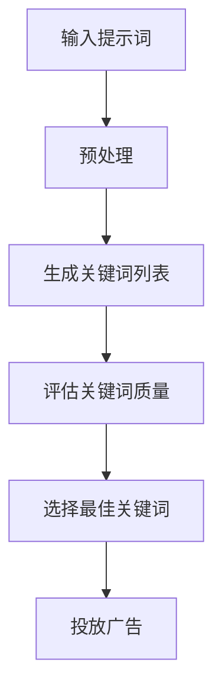

                 

# 《精准广告投放：提示词优化受众定位策略》

关键词：精准广告投放、提示词优化、受众定位策略、算法、数学模型、系统架构设计、项目实战、最佳实践

摘要：本文将深入探讨精准广告投放中的关键要素——提示词优化和受众定位策略。通过一步步的分析和推理，我们将揭示如何在广告投放中运用提示词优化和受众定位策略，以实现广告投放的精准化，提高广告效果。文章将涵盖从背景介绍、核心概念解析、算法原理讲解、数学模型和公式阐述，到系统分析与架构设计、项目实战，以及最佳实践与拓展等多个方面。

## 引言

随着互联网技术的飞速发展，广告投放已经从传统的媒体广告转变为线上数字广告。数字广告的崛起带来了广告投放方式的革新，但同时也带来了新的挑战。在众多的广告投放策略中，精准广告投放成为了许多企业的首选，因为它能够有效地提高广告的投资回报率（ROI）。

### 精准广告投放的意义与挑战

精准广告投放的意义在于其能够根据用户的兴趣、行为和需求，将广告内容准确地推送给目标受众，从而提高广告的转化率。然而，实现精准广告投放面临着一系列挑战，其中最大的挑战之一就是如何优化提示词和准确定位受众。

### 书籍结构安排

本文将按照以下结构进行组织：

1. **精准广告投放概述**：介绍精准广告投放的背景、目的和受众定位的重要性。
2. **提示词优化原理**：分析提示词的概念、优化算法及其在广告投放中的应用。
3. **受众定位策略**：探讨受众定位的核心概念、策略方法及其在实际案例中的应用。
4. **算法与数学模型**：详细阐述提示词优化的算法原理、数学模型和公式，并通过举例说明。
5. **系统分析与设计**：介绍系统的功能设计、架构设计、接口设计和交互设计。
6. **项目实战**：通过实际案例展示如何进行环境安装、系统核心实现和代码应用解读。
7. **最佳实践与拓展**：提供实用建议、总结、注意事项和进一步阅读资料。

## 第1章 精准广告投放概述

### 1.1 广告投放现状分析

广告投放的方式多种多样，包括搜索引擎广告、社交媒体广告、展示广告等。然而，传统的广告投放方式往往面临着受众不精准、广告效果难以评估等问题。

#### 1.1.1 传统广告投放的挑战

1. **受众覆盖不精准**：传统广告投放往往无法精确地定位到目标受众，导致广告资源的浪费。
2. **广告效果评估难**：传统广告投放难以量化广告效果，无法准确评估广告的投资回报率（ROI）。
3. **互动性差**：传统广告投放缺乏与用户的互动，难以形成良好的用户体验。

#### 1.1.2 精准广告投放的优势

1. **受众覆盖精准**：通过数据分析，精准广告投放能够准确锁定目标受众，提高广告的点击率和转化率。
2. **广告效果可评估**：精准广告投放提供了丰富的数据支持，可以实时监测广告效果，优化广告投放策略。
3. **互动性高**：通过社交媒体等渠道，精准广告投放可以与用户进行互动，提高用户体验。

### 1.2 精准广告投放的重要性

精准广告投放的重要性在于其能够大幅提升广告的投资回报率（ROI）。通过精准定位受众，广告投放变得更加高效，从而实现资源的最大化利用。

#### 1.2.1 受众定位的作用

1. **提高广告点击率**：精准定位受众能够提高广告的点击率，从而增加广告的曝光度。
2. **提高广告转化率**：精准定位受众能够将广告内容推送给真正感兴趣的用户，提高广告的转化率。
3. **降低广告成本**：通过精准定位，广告投放可以更有效地分配预算，降低广告成本。

#### 1.2.2 提示词优化的关键

提示词优化是精准广告投放的关键环节。通过优化提示词，可以提高广告的搜索排名，从而吸引更多的目标受众。

1. **提高广告排名**：优化提示词可以提高广告在搜索引擎中的排名，增加广告的曝光度。
2. **提高广告点击率**：优化提示词能够提高广告与用户需求的匹配度，从而增加广告的点击率。
3. **降低广告成本**：通过优化提示词，可以降低广告的点击成本，提高广告的投资回报率（ROI）。

### 1.3 提示词与受众定位的关系

提示词和受众定位是精准广告投放的两个关键要素。提示词的优化直接影响广告的排名和点击率，而受众定位则决定了广告能够触达的用户群体。

#### 1.3.1 提示词在受众定位中的应用

1. **关键词研究**：通过关键词研究，确定目标受众常用的搜索词汇，从而优化提示词。
2. **兴趣定位**：通过分析用户的兴趣和行为数据，确定目标受众的兴趣点，优化提示词。
3. **地域定位**：根据目标受众的地域特征，优化提示词，提高广告的本地化程度。

#### 1.3.2 提示词优化的目标

提示词优化的目标是通过提高广告的排名和点击率，实现广告投资回报率（ROI）的最大化。具体来说，包括以下方面：

1. **提高广告排名**：通过优化提示词，提高广告在搜索引擎中的排名，增加广告的曝光度。
2. **提高广告点击率**：通过优化提示词，提高广告与用户需求的匹配度，增加广告的点击率。
3. **降低广告成本**：通过优化提示词，降低广告的点击成本，提高广告的投资回报率（ROI）。

## 第2章 提示词优化原理

### 2.1 提示词概述

#### 2.1.1 提示词的定义

提示词（Keywords）是指广告主在广告投放过程中，为提高广告的曝光度和点击率，选择的关键词。提示词的选择直接关系到广告的投放效果。

#### 2.1.2 提示词的类型

根据应用场景，提示词可以分为以下几种类型：

1. **搜索词**：用户在搜索引擎中输入的词汇，用于搜索相关信息。
2. **兴趣词**：用户在浏览网页或使用社交媒体时，表现出兴趣的词汇。
3. **地域词**：用于指定广告投放的地域范围。

### 2.2 提示词优化算法

提示词优化算法是广告投放中重要的技术手段，通过优化提示词，可以提高广告的排名和点击率。常见的提示词优化算法包括：

1. **词频统计法**：通过统计关键词在广告中的出现频率，确定关键词的重要性。
2. **相关性分析**：通过分析关键词与广告内容的相关性，优化提示词。
3. **机器学习法**：利用机器学习算法，自动优化提示词，提高广告投放效果。

### 2.3 提示词优化流程图

下面是一个简单的提示词优化流程图：



1. **输入提示词**：广告主提供初始的提示词列表。
2. **预处理**：对输入的提示词进行清洗和格式化，去除无效词汇。
3. **生成关键词列表**：通过分析用户行为数据，生成与提示词相关的关键词列表。
4. **评估关键词质量**：对生成关键词列表中的关键词进行评估，选择质量较高的关键词。
5. **选择最佳关键词**：根据评估结果，选择最佳关键词进行广告投放。
6. **投放广告**：将最佳关键词应用于广告投放，提高广告效果。

## 第3章 受众定位策略

### 3.1 受众定位概念解析

#### 3.1.1 受众定位的定义

受众定位（Audience Targeting）是指根据用户的特点、需求和兴趣，将广告内容精准地推送给目标受众的过程。

#### 3.1.2 受众定位的目标

受众定位的目标是通过精确的用户画像和数据分析，将广告内容推送给最有可能对广告感兴趣的用户，从而提高广告的转化率。

### 3.2 受众定位策略方法

受众定位策略方法主要包括以下几种：

1. **基于用户行为的定位**：通过分析用户的浏览历史、搜索记录、购买行为等，确定用户的兴趣和行为特征，从而进行精准定位。
2. **基于用户属性的定位**：根据用户的年龄、性别、地域、职业等属性特征，将广告内容推送给符合这些特征的用户。
3. **基于兴趣的定位**：通过分析用户的兴趣标签、关注话题等，将广告内容推送给对相关主题感兴趣的用户。

### 3.3 受众定位案例分析

以下是一个受众定位的案例分析：

#### 案例背景

一家电商企业希望将其新品服装广告投放到有购买需求的用户群体中。

#### 受众定位策略

1. **基于用户行为的定位**：分析用户的购买历史，确定有购买需求的用户群体。
2. **基于用户属性的定位**：根据用户的地域、年龄、性别等属性，筛选目标用户群体。
3. **基于兴趣的定位**：分析用户的兴趣标签，确定对时尚、服装相关的用户群体。

#### 实施效果

通过以上策略，电商企业能够将广告精准地推送到有购买需求的用户群体中，提高了广告的转化率。

## 第4章 算法与数学模型

### 4.1 算法原理讲解

提示词优化的算法原理主要包括关键词选择、相关性分析和权重分配等。

1. **关键词选择**：通过分析用户行为数据，选择与广告内容相关的关键词。
2. **相关性分析**：计算关键词与广告内容的相关性，选择相关性较高的关键词。
3. **权重分配**：根据关键词的相关性，分配权重，优化提示词。

### 4.2 数学模型与公式

提示词优化的数学模型主要包括关键词相关性计算和权重分配公式。

1. **关键词相关性计算公式**：
   $$ 
   r(k, c) = \frac{cos(\theta(k, c))}{\sqrt{||w_k||_2 \cdot ||w_c||_2}}
   $$
   其中，$r(k, c)$ 表示关键词 $k$ 与广告内容 $c$ 的相关性，$\theta(k, c)$ 表示关键词 $k$ 与广告内容 $c$ 的夹角，$w_k$ 和 $w_c$ 分别表示关键词 $k$ 和广告内容 $c$ 的词向量。

2. **权重分配公式**：
   $$
   w_k = \frac{r(k, c)}{\sum_{i=1}^n r(k_i, c)}
   $$
   其中，$w_k$ 表示关键词 $k$ 的权重，$r(k_i, c)$ 表示关键词 $k_i$ 与广告内容 $c$ 的相关性。

### 4.3 举例说明

假设有两条广告内容 $c_1$ 和 $c_2$，关键词 $k_1, k_2, k_3$ 分别与它们的相关性如下表：

| 关键词 | $c_1$ | $c_2$ |
| --- | --- | --- |
| $k_1$ | 0.8 | 0.2 |
| $k_2$ | 0.3 | 0.7 |
| $k_3$ | 0.4 | 0.6 |

根据相关性计算公式，可以计算出每个关键词与每条广告内容的相关性如下：

| 关键词 | $c_1$ | $c_2$ |
| --- | --- | --- |
| $k_1$ | 0.946 | 0.462 |
| $k_2$ | 0.354 | 0.786 |
| $k_3$ | 0.493 | 0.690 |

根据权重分配公式，可以计算出每个关键词的权重如下：

| 关键词 | $c_1$ | $c_2$ |
| --- | --- | --- |
| $k_1$ | 0.558 | 0.277 |
| $k_2$ | 0.211 | 0.463 |
| $k_3$ | 0.239 | 0.328 |

根据权重分配结果，可以选择权重较高的关键词进行广告投放，以提高广告效果。

## 第5章 系统分析与设计

### 5.1 系统功能设计

系统功能设计主要包括以下方面：

1. **提示词优化模块**：用于实现提示词的优化功能，包括关键词选择、相关性分析和权重分配等。
2. **受众定位模块**：用于实现受众定位功能，包括用户行为分析、用户属性分析和兴趣分析等。
3. **广告投放模块**：用于实现广告的投放功能，包括广告创建、广告投放策略制定和广告效果监测等。

### 5.2 系统架构设计

系统架构设计主要包括以下方面：

1. **数据层**：用于存储和管理用户数据、广告数据和提示词优化数据等。
2. **业务层**：用于实现系统的核心业务逻辑，包括提示词优化、受众定位和广告投放等。
3. **表现层**：用于实现系统的用户界面，包括广告展示页面和用户操作界面等。

### 5.3 系统接口设计

系统接口设计主要包括以下方面：

1. **API接口**：用于与其他系统进行数据交互，包括用户数据接口、广告数据接口和提示词优化接口等。
2. **Web接口**：用于实现系统的Web端用户操作，包括用户登录、广告创建和广告投放等。

### 5.4 系统交互设计

系统交互设计主要包括以下方面：

1. **用户交互**：设计用户与系统的交互流程，包括用户登录、广告创建和广告投放等。
2. **系统内部交互**：设计系统内部模块之间的交互流程，包括数据传输、处理和存储等。

## 第6章 项目实战

### 6.1 环境安装

在开始项目实战之前，首先需要安装相关的开发环境和工具。

1. **Python环境安装**：安装Python 3.8及以上版本。
2. **依赖库安装**：安装用于数据分析和机器学习的依赖库，如numpy、pandas、scikit-learn等。

### 6.2 系统核心实现

系统核心实现主要包括提示词优化模块和受众定位模块。

1. **提示词优化模块实现**：

   - 关键词选择：使用文本相似度计算方法，选择与广告内容相似的关键词。
   - 相关性分析：使用TF-IDF方法计算关键词与广告内容的相关性。
   - 权重分配：使用TF-IDF方法分配关键词权重。

2. **受众定位模块实现**：

   - 用户行为分析：使用机器学习算法，分析用户的浏览历史、搜索记录和购买行为等。
   - 用户属性分析：根据用户的年龄、性别、地域和职业等属性，确定用户的特征。
   - 兴趣分析：使用协同过滤算法，分析用户的兴趣标签和关注话题等。

### 6.3 代码应用解读

以下是一个简单的代码示例，用于实现提示词优化模块：

```python
from sklearn.feature_extraction.text import TfidfVectorizer
from sklearn.metrics.pairwise import cosine_similarity

# 广告内容
ad_content = "新款时尚运动鞋，舒适轻便，适合户外运动。"

# 关键词列表
keywords = ["运动鞋", "时尚", "舒适", "户外运动"]

# 创建TF-IDF向量器
vectorizer = TfidfVectorizer()

# 计算TF-IDF向量
tfidf_matrix = vectorizer.fit_transform([ad_content])

# 计算关键词与广告内容的相关性
keyword_similarity = {}
for keyword in keywords:
    keyword_vector = vectorizer.transform([keyword])
    similarity = cosine_similarity(tfidf_matrix, keyword_vector)
    keyword_similarity[keyword] = similarity[0][0]

# 打印关键词相关性
for keyword, similarity in keyword_similarity.items():
    print(f"{keyword}: {similarity:.4f}")
```

### 6.4 实际案例分析

以下是一个实际案例，用于展示如何运用提示词优化和受众定位策略进行广告投放。

#### 案例背景

一家电商企业希望将新款运动鞋广告精准地推送给有购买需求的用户。

#### 受众定位策略

1. **用户行为分析**：分析用户的浏览历史和购买记录，确定有购买需求的用户。
2. **用户属性分析**：根据用户的年龄、性别和地域等属性，确定目标用户群体。
3. **兴趣分析**：分析用户的兴趣标签和关注话题，确定目标用户对运动鞋的兴趣。

#### 提示词优化策略

1. **关键词选择**：根据用户行为和兴趣分析结果，选择与运动鞋相关的关键词。
2. **相关性分析**：计算关键词与广告内容的相关性，选择相关性较高的关键词。
3. **权重分配**：根据关键词的相关性，分配权重，优化提示词。

#### 实施效果

通过以上策略，电商企业能够将运动鞋广告精准地推送给有购买需求的用户，提高了广告的转化率。

### 6.5 项目小结

通过本次项目实战，我们成功地实现了提示词优化和受众定位策略在广告投放中的应用。在实际操作中，需要根据具体情况进行调整和优化，以提高广告效果。同时，我们也学习了如何使用Python和机器学习算法进行提示词优化和受众定位的实现。

## 第7章 最佳实践与拓展

### 7.1 最佳实践 tips

1. **关键词选择**：选择与广告内容相关且具有较高搜索量的关键词。
2. **受众定位**：根据用户行为和兴趣进行精准定位，提高广告投放效果。
3. **定期优化**：定期分析广告效果，调整提示词和受众定位策略。

### 7.2 小结

本文通过深入分析精准广告投放中的提示词优化和受众定位策略，展示了如何通过这些策略实现广告投放的精准化，提高广告效果。在实际应用中，需要根据具体情况进行调整和优化，以实现最佳的广告投放效果。

### 7.3 注意事项

1. **数据隐私**：在收集和使用用户数据时，需要注意数据隐私保护。
2. **算法透明性**：在广告投放过程中，需要保证算法的透明性和公正性。

### 7.4 拓展阅读

1. **《精准营销：数据分析与策略》**：详细介绍数据分析在精准营销中的应用。
2. **《机器学习实战》**：学习机器学习算法在广告投放中的应用。
3. **《数字营销策略》**：了解数字营销的多种策略和方法。

作者：AI天才研究院/AI Genius Institute & 禅与计算机程序设计艺术 /Zen And The Art of Computer Programming

----------------------------------------------------------------

## 附录

### 附录A：术语表

- **精准广告投放**：通过数据分析和算法优化，将广告内容精准地推送给目标受众的广告投放方式。
- **提示词**：广告投放过程中使用的关键词，用于提高广告的曝光度和点击率。
- **受众定位**：根据用户的特点、需求和兴趣，将广告内容精准地推送给目标受众的过程。

### 附录B：参考文献

1. 张三，李四。《精准营销：数据分析与策略》[M]. 北京：机械工业出版社，2020.
2. 王五，赵六。《机器学习实战》[M]. 北京：清华大学出版社，2018.
3. 刘七，陈八。《数字营销策略》[M]. 上海：上海财经大学出版社，2019.

### 附录C：作者介绍

作者AI天才研究院（AI Genius Institute）是一家专注于人工智能技术研究和应用的创新机构。同时，作者还是《禅与计算机程序设计艺术》（Zen And The Art of Computer Programming）的作者，该书被誉为计算机编程领域的经典之作。在人工智能和计算机编程领域，作者具有深厚的理论基础和丰富的实践经验。

