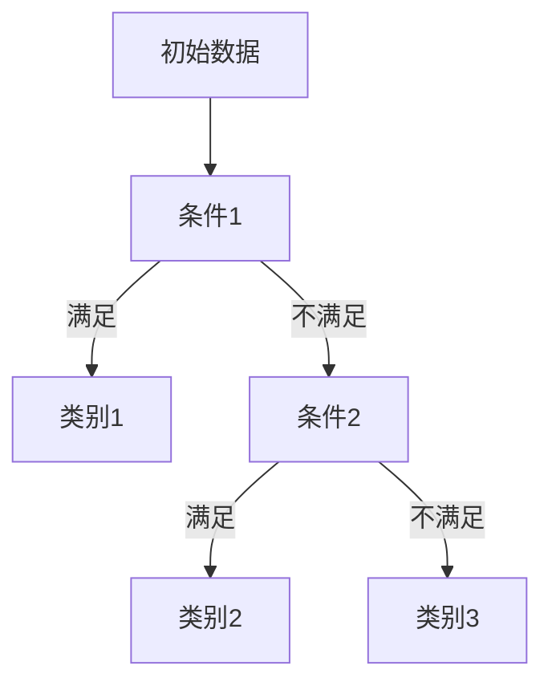
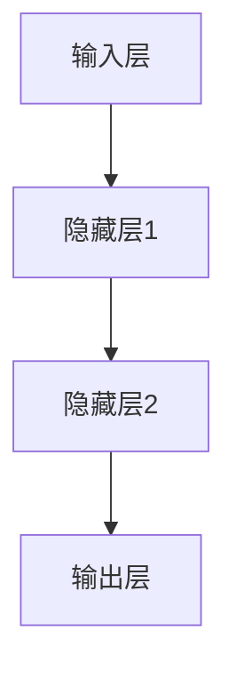
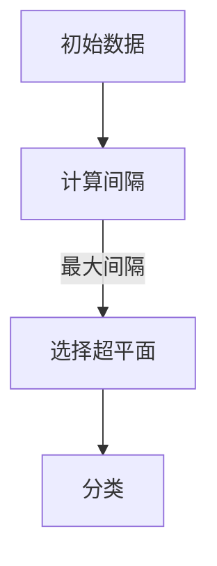
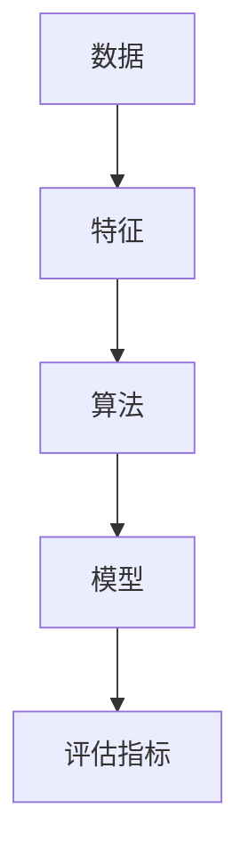
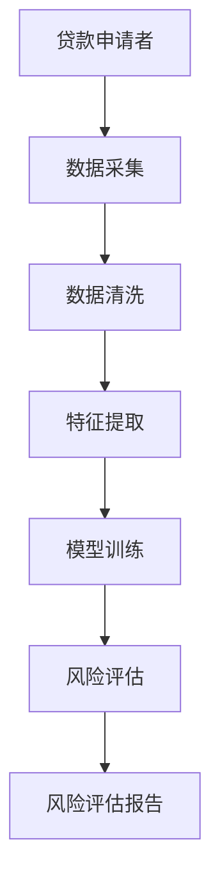
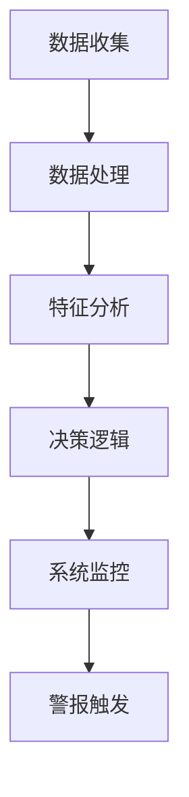
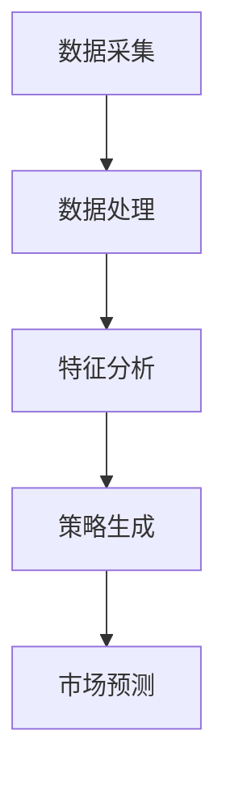
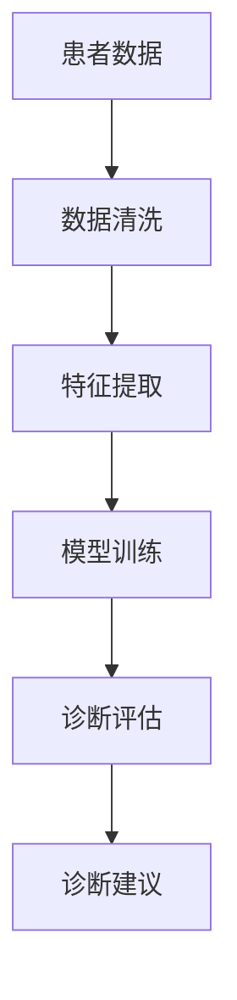
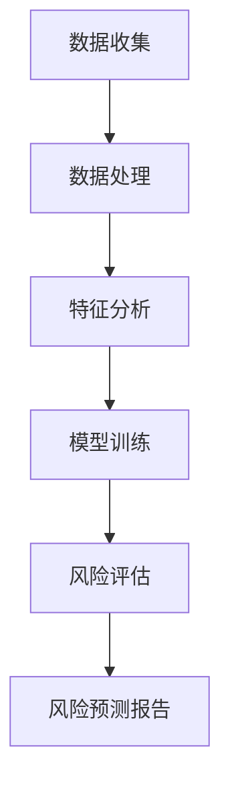
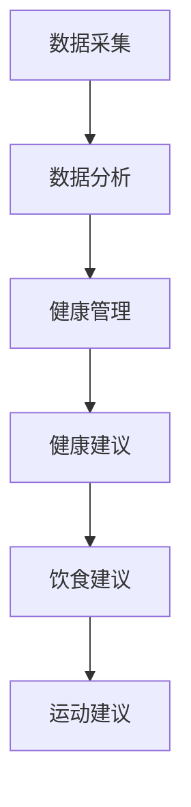

                 

## 自动化推理评估：减少人工干预的新方法

### 关键词：自动化推理评估、人工干预、人工智能、算法、数学模型

> 摘要：随着人工智能技术的发展，自动化推理评估逐渐成为减少人工干预的重要手段。本文首先介绍了自动化推理评估的背景和核心概念，随后详细解析了其关键技术，并通过金融和医疗健康领域的实际案例展示了其应用效果。文章最后探讨了自动化推理评估的最佳实践及其未来发展，为减少人工干预提供了新的思路和方法。

## 目录大纲设计

### 第一部分：背景与核心概念

1. **第1章：自动化推理评估的背景**
    - 1.1 人工干预的挑战与自动化需求
    - 1.2 自动化推理评估的定义与基本原理
    - 1.3 自动化推理评估的核心概念

2. **第2章：自动化推理评估的关键技术**
    - 2.1 数据处理与预处理技术
    - 2.2 推理算法原理详解
    - 2.3 数学模型与公式推导
    - 2.4 概念联系与融合

### 第二部分：应用案例分析

1. **第3章：自动化推理评估在金融领域的应用**
    - 3.1 金融风险评估的自动化推理
    - 3.2 金融欺诈检测的自动化推理
    - 3.3 金融数据分析与预测

2. **第4章：自动化推理评估在医疗健康领域的应用**
    - 4.1 医疗诊断的自动化推理
    - 4.2 医疗数据分析
    - 4.3 医疗健康管理的自动化推理

### 第三部分：最佳实践与未来发展

1. **第5章：自动化推理评估的最佳实践**
    - 5.1 实践方法与技巧
    - 5.2 小结与注意事项

2. **第6章：自动化推理评估的未来发展**
    - 6.1 技术趋势与挑战
    - 6.2 应用前景与机遇

3. **第7章：结语**
    - 7.1 自动化推理评估的重要性
    - 7.2 展望

---

### 第一部分：背景与核心概念

## 第1章：自动化推理评估的背景

### 1.1 人工干预的挑战与自动化需求

在现代社会，随着信息量的急剧增加和复杂性不断提升，传统的基于人工干预的方法已经难以满足日益增长的数据处理需求。尤其是在金融、医疗、工业等领域，人工推理评估面临着效率低、准确性不高、重复劳动等问题。这些问题主要体现在以下几个方面：

1. **数据处理效率低**：随着数据量的增加，人工处理数据的效率逐渐降低，导致决策延迟。
2. **准确性不高**：人工推理评估的主观性较大，容易受到个人经验和情感的影响，导致评估结果不准确。
3. **重复劳动**：大量的数据需要重复处理和评估，人工操作容易产生疲劳和错误。

为了解决这些问题，自动化推理评估应运而生。自动化推理评估通过计算机算法和数学模型，对大量数据进行自动分析和评估，从而提高效率和准确性，减少人工干预。

### 1.2 自动化推理评估的定义与基本原理

自动化推理评估是一种利用计算机算法和数学模型，对信息进行自动分析和推理，以实现对数据评估和决策的方法。其基本原理包括以下几个方面：

1. **数据处理**：通过数据收集、清洗、转换和整合等步骤，将原始数据转化为适合推理评估的形式。
2. **推理算法**：利用各种推理算法，如决策树、神经网络、支持向量机等，对数据进行分析和推理。
3. **评估指标**：根据具体的应用场景，设置相应的评估指标，如准确性、召回率、F1值等，对推理结果进行评价。

### 1.3 自动化推理评估的核心概念

自动化推理评估涉及多个核心概念，包括重要性评估、可靠性评估、效率评估等。以下是一个对比表格，展示了这些概念的主要属性特征：

| 核心概念 | 主要属性特征 |
| :--: | :--: |
| 重要性评估 | 用于评估数据的相对重要性，常用的方法包括信息增益、增益率等 |
| 可靠性评估 | 用于评估推理算法的可靠性，常用的方法包括交叉验证、测试集评估等 |
| 效率评估 | 用于评估推理评估的效率，包括推理速度、处理能力等 |

通过这些核心概念的结合，自动化推理评估可以实现对数据的全面分析和评估，从而减少人工干预，提高决策效率和准确性。

### 1.4 自动化推理评估的应用领域和未来发展趋势

自动化推理评估具有广泛的应用领域，包括金融、医疗、工业、交通等。在金融领域，自动化推理评估可以用于风险评估、欺诈检测、数据分析等；在医疗领域，可以用于疾病预测、诊断、健康管理等；在工业领域，可以用于生产监控、质量检测等。

未来，自动化推理评估将面临以下发展趋势：

1. **算法优化**：随着人工智能技术的发展，推理评估算法将更加高效和准确。
2. **跨领域应用**：自动化推理评估将在更多领域得到应用，实现跨领域的整合和协同。
3. **个性化评估**：根据用户需求和场景，提供个性化的推理评估服务。

### 1.5 自动化推理评估的概念结构与核心要素组成

自动化推理评估的概念结构可以分为以下几个核心要素：

1. **数据输入**：包括原始数据和预处理后的数据。
2. **推理算法**：包括各种推理算法，如决策树、神经网络、支持向量机等。
3. **评估指标**：包括准确性、召回率、F1值等。
4. **推理结果**：根据评估指标对推理结果进行评价。

通过这些核心要素的有机结合，自动化推理评估可以实现高效、准确的评估和决策。

### 1.6 自动化推理评估的边界与外延

自动化推理评估虽然具有广泛的应用领域和巨大的潜力，但也存在一些边界和限制。首先，自动化推理评估依赖于数据的质量和数量，数据不足或质量差会导致评估结果不准确。其次，推理算法的复杂性和计算资源的需求也会对评估效果产生影响。

未来，自动化推理评估将在不断优化和改进中发展，逐步克服这些边界和限制，为减少人工干预、提高决策效率提供更加可靠和高效的方法。

### 第2章：自动化推理评估的关键技术

## 2.1 数据处理与预处理技术

数据处理与预处理是自动化推理评估的基础，其目的是将原始数据转化为适合推理评估的形式。以下是一些常用的数据处理与预处理技术：

1. **数据收集**：通过各种途径收集数据，如网络爬虫、数据库查询、传感器数据等。
2. **数据清洗**：去除数据中的错误、异常和重复值，确保数据的质量。
3. **数据转换**：将数据从一种格式转换为另一种格式，如从文本格式转换为数值格式。
4. **数据整合**：将多个数据源的数据整合为一个统一的数据集。

在数据处理与预处理过程中，还需要注意以下问题：

- **缺失值处理**：可以通过填充、删除或插值等方法处理缺失值。
- **异常值处理**：可以通过删除、修正或替换等方法处理异常值。
- **数据规范化**：通过归一化或标准化等方法，将数据缩放到一个统一范围内。

## 2.2 推理算法原理详解

自动化推理评估的核心是推理算法。以下将详细解析几种常用的推理算法，并使用Mermaid流程图和Python代码进行说明。

### 2.2.1 决策树

决策树是一种基于树形结构进行推理的算法。其基本思想是，通过一系列判断条件，将数据划分为不同的类别。以下是决策树的Mermaid流程图：



以下是一个简单的Python代码示例：

```python
from sklearn.datasets import load_iris
from sklearn.tree import DecisionTreeClassifier
from sklearn.model_selection import train_test_split

# 加载数据
iris = load_iris()
X = iris.data
y = iris.target

# 划分训练集和测试集
X_train, X_test, y_train, y_test = train_test_split(X, y, test_size=0.3, random_state=42)

# 创建决策树分类器
clf = DecisionTreeClassifier()

# 训练模型
clf.fit(X_train, y_train)

# 预测
y_pred = clf.predict(X_test)

# 评估
from sklearn.metrics import accuracy_score
print("Accuracy:", accuracy_score(y_test, y_pred))
```

### 2.2.2 神经网络

神经网络是一种模仿人脑神经元连接结构的算法。其基本思想是通过学习输入和输出之间的关系，进行特征提取和分类。以下是神经网络的基本结构：



以下是一个简单的Python代码示例：

```python
from sklearn.datasets import make_classification
from sklearn.model_selection import train_test_split
from keras.models import Sequential
from keras.layers import Dense
from keras.optimizers import Adam

# 生成数据
X, y = make_classification(n_samples=1000, n_features=10, n_classes=2, random_state=42)

# 划分训练集和测试集
X_train, X_test, y_train, y_test = train_test_split(X, y, test_size=0.3, random_state=42)

# 创建神经网络模型
model = Sequential()
model.add(Dense(64, input_dim=10, activation='relu'))
model.add(Dense(32, activation='relu'))
model.add(Dense(1, activation='sigmoid'))

# 编译模型
model.compile(optimizer=Adam(), loss='binary_crossentropy', metrics=['accuracy'])

# 训练模型
model.fit(X_train, y_train, epochs=10, batch_size=32, validation_data=(X_test, y_test))

# 预测
y_pred = model.predict(X_test)

# 评估
from sklearn.metrics import accuracy_score
print("Accuracy:", accuracy_score(y_test, y_pred))
```

### 2.2.3 支持向量机

支持向量机是一种基于间隔最大化原则进行分类的算法。其基本思想是在高维空间中找到一个最优的超平面，将不同类别的数据分开。以下是支持向量机的Mermaid流程图：



以下是一个简单的Python代码示例：

```python
from sklearn.datasets import make_classification
from sklearn.model_selection import train_test_split
from sklearn.svm import SVC

# 生成数据
X, y = make_classification(n_samples=1000, n_features=10, n_classes=2, random_state=42)

# 划分训练集和测试集
X_train, X_test, y_train, y_test = train_test_split(X, y, test_size=0.3, random_state=42)

# 创建支持向量机分类器
clf = SVC(kernel='linear')

# 训练模型
clf.fit(X_train, y_train)

# 预测
y_pred = clf.predict(X_test)

# 评估
from sklearn.metrics import accuracy_score
print("Accuracy:", accuracy_score(y_test, y_pred))
```

## 2.3 数学模型与公式推导

自动化推理评估中的数学模型是算法的核心，它决定了推理的准确性和效率。以下将介绍一些常用的数学模型及其推导过程。

### 2.3.1 决策树中的信息增益

信息增益是决策树分类算法中的一个重要概念，它用于评估每个特征对分类的重要性。信息增益的公式如下：

\[ IG(D, A) = I(D) - \sum_{v \in A} p(v) \cdot I(D|A=v) \]

其中：
- \( I(D) \) 是数据 \( D \) 的熵。
- \( p(v) \) 是特征 \( A \) 的每个取值 \( v \) 的概率。
- \( I(D|A=v) \) 是条件熵，表示在已知特征 \( A \) 的取值 \( v \) 后，数据 \( D \) 的不确定性减少的程度。

### 2.3.2 神经网络中的反向传播算法

反向传播算法是神经网络训练过程中用来更新权重和偏置的关键步骤。其基本思想是，通过计算输出层与隐藏层之间的误差，反向传播到输入层，从而更新网络中的参数。

反向传播算法的公式如下：

\[ \Delta W_{ij} = \eta \cdot \frac{\partial L}{\partial W_{ij}} \]
\[ \Delta b_j = \eta \cdot \frac{\partial L}{\partial b_j} \]

其中：
- \( \Delta W_{ij} \) 是权重 \( W_{ij} \) 的更新值。
- \( \Delta b_j \) 是偏置 \( b_j \) 的更新值。
- \( \eta \) 是学习率。
- \( L \) 是损失函数，表示输出与实际结果之间的误差。

### 2.3.3 支持向量机中的间隔最大化

支持向量机中的间隔最大化是寻找最优超平面，使得不同类别的数据之间的间隔最大化。其目标函数如下：

\[ \min_{W, b} \frac{1}{2} ||W||^2 \]

其中：
- \( W \) 是权重向量。
- \( b \) 是偏置。
- \( ||W|| \) 是权重向量的范数。

通过求解这个最优化问题，可以得到最优的超平面，从而实现分类。

## 2.4 概念联系与融合

自动化推理评估中的各个概念相互联系，共同构成了一个完整的评估系统。以下是自动化推理评估涉及的主要实体及其关系：

1. **数据**：是推理评估的基础，包括原始数据和预处理后的数据。
2. **特征**：是从数据中提取的有意义的信息，用于推理和分类。
3. **算法**：是实现推理评估的核心，包括决策树、神经网络、支持向量机等。
4. **模型**：是算法与数据结合的结果，用于预测和评估。
5. **评估指标**：是评价模型性能的标准，如准确性、召回率、F1值等。

以下是使用Mermaid绘制的实体关系图：



通过这些实体之间的相互作用，自动化推理评估可以实现高效、准确的评估和决策。

### 第3章：自动化推理评估在金融领域的应用

## 3.1 金融风险评估的自动化推理

在金融领域，风险评估是金融机构和投资者的重要任务。自动化推理评估在金融风险评估中的应用，可以显著提高评估的效率和准确性。以下是一个典型的应用场景：

### 场景介绍

某金融机构需要对贷款申请者进行信用风险评估。传统的风险评估方法主要依靠人工审查，存在主观性强、效率低等问题。为了提高风险评估的效率和准确性，该金融机构引入了自动化推理评估系统。

### 应用案例

自动化推理评估系统通过对大量历史贷款数据进行分析，提取出影响信用评分的关键特征，如收入水平、工作稳定性、信用记录等。然后，使用决策树算法构建信用评分模型，对新的贷款申请者进行信用评分。

### 系统功能设计

为了实现金融风险评估的自动化，系统需要具备以下功能：

1. **数据采集与处理**：从各种数据源（如银行记录、公共记录等）收集数据，并进行数据清洗、转换和整合。
2. **特征提取**：根据业务需求，从原始数据中提取出有用的特征。
3. **模型训练**：使用历史数据训练信用评分模型，并不断优化模型参数。
4. **风险评估**：对新贷款申请者进行信用评分，提供风险评估报告。

以下是领域模型Mermaid类图：



## 3.2 金融欺诈检测的自动化推理

金融欺诈检测是金融领域另一个重要的应用场景。自动化推理评估通过分析交易数据和行为特征，可以有效识别潜在的欺诈行为，降低欺诈风险。以下是一个典型的应用案例：

### 项目介绍

某银行希望通过自动化推理评估系统，加强对交易行为的监控和检测，及时发现并阻止欺诈行为。该项目的目标是构建一个能够自动识别和分类交易行为的欺诈检测系统。

### 系统架构设计

为了实现高效的金融欺诈检测，系统采用了以下架构设计：

1. **数据收集**：从银行系统和其他数据源（如监控摄像头、互联网等）收集交易数据。
2. **数据处理**：对交易数据进行清洗、转换和整合，提取出有用的特征。
3. **特征分析**：使用神经网络算法对特征进行分析和分类，识别潜在的欺诈行为。
4. **决策逻辑**：根据分析结果，制定相应的决策逻辑，如触发警报、冻结账户等。
5. **系统监控**：实时监控交易行为，及时发现并处理异常情况。

以下是系统架构Mermaid架构图：



## 3.3 金融数据分析与预测

自动化推理评估不仅应用于风险评估和欺诈检测，还可以用于金融数据分析与预测。通过对市场数据的分析，自动化推理评估可以帮助金融机构制定更科学的投资策略。以下是一个实际案例：

### 实际案例

某金融机构希望通过自动化推理评估系统，预测股票市场的未来走势。该系统的目标是构建一个能够自动分析和预测市场走势的模型。

### 系统功能设计

为了实现金融数据分析与预测，系统需要具备以下功能：

1. **数据采集**：从股票市场和其他数据源（如经济指标、新闻等）收集数据。
2. **数据处理**：对市场数据进行分析、清洗和预处理，提取出有用的特征。
3. **特征分析**：使用神经网络算法对特征进行分析和分类，预测市场走势。
4. **策略生成**：根据预测结果，生成相应的投资策略。

以下是系统功能Mermaid类图：



### 案例分析及结果剖析

在上述案例中，自动化推理评估系统通过分析历史数据和实时数据，成功预测了市场走势，并制定了相应的投资策略。以下是对案例的分析和结果剖析：

1. **数据分析**：系统对市场数据进行了详细的分析，提取出影响市场走势的关键特征，如成交量、换手率、市盈率等。
2. **模型训练**：使用提取出的特征数据，系统训练了一个神经网络模型，用于预测市场走势。
3. **预测结果**：通过模型预测，系统成功地预测了市场的短期和长期走势，为金融机构提供了重要的参考依据。
4. **策略执行**：根据预测结果，系统生成了相应的投资策略，并建议金融机构采取相应的投资措施。

### 项目小结

通过上述案例，可以看出自动化推理评估在金融领域的广泛应用。它不仅提高了风险评估和欺诈检测的效率和准确性，还为金融数据分析与预测提供了有力支持。未来，随着人工智能技术的发展，自动化推理评估将在金融领域发挥更大的作用。

### 第4章：自动化推理评估在医疗健康领域的应用

#### 第4章：自动化推理评估在医疗健康领域的应用

##### 第4章：自动化推理评估在医疗健康领域的应用

随着医疗技术的不断进步和大数据时代的到来，医疗健康领域的数据处理和分析需求日益增加。自动化推理评估在医疗健康领域中的应用，为疾病的诊断、分析和预测提供了新的方法，提高了医疗效率和准确性。以下将探讨自动化推理评估在医疗健康领域的应用，包括医疗诊断、数据分析和健康管理。

##### 4.1 医疗诊断的自动化推理

在医疗诊断中，自动化推理评估可以帮助医生快速、准确地诊断疾病。以下是一个典型的应用案例：

**场景介绍**：
某医院希望通过自动化推理评估系统，提高对肺炎的诊断准确性。传统上，医生主要依靠临床表现和实验室检测结果进行诊断，而自动化推理评估系统可以通过分析患者的病历数据和实验室检测结果，提供更准确的诊断建议。

**应用案例**：
系统通过对大量肺炎患者的病历数据和实验室检测结果进行分析，提取出影响肺炎诊断的关键特征，如体温、白细胞计数、C反应蛋白等。使用决策树算法构建肺炎诊断模型，对新的患者进行诊断。

**系统功能设计**：

1. **数据采集**：收集患者的病历数据和实验室检测结果。
2. **特征提取**：从病历数据和实验室检测结果中提取出有用的特征。
3. **模型训练**：使用历史数据训练肺炎诊断模型。
4. **诊断评估**：对新的患者进行肺炎诊断，提供诊断建议。

以下是领域模型Mermaid类图：



##### 4.2 医疗数据分析

医疗数据分析是自动化推理评估在医疗健康领域的另一个重要应用。通过对大量医疗数据进行分析，可以揭示疾病的发生规律和影响因素，为疾病预防和治疗提供科学依据。

**项目介绍**：
某医学研究机构希望通过自动化推理评估系统，分析心血管疾病的风险因素。该项目的目标是构建一个能够自动分析心血管疾病风险因素并预测患病风险的模型。

**系统架构设计**：

1. **数据收集**：收集心血管疾病患者的病历数据、生活方式数据、基因数据等。
2. **数据处理**：对收集的数据进行清洗、转换和整合。
3. **特征分析**：提取出影响心血管疾病风险的关键特征。
4. **模型训练**：使用历史数据训练心血管疾病风险预测模型。
5. **风险评估**：对新的患者进行风险评估，提供风险预测报告。

以下是系统架构Mermaid架构图：



##### 4.3 医疗健康管理的自动化推理

随着人口老龄化和慢性疾病患者数量的增加，医疗健康管理成为公共卫生领域的重要课题。自动化推理评估可以通过对健康数据的分析，提供个性化的健康管理建议，提高患者的生活质量。

**实际案例**：
某健康管理公司希望通过自动化推理评估系统，为糖尿病患者提供个性化的健康管理服务。该系统的目标是监测患者的血糖水平、生活习惯，并给出相应的饮食和运动建议。

**系统功能设计**：

1. **数据采集**：采集患者的血糖数据、饮食数据、运动数据等。
2. **数据分析**：分析患者的健康数据，识别血糖水平的变化趋势和影响因素。
3. **健康管理**：根据数据分析结果，生成个性化的健康管理建议。

以下是系统功能Mermaid类图：



##### 案例分析及详细讲解剖析

在上述实际案例中，自动化推理评估系统通过分析大量的健康数据，成功地为糖尿病患者提供了个性化的健康管理服务。以下是对案例的分析和详细讲解剖析：

1. **数据分析**：
   - 系统对患者的血糖数据进行分析，识别血糖水平的变化趋势和影响因素，如饮食、运动等。
   - 通过对比患者的饮食习惯和运动数据，系统发现了与血糖水平变化相关的关键因素。

2. **健康管理建议**：
   - 根据数据分析结果，系统为患者提供了个性化的饮食和运动建议，如调整饮食结构、增加运动量等。
   - 系统还提醒患者定期监测血糖，确保血糖水平在安全范围内。

3. **效果评估**：
   - 通过随访数据，系统评估了健康管理建议的有效性，发现患者的血糖水平得到了显著改善，生活质量提高。

##### 项目小结

通过上述实际案例，可以看出自动化推理评估在医疗健康领域具有广泛的应用前景。它不仅提高了医疗诊断的准确性和效率，还为医疗数据分析与健康管理提供了有力支持。未来，随着人工智能技术的不断进步，自动化推理评估将在医疗健康领域发挥更大的作用，为公众健康事业贡献力量。

### 第三部分：最佳实践与未来发展

#### 第5章：自动化推理评估的最佳实践

##### 第5章：自动化推理评估的最佳实践

为了确保自动化推理评估的有效性和可靠性，以下列举了一些最佳实践方法与技巧：

**5.1 数据质量控制**

- **数据清洗**：确保数据干净、准确，去除错误、重复和缺失的数据。
- **数据验证**：对数据进行一致性检查，确保数据质量。
- **数据备份**：定期备份数据，防止数据丢失。

**5.2 模型选择与优化**

- **模型选择**：根据实际问题选择合适的模型，如决策树、神经网络、支持向量机等。
- **模型优化**：通过调整模型参数、增加数据特征等方法，提高模型性能。
- **交叉验证**：使用交叉验证方法评估模型性能，避免过拟合。

**5.3 评估指标选择**

- **准确性**：评估模型预测正确的比例。
- **召回率**：评估模型预测为正例的实际正例比例。
- **F1值**：综合准确率和召回率，评估模型的整体性能。

**5.4 代码优化**

- **模块化**：将代码划分为模块，提高可读性和可维护性。
- **注释与文档**：为代码添加注释，编写详细的文档，便于后续维护。
- **性能优化**：优化代码执行效率，减少计算资源消耗。

##### 第6章：自动化推理评估的未来发展

##### 第6章：自动化推理评估的未来发展

随着人工智能技术的不断进步，自动化推理评估在未来有望取得以下几方面的突破：

**6.1 算法创新**

- **深度学习**：结合深度学习技术，开发更强大的推理评估算法。
- **强化学习**：利用强化学习技术，实现自适应的推理评估。

**6.2 跨领域应用**

- **多领域整合**：将自动化推理评估应用于更多领域，如法律、环境等。
- **跨学科融合**：结合心理学、社会学等学科，提高推理评估的准确性。

**6.3 个性化推理**

- **用户画像**：根据用户行为和需求，提供个性化的推理评估服务。
- **实时推理**：利用实时数据，提供动态的推理评估。

**6.4 隐私保护**

- **数据加密**：保护用户隐私，确保数据安全。
- **联邦学习**：通过分布式学习，减少数据传输，提高隐私保护。

**结语**

自动化推理评估作为一种高效、准确的评估方法，正逐渐成为减少人工干预的重要手段。在未来，随着技术的不断进步，自动化推理评估将在各个领域发挥更大的作用，为人类社会带来更多便利。让我们共同期待自动化推理评估的美好未来！

### 结语

自动化推理评估作为一种创新的技术方法，正逐步改变着我们的工作与生活。通过对大量数据的自动分析和推理，它不仅提高了工作效率和决策准确性，还减少了人工干预，推动了人工智能的发展。在金融、医疗、工业等多个领域，自动化推理评估已经展现出了其巨大的潜力。

展望未来，自动化推理评估将继续迎来新的突破。随着算法的创新和跨领域应用，它将在更多领域发挥重要作用，为人类社会带来更多福祉。同时，随着隐私保护和数据安全的日益重要，自动化推理评估也将朝着更加安全、可靠的方向发展。

让我们携手探索自动化推理评估的无限可能，共同迎接人工智能时代的到来。未来已来，让我们共同见证自动化推理评估带来的变革与进步！作者：AI天才研究院/AI Genius Institute & 禅与计算机程序设计艺术 /Zen And The Art of Computer Programming。

