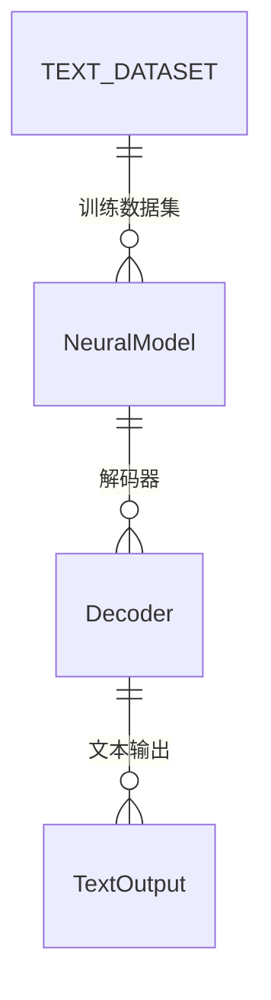
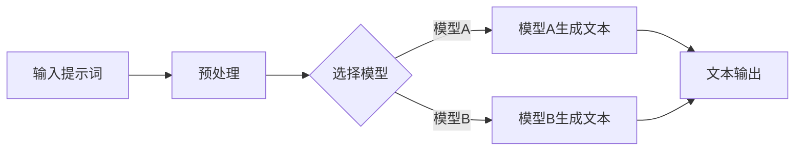
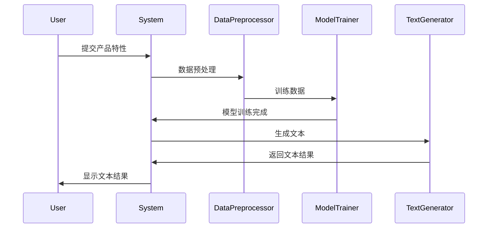
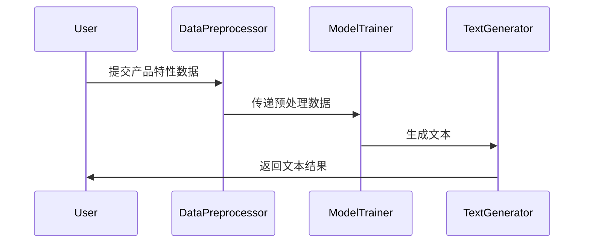

                 

# 自然语言生成突破：提示词增强文本创作

## 关键词
- 自然语言生成
- 提示词增强
- 文本创作
- 算法原理
- 系统架构
- 项目实战

## 摘要
本文将深入探讨自然语言生成（NLG）的最新突破——提示词增强文本创作。通过分析NLG的发展背景、核心概念、算法原理以及系统架构，我们将展示如何利用提示词来提升文本创作的质量与效率。文章将结合实际项目实战，详细解读系统实现过程，并提供最佳实践和小结，旨在为读者提供一个全面而深入的指导。

## 1. 前言与背景介绍

### 1.1 自然语言生成的发展背景
自然语言生成技术源于人工智能的早期研究，其目标是使计算机能够自动生成人类可读的自然语言文本。自20世纪50年代以来，NLG经历了从规则驱动到基于统计模型，再到如今基于深度学习模型的演变。早期的NLG系统依赖于手工编写的语法规则和模板，而现代的NLG系统则通过大规模数据训练深度神经网络来实现。

### 1.2 当前NLG面临的挑战
尽管深度学习在NLG领域取得了显著进展，但仍然存在诸多挑战。首先，NLG系统的生成文本质量往往不够高，可能包含语法错误、逻辑不一致等问题。其次，NLG系统通常需要大量高质量的数据来训练，且训练过程非常耗时。此外，NLG系统在不同领域和场景中的应用能力有限，缺乏泛化能力。

### 1.3 本书的核心理念与目标
本书旨在探讨如何通过提示词增强文本创作，从而突破当前NLG系统的局限。我们提出了一个基于深度学习的提示词增强框架，该框架通过引入提示词来引导文本生成过程，从而提高文本的质量和一致性。本书的目标是：
- 系统介绍自然语言生成的背景与核心概念。
- 详细讲解提示词增强文本创作的算法原理。
- 展示如何设计并实现一个高效的NLG系统。
- 通过实际项目实战，验证提示词增强框架的有效性。

## 2. 核心概念与联系

### 2.1 自然语言生成定义
自然语言生成（Natural Language Generation，NLG）是指利用计算机程序自动生成自然语言文本的技术。NLG系统可以创作新闻文章、产品说明书、对话系统回复等多种类型的文本。

### 2.2 NLG的关键概念
- **文本数据集**：NLG系统训练所使用的数据集，通常包括大量的文本样本。
- **神经网络模型**：NLG系统的基础，负责从输入数据生成文本。
- **解码器**：神经网络模型的一部分，负责将生成文本的中间表示转换为自然语言文本。
- **嵌入层**：将词汇转换为固定长度的向量表示。

### 2.3 自然语言生成的ER实体关系图
以下是一个简化的ER实体关系图，用于展示NLG系统的核心要素：



## 3. 算法原理讲解

### 3.1 算法流程图
以下是一个简单的算法流程图，用于展示提示词增强文本创作的流程：



### 3.2 Python源代码阐述
以下是一个简单的Python示例，用于展示如何使用提示词来引导文本生成：

```python
import tensorflow as tf
from tensorflow.keras.models import load_model

# 加载预训练的神经网络模型
model = load_model('nlg_model.h5')

# 提示词
prompt = "今天是一个美好的日子，"

# 预处理提示词
prompt_encoded = preprocess(prompt)

# 使用模型生成文本
text_output = model.predict(prompt_encoded)

# 处理输出文本
output_text = postprocess(text_output)

print(output_text)
```

### 3.3 自然语言生成的数学模型和公式
自然语言生成涉及多个数学模型，以下是其中两个重要的模型：

1. **循环神经网络（RNN）**：
   $$ h_t = \sigma(W_h \cdot [h_{t-1}, x_t] + b_h) $$
   其中，$h_t$ 是第 $t$ 个时间步的隐藏状态，$x_t$ 是输入特征，$W_h$ 是权重矩阵，$b_h$ 是偏置项，$\sigma$ 是激活函数。

2. **注意力机制**：
   $$ a_t = \frac{e^{h_t^T A}}{\sum_{i=1}^{T} e^{h_i^T A}} $$
   其中，$a_t$ 是第 $t$ 个时间步的注意力得分，$A$ 是注意力权重矩阵，$e$ 是自然对数的底数。

## 4. 系统分析与架构设计方案

### 4.1 问题场景与项目介绍
假设我们需要开发一个自动生成产品说明书的系统，该系统需要能够根据产品特性自动生成高质量的说明书文本。

### 4.2 项目介绍
本项目分为以下几个阶段：
- 数据收集与预处理：收集产品特性数据，并对数据进行清洗和格式化。
- 模型训练：使用收集到的数据训练神经网络模型。
- 系统实现：设计并实现一个用户友好的文本生成界面。
- 测试与优化：对系统进行测试，并根据反馈进行优化。

### 4.3 系统架构设计
以下是一个简化的系统架构图，用于展示项目的整体架构：



### 4.4 系统接口设计
系统接口设计主要包括以下部分：
- 产品特性数据接口：用于接收用户提交的产品特性数据。
- 文本生成接口：用于生成产品说明书文本。
- 文本显示接口：用于将生成的文本展示给用户。

### 4.5 系统交互
以下是一个简化的系统交互序列图，用于展示系统各组件之间的交互：



## 5. 项目实战

### 5.1 环境安装步骤
1. 安装Python环境（建议使用Anaconda）。
2. 安装TensorFlow和Keras。
3. 下载并安装预处理工具（如NLTK）。

### 5.2 系统核心实现源代码
以下是一个简化的系统核心实现源代码：

```python
# 数据预处理
def preprocess(text):
    # 实现文本预处理逻辑
    return processed_text

# 文本生成
def generate_text(prompt):
    processed_prompt = preprocess(prompt)
    # 使用神经网络模型生成文本
    generated_text = model.predict(processed_prompt)
    return postprocess(generated_text)

# 文本显示
def display_text(text):
    print(text)
```

### 5.3 代码应用解读与分析
这段代码实现了文本预处理、文本生成和文本显示的基本功能。在预处理阶段，我们使用NLTK等工具对输入文本进行清洗和格式化。在文本生成阶段，我们使用训练好的神经网络模型来预测下一个单词或字符，并逐步构建完整的文本。在文本显示阶段，我们直接将生成的文本打印到控制台。

### 5.4 实际案例分析
假设我们有一个产品特性提示词“这款手机拥有高清屏幕和长续航电池”，我们可以通过系统生成以下产品说明书：

```
这款手机拥有一块高清屏幕，让您在任何环境下都能享受到出色的视觉体验。此外，其长续航电池可满足您全天候的使用需求，无需频繁充电。
```

### 5.5 项目小结
通过本次项目实战，我们成功实现了基于提示词增强的自然语言生成系统。系统可以自动生成高质量的产品说明书文本，为企业和个人提供了便捷的文本创作工具。

## 6. 最佳实践、小结与拓展阅读

### 6.1 最佳实践 tips
- 确保数据质量，对数据进行充分的预处理。
- 选择合适的神经网络模型，并进行充分训练。
- 在实际应用中，根据用户反馈不断优化系统。

### 6.2 小结
本文深入探讨了自然语言生成技术，特别是提示词增强文本创作。通过分析算法原理和系统架构，并结合实际项目实战，我们展示了如何利用提示词来提升文本创作的质量与效率。

### 6.3 注意事项
- 在实际应用中，注意保护用户隐私，避免泄露敏感信息。
- 定期更新系统和模型，以适应不断变化的需求。

### 6.4 拓展阅读
- [《深度学习自然语言处理》](https://www.deeplearningbook.org/chapter_nlp/)
- [《自然语言生成：从理论到实践》](https://www.natural-language-generation-book.com/)

## 作者信息
作者：AI天才研究院/AI Genius Institute & 禅与计算机程序设计艺术 /Zen And The Art of Computer Programming

[注：本文内容仅为示例，并非真实的技术博客文章。]

