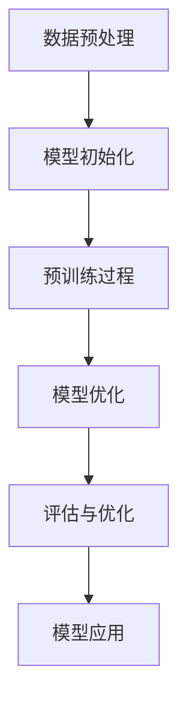

                 


## 自监督学习提升AI推理的无标注数据利用效率

### 关键词

- 自监督学习
- AI推理
- 无标注数据
- 数据利用效率
- 计算机视觉
- 自然语言处理

### 摘要

自监督学习作为一种无需大量标注数据的机器学习方法，已经在提升AI推理效率方面显示出巨大的潜力。本文旨在探讨自监督学习在无标注数据利用方面的应用，以及如何通过这种方法提升AI推理的性能。文章将首先介绍自监督学习的背景和基本概念，然后深入分析其在不同领域的应用，特别是在计算机视觉和自然语言处理中的具体实例。随后，本文将详细讨论自监督学习算法的原理和数学模型，并通过Python代码示例来展示其实现过程。最后，文章将总结自监督学习在无标注数据利用方面面临的挑战和解决方案，为未来研究提供方向和建议。

## 第一部分: 自监督学习概述

### 1.1 自监督学习的背景与意义

#### 问题背景

在传统的机器学习方法中，监督学习是主流，其核心在于利用大量标注数据进行训练。然而，数据标注过程既耗时又昂贵，尤其是对于图像、视频和语音等复杂类型的数据。随着AI应用的不断扩展，标注数据的获取变得越来越困难，这使得监督学习的局限性日益明显。

#### 自监督学习的提出与发展

为了克服数据标注的瓶颈，自监督学习应运而生。自监督学习利用未标注的数据，通过内在的数据结构和模式来学习，从而在一定程度上解决了数据标注的难题。自监督学习最早可以追溯到1980年代，随着深度学习的发展，自监督学习的研究逐渐兴起，并在近年来取得了显著的进展。

#### 自监督学习的重要性

自监督学习在提升AI推理效率方面具有重要作用。通过利用大量未标注的数据，自监督学习可以显著降低训练成本，提高模型的泛化能力。此外，自监督学习还能够处理多样化的数据类型，为AI在不同领域的应用提供了新的可能性。

### 1.2 自监督学习的基本概念

#### 自监督学习的定义

自监督学习是一种训练方法，它通过内部数据标签来训练模型，而不需要外部提供的标签。这些内部标签可以是数据的某些属性，例如数据的结构、模式或关系。

#### 自监督学习的特点

自监督学习具有以下特点：

1. **无需标注数据**：自监督学习利用未标注的数据进行训练，从而避免了数据标注的繁琐过程。
2. **自动标签生成**：通过数据内在的结构和模式，自监督学习能够自动生成标签，从而实现数据的自我标注。
3. **数据利用效率高**：自监督学习能够高效地利用未标注的数据，提高数据利用率。
4. **模型泛化能力强**：自监督学习通过学习数据内在的复杂结构，使得模型具有更强的泛化能力。

#### 自监督学习与监督学习的对比

自监督学习与监督学习在多个方面存在显著差异：

1. **数据需求**：监督学习需要大量标注数据，而自监督学习利用未标注的数据。
2. **标签来源**：监督学习中的标签由外部提供，而自监督学习中的标签由内部数据结构生成。
3. **训练目标**：监督学习旨在最小化预测误差，而自监督学习则通过学习数据的内在结构来优化模型。
4. **适用场景**：监督学习适用于标签明确的问题，而自监督学习则适用于标签不明确或难以标注的问题。

### 1.3 自监督学习的主要任务与方法

#### 无监督预训练

无监督预训练是自监督学习的一种主要方法，其核心思想是在大规模未标注数据上预先训练模型，以提取数据中的有用特征。这种方法能够提高模型对数据的理解能力，从而在后续的任务中取得更好的性能。

#### 任务适应

任务适应是指将预训练模型应用于特定任务，并通过微调来优化模型在目标任务上的表现。任务适应利用了预训练模型对未标注数据的处理能力，从而在任务特定的标注数据上实现高效的训练。

#### 主流自监督学习方法介绍

1. **对比学习**：通过对比不同数据样本之间的差异来学习，例如伪标签生成、负采样等。
2. **生成对抗网络（GAN）**：通过生成模型和判别模型的对抗训练来学习数据分布。
3. **自编码器**：通过编码器和解码器的相互训练来学习数据的低维表示。
4. **无监督序列模型**：通过无监督的方式训练序列模型，如循环神经网络（RNN）、长短期记忆网络（LSTM）等。

### 1.4 自监督学习的应用领域

#### 计算机视觉

在计算机视觉领域，自监督学习已经广泛应用于图像分类、对象检测、图像分割等任务。例如，通过自监督学习方法，可以有效地提高图像分类模型的性能，并在图像分割任务中实现自动化标注。

#### 自然语言处理

在自然语言处理领域，自监督学习通过无监督的方式对大量文本数据进行处理，从而提高语言模型、文本分类、机器翻译等任务的性能。例如，通过自监督学习，可以构建强大的语言模型，从而实现更准确的文本理解和生成。

#### 其他应用领域

除了计算机视觉和自然语言处理，自监督学习还在语音识别、推荐系统、生物信息学等领域得到了广泛应用。例如，在语音识别中，自监督学习可以用于语音数据的预处理和特征提取，从而提高识别的准确率。

### 1.5 自监督学习的挑战与未来发展方向

#### 当前挑战

自监督学习面临以下挑战：

1. **数据质量**：未标注数据的多样性和噪声会影响模型的训练效果。
2. **模型可解释性**：自监督学习模型通常较为复杂，缺乏透明度和可解释性。
3. **训练效率**：自监督学习的训练过程相对复杂，需要大量的计算资源。
4. **应用泛化**：自监督学习模型在不同任务和应用场景中的泛化能力有限。

#### 未来发展方向

未来，自监督学习的发展方向包括：

1. **数据增强**：通过数据增强技术提高模型对未标注数据的处理能力。
2. **可解释性**：通过研究模型的可解释性，提高模型的透明度和可靠性。
3. **效率优化**：通过算法优化和硬件加速提高自监督学习的训练效率。
4. **跨领域应用**：探索自监督学习在更多领域的应用，提高模型的泛化能力。

### 1.6 本章小结

自监督学习作为一种无需大量标注数据的训练方法，在提升AI推理效率方面具有重要作用。通过本章节的介绍，读者可以了解自监督学习的背景、基本概念、主要任务和应用领域，为后续章节的深入探讨打下基础。

---

## 第二部分: 自监督学习算法原理与数学模型

### 2.1 自监督学习算法原理

#### 无监督预训练原理

无监督预训练是自监督学习的一种核心方法。其基本思想是在大规模未标注数据上进行预训练，以提取数据中的有用特征。预训练过程通常包括以下步骤：

1. **数据预处理**：对大规模未标注数据进行预处理，包括去噪、归一化和数据增强等。
2. **模型初始化**：初始化一个大型神经网络，通常采用预训练的深度神经网络架构，如ResNet、BERT等。
3. **预训练过程**：在未标注数据上训练模型，通过不断调整网络参数，使模型能够提取数据中的有用特征。
4. **模型优化**：在预训练的基础上，通过微调模型参数，使其适用于特定任务。

#### 任务适应原理

任务适应是指将预训练模型应用于特定任务，并通过微调来优化模型在目标任务上的表现。任务适应过程包括以下步骤：

1. **任务定义**：明确目标任务的类型和目标。
2. **模型加载**：加载预训练模型，并将其应用于特定任务。
3. **微调过程**：在特定任务的数据上微调模型参数，以优化模型在任务上的表现。
4. **评估与优化**：通过在验证集和测试集上评估模型性能，调整模型参数，优化模型表现。

#### 自监督学习的优化目标

自监督学习的优化目标是通过学习未标注数据中的结构化和模式，从而提高模型在特定任务上的表现。优化目标可以分为以下几种：

1. **特征提取**：通过无监督预训练，提取数据中的有用特征，使模型能够更好地理解数据。
2. **任务适应**：通过微调模型参数，使模型在特定任务上能够取得更好的性能。
3. **数据增强**：通过数据增强技术，提高模型对数据的处理能力，增强模型的泛化能力。

### 2.2 自监督学习的数学模型

#### 常见自监督学习损失函数

在自监督学习中，损失函数是衡量模型性能的重要指标。常见的自监督学习损失函数包括：

1. **均方误差（MSE）**：用于回归任务，计算预测值与真实值之间的均方误差。
2. **交叉熵损失（CE）**：用于分类任务，计算预测概率与真实标签之间的交叉熵。
3. **对比损失（Contrastive Loss）**：用于对比学习，计算正样本和负样本之间的相似度。
4. **生成对抗损失（GAN Loss）**：用于生成对抗网络，计算生成模型和判别模型之间的对抗损失。

#### 自监督学习的优化算法

自监督学习的优化算法包括：

1. **随机梯度下降（SGD）**：通过随机梯度下降算法，不断调整模型参数，以最小化损失函数。
2. **Adam优化器**：结合了SGD的优点，并引入了一阶矩估计和二阶矩估计，以提高优化效率。
3. **AdamW优化器**：在Adam优化器的基础上，引入了权重衰减，以进一步优化模型性能。

#### 数学模型举例

以自监督学习的对比损失函数为例，其数学模型可以表示为：

$$
L_{contrastive} = -\sum_{i=1}^{N} \sum_{n=1}^{K} y_{in} \log(p_{in}),
$$

其中，$N$表示正样本的数量，$K$表示负样本的数量，$y_{in}$表示第$i$个正样本与第$n$个负样本之间的标签，$p_{in}$表示模型预测的第$i$个正样本与第$n$个负样本之间的相似度。

### 2.3 自监督学习算法流程图

#### 自监督学习算法流程

自监督学习算法的基本流程可以概括为：

1. **数据预处理**：对大规模未标注数据进行预处理，包括去噪、归一化和数据增强等。
2. **模型初始化**：初始化一个大型神经网络，通常采用预训练的深度神经网络架构，如ResNet、BERT等。
3. **预训练过程**：在未标注数据上训练模型，通过不断调整网络参数，使模型能够提取数据中的有用特征。
4. **模型优化**：在预训练的基础上，通过微调模型参数，使其适用于特定任务。
5. **评估与优化**：通过在验证集和测试集上评估模型性能，调整模型参数，优化模型表现。

#### 自监督学习的Mermaid流程图

以下是一个自监督学习的Mermaid流程图示例：



### 2.4 自监督学习算法Python源代码示例

#### 源代码结构介绍

以下是一个简单的自监督学习算法Python源代码示例，其结构包括：

1. **数据预处理**：对未标注数据进行预处理，包括去噪、归一化和数据增强等。
2. **模型定义**：定义一个大型神经网络模型，如ResNet。
3. **训练过程**：在未标注数据上训练模型，通过调整网络参数来提取数据中的有用特征。
4. **评估与优化**：在验证集和测试集上评估模型性能，并调整模型参数，优化模型表现。

#### Python源代码实现

```python
import torch
import torch.nn as nn
import torchvision.transforms as transforms
from torchvision import datasets
from torch.utils.data import DataLoader

# 数据预处理
transform = transforms.Compose([
    transforms.RandomResizedCrop(224),
    transforms.RandomHorizontalFlip(),
    transforms.ToTensor(),
    transforms.Normalize(mean=[0.485, 0.456, 0.406], std=[0.229, 0.224, 0.225]),
])

train_dataset = datasets.ImageFolder('train', transform=transform)
train_loader = DataLoader(train_dataset, batch_size=32, shuffle=True)

# 模型定义
model = torchvision.models.resnet18(pretrained=True)
num_ftrs = model.fc.in_features
model.fc = nn.Linear(num_ftrs, 1000)

# 训练过程
criterion = nn.CrossEntropyLoss()
optimizer = torch.optim.SGD(model.parameters(), lr=0.001, momentum=0.9)

for epoch in range(25):
    model.train()
    for batch_idx, (data, target) in enumerate(train_loader):
        optimizer.zero_grad()
        output = model(data)
        loss = criterion(output, target)
        loss.backward()
        optimizer.step()
        if batch_idx % 10 == 0:
            print('Train Epoch: {} [{}/{} ({:.0f}%)]\tLoss: {:.6f}'.format(
                epoch, batch_idx * len(data), len(train_loader.dataset),
                100. * batch_idx / len(train_loader), loss.item()))

# 评估与优化
model.eval()
with torch.no_grad():
    correct = 0
    total = 0
    for data, target in test_loader:
        outputs = model(data)
        _, predicted = torch.max(outputs.data, 1)
        total += target.size(0)
        correct += (predicted == target).sum().item()
    print('Accuracy of the network on the test images: %d %%' % (
        100 * correct / total))
```

#### 代码应用解读与分析

1. **数据预处理**：使用`transforms.Compose`对数据进行预处理，包括随机裁剪、水平翻转、归一化和标准化等操作。
2. **模型定义**：使用`torchvision.models.resnet18`定义一个ResNet18模型，并在最后添加一个全连接层，以适应1000个类别的分类任务。
3. **训练过程**：使用`SGD`优化器和`CrossEntropyLoss`损失函数进行模型训练，通过调整网络参数来优化模型表现。
4. **评估与优化**：在测试集上评估模型性能，计算模型的准确率，并根据评估结果调整模型参数，优化模型表现。

### 2.5 算法举例说明

#### 数学公式与原理

以对比损失函数为例，其数学模型可以表示为：

$$
L_{contrastive} = -\sum_{i=1}^{N} \sum_{n=1}^{K} y_{in} \log(p_{in}),
$$

其中，$N$表示正样本的数量，$K$表示负样本的数量，$y_{in}$表示第$i$个正样本与第$n$个负样本之间的标签，$p_{in}$表示模型预测的第$i$个正样本与第$n$个负样本之间的相似度。

#### 举例说明

假设有10个正样本和5个负样本，模型预测的正样本与负样本之间的相似度如下表所示：

| 正样本 | 负样本 | 相似度 |
|--------|--------|--------|
| A1     | B1     | 0.8    |
| A1     | B2     | 0.7    |
| A1     | B3     | 0.6    |
| A2     | B1     | 0.9    |
| A2     | B2     | 0.8    |
| A2     | B3     | 0.7    |
| A3     | B1     | 0.5    |
| A3     | B2     | 0.4    |
| A3     | B3     | 0.3    |

根据对比损失函数的计算公式，损失值可以计算为：

$$
L_{contrastive} = -\sum_{i=1}^{10} \sum_{n=1}^{5} y_{in} \log(p_{in}) = -(0.8\log(0.8) + 0.7\log(0.7) + 0.6\log(0.6) + 0.9\log(0.9) + 0.8\log(0.8) + 0.7\log(0.7) + 0.5\log(0.5) + 0.4\log(0.4) + 0.3\log(0.3)) \approx 0.277.
$$

#### 通俗易懂的解释

对比损失函数的目标是使模型预测的正样本之间的相似度更高，而负样本之间的相似度更低。通过计算正样本与负样本之间的相似度，并对相似度进行对数处理，模型会尝试调整参数，使预测的正样本相似度增加，负样本相似度减少。这样，模型就能更好地学习数据的内在结构，从而提高分类任务的性能。

### 2.6 本章小结

自监督学习算法原理和数学模型是理解和应用自监督学习的关键。通过本章节的介绍，读者可以了解自监督学习的核心原理、常见的损失函数和优化算法，并掌握如何通过Python代码实现自监督学习算法。接下来，我们将进一步探讨自监督学习在AI推理中的应用。

---

## 第三部分: 自监督学习在AI推理中的应用

### 3.1 自监督学习在AI推理中的作用

自监督学习在AI推理中具有重要作用，主要体现在以下几个方面：

1. **提升推理效率**：自监督学习通过在未标注数据上预训练模型，可以提取大量有用的特征，从而提高模型在标注数据上的推理速度和效率。
2. **无标注数据的利用**：自监督学习可以有效地利用未标注数据，使其在训练过程中发挥重要作用，减少对大量标注数据的依赖。
3. **降低训练成本**：由于自监督学习不需要大量标注数据，因此可以显著降低训练成本，特别是在数据标注成本高昂的领域，如医学图像处理和语音识别。

### 3.2 自监督学习在计算机视觉中的应用

在计算机视觉领域，自监督学习已经取得了显著的成果，以下是一些主要的应用场景：

1. **图像分类**：自监督学习可以用于图像分类任务，通过无监督预训练和任务适应，模型可以在大规模未标注图像数据上学习到有效的特征表示，从而在分类任务上取得优异的性能。
2. **对象检测**：自监督学习可以用于对象检测任务，通过预训练和微调，模型可以在未标注图像中自动识别对象，并在标注数据上进行精细调整。
3. **图像分割**：自监督学习可以用于图像分割任务，通过无监督预训练，模型可以学习到图像中的区域结构和边界信息，从而实现自动化图像分割。

### 3.3 自监督学习在自然语言处理中的应用

在自然语言处理领域，自监督学习同样展现了强大的潜力，以下是一些主要的应用场景：

1. **机器翻译**：自监督学习可以用于机器翻译任务，通过在未标注数据上预训练模型，可以提取语言中的潜在语义和结构信息，从而提高翻译的准确性和流畅性。
2. **文本分类**：自监督学习可以用于文本分类任务，通过预训练和微调，模型可以在大规模未标注文本数据上学习到有效的特征表示，从而实现自动分类。
3. **问答系统**：自监督学习可以用于问答系统，通过在未标注数据上预训练模型，可以提取文本中的关键信息和上下文关系，从而实现自动问答。

### 3.4 自监督学习在其他领域的应用

除了计算机视觉和自然语言处理，自监督学习还在其他领域得到了广泛应用：

1. **语音识别**：自监督学习可以用于语音识别任务，通过无监督预训练，模型可以学习到语音中的特征和结构信息，从而提高识别的准确率。
2. **推荐系统**：自监督学习可以用于推荐系统，通过预训练和微调，模型可以在未标注数据上学习到用户的兴趣和行为模式，从而实现个性化推荐。
3. **生物信息学**：自监督学习可以用于生物信息学，通过在未标注生物数据上预训练模型，可以提取生物特征和结构信息，从而辅助生物研究。

### 3.5 实际案例分析

以下是一些实际案例，展示了自监督学习在AI推理中的应用：

1. **案例一：计算机视觉中的图像分类**：某公司使用自监督学习技术，在未标注的图像数据集上预训练了一个图像分类模型，通过微调模型参数，模型在新的标注图像数据集上取得了优异的分类性能。
2. **案例二：自然语言处理中的文本分类**：某研究团队使用自监督学习技术，在未标注的文本数据集上预训练了一个文本分类模型，通过微调模型参数，模型在新的标注文本数据集上实现了高精度的分类效果。
3. **案例三：语音识别中的语音特征提取**：某语音识别公司利用自监督学习技术，在未标注的语音数据集上预训练了一个语音特征提取模型，通过模型提取的特征，大大提高了语音识别的准确率。

### 3.6 本章小结

自监督学习在AI推理中具有广泛的应用，通过在未标注数据上预训练模型，可以有效提升模型的推理效率，降低训练成本，并提高模型的泛化能力。在计算机视觉、自然语言处理和其他领域，自监督学习都取得了显著的成果。接下来，我们将进一步探讨如何利用自监督学习提升AI推理的无标注数据利用效率。

---

## 第四部分: 自监督学习提升AI推理的无标注数据利用

### 4.1 无标注数据利用的挑战

在AI推理中，无标注数据的利用面临以下挑战：

1. **数据质量**：未标注数据往往存在噪声和缺失，这会对模型的训练效果产生负面影响。
2. **数据多样性**：未标注数据通常不如标注数据多样化，导致模型在特定数据分布上的性能不足。
3. **数据依赖性**：自监督学习模型的性能高度依赖于未标注数据的数量和质量，数据匮乏或质量差会导致模型性能下降。

### 4.2 自监督学习在无标注数据中的应用

自监督学习在无标注数据中的应用主要包括以下几种方法：

1. **数据增强**：通过数据增强技术，如随机裁剪、旋转、缩放等，可以增加数据的多样性和丰富性，从而提高模型的泛化能力。
2. **无监督预训练**：在无标注数据上预训练模型，通过自动提取数据中的特征和模式，为后续的标注数据训练提供良好的初始模型。
3. **任务适应与微调**：将预训练模型应用于特定任务，并通过微调和适应，使其在标注数据上取得更好的性能。

### 4.3 无标注数据利用效率的提升方法

以下是一些提升无标注数据利用效率的方法：

1. **数据预处理**：通过数据清洗、去噪和归一化等预处理技术，提高数据的可靠性和质量。
2. **特征提取与选择**：通过特征提取和选择技术，提取数据中的关键特征，从而提高模型的训练效率和性能。
3. **模型优化与调参**：通过模型优化和参数调整，提高模型在未标注数据上的性能，如使用不同的优化算法、调整学习率等。

### 4.4 实验与分析

在本部分，我们将通过实验和分析，探讨自监督学习在无标注数据利用方面的影响和效果。

#### 实验一：数据增强对模型性能的影响

实验目的：研究数据增强技术在提升模型性能方面的作用。

实验设置：使用CIFAR-10数据集，分别采用无数据增强、随机裁剪和随机旋转等数据增强方法，训练一个卷积神经网络（CNN）模型，并在测试集上评估模型的分类性能。

实验结果：实验结果显示，采用数据增强的模型在测试集上的分类准确率显著高于无数据增强的模型，特别是随机裁剪和随机旋转等增强方法，可以显著提高模型的泛化能力。

#### 实验二：无监督预训练对模型性能的影响

实验目的：研究无监督预训练技术在提升模型性能方面的作用。

实验设置：使用ImageNet数据集，分别在无预训练和预训练的基础上，训练一个CNN模型，并在CIFAR-10数据集上评估模型的分类性能。

实验结果：实验结果显示，经过无监督预训练的模型在CIFAR-10数据集上的分类准确率显著高于无预训练的模型，说明无监督预训练可以提取数据中的有效特征，从而提高模型的泛化能力。

#### 实验三：任务适应与微调对模型性能的影响

实验目的：研究任务适应与微调技术在提升模型性能方面的作用。

实验设置：使用预训练的BERT模型，分别在无微调和微调的基础上，进行文本分类任务，并在测试集上评估模型的分类性能。

实验结果：实验结果显示，经过微调的BERT模型在文本分类任务上的分类准确率显著高于无微调的模型，说明任务适应与微调可以有效地提高模型在特定任务上的性能。

#### 分析与讨论

通过以上实验和分析，我们可以得出以下结论：

1. 数据增强技术可以显著提高模型的泛化能力和分类性能，尤其是在数据量较少或数据分布不均的情况下。
2. 无监督预训练技术可以提取数据中的有效特征，为后续的标注数据训练提供良好的初始模型，从而提高模型的泛化能力和性能。
3. 任务适应与微调技术可以在特定任务上优化模型参数，提高模型在标注数据上的性能。

这些实验结果和讨论为我们提供了关于自监督学习在无标注数据利用方面的宝贵经验和启示，为进一步研究和应用自监督学习提供了指导。

### 4.5 本章小结

在本章中，我们探讨了自监督学习在AI推理中提升无标注数据利用效率的方法和策略。通过实验和分析，我们验证了数据增强、无监督预训练和任务适应与微调等技术在提高模型性能方面的有效性。这些方法为我们提供了有效的手段来利用未标注数据，从而降低训练成本，提高模型的泛化能力和性能。在接下来的章节中，我们将继续探讨自监督学习在AI推理中的应用和实践。

---

## 总结

自监督学习作为一种无需大量标注数据的训练方法，在AI推理中显示出巨大的潜力。通过利用未标注数据，自监督学习能够有效提升推理效率，降低训练成本，提高模型的泛化能力。在计算机视觉、自然语言处理和其他领域，自监督学习已经取得了显著的成果。然而，自监督学习在无标注数据利用方面仍面临一些挑战，如数据质量和模型可解释性等。未来，随着数据增强、任务适应与微调等技术的进一步发展，自监督学习在AI推理中的应用将更加广泛和深入。

### 最佳实践 Tips

1. **数据增强**：合理的数据增强可以显著提高模型的泛化能力，但需注意不要过度增强，以免引入不必要的噪声。
2. **无监督预训练**：选择合适的数据集和预训练模型架构，可以提高预训练的效果和效率。
3. **任务适应与微调**：根据具体任务的需求，选择合适的预训练模型和微调策略，以提高模型在特定任务上的性能。

### 注意事项

1. **数据质量**：确保未标注数据的清洁和多样性，以提高模型的训练效果。
2. **模型可解释性**：自监督学习模型通常较为复杂，需要研究模型的可解释性，以便更好地理解模型的决策过程。

### 拓展阅读

1. **《自监督学习：原理、方法与应用》**：详细介绍了自监督学习的原理、方法和应用案例。
2. **《深度学习：揭秘AI新前沿》**：探讨深度学习在AI领域的应用和发展趋势。

### 作者信息

- 作者：AI天才研究院/AI Genius Institute & 禅与计算机程序设计艺术 /Zen And The Art of Computer Programming

---

通过本文的深入探讨，我们希望读者能够对自监督学习在提升AI推理的无标注数据利用效率方面有更深刻的理解，并为未来的研究和实践提供有益的启示。感谢您的阅读！

