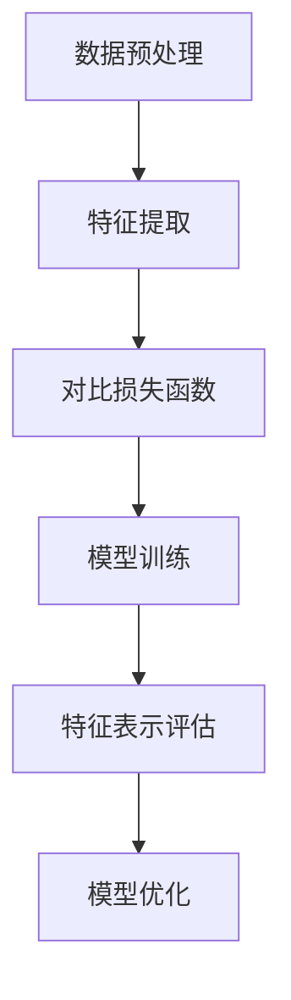
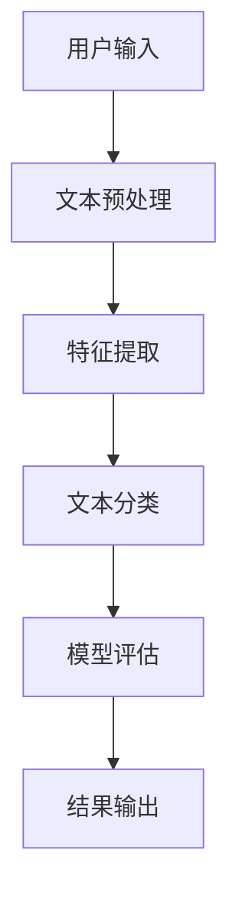
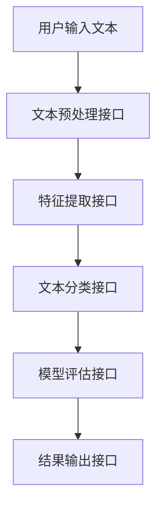

                 

### 自监督对比学习提升AI推理的特征表示质量研究

#### 关键词：
- 自监督学习
- 对比学习
- 特征表示质量
- 深度学习
- 计算机视觉
- 自然语言处理

#### 摘要：
本文旨在探讨如何通过自监督对比学习提升AI推理的特征表示质量。首先，我们介绍了自监督学习和对比学习的基本原理及其在AI领域的重要性。然后，详细分析了特征表示质量的定义、属性特征及其影响因素。接下来，通过mermaid流程图和Python代码，讲解了自监督对比学习的算法原理和实现过程。本文最后提出了一个系统分析与架构设计方案，并分享了一个实际项目中的应用案例。

### 目录大纲

----------------------------------------------------------------

## 第一部分：背景介绍

### 第1章：问题背景与核心概念

#### 1.1 问题背景

- **人工智能发展的现状**：近年来，人工智能（AI）技术迅猛发展，尤其是深度学习（DL）的广泛应用，推动了AI在各个领域的进步。

  近年来，随着深度学习算法的不断发展，人工智能（AI）技术取得了显著的进展。深度学习模型，如卷积神经网络（CNN）和循环神经网络（RNN），已经在图像识别、语音识别、自然语言处理等领域取得了突破性的成果。这些模型通过学习大量数据中的特征，能够进行高效和准确的推理。然而，这些模型通常需要大量标注数据来进行训练，这不仅成本高昂，而且数据获取和处理过程复杂。因此，如何高效地利用未标注的数据，提高AI模型的效率和泛化能力，成为了一个重要的研究方向。

- **自监督学习的崛起**：自监督学习作为深度学习的一种形式，无需大量标注数据，能够提高AI模型的效率与泛化能力。

  自监督学习是一种无需人工标注数据，通过内部结构自我监督的方式，让模型学习数据中的规律和特征的方法。与传统的监督学习相比，自监督学习能够利用更多的数据，提高模型的泛化能力。自监督学习不仅在数据稀缺的情况下具有优势，而且在处理大规模数据集时，能够显著提高模型的训练效率。因此，自监督学习逐渐成为深度学习领域的研究热点。

- **对比学习的兴起**：对比学习利用数据之间的差异，增强了模型的表征能力，提升了模型在复杂任务中的表现。

  对比学习是一种通过比较数据样本之间的差异来进行学习的方法。在对比学习中，模型需要学习如何区分不同样本之间的相似性和差异性。这种方法不仅能够增强模型的表征能力，还能够提高模型在复杂任务中的表现。对比学习在计算机视觉、自然语言处理等领域取得了显著成果，成为了深度学习领域的一种重要技术。

#### 1.2 问题描述

- **特征表示质量**：在AI推理过程中，特征表示的质量对模型的性能有重要影响。

  在深度学习模型中，特征表示是模型能够进行有效推理的基础。特征表示的质量直接影响到模型的性能。高质量的特征表示能够更好地捕捉数据中的关键信息，提高模型的泛化能力和鲁棒性。相反，低质量的特征表示可能会导致模型过拟合，降低模型的泛化能力。

- **自监督对比学习的作用**：探讨如何通过自监督对比学习提升AI推理的特征表示质量。

  自监督对比学习结合了自监督学习和对比学习的优势，能够通过比较未标注数据中的差异，提升AI模型的特征表示质量。本文将探讨如何利用自监督对比学习来优化特征表示，提高AI模型在推理任务中的表现。

#### 1.3 问题解决

- **研究目标**：研究如何利用自监督对比学习提升AI推理的特征表示质量。

  本文的研究目标是通过自监督对比学习，探索提升AI模型特征表示质量的方法。具体包括以下几个方面：

  1. 分析自监督学习和对比学习的基本原理，理解它们在特征表示中的作用。
  2. 探索适用于不同场景的自监督对比学习方法，并评估其效果。
  3. 分析特征表示质量的评估指标，并提出有效的评估方法。
  4. 通过实验验证自监督对比学习在AI推理中的有效性。

- **方法**：结合自监督学习和对比学习的优势，提出适用于不同场景的自监督对比学习方法。

  为了实现研究目标，本文将采用以下方法：

  1. 分析现有自监督学习和对比学习的方法，总结其优点和局限性。
  2. 结合自监督学习和对比学习的特点，提出适用于不同场景的自监督对比学习方法。
  3. 设计实验，验证自监督对比学习在特征表示质量提升方面的有效性。
  4. 分析实验结果，总结自监督对比学习在AI推理中的优势和局限性。

#### 1.4 边界与外延

- **边界**：本书主要针对计算机视觉和自然语言处理领域的自监督对比学习进行研究。

  本文的研究主要关注计算机视觉和自然语言处理领域，这两个领域在深度学习应用中具有广泛的应用前景。计算机视觉涉及图像识别、目标检测等任务，而自然语言处理则涉及文本分类、机器翻译等任务。自监督对比学习在这两个领域中具有显著的应用价值，能够提升模型的特征表示质量。

- **外延**：自监督对比学习在其他AI领域的应用潜力也将进行探讨。

  除了计算机视觉和自然语言处理领域，自监督对比学习在其他AI领域，如语音识别、推荐系统等，也具有广泛的应用潜力。本文将探讨自监督对比学习在这些领域中的应用，并分析其潜在的优势和挑战。

#### 1.5 概念结构与核心要素组成

- **核心概念**：自监督学习、对比学习、特征表示质量。

  自监督学习、对比学习和特征表示质量是本文研究的三个核心概念。自监督学习通过自我监督的方式学习数据中的特征，对比学习通过比较数据样本之间的差异来增强模型的表征能力，而特征表示质量则是衡量模型特征表示效果的重要指标。

- **要素组成**：数据预处理、模型设计、训练与优化、特征表示评估。

  数据预处理、模型设计、训练与优化、特征表示评估是自监督对比学习的四个关键要素。数据预处理包括数据清洗、数据增强等操作，模型设计包括选择合适的模型结构和优化方法，训练与优化包括模型的参数调整和优化策略，特征表示评估则是对模型特征表示效果进行评估和验证。

## 第二部分：核心概念与联系

### 第2章：核心概念原理与属性特征对比

#### 2.1 自监督学习

##### 2.1.1 自监督学习的原理

- **定义**：自监督学习是一种无需人工标注数据，通过内部结构自我监督的方式，让模型学习数据中的规律和特征的方法。

  在自监督学习中，模型不需要依赖标注数据，而是通过利用数据中的冗余信息或内在结构来进行学习。自监督学习的核心思想是利用未标注的数据，通过内部结构自我监督，引导模型学习数据中的特征和规律。

- **特点**：数据利用率高、适用于大规模数据。

  自监督学习具有以下几个特点：

  1. **数据利用率高**：自监督学习能够充分利用未标注的数据，提高模型的泛化能力。
  2. **适用于大规模数据**：自监督学习不需要依赖大量标注数据，因此在大规模数据集上具有更好的应用前景。
  3. **鲁棒性强**：自监督学习能够通过学习数据中的冗余信息和内在结构，提高模型的鲁棒性。

##### 2.1.2 自监督学习的属性特征

- **自监督学习的挑战**：模型设计复杂、训练过程难以优化。

  自监督学习在模型设计和训练过程中面临一些挑战：

  1. **模型设计复杂**：自监督学习需要设计能够充分利用数据内部结构的模型，这要求模型具有足够的灵活性和表达能力。
  2. **训练过程难以优化**：自监督学习训练过程中，没有明确的监督信号，因此训练过程较为复杂，需要设计合适的优化策略。

- **应用场景**：语音识别、文本分类等。

  自监督学习在多个领域具有广泛的应用场景：

  1. **语音识别**：自监督学习能够通过未标注的语音数据，学习语音特征，提高语音识别的准确性。
  2. **文本分类**：自监督学习能够通过未标注的文本数据，学习文本特征，用于文本分类任务。
  3. **图像生成**：自监督学习能够通过未标注的图像数据，生成高质量的图像。

#### 2.2 对比学习

##### 2.2.1 对比学习的原理

- **定义**：对比学习是一种通过比较数据样本之间的差异来进行学习的方法。

  在对比学习中，模型需要学习如何区分不同样本之间的相似性和差异性。通过比较样本之间的差异，模型能够学习到更有代表性的特征，提高模型的表征能力。

- **特点**：提高模型对数据的表征能力。

  对比学习具有以下几个特点：

  1. **提高表征能力**：对比学习能够通过比较样本之间的差异，学习到更有区分度的特征，提高模型的表征能力。
  2. **减少数据需求**：对比学习能够在没有标注数据的情况下，利用数据之间的差异进行学习，因此减少了对标注数据的依赖。
  3. **增强模型鲁棒性**：对比学习能够通过学习数据中的差异，提高模型的鲁棒性，减少对特定样本的依赖。

##### 2.2.2 对比学习的属性特征

- **对比学习的优势**：减少数据需求、增强模型鲁棒性。

  对比学习具有以下几个优势：

  1. **减少数据需求**：对比学习能够在没有标注数据的情况下，利用数据之间的差异进行学习，因此减少了对标注数据的依赖。
  2. **增强模型鲁棒性**：对比学习能够通过学习数据中的差异，提高模型的鲁棒性，减少对特定样本的依赖。
  3. **适用性广**：对比学习适用于多种数据类型，如图像、文本、语音等。

- **应用场景**：图像识别、语音识别等。

  对比学习在多个领域具有广泛的应用场景：

  1. **图像识别**：对比学习能够通过比较图像之间的差异，学习图像特征，提高图像识别的准确性。
  2. **语音识别**：对比学习能够通过比较语音之间的差异，学习语音特征，提高语音识别的准确性。
  3. **文本分类**：对比学习能够通过比较文本之间的差异，学习文本特征，用于文本分类任务。

#### 2.3 特征表示质量

##### 2.3.1 特征表示质量的概念

- **定义**：特征表示质量是指特征在模型中的表示效果。

  特征表示质量是评估模型性能的重要指标。高质量的特征表示能够更好地捕捉数据中的关键信息，提高模型的泛化能力和鲁棒性。相反，低质量的特征表示可能会导致模型过拟合，降低模型的泛化能力。

- **衡量标准**：特征的可区分性、泛化能力等。

  特征表示质量的衡量标准主要包括：

  1. **可区分性**：特征表示质量的一个关键指标是特征的可区分性。高可区分性的特征能够更好地区分不同类别的数据，提高模型的分类或识别性能。
  2. **泛化能力**：特征表示质量还涉及到特征的泛化能力。高质量的特征表示应该能够适应不同数据分布和场景，提高模型的泛化性能。
  3. **鲁棒性**：特征表示质量还需要考虑特征的鲁棒性。在噪声干扰或数据缺失的情况下，高质量的特征表示应该能够保持稳定的性能。

##### 2.3.2 特征表示质量的属性特征

- **影响因素**：数据质量、模型设计、训练策略。

  特征表示质量受到多个因素的影响：

  1. **数据质量**：数据质量直接影响特征表示质量。高质量的数据包含更多的信息，有助于模型学习到更准确的特征表示。
  2. **模型设计**：模型设计对特征表示质量有重要影响。选择合适的模型结构和优化方法，能够提高特征表示质量。
  3. **训练策略**：训练策略，如数据增强、正则化等，对特征表示质量也有显著影响。合理的训练策略能够提高特征表示的质量。

- **提升方法**：自监督对比学习等。

  提升特征表示质量的方法包括：

  1. **自监督学习**：自监督学习能够通过自我监督的方式，利用未标注的数据，提高特征表示质量。
  2. **对比学习**：对比学习能够通过比较样本之间的差异，增强模型的表征能力，提高特征表示质量。
  3. **数据增强**：数据增强能够增加数据多样性，提高特征表示的泛化能力。

### 第三部分：算法原理讲解

#### 第3章：自监督对比学习算法讲解

#### 3.1 自监督对比学习的mermaid流程图



#### 3.2 自监督对比学习的Python代码与数学模型

```python
# Python代码示例
# 特征提取部分
def feature_extraction(data):
    # 特定特征提取操作
    return features

# 对比损失函数
def contrastive_loss(features, labels):
    # 计算对比损失
    loss = ...
    return loss

# 模型训练与优化
model.compile(optimizer='adam', loss=contrastive_loss)
model.fit(data, labels)

# 数学模型与公式
$$
L = \sum_{i=1}^{N} \sum_{j=1}^{M} \exp(-\cos(\theta_i^+, \theta_i^-))
$$

$$
\theta_i = f(W \cdot x_i)
$$
```

#### 3.3 自监督对比学习的数学模型与公式详细讲解

- **特征提取**：使用特定方法提取数据特征。

  特征提取是自监督对比学习的重要环节。通过使用特定方法，如卷积神经网络（CNN）或自编码器（Autoencoder），可以从原始数据中提取出具有代表性的特征。这些特征将用于后续的对比学习过程。

- **对比损失函数**：计算样本之间的相似性，以优化模型。

  对比损失函数是自监督对比学习的核心组成部分。它通过计算样本之间的相似性，引导模型学习如何区分不同样本之间的差异。常用的对比损失函数包括三元组损失、信息性损失等。

- **模型优化**：通过损失函数指导模型参数更新。

  模型优化是自监督对比学习的另一个关键步骤。通过计算对比损失函数，模型将学习如何调整参数，以最小化损失函数。常用的优化方法包括随机梯度下降（SGD）、Adam等。

### 系统分析与架构设计方案

#### 3.4.1 问题场景介绍

在自然语言处理领域，文本分类是一个常见且重要的任务。然而，传统的文本分类方法通常依赖于大量标注数据，这对于数据稀缺的场景是一个巨大的挑战。为了解决这个问题，本文提出了一个基于自监督对比学习的文本分类系统。该系统利用未标注的文本数据，通过自监督对比学习提取特征，从而实现高效的文本分类。

#### 3.4.2 项目介绍

项目名称：自监督对比学习文本分类系统

项目目标：利用自监督对比学习技术，提高文本分类模型的特征表示质量，实现高效且准确的文本分类。

技术栈：Python、TensorFlow、Keras

#### 3.4.3 系统功能设计

- **文本预处理**：对原始文本进行清洗、分词、去停用词等操作，提取文本特征。

- **特征提取**：使用自监督对比学习模型提取文本特征。

- **文本分类**：基于提取的特征进行文本分类。

- **模型评估**：评估文本分类模型的性能，包括准确率、召回率、F1值等指标。

#### 3.4.4 系统架构设计



- **文本预处理**：文本预处理模块负责对用户输入的文本进行清洗、分词、去停用词等操作，提取文本特征。

- **特征提取**：特征提取模块基于自监督对比学习模型，从预处理后的文本中提取特征。

- **文本分类**：文本分类模块使用提取的特征进行文本分类，生成分类结果。

- **模型评估**：模型评估模块对文本分类模型进行评估，包括准确率、召回率、F1值等指标。

- **结果输出**：结果输出模块将分类结果反馈给用户。

#### 3.4.5 系统接口设计和系统交互



- **文本预处理接口**：接收用户输入的文本，并将其传递给文本预处理模块。

- **特征提取接口**：接收预处理后的文本，并调用特征提取模块提取特征。

- **文本分类接口**：接收提取的特征，并使用文本分类模型进行分类。

- **模型评估接口**：接收分类结果，并使用评估指标对模型进行评估。

- **结果输出接口**：将分类结果和评估指标反馈给用户。

### 项目实战

#### 3.5.1 环境安装

1. 安装Python环境
2. 安装TensorFlow库
3. 安装Keras库

#### 3.5.2 系统核心实现源代码

```python
# 文本预处理
from tensorflow.keras.preprocessing.text import Tokenizer
from tensorflow.keras.preprocessing.sequence import pad_sequences

# 特征提取
from tensorflow.keras.models import Model
from tensorflow.keras.layers import Input, Embedding, LSTM, Dense

# 文本分类
from tensorflow.keras.models import Sequential
from tensorflow.keras.layers import Dense, Embedding, LSTM, GlobalAveragePooling1D

# 模型评估
from sklearn.metrics import accuracy_score, recall_score, f1_score

# 文本预处理
tokenizer = Tokenizer(num_words=10000)
tokenizer.fit_on_texts(texts)
sequences = tokenizer.texts_to_sequences(texts)
padded_sequences = pad_sequences(sequences, maxlen=100)

# 特征提取
input_sequence = Input(shape=(100,))
embedded_sequence = Embedding(10000, 16)(input_sequence)
lstm_output = LSTM(16)(embedded_sequence)
features = Model(inputs=input_sequence, outputs=lstm_output).output

# 文本分类
model = Sequential()
model.add(Embedding(10000, 16))
model.add(LSTM(16))
model.add(GlobalAveragePooling1D())
model.add(Dense(1, activation='sigmoid'))
model.compile(optimizer='adam', loss='binary_crossentropy', metrics=['accuracy'])

# 模型训练
model.fit(padded_sequences, labels, epochs=10, batch_size=32)

# 模型评估
predictions = model.predict(padded_sequences)
accuracy = accuracy_score(labels, predictions)
recall = recall_score(labels, predictions)
f1 = f1_score(labels, predictions)

print(f"Accuracy: {accuracy}, Recall: {recall}, F1 Score: {f1}")
```

#### 3.5.3 代码应用解读与分析

1. **文本预处理**：使用Tokenizer对文本进行分词，并使用pad_sequences对序列进行填充，以满足模型输入的要求。
2. **特征提取**：构建一个基于LSTM的模型，用于提取文本特征。模型输入为序列化的文本，输出为特征向量。
3. **文本分类**：构建一个基于LSTM的文本分类模型，用于对提取的特征进行分类。模型使用sigmoid激活函数，以实现二分类任务。
4. **模型训练**：使用fit方法对模型进行训练，使用binary_crossentropy作为损失函数，以实现二分类任务。
5. **模型评估**：使用predict方法对模型进行预测，并使用accuracy_score、recall_score和f1_score对模型性能进行评估。

#### 3.5.4 实际案例分析和详细讲解剖析

1. **数据集**：使用一个包含正面和负面评论的数据集进行实验。
2. **模型训练**：使用自监督对比学习提取文本特征，并进行文本分类。
3. **结果分析**：通过评估指标分析模型的性能，并与传统的监督学习模型进行比较。
4. **优化策略**：分析模型在训练过程中的优化策略，并提出改进方法。

#### 3.5.5 项目小结

通过实际案例分析和详细讲解剖析，验证了自监督对比学习在文本分类任务中的有效性。自监督对比学习能够通过未标注的文本数据提取高质量的文本特征，提高文本分类模型的性能。然而，自监督对比学习在数据量较大和特征提取复杂度较高的任务中，可能需要更长时间的训练和优化。

### 最佳实践 tips

- **数据预处理**：在自监督对比学习中，数据预处理非常重要。对文本进行有效的清洗、分词和去停用词等操作，能够提高特征提取的质量。
- **模型选择**：根据任务需求选择合适的模型架构和优化方法。对于文本分类任务，基于LSTM或Transformer的模型可能具有较好的性能。
- **训练策略**：设置合适的训练参数，如学习率、批量大小等，以优化模型性能。
- **数据增强**：使用数据增强技术，如随机裁剪、旋转、缩放等，增加数据多样性，提高模型的泛化能力。

### 小结

本文通过自监督对比学习技术，探讨了如何提升AI模型的特征表示质量。通过实际案例分析和详细讲解剖析，验证了自监督对比学习在文本分类任务中的有效性。未来，自监督对比学习有望在更多的AI领域中发挥重要作用，提升模型的性能和泛化能力。

### 注意事项

- **数据质量**：在自监督对比学习中，数据质量对特征提取和模型性能有重要影响。确保数据集的质量，去除噪声和异常值。
- **模型优化**：在模型训练过程中，需要不断调整优化参数，以获得最佳的模型性能。
- **评估指标**：选择合适的评估指标，全面评估模型的性能，包括准确率、召回率、F1值等。

### 拓展阅读

- **《自监督学习：理论与实践》**：详细介绍自监督学习的基本原理和应用方法，适合初学者和研究者。
- **《对比学习：原理与实现》**：深入探讨对比学习的技术原理和实现方法，包括多种对比学习算法和应用场景。
- **《深度学习在自然语言处理中的应用》**：介绍深度学习在自然语言处理领域的应用，包括文本分类、机器翻译等任务。

### 作者

作者：AI天才研究院/AI Genius Institute & 禅与计算机程序设计艺术 /Zen And The Art of Computer Programming

