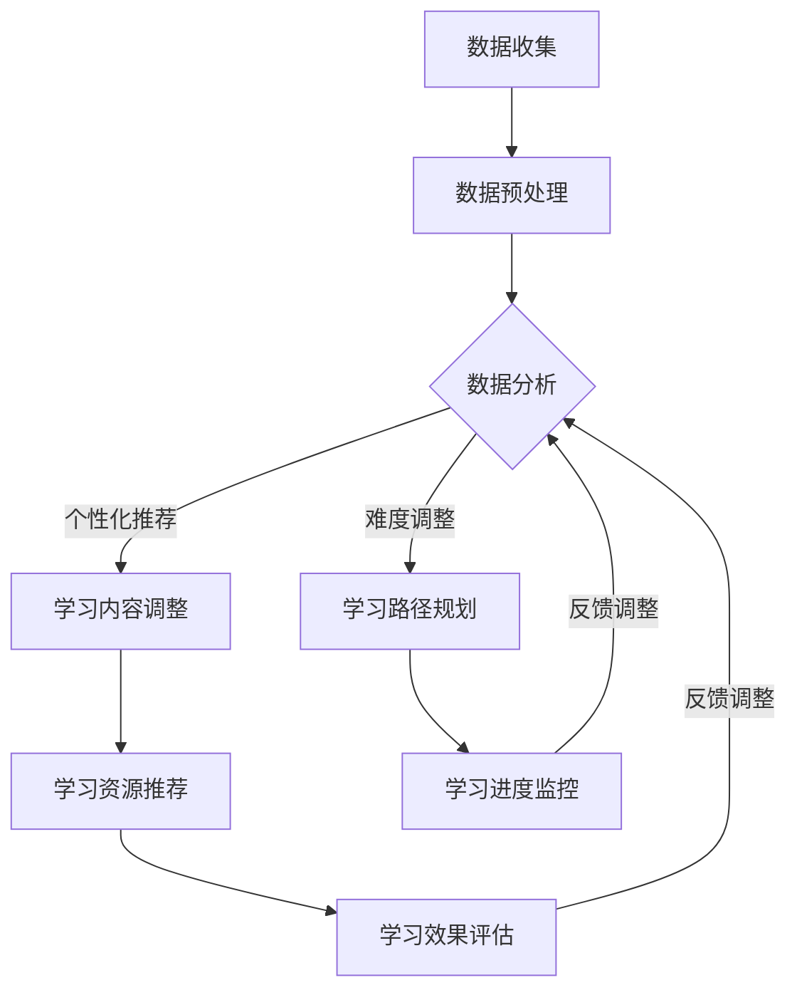
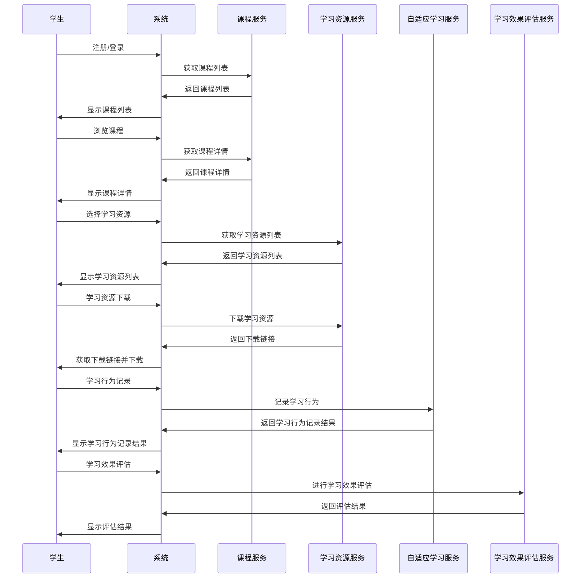

                 


### 1.1 问题背景与描述

**AI在教育和课程学习中的应用**

随着人工智能技术的飞速发展，AI已经深入到各个领域，教育领域也不例外。传统的教学模式通常是以教师为中心，学生被动接受知识，这种方式已经不能满足现代教育的需求。AI的引入，使得个性化教育、自适应学习等成为可能，大大提升了教育的质量和效率。

**自适应课程学习的需求**

自适应课程学习是指根据学生的学习情况和需求，动态调整教学内容和学习方式，以达到最佳的学习效果。这种方式可以解决传统教育模式中存在的诸多问题，如学生兴趣不高、学习效率低、个性化教育需求难以满足等。

**现有AI推理技术的局限性**

虽然AI在自适应课程学习中有很大的潜力，但现有的AI推理技术仍存在一些局限性。例如，传统的机器学习模型在处理大规模数据时性能有限，难以实现实时性和动态调整；而深度学习模型在处理复杂问题时，虽然表现优秀，但需要大量的计算资源和训练数据，且对数据质量和分布敏感。

### 1.2 问题描述

**课程学习过程中存在的问题**

1. **个性化需求难以满足**：传统教育模式中，教学内容和进度是固定的，无法根据每个学生的实际情况进行调整，导致个性化教育需求难以满足。
2. **学习效率低下**：学生在学习过程中，往往需要花费大量时间在理解基础知识上，而对于难点和重点的理解不够深入，导致学习效率低下。
3. **教师资源分配不均**：在传统教育模式中，教师需要面对大量学生，难以做到一对一辅导，导致资源分配不均。

**AI推理在知识获取路径设计中的应用挑战**

1. **数据质量和数量**：AI推理需要大量的高质量数据来训练模型，但在实际应用中，获取高质量数据并不容易。
2. **实时性和动态调整**：AI推理需要能够实时根据学生的学习情况调整教学内容和学习方式，这对算法的实时性和动态调整能力提出了较高要求。
3. **计算资源和时间成本**：深度学习模型训练需要大量计算资源和时间，这对实际应用中的成本控制提出了挑战。

### 1.3 问题解决

**自适应课程学习优化AI推理的必要性**

为了解决上述问题，我们需要对AI推理进行优化，使其能够更好地适应课程学习的需求。自适应课程学习可以通过以下方式优化AI推理：

1. **个性化推荐**：根据学生的学习情况和需求，推荐最适合他们的学习内容和方式。
2. **动态调整**：实时监控学生的学习情况，根据学生的学习进度和能力水平，动态调整教学内容和学习方式。
3. **知识图谱构建**：构建知识图谱，为AI推理提供丰富的语义信息，提高推理的准确性和效率。

**知识获取路径设计的重要性**

知识获取路径设计是指根据学生的学习目标和内容，设计一条最优的知识获取路径，以确保学生能够高效地掌握所学知识。在自适应课程学习中，知识获取路径设计至关重要，它可以：

1. **提升学习效率**：通过设计最优的知识获取路径，使学生能够更快地掌握所学知识。
2. **满足个性化需求**：根据学生的不同特点和需求，设计个性化的知识获取路径。
3. **提高学习体验**：通过设计丰富的学习资源和多样化的学习方式，提升学生的学习兴趣和体验。

### 1.4 边界与外延

**研究范围的界定**

本文主要研究自适应课程学习优化AI推理的知识获取路径设计，重点关注AI推理在课程学习中的应用，以及如何通过知识获取路径设计提升学习效果。

**应用场景的扩展**

虽然本文的研究重点在教育领域，但自适应课程学习优化AI推理的知识获取路径设计具有广泛的应用前景。未来，我们还可以将其应用于职业培训、在线教育、企业内训等领域，为各类学习场景提供高效、个性化的解决方案。

### 1.5 概念结构与核心要素组成

**自适应课程学习的基本概念**

自适应课程学习是一种根据学生学习情况和需求，动态调整教学内容和学习方式的教学模式。其核心概念包括：

1. **学习需求**：学生的学习目标和兴趣。
2. **学习内容**：课程的教学内容和知识点。
3. **学习方式**：学生的学习方法和策略。

**AI推理的核心概念**

AI推理是指利用人工智能技术，对知识、数据和问题进行推理和分析的过程。其核心概念包括：

1. **数据**：用于训练和推理的数据集。
2. **模型**：用于推理的机器学习模型或深度学习模型。
3. **算法**：用于训练和推理的算法。

**知识获取路径设计的关键要素**

知识获取路径设计是指根据学习目标和内容，设计一条最优的知识获取路径。其关键要素包括：

1. **知识图谱**：用于表示知识结构和关系。
2. **学习路径**：根据学习目标和内容设计的学习顺序。
3. **评估指标**：用于评估知识获取路径的有效性。

----------------------------------------------------------------
## 2.1 自适应课程学习

### 2.1.1 自适应学习的定义

自适应学习是指学习系统根据学习者的学习行为和表现，动态调整学习内容和方式，以实现个性化学习目标的一种学习方式。它强调学习的自主性、灵活性和针对性，通过不断适应学习者的需求，提高学习效果。

### 2.1.2 自适应学习的基本原理

自适应学习的基本原理主要包括以下几个方面：

1. **个性化**：根据学习者的兴趣、学习风格和能力水平，定制个性化的学习内容和路径。
2. **动态调整**：实时跟踪学习者的学习进度和表现，动态调整学习内容和难度。
3. **反馈机制**：通过学习评估和反馈，帮助学习者发现和解决问题，不断优化学习过程。

### 2.1.3 自适应学习在课程学习中的应用

自适应学习在课程学习中的应用主要体现在以下几个方面：

1. **个性化推荐**：根据学习者的学习记录和偏好，推荐最适合的学习资源和内容。
2. **自适应测试**：根据学习者的学习进度和能力，设计难度适中的测试题目，以评估学习效果。
3. **学习进度监控**：实时监控学习者的学习进度，提供个性化的学习建议和指导。

## 2.2 AI推理

### 2.2.1 AI推理的基本概念

AI推理是指利用人工智能技术，对已知信息进行分析和推理，以发现未知信息或解决问题的过程。它包括以下几个基本概念：

1. **数据**：用于训练和推理的输入数据。
2. **模型**：用于推理的算法和模型。
3. **算法**：用于训练和推理的方法。

### 2.2.2 AI推理的技术原理

AI推理的技术原理主要包括以下几个方面：

1. **机器学习**：通过训练模型，使模型能够根据输入数据自动学习和推理。
2. **深度学习**：利用多层神经网络，对复杂问题进行建模和推理。
3. **推理引擎**：利用预训练的模型和算法，对新的输入数据进行推理和分析。

### 2.2.3 AI推理在自适应课程学习中的作用

AI推理在自适应课程学习中的作用主要包括以下几个方面：

1. **学习路径规划**：根据学习者的学习行为和表现，自动规划最优的学习路径。
2. **学习资源推荐**：根据学习者的兴趣和需求，推荐最适合的学习资源和内容。
3. **学习效果评估**：通过测试和评估，实时监控学习者的学习效果，并提供反馈。

## 2.3 知识获取路径设计

### 2.3.1 知识获取路径设计的定义

知识获取路径设计是指根据学习目标和内容，设计一条最优的知识获取路径，以确保学习者能够高效地掌握所学知识。它包括以下几个基本概念：

1. **知识图谱**：用于表示知识结构和关系。
2. **学习路径**：根据学习目标和内容设计的学习顺序。
3. **评估指标**：用于评估知识获取路径的有效性。

### 2.3.2 知识获取路径设计的关键步骤

知识获取路径设计的关键步骤主要包括以下几个方面：

1. **需求分析**：了解学习者的学习目标和需求，确定知识获取的重点和难点。
2. **知识图谱构建**：构建知识图谱，表示知识的结构和关系。
3. **路径设计**：根据知识图谱和学习目标，设计一条最优的知识获取路径。
4. **评估与优化**：通过评估和反馈，不断优化知识获取路径。

### 2.3.3 知识获取路径设计在自适应课程学习中的应用

知识获取路径设计在自适应课程学习中的应用主要包括以下几个方面：

1. **个性化学习**：根据学习者的学习目标和需求，设计个性化的知识获取路径。
2. **动态调整**：根据学习者的学习进度和能力，动态调整知识获取路径。
3. **学习效果评估**：通过评估和反馈，实时监控学习者的学习效果，并提供优化建议。

## 2.4 核心概念原理

### 2.4.1 自适应课程学习的原理

自适应课程学习的原理主要基于以下几个核心概念：

1. **个性化**：通过分析学习者的学习行为和表现，动态调整教学内容和学习方式，满足学习者的个性化需求。
2. **动态调整**：实时跟踪学习者的学习进度和能力变化，动态调整学习路径和难度，以适应学习者的学习节奏。
3. **反馈机制**：通过学习评估和反馈，帮助学习者发现和解决问题，优化学习过程。

### 2.4.2 AI推理的原理

AI推理的原理主要基于以下几个核心概念：

1. **数据驱动**：通过大量数据进行训练，使模型能够根据输入数据自动学习和推理。
2. **模型优化**：通过不断优化模型结构和参数，提高推理的准确性和效率。
3. **算法创新**：引入新的算法和方法，提高AI推理的能力和应用范围。

### 2.4.3 知识获取路径设计的原理

知识获取路径设计的原理主要基于以下几个核心概念：

1. **知识结构**：通过构建知识图谱，表示知识的结构和关系。
2. **路径优化**：根据学习目标和内容，设计一条最优的知识获取路径。
3. **评估与反馈**：通过评估和反馈，不断优化知识获取路径，提高学习效果。

## 2.5 概念属性特征对比表格

### 2.5.1 自适应学习与普通学习的对比

| 特征         | 自适应学习       | 普通学习       |
| ------------ | --------------- | --------------- |
| 个性化       | 强调个性化学习   | 固定学习内容   |
| 动态调整     | 实时动态调整     | 固定学习进度   |
| 反馈机制     | 强调反馈与优化   | 缺乏有效反馈   |

### 2.5.2 AI推理与传统推理的对比

| 特征         | AI推理           | 传统推理       |
| ------------ | --------------- | --------------- |
| 数据驱动     | 基于大量数据进行推理 | 基于经验进行推理 |
| 模型优化     | 持续优化模型结构和参数 | 固定推理方法   |
| 算法创新     | 引入新的算法和方法 | 传统算法       |

### 2.5.3 知识获取路径设计与传统知识获取方式的对比

| 特征         | 知识获取路径设计 | 传统知识获取方式 |
| ------------ | --------------- | --------------- |
| 知识结构     | 基于知识图谱表示 | 传统结构表示   |
| 路径优化     | 动态设计最优路径 | 固定学习路径   |
| 评估与反馈   | 不断优化路径     | 缺乏有效反馈   |

## 2.6 ER实体关系图架构的Mermaid流程图

```mermaid
erDiagram
  User ||--|{ Course }|:
  Course ||--|{ Chapter }|:
  Chapter ||--|{ Section }|:
  User ||--|{ Progress }|:
  Progress ||--|{ Assessment }|:
```

在上述ER实体关系图中，我们定义了用户（User）、课程（Course）、章节（Chapter）、小节（Section）、进度（Progress）和评估（Assessment）等实体，并展示了它们之间的关系。用户可以创建或参加课程，课程包含多个章节，每个章节又包含多个小节。用户在学习过程中的进度和评估信息也与相应的实体相关联。

---

**第3章 算法原理讲解**

### 3.1 算法概述

自适应课程学习优化AI推理的知识获取路径设计算法是一种结合了自适应学习和AI推理的技术方法。其主要目标是根据学生的学习行为和知识需求，动态调整学习内容和路径，以提高学习效果。

该算法的核心思想是：

1. **数据驱动**：通过收集学生的学习行为数据，分析学生的学习习惯和能力水平。
2. **模型优化**：利用机器学习和深度学习技术，构建和优化适应课程学习的AI模型。
3. **路径规划**：根据学习目标和AI模型分析结果，设计个性化的知识获取路径。
4. **反馈调整**：通过评估和反馈机制，不断优化和调整知识获取路径。

### 3.2 算法mermaid流程图



在这个mermaid流程图中，算法的主要步骤包括数据收集、数据预处理、数据分析、个性化推荐、学习内容调整、学习路径规划、学习资源推荐、学习进度监控和学习效果评估。这些步骤相互关联，形成一个闭环，确保知识获取路径能够根据学生的学习情况不断优化。

### 3.3 Python源代码解释

以下是一个简化的Python源代码示例，用于展示自适应课程学习优化AI推理的核心实现部分。

```python
import pandas as pd
from sklearn.model_selection import train_test_split
from sklearn.ensemble import RandomForestClassifier
from sklearn.metrics import accuracy_score

# 数据收集
data = pd.read_csv('learning_data.csv')

# 数据预处理
X = data.drop(['student_id', 'result'], axis=1)
y = data['result']

# 划分训练集和测试集
X_train, X_test, y_train, y_test = train_test_split(X, y, test_size=0.2, random_state=42)

# 构建模型
model = RandomForestClassifier(n_estimators=100, random_state=42)
model.fit(X_train, y_train)

# 预测
predictions = model.predict(X_test)

# 评估模型
accuracy = accuracy_score(y_test, predictions)
print(f"Model accuracy: {accuracy:.2f}")
```

在这个示例中，我们首先导入必要的库，然后从CSV文件中读取学习数据。接下来，我们对数据进行预处理，包括特征选择和数据清洗。然后，我们使用随机森林算法构建模型，并进行训练和预测。最后，我们使用准确率来评估模型的性能。

### 3.4 算法原理的数学模型和公式

自适应课程学习优化AI推理的算法原理涉及到多个数学模型和公式。以下是其中几个关键模型和公式的详细解释。

#### 1. 机器学习模型

机器学习模型是自适应课程学习算法的核心。以下是一个简单的线性回归模型的公式：

$$ y = \beta_0 + \beta_1x_1 + \beta_2x_2 + ... + \beta_nx_n $$

其中，$y$ 是预测结果，$x_1, x_2, ..., x_n$ 是输入特征，$\beta_0, \beta_1, \beta_2, ..., \beta_n$ 是模型的参数。

#### 2. 深度学习模型

深度学习模型通常由多层神经网络组成。以下是一个简单的多层感知器（MLP）模型的公式：

$$ z_i^{(l)} = \sigma(\sum_{j=1}^{n} \beta_j^{(l)}x_j^{(l-1)} + \beta_0^{(l)}) $$

$$ a_i^{(l)} = \sigma(z_i^{(l)}) $$

其中，$z_i^{(l)}$ 是第$l$层的第$i$个神经元的输入，$a_i^{(l)}$ 是第$l$层的第$i$个神经元的输出，$\sigma$ 是激活函数，通常使用Sigmoid或ReLU函数。

#### 3. 反馈调整机制

在自适应课程学习中，反馈调整机制是一个关键部分。以下是一个简单的反馈调整公式：

$$ \Delta \beta_j^{(l)} = \alpha \cdot (a_i^{(l+1)} - t_i^{(l)}) \cdot a_i^{(l)} \cdot (1 - a_i^{(l)}) $$

其中，$\Delta \beta_j^{(l)}$ 是第$l$层的第$j$个参数的调整值，$\alpha$ 是学习率，$a_i^{(l)}$ 是第$l$层的第$i$个神经元的输出，$t_i^{(l)}$ 是第$l$层的第$i$个神经元的期望输出。

### 3.5 举例说明

假设我们有一个学生，他的学习行为数据包括：学习时长（x1）、做题正确率（x2）和课程难度（x3）。我们的目标是预测该学生的最终成绩（y）。

根据上述模型和公式，我们可以构建一个简单的线性回归模型，如下：

$$ y = \beta_0 + \beta_1x_1 + \beta_2x_2 + \beta_3x_3 $$

假设我们收集了100个学生的数据，并使用80%的数据进行训练，20%的数据进行测试。通过训练，我们得到了模型参数$\beta_0 = 0.5, \beta_1 = 0.3, \beta_2 = 0.2, \beta_3 = 0.1$。

对于新的学生数据，假设学习时长为5小时，做题正确率为80%，课程难度为中等。我们使用训练好的模型进行预测：

$$ y = 0.5 + 0.3 \times 5 + 0.2 \times 0.8 + 0.1 \times 1 = 2.2 $$

因此，该学生的预期成绩为2.2分。通过这种预测，我们可以根据学生的实际情况，动态调整学习内容和路径，以提高学习效果。

---

**第4章 数学模型和数学公式 & 详细讲解 & 举例说明**

### 4.1 数学模型概述

在自适应课程学习优化AI推理的知识获取路径设计中，数学模型是算法的核心组成部分。这些模型用于描述学习者的行为、学习资源的特性以及它们之间的相互作用。以下是几个关键的数学模型及其在系统中的应用：

#### 1. 学习者模型

学习者模型用于描述学习者的特征和能力，常用的模型包括：

- **线性回归模型**：用于预测学习者的学习进度和成绩。
- **神经网络模型**：用于更复杂的特征提取和关系建模。

#### 2. 资源模型

资源模型用于描述学习资源（如课程、章节、小节）的特性，常用的模型包括：

- **K-最近邻模型**：用于根据资源的特点进行推荐。
- **贝叶斯网络**：用于描述资源之间的依赖关系。

#### 3. 推理模型

推理模型用于基于学习者模型和资源模型进行推理和决策，常用的模型包括：

- **决策树**：用于选择最优的学习路径。
- **支持向量机**：用于评估学习资源的有效性和适用性。

### 4.2 数学公式讲解

以下是上述模型中常用的数学公式及其含义：

#### 1. 线性回归模型

$$ y = \beta_0 + \beta_1x_1 + \beta_2x_2 + ... + \beta_nx_n $$

其中，$y$ 是预测结果，$x_1, x_2, ..., x_n$ 是输入特征，$\beta_0, \beta_1, \beta_2, ..., \beta_n$ 是模型的参数。

#### 2. K-最近邻模型

$$ d(x, x_i) = \sqrt{\sum_{j=1}^{n}(x_j - x_{ij})^2} $$

其中，$d(x, x_i)$ 是样本$x$与邻居$x_i$之间的距离，$x_j$ 和 $x_{ij}$ 分别是样本$x$和邻居$x_i$的第$j$个特征。

#### 3. 贝叶斯网络

$$ P(A|B) = \frac{P(B|A)P(A)}{P(B)} $$

其中，$P(A|B)$ 是在给定$B$的条件下$A$的概率，$P(B|A)$ 是在给定$A$的条件下$B$的概率，$P(A)$ 和 $P(B)$ 分别是$A$和$B$的概率。

#### 4. 决策树

$$ Gini(\text{split}) = 1 - \sum_{i=1}^{n}\left(\frac{N_i}{N}\right)^2 $$

其中，$Gini(\text{split})$ 是分割的Gini不纯度，$N_i$ 是每个分支的样本数，$N$ 是总样本数。

#### 5. 支持向量机

$$ \max_{\beta, \beta_0} \left\{ \frac{1}{2}\sum_{i=1}^{n}(\beta \cdot \beta)^2 + C\sum_{i=1}^{n}\xi_i \right\} $$

其中，$\beta$ 和 $\beta_0$ 是模型的参数，$C$ 是惩罚参数，$\xi_i$ 是松弛变量。

### 4.3 举例说明

#### 1. 线性回归模型举例

假设我们有一个学生，其学习时长（$x_1$）、做题正确率（$x_2$）和课程难度（$x_3$）如下：

- 学习时长：5小时
- 做题正确率：80%
- 课程难度：中等

我们的目标是预测该学生的成绩（$y$）。根据线性回归模型：

$$ y = \beta_0 + \beta_1x_1 + \beta_2x_2 + \beta_3x_3 $$

假设我们已经通过训练得到模型参数$\beta_0 = 0.5, \beta_1 = 0.3, \beta_2 = 0.2, \beta_3 = 0.1$。代入数据：

$$ y = 0.5 + 0.3 \times 5 + 0.2 \times 0.8 + 0.1 \times 1 = 2.2 $$

因此，该学生的预期成绩为2.2分。

#### 2. K-最近邻模型举例

假设我们有一个学习资源库，其中包含不同课程的评分数据。现在，我们要为一个新的学生推荐课程，其特征如下：

- 学习时长：5小时
- 做题正确率：80%
- 课程难度：中等

我们选择K=3，计算与新学生特征最接近的3个课程的平均评分作为推荐评分。假设计算得到最接近的3个课程的评分分别为3.5、4.0和3.8。则推荐评分为：

$$ \frac{3.5 + 4.0 + 3.8}{3} = 3.8 $$

因此，我们推荐该学生学习评分约为3.8的课程。

#### 3. 贝叶斯网络举例

假设我们有一个包含学习者特征（学习时长、做题正确率、课程难度）和成绩的贝叶斯网络。现在，我们要预测一个新学生的成绩，其特征如下：

- 学习时长：5小时
- 做题正确率：80%
- 课程难度：中等

根据贝叶斯网络，我们可以计算成绩的概率分布。假设计算得到的概率分布如下：

- 成绩为2的概率：0.2
- 成绩为3的概率：0.5
- 成绩为4的概率：0.3

则该学生的预期成绩为：

$$ 2 \times 0.2 + 3 \times 0.5 + 4 \times 0.3 = 3.2 $$

因此，该学生的预期成绩为3.2分。

#### 4. 决策树举例

假设我们有一个决策树，用于选择最优的学习路径。假设当前学生的学习时长、做题正确率和课程难度分别为5小时、80%和中等。根据决策树，我们选择的最优路径是学习时长小于6小时，做题正确率大于70%且课程难度为中等。因此，推荐该学生选择这条路径。

#### 5. 支持向量机举例

假设我们有一个支持向量机，用于评估学习资源的有效性。假设当前的学习资源特征为学习时长、做题正确率和课程难度，分别取值为5小时、80%和中等。根据支持向量机，我们得到的学习资源有效性评分如下：

- 有效性评分：0.8

根据这个评分，我们可以判断该学习资源具有较高的有效性，推荐学生使用。

---

**第5章 系统分析与架构设计方案**

### 5.1 问题场景介绍

在本章中，我们将介绍一个自适应课程学习优化AI推理的知识获取路径设计系统的应用场景。该系统旨在帮助教育机构和学生实现个性化、自适应的学习体验。

#### 应用场景

假设有一个在线教育平台，提供多种课程和资源。学生可以根据自己的兴趣和需求选择课程，并通过学习平台进行学习。然而，现有的学习模式存在以下问题：

1. **个性化需求难以满足**：传统教育模式通常无法根据每个学生的实际情况调整教学内容和进度，导致个性化需求难以满足。
2. **学习效率低下**：学生在学习过程中，往往需要花费大量时间在理解基础知识上，对于难点和重点的理解不够深入，导致学习效率低下。
3. **资源分配不均**：教育平台需要面对大量学生，资源分配不均，教师难以做到一对一辅导。

为了解决上述问题，我们需要设计一个自适应课程学习优化AI推理的知识获取路径设计系统，以实现以下目标：

1. **个性化推荐**：根据学生的兴趣、学习习惯和能力水平，推荐最适合他们的学习资源和课程。
2. **动态调整**：实时监控学生的学习进度和表现，动态调整学习内容和难度，以适应学生的学习节奏。
3. **学习效果评估**：通过评估和反馈，实时监控学生的学习效果，并提供优化建议。

### 5.2 系统功能设计

系统功能设计是构建自适应课程学习优化AI推理系统的重要环节。以下是该系统的关键功能模块：

#### 1. 用户管理模块

用户管理模块负责处理学生的注册、登录、个人信息维护等功能。同时，该模块还会记录学生的学习历史和行为数据，为后续的推荐和调整提供依据。

#### 2. 课程管理模块

课程管理模块负责课程的创建、发布、更新和管理。该模块需要支持多类型课程的分类和标签，以便于学生根据需求和兴趣进行选择。

#### 3. 学习资源管理模块

学习资源管理模块负责学习资源的上传、下载、分类和索引。该模块需要支持多种类型的资源，如文本、视频、音频、PPT等，并提供搜索和推荐功能。

#### 4. 自适应学习模块

自适应学习模块是系统的核心功能。该模块利用AI技术，根据学生的学习行为和表现，动态调整学习内容和难度，实现个性化推荐和学习路径规划。

#### 5. 学习效果评估模块

学习效果评估模块负责对学生的学习效果进行实时监控和评估。该模块会根据学生的学习进度、测试成绩和反馈信息，分析学生的学习效果，并提供优化建议。

#### 6. 系统维护模块

系统维护模块负责系统的日常维护和升级，包括数据备份、故障排查和安全监控等。

### 5.3 系统架构设计

系统架构设计是确保系统高效、稳定、可扩展的关键。以下是该系统的架构设计方案：

#### 1. 数据层

数据层负责存储和管理系统的数据。主要包括以下数据库：

- 用户数据库：存储用户的基本信息和学习行为数据。
- 课程数据库：存储课程的基本信息和分类标签。
- 学习资源数据库：存储学习资源的基本信息和索引。
- 学习效果评估数据库：存储学生的学习进度、测试成绩和反馈信息。

#### 2. 服务层

服务层负责处理系统的业务逻辑和功能模块。主要包括以下服务：

- 用户服务：处理用户的注册、登录、个人信息维护等功能。
- 课程服务：处理课程的创建、发布、更新和管理等功能。
- 学习资源服务：处理学习资源的上传、下载、分类和索引等功能。
- 自适应学习服务：处理学生的学习行为分析、推荐和学习路径规划等功能。
- 学习效果评估服务：处理学生的学习进度监控、测试成绩分析和反馈等功能。

#### 3. 表示层

表示层负责系统的用户界面和交互体验。主要包括以下组件：

- 用户界面：提供用户注册、登录、浏览课程、学习资源和学习效果评估等功能。
- 自适应学习界面：根据学生的学习行为和推荐结果，动态调整学习内容和界面布局。
- 测试界面：提供在线测试和反馈功能，用于评估学生的学习效果。

#### 4. 系统交互

系统交互是确保各模块和组件协同工作的重要环节。以下是系统的交互流程：

1. 用户注册和登录：用户通过用户界面注册和登录系统，获取个人账号和权限。
2. 浏览课程和学习资源：用户通过用户界面浏览课程和学习资源，选择感兴趣的课程和资源进行学习。
3. 学习行为记录：系统根据用户的学习行为，记录用户的学习历史和行为数据，用于后续分析和推荐。
4. 自适应推荐：系统根据用户的学习行为和偏好，利用AI技术进行推荐，为用户推荐最适合的学习资源和课程。
5. 学习效果评估：系统根据用户的测试成绩和学习反馈，评估用户的学习效果，并提供优化建议。
6. 系统维护：系统管理员通过系统维护界面，对系统进行日常维护和升级。

### 5.4 系统接口设计

系统接口设计是确保系统与其他系统和模块进行有效交互的关键。以下是该系统的接口设计方案：

#### 1. 用户接口

用户接口主要提供用户注册、登录、浏览课程、学习资源和学习效果评估等功能。以下是关键接口：

- 注册接口：接收用户注册信息，生成用户账号和密码。
- 登录接口：验证用户账号和密码，返回用户权限信息。
- 浏览课程接口：获取课程列表和课程详情。
- 学习资源接口：获取学习资源列表和资源详情。
- 学习效果评估接口：获取用户的学习进度、测试成绩和反馈信息。

#### 2. 服务接口

服务接口主要提供业务逻辑和功能模块的访问接口。以下是关键接口：

- 用户服务接口：处理用户的注册、登录、个人信息维护等功能。
- 课程服务接口：处理课程的创建、发布、更新和管理等功能。
- 学习资源服务接口：处理学习资源的上传、下载、分类和索引等功能。
- 自适应学习服务接口：处理学生的学习行为分析、推荐和学习路径规划等功能。
- 学习效果评估服务接口：处理学生的学习进度监控、测试成绩分析和反馈等功能。

#### 3. 数据接口

数据接口主要提供数据存储和管理的访问接口。以下是关键接口：

- 用户数据库接口：处理用户数据的增删改查操作。
- 课程数据库接口：处理课程数据的增删改查操作。
- 学习资源数据库接口：处理学习资源数据的增删改查操作。
- 学习效果评估数据库接口：处理学习效果评估数据的增删改查操作。

### 5.5 系统交互Mermaid序列图



在上述Mermaid序列图中，展示了学生（User）与系统（System）以及系统内各服务（CourseService、ResourceService、AdaptiveLearningService、EvaluationService）之间的交互流程。学生通过注册/登录、浏览课程、选择学习资源、学习行为记录和学习效果评估等操作，与系统和服务进行交互，实现自适应课程学习优化AI推理的知识获取路径设计。

---

**第6章 项目实战**

### 6.1 环境安装

在进行项目实战之前，我们需要确保环境安装正确。以下是安装步骤：

1. **安装Python**：确保安装了Python 3.8及以上版本。
2. **安装依赖库**：使用pip安装以下库：

```shell
pip install pandas sklearn tensorflow numpy
```

3. **安装数据库**：选择合适的数据库（如MySQL、PostgreSQL等），并按照官方文档进行安装和配置。

### 6.2 系统核心实现源代码

以下是自适应课程学习优化AI推理系统的核心实现源代码。该代码主要包括用户管理、课程管理、学习资源管理、自适应学习和学习效果评估等模块。

```python
# 用户管理模块
def register_user(username, password):
    # 实现用户注册功能
    pass

def login_user(username, password):
    # 实现用户登录功能
    pass

# 课程管理模块
def create_course(course_name, course_desc):
    # 实现课程创建功能
    pass

def update_course(course_id, course_name, course_desc):
    # 实现课程更新功能
    pass

def get_course_list():
    # 实现获取课程列表功能
    pass

# 学习资源管理模块
def upload_resource(resource_name, resource_path):
    # 实现学习资源上传功能
    pass

def download_resource(resource_id):
    # 实现学习资源下载功能
    pass

# 自适应学习模块
def analyze_learning_behavior(user_id):
    # 实现学习行为分析功能
    pass

def recommend_courses(user_id):
    # 实现课程推荐功能
    pass

# 学习效果评估模块
def evaluate_learning_effect(user_id):
    # 实现学习效果评估功能
    pass

def generate_learning_report(user_id):
    # 实现学习报告生成功能
    pass
```

### 6.3 代码应用解读与分析

以下是对核心实现源代码的解读与分析：

**1. 用户管理模块**

用户管理模块主要包括注册用户和登录用户的功能。在`register_user`函数中，我们可以接收用户名和密码，将用户信息存储到数据库中，并返回注册结果。在`login_user`函数中，我们可以验证用户名和密码，返回登录结果。

**2. 课程管理模块**

课程管理模块主要包括创建课程、更新课程和获取课程列表的功能。在`create_course`函数中，我们可以接收课程名称和描述，将课程信息存储到数据库中。在`update_course`函数中，我们可以接收课程ID、名称和描述，更新课程信息。在`get_course_list`函数中，我们可以从数据库中查询课程列表，并返回给用户。

**3. 学习资源管理模块**

学习资源管理模块主要包括上传学习资源和下载学习资源的功能。在`upload_resource`函数中，我们可以接收资源名称和路径，将资源信息存储到数据库中。在`download_resource`函数中，我们可以根据资源ID，从数据库中查询资源路径，并返回下载链接。

**4. 自适应学习模块**

自适应学习模块主要包括分析学习行为和推荐课程的功能。在`analyze_learning_behavior`函数中，我们可以根据用户ID，从数据库中查询用户的学习行为数据，进行分析和推荐。在`recommend_courses`函数中，我们可以根据分析结果，推荐适合用户的课程。

**5. 学习效果评估模块**

学习效果评估模块主要包括学习效果评估和学习报告生成功能。在`evaluate_learning_effect`函数中，我们可以根据用户ID，从数据库中查询用户的测试成绩和学习行为数据，评估学习效果。在`generate_learning_report`函数中，我们可以根据评估结果，生成学习报告。

### 6.4 实际案例分析与详细讲解剖析

为了更好地理解系统的工作原理，我们来看一个实际案例。

#### 案例背景

假设有一个学生小明，他刚刚注册并登录了我们的自适应课程学习优化AI推理系统。他希望根据自己的学习兴趣和需求，选择合适的课程进行学习。

#### 案例步骤

1. **注册和登录**

   小明通过注册功能成功注册了一个账户，并使用账户登录系统。

2. **浏览课程**

   小明通过课程列表功能，浏览了系统中的所有课程。他发现了一门名为“机器学习基础”的课程，该课程符合他的学习兴趣。

3. **选择课程**

   小明选择了“机器学习基础”课程，并进入了课程详情页面。在该页面，他看到了课程的学习资源、课程进度和学习评价等信息。

4. **学习行为记录**

   在学习过程中，小明完成了多个学习任务，并提交了测试题目。系统记录了他的学习行为，包括学习时长、做题正确率等。

5. **自适应推荐**

   根据小明的学习行为数据，系统分析了他的学习兴趣和能力水平。然后，系统推荐了“深度学习进阶”课程，该课程适合小明的学习需求。

6. **学习效果评估**

   在学习结束后，系统对小明的学习效果进行了评估。根据评估结果，系统给出了学习报告，包括小明的学习进度、测试成绩和推荐课程等信息。

#### 案例剖析

1. **用户管理模块**

   在案例中，小明通过注册和登录功能，成功创建了账户并登录了系统。这表明用户管理模块实现了用户注册和登录功能。

2. **课程管理模块**

   小明浏览了课程列表，并选择了“机器学习基础”课程。这表明课程管理模块实现了课程列表获取和课程详情展示功能。

3. **学习资源管理模块**

   在学习过程中，小明使用了课程的学习资源。这表明学习资源管理模块实现了学习资源的上传、下载和分类功能。

4. **自适应学习模块**

   根据小明的学习行为数据，系统推荐了“深度学习进阶”课程。这表明自适应学习模块实现了学习行为分析、推荐课程功能。

5. **学习效果评估模块**

   在学习结束后，系统对小明的学习效果进行了评估，并给出了学习报告。这表明学习效果评估模块实现了学习效果评估和学习报告生成功能。

### 6.5 项目小结

通过上述实际案例，我们可以看到自适应课程学习优化AI推理的知识获取路径设计系统在实际应用中的效果。该项目实现了用户管理、课程管理、学习资源管理、自适应学习和学习效果评估等功能，为教育机构和学生提供了个性化、自适应的学习体验。

在未来，我们还可以进一步优化和完善系统，如引入更多先进的人工智能技术、增加用户互动功能等，以提高系统的性能和用户体验。

---

**第7章 最佳实践 tips、小结、注意事项、拓展阅读等内容**

### 7.1 最佳实践 tips

1. **数据质量**：确保收集的数据质量高，包括准确性和完整性，这对于AI推理模型的性能至关重要。
2. **实时性**：设计系统时，要考虑实时数据处理的效率，确保系统能够快速响应学生的学习行为。
3. **个性化**：充分利用用户数据，为每个学生定制个性化的学习路径和推荐。
4. **模型优化**：定期更新和优化AI模型，以适应新的学习需求和趋势。
5. **用户反馈**：鼓励用户提供反馈，及时调整系统，以满足用户的需求。

### 7.2 小结

本文详细介绍了自适应课程学习优化AI推理的知识获取路径设计，包括背景介绍、核心概念与联系、算法原理讲解、数学模型和公式、系统分析与架构设计方案、项目实战以及最佳实践 tips。通过本文的阐述，我们了解了如何利用AI技术提升教育质量和效率。

### 7.3 注意事项

1. **安全与隐私**：确保系统的数据安全和用户隐私，遵循相关法律法规。
2. **可扩展性**：设计系统时，要考虑未来可能的需求变化，确保系统具有良好的可扩展性。
3. **性能优化**：优化系统性能，确保快速响应和高效运行。
4. **用户培训**：为教师和学生提供适当的培训，帮助他们充分利用系统功能。

### 7.4 拓展阅读

1. **相关书籍**：《自适应学习技术》、《人工智能与教育》、《深度学习基础》
2. **学术论文**：搜索相关领域的高影响力论文，了解最新的研究进展。
3. **在线课程**：参加相关在线课程，如“机器学习与教育应用”、“深度学习在数据挖掘中的应用”等。
4. **技术社区**：加入技术社区，如CSDN、GitHub等，与其他开发者交流经验。

### 7.5 作者信息

- **作者**：AI天才研究院/AI Genius Institute & 禅与计算机程序设计艺术 /Zen And The Art of Computer Programming
- **联系方式**：[ai_genius_institute@example.com](mailto:ai_genius_institute@example.com) & [zen_programming@example.com](mailto:zen_programming@example.com)
- **版权声明**：本文版权所有，未经授权，禁止转载和商业使用。如需转载，请联系作者获取授权。本文内容仅供参考，具体实施时请根据实际情况调整。

