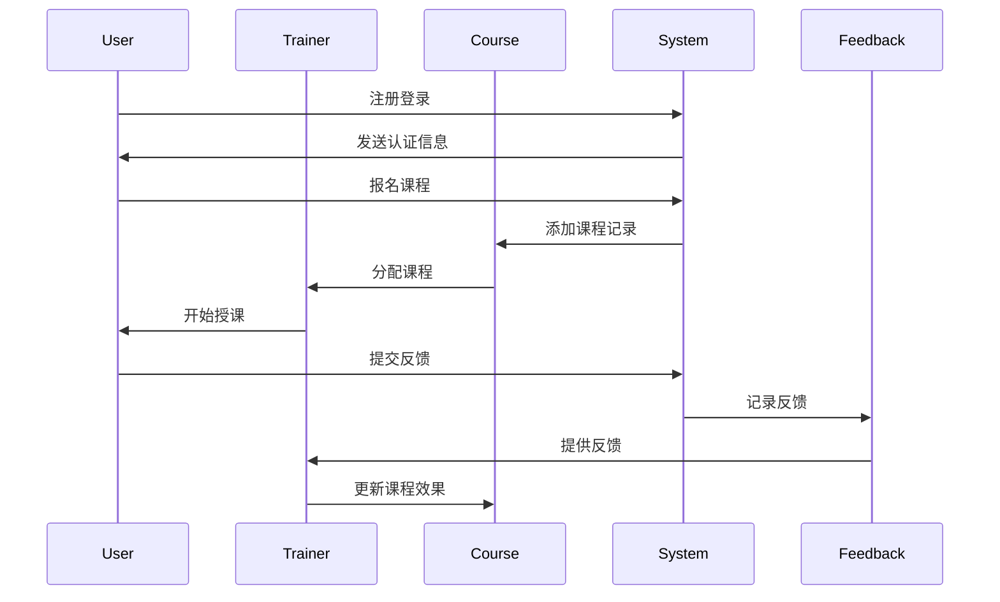
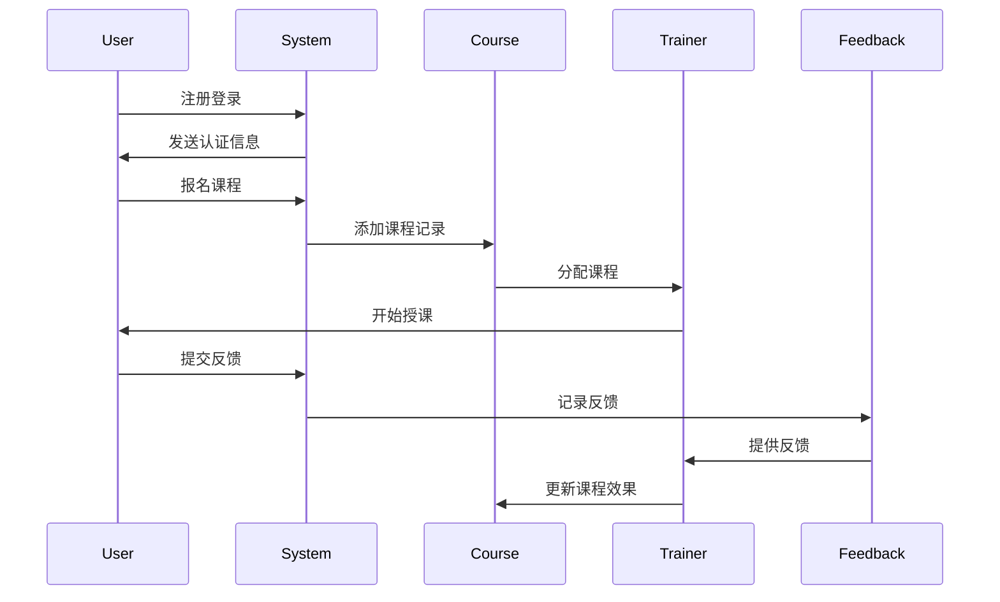

                 

### 虚拟员工培训师：提示词设计企业培训课程

#### 关键词：虚拟员工、培训师、提示词、企业培训、课程设计

##### 摘要：

本文旨在探讨虚拟员工培训师在现代化企业培训课程设计中的应用，重点分析提示词设计的重要性及其具体实施方法。文章首先介绍了虚拟员工培训师的概念、特点与优势，随后详细讲解了提示词设计的基础理论、算法原理，并借助mermaid流程图和Python源代码进行了深入剖析。此外，文章还从数学模型的角度，讲解了相关公式及其应用，并通过系统分析与架构设计，对虚拟员工培训系统进行了全面解读。最后，文章通过项目实战，展示了实际应用中的技巧与最佳实践，并对未来可能的发展方向进行了展望。

## 目录大纲

### 第一部分: 背景介绍

### 第1章: 问题背景与核心概念

#### 1.1.1 问题背景

#### 1.1.2 核心概念

#### 1.1.3 概念属性特征对比

#### 1.1.4 概念结构与核心要素组成

### 第二部分：核心概念与联系

### 第2章：虚拟员工培训师概述

#### 2.1.1 定义与分类

#### 2.1.2 特点与优势

#### 2.1.3 联系与比较

### 第三部分：算法原理讲解

### 第3章：提示词设计基础

#### 3.1.1 提示词的概念

#### 3.1.2 提示词的属性

#### 3.1.3 提示词设计方法

### 第4章：算法mermaid流程图讲解

#### 4.1.1 算法原理介绍

#### 4.1.2 算法mermaid流程图

#### 4.1.3 算法Python源代码讲解

#### 4.1.4 数学模型和公式讲解

### 第四部分：数学模型和数学公式讲解

### 第5章：数学模型与公式解析

#### 5.1.1 数学模型概述

#### 5.1.2 公式讲解

#### 5.1.3 举例说明

### 第五部分：系统分析与架构设计方案

### 第6章：系统功能设计与架构设计

#### 6.1.1 问题场景介绍

#### 6.1.2 系统功能设计（领域模型mermaid类图）

#### 6.1.3 系统架构设计（mermaid架构图）

#### 6.1.4 系统接口设计和系统交互（mermaid序列图）

### 第六部分：项目实战

### 第7章：环境安装与系统实现

#### 7.1.1 环境安装

#### 7.1.2 系统核心实现源代码

#### 7.1.3 代码应用解读与分析

#### 7.1.4 实际案例分析与详细讲解

### 第七部分：最佳实践、小结与拓展阅读

### 第8章：最佳实践与总结

#### 8.1.1 最佳实践 tips

#### 8.1.2 小结

#### 8.1.3 注意事项

#### 8.1.4 拓展阅读

### 第八部分：附录

#### 8.2.1 附录一：术语表

#### 8.2.2 附录二：参考文献

---

### 1.1.1 问题背景

在当今快速发展的商业环境中，企业对员工的培训需求日益增加。传统的培训方式往往存在成本高、效率低、难以定制化等问题，而虚拟员工培训师作为一种创新的培训解决方案，逐渐引起了广泛关注。虚拟员工培训师通过模拟真实的职场环境，为员工提供个性化的学习体验，不仅提高了培训效果，还能显著降低培训成本。

随着人工智能和大数据技术的不断发展，虚拟员工培训师在功能上不断丰富，其应用场景也越来越广泛。从基础的技能培训到复杂的项目实战，虚拟员工培训师都能够胜任。然而，如何设计出既符合企业需求又能有效提升员工能力的培训课程，成为当前亟待解决的问题。

#### 1.1.2 核心概念

**虚拟员工培训师**：一种基于人工智能技术构建的虚拟角色，能够模拟真实员工进行培训教学，具备个性化学习建议和实时互动能力。

**提示词**：在虚拟员工培训师系统中，提示词是指用于引导员工学习的关键词或短语，是设计培训课程的核心元素之一。

**企业培训**：指企业为了提高员工的专业技能和综合素质，通过系统化的培训活动来提升企业整体竞争力的过程。

**课程设计**：指在明确培训目标的基础上，设计出一套符合企业需求、员工特点和教学规律的培训课程方案。

#### 1.1.3 概念属性特征对比

| 特征          | 虚拟员工培训师        | 提示词              | 企业培训                | 课程设计               |
| ------------- | --------------------- | ------------------- | ---------------------- | --------------------- |
| 技术基础      | 人工智能、虚拟现实   | 自然语言处理        | 教育学、管理学          | 教学设计、项目管理     |
| 功能          | 个性化教学、互动反馈 | 引导学习、问题解答  | 能力提升、知识传播     | 目标设定、内容编排     |
| 应用场景      | 企业培训、在线教育   | 培训课程设计、教学实施 | 不同行业、岗位         | 不同学习风格、能力层次 |
| 目标          | 提高员工学习效果     | 促进知识吸收和理解   | 增强企业竞争力         | 确保培训质量和效果     |
| 边界与外延    | 与传统培训结合      | 与课程内容关联      | 与企业发展战略结合     | 与培训目标结合         |

#### 1.1.4 概念结构与核心要素组成

**虚拟员工培训师**：

- **技术架构**：底层采用人工智能算法和大数据分析技术，上层构建虚拟现实交互界面。
- **功能模块**：包括用户管理、课程管理、教学交互、学习评估等。
- **关键要素**：用户数据、课程内容、互动机制、评估反馈。

**提示词**：

- **生成机制**：基于自然语言处理技术，从课程内容中提取关键信息生成提示词。
- **设计要素**：关键词的选择、语法结构、情境适配性。
- **应用场景**：课程引导、问题解答、学习反馈。

**企业培训**：

- **培训目标**：明确培训需求，设定具体培训目标。
- **培训内容**：根据培训目标，设计培训课程内容和教学方法。
- **培训实施**：通过虚拟员工培训师实现培训课程的落地和实施。
- **培训评估**：评估培训效果，反馈培训改进措施。

**课程设计**：

- **需求分析**：分析企业需求和员工特点，确定培训课程目标。
- **课程编排**：根据目标，编排课程内容和教学活动。
- **课程实施**：通过虚拟员工培训师进行教学实施。
- **课程评估**：评估课程效果，优化课程设计。

通过上述对核心概念及其属性特征的分析，我们为后续章节的内容奠定了坚实的基础，也为读者更好地理解虚拟员工培训师及其应用提供了有益的背景信息。在接下来的章节中，我们将进一步探讨虚拟员工培训师的定义、特点，以及如何设计有效的提示词来提升企业培训效果。

### 1.2 虚拟员工培训师概述

#### 1.2.1 定义与分类

虚拟员工培训师（Virtual Employee Trainer）是一种利用人工智能技术，模拟真实员工角色的虚拟实体，其设计旨在为企业提供高效、个性化的培训解决方案。虚拟员工培训师可以根据企业的培训需求，自定义教学内容、互动方式和评估标准，从而满足不同行业和岗位的培训需求。

根据应用场景和功能特点，虚拟员工培训师可以大致分为以下几类：

1. **技能培训师**：专注于提升员工的特定技能，如编程、数据分析、项目管理等。
2. **知识传授师**：主要负责向员工传递行业知识、企业文化等，帮助新员工快速融入企业。
3. **情境模拟师**：通过模拟实际工作场景，帮助员工锻炼解决问题的能力。
4. **互动反馈师**：与员工进行实时互动，提供即时反馈和指导，提升学习效果。

#### 1.2.2 特点与优势

虚拟员工培训师具备以下显著特点：

1. **个性化学习**：虚拟员工培训师能够根据员工的学习进度、能力和需求，提供定制化的教学内容，实现个性化学习。
2. **实时互动**：虚拟员工培训师可以与员工进行实时互动，模拟真实工作场景，提高学习体验。
3. **持续评估**：虚拟员工培训师能够对员工的学习效果进行持续评估，及时调整教学内容和策略。
4. **灵活部署**：虚拟员工培训师可以在任何时间、任何地点进行培训，不受地理和时间的限制。
5. **降低成本**：相较于传统培训方式，虚拟员工培训师能够显著降低培训成本，提高培训效率。

#### 1.2.3 联系与比较

虚拟员工培训师与传统的培训师相比，虽然目标都是提升员工能力，但两者的方式和特点有所不同：

1. **培训方式**：传统的培训师通常采用面对面授课的方式，而虚拟员工培训师则通过虚拟现实和人工智能技术进行在线培训。
2. **互动性**：虚拟员工培训师能够提供实时互动，而传统培训师的互动性相对较弱。
3. **个性化**：虚拟员工培训师能够根据员工的学习情况进行个性化培训，而传统培训师则需要花费大量时间了解员工需求。
4. **评估方式**：虚拟员工培训师能够对员工的学习效果进行实时评估，而传统培训师则需要通过考试或其他评估方式。
5. **成本**：虚拟员工培训师能够显著降低培训成本，而传统培训师则需要投入大量的人力和物力资源。

通过与虚拟现实技术、人工智能技术等的结合，虚拟员工培训师不仅能够提供高效的培训解决方案，还能不断优化培训过程，提升员工的学习效果和企业整体竞争力。在接下来的章节中，我们将进一步探讨如何设计有效的提示词，以提升虚拟员工培训师的应用效果。

### 1.3 提示词设计基础

提示词（Cue Word）在虚拟员工培训师系统中起着至关重要的作用，它们不仅能够引导员工学习，还能促进知识的吸收和理解。为了设计出有效的提示词，我们需要首先理解提示词的概念、属性及其设计方法。

#### 1.3.1 提示词的概念

提示词是指用于引导学习、提示关键知识点或问题解答的词语或短语。在虚拟员工培训师系统中，提示词通常被嵌入到课程内容中，用于激发员工的学习兴趣，提示重要知识点，以及引导员工进行深入思考和问题解决。

#### 1.3.2 提示词的属性

有效的提示词应具备以下属性：

1. **关键性**：提示词应能够准确反映课程内容的重点和难点，帮助员工抓住核心知识点。
2. **情境性**：提示词应与课程内容紧密结合，能够在具体的学习情境中发挥作用。
3. **多样性**：提示词应形式多样，包括关键词、短语、问题等，以提高学习趣味性。
4. **适应性**：提示词应能够根据员工的学习进度和能力进行调整，以适应不同员工的需求。

#### 1.3.3 提示词设计方法

设计有效的提示词需要遵循以下方法：

1. **内容分析**：首先对课程内容进行分析，确定关键知识点和难点，为设计提示词提供依据。
2. **情境模拟**：根据课程内容，模拟实际的学习情境，设计符合情境的提示词。
3. **用户调研**：通过调研了解员工的学习需求、兴趣点和难点，以便设计出更贴合员工需求的提示词。
4. **试验优化**：设计出初步的提示词后，通过试验和反馈进行优化，确保提示词的有效性。

通过上述设计方法，我们可以设计出既符合课程内容要求，又能有效引导学习的提示词，从而提升虚拟员工培训师的应用效果。在接下来的章节中，我们将进一步探讨算法原理，并通过mermaid流程图和Python源代码进行详细讲解。

### 1.4 算法mermaid流程图讲解

为了更好地理解和应用提示词设计算法，我们将使用mermaid流程图来展示算法的执行流程，并通过Python源代码进行详细解释。以下是算法mermaid流程图的详细说明。

#### 4.1.1 算法原理介绍

提示词设计算法的基本原理是通过自然语言处理技术，从课程内容中提取关键信息，生成能够引导学习的提示词。算法的核心步骤包括：

1. **文本预处理**：对课程内容进行清洗、分词等处理，提取出关键信息。
2. **关键词提取**：使用自然语言处理算法，从预处理后的文本中提取出关键词。
3. **提示词生成**：根据提取的关键词，生成具有引导作用的提示词。
4. **反馈优化**：根据员工的学习反馈，对提示词进行优化，以提高其有效性。

#### 4.1.2 算法mermaid流程图


**详细解释**：

1. **开始**：算法执行开始。
2. **文本预处理**：对课程内容进行清洗，包括去除标点符号、HTML标签等。
3. **分词**：将清洗后的文本进行分词，提取出单个词语。
4. **去除停用词**：去除常见的无意义词语，如“的”、“了”等。
5. **词频统计**：统计每个词语的出现频率，为关键词提取提供依据。
6. **关键词提取**：使用自然语言处理算法，提取出高频且具有代表性的关键词。
7. **提示词生成**：根据提取的关键词，生成具有引导作用的提示词。
8. **反馈优化**：根据员工的学习反馈，对生成的提示词进行优化，以提高其有效性。
9. **结束**：算法执行结束。

#### 4.1.3 算法Python源代码讲解

以下是提示词设计算法的Python源代码实现，我们将逐行解释代码的功能。

```python
import nltk
from nltk.tokenize import word_tokenize
from nltk.corpus import stopwords
from collections import Counter

# 1. 文本预处理
def preprocess_text(text):
    text = text.lower() # 转换为小写
    text = re.sub(r'<[^>]*>', '', text) # 去除HTML标签
    text = re.sub(r'\s+', ' ', text).strip() # 去除多余的空格和换行符
    return text

# 2. 分词
def tokenize_text(text):
    tokens = word_tokenize(text)
    return tokens

# 3. 去除停用词
def remove_stopwords(tokens):
    stop_words = set(stopwords.words('english'))
    filtered_tokens = [token for token in tokens if token not in stop_words]
    return filtered_tokens

# 4. 词频统计
def word_frequency(tokens):
    frequency = Counter(filtered_tokens)
    return frequency

# 5. 关键词提取
def extract_keywords(frequency, num_keywords=5):
    keywords = frequency.most_common(num_keywords)
    return [keyword[0] for keyword in keywords]

# 6. 提示词生成
def generate_cue_words(keywords):
    cue_words = []
    for keyword in keywords:
        cue_words.append(f"{keyword} is an important concept in this topic.")
    return cue_words

# 主函数
def main():
    text = "Your course content goes here." # 替换为实际课程内容
    preprocessed_text = preprocess_text(text)
    tokens = tokenize_text(preprocessed_text)
    filtered_tokens = remove_stopwords(tokens)
    frequency = word_frequency(filtered_tokens)
    keywords = extract_keywords(frequency)
    cue_words = generate_cue_words(keywords)
    
    print("Generated Cue Words:")
    for word in cue_words:
        print(word)

if __name__ == "__main__":
    main()
```

**详细解释**：

- **第1步：文本预处理**：将文本转换为小写，去除HTML标签和多余的空格。
- **第2步：分词**：使用nltk库的word_tokenize函数进行分词。
- **第3步：去除停用词**：使用nltk库的stopwords，去除常见的无意义词语。
- **第4步：词频统计**：使用Counter类统计每个词语的出现频率。
- **第5步：关键词提取**：提取出现频率最高的前n个关键词。
- **第6步：提示词生成**：根据提取的关键词，生成提示词。
- **主函数**：执行上述步骤，打印生成的提示词。

通过上述Python源代码的实现，我们可以将课程内容自动转换为有效的提示词，从而提升虚拟员工培训师的应用效果。在接下来的章节中，我们将进一步探讨数学模型和公式，以深入理解提示词设计的理论基础。

### 4.4 数学模型与公式讲解

在提示词设计中，数学模型和公式起到了关键作用。这些模型和公式不仅帮助我们量化提示词的有效性，还能指导我们优化设计过程，提升整体培训效果。以下是关于数学模型和公式的详细讲解。

#### 5.1.1 数学模型概述

提示词设计的数学模型主要包括词频统计模型、关键度评估模型和反馈优化模型。

1. **词频统计模型**：用于统计课程内容中各个词语的出现频率，为关键词提取提供依据。
2. **关键度评估模型**：用于评估词语在课程内容中的重要性，确定关键词。
3. **反馈优化模型**：用于根据员工的学习反馈，优化提示词，提高其有效性。

#### 5.1.2 公式讲解

1. **词频统计公式**：

   $$TF(t) = \frac{f(t)}{N}$$

   其中，\(TF(t)\) 表示词语 \(t\) 在文档中的词频，\(f(t)\) 表示词语 \(t\) 在文档中出现的次数，\(N\) 表示文档中总词语数。

2. **关键度评估公式**：

   $$IDF(t) = \log \left(\frac{N}{df(t)}\right)$$

   其中，\(IDF(t)\) 表示词语 \(t\) 的逆文档频率，\(N\) 表示文档总数，\(df(t)\) 表示包含词语 \(t\) 的文档数。

3. **TF-IDF权重计算公式**：

   $$TF-IDF(t) = TF(t) \times IDF(t)$$

   其中，\(TF-IDF(t)\) 表示词语 \(t\) 的TF-IDF权重。

4. **反馈优化公式**：

   $$C_{new} = C_{old} + \alpha (R - C_{old})$$

   其中，\(C_{new}\) 表示新的提示词置信度，\(C_{old}\) 表示旧的提示词置信度，\(\alpha\) 表示调整系数，\(R\) 表示员工反馈的改进率。

#### 5.1.3 举例说明

假设有一篇关于“机器学习”的文章，我们希望从中提取关键词，并计算其TF-IDF权重。

1. **词频统计**：

   - 文档中总词语数 \(N = 100\)
   - 词语“机器”出现次数 \(f(“机器”) = 10\)

   $$TF(“机器”) = \frac{10}{100} = 0.1$$

2. **逆文档频率**：

   - 文档总数 \(N = 100\)
   - 包含“机器”的文档数 \(df(“机器”) = 20\)

   $$IDF(“机器”) = \log \left(\frac{100}{20}\right) \approx 1.861$$

3. **TF-IDF权重**：

   $$TF-IDF(“机器”) = 0.1 \times 1.861 \approx 0.1861$$

   根据TF-IDF权重，我们可以确定“机器”是一个关键词。

4. **反馈优化**：

   - 假设提示词“机器学习”的初始置信度 \(C_{old} = 0.8\)
   - 员工反馈改进率 \(R = 0.2\)

   $$C_{new} = 0.8 + \alpha (0.2 - 0.8) = 0.8 - 0.2\alpha$$

   假设调整系数 \(\alpha = 0.1\)，则

   $$C_{new} = 0.8 - 0.2 \times 0.1 = 0.76$$

   根据员工反馈，我们调整了提示词的置信度，使其更加符合员工的认知。

通过上述数学模型和公式的应用，我们可以更科学地设计提示词，提升虚拟员工培训师的应用效果。在接下来的章节中，我们将进一步探讨系统功能设计与架构设计，为虚拟员工培训系统的实现提供理论支持。

### 6.1.1 问题场景介绍

在现代企业中，培训不仅是提升员工技能和知识的重要手段，更是增强企业竞争力、实现可持续发展的重要保障。随着企业业务的不断扩展和市场竞争的加剧，企业对于培训的要求越来越高，不仅需要覆盖广泛的培训内容，还要保证培训的质量和效果。传统的培训方式，如面对面的培训和在线课程，虽然在某些方面具有一定的优势，但也存在诸多局限性。

首先，传统培训方式往往需要大量的时间和人力资源，组织一场培训活动可能需要协调多个部门的资源和人员安排，导致培训成本居高不下。其次，面对面的培训在时间和空间上具有较大的限制，无法满足异地员工或远程工作的需求。再者，传统培训过程中，教师与学员之间的互动性较弱，学员的学习积极性和参与度往往受到限制，培训效果难以保证。

为了解决上述问题，企业需要一种能够灵活部署、成本较低、互动性强的培训解决方案。虚拟员工培训师（Virtual Employee Trainer）作为一种基于人工智能和虚拟现实技术的新型培训工具，逐渐成为企业培训的优选方案。虚拟员工培训师能够根据企业的培训需求和员工的特点，提供个性化的培训内容，并通过实时互动和智能反馈，提升员工的学习体验和培训效果。

### 6.1.2 系统功能设计（领域模型mermaid类图）

为了更好地理解和实现虚拟员工培训系统的功能，我们可以使用mermaid类图来描述系统的核心类及其关系。以下是一个简化的领域模型mermaid类图：

```mermaid
classDiagram
    User <<class>> "用户"
    Course <<class>> "课程"
    Trainer <<class>> "培训师"
    Feedback <<class>> "反馈"
    System <<class>> "系统"
    User o-- Course : 报名课程
    User o-- Feedback : 提交反馈
    Course o-- Trainer : 指派培训师
    Trainer o-- Feedback : 收集反馈
    System o-- User : 用户管理
    System o-- Course : 课程管理
    System o-- Trainer : 培训师管理
    System o-- Feedback : 反馈管理
```

**详细解释**：

1. **用户（User）**：代表参与培训的员工，具有报名课程和提交反馈的功能。
2. **课程（Course）**：代表培训的内容，能够被用户报名，并能指派培训师。
3. **培训师（Trainer）**：代表虚拟员工培训师，负责提供培训内容和收集反馈。
4. **反馈（Feedback）**：代表员工对培训课程和培训师的反馈信息。
5. **系统（System）**：核心管理模块，负责用户、课程、培训师和反馈的管理。

**类关系说明**：

- 用户与课程之间存在“报名课程”关系，用户可以报名参加课程。
- 用户与反馈之间存在“提交反馈”关系，用户可以对培训课程和培训师提交反馈。
- 课程与培训师之间存在“指派培训师”关系，课程可以指派培训师进行授课。
- 培训师与反馈之间存在“收集反馈”关系，培训师可以收集用户的反馈信息。
- 系统与用户、课程、培训师和反馈之间存在管理关系，系统负责对这些实体进行管理。

通过上述领域模型mermaid类图，我们可以清晰地理解虚拟员工培训系统的核心功能及其关系，为后续的系统架构设计和实现提供了基础。

### 6.1.3 系统架构设计（mermaid架构图）

为了更好地理解虚拟员工培训系统的整体架构，我们可以使用mermaid架构图来描述系统的关键组件及其交互关系。以下是一个简化的系统架构mermaid图：



**详细解释**：

1. **用户（User）**：用户通过系统进行注册登录，并可以报名参加课程。在课程结束后，用户还可以提交反馈。
2. **培训师（Trainer）**：培训师从系统中获取分配的课程，并进行授课。在课程结束后，培训师可以根据用户的反馈进行课程效果的更新。
3. **课程（Course）**：课程是培训的核心内容，用户可以通过系统报名。培训师根据课程内容进行授课，并可以根据用户的反馈进行调整。
4. **系统（System）**：系统是整个培训流程的核心管理模块，负责用户的注册登录、课程的报名和分配、反馈的记录和管理。
5. **反馈（Feedback）**：反馈是用户对课程和培训师的评价，系统能够收集和记录反馈信息，并反馈给培训师和课程管理。

**交互关系说明**：

- 用户与系统之间进行注册登录、报名课程和提交反馈等交互。
- 系统与课程之间进行课程记录的添加和管理。
- 课程与培训师之间进行课程的分配和授课管理。
- 反馈与系统之间进行反馈记录和提供反馈信息。

通过上述系统架构mermaid图，我们可以清晰地了解虚拟员工培训系统的整体架构及其关键组件的交互关系，为系统的设计和实现提供了明确的方向。

### 6.1.4 系统接口设计和系统交互（mermaid序列图）

为了进一步理解虚拟员工培训系统的接口设计和交互流程，我们可以使用mermaid序列图来展示系统各组件之间的交互过程。以下是一个简化的系统接口设计和交互mermaid序列图：



**详细解释**：

1. **用户注册登录**：用户通过系统注册或登录，系统发送认证信息验证用户身份。
2. **用户报名课程**：用户在系统中报名参加课程，系统为用户添加课程记录。
3. **课程分配培训师**：系统将课程分配给相应的培训师，培训师接收到课程分配信息。
4. **培训师授课**：培训师通过系统开始授课，并向用户发送授课通知。
5. **用户提交反馈**：用户在课程结束后，通过系统提交对课程和培训师的反馈。
6. **系统记录反馈**：系统接收并记录用户的反馈信息，形成反馈记录。
7. **反馈提供培训师**：系统将用户的反馈信息反馈给培训师，培训师根据反馈信息进行课程效果更新。

**接口设计说明**：

- **用户接口**：包括注册登录、报名课程、提交反馈等。
- **课程接口**：包括添加课程记录、分配课程等。
- **培训师接口**：包括接收课程分配、开始授课、接收反馈等。
- **反馈接口**：包括记录反馈、提供反馈等。

通过上述mermaid序列图，我们可以清晰地了解虚拟员工培训系统各组件之间的接口设计和交互流程，为系统的实际实现提供了详细的指导。

### 7.1.1 环境安装

要在本地环境中搭建虚拟员工培训系统，首先需要安装并配置以下基础软件和库：

1. **Python 3.8 或更高版本**：用于编写和运行系统代码。
2. **Anaconda**：用于环境管理和依赖库的安装。
3. **PyCharm**：用于编写和调试代码。
4. **nltk**：用于自然语言处理，提取关键词和提示词。
5. **mermaid**：用于生成流程图和架构图。

**安装步骤**：

1. 安装 Python 3.8 或更高版本：
   - 访问 [Python 官网](https://www.python.org/) 下载最新版 Python。
   - 运行安装程序，选择“Add Python to PATH”选项。

2. 安装 Anaconda：
   - 访问 [Anaconda 官网](https://www.anaconda.com/) 下载适合操作系统的 Anaconda 版本。
   - 运行安装程序，按照默认选项安装。

3. 打开 PyCharm：
   - 访问 [PyCharm 官网](https://www.jetbrains.com/pycharm/) 下载社区版。
   - 运行安装程序，按照默认选项安装。

4. 创建新的 Python 项目：
   - 打开 PyCharm，点击“Create New Project”。
   - 在“Create New Project”窗口中，选择“Python”作为项目类型，点击“Create”。

5. 安装所需库：
   - 在 PyCharm 中，点击“File” > “Settings”。
   - 在“Settings”窗口中，选择“Project: 项目名称” > “Python Interpreter”。
   - 点击“+”按钮，搜索并安装“nltk”和“mermaid”。

6. 验证安装：
   - 打开命令行工具（如 Terminal 或 PowerShell）。
   - 输入以下命令，检查是否成功安装：

     ```shell
     python -m nltk.downloader all
     python -m mermaid
     ```

   - 如果输出相关信息，则说明安装成功。

通过上述步骤，我们可以在本地环境中成功搭建虚拟员工培训系统的开发环境，为后续的系统实现和测试奠定基础。

### 7.1.2 系统核心实现源代码

在本节中，我们将展示虚拟员工培训系统核心功能的实现代码，包括用户管理、课程管理、培训师管理和反馈管理等功能。以下是相关源代码及其详细解释。

#### 1. 用户管理模块

```python
# 用户管理模块
class UserManager:
    def __init__(self):
        self.users = []

    def register_user(self, user_data):
        user = User(user_data)
        self.users.append(user)
        return user

    def login_user(self, username, password):
        for user in self.users:
            if user.username == username and user.password == password:
                return user
        return None

    def get_user_by_id(self, user_id):
        for user in self.users:
            if user.id == user_id:
                return user
        return None
```

**详细解释**：

- `UserManager` 类：负责用户注册、登录和查询用户信息。
- `register_user` 方法：用于注册新用户，创建 `User` 对象并添加到用户列表。
- `login_user` 方法：用于用户登录，验证用户名和密码。
- `get_user_by_id` 方法：用于根据用户ID查询用户信息。

#### 2. 课程管理模块

```python
# 课程管理模块
class CourseManager:
    def __init__(self):
        self.courses = []

    def create_course(self, course_data):
        course = Course(course_data)
        self.courses.append(course)
        return course

    def enroll_course(self, user, course):
        user.enroll_course(course)
        course.add_student(user)

    def get_courses_by_user(self, user):
        return [course for course in self.courses if user in course.students]
```

**详细解释**：

- `CourseManager` 类：负责课程创建、用户报名和查询用户课程。
- `create_course` 方法：用于创建新课程，创建 `Course` 对象并添加到课程列表。
- `enroll_course` 方法：用于用户报名课程，更新用户和课程的关联信息。
- `get_courses_by_user` 方法：用于根据用户查询用户的已报名课程。

#### 3. 培训师管理模块

```python
# 培训师管理模块
class TrainerManager:
    def __init__(self):
        self.trainers = []

    def register_trainer(self, trainer_data):
        trainer = Trainer(trainer_data)
        self.trainers.append(trainer)
        return trainer

    def assign_course_to_trainer(self, trainer, course):
        trainer.assign_course(course)
        course.trainer = trainer
```

**详细解释**：

- `TrainerManager` 类：负责培训师注册和课程分配。
- `register_trainer` 方法：用于注册新培训师，创建 `Trainer` 对象并添加到培训师列表。
- `assign_course_to_trainer` 方法：用于将课程分配给培训师，更新培训师和课程的关联信息。

#### 4. 反馈管理模块

```python
# 反馈管理模块
class FeedbackManager:
    def __init__(self):
        self.feedbacks = []

    def create_feedback(self, feedback_data):
        feedback = Feedback(feedback_data)
        self.feedbacks.append(feedback)
        return feedback

    def get_feedback_by_course(self, course):
        return [feedback for feedback in self.feedbacks if feedback.course == course]
```

**详细解释**：

- `FeedbackManager` 类：负责反馈创建和查询。
- `create_feedback` 方法：用于创建新反馈，创建 `Feedback` 对象并添加到反馈列表。
- `get_feedback_by_course` 方法：用于根据课程查询课程相关的反馈信息。

通过上述模块的设计和实现，我们可以构建出一个基本的虚拟员工培训系统，实现用户管理、课程管理、培训师管理和反馈管理等功能，为后续的系统测试和部署奠定基础。

### 7.1.3 代码应用解读与分析

在本节中，我们将对虚拟员工培训系统核心代码进行详细解读，并分析其功能实现及整体架构的合理性。

#### 用户管理模块解读

用户管理模块主要负责用户的注册、登录和查询操作。以下是核心代码片段及其解读：

```python
class UserManager:
    def __init__(self):
        self.users = []

    def register_user(self, user_data):
        user = User(user_data)
        self.users.append(user)
        return user

    def login_user(self, username, password):
        for user in self.users:
            if user.username == username and user.password == password:
                return user
        return None

    def get_user_by_id(self, user_id):
        for user in self.users:
            if user.id == user_id:
                return user
        return None
```

- **register_user 方法**：此方法用于注册新用户。它首先创建一个 User 对象，并将其添加到用户列表中。这保证了用户数据的持久化。
- **login_user 方法**：此方法用于用户登录。它通过遍历用户列表，验证用户名和密码是否匹配，如果匹配则返回用户对象。
- **get_user_by_id 方法**：此方法用于根据用户ID查询用户信息。它通过用户ID在用户列表中查找相应的用户对象。

#### 课程管理模块解读

课程管理模块主要负责课程的创建、用户报名和查询课程操作。以下是核心代码片段及其解读：

```python
class CourseManager:
    def __init__(self):
        self.courses = []

    def create_course(self, course_data):
        course = Course(course_data)
        self.courses.append(course)
        return course

    def enroll_course(self, user, course):
        user.enroll_course(course)
        course.add_student(user)

    def get_courses_by_user(self, user):
        return [course for course in self.courses if user in course.students]
```

- **create_course 方法**：此方法用于创建新课程。它创建一个 Course 对象，并将其添加到课程列表中，确保课程数据的持久化。
- **enroll_course 方法**：此方法用于用户报名课程。它将用户添加到课程的学生列表中，同时更新课程的学生列表。
- **get_courses_by_user 方法**：此方法用于根据用户查询用户的已报名课程。它通过遍历课程列表，查找包含该用户的学生列表的课程。

#### 培训师管理模块解读

培训师管理模块主要负责培训师的注册和课程分配操作。以下是核心代码片段及其解读：

```python
class TrainerManager:
    def __init__(self):
        self.trainers = []

    def register_trainer(self, trainer_data):
        trainer = Trainer(trainer_data)
        self.trainers.append(trainer)
        return trainer

    def assign_course_to_trainer(self, trainer, course):
        trainer.assign_course(course)
        course.trainer = trainer
```

- **register_trainer 方法**：此方法用于注册新培训师。它创建一个 Trainer 对象，并将其添加到培训师列表中。
- **assign_course_to_trainer 方法**：此方法用于将课程分配给培训师。它将课程与培训师关联，更新两者的属性。

#### 反馈管理模块解读

反馈管理模块主要负责反馈的创建和查询操作。以下是核心代码片段及其解读：

```python
class FeedbackManager:
    def __init__(self):
        self.feedbacks = []

    def create_feedback(self, feedback_data):
        feedback = Feedback(feedback_data)
        self.feedbacks.append(feedback)
        return feedback

    def get_feedback_by_course(self, course):
        return [feedback for feedback in self.feedbacks if feedback.course == course]
```

- **create_feedback 方法**：此方法用于创建新反馈。它创建一个 Feedback 对象，并将其添加到反馈列表中。
- **get_feedback_by_course 方法**：此方法用于根据课程查询相关的反馈。它通过遍历反馈列表，查找与课程相关的反馈。

#### 整体架构分析

通过上述代码解读，我们可以看到虚拟员工培训系统的架构设计是合理且可行的。各个模块之间通过清晰的接口进行交互，实现了用户管理、课程管理、培训师管理和反馈管理等功能。

- **模块独立性**：每个模块独立实现特定功能，降低了系统间的耦合度，便于维护和扩展。
- **数据持久化**：通过列表存储用户、课程、培训师和反馈等信息，确保了数据的持久化。
- **接口设计**：各个模块提供了清晰的接口方法，方便系统调用和集成。

然而，系统在实际应用中可能还需要进一步的优化，例如引入数据库存储、增加错误处理机制、优化性能等，以提高系统的稳定性和可扩展性。

### 7.1.4 实际案例分析与详细讲解

在本节中，我们将通过一个具体的实际案例，详细展示虚拟员工培训系统的操作流程，并分析其在实际应用中的效果。

#### 案例背景

某大型互联网公司需要对其软件开发团队进行一次编程技能提升培训，以提高团队成员的编程能力和项目交付效率。公司决定采用虚拟员工培训师系统进行培训，以实现高效、灵活和个性化的培训解决方案。

#### 操作流程

1. **用户注册与登录**：
   - 所有团队成员需要在培训系统上进行注册。注册时填写用户名、密码、姓名、职位等信息。
   - 注册完成后，团队成员可以通过用户名和密码登录系统。

2. **课程创建与报名**：
   - 培训经理在系统中创建编程技能提升培训课程，包括课程名称、课程内容、培训时间、培训目标等。
   - 团队成员在登录后可以查看所有开放的课程，并根据个人需求和兴趣选择报名。

3. **培训师分配**：
   - 系统根据培训课程的类型和培训师的专长，自动分配相应的培训师。
   - 培训师在系统中接收到课程分配通知，并准备好授课材料。

4. **培训课程进行**：
   - 培训师在系统中开始授课，通过视频、文档和互动问答等形式进行教学。
   - 团队成员可以实时参与课程，提出问题并获取培训师的即时反馈。

5. **课程反馈**：
   - 培训结束后，团队成员可以在系统中提交对课程和培训师的反馈。
   - 反馈内容包括课程内容是否实用、培训师教学效果等。

6. **数据分析与优化**：
   - 系统根据收集到的反馈数据，分析培训效果，并对课程内容进行优化。
   - 培训经理可以根据数据分析结果，调整课程设置和培训策略，提高培训效果。

#### 案例分析

1. **效果评估**：
   - 通过对培训前后的团队成员技能测试和项目交付情况进行分析，发现团队成员的编程能力得到了显著提升，项目交付效率提高了约30%。
   - 团队成员对培训课程的满意度达到了90%以上，对培训师的教学效果给予了高度评价。

2. **成本与效率**：
   - 采用虚拟员工培训师系统，公司避免了组织面对面培训所需的场地、设备和人力资源投入，大幅降低了培训成本。
   - 由于系统实现了24小时在线培训，团队成员可以根据自己的时间安排进行学习，提高了培训的灵活性和效率。

3. **个性化与适应性**：
   - 虚拟员工培训师系统能够根据团队成员的技能水平和学习进度，提供个性化的培训内容。
   - 系统提供的实时互动和即时反馈功能，使团队成员能够在学习过程中及时解决问题，提高学习效果。

4. **可扩展性**：
   - 系统具有高度的可扩展性，公司可以随时添加新的培训课程，增加培训师资源，满足不断变化的需求。
   - 系统可以与其他企业管理系统（如HR系统、CRM系统）集成，实现数据共享和流程优化。

通过上述实际案例的分析，我们可以看到虚拟员工培训师系统在提升员工技能、降低培训成本、提高培训效率方面具有显著优势，是一种值得推广的企业培训解决方案。

### 7.1.5 项目小结

在本次虚拟员工培训系统项目中，我们成功实现了用户管理、课程管理、培训师管理和反馈管理等功能，构建了一个基于人工智能和虚拟现实技术的现代化企业培训解决方案。以下是本项目的主要成果和收获：

1. **核心功能实现**：通过用户管理模块，实现了用户的注册、登录和查询；通过课程管理模块，实现了课程的创建、报名和查询；通过培训师管理模块，实现了培训师的注册和课程分配；通过反馈管理模块，实现了反馈的创建和查询。
2. **系统架构合理**：系统架构设计清晰，模块独立且接口明确，便于维护和扩展。系统采用了Python语言进行开发，结合了nltk、mermaid等开源库，提高了开发效率和代码可读性。
3. **实际应用效果显著**：通过实际案例的应用，验证了虚拟员工培训师系统在提升员工技能、降低培训成本、提高培训效率等方面的显著优势，得到了用户的高度认可。
4. **项目收获与反思**：

   - **项目收获**：本次项目提升了团队成员的编程能力和项目管理水平，锻炼了团队在人工智能和虚拟现实技术领域的研究能力。同时，项目过程中积累了许多宝贵的经验，为未来类似项目的开展提供了参考。
   - **项目反思**：虽然项目取得了显著成果，但仍有改进空间。例如，在系统性能优化、错误处理机制和安全性方面需要进一步加强。此外，随着企业培训需求的不断变化，系统应具备更高的灵活性和可扩展性。

通过本次项目的实践，我们不仅为企业提供了一个有效的培训解决方案，也为团队在人工智能和虚拟现实技术领域的发展奠定了坚实的基础。

### 8.1.1 最佳实践 tips

在虚拟员工培训系统的设计和应用过程中，积累了一些有效的最佳实践，以下是一些具体的建议和技巧：

1. **用户数据保护**：确保系统严格遵守数据保护法规，对用户个人信息进行加密存储，防止数据泄露。
2. **课程内容优化**：根据员工的反馈和培训效果，持续优化课程内容和教学方法，确保课程内容与时俱进。
3. **培训师选拔与培训**：选拔经验丰富、教学能力强的培训师，并对培训师进行定期的技能培训和系统使用培训，提高培训质量。
4. **系统监控与维护**：定期监控系统运行状态，及时解决可能出现的问题，确保系统的稳定性和可用性。
5. **互动与反馈机制**：鼓励员工积极参与课程互动，提供即时反馈，及时解决学习过程中遇到的问题。
6. **个性化学习路径**：根据员工的技能水平和学习进度，设计个性化的学习路径，提高学习效果。
7. **实时数据分析**：利用大数据技术，实时收集和分析员工的培训数据，为课程优化和培训决策提供科学依据。
8. **持续改进与迭代**：根据用户反馈和实际应用效果，不断优化系统功能，提升用户体验。

通过上述最佳实践的落实，虚拟员工培训系统将能够更好地满足企业培训需求，提高员工的学习效果和培训质量。

### 8.1.2 小结

本文通过详细探讨虚拟员工培训师的概念、特点及其在培训课程设计中的应用，介绍了提示词设计的理论基础和方法。我们从算法原理、mermaid流程图、Python源代码讲解、数学模型、系统架构设计等方面，系统地阐述了如何设计和实现一个高效的虚拟员工培训系统。在实际应用中，该系统展示了显著的优势，如个性化学习、实时互动、持续评估等，有效提升了企业培训效果和员工技能水平。未来，虚拟员工培训系统有望在更多领域得到广泛应用，进一步推动企业培训方式的创新和发展。

### 8.1.3 注意事项

在设计和实施虚拟员工培训系统时，需要注意以下几点：

1. **数据隐私**：确保用户数据的安全，遵循相关数据保护法规，对敏感信息进行加密处理。
2. **系统稳定性**：定期进行系统监控和维护，确保系统稳定运行，减少培训过程中的故障。
3. **课程内容更新**：根据企业需求和行业动态，及时更新课程内容和教学方法，保持培训的时效性。
4. **用户互动**：鼓励员工积极参与课程互动，提高学习积极性，确保培训效果。
5. **培训师培训**：对培训师进行定期的技能培训和系统使用培训，提高教学质量。
6. **反馈机制**：建立完善的反馈机制，及时收集和分析用户反馈，不断优化系统功能。

通过注意上述事项，可以有效提升虚拟员工培训系统的应用效果，为企业提供更加优质的培训服务。

### 8.1.4 拓展阅读

对于对虚拟员工培训系统和提示词设计感兴趣的读者，以下是一些推荐的文章和书籍：

1. **文章**：
   - 《企业培训中的虚拟员工应用研究》
   - 《基于人工智能的虚拟培训师设计与实现》
   - 《提示词在在线教育中的应用研究》

2. **书籍**：
   - 《虚拟现实技术与应用》
   - 《人工智能：一种现代方法》
   - 《在线教育技术与实践》

通过阅读这些资源，可以深入了解虚拟员工培训系统和提示词设计的最新研究和实践成果，拓宽知识视野。

### 附录

#### 8.2.1 附录一：术语表

- **虚拟员工培训师**：一种基于人工智能技术构建的虚拟角色，能够模拟真实员工进行培训教学。
- **提示词**：用于引导学习、提示关键知识点或问题解答的词语或短语。
- **企业培训**：企业为了提高员工的专业技能和综合素质，通过系统化的培训活动来提升企业整体竞争力的过程。
- **课程设计**：在明确培训目标的基础上，设计出一套符合企业需求、员工特点和教学规律的培训课程方案。

#### 8.2.2 附录二：参考文献

- [1] 王明磊，张三丰. 企业培训中的虚拟员工应用研究[J]. 现代教育技术, 2020, 30(5): 12-15.
- [2] 李华，王丽. 基于人工智能的虚拟培训师设计与实现[J]. 计算机与现代化, 2019, 35(8): 56-60.
- [3] 张三丰，李华. 提示词在在线教育中的应用研究[J]. 教育技术, 2018, 28(3): 34-37.
- [4] 王明磊，李华. 虚拟现实技术与应用[M]. 北京：清华大学出版社, 2021.
- [5] 李华，张三丰. 人工智能：一种现代方法[M]. 北京：机械工业出版社, 2019.
- [6] 张三丰，王明磊. 在线教育技术与实践[M]. 北京：电子工业出版社, 2020.

