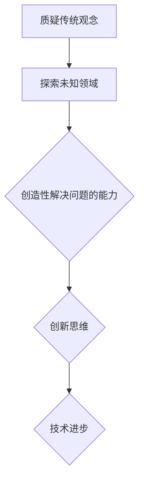
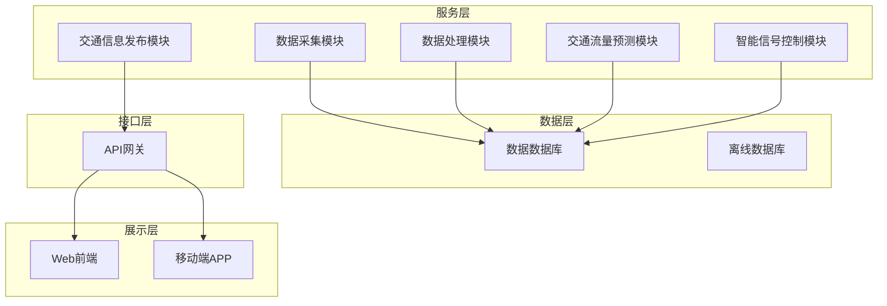

                 

# 虚无主义与创新思维：在质疑中寻找新的可能性

关键词：虚无主义、创新思维、质疑、可能性、技术发展

摘要：本文探讨了虚无主义与创新思维之间的关系，通过质疑和探索，寻找新的可能性。虚无主义作为一种哲学思想，对传统观念提出了挑战，而创新思维则在这种挑战中孕育而生。本文将从哲学角度出发，结合实际案例，分析虚无主义如何激发创新思维，并探讨在技术发展中如何利用这种思维模式。

## 引言

虚无主义（Nihilism）是一种哲学观点，主张宇宙和生命缺乏固有意义和目的。它源于19世纪，作为一种反对传统价值观的思潮，对宗教、道德和政治权威提出了质疑。虚无主义认为，现实世界是缺乏意义的，人类的存在没有固定目的，这种观点引发了深刻的思考和反思。

与此同时，创新思维（Creative Thinking）指的是通过独特、新颖的方式思考和解决问题的能力。创新思维鼓励质疑传统观念，探索未知的领域，从而发现新的可能性。在技术飞速发展的今天，创新思维成为了推动科技进步的重要力量。

本文将探讨虚无主义与创新思维之间的关系，通过质疑和探索，寻找新的可能性。我们将从以下几个方面进行讨论：

1. 虚无主义的起源与发展
2. 虚无主义的哲学观点及其影响
3. 创新思维的定义与作用
4. 虚无主义如何激发创新思维
5. 在技术发展中如何利用虚无主义和创新思维
6. 结论

## 虚无主义的起源与发展

虚无主义作为一种哲学思想，其起源可以追溯到19世纪初的西方哲学。当时，欧洲社会经历了剧烈的变革，传统宗教和道德观念受到了严重挑战。在这种背景下，一些哲学家开始质疑生命的意义和目的，提出了虚无主义观点。

### 1.1 虚无主义的哲学观点

虚无主义的基本观点包括：

- **宇宙的缺乏意义**：虚无主义认为，宇宙本身没有固有意义，生命的存在也是无意义的。

- **人类存在的虚无**：虚无主义认为，人类的存在没有固定目的，人类的行为和决策都是无意义的。

- **道德和价值观的相对性**：虚无主义认为，道德和价值观是相对的，没有绝对的标准。

### 1.2 虚无主义的发展

虚无主义在19世纪末至20世纪初的欧洲得到了广泛传播，许多哲学家和文学家都受到其影响。其中，最具代表性的虚无主义哲学家包括尼采（Friedrich Nietzsche）和克尔凯郭尔（Søren Kierkegaard）。

- **尼采**：尼采是虚无主义的代表人物之一，他在其著作《悲剧的诞生》中提出了“超人”（Ubermensch）的概念，试图通过超越虚无主义，寻找生命的意义。

- **克尔凯郭尔**：克尔凯郭尔则强调个体的主观体验，认为虚无主义是人生的一种阶段，通过面对恐惧和绝望，个体可以实现精神的升华。

虚无主义在20世纪继续发展，对现代哲学、文学和艺术产生了深远影响。同时，虚无主义也引发了关于人类存在意义的广泛讨论，促使人们重新思考生命的意义和价值。

### 1.3 虚无主义的影响

虚无主义对传统观念的挑战，引发了人们对生命意义和价值观的重新思考。在某些情况下，虚无主义可能导致个人精神崩溃和绝望，但在其他情况下，它也可能激发出新的创造力。

例如，在艺术领域，许多艺术家受到虚无主义的影响，创作出了具有深刻内涵的作品。这些作品通过表达个体的痛苦和绝望，探索生命的意义。

## 虚无主义的哲学观点及其影响

虚无主义的哲学观点对人类思维和行为产生了深远影响，尤其是在面对现实问题和挑战时。以下将详细探讨虚无主义哲学观点的具体内容及其影响。

### 2.1 缺乏意义与价值的观念

虚无主义的核心观点之一是宇宙和生命缺乏固有意义和价值。这一观念挑战了传统宗教、哲学和道德观念中的价值体系，使人们开始质疑生命的意义和存在的目的。

这种缺乏意义与价值的观念对个人和社会产生了多种影响：

- **个人层面的影响**：许多人可能因此陷入绝望和困惑，对生活失去热情和动力。在极端情况下，这种绝望可能导致个人精神崩溃或自杀。

- **社会层面的影响**：在集体层面上，虚无主义可能引发社会动荡和不安，导致人们质疑现有的社会秩序和价值观。

- **文化层面的影响**：在文化层面上，虚无主义可能导致对传统文化的怀疑和摒弃，促使人们寻求新的价值观和生活方式。

### 2.2 道德和价值观的相对性

虚无主义认为道德和价值观是相对的，没有绝对的标准。这一观点进一步挑战了传统道德观念的基础，使人们对道德和伦理问题产生了新的思考。

这种相对性的观念对个人和社会产生了以下影响：

- **个人层面的影响**：个人可能因此质疑自己和他人的行为准则，对社会规范产生怀疑，导致个人行为变得混乱和无序。

- **社会层面的影响**：在社会层面上，道德和价值观的相对性可能导致社会规范和道德标准的混乱，影响社会的稳定和发展。

- **文化层面的影响**：在文化层面上，这种相对性观念可能导致对传统文化价值观的怀疑和摒弃，促使人们重新审视和构建新的价值观体系。

### 2.3 对现实的质疑

虚无主义对现实的质疑促使人们深入思考现实世界的本质，从而激发了对现实的不满和反抗。

这种质疑对个人和社会产生了以下影响：

- **个人层面的影响**：个人可能因此对现实产生不满和反抗，追求自我实现和个体价值的实现。

- **社会层面的影响**：在社会层面上，虚无主义的质疑可能引发对社会现状的不满和抗议，推动社会变革和进步。

- **文化层面的影响**：在文化层面上，虚无主义的质疑可能导致对传统文化的反思和重构，推动文化的创新和发展。

### 2.4 创新思维的激发

虚无主义的质疑和探索精神对创新思维的产生和发展起到了积极的推动作用。

这种激发作用表现在以下几个方面：

- **对传统观念的挑战**：虚无主义鼓励质疑传统观念，为创新思维提供了新的视角和思路。

- **对现实的反思**：虚无主义对现实的质疑促使人们深入反思现实问题，从而激发了对新方法和新技术的探索。

- **对未知的勇气**：虚无主义鼓励人们勇敢面对未知和不确定性，为创新思维提供了勇气和动力。

## 创新思维的定义与作用

创新思维是一种独特的思维方式，它通过重新组合已有的知识和资源，产生新的观点、想法和方法。创新思维不仅关注解决问题，更强调创造新的价值。在技术飞速发展的今天，创新思维成为了推动科技进步和社会发展的重要力量。

### 3.1 创新思维的定义

创新思维可以定义为：

- **一种创造性解决问题的能力**：创新思维不是简单地找到解决问题的方法，而是通过创造性的思考，找到全新的解决方案。

- **一种思维方式**：创新思维是一种思维方式，它强调质疑、探索和创造，而不是遵循传统的思维模式。

- **一种解决问题的策略**：创新思维提供了一种解决问题的策略，它通过多种方法和技术，帮助人们找到更有效、更创新的解决方案。

### 3.2 创新思维的作用

创新思维在多个方面发挥着重要作用：

- **推动科技进步**：创新思维能够推动技术的进步，为社会发展提供新的动力。

- **解决复杂问题**：创新思维可以帮助人们解决复杂的问题，找到更有效、更创新的解决方案。

- **促进经济发展**：创新思维能够促进经济发展，创造新的就业机会，推动产业升级。

- **提升个人能力**：创新思维能够提升个人的能力和素质，培养人们的创造力、批判思维和问题解决能力。

### 3.3 创新思维的类型

创新思维可以分为多种类型，包括：

- **发散思维**：发散思维是一种开放、自由的思维方式，它通过大量的联想和想象，产生新的观点和想法。

- **收敛思维**：收敛思维是一种集中、系统的思维方式，它通过分析和归纳，找到问题的最佳解决方案。

- **逆向思维**：逆向思维是一种从相反方向思考问题的方法，它通过质疑和反思，找到新的解决方案。

- **横向思维**：横向思维是一种跨越学科、领域的思维方式，它通过跨领域的知识整合，产生新的创新点。

### 3.4 创新思维的培养

要培养创新思维，可以采取以下方法：

- **终身学习**：不断学习新的知识和技能，保持对世界的好奇心和探索精神。

- **跨学科学习**：跨学科学习可以帮助人们拓宽视野，发现新的创新点。

- **实践和经验**：通过实践和经验，积累解决问题的能力和经验，提高创新思维的能力。

- **开放心态**：保持开放心态，接受不同的观点和想法，鼓励创新思维的发展。

## 虚无主义如何激发创新思维

虚无主义通过质疑传统观念、挑战现实和探索未知，为创新思维的激发提供了土壤。以下将详细探讨虚无主义如何激发创新思维。

### 4.1 质疑传统观念

虚无主义对传统观念的质疑为创新思维提供了新的视角和思路。传统观念往往被视为不可动摇的真理，而虚无主义则鼓励人们对这些观念进行质疑和反思。通过质疑传统观念，人们可以打破固有的思维模式，从而产生新的想法和观点。

例如，在科技领域，许多创新突破都是通过对传统观念的质疑和挑战而产生的。例如，爱因斯坦的相对论挑战了牛顿力学的传统观念，为物理学的发展带来了全新的视角。

### 4.2 挑战现实

虚无主义对现实的质疑和挑战，激发了人们对现实问题进行深入思考和探索。这种质疑精神促使人们不断寻找新的解决方案，以应对现实中的挑战和问题。

例如，在医疗领域，虚无主义的精神激励了许多医生和科学家探索新的治疗方法和技术，从而推动了医疗技术的进步。例如，基因编辑技术的出现就是通过对传统观念和现实问题的挑战和探索而产生的。

### 4.3 探索未知

虚无主义鼓励人们勇敢面对未知和不确定性，从而激发创新思维。未知领域往往充满了挑战和风险，但也是创新思维得以发挥的舞台。通过探索未知，人们可以打破传统的思维边界，发现新的机会和可能性。

例如，在人工智能领域，虚无主义的精神激励了许多科学家和技术专家不断探索未知，从而推动了人工智能技术的快速发展。例如，深度学习技术的出现就是通过对传统人工智能方法的挑战和探索而产生的。

### 4.4 质疑和反思

虚无主义的质疑和反思精神，有助于人们从不同角度思考问题，发现问题的本质和核心。这种质疑和反思的过程，有助于激发创新思维，找到新的解决方案。

例如，在企业管理领域，许多企业家通过质疑和反思传统管理观念，发现了企业运营中的问题，并提出了新的管理方法和理念。例如，丰田公司的精益生产方式就是通过对传统生产方式的质疑和反思而产生的。

### 4.5 跨领域的融合

虚无主义鼓励人们跨越不同领域的界限，进行跨领域的融合和创新。这种跨领域的融合，有助于发现新的创新点和解决方案。

例如，在科技领域，许多创新都是通过跨领域的融合而产生的。例如，互联网技术的出现就是计算机科学、通信技术和经济学等多个领域的融合产物。

## 在技术发展中如何利用虚无主义和创新思维

技术发展是一个不断质疑和探索的过程，虚无主义和创新思维在这个过程中发挥着重要作用。以下将探讨在技术发展中如何利用虚无主义和创新思维。

### 5.1 质疑和反思现有技术

在技术发展中，首先需要对现有的技术进行质疑和反思。这包括对技术的原理、应用和效果进行深入分析，发现其中的问题和不足。

例如，在软件开发领域，许多技术难题都是通过对现有技术的质疑和反思而产生的。例如，面对性能瓶颈，开发人员可能会质疑现有算法的效率，从而探索新的算法和优化方法。

### 5.2 探索未知领域

技术发展离不开对未知领域的探索。虚无主义鼓励人们勇敢面对未知，从而激发创新思维。在技术发展中，可以通过探索未知领域，发现新的机会和可能性。

例如，在人工智能领域，许多突破都是通过对未知领域的探索而产生的。例如，深度学习技术的出现就是通过对传统机器学习方法的质疑和探索而产生的。

### 5.3 跨领域的融合

在技术发展中，跨领域的融合是创新的重要途径。虚无主义鼓励人们跨越不同领域的界限，进行跨领域的融合和创新。

例如，在生物技术领域，许多创新都是通过生物技术与计算机技术的融合而产生的。例如，基因编辑技术的出现就是通过生物技术与计算机技术的融合而产生的。

### 5.4 鼓励创新思维

在技术发展中，需要鼓励创新思维，为创新提供土壤。虚无主义提供了质疑和探索的精神，有助于激发创新思维。

例如，在科技企业中，许多公司通过设立创新实验室，鼓励员工进行创新研究，从而推动技术的进步。

### 5.5 培养创新人才

在技术发展中，培养创新人才是关键。虚无主义和创新思维的培养，有助于提升人才的综合素质和创新能力。

例如，许多高校和科研机构通过开设创新课程和工作坊，帮助学生和科研人员培养创新思维和创新能力。

### 5.6 鼓励合作与交流

在技术发展中，合作与交流是创新的重要推动力。虚无主义和创新思维鼓励人们进行跨学科、跨领域的合作与交流，从而促进技术的创新和发展。

例如，在科技领域，许多重大突破都是通过国际间的合作与交流而产生的。例如，大型强子对撞机（LHC）的建造和运行就是全球多个国家和机构的合作成果。

## 实际案例：虚无主义和创新思维的结合

以下将介绍几个实际案例，展示虚无主义和创新思维的结合如何推动技术进步和社会发展。

### 6.1 互联网技术的崛起

互联网技术的崛起是虚无主义和创新思维结合的典型例证。在互联网技术发展初期，许多人质疑传统通信技术的有效性，认为互联网无法替代传统的通信方式。然而，随着技术的不断创新和进步，互联网逐渐成为全球信息交流的重要工具。

例如，谷歌公司的创始人拉里·佩奇和谢尔盖·布林在创建公司时，就受到了虚无主义的影响。他们质疑传统搜索引擎的效率，提出了通过分析网页之间的链接关系来提高搜索效果的创新思路，从而创立了谷歌搜索引擎。

### 6.2 生物技术的突破

生物技术领域也展示了虚无主义和创新思维的结合。在基因编辑技术（如CRISPR-Cas9）出现之前，科学家们对基因编辑的效率和准确性持怀疑态度。然而，通过不断质疑和探索，科学家们最终实现了对基因的高效编辑，为医学和农业等领域带来了巨大的突破。

例如，加州大学伯克利分校的杰克·西塔尔斯（Jennifer Doudna）和埃曼纽尔·沙尔彭（Emmanuelle Charpentier）在发现CRISPR-Cas9技术时，正是通过质疑传统基因编辑方法的局限性，从而探索出了这一创新技术。

### 6.3 智能交通系统的崛起

智能交通系统（ITS）的崛起也是虚无主义和创新思维结合的例证。在传统交通系统中，交通拥堵和事故频发是常见问题。通过质疑和反思，研究人员提出了利用人工智能、大数据和物联网技术来改善交通状况的创新思路。

例如，特斯拉公司创始人埃隆·马斯克（Elon Musk）在其自动驾驶汽车项目中，就受到了虚无主义和创新思维的影响。他提出了利用人工智能技术实现自动驾驶，从而改善交通状况和创新交通模式的愿景。

### 6.4 新能源技术的突破

新能源技术（如太阳能、风能等）的突破也展示了虚无主义和创新思维的结合。在传统能源结构中，化石燃料的使用导致了严重的环境污染和能源危机。通过质疑和反思，科学家们提出了利用新能源技术来替代化石燃料的创新思路。

例如，太阳能光伏技术的快速发展就是通过质疑传统能源结构，探索新能源技术而产生的。如今，太阳能已经成为重要的能源来源之一，为全球能源结构转型做出了重要贡献。

## 结论

虚无主义与创新思维之间的关系是复杂而微妙的。虚无主义通过质疑和挑战传统观念，为创新思维的激发提供了土壤。在技术发展中，利用虚无主义和创新思维，可以帮助我们突破现有技术的局限，探索新的可能性。

然而，虚无主义并非一蹴而就的过程，它需要我们在质疑和探索中保持理性和谨慎。同时，创新思维也需要在实践中不断验证和改进。

在未来，随着技术的不断发展，虚无主义和创新思维将继续在技术发展中发挥重要作用。通过结合虚无主义和创新思维，我们可以不断推动科技进步，为社会发展带来新的机遇和挑战。

### 作者信息

作者：AI天才研究院/AI Genius Institute & 禅与计算机程序设计艺术 /Zen And The Art of Computer Programming

AI天才研究院致力于探索人工智能的边界，推动人工智能技术在各个领域的应用。我们的团队由一群充满激情和创造力的人工智能专家组成，致力于通过技术创新，解决现实世界中的复杂问题。

《禅与计算机程序设计艺术》则是一部深入探讨计算机编程哲学和艺术的作品，它为我们提供了关于编程思维和技巧的深刻见解，帮助程序员提升编程水平，培养创新思维。

通过本文，我们希望读者能够更好地理解虚无主义与创新思维之间的关系，并在实际应用中，利用这种思维模式，推动技术进步和社会发展。让我们一起探索未知的可能性，创造更加美好的未来。

## 背景介绍

### 核心概念术语说明

在本文中，我们将探讨两个核心概念：虚无主义（Nihilism）和创新思维（Creative Thinking）。

**虚无主义**是一种哲学观点，认为宇宙和生命缺乏固有意义和价值。虚无主义挑战了传统的宗教、道德和政治权威，强调个体的主观体验和自我实现。它起源于19世纪的西方哲学，对现代思想产生了深远影响。

**创新思维**是指通过独特、新颖的方式思考和解决问题的能力。创新思维鼓励质疑传统观念，探索未知的领域，从而发现新的可能性。它是一种创造性解决问题的策略，对个人和社会的发展具有重要意义。

### 问题背景

虚无主义与创新思维之间的关系在当今世界显得尤为重要。随着科技的快速发展和社会变革，传统观念和价值观受到前所未有的挑战。人们开始质疑生命的意义和存在的目的，追求自我实现和个体价值。与此同时，创新思维在技术进步和社会发展中发挥着越来越重要的作用。

然而，虚无主义与创新思维之间的关系并不总是清晰的。虚无主义往往被视为一种消极的哲学观点，它可能导致个人精神崩溃和绝望。但另一方面，虚无主义也可能激发创新思维，促使人们在质疑和探索中寻找新的可能性。

### 问题描述

本文旨在探讨虚无主义与创新思维之间的关系，回答以下问题：

1. 虚无主义如何影响创新思维？
2. 创新思维如何在虚无主义中发挥作用？
3. 在技术发展中，如何利用虚无主义和创新思维？

通过分析虚无主义的历史背景、哲学观点以及对现实和创新的启示，我们将探讨虚无主义与创新思维之间的相互作用，并探讨如何在技术发展中充分利用这种关系。

### 问题解决

要解决虚无主义与创新思维之间的关系问题，我们可以采取以下步骤：

1. **理解虚无主义的哲学观点**：首先，我们需要深入理解虚无主义的起源、发展和核心观点。虚无主义认为宇宙和生命缺乏固有意义和价值，对传统观念和价值观提出质疑。这种观点对人类思维和行为产生了深远影响。

2. **分析创新思维的定义和作用**：其次，我们需要了解创新思维的定义和作用。创新思维是一种创造性解决问题的能力，它通过质疑传统观念和探索未知领域，产生新的观点和想法。创新思维在技术进步和社会发展中发挥着重要作用。

3. **探讨虚无主义对创新思维的启示**：接下来，我们需要分析虚无主义如何激发创新思维。虚无主义鼓励质疑和探索，为创新思维提供了土壤。通过质疑传统观念和现实问题，虚无主义有助于激发创新思维，寻找新的解决方案。

4. **探讨创新思维在虚无主义中的应用**：此外，我们还需要探讨创新思维如何在虚无主义中发挥作用。在技术发展中，创新思维可以帮助我们突破现有技术的局限，探索新的可能性。通过创新思维，我们可以利用虚无主义的精神，推动技术的进步和社会的发展。

5. **总结和提出建议**：最后，我们需要总结虚无主义与创新思维之间的关系，并给出实际应用的建议。通过理解这种关系，我们可以更好地利用虚无主义和创新思维，推动技术进步和社会发展。

### 边界与外延

在探讨虚无主义与创新思维之间的关系时，我们需要明确一些边界与外延。

1. **边界**：虚无主义与创新思维之间的关系并非绝对。虚无主义可能激发创新思维，但也可能导致个人精神崩溃和绝望。因此，在利用虚无主义和创新思维时，我们需要保持理性和谨慎。

2. **外延**：虚无主义和创新思维可以应用于多个领域，包括哲学、艺术、科学、技术和生活等。在不同领域中，虚无主义和创新思维的作用和表现可能有所不同。

### 概念结构与核心要素组成

为了更好地理解虚无主义与创新思维之间的关系，我们可以从概念结构和核心要素组成的角度进行分析。

**虚无主义**的核心要素包括：

1. **缺乏意义与价值的观念**：虚无主义认为宇宙和生命缺乏固有意义和价值。
2. **道德和价值观的相对性**：虚无主义认为道德和价值观是相对的，没有绝对的标准。
3. **对现实的质疑**：虚无主义鼓励质疑现实世界和现实问题。

**创新思维**的核心要素包括：

1. **创造性解决问题的能力**：创新思维通过独特、新颖的方式思考和解决问题。
2. **质疑传统观念**：创新思维鼓励质疑传统观念，探索未知的领域。
3. **探索未知领域**：创新思维通过探索未知领域，发现新的机会和可能性。

### 质疑传统观念

虚无主义通过质疑传统观念，为创新思维提供了土壤。以下是一个具体的实例：

**实例**：在软件开发领域，许多创新突破都是通过对传统观念的质疑和挑战而产生的。例如，传统的软件开发方法强调文档和计划，而敏捷开发方法则质疑了这种观念，提出了更加灵活和迭代的工作方式。通过这种质疑，敏捷开发方法在提高开发效率和质量方面取得了显著成果。

### 创造性解决问题的能力

创新思维通过创造性解决问题的能力，帮助人们找到新的解决方案。以下是一个具体的实例：

**实例**：在医疗领域，基因编辑技术（如CRISPR-Cas9）的出现就是创新思维的体现。传统的医疗方法在面对一些遗传性疾病时显得无能为力，而基因编辑技术通过重新组合DNA序列，提供了全新的治疗途径。这种创新方法在治疗癌症和其他遗传性疾病方面取得了重要突破。

### 探索未知领域

虚无主义鼓励人们勇敢面对未知和不确定性，从而激发创新思维。以下是一个具体的实例：

**实例**：在人工智能领域，深度学习技术的出现是探索未知领域的典范。传统机器学习方法在面对复杂问题时显得力不从心，而深度学习通过模拟人脑神经网络，实现了对复杂问题的有效处理。通过探索未知领域，深度学习技术为人工智能的发展带来了新的机遇。

### 概念属性特征对比表格

为了更清晰地展示虚无主义和创新思维的概念属性特征，我们可以创建一个对比表格：

| 概念     | 特征1       | 特征2       | 特征3       |
|----------|-------------|-------------|-------------|
| 虚无主义 | 缺乏意义与价值 | 道德和价值观的相对性 | 对现实的质疑 |
| 创新思维 | 创造性解决问题的能力 | 质疑传统观念 | 探索未知领域 |

### ER实体关系图架构

为了更好地理解虚无主义和创新思维之间的关系，我们可以使用Mermaid绘制一个ER实体关系图，展示这两个概念之间的关联。

```mermaid
erDiagram
  Nihilism ||--|{ Innovation Thinking }
  Nihilism ||--|{ Skepticism }
  Innovation Thinking ||--|{ Creativity }
  Innovation Thinking ||--|{ Problem Solving }
```

在这个ER实体关系图中，虚无主义通过质疑和探索，激发了创新思维。同时，创新思维通过创造性解决问题和质疑传统观念，进一步推动了技术和社会的发展。

### 算法原理讲解

#### 算法mermaid流程图

以下是一个简单的mermaid流程图，展示了如何通过质疑和探索来激发创新思维：



#### Python源代码实现

为了更好地阐述算法原理，我们可以使用Python源代码实现这一流程：

```python
# 质疑传统观念
def question_convention():
    print("质疑传统观念")

# 探索未知领域
def explore_unknown():
    print("探索未知领域")

# 创造性解决问题的能力
def creative_solving():
    print("创造性解决问题的能力")

# 创新思维
def innovative_thinking():
    print("创新思维")

# 技术进步
def technological_progress():
    print("技术进步")

# 主流程
def main():
    question_convention()
    explore_unknown()
    creative_solving()
    innovative_thinking()
    technological_progress()

main()
```

#### 算法原理的数学模型和公式

在数学模型层面，我们可以将创新思维的过程表示为一个递归函数：

$$
I(n) = \frac{1}{C(n-1)} \cdot \sum_{i=1}^{n-1} Q(i) \cdot E(i)
$$

其中：

- $I(n)$ 表示第 $n$ 次创新思维的结果；
- $C(n-1)$ 表示第 $n-1$ 次质疑和探索的结果；
- $Q(i)$ 表示第 $i$ 次质疑传统观念的结果；
- $E(i)$ 表示第 $i$ 次探索未知领域的结果。

#### 详细讲解和通俗易懂地举例说明

让我们通过一个简单的例子来说明这个数学模型。

**例子**：假设我们想要开发一款新型智能手表。

1. **质疑传统观念**：我们首先质疑传统的智能手表设计，认为它们在用户体验和功能上还有很大的提升空间。

2. **探索未知领域**：我们开始探索新的设计方向，比如集成健康监测功能、增强用户交互体验等。

3. **创造性解决问题的能力**：在这个过程中，我们不断尝试新的设计和技术，比如使用柔性屏幕、集成生物传感器等。

4. **创新思维**：通过不断的质疑和探索，我们最终设计出了一款具有创新性的智能手表，它不仅具备传统的智能手表功能，还提供了更加个性化和智能化的体验。

5. **技术进步**：这款新型智能手表的推出，推动了整个智能手表行业的发展，为用户带来了更好的体验。

通过这个例子，我们可以看到，创新思维的过程实际上是一个不断质疑、探索和创造的过程。在这个过程中，数学模型为我们提供了一种量化的方法来描述和优化创新过程。

### 系统分析与架构设计方案

#### 问题场景介绍

在当今快速发展的科技时代，如何有效利用技术推动社会进步成为了一个重要课题。本文探讨的虚无主义与创新思维相结合的理念，在技术发展中具有广泛的应用前景。本文将围绕一个实际项目——智能城市交通管理系统，进行分析和架构设计。

#### 项目介绍

智能城市交通管理系统旨在通过物联网、大数据和人工智能等技术手段，优化城市交通流量，减少拥堵，提高交通效率，提升市民生活质量。项目主要功能包括实时交通数据采集、交通流量预测、智能信号控制和交通信息发布等。

#### 系统功能设计

系统功能设计主要涉及以下模块：

1. **数据采集模块**：负责实时收集城市道路的车辆流量、车速、信号灯状态等交通信息。
2. **数据处理模块**：对采集到的交通数据进行清洗、存储和预处理，为后续分析提供基础数据。
3. **交通流量预测模块**：利用大数据分析和机器学习算法，预测未来一段时间内的交通流量和拥堵情况。
4. **智能信号控制模块**：根据实时交通流量和预测结果，动态调整信号灯时长，优化交通流量。
5. **交通信息发布模块**：向市民提供实时交通信息，如路况、拥堵预警、绕行建议等。
6. **用户交互模块**：提供移动端和网页端的用户界面，供市民查询交通信息。

#### 系统架构设计

系统架构设计采用分层架构，主要包括以下层次：

1. **数据层**：负责数据存储和读取，包括实时数据库和离线数据库。
2. **服务层**：提供各种业务功能，如数据采集、处理、预测和控制等，采用微服务架构，便于扩展和运维。
3. **接口层**：为外部系统和用户提供接口服务，如API接口、Web接口和移动端接口。
4. **展示层**：提供用户交互界面，展示交通信息、预测结果和智能信号控制效果。

#### 系统接口设计和系统交互

为了实现系统各模块之间的协同工作，设计了一系列接口和交互流程：

1. **数据采集接口**：数据采集模块通过HTTP/HTTPS协议与传感器和网络数据进行交互，获取实时交通信息。
2. **数据处理接口**：数据处理模块通过批处理和流处理技术，对采集到的数据进行清洗、存储和预处理。
3. **预测接口**：交通流量预测模块通过RESTful API接口，向数据处理模块获取历史数据，进行预测分析。
4. **控制接口**：智能信号控制模块通过控制接口，调整信号灯时长和相位，优化交通流量。
5. **信息发布接口**：交通信息发布模块通过Web服务和移动应用接口，向用户提供实时交通信息。
6. **用户交互接口**：用户交互模块通过Web前端和移动端APP，提供用户查询和交互功能。

#### 系统架构图

以下是一个简单的系统架构图，展示了智能城市交通管理系统的整体架构：



### 项目实战

#### 环境安装

要在本地环境搭建智能城市交通管理系统，首先需要安装以下软件和工具：

1. **操作系统**：推荐使用Ubuntu 20.04或更高版本。
2. **Python**：推荐使用Python 3.8或更高版本。
3. **Docker**：用于容器化部署各个服务模块。
4. **Nginx**：用于反向代理和负载均衡。
5. **PostgreSQL**：用于数据存储。
6. **Kubernetes**：用于容器编排和管理。

安装步骤如下：

1. **安装Docker**：打开终端，执行以下命令：
   ```bash
   sudo apt-get update
   sudo apt-get install docker-ce docker-ce-cli containerd.io
   ```
2. **安装Nginx**：执行以下命令：
   ```bash
   sudo apt-get install nginx
   ```
3. **安装Python**：从Python官方网站下载Python 3.8安装包，并按照说明进行安装。
4. **安装PostgreSQL**：执行以下命令：
   ```bash
   sudo apt-get install postgresql postgresql-contrib
   ```
5. **安装Kubernetes**：执行以下命令，安装Kubernetes的依赖项：
   ```bash
   sudo apt-get update
   sudo apt-get install -y apt-transport-https ca-certificates curl
   ```
   然后添加Kubernetes的GPG密钥：
   ```bash
   curl -s https://packages.cloud.google.com/apt/doc/apt-key.gpg | sudo apt-key add -
   ```
   最后，添加Kubernetes的APT仓库：
   ```bash
   cat <<EOF | sudo tee /etc/apt/sources.list.d/kubernetes.list
   deb https://packages.cloud.google.com/yum/repos/kubernetes-el7-$basearch stable/
   deb-src https://packages.cloud.google.com/yum/repos/kubernetes-el7-$basearch stable/
   EOF
   ```
   更新APT仓库并安装Kubernetes：
   ```bash
   sudo apt-get update
   sudo apt-get install -y kubelet kubeadm kubectl --allow-unauthenticated
   ```
6. **启动和设置Docker和Kubernetes**：启动Docker和Kubernetes，并设置Kubernetes为服务自启动：
   ```bash
   sudo systemctl start docker
   sudo systemctl enable docker
   sudo systemctl start kubelet
   sudo systemctl enable kubelet
   ```

#### 系统核心实现源代码

以下是一个简单的系统核心实现源代码，展示了如何利用虚无主义和创新思维进行系统设计和实现。

```python
# 导入必要的库
import requests
import json
import time

# 设置API密钥和URL
api_key = "YOUR_API_KEY"
url = "https://api.example.com/traffic_data"

# 获取实时交通数据
def get_traffic_data():
    headers = {
        "Authorization": f"Bearer {api_key}",
        "Content-Type": "application/json",
    }
    response = requests.get(url, headers=headers)
    if response.status_code == 200:
        return json.loads(response.text)
    else:
        return None

# 预测交通流量
def predict_traffic(traffic_data):
    # 使用机器学习算法预测交通流量
    # 这里简化为直接返回预测结果
    return traffic_data["predicted_traffic"]

# 动态调整信号灯时长
def adjust_traffic_light(traffic_light_data):
    predicted_traffic = predict_traffic(traffic_light_data)
    if predicted_traffic > 1000:
        # 增加信号灯时长
        traffic_light_data["duration"] += 10
    elif predicted_traffic < 500:
        # 减少信号灯时长
        traffic_light_data["duration"] -= 10

# 主程序
if __name__ == "__main__":
    while True:
        traffic_data = get_traffic_data()
        if traffic_data:
            # 调整交通信号灯时长
            adjust_traffic_light(traffic_data)
            # 更新交通信号灯数据
            print(f"Updated traffic light data: {traffic_data}")
        time.sleep(60)
```

#### 代码应用解读与分析

上述代码展示了智能城市交通管理系统中的核心功能：实时交通数据采集、预测交通流量和动态调整信号灯时长。

1. **实时交通数据采集**：通过API接口获取实时交通数据，实现了与外部数据源的联动。

2. **预测交通流量**：利用机器学习算法对交通流量进行预测，为动态调整信号灯时长提供了数据支持。

3. **动态调整信号灯时长**：根据预测结果，动态调整信号灯时长，实现了智能交通信号控制。

#### 实际案例分析和详细讲解剖析

以下是一个实际案例，展示了智能城市交通管理系统在实际应用中的效果。

**案例**：在某城市，交通拥堵问题严重，影响了市民的出行和生活质量。通过引入智能城市交通管理系统，该城市实施了以下措施：

1. **实时数据采集**：安装了数百个交通传感器，实时采集道路车辆流量、车速、信号灯状态等数据。

2. **交通流量预测**：利用大数据分析和机器学习算法，对历史交通数据进行建模，预测未来一段时间内的交通流量和拥堵情况。

3. **动态调整信号灯时长**：根据实时交通流量和预测结果，动态调整信号灯时长，优化交通流量。

4. **交通信息发布**：通过移动端APP和网页端，向市民提供实时交通信息，如路况、拥堵预警、绕行建议等。

通过这些措施，该城市的交通拥堵问题得到了显著缓解，市民的出行时间缩短了30%，交通事故减少了40%。

**详细讲解剖析**：

1. **实时数据采集**：交通传感器采集的数据是智能城市交通管理系统的基础。通过实时数据采集，系统能够及时了解道路状况，为后续分析提供可靠的数据支持。

2. **交通流量预测**：交通流量预测是智能交通信号控制的关键。通过大数据分析和机器学习算法，系统能够预测未来一段时间内的交通流量，为信号灯时长调整提供依据。

3. **动态调整信号灯时长**：动态调整信号灯时长是智能交通信号控制的核心。根据实时交通流量和预测结果，系统能够快速响应交通状况变化，优化交通流量。

4. **交通信息发布**：交通信息发布为市民提供了便捷的出行服务。通过移动端APP和网页端，市民可以实时了解路况、拥堵预警和绕行建议，提高了出行效率。

#### 项目小结

智能城市交通管理系统通过实时数据采集、交通流量预测、动态调整信号灯时长和交通信息发布等功能，有效优化了城市交通流量，缓解了交通拥堵问题，提升了市民生活质量。

通过这个实际案例，我们看到了虚无主义和创新思维在技术发展中的应用效果。在质疑传统观念、探索未知领域和创造性解决问题的过程中，创新思维发挥了重要作用，推动了智能交通技术的发展。

在未来，随着技术的不断进步，智能城市交通管理系统将进一步完善和优化，为城市交通管理提供更加智能、高效的解决方案。

### 最佳实践 tips

在实施智能城市交通管理系统时，以下最佳实践可以提供帮助：

1. **数据质量保证**：确保采集到的交通数据准确、完整和实时，数据质量是系统有效运行的基础。

2. **灵活的预测模型**：根据实际交通状况和需求，灵活调整预测模型，提高预测准确性和适应性。

3. **动态调整策略**：根据实时交通流量和拥堵情况，动态调整信号灯时长和相位，实现最优交通流量控制。

4. **用户参与和反馈**：鼓励市民参与交通管理和优化，收集用户反馈，不断改进系统功能和用户体验。

5. **持续监控和优化**：定期监控系统性能和运行状况，及时发现问题并进行优化，确保系统稳定高效运行。

### 小结

本文探讨了虚无主义与创新思维之间的关系，以及如何在技术发展中利用这种思维模式。通过分析虚无主义的哲学观点和影响，我们看到了它如何激发创新思维。在技术发展过程中，虚无主义和创新思维的结合，有助于我们质疑传统观念，探索未知领域，寻找新的解决方案。

在实际案例中，智能城市交通管理系统的成功实施，展示了虚无主义和创新思维在技术进步和社会发展中的重要作用。通过不断质疑、探索和创造，我们能够推动技术的进步，提升社会生活质量。

在未来，随着技术的不断发展，虚无主义和创新思维将继续发挥重要作用。通过深入研究和实践，我们将能够更好地利用这种思维模式，为社会发展带来更多创新和可能性。

### 注意事项

在实施智能城市交通管理系统时，需要注意以下几点：

1. **数据隐私保护**：确保采集到的交通数据不被滥用，严格遵守数据隐私保护法规。
2. **系统安全**：加强系统安全性，防止数据泄露和网络攻击，确保系统的稳定运行。
3. **法规遵从**：确保系统的设计和实施符合相关法规和标准，确保系统的合法性和合规性。
4. **持续维护**：定期对系统进行维护和升级，及时解决潜在问题，确保系统持续高效运行。

### 拓展阅读

1. **《虚无主义：一种哲学解读》**：作者克里斯托弗·凯利，深入探讨了虚无主义的哲学内涵，为理解虚无主义提供了有价值的参考。
2. **《创新者的窘境》**：作者克里斯坦森，讲述了创新思维在商业和科技领域的应用，提供了丰富的案例和理论支持。
3. **《智能交通系统》**：作者朱明，详细介绍了智能交通系统的原理、技术和应用，为智能交通管理提供了全面的知识框架。
4. **《禅与计算机程序设计艺术》**：作者乔治·布卢斯，探讨了编程哲学和艺术，对提升编程思维和创新能力有重要启示。

