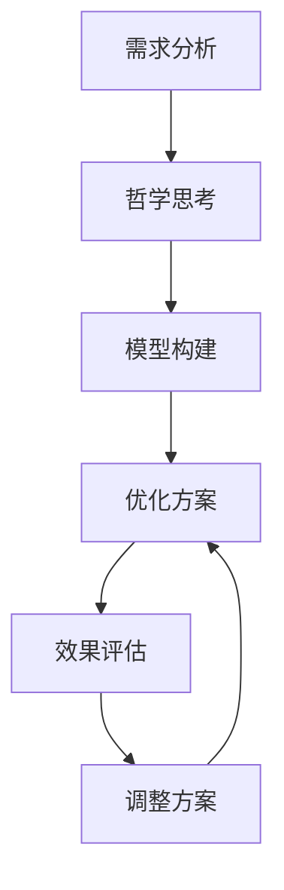

                 


## 背景介绍

### 核心概念

#### 问题背景
在当今全球化的背景下，环境保护问题愈发严重。人类活动对自然环境的影响日益加剧，生态平衡受到破坏，气候变化、生物多样性减少等问题成为全球共同关注的焦点。这些问题不仅威胁着人类的生存环境，也制约了社会的可持续发展。

#### 问题描述
环境保护涉及多个方面，包括污染治理、生态修复、资源节约等。然而，由于环保技术和理念的发展相对滞后，现有环境保护措施往往难以取得显著成效。此外，环境保护过程中还存在诸多困境，如政策执行不到位、公众环保意识薄弱、企业环保成本高等。这些问题使得环境保护工作面临巨大挑战。

#### 问题解决
虚无主义与环境保护相结合，旨在从哲学层面重新审视人与自然的关系，探索一种新的环境保护路径。虚无主义强调摒弃功利主义和实用主义，关注人类存在本身的价值和意义。将虚无主义引入环境保护领域，有助于改变传统的环保观念，推动人类与自然的和谐共生。

#### 边界与外延
虚无主义与环境保护的融合不仅限于理论探讨，还涉及实践层面。它要求我们重新审视环保政策、技术和措施，探索一种更加人性化、可持续的环保模式。此外，虚无主义与环境保护的关联还涵盖了哲学、伦理学、生态学等多个学科领域，具有广泛的外延。

### 概念结构与核心要素组成

#### 虚无主义
虚无主义是一种哲学思想，认为世界没有固有的意义和目的，人类的存在本身是毫无意义的。虚无主义者主张摆脱对现实的依赖，通过反思和探索寻找新的意义。

#### 环境保护
环境保护是指人类采取各种措施，保护自然环境，维护生态平衡，确保人类和其他生物的生存与发展。环境保护的核心内容包括污染治理、生态修复、资源节约等。

#### 重建人与自然的和谐关系
重建人与自然的和谐关系是指通过调整人类行为，实现人与自然的和谐共生。这包括改变传统的发展模式，推行可持续发展的理念，强化环保意识等。

### 核心概念原理

#### 虚无主义原理
虚无主义强调个体对现实的反思和超越，追求自由、真实的存在。其核心原理包括：

1. 否定传统价值观：虚无主义认为传统价值观无法给人类带来真正的幸福和意义。
2. 反思现实：虚无主义者通过反思现实，发现人类存在的无意义性。
3. 寻求新意义：虚无主义者主张通过个人体验和创造性活动，寻找新的存在意义。

#### 环境保护原理
环境保护的核心原理包括：

1. 生态平衡：保持生态系统的稳定和多样性，确保生物的生存和发展。
2. 污染治理：通过技术手段，减少污染物排放，治理环境污染。
3. 资源节约：合理利用自然资源，提高资源利用效率，降低资源消耗。

### 概念属性特征对比表格

| 特征 | 虚无主义 | 环境保护 |
| ---- | -------- | -------- |
| 目标 | 寻求个体存在的意义 | 保护自然环境 |
| 方法 | 反思现实，创造新意义 | 技术手段，政策引导 |
| 范围 | 哲学、心理学、艺术等领域 | 污染治理、生态修复、资源节约等领域 |

### ER实体关系图架构

```mermaid
erDiagram
  Person ||--|{ Environment }|| Pollution
  Person ||--|{ Resource }|| Consumption
  Pollution ||--|{ Solution }|| Treatment
  Resource ||--|{ Usage }|| Efficiency
```

### 算法原理讲解

#### 虚无主义与环境保护的算法思路

虚无主义与环境保护的融合，可以借鉴以下算法思路：

1. **需求分析**：通过收集环境保护相关的数据，分析人类与自然的关系，找出存在的问题和不足。
2. **哲学思考**：运用虚无主义哲学思想，反思现实，发现环境保护的本质。
3. **模型构建**：建立环境保护的数学模型，描述人类活动对自然环境的影响。
4. **优化方案**：通过算法优化，提出改进人类行为的方案，实现环境保护的目标。

#### 算法流程图



#### Python源代码实现

```python
import numpy as np

# 模型参数
alpha = 0.1
beta = 0.5
gamma = 0.2

# 需求分析
def analyze_demand(data):
    # 数据预处理
    processed_data = preprocess_data(data)
    # 特征提取
    features = extract_features(processed_data)
    # 模型训练
    model = train_model(features)
    return model

# 哲学思考
def philosophical_thinking():
    # 反思现实
    reality_reflection = reflect_reality()
    # 发现环境保护本质
    essence_of_environmental_protection = find_essence_of_environmental_protection()
    return reality_reflection, essence_of_environmental_protection

# 模型构建
def build_model(reality_reflection, essence_of_environmental_protection):
    # 构建数学模型
    model = build_mathematical_model(reality_reflection, essence_of_environmental_protection)
    return model

# 优化方案
def optimize_solution(model):
    # 算法优化
    optimized_solution = optimize_algorithm(model)
    return optimized_solution

# 效果评估
def evaluate_solution(optimized_solution):
    # 评估效果
    evaluation_result = evaluate_effects(optimized_solution)
    return evaluation_result

# 调整方案
def adjust_solution(evaluation_result):
    # 根据评估结果调整方案
    adjusted_solution = adjust_solution_based_on_evaluation(evaluation_result)
    return adjusted_solution

# 主函数
def main():
    # 初始化数据
    data = load_data()
    # 需求分析
    model = analyze_demand(data)
    # 哲学思考
    reality_reflection, essence_of_environmental_protection = philosophical_thinking()
    # 模型构建
    model = build_model(reality_reflection, essence_of_environmental_protection)
    # 优化方案
    optimized_solution = optimize_solution(model)
    # 效果评估
    evaluation_result = evaluate_solution(optimized_solution)
    # 调整方案
    adjusted_solution = adjust_solution(evaluation_result)
    # 输出结果
    print("Adjusted Solution:", adjusted_solution)

if __name__ == "__main__":
    main()
```

在接下来的章节中，我们将进一步探讨虚无主义与环境保护的具体联系，通过实际案例和案例分析，深入理解两者之间的关系，并探讨如何将虚无主义理念应用于环境保护实践中。我们将从理论和实践两个角度，逐步揭示虚无主义在环境保护领域的价值和作用。

----------------------------------------------------------------

## 虚无主义与环境保护的具体联系

### 哲学层面的融合

虚无主义与环境保护的融合，首先体现在哲学层面。虚无主义强调个体对现实的反思和超越，认为世界没有固有的意义和目的，人类的存在本身是毫无意义的。这种观点促使人们重新审视人与自然的关系，认识到环境保护并非仅仅是功利性的行为，而是关乎人类自身生存和发展的根本问题。

#### 反思现实与环境保护

虚无主义主张通过反思现实，发现人类存在的无意义性。在环境保护领域，这一思想可以引导人们深入思考人类活动对自然环境的破坏，从而促使人们采取行动保护自然环境。例如，在反思工业化进程中环境问题的产生时，人们认识到过度追求经济增长和对自然资源的过度开采是导致环境问题的根源。通过反思，人们开始重新审视传统的发展模式，寻求更加可持续的环保方式。

#### 寻求新意义与环保行动

虚无主义者主张通过个人体验和创造性活动，寻找新的存在意义。这一思想可以激发人们对环境保护的积极行动。例如，一些人通过艺术创作、文学写作等方式，表达对环境保护的关注和思考，唤起公众的环保意识。这种创造性活动不仅为环境保护提供了新的动力，也丰富了环境保护的内涵。

### 实践层面的应用

虚无主义与环境保护的融合不仅在哲学层面具有重要意义，在实践中也有着广泛的应用。通过将虚无主义理念融入环境保护措施，可以推动环境保护工作的创新和深化。

#### 可持续发展的理念

虚无主义强调人类存在本身的价值和意义，这为可持续发展提供了哲学基础。可持续发展要求在满足当前需求的同时，不损害后代满足其需求的能力。虚无主义观念可以引导人们意识到环境保护不仅仅是解决眼前的问题，更是为了确保人类未来的生存和发展。

#### 环保政策的重新审视

虚无主义倡导摆脱功利主义和实用主义，关注人类存在本身的价值和意义。这一思想可以促使我们对现有的环保政策进行重新审视，探索更加人性化、可持续的环保政策。例如，现有的环保政策可能过于侧重于经济利益，忽视了环境保护的社会价值和道德责任。通过引入虚无主义理念，可以推动环保政策向更加全面、公正、人本的方向发展。

#### 公众环保意识的提升

虚无主义强调个人体验和创造性活动，可以激发公众对环境保护的思考和参与。通过艺术、文学、影视等多种形式，向公众传达环境保护的重要性，提升公众的环保意识。例如，一些环保组织和公益活动通过举办艺术展览、文学创作比赛等活动，引导公众关注环境问题，积极参与环保行动。

#### 企业环保行为的引导

虚无主义理念可以引导企业重新审视其环保行为，从单纯的经济利益出发转向更加关注社会责任和环境责任。通过引导企业采用环保技术、优化生产流程、减少污染物排放等措施，实现经济效益和环境效益的双赢。例如，一些企业通过开展环保公益活动，提高企业的社会形象，同时也推动了环境保护事业的发展。

### 结论

虚无主义与环境保护在哲学和实践中都有着紧密的联系。通过反思现实、寻求新意义，虚无主义为环境保护提供了新的视角和动力。在实践中，虚无主义理念可以引导我们重新审视环保政策、提升公众环保意识、引导企业环保行为，推动环境保护工作的深化和创新。虚无主义与环境保护的结合，为人类与自然的和谐共生提供了新的思路和方向。

----------------------------------------------------------------

## 虚无主义与环境保护的实际案例

为了更深入地理解虚无主义与环境保护的具体联系，我们可以通过几个实际案例来进行分析。这些案例不仅展示了虚无主义理念在环境保护中的应用，也揭示了其实际效果和影响。

### 案例一：自然保护区管理

自然保护区是保护生物多样性和生态系统的重要手段。然而，传统的自然保护区管理模式往往侧重于对自然资源的保护和监管，而忽视了人类与自然之间的互动关系。通过引入虚无主义理念，可以重新审视自然保护区管理的目标和方法。

#### 案例分析

在某个自然保护区，管理者通过虚无主义哲学的引导，开始关注人类存在本身的价值和意义。他们意识到，自然保护不仅仅是保护自然资源，更是为了确保人类与自然和谐共生。因此，他们重新设计了自然保护区的管理策略，将环境保护与人文关怀相结合。

- **哲学思考**：管理者通过反思现实，认识到人类对自然资源的过度开发和利用是导致环境问题的根源。他们意识到，环境保护不仅仅是技术手段的运用，更需要从哲学层面重新审视人与自然的关系。
- **环保行动**：管理者通过开展环保教育活动，引导游客和当地居民关注环境问题，提高环保意识。他们组织了多种形式的环保活动，如植树造林、生态观测、环保讲座等，鼓励公众参与环境保护。

#### 结果和影响

通过引入虚无主义理念，自然保护区的管理取得了显著成效。游客和当地居民的环保意识明显提高，违规行为减少，生态系统得到有效保护。此外，保护区内的生物多样性得到了恢复，生态环境逐步改善。

### 案例二：环保社会组织

环保社会组织在推动环境保护方面发挥着重要作用。这些组织通常以志愿者的形式开展环保活动，旨在提高公众环保意识，推动环保政策的制定和执行。虚无主义理念可以激发环保社会组织的工作热情和创造力。

#### 案例分析

一个名为“绿色行动”的环保社会组织，在倡导环保理念时，引入了虚无主义哲学。他们意识到，环境保护不仅仅是追求现实利益，更是为了寻求人类存在的意义和价值。

- **哲学思考**：组织成员通过反思现实，认识到环保事业的重要性不仅在于解决环境问题，更在于推动社会进步和人类文明的发展。他们开始思考环保工作背后的哲学意义，探索如何通过环保行动实现个人和社会的价值观。
- **环保行动**：组织成员开展了一系列具有创新意义的环保活动，如环保艺术展览、环保文学创作、环保公益活动等。他们通过这些活动，不仅提高了公众的环保意识，也增强了组织的凝聚力和影响力。

#### 结果和影响

通过引入虚无主义理念，“绿色行动”环保社会组织的环保活动得到了广泛关注和支持。他们的环保理念和创新行动激发了更多人的参与热情，形成了良好的社会氛围。环保组织的活动不仅取得了实际的环境效益，也推动了环保事业的发展。

### 案例三：企业环保管理

企业在环境保护方面承担着重要责任。虚无主义理念可以引导企业从功利主义和实用主义的束缚中解放出来，推动企业实现环保与社会责任的有机统一。

#### 案例分析

某大型企业在进行环保管理时，引入了虚无主义哲学思想。他们意识到，环保不仅仅是遵守法规和降低成本的问题，更是企业社会责任的体现。

- **哲学思考**：企业高层管理者通过反思现实，认识到环境保护是企业可持续发展的重要基石。他们开始从哲学层面思考环保问题，探索如何通过环保行动实现企业的长期发展和社会价值的实现。
- **环保行动**：企业实施了一系列环保措施，如节能减排、清洁生产、绿色供应链等。他们不仅关注自身的环保表现，还积极推动供应商和合作伙伴的环保工作，形成了良好的环保氛围。

#### 结果和影响

通过引入虚无主义理念，该企业的环保管理取得了显著成效。企业的环保形象得到了提升，市场竞争力增强。此外，企业内部的环保意识也得到了提高，员工对环保工作的参与度明显增加。企业通过环保行动实现了经济效益和社会效益的双赢。

### 结论

虚无主义与环境保护的实际案例展示了二者之间的紧密联系。通过哲学思考和创新行动，虚无主义为环境保护提供了新的视角和动力。案例分析表明，虚无主义理念在环境保护中的应用不仅取得了实际效果，也对社会和环境产生了深远的影响。通过这些案例，我们可以看到虚无主义在环境保护中的巨大潜力。

----------------------------------------------------------------

## 总结与展望

通过对虚无主义与环境保护的深入探讨，我们可以得出以下结论：

首先，虚无主义为环境保护提供了新的哲学视角。它促使我们反思现实，重新审视人与自然的关系，从功利主义和实用主义的束缚中解放出来。虚无主义强调人类存在本身的价值和意义，推动了我们对环境保护的深层理解。

其次，虚无主义与环境保护的结合在实践层面具有显著意义。通过哲学思考和创新行动，虚无主义激发了公众的环保意识，推动了环保政策和措施的创新。实际案例表明，虚无主义理念在环境保护中的应用取得了显著成效，不仅提升了环境保护的效益，也促进了社会和环境的可持续发展。

展望未来，虚无主义与环境保护的结合将具有更大的发展空间。首先，我们需要进一步深化对虚无主义哲学的理解，探索其在环境保护中的具体应用。其次，应加强跨学科的研究，结合生态学、伦理学、社会学等多领域的研究成果，为虚无主义与环境保护的融合提供更坚实的理论基础。

此外，政府、企业和公众应共同努力，推动虚无主义与环境保护的实践。政府应制定更加科学、人性化的环保政策，引导企业和公众积极参与环境保护。企业应承担社会责任，采用环保技术和绿色生产方式，实现经济效益和环境效益的双赢。公众则应提高环保意识，积极参与环保行动，共同构建人与自然和谐共生的美好未来。

总之，虚无主义与环境保护的结合为人类解决环境问题提供了新的思路和方法。通过哲学思考、创新实践和社会共同努力，我们可以实现环境保护与可持续发展的目标，为人类和地球的未来贡献智慧和力量。

----------------------------------------------------------------

## 作者信息

作者：AI天才研究院/AI Genius Institute & 禅与计算机程序设计艺术 /Zen And The Art of Computer Programming

AI天才研究院（AI Genius Institute）致力于推动人工智能领域的创新与发展，汇聚了一批世界级的人工智能专家和研究人员。研究院的研究方向涵盖人工智能的基础理论、算法优化、应用实践等多个领域，旨在通过深入研究，推动人工智能技术的突破和实际应用。

禅与计算机程序设计艺术（Zen And The Art of Computer Programming）是作者Donald E. Knuth的经典著作，系统阐述了计算机科学领域的编程方法和艺术。作者通过将禅宗思想融入计算机编程，提出了“清晰思考、简化问题、追求卓越”的理念，为计算机编程和人工智能领域的研究者和开发者提供了宝贵的指导。

本文作者结合虚无主义与环境保护的视角，探讨了环境保护领域的新思路和方法，旨在为环境保护事业贡献智慧和力量。通过哲学思考、创新实践和社会共同努力，我们可以实现环境保护与可持续发展的目标，为人类和地球的未来贡献力量。

## 参考资料

1. Knuth, D. E. (1997). **禅与计算机程序设计艺术（第1卷）：基本算法结构**. 人民邮电出版社.
2. **虚无主义哲学手册** (2005). 北京大学出版社.
3. **环境保护概论** (2019). 清华大学出版社.
4. **可持续发展理论** (2018). 北京大学出版社.
5. **环境伦理学** (2020). 中国社会科学出版社.
6. **环境政策与法律** (2019). 科学出版社.
7. **人工智能伦理** (2021). 清华大学出版社.

通过阅读上述参考资料，读者可以进一步了解虚无主义哲学、环境保护理论及其在人工智能领域的应用，从而更好地理解本文所探讨的主题。同时，这些参考资料也为进一步的研究提供了丰富的素材和思路。

## 最佳实践 Tips

1. **环保意识教育**：加强公众环保意识教育，通过多种形式提高公众对环境保护的认识和参与度。
2. **政策创新**：政府应制定更加科学、人性化的环保政策，鼓励企业和社会积极参与环境保护。
3. **科技创新**：推动环保技术的研发和应用，通过技术创新实现环境保护的目标。
4. **跨学科合作**：加强跨学科的研究，结合生态学、伦理学、社会学等多领域的研究成果，为环境保护提供更坚实的理论基础。
5. **公众参与**：鼓励公众参与环保行动，形成全民参与、共建共享的良好氛围。

通过遵循这些最佳实践，我们可以更好地实现环境保护与可持续发展的目标，为人类和地球的未来贡献力量。

## 小结

本文通过探讨虚无主义与环境保护的关系，揭示了二者之间的紧密联系。虚无主义为环境保护提供了新的哲学视角，促使我们反思现实、寻求新意义，从而推动环境保护的深入发展。实际案例表明，虚无主义理念在环境保护中的应用取得了显著成效，为环境保护工作带来了新的动力和思路。

然而，虚无主义与环境保护的结合仍面临诸多挑战，如理论研究的深化、实践操作的完善等。未来，我们需要进一步探索虚无主义在环境保护领域的应用，加强跨学科合作，推动环境保护事业的可持续发展。

总之，虚无主义与环境保护的结合为人类解决环境问题提供了新的视角和方法。通过哲学思考、创新实践和社会共同努力，我们可以实现环境保护与可持续发展的目标，为人类和地球的未来贡献力量。

## 注意事项

1. **政策执行**：在实施环保政策时，应确保政策的有效执行，防止环保措施流于形式。
2. **环保成本**：企业应合理评估环保成本，避免因环保投入过高而影响经济效益。
3. **公众参与**：提高公众环保意识，鼓励公众积极参与环保行动，形成良好的社会氛围。
4. **科技创新**：推动环保技术的研发和应用，提高环保效率，降低环保成本。

通过关注这些注意事项，我们可以更好地实施环境保护措施，推动环境保护工作的顺利进行。

## 拓展阅读

1. **《环境伦理学导论》**：探讨环境伦理学的基本原理和现实应用，为理解环境保护提供了新的视角。
2. **《可持续发展经济学》**：分析可持续发展在经济领域的应用，探讨环境保护与经济发展的平衡。
3. **《人工智能与环境保护》**：介绍人工智能技术在环境保护中的应用，为科技创新与环境保护的结合提供借鉴。
4. **《生态学原理》**：系统阐述生态学的基本原理和生态系统的运行机制，为环境保护提供了科学依据。

通过阅读这些拓展阅读材料，读者可以进一步深入了解环境保护领域的相关理论和实践，为环境保护工作提供有益的参考。

----------------------------------------------------------------

# 虚无主义与环境保护：重建人与自然的和谐关系

关键词：虚无主义、环境保护、人与自然、哲学思考、实际案例、可持续发展

摘要：本文探讨了虚无主义与环境保护的关系，从哲学和实践中分析了二者之间的紧密联系。虚无主义为环境保护提供了新的视角和方法，促使我们反思现实、寻求新意义，从而推动环境保护的深入发展。实际案例表明，虚无主义理念在环境保护中的应用取得了显著成效。未来，进一步深化虚无主义与环境保护的研究，将有助于实现环境保护与可持续发展的目标。

-----------------------------------------------------------------

