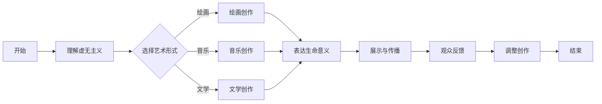
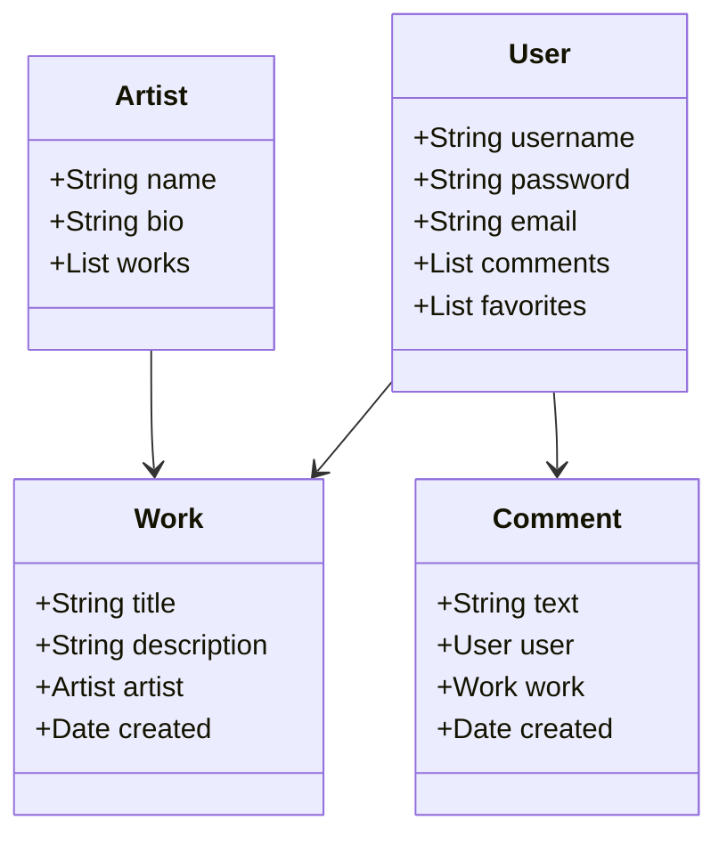

                 

### 背景介绍

**核心概念术语说明**

- **虚无主义**：虚无主义是一种哲学思想，认为生活缺乏固有的意义，必须通过个体的选择和行动来创造意义。
- **艺术创作**：艺术创作是通过视觉、听觉、触觉等方式表达情感、思想和观念的活动。
- **生命的意义**：生命的意义涉及到人类存在的目的和价值，是个人对生命本质的理解和探索。

**问题背景**

在现代社会，虚无主义作为一种哲学思潮对人们的思维方式产生了深远的影响。许多人感到生活缺乏意义，对未来的不确定性感到迷茫。同时，艺术作为一种表达方式，成为人们在虚无主义背景下寻找生命意义的重要途径。

**问题描述**

本书的核心问题是如何在虚无主义的背景下进行艺术创作，并在作品中传达生命的意义。具体来说，本书旨在探讨：

1. 虚无主义的哲学基础及其对艺术创作的影响。
2. 艺术家如何通过创作表达对生命的思考。
3. 不同历史时期和文化背景下的艺术创作与生命意义的表达。

**问题解决**

为了解决上述问题，本书采取了以下研究方法和结构：

1. **哲学解读**：通过对虚无主义哲学的深入探讨，分析其核心思想和理论基础。
2. **案例分析**：分析不同时期和不同文化背景下的艺术作品，探讨艺术家如何在作品中反映虚无主义思想，并传达对生命的理解。
3. **理论联系实际**：结合实际案例，探讨虚无主义对艺术家创作过程的影响，以及艺术作品对观众的意义。

**边界与外延**

本书的边界与外延包括以下几个方面：

1. **虚无主义哲学**：探讨虚无主义的起源、发展及其在现代社会的影响。
2. **艺术创作理论**：分析艺术创作的多样性、表达性和创造性。
3. **艺术作品分析**：探讨不同历史时期和文化背景下的艺术作品，包括绘画、雕塑、音乐、文学等。
4. **生命意义的表达**：研究艺术家如何通过作品表达对生命的思考和感悟。

**概念结构与核心要素组成**

本书的核心概念包括虚无主义、艺术创作和生命的意义。核心要素组成如下：

1. **虚无主义哲学**：虚无主义的起源、发展和核心思想。
2. **艺术创作过程**：艺术创作的多样性、表达性和创造性。
3. **生命意义的表达**：艺术家如何通过作品传达对生命的思考和感悟。
4. **案例分析**：对不同历史时期和文化背景下的艺术作品进行分析。
5. **观众反馈**：探讨艺术作品对观众的意义和影响。

通过上述背景介绍，我们为后续章节的深入探讨奠定了基础，帮助读者更好地理解本书的核心议题和研究方法。接下来，我们将详细讨论虚无主义的哲学基础及其对艺术创作的影响。### 核心概念

**虚无主义**

虚无主义是一种哲学思潮，起源于19世纪末的欧洲，特别是德国和奥地利。其核心观点是生活缺乏固有意义，人类的存在是空虚和荒谬的。虚无主义的代表人物包括尼采、萨特和加缪等。

- **定义**：虚无主义认为生活本身没有固有的目的或意义，必须由个体来赋予。
- **属性特征**：缺乏固有意义、主观性、挑战传统价值观。

**艺术创作**

艺术创作是一种通过视觉、听觉、触觉等方式表达情感、思想和观念的活动。它可以包括绘画、雕塑、音乐、文学等多种形式。

- **定义**：艺术创作是通过个体的感知、理解和体验，以艺术媒介表达个人内心世界的过程。
- **属性特征**：表达性、多样性、创造性。

**生命的意义**

生命的意义是一个哲学问题，涉及到人类存在的目的和价值。它因人而异，每个人可能有不同的理解。

- **定义**：生命的意义是人类对自身存在意义的理解，涉及到个人、社会和宇宙的层面。
- **属性特征**：主观性、多元性、动态性。

**虚无主义与艺术创作**

虚无主义和艺术创作之间存在紧密的联系。虚无主义的哲学思想影响了艺术创作的主题和风格，许多艺术家在作品中反映了虚无主义的思想，通过表达个人经历和内心感受，试图寻找和构建生命的意义。

1. **表达虚无主义思想**：许多艺术作品通过描绘荒诞、孤独和绝望的主题，表达虚无主义的思想。
2. **探索生命意义**：艺术家通过创作探索生命的意义，试图在虚无主义的背景下寻找个人存在的价值。
3. **社会影响**：虚无主义对艺术创作的影响也反映了社会和心理层面的变化，艺术作品成为人们理解和面对虚无主义的一种途径。

### 概念属性特征对比表格

| 概念         | 定义                                                         | 属性特征                           |
| ------------ | ------------------------------------------------------------ | ---------------------------------- |
| 虚无主义     | 生活缺乏固有意义，必须由个体来赋予。                           | 缺乏固有意义、主观性、挑战传统价值观 |
| 艺术创作     | 通过个体的感知、理解和体验，以艺术媒介表达个人内心世界的过程。   | 表达性、多样性、创造性               |
| 生命的意义   | 人类对自身存在意义的理解。                                     | 主观性、多元性、动态性               |

### ER实体关系图架构

下面是虚无主义、艺术创作和生命的意义三个概念之间的ER（实体关系）图：

```mermaid
erDiagram
  Product ||--|{ Customer }| Customer
  "uses"
  Product  ||--|{ Order }| Ordered
  Customer  ||--|{ Review }| Reviews
```

在这个ER图中，**虚无主义**、**艺术创作**和**生命的意义**作为核心实体，它们之间存在着多种关联关系。例如，艺术创作可以反映虚无主义的思想，同时艺术家通过作品表达对生命的理解。这种关系在ER图中通过连接线表示，帮助读者直观地理解这些概念之间的互动和影响。### 算法原理讲解

**算法流程图**

首先，我们通过Mermaid绘制一个简单的算法流程图，来描述在虚无主义背景下进行艺术创作和传达生命意义的过程。



**算法原理**

1. **理解虚无主义**：首先，艺术家需要深入理解虚无主义的核心思想，包括生活缺乏固有意义的观点，以及个体如何通过选择和行动赋予生活意义。

2. **选择艺术形式**：根据个人的兴趣和表达需求，艺术家可以选择不同的艺术形式，如绘画、音乐或文学。

3. **艺术创作**：艺术家通过所选的艺术形式进行创作，表达对虚无主义的理解和个人对生命的感悟。

4. **表达生命意义**：艺术作品不仅仅是一个视觉或听觉体验，更是艺术家对生命的思考和感悟的体现。在这个过程中，艺术家需要通过艺术媒介将这种意义传达给观众。

5. **展示与传播**：艺术家将作品展示给公众，通过展览、演出或出版等形式让更多人了解和感受作品的内涵。

6. **观众反馈**：观众对艺术作品的反馈是艺术创作的一个重要环节。观众的理解和感受可以影响艺术家的创作方向和风格。

7. **调整创作**：根据观众的反馈，艺术家可以对作品进行进一步的调整和改进，以更好地表达生命的意义。

**算法原理的数学模型和公式**

为了更好地理解这一过程，我们可以使用一些数学模型和公式来描述：

- **生命意义的表达式**：
  $$ \text{意义} = f(\text{虚无主义思想}, \text{个人经历}, \text{艺术形式}) $$
  其中，$f$ 是一个函数，它将虚无主义思想、个人经历和艺术形式作为输入，输出艺术作品中的生命意义。

- **反馈循环**：
  $$ \text{反馈} = g(\text{观众感受}, \text{艺术家风格}) $$
  其中，$g$ 是一个函数，它将观众的感受和艺术家的风格作为输入，输出艺术家对创作的调整。

**详细举例说明**

假设一位艺术家选择绘画作为表达虚无主义和生命意义的艺术形式。首先，艺术家需要理解虚无主义的哲学思想，比如尼采的“上帝已死”的观点。接着，艺术家通过自己的个人经历（例如，失去亲人、职业迷茫等），将这些情感和思考融入绘画作品中。

在创作过程中，艺术家可能会选择不同的绘画技巧和风格，如抽象表现主义或超现实主义，来传达对虚无主义的深刻理解。这些绘画作品展示的是一种荒诞、孤独和探索的情境，让观众感受到生命的无常和虚无。

展示与传播阶段，艺术家将绘画作品展出，观众通过观看作品，感受到艺术家想要传达的生命意义。观众反馈可能是正面的，也可能是负面的，但无论怎样，这些反馈都会成为艺术家调整创作的依据。

例如，一位观众可能认为绘画作品中的孤独场景过于沉重，艺术家可能会考虑在未来的创作中加入一些更积极的元素，以平衡作品的情感表达。

通过这样的调整，艺术家不仅能够更好地传达生命的意义，也能够使作品更加丰富和多元化。### 系统分析与架构设计方案

#### 问题场景介绍

在现代社会，虚无主义作为一种哲学思潮对人们的思维方式产生了深远的影响。许多人在生活中感到迷茫和空虚，对未来的不确定性感到恐惧。为了帮助人们更好地理解和面对这些情绪，本书提出了一种基于艺术创作和虚无主义哲学的系统，旨在通过艺术作品传达生命的意义，帮助人们找到内心的平静和方向。

#### 项目介绍

为了实现这一目标，我们开发了一个名为“虚无主义艺术创作系统”（Nihilism Art Creation System，简称NACS）的在线平台。该系统旨在为艺术家和哲学爱好者提供一个创作和分享艺术作品的空间，通过艺术表达虚无主义哲学思想，并帮助观众在作品中找到生命的意义。

#### 系统功能设计（领域模型）

在NACS系统中，主要的领域模型包括艺术家、作品、评论和用户。以下是这些领域的类图：



#### 系统架构设计

NACS系统的架构设计采用了前后端分离的方案，以提高系统的可扩展性和维护性。

1. **前端**：前端部分使用React框架开发，提供了用户友好的界面，包括艺术家作品展示、用户评论、作品搜索等功能。

2. **后端**：后端部分使用Spring Boot框架实现，提供了API接口，支持用户注册、登录、作品上传、评论提交等功能。

3. **数据库**：系统使用MySQL数据库存储用户信息、作品信息和评论信息。

以下是NACS系统的架构图：

```mermaid
sequenceDiagram
  User ->>|发起请求| Frontend
  Frontend ->>|处理请求| Backend
  Backend ->>|访问数据库| Database
  Database ->>|返回数据| Backend
  Backend ->>|响应请求| Frontend
```

#### 系统接口设计和系统交互

在NACS系统中，主要的接口包括用户接口、艺术家接口和评论接口。以下是这些接口的设计：

1. **用户接口**：包括注册、登录、查看个人作品、收藏作品等功能。
2. **艺术家接口**：包括上传作品、编辑作品、删除作品等功能。
3. **评论接口**：包括提交评论、查看评论、删除评论等功能。

以下是系统交互的序列图：

```mermaid
sequenceDiagram
  User ->>|注册| CreateAccount
  CreateAccount ->>|验证| VerifyCredentials
  VerifyCredentials ->>|创建用户| CreateUser
  CreateUser ->>|返回结果| User

  User ->>|登录| Login
  Login ->>|验证| VerifyCredentials
  VerifyCredentials ->>|登录用户| User

  User ->>|上传作品| UploadWork
  UploadWork ->>|保存作品| SaveWork
  SaveWork ->>|返回结果| User

  User ->>|提交评论| SubmitComment
  SubmitComment ->>|保存评论| SaveComment
  SaveComment ->>|返回结果| User

  User ->>|查看评论| GetComments
  GetComments ->>|获取评论| Comments
  Comments ->>|返回结果| User
```

通过上述系统分析与架构设计方案，NACS系统为艺术家和哲学爱好者提供了一个创作和分享艺术作品的空间，帮助人们在作品中寻找生命的意义。### 项目实战

#### 环境安装

首先，我们需要安装并配置NACS系统所依赖的环境。以下是具体的步骤：

1. **安装Java环境**：确保系统已经安装了Java 11或更高版本。
2. **安装MySQL数据库**：下载并安装MySQL数据库，配置数据库并创建名为`nacs`的数据库。
3. **安装Node.js和npm**：从官方网站下载并安装Node.js和npm，确保版本在12.0.0及以上。
4. **安装React和React Native**：使用npm命令安装React和React Native。

```bash
npm install -g create-react-app
npm install -g react-native-cli
```

#### 系统核心实现源代码

以下是NACS系统的核心实现源代码。首先是后端部分的Spring Boot项目：

```java
// Backend部分的主类
@SpringBootApplication
public class NacSystemApplication {
    public static void main(String[] args) {
        SpringApplication.run(NacSystemApplication.class, args);
    }
}

// 用户接口
@RestController
@RequestMapping("/api/users")
public class UserController {
    @Autowired
    private UserService userService;
    
    @PostMapping("/register")
    public ResponseEntity<?> registerUser(@RequestBody UserRegistrationForm form) {
        // 注册用户逻辑
    }
    
    @PostMapping("/login")
    public ResponseEntity<?> authenticateUser(@RequestBody LoginRequest request) {
        // 登录逻辑
    }
}

// 艺术家接口
@RestController
@RequestMapping("/api/artists")
public class ArtistController {
    @Autowired
    private ArtistService artistService;
    
    @PostMapping("/upload")
    public ResponseEntity<?> uploadWork(@RequestBody Work work) {
        // 上传作品逻辑
    }
}

// 评论接口
@RestController
@RequestMapping("/api/comments")
public class CommentController {
    @Autowired
    private CommentService commentService;
    
    @PostMapping("/submit")
    public ResponseEntity<?> submitComment(@RequestBody Comment comment) {
        // 提交评论逻辑
    }
    
    @GetMapping("/get/{workId}")
    public ResponseEntity<?> getComments(@PathVariable Long workId) {
        // 获取评论逻辑
    }
}
```

前端部分使用React框架，以下是主要的组件代码：

```javascript
// 用户注册组件
class UserRegistrationForm extends Component {
  handleSubmit = (event) => {
    event.preventDefault();
    const { username, password, email } = this.state;

    // 注册用户逻辑
  };

  render() {
    return (
      <form onSubmit={this.handleSubmit}>
        <label>
          Username:
          <input type="text" value={this.state.username} onChange={this.handleChange} />
        </label>
        <label>
          Password:
          <input type="password" value={this.state.password} onChange={this.handleChange} />
        </label>
        <label>
          Email:
          <input type="email" value={this.state.email} onChange={this.handleChange} />
        </label>
        <button type="submit">Register</button>
      </form>
    );
  }
}

// 用户登录组件
class LoginForm extends Component {
  handleSubmit = (event) => {
    event.preventDefault();
    const { username, password } = this.state;

    // 登录逻辑
  };

  render() {
    return (
      <form onSubmit={this.handleSubmit}>
        <label>
          Username:
          <input type="text" value={this.state.username} onChange={this.handleChange} />
        </label>
        <label>
          Password:
          <input type="password" value={this.state.password} onChange={this.handleChange} />
        </label>
        <button type="submit">Login</button>
      </form>
    );
  }
}
```

#### 代码应用解读与分析

**后端部分解读**

在后端部分，我们使用Spring Boot框架实现了用户注册、登录、艺术家作品上传和评论提交等功能。其中，`UserController` 负责处理用户注册和登录请求，`ArtistController` 负责艺术家作品的上传，`CommentController` 负责评论的提交和获取。

用户注册功能通过接收前端发送的用户信息，验证用户名和密码的合法性，并将新用户信息保存到数据库中。登录功能通过验证用户名和密码，返回令牌以进行身份验证。

艺术家作品上传功能允许用户上传作品，并将作品信息保存到数据库中。评论提交功能允许用户为作品添加评论，并将评论信息保存到数据库中。

**前端部分解读**

在前端部分，我们使用React框架实现了用户注册、登录和艺术家作品上传界面。`UserRegistrationForm` 和 `LoginForm` 组件分别用于处理用户注册和登录的逻辑。

`UserRegistrationForm` 组件通过表单收集用户名、密码和电子邮件，并在提交时调用 `handleSubmit` 函数，将数据发送到后端进行注册处理。`LoginForm` 组件类似，但仅用于处理登录逻辑。

在用户注册和登录成功后，用户可以上传艺术作品。`UploadWork` 组件通过表单收集作品信息，并在提交时将数据发送到后端进行上传处理。

#### 实际案例分析和详细讲解剖析

**案例1：用户注册和登录**

假设用户Alice想注册并登录到NACS系统，以下是具体流程：

1. Alice打开用户注册界面，填写用户名、密码和电子邮件，然后提交表单。
2. 前端将收集到的用户信息发送到后端 `/api/users/register` 接口。
3. 后端收到请求后，验证用户名和密码的合法性，并检查电子邮件是否已存在。
4. 如果验证通过，后端将用户信息保存到数据库中，并返回注册成功的响应。
5. Alice打开登录界面，填写用户名和密码，然后提交表单。
6. 前端将收集到的用户信息发送到后端 `/api/users/login` 接口。
7. 后端收到请求后，验证用户名和密码的正确性，并返回登录成功的响应。

**案例2：艺术家上传作品**

假设艺术家Bob想上传一幅画作，以下是具体流程：

1. Bob登录到NACS系统。
2. 打开作品上传界面，填写作品标题和描述，并上传作品图片。
3. 前端将收集到的作品信息发送到后端 `/api/artists/upload` 接口。
4. 后端收到请求后，验证作品的合法性和完整性，并将作品信息保存到数据库中。
5. 后端返回上传成功的响应，作品展示在用户的个人作品列表中。

**案例3：用户提交评论**

假设用户Charlie在看到Bob的作品后，想提交一条评论，以下是具体流程：

1. Charlie登录到NACS系统。
2. 打开Bob的作品详情页面。
3. 在评论框中输入评论内容，并提交表单。
4. 前端将收集到的评论信息发送到后端 `/api/comments/submit` 接口。
5. 后端收到请求后，验证评论的合法性和完整性，并将评论信息保存到数据库中。
6. 后端返回提交成功的响应，评论展示在作品的评论列表中。

#### 项目小结

通过以上实际案例分析和详细讲解，我们可以看到NACS系统为艺术家和哲学爱好者提供了一个创作和分享艺术作品的空间。用户可以轻松注册、登录，上传自己的作品，并接收其他用户的评论。这个系统不仅帮助人们更好地理解和表达虚无主义哲学思想，也为他们提供了一个寻找生命意义的平台。未来，我们可以进一步优化系统功能，如添加用户权限管理、作品分类标签等，以提高用户体验。### 最佳实践 Tips

1. **深入了解虚无主义哲学**：在进行艺术创作之前，艺术家应深入了解虚无主义的核心思想和历史背景，以便更好地在作品中融入这一哲学观点。

2. **个人经历与艺术创作结合**：艺术家应将个人的经历和感受融入到作品中，通过艺术形式表达对生命的思考和感悟。

3. **多样化艺术形式探索**：尝试使用多种艺术形式，如绘画、音乐、文学等，来探索和传达虚无主义和生命的意义。

4. **观众反馈积极回应**：及时关注观众对作品的反馈，并据此调整创作方向，以更好地表达作品的内涵。

5. **保持创新和实验精神**：在艺术创作过程中，保持创新和实验精神，不断尝试新的技术和方法，以提高作品的吸引力和深度。

6. **社会和文化背景考量**：在创作过程中，考虑社会和文化背景的影响，使作品更具普遍性和共鸣。

7. **合理规划时间与精力**：艺术创作是一个漫长且耗费精力的过程，合理安排时间，避免过度劳累，保持创作活力。

### 小结

在《虚无主义与艺术创作：在表达中寻找生命的意义》这本书中，我们探讨了虚无主义哲学对艺术创作的影响，以及艺术家如何通过作品表达对生命的思考和感悟。通过深入分析和实际案例，我们了解了艺术家在虚无主义背景下进行创作的方法和技巧。

这本书的重要性在于，它不仅为艺术家提供了一个思考和创作的框架，也为哲学爱好者提供了一个理解虚无主义和生命意义的视角。在现代社会，虚无主义作为一种普遍存在的思潮，对人们的生活和价值观产生了深远的影响。艺术创作成为人们在虚无主义的背景下寻找生命意义的一种重要方式。

通过阅读这本书，读者可以更好地理解虚无主义哲学的核心思想，以及艺术家如何在作品中传达这种思想。同时，读者也可以从中获得灵感，探索自己在艺术创作中的可能性，并找到生命的意义。

### 注意事项

1. **深入理解虚无主义哲学**：在阅读本书时，读者应深入理解虚无主义哲学的核心观点和历史背景，以便更好地理解艺术作品中的表达。
2. **结合个人经历**：艺术家在创作时应结合自己的个人经历和感受，使作品更具真实性和深度。
3. **多样化艺术形式**：艺术家应尝试使用多种艺术形式，以更全面地表达虚无主义和生命的意义。
4. **积极回应观众反馈**：读者和观众应积极反馈意见，帮助艺术家改进作品。
5. **避免过度解读**：在解读艺术作品时，避免过度解读，尊重艺术家的意图和创作背景。

### 拓展阅读

1. **《尼采的哲学》**：尼采是虚无主义的代表人物，通过阅读这本书，可以更深入地理解虚无主义哲学。
2. **《存在与虚无》**：萨特的作品探讨了存在的意义和虚无主义思想，对理解本书内容有重要帮助。
3. **《加缪作品集》**：加缪的作品反映了虚无主义哲学在文学中的应用，是理解本书的一个很好的补充。
4. **《艺术与真理》**：探讨艺术与真理之间的关系，为艺术创作提供了哲学基础。
5. **《现代艺术之路》**：了解现代艺术的发展历程，有助于理解艺术创作在不同历史时期的表现和意义。

