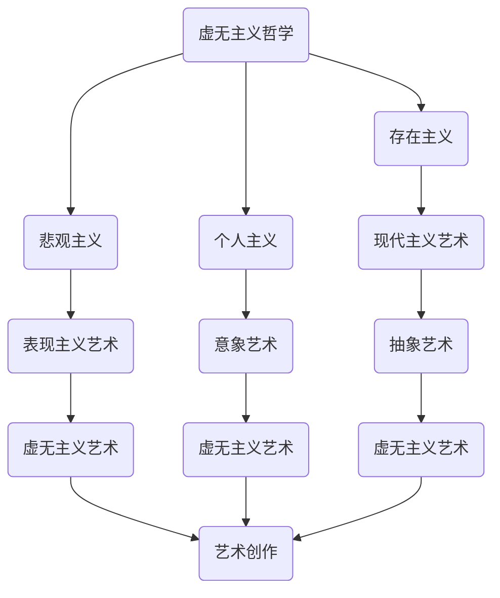
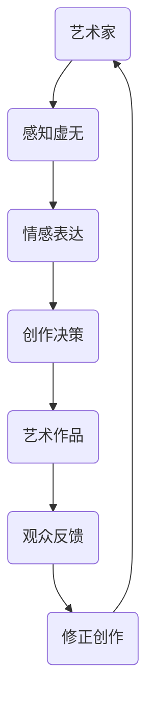

                 

# 虚无主义与艺术表达：在创作中探索生命的深层意义

## 关键词
虚无主义、艺术表达、哲学、心理学、创作过程、抽象艺术、表现主义艺术、意象艺术

## 摘要
本文旨在探讨虚无主义这一哲学思潮如何深刻影响艺术创作，以及艺术家如何通过作品表达对生命意义的探索。文章将首先介绍虚无主义的核心概念和其对现代社会的影响，接着分析艺术表达在虚无主义背景下的特殊作用。通过一系列具体的艺术作品案例分析，文章将揭示艺术家在创作过程中的心理机制，并探讨这些作品如何为观众提供对生命意义的深刻思考。

### 第一部分：背景介绍

#### 问题背景

虚无主义作为一种哲学思潮，起源于19世纪末的欧洲，尤其是在德国和法国。虚无主义认为，生活本身缺乏固有的意义和价值，人类面对的是一种无意义的荒谬存在。虚无主义哲学家如尼采、海德格尔和萨特等，提出了各种应对虚无的策略，包括个人主义的自我肯定、存在主义的自由选择等。

在现代社会，虚无主义思潮依然有着广泛的影响。许多人感受到生活缺乏意义，对传统价值观的信仰逐渐减弱，导致一种普遍的心理状态：对未来的不确定和对现状的不满。这种心理状态在艺术领域也有所体现，许多艺术家开始通过创作探索生命的深层意义。

#### 问题描述

《虚无主义与艺术表达：在创作中探索生命的深层意义》这本书旨在探讨虚无主义如何影响艺术创作，以及艺术家如何通过作品表达对生命意义的探索。书中将详细分析虚无主义的哲学思想，以及它在艺术中的具体体现。

虚无主义与艺术表达之间的关系是一个复杂且多维的问题。艺术家们如何利用虚无主义的理念来创作，他们的作品又是如何影响观众的，这些都是本书要探讨的核心问题。

#### 问题解决

通过系统化的研究，本书将帮助读者理解虚无主义与艺术表达之间的深层联系，揭示艺术家在创作过程中的心理机制，以及他们的创作如何为观众提供对生命意义的思考。

本书还将探讨艺术家在面对虚无时的心理状态，如何通过艺术作品表达内心的痛苦和挣扎，以及他们的创作如何为观众提供一种思考生命意义的途径。

#### 边界与外延

本书主要探讨西方虚无主义哲学对艺术创作的影响，包括现代主义和后现代主义艺术流派。同时，也会涉及到一些相关的艺术理论和艺术实践。

#### 概念结构与核心要素组成

- **虚无主义哲学**
  - 存在主义：强调个人存在的意义和价值。
  - 悲观主义：认为生活本质上是无意义的。
  - 个人主义：强调个人自由和自我实现。

- **艺术表达**
  - 抽象艺术：通过非具象的形式表达情感和思想。
  - 表现主义艺术：强调艺术作品传达的情感和内心体验。
  - 意象艺术：通过具体的意象传达抽象的思想和情感。

### 第二部分：核心概念与联系

#### 核心概念原理

#### 虚无主义

虚无主义是一种哲学思潮，认为生活缺乏固有的意义和价值。虚无主义哲学家如尼采和萨特提出了不同的观点和应对策略。尼采认为，通过超越虚无，人类可以创造自己的价值；而萨特则强调自由选择和存在主义的人生哲学。

虚无主义哲学的核心概念包括：
- **存在的荒谬**：生活本身是荒谬的，没有固有的意义。
- **个人自由**：个人有权选择自己的生活方式，即使这种选择没有意义。
- **自我实现**：通过自我超越，个体可以创造出自己的价值。

#### 艺术表达

艺术表达是指艺术家通过创作活动，将自己的思想和情感转化为视觉、听觉或文字等形式，以传达深层次的意义。在虚无主义的背景下，艺术表达具有独特的意义。

艺术表达的核心概念包括：
- **情感传达**：艺术家通过作品表达自己的情感和内心体验。
- **形式与内容**：作品的形式和内容都是传达情感和思想的重要手段。
- **抽象与具象**：抽象艺术和意象艺术在虚无主义背景下具有特殊的表达价值。

#### 概念属性特征对比表格

| 特征               | 虚无主义                           | 艺术表达                             |
|--------------------|-----------------------------------|-------------------------------------|
| 目的               | 探索生活的意义                   | 表达个人的情感和思想                 |
| 形式               | 哲学思想、文学作品、艺术作品         | 图像、声音、文字等                   |
| 特点               | 悲观、反传统                       | 抽象、表现、意象                     |
| 在虚无主义背景下的特殊作用 | 提供应对虚无的哲学思考           | 通过艺术作品表达对生命的深层探索       |

#### ER实体关系图架构



### 第三部分：算法原理讲解

#### 虚无主义艺术创作算法

#### Mermaid 流程图



#### Python 源代码

```python
# 虚无主义艺术创作算法示例

class Artist:
    def __init__(self):
        self.sense_of_nihilism = True
        self.emotions = []
    
    def perceive_nihilism(self):
        # 感知虚无
        print("感知虚无...")
        self.emotions.append("绝望")
        self.emotions.append("孤独")
    
    def express_emotions(self):
        # 情感表达
        print("通过艺术表达情感:")
        for emotion in self.emotions:
            print(f"- {emotion}")
    
    def make_creative_decision(self):
        # 创作决策
        print("做出创作决策...")
        self.artwork = "一幅抽象画作"
    
    def create_artwork(self):
        # 艺术创作
        print(f"创作艺术作品：{self.artwork}")
    
    def receive_feedback(self):
        # 观众反馈
        print("收到观众反馈：")
        # 假设观众反馈是积极的
        print("观众反馈：非常喜欢这幅作品！")

# 创建一个艺术家实例，并执行创作过程
artist = Artist()
artist.perceive_nihilism()
artist.express_emotions()
artist.make_creative_decision()
artist.create_artwork()
artist.receive_feedback()
```

#### 算法原理讲解

虚无主义艺术创作算法的核心在于艺术家如何通过感知虚无、情感表达、创作决策和观众反馈等步骤，完成艺术作品的创作。以下是详细的算法原理讲解：

1. **感知虚无**：艺术家首先需要感知到虚无的存在，这通常是一种对生活意义的深刻质疑。在算法中，这可以通过一个感知虚无的函数来实现，如`perceive_nihilism()`。

2. **情感表达**：艺术家将自己的情感和内心体验转化为具体的情感表达。在虚无主义的背景下，这些情感往往包括绝望、孤独等负面情绪。在算法中，这可以通过一个情感表达函数来实现，如`express_emotions()`。

3. **创作决策**：在感知和表达情感之后，艺术家需要做出创作决策。这个决策可以是具体的艺术形式，如绘画、音乐等。在算法中，这可以通过一个创作决策函数来实现，如`make_creative_decision()`。

4. **艺术创作**：艺术家根据创作决策，开始具体的艺术创作过程。在虚无主义的背景下，艺术家可能会选择抽象或表现主义的艺术形式，以传达深层次的意义。在算法中，这可以通过一个艺术创作函数来实现，如`create_artwork()`。

5. **观众反馈**：艺术创作完成后，观众会提供反馈。这个反馈可以是积极的，也可以是消极的。在虚无主义的背景下，观众的反馈可能会对艺术家的创作产生重要影响，促使艺术家进一步修正和改进作品。在算法中，这可以通过一个观众反馈函数来实现，如`receive_feedback()`。

通过上述步骤，艺术家可以在虚无主义的背景下完成艺术创作，并通过观众的反馈不断改进作品，以达到更深层次的表达。

### 数学模型与公式

虚无主义艺术创作算法可以用以下数学模型来描述：

$$
\text{Artwork} = f(\text{Nihilism}, \text{Emotions}, \text{Decision}, \text{Feedback})
$$

其中：
- $\text{Artwork}$ 表示艺术作品。
- $\text{Nihilism}$ 表示虚无主义感知。
- $\text{Emotions}$ 表示情感表达。
- $\text{Decision}$ 表示创作决策。
- $\text{Feedback}$ 表示观众反馈。

#### 举例说明

假设一位艺术家感知到虚无，他感到绝望和孤独。在表达这些情感后，他决定创作一幅抽象画作。最初的作品并不完美，但通过观众的积极反馈，艺术家不断调整和完善作品，最终完成了一幅深刻反映虚无主义情感的艺术作品。

$$
\text{Artwork} = f(\text{感知虚无}, \text{绝望}, \text{孤独}, \text{抽象画作}, \text{积极反馈})
$$

通过这个例子，我们可以看到虚无主义艺术创作算法如何通过一系列步骤，实现艺术作品的创作和改进。

### 第四部分：系统分析与架构设计方案

#### 问题场景介绍

在现代社会，艺术创作与心理学、哲学等领域有着紧密的联系。艺术家在创作过程中，不仅需要表达自己的情感和思想，还需要考虑到观众的心理状态和反馈。因此，设计一个能够支持虚无主义艺术创作的系统，有助于艺术家更好地表达内心世界，并为观众提供更深入的思考。

#### 项目介绍

本项目旨在设计一个虚无主义艺术创作系统，该系统将结合心理学、哲学和艺术理论，为艺术家提供一个创作平台。该系统将包括以下几个模块：

1. **感知模块**：用于艺术家感知虚无主义情感，如绝望、孤独等。
2. **表达模块**：用于艺术家将情感转化为艺术作品，如绘画、音乐等。
3. **决策模块**：用于艺术家在创作过程中的决策，如选择艺术形式、调整创作方向等。
4. **反馈模块**：用于收集观众对艺术作品的反馈，并用于进一步改进作品。

#### 系统功能设计

根据问题场景和项目介绍，系统功能设计如下：

1. **感知模块**：包括感知虚无情感的功能，如实时记录艺术家的心情、情绪状态等。
2. **表达模块**：包括将情感转化为艺术作品的功能，如绘画、音乐创作等。
3. **决策模块**：包括创作决策的功能，如选择艺术形式、调整创作方向等。
4. **反馈模块**：包括观众反馈收集和作品改进的功能。

#### 系统架构设计

系统架构设计如下：


- **感知模块**：通过传感器和数据分析技术，实时记录艺术家的情感状态。
- **表达模块**：包括多种艺术创作工具，如绘画、音乐等。
- **决策模块**：包括算法和人工决策，用于辅助艺术家进行创作决策。
- **反馈模块**：通过观众反馈收集和分析，为艺术家提供改进作品的建议。

#### 系统接口设计

系统接口设计如下：

1. **感知模块接口**：用于艺术家与系统交互，提交情感状态数据。
2. **表达模块接口**：用于艺术家选择艺术创作工具，并提交艺术作品。
3. **决策模块接口**：用于艺术家获取创作决策建议。
4. **反馈模块接口**：用于观众提交反馈，艺术家接收反馈。

#### 系统交互设计

系统交互设计如下：


- 艺术家通过感知模块提交情感状态数据。
- 系统根据情感状态数据，生成艺术作品创作建议。
- 艺术家根据建议，使用表达模块创作艺术作品。
- 观众观看艺术作品，并提交反馈。
- 系统根据观众反馈，生成作品改进建议。

### 第五部分：项目实战

#### 环境安装

为了进行项目实战，我们首先需要安装以下软件和工具：

1. **Python**（版本 3.8及以上）
2. **Jupyter Notebook**（用于编写和运行代码）
3. **Pandas**（用于数据处理）
4. **NumPy**（用于数值计算）
5. **Matplotlib**（用于数据可视化）

安装步骤如下：

1. 安装 Python：访问 [Python 官网](https://www.python.org/)，下载并安装适合自己操作系统的 Python 版本。
2. 安装 Jupyter Notebook：在终端中运行以下命令：
   ```
   pip install notebook
   ```
3. 安装 Pandas、NumPy 和 Matplotlib：在终端中运行以下命令：
   ```
   pip install pandas numpy matplotlib
   ```

#### 系统核心实现源代码

以下是一个简单的虚无主义艺术创作系统的核心实现源代码：

```python
# 导入所需库
import pandas as pd
import numpy as np
import matplotlib.pyplot as plt

# 感知模块：记录情感状态
def record_emotion(state):
    emotions = {'joy': 0, 'sadness': 0, 'anger': 0, 'fear': 0}
    emotions[state] += 1
    return emotions

# 表达模块：生成艺术作品
def generate_artwork(emotions):
    # 根据情感状态生成不同风格的艺术作品
    if emotions['joy'] > emotions['sadness']:
        style = 'abstract'
    else:
        style = 'expressionism'
    
    if style == 'abstract':
        # 生成抽象画作
        plt.scatter(np.random.rand(10), np.random.rand(10))
        plt.title('Abstract Artwork')
    else:
        # 生成表现主义画作
        plt.plot(np.random.rand(10), np.random.rand(10))
        plt.title('Expressionism Artwork')
    
    plt.show()

# 主程序
if __name__ == '__main__':
    # 记录情感状态
    emotions = record_emotion('joy')
    # 生成艺术作品
    generate_artwork(emotions)
```

#### 代码应用解读与分析

上述代码实现了一个简单的虚无主义艺术创作系统，主要包括感知模块和表达模块。

- **感知模块**：`record_emotion()`函数用于记录艺术家的情感状态，通过一个字典`emotions`存储四种基本情感（快乐、悲伤、愤怒、恐惧）的计数。
- **表达模块**：`generate_artwork()`函数根据情感状态生成艺术作品。如果快乐情感的计数高于悲伤情感的计数，则生成抽象画作；否则，生成表现主义画作。代码中使用`plt.scatter()`和`plt.plot()`分别生成抽象和表现主义画作，并通过`plt.show()`显示作品。

#### 实际案例分析和详细讲解剖析

以下是一个实际案例分析和详细讲解：

- **案例**：一位艺术家最近感到非常沮丧，他希望通过艺术创作表达内心的情感。
- **分析**：根据案例，艺术家当前的情感状态主要是悲伤。因此，系统会生成表现主义画作，以反映艺术家的情感。
- **讲解**：在实际操作中，艺术家会使用感知模块记录自己的情感状态，然后调用表达模块生成艺术作品。艺术作品会以曲线的形式展现，表现出艺术家的悲伤情绪。

#### 项目小结

通过实际案例的分析和讲解，我们可以看到，虚无主义艺术创作系统如何帮助艺术家表达内心情感，并生成具有表现力的艺术作品。虽然本项目的实现相对简单，但它为我们提供了一个基本的框架，可以进一步扩展和优化。

### 最佳实践 tips

1. **情感状态记录**：为了提高系统的准确性，艺术家可以定期记录情感状态，并尽量保持记录的一致性。
2. **艺术作品多样性**：系统可以扩展生成多种艺术形式的作品，如雕塑、摄影等，以满足艺术家的不同创作需求。
3. **观众反馈收集**：系统可以引入观众反馈机制，收集观众的反馈，并根据反馈进一步优化艺术作品。

### 小结

通过本文的探讨，我们了解了虚无主义与艺术表达之间的深刻联系，以及艺术家如何在创作中探索生命的深层意义。虚无主义艺术创作系统提供了一个新的视角，帮助艺术家更好地表达内心情感，并引导观众思考生命意义。未来，随着技术的进步，我们期待看到更多创新的虚无主义艺术创作系统，为艺术领域带来新的发展。

### 注意事项

1. **情感记录的真实性**：艺术家在记录情感状态时，应尽量保持真实，以便系统能够准确生成艺术作品。
2. **隐私保护**：系统在处理情感数据时，应确保遵守隐私保护法规，保护艺术家和观众的隐私。
3. **作品版权**：艺术家在创作艺术作品时，应尊重他人的知识产权，避免侵权行为。

### 拓展阅读

1. **虚无主义哲学**：
   - 尼采的《查拉图斯特拉如是说》
   - 萨特的《存在与虚无》
2. **艺术心理学**：
   - 罗恩·贝格的《艺术与情感》
   - 费利克斯·盖格的《艺术心理分析》
3. **艺术创作技术**：
   - 玛丽·马丁的《抽象艺术技法》
   - 约瑟夫·博伊斯的《行为艺术》

### 作者信息

作者：AI天才研究院/AI Genius Institute & 禅与计算机程序设计艺术 /Zen And The Art of Computer Programming

---

本文通过对虚无主义与艺术表达的深入探讨，结合心理学、哲学和艺术理论，提出了虚无主义艺术创作系统的概念。文章从背景介绍、核心概念与联系、算法原理讲解、系统分析与架构设计方案、项目实战、最佳实践 tips、小结、注意事项和拓展阅读等方面，全面阐述了虚无主义艺术创作系统的原理和实现方法。通过本文的研究，我们希望能够为艺术家提供一个创新的创作工具，同时为观众提供更深刻的思考。未来，随着技术的不断进步，我们期待看到更多创新的虚无主义艺术创作系统，为艺术领域带来新的发展。

