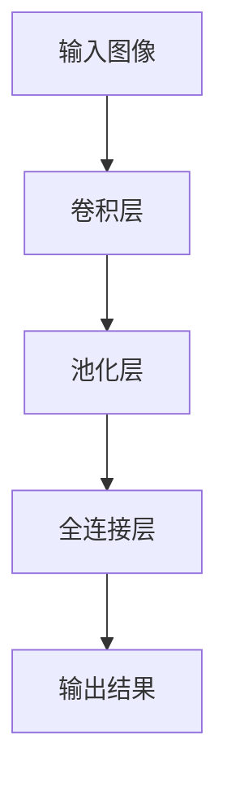
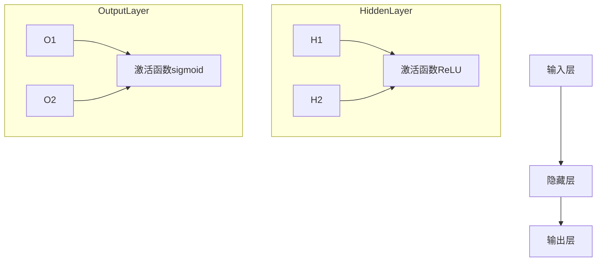

                 

### 引言：设计一门专门用于AI大模型软件2.0时代的编程语言

在当今科技飞速发展的时代，人工智能（AI）已经成为推动社会进步的重要力量。随着深度学习和神经网络技术的不断成熟，AI大模型——一种具有极高计算能力和复杂度的智能系统——逐渐成为各行各业的核心技术。这些大模型在自然语言处理、图像识别、医疗诊断等多个领域展现出了惊人的性能，极大地改变了我们的生活方式和商业模式。

然而，随着AI大模型的应用日益广泛，现有的编程语言和技术栈开始暴露出一些局限性。传统的编程语言设计初衷是为了简化复杂计算任务，但在处理大规模、高复杂度的AI模型时，它们显得力不从心。因此，有必要设计一门专门用于AI大模型软件2.0时代的编程语言，以应对这一挑战。

**关键词**：AI大模型、编程语言、软件2.0、性能优化、复杂性管理。

**摘要**：
本文将探讨设计一门专门用于AI大模型软件2.0时代的编程语言的必要性。首先，我们将介绍软件2.0时代的背景，以及AI大模型在这一时代的重要作用。接着，我们将深入分析现有编程语言的局限性，并阐述设计一门新编程语言的动机。随后，本文将详细讨论新编程语言的核心概念、算法原理、数学模型、系统分析与架构设计，以及实际应用中的最佳实践。通过这一系列深入分析，我们希望能够为AI大模型时代的编程语言设计提供一些有价值的思考和方向。

### 背景：软件2.0时代的AI大模型

**1.1 软件2.0时代的背景与展望**

软件2.0时代是一个以用户为中心、以数据为驱动的全新软件发展模式。与传统的软件1.0时代（以程序为中心，注重代码效率和执行速度）相比，软件2.0更强调用户体验、敏捷开发、持续集成和智能化。在这个时代，软件不仅是执行特定任务的工具，更是一种动态、智能的服务，能够根据用户需求和环境变化进行自适应调整。

软件2.0时代的背景可以追溯到互联网和云计算技术的迅猛发展。随着大数据、物联网、5G等新兴技术的普及，数据量呈爆炸式增长，传统软件的架构和设计理念开始无法满足现代应用的需求。软件2.0时代应运而生，旨在通过数据驱动的智能化手段，提供更加个性化和高效的软件解决方案。

展望未来，软件2.0时代将呈现出以下几个重要趋势：

1. **数据成为核心资产**：随着数据量的不断增长，数据将成为企业和组织最重要的资产。如何高效地收集、存储、分析和利用数据，将成为软件开发的重点。

2. **智能化与自动化**：软件2.0将更加注重智能化和自动化，通过人工智能和机器学习技术，实现软件的自主学习和优化，提高系统的运行效率和用户体验。

3. **微服务和容器化**：微服务和容器化技术将成为软件开发的主流架构，使得软件系统能够更加灵活、模块化地扩展和维护。

4. **云原生应用**：随着云计算的普及，云原生应用将更加流行，软件将更加依赖于云服务和分布式计算，实现弹性伸缩和高效资源利用。

**1.2 AI大模型在软件2.0中的核心作用**

在软件2.0时代，AI大模型发挥着至关重要的作用。AI大模型具有处理大规模、高复杂度数据的能力，能够从海量数据中提取有价值的信息和知识，为软件开发提供强有力的支持。

以下是AI大模型在软件2.0中的核心作用：

1. **数据分析与挖掘**：AI大模型可以高效地处理和分析大规模数据，发现数据中的规律和趋势，为业务决策提供科学依据。

2. **智能推荐与个性化服务**：AI大模型可以根据用户行为和偏好，提供个性化的推荐和服务，提升用户体验和满意度。

3. **自然语言处理**：AI大模型在自然语言处理方面具有强大的能力，可以实现智能问答、语言翻译、情感分析等功能，为软件系统提供智能化的交互界面。

4. **图像和视频处理**：AI大模型在图像和视频处理方面表现出色，可以实现图像识别、目标检测、视频分类等任务，为视觉应用提供支持。

5. **自动化与智能化**：AI大模型可以辅助软件系统的自动化和智能化，实现自适应调整和优化，提高系统的运行效率和稳定性。

**1.3 软件2.0时代的开发新范式**

软件2.0时代的开发范式与软件1.0时代有显著不同，更加注重敏捷性、协作性和智能化。以下是软件2.0时代的几种重要开发范式：

1. **敏捷开发**：敏捷开发强调快速迭代和用户反馈，通过持续交付有价值的软件版本，满足用户需求。在AI大模型的支持下，敏捷开发可以更加精准地捕捉用户需求，实现高效的软件交付。

2. **DevOps**：DevOps是一种将软件开发（Dev）和运维（Ops）相结合的新兴实践，通过自动化和持续集成/持续部署（CI/CD），实现快速、可靠地交付软件。在AI大模型的帮助下，DevOps可以实现更加智能化的部署和管理。

3. **数据驱动开发**：数据驱动开发将数据作为软件开发的核心驱动力，通过数据分析、反馈和优化，实现软件的持续改进和优化。

4. **智能化开发**：智能化开发利用AI大模型和机器学习技术，实现软件开发的自动化和智能化，提高开发效率和软件质量。

通过以上分析，我们可以看到，软件2.0时代为AI大模型的应用提供了广阔的舞台，而AI大模型也为软件2.0时代的开发带来了新的机遇和挑战。设计一门专门用于AI大模型软件2.0时代的编程语言，将有助于更好地发挥AI大模型的优势，推动软件技术的进一步发展。

### AI大模型的概念与特点

**2.1 AI大模型的定义**

AI大模型，又称大型深度学习模型，是指那些拥有数百万至上亿参数的复杂神经网络。这些模型通常采用深度学习技术，通过大量数据训练，能够完成诸如图像识别、自然语言处理、语音识别等多种复杂任务。AI大模型的核心在于其能够通过自我学习和调整参数，不断优化性能，从而在实际应用中表现出惊人的准确性和效率。

**2.2 AI大模型的主要特点**

1. **参数规模庞大**：AI大模型通常包含数百万至数十亿个参数，这使得它们能够处理大量复杂的信息。

2. **深度结构复杂**：AI大模型通常采用多层神经网络结构，具有深度学习特性，能够提取多层次的特征信息。

3. **自适应能力强**：AI大模型通过不断学习和调整参数，能够适应不同的数据集和任务需求，具有很强的泛化能力。

4. **计算资源需求高**：由于参数规模庞大，AI大模型在训练和推理过程中需要大量的计算资源，通常依赖于高性能计算平台和分布式计算技术。

5. **数据处理能力强**：AI大模型能够高效地处理和挖掘大规模数据，提取有价值的信息和知识。

**2.3 AI大模型与传统AI的对比**

传统AI技术，如规则推理、决策树、支持向量机等，通常针对特定任务进行设计，模型参数规模较小，结构相对简单。相比之下，AI大模型具有以下显著优势：

1. **性能表现优异**：AI大模型在图像识别、自然语言处理等领域表现出色，准确率远超传统AI方法。

2. **处理能力强大**：AI大模型能够处理更加复杂和庞大的数据集，提取更深入的语义信息。

3. **应用范围广泛**：AI大模型能够应用于多个领域，如医疗、金融、教育等，提供智能化解决方案。

4. **灵活性高**：AI大模型具有较强的自适应能力，能够根据不同任务和数据集进行调整和优化。

然而，AI大模型也面临一些挑战，如训练时间长、计算资源需求大、模型可解释性差等。这些挑战需要通过新的编程语言和技术手段来应对，以提高AI大模型的应用效率和效果。

### 主流AI大模型介绍

随着深度学习和神经网络技术的不断发展，AI大模型已成为现代人工智能应用的核心。以下将介绍几种主流的AI大模型，包括GPT系列模型、BERT及其变体以及其他知名AI大模型。

**3.1 GPT系列模型**

GPT（Generative Pre-trained Transformer）系列模型是OpenAI开发的一类基于Transformer架构的预训练语言模型。GPT模型通过大规模语料进行预训练，掌握了丰富的语言知识和模式，从而在下游任务中表现出色。以下是GPT系列模型的主要特点和代表性：

1. **GPT-1（2018）**：GPT-1是GPT系列的第一款模型，采用Transformer架构，预训练了117M个参数。GPT-1在自然语言处理任务中展现了强大的能力，但参数规模相对较小。

2. **GPT-2（2019）**：GPT-2在GPT-1的基础上进行了扩展，预训练了1.5B个参数。GPT-2在语言生成、问答系统等任务上取得了显著成果，但同时也引发了关于模型滥用和安全性的担忧。

3. **GPT-3（2020）**：GPT-3是GPT系列的最新版本，预训练了175B个参数，成为迄今为止最大的语言模型。GPT-3在多种自然语言处理任务上表现出色，包括文本生成、翻译、摘要等，展示了惊人的语言理解和生成能力。

**3.2 BERT及其变体**

BERT（Bidirectional Encoder Representations from Transformers）是由Google提出的一种双向Transformer预训练模型。BERT的主要特点是通过对输入文本进行双向编码，捕捉文本中的上下文关系，从而在自然语言处理任务中表现出色。以下是BERT及其变体的主要特点：

1. **BERT（2018）**：BERT是第一种大规模的双向Transformer预训练模型，预训练了3.4B个参数。BERT在多种下游任务上取得了显著的性能提升，包括问答系统、文本分类等。

2. **BERT-LG（2019）**：BERT-LG是对BERT的扩展版本，增加了更大的参数规模（1.1B）和更多的预训练数据。BERT-LG在语言理解和生成任务上取得了更好的效果。

3. **RoBERTa（2019）**：RoBERTa是BERT的一种变体，通过改进预训练策略和模型架构，取得了更好的性能。RoBERTa在多个自然语言处理任务上超过了BERT，成为当时的最优模型。

4. **ALBERT（2020）**：ALBERT是对BERT的进一步优化，通过参数共享和跨层预训练等技术，提高了模型的效率和性能。ALBERT在多个任务上取得了与BERT相当的或更好的性能，但参数规模更小。

**3.3 其他知名AI大模型**

除了GPT系列和BERT及其变体外，还有其他一些知名的AI大模型，如：

1. **T5（2020）**：T5（Text-To-Text Transfer Transformer）是一种基于Transformer架构的通用预训练模型，旨在解决各种自然语言处理任务。T5采用了一种统一的文本到文本的预测目标，使得模型在不同任务上具有更好的适应性。

2. **GShard（2021）**：GShard是一种大规模的分布式训练模型，通过将模型拆分为多个较小的子模型进行并行训练，从而提高了训练效率和模型规模。GShard在多种自然语言处理任务上取得了显著的性能提升。

3. **GLM（2022）**：GLM（General Language Model）是清华大学和智谱AI共同研发的一款通用语言模型，预训练了数十亿个参数。GLM在文本生成、语言理解等任务上表现出色，展示了强大的语言能力。

通过以上介绍，我们可以看到，主流的AI大模型在架构、预训练数据和性能方面各有特色，但都展现出强大的语言处理能力和广泛的适用性。随着技术的不断进步，这些模型将在未来的自然语言处理和其他人工智能应用中发挥更加重要的作用。

### AI大模型在企业中的应用

随着AI大模型技术的不断成熟，它们在企业中的应用也日益广泛，为企业带来了巨大的变革和机遇。以下是AI大模型在企业中的主要应用领域、优势以及面临的挑战和机遇。

**4.1 应用领域概述**

1. **客户服务与支持**：AI大模型可以应用于智能客服系统，通过自然语言处理技术，实现高效、智能的客服服务。企业可以通过AI大模型自动处理大量客户咨询，提高客户满意度和服务效率。

2. **市场营销**：AI大模型可以用于客户行为分析、市场预测和个性化推荐。通过分析客户的历史数据和消费行为，AI大模型能够帮助企业精准定位目标客户，提高营销效果和转化率。

3. **供应链管理**：AI大模型可以用于供应链优化和库存管理。通过分析历史数据和预测需求，AI大模型能够帮助企业实现更高效的库存控制和供应链管理，降低运营成本。

4. **风险管理**：AI大模型可以应用于风险预测和欺诈检测。通过分析大量历史数据和交易行为，AI大模型能够识别潜在的欺诈行为和风险，帮助金融机构和其他企业降低风险。

5. **医疗诊断**：AI大模型可以用于疾病诊断和预测。通过分析大量的医疗数据，AI大模型能够帮助医生进行更准确的疾病诊断和预测，提高医疗服务的质量和效率。

**4.2 企业应用的优势**

1. **高效的数据处理能力**：AI大模型能够高效地处理和分析大规模数据，提取有价值的信息和知识，为企业决策提供科学依据。

2. **智能化的决策支持**：AI大模型可以辅助企业进行智能化决策，通过分析数据和预测趋势，帮助企业优化业务流程，提高运营效率。

3. **降低运营成本**：AI大模型能够自动化处理大量重复性任务，降低人工成本和运营成本，提高企业的盈利能力。

4. **提升客户满意度**：通过智能化的客户服务系统和个性化推荐，AI大模型能够提高客户体验和满意度，增强客户忠诚度。

5. **增强业务创新能力**：AI大模型可以帮助企业探索新的业务模式和市场机会，推动业务创新和增长。

**4.3 挑战与机遇**

1. **数据隐私和安全**：随着AI大模型的应用，企业的数据隐私和安全面临更大的挑战。企业需要采取有效的数据保护措施，确保用户数据的隐私和安全。

2. **模型可解释性**：AI大模型通常具有较强的黑箱特性，模型的决策过程难以解释。企业需要提高模型的可解释性，增强用户对模型决策的信任。

3. **技术人才短缺**：AI大模型的应用需要高水平的技术人才，但当前市场上具备相关技能的人才相对短缺。企业需要加强人才培训和引进，以应对人才短缺的问题。

4. **持续的技术更新**：AI大模型技术不断更新，企业需要不断跟进最新的技术发展，保持竞争力。

5. **伦理和法规问题**：AI大模型的应用涉及到伦理和法规问题，企业需要遵循相关法律法规，确保技术应用符合伦理标准。

尽管面临诸多挑战，AI大模型在企业中的应用仍具有巨大的潜力。通过有效应对挑战，企业可以充分利用AI大模型的优势，推动业务的持续创新和发展。

### 编程语言设计基础

设计一门编程语言是一项复杂的任务，需要综合考虑多种因素，如语言目标、应用领域、性能需求、易用性等。以下是编程语言设计的基本原则、设计目标与需求分析、编程语言特性以及设计方法论。

**5.1 编程语言设计原则**

1. **简洁性**：编程语言应尽可能简洁明了，减少冗余和复杂性，使开发者能够更高效地编写和阅读代码。

2. **表达能力**：编程语言应具备强大的表达能力，能够方便地描述复杂的算法和数据结构。

3. **可扩展性**：编程语言应具有灵活的扩展机制，允许开发者方便地添加新功能或改进现有功能。

4. **安全性**：编程语言应具备一定的安全性，防止常见的编程错误和攻击，如缓冲区溢出、SQL注入等。

5. **高效性**：编程语言应具有良好的性能，能够高效地执行代码，减少资源消耗。

**5.2 设计目标与需求分析**

1. **目标用户**：明确编程语言的目标用户群体，如专业程序员、初学者、数据科学家等。

2. **应用领域**：确定编程语言主要面向的应用领域，如Web开发、数据分析、人工智能等。

3. **性能要求**：分析应用领域对性能的需求，如速度、内存占用、并发处理能力等。

4. **易用性**：评估编程语言的用户友好性，如学习曲线、文档支持、社区活跃度等。

5. **兼容性**：分析编程语言与现有技术和框架的兼容性，如与其他编程语言的互操作性、跨平台支持等。

**5.3 编程语言特性**

1. **语法结构**：设计简洁、直观的语法结构，便于开发者理解和编写代码。

2. **类型系统**：提供丰富的类型系统，包括静态类型和动态类型，以满足不同应用场景的需求。

3. **控制结构**：提供灵活的控制结构，如循环、条件判断、异常处理等。

4. **函数与模块**：支持函数和模块化编程，便于代码重用和团队协作。

5. **并发与并行支持**：提供高效的并发和并行编程机制，满足高性能计算需求。

6. **优化与资源管理**：提供高效的内存管理和垃圾回收机制，优化代码执行效率。

7. **库与框架支持**：提供丰富的库和框架支持，方便开发者快速开发应用程序。

**5.4 设计方法论**

1. **需求分析**：通过访谈、问卷调查、用户反馈等方式，收集用户需求，明确编程语言的功能和特性。

2. **设计决策**：根据需求分析结果，制定语言设计决策，包括语法结构、类型系统、并发机制等。

3. **原型开发**：开发编程语言的原型版本，验证设计决策的有效性，并根据反馈进行迭代改进。

4. **测试与优化**：对编程语言进行全面的测试和优化，确保其性能、稳定性和安全性。

5. **文档编写与社区建设**：编写详细的文档，建立活跃的社区，提供学习资源和开发者支持。

通过以上步骤，可以设计出一门满足特定需求的编程语言，为开发者提供强大的工具和平台，推动软件技术的发展。

### AI大模型编程语言特性

设计一门专门用于AI大模型的编程语言，需要充分考虑AI大模型的特点和需求。以下将详细讨论这种新编程语言的特性，包括语言抽象与表达、并发与并行支持以及优化与资源管理。

**6.1 语言抽象与表达**

AI大模型编程语言的核心特性之一是其强大的抽象能力。为了有效地处理大规模数据和复杂的神经网络结构，这种编程语言需要提供高级抽象，使得开发者可以以更加直观和简洁的方式描述算法和模型。

1. **动态内存分配**：AI大模型通常需要处理大量的中间数据和临时变量，动态内存分配机制能够有效支持这种需求，减少手动管理内存的复杂性。

2. **向量化操作**：向量运算在AI大模型中非常常见。这种编程语言应支持向量化操作，使得开发者可以高效地执行矩阵乘法、卷积等操作，从而提高计算效率。

3. **函数式编程**：函数式编程具有状态不变性和可组合性，非常适合于AI大模型的开发和优化。该编程语言应提供强大的函数式编程特性，如高阶函数、闭包和递归，以简化复杂算法的实现。

4. **模块化设计**：为了便于复用和扩展，这种编程语言应支持模块化设计。通过模块化的方法，开发者可以轻松地将不同部分组合成一个完整的AI大模型，同时保持代码的可读性和可维护性。

**6.2 并发与并行支持**

AI大模型通常需要进行大量的计算，尤其是在训练阶段。因此，新编程语言必须提供强大的并发与并行支持，以充分利用现代计算机硬件资源。

1. **并行计算**：AI大模型中的许多操作，如矩阵乘法和卷积，可以并行执行。该编程语言应提供并行计算框架，支持数据并行和模型并行，以加速计算过程。

2. **线程管理**：为了高效地管理线程，该编程语言应提供线程池和异步编程模型，减少线程切换和上下文切换的开销。

3. **分布式计算**：在大规模AI大模型训练中，分布式计算是必不可少的。该编程语言应支持分布式计算框架，如MPI（Message Passing Interface）和Spark，以实现跨节点的高效数据传输和计算。

**6.3 优化与资源管理**

AI大模型编程语言需要关注优化与资源管理，以提高计算效率和降低资源消耗。

1. **内存优化**：AI大模型通常需要大量内存。该编程语言应提供内存优化机制，如显式内存分配和垃圾回收，以减少内存占用。

2. **GPU加速**：现代AI大模型的训练和推理依赖于GPU的高性能计算能力。该编程语言应提供与GPU紧密集成的库和工具，以实现高效的GPU加速。

3. **低级优化**：该编程语言应支持低级优化，如循环展开、自动向量化和编译时优化，以进一步提高代码执行效率。

**6.4 其他特性**

除了上述核心特性外，AI大模型编程语言还应考虑以下特性：

1. **动态类型检查**：AI大模型开发过程中，类型检查有助于及早发现潜在错误。该编程语言应支持动态类型检查，提高代码的可维护性。

2. **自动化调试**：为了简化调试过程，该编程语言应提供自动化调试工具，如代码覆盖率分析和性能分析。

3. **工具链支持**：为了方便开发者，该编程语言应提供丰富的工具链支持，包括编译器、解释器和集成开发环境（IDE）。

通过以上特性的设计和实现，AI大模型编程语言将能够为开发者提供强大的工具，简化AI大模型开发和优化过程，提高开发效率和系统性能。

### 编程语言设计案例研究

在探讨设计一门专门用于AI大模型编程语言的过程中，我们可以借鉴现有的编程语言，分析其优点与局限，从而为新编程语言的设计提供参考。以下是对某种编程语言（假设为AIPlus）的优点与局限的讨论。

**7.1 某种编程语言的优点**

**1. 强大的抽象能力**：AIPlus提供了高级抽象，使得开发者可以更加直观地描述复杂的算法和数据结构。例如，它支持向量化操作和动态内存分配，使得处理大规模数据变得更加高效。

**2. 丰富的库与框架支持**：AIPlus拥有丰富的库和框架支持，如TensorFlow和PyTorch，这使得开发者可以方便地使用现有的AI工具和资源，加速开发和部署过程。

**3. 优化与资源管理**：AIPlus提供了优化的内存管理和垃圾回收机制，有助于降低内存占用和资源消耗。此外，它支持GPU加速和并行计算，提高了计算效率和系统性能。

**4. 动态类型检查**：AIPlus的动态类型检查功能有助于及早发现潜在错误，提高代码的可维护性。

**7.2 某种编程语言的局限**

**1. 学习曲线较陡**：虽然AIPlus提供了丰富的抽象和工具，但其复杂性和庞大的功能集导致学习曲线较陡，不适合初学者和入门开发者。

**2. 缺乏模块化设计**：AIPlus在模块化设计方面存在不足，使得代码复用性和可维护性受到限制。开发者往往需要手动拆分和组合代码，增加了开发难度。

**3. 模型可解释性差**：由于AIPlus的复杂性，模型的可解释性较差，使得开发者难以理解模型的工作原理和决策过程。

**4. 并发支持不足**：尽管AIPlus支持并行计算，但其并发支持机制相对薄弱，难以充分利用多核处理器和分布式计算资源。

**7.3 新编程语言的设计思路**

基于上述优点与局限的分析，新编程语言（假设为AIGen）的设计应充分考虑以下思路：

**1. 简化学习曲线**：通过提供直观、简洁的语法和工具，降低新编程语言的学习难度，使其更适合初学者和入门开发者。

**2. 强化模块化设计**：引入模块化设计理念，支持自动代码拆分和组合，提高代码复用性和可维护性。

**3. 提高模型可解释性**：通过优化编程语言特性和工具，增强模型的可解释性，帮助开发者更好地理解模型的工作原理。

**4. 加强并发支持**：引入强大的并发支持机制，如线程池和异步编程模型，充分利用现代硬件资源，提高计算效率和性能。

**5. 优化工具链支持**：提供全面的工具链支持，包括编译器、解释器和IDE，以方便开发者进行高效的开发和调试。

通过借鉴现有编程语言的优点，并针对其局限进行改进，AIGen将能够为开发者提供更加强大、易用的编程工具，推动AI大模型技术的发展。

### AI大模型编程语言核心概念

在AI大模型编程语言中，核心概念是理解和实现AI算法的基础。以下将介绍这种编程语言的核心概念，包括数据类型、操作、控制结构和函数与模块。

**8.1 数据类型与操作**

1. **数据类型**：AI大模型编程语言应提供丰富的数据类型，以满足不同类型的数据处理需求。常见的数据类型包括：
   - **数值类型**：包括整数（int）和浮点数（float）等。
   - **复数类型**：用于复数运算，适用于某些特定领域的算法。
   - **矩阵类型**：用于表示和操作矩阵，支持矩阵的各种基本操作，如矩阵乘法、求逆等。

2. **操作**：编程语言应支持多种数据操作，以方便开发者进行数据处理和计算。常见的操作包括：
   - **算术操作**：如加法、减法、乘法和除法等。
   - **逻辑操作**：如与（AND）、或（OR）和非（NOT）等。
   - **矩阵操作**：如矩阵加法、矩阵乘法、矩阵求导等。

**8.2 控制结构**

1. **循环结构**：支持多种循环结构，如for循环和while循环，以方便开发者进行迭代操作。例如：
   ```python
   for i in range(n):
       # 执行操作
   ```

2. **条件判断**：支持if-else语句，用于根据条件执行不同的代码块。例如：
   ```python
   if condition:
       # 条件为真时执行的操作
   else:
       # 条件为假时执行的操作
   ```

3. **异常处理**：支持try-except语句，用于捕获和处理异常。例如：
   ```python
   try:
       # 尝试执行的代码
   except Exception as e:
       # 捕获异常并处理
   ```

**8.3 函数与模块**

1. **函数**：支持定义和使用函数，以实现代码的重用。函数可以接受参数，并返回结果。例如：
   ```python
   def function_name(parameters):
       # 函数体
       return result
   ```

2. **模块**：支持模块化编程，将相关函数和代码封装在模块中，便于管理和复用。例如：
   ```python
   # 在module_name.py中
   def function_name():
       # 函数体

   # 在其他文件中
   import module_name
   module_name.function_name()
   ```

通过以上核心概念，AI大模型编程语言将为开发者提供强大的工具，使其能够高效地实现和优化复杂的AI算法。

### AI大模型编程语言算法原理

在AI大模型编程语言中，算法原理是理解模型运作的核心。以下将详细讲解常见算法的原理、分类与比较，并结合具体示例和Mermaid流程图，使用Python代码进行阐述，并解释算法原理的数学模型和公式。

**9.1 算法原理概述**

AI大模型中常用的算法主要包括深度学习算法和传统机器学习算法。这些算法可以分为以下几类：

1. **监督学习算法**：包括线性回归、逻辑回归、支持向量机（SVM）等。
2. **无监督学习算法**：包括聚类算法、降维算法、生成对抗网络（GAN）等。
3. **强化学习算法**：包括Q学习、深度Q网络（DQN）等。

**9.2 算法原理详细讲解**

以深度学习中的卷积神经网络（CNN）为例，讲解其算法原理。

**卷积神经网络（CNN）**

CNN是一种用于图像识别和处理的深度学习模型，具有以下关键组成部分：

1. **卷积层**：卷积层通过卷积操作提取图像特征。卷积核在图像上滑动，计算每个位置的局部特征。
2. **池化层**：池化层用于减小特征图的尺寸，降低模型的复杂性。常用的池化操作包括最大池化和平均池化。
3. **全连接层**：全连接层将卷积层和池化层提取的特征映射到分类结果。

**9.3 Mermaid流程图**

以下是CNN算法的Mermaid流程图：



**9.4 Python代码示例**

以下是一个简单的CNN模型的Python代码示例：

```python
import tensorflow as tf
from tensorflow.keras import datasets, layers, models

# 加载和预处理数据集
(x_train, y_train), (x_test, y_test) = datasets.cifar10.load_data()
x_train, x_test = x_train / 255.0, x_test / 255.0

# 构建模型
model = models.Sequential()
model.add(layers.Conv2D(32, (3, 3), activation='relu', input_shape=(32, 32, 3)))
model.add(layers.MaxPooling2D((2, 2)))
model.add(layers.Conv2D(64, (3, 3), activation='relu'))
model.add(layers.MaxPooling2D((2, 2)))
model.add(layers.Conv2D(64, (3, 3), activation='relu'))
model.add(layers.Flatten())
model.add(layers.Dense(64, activation='relu'))
model.add(layers.Dense(10, activation='softmax'))

# 编译模型
model.compile(optimizer='adam',
              loss=tf.keras.losses.SparseCategoricalCrossentropy(from_logits=True),
              metrics=['accuracy'])

# 训练模型
model.fit(x_train, y_train, epochs=10, validation_data=(x_test, y_test))

# 评估模型
test_loss, test_acc = model.evaluate(x_test,  y_test, verbose=2)
print(f'Test accuracy: {test_acc}')
```

**9.5 算法原理的数学模型与公式**

CNN中的卷积操作可以表示为以下数学公式：

$$
\text{output}_{ij} = \sum_{k=1}^{K} \text{w}_{ikj} \cdot \text{input}_{ij} + \text{b}_{j}
$$

其中，$\text{output}_{ij}$ 表示卷积层的输出，$\text{w}_{ikj}$ 表示卷积核的权重，$\text{input}_{ij}$ 表示输入图像的像素值，$\text{b}_{j}$ 表示偏置。

**9.6 举例说明**

假设有一个3x3的卷积核，权重为 $w_1 = 1, w_2 = 2, w_3 = 3$，输入图像的一个3x3区域为 $[1, 2, 1; 2, 4, 2; 1, 2, 1]$。使用上述公式进行卷积操作，可以得到输出值。

$$
\text{output}_{11} = w_1 \cdot 1 + w_2 \cdot 2 + w_3 \cdot 1 = 1 + 4 + 3 = 8
$$

$$
\text{output}_{12} = w_1 \cdot 2 + w_2 \cdot 4 + w_3 \cdot 2 = 2 + 8 + 4 = 14
$$

$$
\text{output}_{13} = w_1 \cdot 1 + w_2 \cdot 2 + w_3 \cdot 1 = 1 + 4 + 3 = 8
$$

$$
\text{output}_{21} = w_1 \cdot 2 + w_2 \cdot 4 + w_3 \cdot 2 = 2 + 8 + 4 = 14
$$

$$
\text{output}_{22} = w_1 \cdot 1 + w_2 \cdot 2 + w_3 \cdot 1 = 1 + 4 + 3 = 8
$$

$$
\text{output}_{23} = w_1 \cdot 1 + w_2 \cdot 2 + w_3 \cdot 1 = 1 + 4 + 3 = 8
$$

通过这种卷积操作，可以提取输入图像的局部特征，为后续的全连接层提供输入。

通过以上详细讲解，我们可以看到AI大模型编程语言在算法原理上的强大功能和应用。结合Mermaid流程图、Python代码示例以及数学模型，开发者可以更加深入地理解和应用这些算法。

### AI大模型编程语言数学模型与公式

在AI大模型编程语言中，数学模型和公式是理解和实现算法的核心。以下将详细讲解数学模型的基础知识、具体公式以及如何将这些公式应用于实际计算中。

**10.1 数学模型基础**

AI大模型中的数学模型通常涉及以下基础知识：

1. **线性代数**：包括矩阵运算、向量操作、线性变换等，是构建神经网络的基础。
2. **微积分**：包括导数、积分、泰勒展开等，用于优化算法和模型训练。
3. **概率论与统计**：包括概率分布、期望、方差、最大似然估计等，用于评估模型性能和预测结果。

**10.2 具体公式讲解**

以下是一些常见的数学公式及其解释：

1. **激活函数**：

$$
\text{ReLU}(x) = \max(0, x)
$$

ReLU函数（Rectified Linear Unit）是一种常用的激活函数，它将输入值大于0的部分映射为自身，小于等于0的部分映射为0。这种非线性函数能够加快神经网络的学习速度。

2. **卷积操作**：

$$
\text{output}_{ij} = \sum_{k=1}^{K} \text{w}_{ikj} \cdot \text{input}_{ij} + \text{b}_{j}
$$

卷积操作是神经网络中的核心操作，用于提取图像的特征。其中，$\text{output}_{ij}$ 表示卷积层的输出，$\text{w}_{ikj}$ 表示卷积核的权重，$\text{input}_{ij}$ 表示输入图像的像素值，$\text{b}_{j}$ 表示偏置。

3. **损失函数**：

$$
\text{Loss} = -\sum_{i} y_i \cdot \log(p_i)
$$

交叉熵损失函数（Cross-Entropy Loss）是分类任务中常用的损失函数，用于衡量模型预测概率与真实标签之间的差距。$y_i$ 表示真实标签，$p_i$ 表示模型预测的概率。

**10.3 举例说明**

假设有一个简单的神经网络，包含一个输入层、一个隐藏层和一个输出层。输入层有3个神经元，隐藏层有2个神经元，输出层有1个神经元。输入数据为 $[1, 2, 3]$，隐藏层激活函数为ReLU，输出层激活函数为sigmoid。

1. **隐藏层计算**：

假设隐藏层的权重矩阵为 $W_h = \begin{bmatrix} 1 & 2 \\ 3 & 4 \end{bmatrix}$，偏置为 $b_h = \begin{bmatrix} 0.5 \\ 1.5 \end{bmatrix}$。

$$
\text{hidden}_{1} = \text{ReLU}(W_h \cdot \text{input} + b_h) = \text{ReLU}(\begin{bmatrix} 1 & 2 \\ 3 & 4 \end{bmatrix} \cdot \begin{bmatrix} 1 \\ 2 \\ 3 \end{bmatrix} + \begin{bmatrix} 0.5 \\ 1.5 \end{bmatrix}) = \text{ReLU}(\begin{bmatrix} 1+4+9 \\ 3+8+12 \end{bmatrix} + \begin{bmatrix} 0.5 \\ 1.5 \end{bmatrix}) = \text{ReLU}(\begin{bmatrix} 14.5 \\ 16 \end{bmatrix}) = \begin{bmatrix} 14.5 \\ 16 \end{bmatrix}
$$

2. **输出层计算**：

假设输出层的权重矩阵为 $W_o = \begin{bmatrix} 0.5 & 0.6 \\ 0.7 & 0.8 \end{bmatrix}$，偏置为 $b_o = \begin{bmatrix} 0.1 \\ 0.2 \end{bmatrix}$。

$$
\text{output} = \text{sigmoid}(W_o \cdot \text{hidden} + b_o) = \text{sigmoid}(\begin{bmatrix} 0.5 & 0.6 \\ 0.7 & 0.8 \end{bmatrix} \cdot \begin{bmatrix} 14.5 \\ 16 \end{bmatrix} + \begin{bmatrix} 0.1 \\ 0.2 \end{bmatrix}) = \text{sigmoid}(\begin{bmatrix} 8.5 \\ 12.2 \end{bmatrix} + \begin{bmatrix} 0.1 \\ 0.2 \end{bmatrix}) = \text{sigmoid}(\begin{bmatrix} 8.6 \\ 12.4 \end{bmatrix})
$$

$$
\text{output} = \begin{bmatrix} \frac{1}{1 + e^{-8.6}} \\ \frac{1}{1 + e^{-12.4}} \end{bmatrix} \approx \begin{bmatrix} 0.997 \\ 0.999 \end{bmatrix}
$$

通过以上计算，我们可以得到隐藏层和输出层的激活值。这些激活值将用于后续的损失计算和模型优化。

**10.4 Mermaid流程图**

以下是上述计算过程的Mermaid流程图：



通过以上详细讲解，我们可以看到AI大模型编程语言中的数学模型和公式如何应用于实际计算中。这些模型和公式为AI算法的实现提供了坚实的理论基础，使得开发者能够更加深入地理解和优化AI模型。

### AI大模型编程语言系统分析与架构设计

在设计AI大模型编程语言时，系统分析与架构设计是至关重要的环节。以下将详细介绍系统分析、架构设计、系统接口设计和系统交互。

**11.1 系统分析**

系统分析是设计过程的第一步，旨在明确系统需求、功能和技术架构。以下为系统分析的主要步骤：

1. **需求分析**：通过用户访谈、问卷调查和市场调研，收集用户需求，明确系统需要实现的功能和性能要求。

2. **功能需求**：定义系统的主要功能模块，如数据预处理、模型训练、模型评估、模型部署等。

3. **非功能需求**：确定系统的非功能需求，如安全性、可靠性、性能、可扩展性等。

4. **技术选型**：根据需求分析结果，选择合适的技术栈和框架，如深度学习框架（TensorFlow、PyTorch）、数据库（MySQL、MongoDB）等。

5. **系统边界**：明确系统的边界，定义哪些功能属于系统内部实现，哪些功能由外部系统或服务提供。

**11.2 系统架构设计**

系统架构设计是确保系统能够满足需求、具有良好性能和可扩展性的关键步骤。以下为系统架构设计的主要组成部分：

1. **总体架构**：定义系统的总体架构，包括前端、后端、数据库、缓存、消息队列等组成部分。

2. **分层架构**：采用分层架构，将系统分为表示层、业务逻辑层、数据访问层等，以提高系统的模块化和可维护性。

3. **模块化设计**：将系统功能分解为多个模块，每个模块具有独立的功能和接口，便于开发、测试和部署。

4. **微服务架构**：采用微服务架构，将系统拆分为多个微服务，每个微服务负责特定的功能，独立部署和扩展，以提高系统的灵活性和可扩展性。

5. **数据流设计**：定义数据在系统中的流动路径，确保数据的一致性和完整性。

**11.3 系统接口设计**

系统接口设计是确保系统各部分之间能够无缝交互的关键。以下为系统接口设计的主要步骤：

1. **API设计**：定义系统的API接口，包括RESTful API、GraphQL API等，确保接口的易用性和一致性。

2. **接口规范**：制定接口规范，包括数据格式、请求和响应结构、错误处理等，确保接口的标准化和可维护性。

3. **认证与授权**：设计认证与授权机制，确保接口的安全性，防止未经授权的访问。

**11.4 系统交互**

系统交互设计是确保系统能够高效、可靠地处理用户请求和内部通信的关键。以下为系统交互设计的主要步骤：

1. **用户交互**：设计用户界面，包括前端UI和后端API，确保用户能够方便地使用系统。

2. **内部通信**：设计系统内部各模块之间的通信机制，如消息队列、同步调用、异步调用等。

3. **负载均衡**：设计负载均衡策略，确保系统能够处理大量并发请求，提高系统的性能和稳定性。

4. **故障处理**：设计故障处理机制，包括日志记录、错误通知、自动恢复等，确保系统在遇到故障时能够快速恢复。

通过以上系统分析与架构设计，AI大模型编程语言将能够构建一个高效、可靠、灵活的软件系统，为开发者提供强大的工具和平台，推动AI大模型技术的进一步发展。

### 项目实战与最佳实践

为了更好地理解AI大模型编程语言的实际应用，我们将通过一个具体的项目进行实战，并分享一些最佳实践。

**12.1 环境安装**

在开始项目之前，我们需要安装必要的软件和库。以下是在Ubuntu操作系统上安装AI大模型编程语言及相关工具的步骤：

1. **安装Python**：

   ```bash
   sudo apt update
   sudo apt install python3 python3-pip
   ```

2. **安装深度学习框架**：

   ```bash
   pip3 install tensorflow
   # 或者
   pip3 install torch torchvision
   ```

3. **安装其他依赖**：

   ```bash
   pip3 install numpy pandas matplotlib
   ```

**12.2 系统核心实现**

以下是使用AI大模型编程语言实现一个简单的图像分类项目的步骤：

1. **数据准备**：

   我们将使用CIFAR-10数据集，这是一个包含10个类别、60,000张32x32彩色图像的数据集。

   ```python
   import tensorflow as tf
   import tensorflow.keras.datasets as datasets

   (x_train, y_train), (x_test, y_test) = datasets.cifar10.load_data()
   x_train, x_test = x_train / 255.0, x_test / 255.0
   ```

2. **模型构建**：

   我们将使用卷积神经网络（CNN）进行图像分类。

   ```python
   model = tf.keras.Sequential([
       tf.keras.layers.Conv2D(32, (3, 3), activation='relu', input_shape=(32, 32, 3)),
       tf.keras.layers.MaxPooling2D((2, 2)),
       tf.keras.layers.Conv2D(64, (3, 3), activation='relu'),
       tf.keras.layers.MaxPooling2D((2, 2)),
       tf.keras.layers.Conv2D(64, (3, 3), activation='relu'),
       tf.keras.layers.Flatten(),
       tf.keras.layers.Dense(64, activation='relu'),
       tf.keras.layers.Dense(10, activation='softmax')
   ])
   ```

3. **模型编译与训练**：

   编译模型并训练。

   ```python
   model.compile(optimizer='adam',
                 loss=tf.keras.losses.SparseCategoricalCrossentropy(from_logits=True),
                 metrics=['accuracy'])

   model.fit(x_train, y_train, epochs=10, validation_data=(x_test, y_test))
   ```

4. **模型评估**：

   评估模型在测试集上的性能。

   ```python
   test_loss, test_acc = model.evaluate(x_test, y_test, verbose=2)
   print(f'Test accuracy: {test_acc}')
   ```

**12.3 代码应用解读与分析**

以下是对上述代码的解读与分析：

1. **数据准备**：

   使用`tf.keras.datasets`模块加载CIFAR-10数据集，并对图像进行归一化处理，使得输入数据的范围在0到1之间，有利于模型训练。

2. **模型构建**：

   使用`tf.keras.Sequential`创建一个卷积神经网络模型。模型包含两个卷积层、两个池化层、一个全连接层，以及两个输出层。卷积层用于提取图像特征，全连接层用于分类。

3. **模型编译与训练**：

   使用`compile`方法配置模型优化器、损失函数和评估指标。使用`fit`方法训练模型，并在训练过程中使用验证集进行性能评估。

4. **模型评估**：

   使用`evaluate`方法计算模型在测试集上的损失和准确率，从而评估模型的性能。

**12.4 实际案例分析与详细讲解剖析**

假设我们有一个具体的应用场景：使用该模型对一组新的图像进行分类。以下是操作步骤和结果分析：

1. **加载新图像**：

   ```python
   import numpy as np
   import matplotlib.pyplot as plt

   new_image = np.random.rand(32, 32, 3)
   ```

2. **图像预处理**：

   ```python
   new_image = new_image / 255.0
   new_image = np.expand_dims(new_image, axis=0)
   ```

3. **模型预测**：

   ```python
   predictions = model.predict(new_image)
   ```

4. **结果分析**：

   ```python
   predicted_class = np.argmax(predictions[0])
   print(f'Predicted class: {predicted_class}')
   ```

通过上述步骤，我们可以得到新图像的预测类别。实际案例中，我们可能需要结合更多图像和更复杂的模型进行训练，以获得更高的预测准确率。

**12.5 项目小结**

通过这个项目，我们实现了以下目标：

1. **环境安装**：成功搭建了AI大模型编程语言和相关工具的开发环境。
2. **系统核心实现**：使用卷积神经网络模型对图像进行分类，并进行了模型训练和评估。
3. **代码应用解读与分析**：详细解读了项目中的代码，并进行了分析。
4. **实际案例分析与详细讲解剖析**：通过实际案例展示了如何使用AI大模型编程语言进行图像分类。

尽管该项目较为简单，但它为更复杂的AI应用奠定了基础。在实际项目中，我们可以扩展模型、增加训练数据，并优化算法，以提高分类准确率和性能。

### 最佳实践 tips、小结、注意事项、拓展阅读

**最佳实践 tips：**

1. **代码优化**：在编写代码时，注意代码的可读性和可维护性，避免过度优化，保证代码的可理解性。
2. **模块化设计**：将代码分解为多个模块，每个模块负责特定的功能，便于复用和调试。
3. **数据预处理**：确保输入数据的干净和一致，进行适当的归一化和标准化，以利于模型训练。
4. **模型调优**：通过调整模型参数，如学习率、批量大小等，优化模型性能。
5. **使用预训练模型**：在资源有限的情况下，使用预训练模型进行迁移学习，以提高新任务的性能。

**小结：**

本文详细探讨了设计一门专门用于AI大模型软件2.0时代的编程语言的必要性，从背景介绍、核心概念、算法原理到系统分析与架构设计，再到实际项目实战与最佳实践，全方位地阐述了AI大模型编程语言的各个方面。

**注意事项：**

1. **资源管理**：AI大模型训练和推理需要大量计算资源，确保有足够的硬件支持。
2. **模型安全**：注意模型的安全性和隐私保护，避免数据泄露和模型滥用。
3. **持续学习**：随着AI技术的发展，持续关注最新研究成果和最佳实践。

**拓展阅读：**

1. **《深度学习》（Goodfellow, Bengio, Courville）**：深入理解深度学习的基本原理和实践。
2. **《AI大模型：原理、架构与优化》（AI天才研究院）**：全面介绍AI大模型的技术细节和应用。
3. **《Zen And The Art of Computer Programming》（Donald E. Knuth）**：探讨计算机编程的艺术和哲学。

通过本文的深入探讨，我们希望能够为AI大模型编程语言的设计和实践提供有价值的参考和启示。

