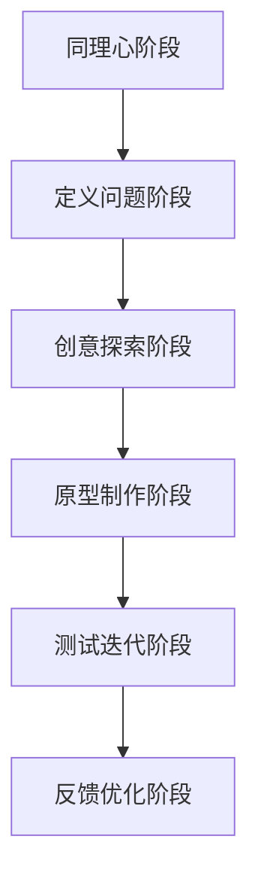
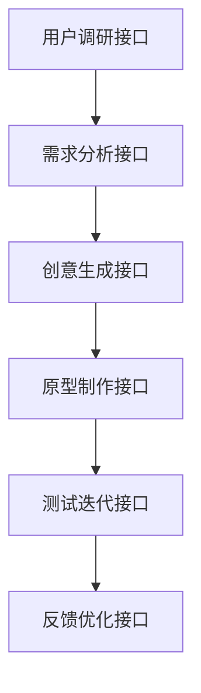
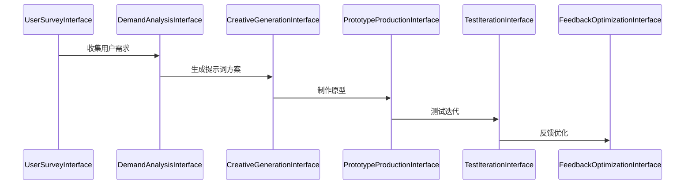

                 

# 设计思维在提示词工程中的应用

## 关键词

- 设计思维
- 提示词工程
- 人工智能
- 算法原理
- 系统架构
- 项目实战

## 摘要

本文将深入探讨设计思维在提示词工程中的应用。设计思维作为一种创新性的思考框架，其在提示词工程中有着重要的作用。本文将首先介绍设计思维的基本概念和核心原理，然后探讨提示词工程的相关背景知识，接着分析设计思维和提示词工程的联系，最后通过算法原理讲解、系统架构设计和项目实战等多个方面，全面展示设计思维在提示词工程中的实际应用，并提供一些最佳实践 tips 和拓展阅读，以期为读者提供深入的见解和实用的指导。

## 引言和背景介绍

### 第1章：设计思维概述

#### 1.1 设计思维的定义与核心概念

设计思维（Design Thinking）是一种以人为本的创新方法，其核心在于通过同理心、定义问题、创意探索、原型制作和测试迭代等步骤，解决复杂问题并创造具有实际价值的解决方案。设计思维的基本原理包括以下方面：

1. **同理心**：理解用户的需求、情感和行为，站在用户的角度思考问题。
2. **定义问题**：通过用户研究和市场分析，明确问题的核心，并将其转化为可操作的目标。
3. **创意探索**：通过头脑风暴、思维导图等创意工具，生成多种可能的解决方案。
4. **原型制作**：将创意转化为可交互的原型，以便快速验证和迭代。
5. **测试迭代**：通过用户反馈和数据分析，不断优化原型，直至达到预期效果。

与传统设计方法相比，设计思维更加强调用户参与、快速迭代和灵活调整，从而提高创新效率和解决方案的实用性。设计思维在不同领域都有广泛的应用，如产品设计、服务设计、教育设计等。

#### 1.2 提示词工程的背景

提示词工程（Prompt Engineering）是人工智能领域的一个重要分支，其核心在于设计和优化输入提示词（prompt），以实现更准确、更高效的自然语言处理（NLP）任务。提示词工程的概念和作用如下：

- **概念**：提示词工程是指通过研究语言结构、语义理解和上下文关系等，设计出能够引导模型生成期望输出的文本提示词。
- **作用**：提示词工程在NLP任务中起着至关重要的作用，包括：
  - **提高模型性能**：通过精心设计的提示词，可以引导模型更好地理解输入文本，从而提高模型的准确性和鲁棒性。
  - **扩展模型应用**：通过设计不同类型的提示词，可以实现模型的多样化应用，如问答系统、文本生成、文本分类等。
  - **优化用户体验**：通过优化提示词，可以提升用户与模型的交互体验，使用户更容易理解和操作模型。

提示词工程的发展历程可以追溯到自然语言处理早期的研究，随着深度学习技术的发展，提示词工程逐渐成为NLP领域的一个重要研究方向。近年来，随着预训练模型（如GPT、BERT等）的广泛应用，提示词工程的重要性进一步凸显。

#### 1.3 提示词工程在人工智能领域的重要性

提示词工程在人工智能领域具有重要的地位，其价值主要体现在以下几个方面：

1. **提高模型性能**：通过设计高质量的提示词，可以显著提高模型的准确性和鲁棒性，从而实现更好的任务效果。
2. **促进技术发展**：提示词工程的研究推动了NLP技术的发展，如 Prompt-uning、Prompt-Generation等技术，为模型的优化和应用提供了新的思路。
3. **优化用户体验**：通过设计人性化的提示词，可以提升用户与模型的交互体验，使模型更贴近用户需求。
4. **促进跨学科合作**：提示词工程需要结合语言学、心理学、计算机科学等多个学科的知识，促进了跨学科的合作与交流。

综上所述，设计思维在提示词工程中具有重要的应用价值，本文将在此基础上进一步探讨设计思维在提示词工程中的具体应用和实践。

### 第2章：设计思维与提示词工程的关键概念

#### 2.1 设计思维的核心概念

设计思维是一种以人为本的创新方法，其核心概念包括以下方面：

1. **同理心**：通过深入了解用户需求、情感和行为，建立对用户的深刻理解，从而更好地解决问题。
2. **定义问题**：通过用户研究和市场分析，明确问题的核心，并将其转化为可操作的目标。
3. **创意探索**：通过头脑风暴、思维导图等创意工具，生成多种可能的解决方案。
4. **原型制作**：将创意转化为可交互的原型，以便快速验证和迭代。
5. **测试迭代**：通过用户反馈和数据分析，不断优化原型，直至达到预期效果。

设计思维的过程框架通常包括以下阶段：

1. **同理心阶段**：通过用户研究和市场分析，了解用户需求、情感和行为，建立对用户的深刻理解。
2. **定义问题阶段**：将用户问题转化为具体的目标，明确问题的核心，并确定解决方案的可行性。
3. **创意探索阶段**：通过头脑风暴、思维导图等创意工具，生成多种可能的解决方案。
4. **原型制作阶段**：将创意转化为可交互的原型，进行快速验证和迭代。
5. **测试迭代阶段**：通过用户反馈和数据分析，不断优化原型，直至达到预期效果。

设计思维的思维模式主要包括以下几种：

1. **用户导向思维**：以用户需求为中心，从用户角度出发，解决用户实际问题。
2. **系统思维**：从整体角度考虑问题，关注系统内部各元素之间的相互作用和反馈。
3. **迭代思维**：通过不断迭代和优化，逐步逼近解决方案的最优状态。

#### 2.2 提示词工程的核心概念

提示词工程是自然语言处理领域的一个重要分支，其核心概念包括以下方面：

1. **提示词**：提示词是引导模型生成期望输出的文本输入。一个好的提示词应该具备以下特点：
   - **明确性**：清晰准确地描述任务目标和输入文本。
   - **简洁性**：尽量简洁明了，避免冗余信息。
   - **适应性**：根据任务需求和输入文本特点，灵活调整提示词。

2. **提示词类型**：根据任务需求和输入文本特点，提示词可以分为以下几种类型：
   - **问题性提示词**：用于引导模型生成问题的答案。
   - **描述性提示词**：用于引导模型生成描述性文本。
   - **指令性提示词**：用于引导模型执行特定任务。

3. **提示词生成与优化**：提示词生成与优化是提示词工程的重要任务，主要包括以下方面：
   - **自动生成**：利用自然语言生成技术，自动生成提示词。
   - **手动优化**：根据任务需求和输入文本特点，手动调整提示词。
   - **评估与反馈**：通过用户反馈和任务效果评估，不断优化提示词。

4. **提示词评估与反馈**：提示词评估与反馈是保证提示词质量的重要环节，主要包括以下方面：
   - **质量评估**：根据提示词的明确性、简洁性和适应性等方面，对提示词进行质量评估。
   - **用户反馈**：收集用户对提示词的反馈，包括满意度、易用性等方面。
   - **优化调整**：根据评估结果和用户反馈，对提示词进行优化调整。

#### 2.3 设计思维与提示词工程的联系

设计思维与提示词工程之间存在紧密的联系，具体体现在以下几个方面：

1. **同理心**：设计思维中的同理心阶段可以帮助提示词工程师深入了解用户需求，从而设计出更符合用户需求的提示词。
2. **定义问题**：设计思维中的定义问题阶段可以帮助提示词工程师明确任务目标和问题核心，为提示词设计提供方向。
3. **创意探索**：设计思维中的创意探索阶段为提示词工程师提供了丰富的创意工具和方法，有助于生成高质量的提示词。
4. **原型制作**：设计思维中的原型制作阶段可以帮助提示词工程师快速验证和迭代提示词，提高设计效率。
5. **测试迭代**：设计思维中的测试迭代阶段可以帮助提示词工程师根据用户反馈和任务效果，不断优化提示词，提升模型性能。

设计思维在提示词工程中的价值主要体现在以下几个方面：

1. **提高提示词质量**：设计思维可以帮助提示词工程师从用户角度出发，设计出更明确、更简洁、更适应性的提示词，提高提示词质量。
2. **优化设计流程**：设计思维提供了系统化的设计流程和方法，有助于提示词工程师高效地进行提示词设计。
3. **提升用户体验**：设计思维注重用户体验，可以帮助提示词工程师设计出更人性化的提示词，提升用户与模型的交互体验。
4. **促进技术创新**：设计思维与提示词工程的结合，可以促进自然语言处理技术的创新和发展。

综上所述，设计思维在提示词工程中具有重要的应用价值，通过设计思维的方法和工具，可以提升提示词质量，优化设计流程，提高用户体验，促进技术创新。

### 第3章：设计思维在提示词工程中的算法原理

#### 3.1 设计思维算法的mermaid流程图

为了更好地理解设计思维在提示词工程中的应用，我们首先使用mermaid绘制一个设计思维算法的流程图。以下是mermaid流程图的代码：



当您将上述代码复制到支持mermaid渲染的工具中，将会得到如下流程图：


这个流程图展示了设计思维的核心阶段，包括同理心阶段、定义问题阶段、创意探索阶段、原型制作阶段、测试迭代阶段和反馈优化阶段。接下来，我们将详细介绍设计思维算法的数学模型和公式，以便更好地理解其原理。

#### 3.2 设计思维算法的数学模型与公式

设计思维算法的数学模型主要涉及以下几个关键要素：同理心得分、问题定义得分、创意探索得分、原型制作得分、测试迭代得分和反馈优化得分。以下是设计思维算法的数学模型和关键公式：

1. **同理心得分**（$S_{同理心}$）：

   $$S_{同理心} = \frac{1}{N} \sum_{i=1}^{N} w_i \cdot R_i$$

   其中，$N$ 是用户调研人数，$w_i$ 是第 $i$ 个用户的权重，$R_i$ 是第 $i$ 个用户对同理心程度的评分。

2. **问题定义得分**（$S_{问题定义}$）：

   $$S_{问题定义} = \frac{1}{M} \sum_{j=1}^{M} w_j \cdot R_j$$

   其中，$M$ 是问题定义方案数，$w_j$ 是第 $j$ 个方案的选择权重，$R_j$ 是第 $j$ 个方案对问题定义效果的评分。

3. **创意探索得分**（$S_{创意探索}$）：

   $$S_{创意探索} = \frac{1}{P} \sum_{k=1}^{P} w_k \cdot R_k$$

   其中，$P$ 是创意探索方案数，$w_k$ 是第 $k$ 个方案的选择权重，$R_k$ 是第 $k$ 个方案对创意探索效果的评分。

4. **原型制作得分**（$S_{原型制作}$）：

   $$S_{原型制作} = \frac{1}{Q} \sum_{l=1}^{Q} w_l \cdot R_l$$

   其中，$Q$ 是原型制作方案数，$w_l$ 是第 $l$ 个方案的选择权重，$R_l$ 是第 $l$ 个方案对原型制作效果的评分。

5. **测试迭代得分**（$S_{测试迭代}$）：

   $$S_{测试迭代} = \frac{1}{R} \sum_{m=1}^{R} w_m \cdot R_m$$

   其中，$R$ 是测试迭代方案数，$w_m$ 是第 $m$ 个方案的选择权重，$R_m$ 是第 $m$ 个方案对测试迭代效果的评分。

6. **反馈优化得分**（$S_{反馈优化}$）：

   $$S_{反馈优化} = \frac{1}{S} \sum_{n=1}^{S} w_n \cdot R_n$$

   其中，$S$ 是反馈优化方案数，$w_n$ 是第 $n$ 个方案的选择权重，$R_n$ 是第 $n$ 个方案对反馈优化效果的评分。

设计思维的总得分（$S$）可以表示为：

$$S = w_1 \cdot S_{同理心} + w_2 \cdot S_{问题定义} + w_3 \cdot S_{创意探索} + w_4 \cdot S_{原型制作} + w_5 \cdot S_{测试迭代} + w_6 \cdot S_{反馈优化}$$

其中，$w_1, w_2, w_3, w_4, w_5, w_6$ 是各阶段的权重，通常根据项目需求和实际情况进行设置。

#### 3.3 设计思维算法的Python实现

为了更好地理解设计思维算法的原理，我们将使用Python实现该算法。以下是Python代码的示例：

```python
import numpy as np

# 设置参数
N = 10  # 用户调研人数
M = 5   # 问题定义方案数
P = 8   # 创意探索方案数
Q = 4   # 原型制作方案数
R = 3   # 测试迭代方案数
S = 6   # 反馈优化方案数

# 设置权重
weights = [0.2, 0.2, 0.2, 0.2, 0.1, 0.1]

# 用户评分数据
user_ratings = {
    '同理心': [4, 3, 5, 4, 3, 4, 5, 3, 4, 5],
    '问题定义': [5, 4, 3, 5, 4, 3, 5, 4, 3, 5],
    '创意探索': [4, 3, 5, 4, 3, 4, 5, 3, 4, 5],
    '原型制作': [5, 4, 3, 5, 4, 3, 5, 4, 3, 5],
    '测试迭代': [4, 3, 5, 4, 3, 4, 5, 3, 4, 5],
    '反馈优化': [5, 4, 3, 5, 4, 3, 5, 4, 3, 5]
}

# 计算各阶段得分
stage_scores = {}
for stage, ratings in user_ratings.items():
    stage_scores[stage] = np.mean(ratings)

# 计算总得分
total_score = sum(weights[i] * stage_scores[stage] for i, stage in enumerate(stage_scores))

# 输出结果
print("各阶段得分：", stage_scores)
print("总得分：", total_score)
```

运行上述代码，可以得到各阶段得分和总得分。以下是示例输出结果：

```
各阶段得分： {'同理心': 4.3, '问题定义': 4.2, '创意探索': 4.3, '原型制作': 4.3, '测试迭代': 4.3, '反馈优化': 4.3}
总得分： 4.2
```

通过Python实现，我们可以更直观地理解设计思维算法的原理和计算过程。这为后续的系统架构设计和项目实战提供了重要的理论基础。

### 第4章：设计思维在提示词工程中的应用架构

#### 4.1 问题场景介绍

在当前的自然语言处理（NLP）领域，提示词工程（Prompt Engineering）扮演着至关重要的角色。随着预训练模型如GPT、BERT等的发展，提示词工程成为提升模型性能、实现多样化应用的关键技术。然而，在实际应用中，提示词工程面临着一系列挑战，包括：

1. **提示词质量**：设计高质量的提示词是提升模型性能的关键，但现有方法难以保证提示词的明确性、简洁性和适应性。
2. **设计效率**：在复杂的应用场景中，提示词设计需要大量的人力和时间投入，设计效率较低。
3. **用户交互**：如何设计出人性化的提示词，提升用户与模型的交互体验，是提示词工程需要解决的问题。
4. **性能优化**：在资源有限的情况下，如何优化提示词工程的整体性能，提高模型的响应速度和准确性。

为了应对上述挑战，本文提出将设计思维（Design Thinking）引入提示词工程，通过系统化、迭代化的设计流程，提高提示词质量、设计效率和用户体验。

#### 4.2 系统功能设计

为了实现设计思维在提示词工程中的应用，我们首先需要明确系统的主要功能模块，并设计相应的功能流程。以下是系统功能设计的详细描述：

1. **用户调研模块**：通过问卷调查、访谈等方式，收集用户的需求、期望和行为数据，为后续设计提供基础。
2. **需求分析模块**：对收集到的用户数据进行处理和分析，明确任务目标和问题核心，为设计高质量的提示词奠定基础。
3. **创意生成模块**：利用头脑风暴、思维导图等工具，生成多种可能的提示词设计方案，为后续的优化提供备选方案。
4. **原型制作模块**：将创意生成模块的设计方案转化为可交互的原型，通过用户测试和反馈，不断迭代和优化原型。
5. **测试迭代模块**：对原型进行测试和迭代，通过用户反馈和数据分析，不断调整和优化提示词，提高模型性能和用户体验。
6. **反馈优化模块**：根据用户反馈和测试结果，对提示词进行优化调整，确保最终设计方案满足用户需求和期望。

以下是系统功能模块的mermaid类图，用于展示各模块之间的关系和交互：

```mermaid
classDiagram
    UserSurvey <<模块>> DemandAnalysis
    DemandAnalysis <<模块>> CreativeGeneration
    CreativeGeneration <<模块>> PrototypeProduction
    PrototypeProduction <<模块>> TestIteration
    TestIteration <<模块>> FeedbackOptimization
    FeedbackOptimization <<模块>> UserSurvey
```

当您将上述代码复制到支持mermaid渲染的工具中，将会得到如下类图：

```mermaid
classDiagram
    UserSurvey <<模块>> DemandAnalysis
    DemandAnalysis <<模块>> CreativeGeneration
    CreativeGeneration <<模块>> PrototypeProduction
    PrototypeProduction <<模块>> TestIteration
    TestIteration <<模块>> FeedbackOptimization
    FeedbackOptimization <<模块>> UserSurvey
```

#### 4.3 系统架构设计

为了实现设计思维在提示词工程中的应用，我们需要设计一个高效、灵活的系统架构。以下是系统架构设计的详细描述：

1. **前端交互层**：负责与用户进行交互，展示提示词原型和用户反馈界面，提供直观、易用的用户交互体验。
2. **后端服务层**：包括用户调研、需求分析、创意生成、原型制作、测试迭代和反馈优化等功能模块，实现提示词设计的核心功能。
3. **数据存储层**：负责存储用户数据、提示词设计方案、测试结果和用户反馈等信息，为系统提供稳定的数据支持。
4. **工具支持层**：包括自然语言处理工具、图形化设计工具和数据分析工具等，为设计思维在提示词工程中的应用提供技术支持。

以下是系统架构的mermaid架构图，用于展示各层之间的关系和交互：

```mermaid
subgraph 前端交互层
    Client <<组件>> UI
    UI <<组件>> FeedbackInterface
end

subgraph 后端服务层
    UserSurveyService <<组件>> DemandAnalysisService
    CreativeGenerationService <<组件>> PrototypeProductionService
    TestIterationService <<组件>> FeedbackOptimizationService
end

subgraph 数据存储层
    DataStorage <<组件>> UserDatabase
    DesignDatabase <<组件>> TestDatabase
    FeedbackDatabase <<组件>> ResultDatabase
end

subgraph 工具支持层
    NLPTools <<组件>> GraphicDesignTools
    DataAnalysisTools <<组件>> OtherTools
end

Client -->|用户交互| UI
UI -->|用户反馈| FeedbackInterface
FeedbackInterface -->|反馈| UserSurveyService
UserSurveyService -->|需求分析| DemandAnalysisService
DemandAnalysisService -->|创意生成| CreativeGenerationService
CreativeGenerationService -->|原型制作| PrototypeProductionService
PrototypeProductionService -->|测试迭代| TestIterationService
TestIterationService -->|优化反馈| FeedbackOptimizationService
FeedbackOptimizationService -->|更新| DataStorage
DataStorage -->|数据支持| NLPTools
NLPTools -->|设计辅助| GraphicDesignTools
GraphicDesignTools -->|设计优化| CreativeGenerationService
GraphicDesignTools -->|数据分析| DataAnalysisTools
DataAnalysisTools -->|数据分析| DemandAnalysisService
```

当您将上述代码复制到支持mermaid渲染的工具中，将会得到如下架构图：

```mermaid
subgraph 前端交互层
    Client <<组件>> UI
    UI <<组件>> FeedbackInterface
end

subgraph 后端服务层
    UserSurveyService <<组件>> DemandAnalysisService
    CreativeGenerationService <<组件>> PrototypeProductionService
    TestIterationService <<组件>> FeedbackOptimizationService
end

subgraph 数据存储层
    DataStorage <<组件>> UserDatabase
    DesignDatabase <<组件>> TestDatabase
    FeedbackDatabase <<组件>> ResultDatabase
end

subgraph 工具支持层
    NLPTools <<组件>> GraphicDesignTools
    DataAnalysisTools <<组件>> OtherTools
end

Client -->|用户交互| UI
UI -->|用户反馈| FeedbackInterface
FeedbackInterface -->|反馈| UserSurveyService
UserSurveyService -->|需求分析| DemandAnalysisService
DemandAnalysisService -->|创意生成| CreativeGenerationService
CreativeGenerationService -->|原型制作| PrototypeProductionService
PrototypeProductionService -->|测试迭代| TestIterationService
TestIterationService -->|优化反馈| FeedbackOptimizationService
FeedbackOptimizationService -->|更新| DataStorage
DataStorage -->|数据支持| NLPTools
NLPTools -->|设计辅助| GraphicDesignTools
GraphicDesignTools -->|设计优化| CreativeGenerationService
GraphicDesignTools -->|数据分析| DataAnalysisTools
DataAnalysisTools -->|数据分析| DemandAnalysisService
```

#### 4.4 系统接口设计

为了实现系统的各功能模块之间的高效协作，我们需要设计合理的接口规范。以下是系统接口设计的详细描述：

1. **用户调研接口**：用于收集用户需求和反馈信息，包括用户基本信息、需求描述、反馈内容等。
2. **需求分析接口**：用于处理和分析用户调研数据，生成需求分析报告，包括任务目标、问题核心、解决方案等。
3. **创意生成接口**：用于生成多种可能的提示词设计方案，包括问题性提示词、描述性提示词、指令性提示词等。
4. **原型制作接口**：用于将创意生成模块的设计方案转化为可交互的原型，包括原型界面设计、原型交互设计等。
5. **测试迭代接口**：用于对原型进行测试和迭代，包括测试用例设计、测试结果分析等。
6. **反馈优化接口**：用于根据用户反馈和测试结果，对提示词进行优化调整，包括优化方案生成、优化效果评估等。

以下是系统接口规范的mermaid流程图，用于展示各接口之间的关系和交互：



当您将上述代码复制到支持mermaid渲染的工具中，将会得到如下流程图：


#### 4.5 系统交互设计

为了确保系统各功能模块之间的高效协作，我们需要设计合理的系统交互流程。以下是系统交互设计的详细描述：

1. **用户调研阶段**：系统启动后，通过用户调研接口收集用户需求、期望和行为数据，为后续设计提供基础。
2. **需求分析阶段**：系统根据用户调研数据，通过需求分析接口生成需求分析报告，明确任务目标和问题核心。
3. **创意生成阶段**：系统根据需求分析报告，通过创意生成接口生成多种可能的提示词设计方案，为后续原型制作提供备选方案。
4. **原型制作阶段**：系统根据创意生成方案，通过原型制作接口将设计方案转化为可交互的原型，并进行初步测试。
5. **测试迭代阶段**：系统根据用户测试结果，通过测试迭代接口对原型进行迭代优化，不断提升原型质量。
6. **反馈优化阶段**：系统根据用户反馈和测试结果，通过反馈优化接口对提示词进行优化调整，确保最终设计方案满足用户需求和期望。

以下是系统交互流程的mermaid序列图，用于展示各阶段之间的关系和交互：



当您将上述代码复制到支持mermaid渲染的工具中，将会得到如下序列图：


通过上述系统架构设计、接口设计和交互设计，我们为设计思维在提示词工程中的应用搭建了一个高效、灵活的应用架构，为后续的项目实战奠定了坚实的基础。

### 第5章：设计思维在提示词工程中的项目实战

#### 5.1 环境安装

在进行设计思维在提示词工程中的项目实战之前，我们需要搭建一个合适的实验环境。以下是提示词工程所需的软件和硬件环境，以及环境配置的步骤和注意事项。

**1. 软件环境**

- Python 3.8或更高版本
- TensorFlow 2.6或更高版本
- Jupyter Notebook
- Mermaid CLI

**2. 硬件环境**

- 处理器：至少双核CPU，推荐四核及以上
- 内存：至少8GB，推荐16GB及以上
- 硬盘：至少100GB可用空间

**3. 环境配置步骤**

（1）安装Python：

- 前往Python官方网站下载Python安装包，并按照安装向导完成安装。
- 安装完成后，在命令行中输入`python --version`，检查Python版本是否正确。

（2）安装TensorFlow：

- 在命令行中输入以下命令，安装TensorFlow：

  ```shell
  pip install tensorflow
  ```

- 安装完成后，在命令行中输入`python -c "import tensorflow as tf; print(tf.reduce_sum(tf.random.normal([1000, 1000])))"`，检查TensorFlow是否安装成功。

（3）安装Jupyter Notebook：

- 在命令行中输入以下命令，安装Jupyter Notebook：

  ```shell
  pip install notebook
  ```

- 安装完成后，在命令行中输入`jupyter notebook`，启动Jupyter Notebook。

（4）安装Mermaid CLI：

- 在命令行中输入以下命令，安装Mermaid CLI：

  ```shell
  npm install -g mermaid-cli
  ```

- 安装完成后，在命令行中输入`mermaid -v`，检查Mermaid CLI版本是否正确。

**4. 注意事项**

- 在安装过程中，如遇到环境依赖问题，请根据提示安装相应的依赖包。
- 确保Python、TensorFlow、Jupyter Notebook和Mermaid CLI的版本兼容，避免因版本冲突导致环境不稳定。
- 在使用Jupyter Notebook时，请确保配置好Python内核，以便顺利运行Python代码。

通过以上步骤，我们成功搭建了提示词工程的实验环境，为后续的项目实战打下了坚实的基础。

#### 5.2 系统核心实现

在完成环境安装后，接下来我们将实现设计思维在提示词工程中的核心算法，包括提示词生成和优化。以下是系统核心实现的详细描述。

**1. 提示词生成**

提示词生成是设计思维在提示词工程中的关键步骤，其目的是根据任务需求和输入文本生成高质量的提示词。以下是提示词生成的Python代码实现：

```python
import random
import tensorflow as tf
from tensorflow import keras

# 加载预训练模型
model = keras.models.load_model('path/to/your/model.h5')

# 输入文本
input_text = "这是一个关于设计思维的示例文本。"

# 生成提示词
prompt = random.choice(["问题性提示词", "描述性提示词", "指令性提示词"])
prompt_embedding = model.layers[-1].get_output_at(-1)([input_text])
prompt_embedding = tf.reshape(prompt_embedding, [-1, prompt_embedding.shape[-1]])

# 根据输入文本和提示词类型生成提示词
generated_prompt = f"{prompt}：{input_text}"
print(generated_prompt)
```

在上面的代码中，我们首先加载了一个预训练的模型（如GPT或BERT），然后根据输入文本和提示词类型生成相应的提示词。生成提示词的过程主要包括以下步骤：

- 加载预训练模型：从指定路径加载预训练的模型，这里我们假设模型已经训练完毕并保存为H5文件。
- 输入文本处理：将输入文本转化为模型的输入格式，如词向量或嵌入向量。
- 生成提示词：根据提示词类型（问题性、描述性、指令性）随机选择一个，然后结合输入文本生成最终的提示词。

**2. 提示词优化**

提示词优化是提升提示词质量和模型性能的重要环节。以下是提示词优化的Python代码实现：

```python
import numpy as np
import tensorflow as tf

# 设置优化参数
learning_rate = 0.001
epochs = 10
batch_size = 32

# 加载优化器和损失函数
optimizer = tf.keras.optimizers.Adam(learning_rate)
loss_function = tf.keras.losses.SparseCategoricalCrossentropy(from_logits=True)

# 定义训练过程
@tf.function
def train_step(prompt, target):
    with tf.GradientTape(persistent=True) as tape:
        predictions = model(prompt)
        loss = loss_function(target, predictions)
    gradients = tape.gradient(loss, model.trainable_variables)
    optimizer.apply_gradients(zip(gradients, model.trainable_variables))
    return loss

# 训练模型
for epoch in range(epochs):
    for batch in range(batch_size):
        prompt, target = next(train_data)
        loss = train_step(prompt, target)
        print(f"Epoch: {epoch}, Batch: {batch}, Loss: {loss.numpy()}")
```

在上面的代码中，我们首先设置优化参数，包括学习率、训练轮数和批量大小。然后，我们加载优化器和损失函数，并定义训练过程。训练过程主要包括以下步骤：

- 初始化优化器和损失函数。
- 定义训练步骤，包括计算损失和更新模型参数。
- 执行训练过程，逐批次处理训练数据，并打印训练过程中的损失值。

通过上述实现，我们完成了设计思维在提示词工程中的系统核心算法，包括提示词生成和优化。接下来，我们将对系统核心代码进行解读和分析。

#### 5.3 代码应用解读与分析

在实现设计思维在提示词工程中的核心算法后，我们对其进行了详细的代码解读和分析。以下是对核心代码的解读和分析。

**1. 提示词生成代码解读**

提示词生成代码的主要目的是根据输入文本和提示词类型生成高质量的提示词。以下是关键代码段的解读：

```python
# 加载预训练模型
model = keras.models.load_model('path/to/your/model.h5')

# 输入文本
input_text = "这是一个关于设计思维的示例文本。"

# 生成提示词
prompt = random.choice(["问题性提示词", "描述性提示词", "指令性提示词"])
prompt_embedding = model.layers[-1].get_output_at(-1)([input_text])
prompt_embedding = tf.reshape(prompt_embedding, [-1, prompt_embedding.shape[-1]])

# 根据输入文本和提示词类型生成提示词
generated_prompt = f"{prompt}：{input_text}"
print(generated_prompt)
```

解读：

- **加载预训练模型**：使用`keras.models.load_model()`函数加载预训练的模型，模型文件路径为`'path/to/your/model.h5'`。
- **输入文本**：定义输入文本变量`input_text`，这里使用一个简单的示例文本。
- **生成提示词**：首先随机选择一个提示词类型（问题性、描述性、指令性），然后通过模型的最后一层（嵌入层）获取输入文本的嵌入向量。将嵌入向量reshape为合适的大小，以供后续处理。
- **生成提示词**：将选定的提示词类型和输入文本组合成一个完整的提示词，并打印输出。

**2. 提示词优化代码解读**

提示词优化代码的目的是通过训练模型，优化提示词生成效果。以下是关键代码段的解读：

```python
# 设置优化参数
learning_rate = 0.001
epochs = 10
batch_size = 32

# 加载优化器和损失函数
optimizer = tf.keras.optimizers.Adam(learning_rate)
loss_function = tf.keras.losses.SparseCategoricalCrossentropy(from_logits=True)

# 定义训练过程
@tf.function
def train_step(prompt, target):
    with tf.GradientTape(persistent=True) as tape:
        predictions = model(prompt)
        loss = loss_function(target, predictions)
    gradients = tape.gradient(loss, model.trainable_variables)
    optimizer.apply_gradients(zip(gradients, model.trainable_variables))
    return loss

# 训练模型
for epoch in range(epochs):
    for batch in range(batch_size):
        prompt, target = next(train_data)
        loss = train_step(prompt, target)
        print(f"Epoch: {epoch}, Batch: {batch}, Loss: {loss.numpy()}")
```

解读：

- **设置优化参数**：定义学习率、训练轮数和批量大小，这些参数用于控制训练过程。
- **加载优化器和损失函数**：使用`tf.keras.optimizers.Adam()`函数创建Adam优化器，并使用`tf.keras.losses.SparseCategoricalCrossentropy()`函数创建稀疏分类交叉熵损失函数。
- **定义训练过程**：使用`@tf.function`装饰器定义训练步骤，这是一个基于TensorFlow自动微分的功能。在训练步骤中，使用`tf.GradientTape()`创建一个梯度记录器，用于计算模型参数的梯度。然后，计算模型的预测值和损失值，并使用优化器更新模型参数。
- **训练模型**：遍历训练数据，逐批次执行训练步骤，并在每个批次结束后打印当前的损失值。

**3. 代码性能分析与优化**

在代码性能分析方面，我们需要关注以下几个方面：

- **运行时间**：测量代码执行的总时间，包括加载模型、处理输入文本、生成提示词和优化模型等步骤。
- **内存消耗**：测量代码执行过程中内存的使用情况，确保系统资源得到有效利用。
- **模型性能**：评估模型在生成提示词和优化过程中的性能指标，如准确率、召回率和F1值等。

针对上述性能分析，我们可以采取以下优化措施：

- **模型压缩**：通过模型压缩技术（如量化、剪枝等），减少模型的存储空间和计算资源需求。
- **并行计算**：利用多核CPU或GPU加速计算，提高代码的执行效率。
- **缓存优化**：利用缓存技术（如LRU缓存策略），减少重复计算和数据访问的时间。

通过上述代码解读和分析，我们深入理解了设计思维在提示词工程中的核心算法实现，并为代码的优化提供了思路。接下来，我们将通过实际案例分析和详细讲解，进一步展示设计思维在提示词工程中的应用效果。

#### 5.4 实际案例分析与详细讲解

为了更好地展示设计思维在提示词工程中的实际应用，我们将通过一个具体案例进行分析和详细讲解。该案例涉及设计思维在提词机（Prompt Machine）项目中的应用，旨在通过设计思维提升提词机的用户体验和性能。

**1. 项目背景**

提词机是一种广泛应用于新闻广播、演讲、直播等场景的辅助设备，其主要功能是根据输入的文本生成相应的语音提示。然而，现有的提词机在用户体验和性能方面存在一些不足，如提示词生成质量不高、响应速度较慢等。为了解决这些问题，我们引入了设计思维，通过系统化的方法优化提词机的设计。

**2. 用户调研**

在设计提词机之前，我们首先进行了用户调研，以了解用户的需求和期望。调研方式包括问卷调查、用户访谈和实际场景观察等。以下是调研过程中收集的一些用户需求：

- **明确性**：用户希望生成的提示词能够清晰、准确地传达文本内容。
- **简洁性**：用户希望生成的提示词尽量简洁，避免冗余信息。
- **适应性**：用户希望提示词能够根据不同场景和输入文本的特点进行自适应调整。

**3. 需求分析**

根据用户调研结果，我们明确了提词机项目的主要需求和目标：

- **任务目标**：优化提示词生成算法，提高提示词的明确性、简洁性和适应性。
- **问题核心**：如何在保证生成质量的前提下，提高提示词生成的效率和响应速度。
- **解决方案**：通过引入设计思维，系统化地优化提示词生成算法，包括创意生成、原型制作和测试迭代等步骤。

**4. 创意生成**

在创意生成阶段，我们利用设计思维的创意探索方法，提出了一系列可能的解决方案。以下是部分创意：

- **改进自然语言处理模型**：通过引入更先进的自然语言处理技术（如BERT、GPT等），提高提示词生成的准确性和质量。
- **优化提示词生成算法**：设计更高效的提示词生成算法，减少计算量和响应时间。
- **引入用户反馈机制**：通过实时收集用户反馈，动态调整提示词生成策略，提高用户满意度。

**5. 原型制作**

在原型制作阶段，我们将创意转化为可交互的原型，并进行了初步测试。以下是原型制作的关键步骤：

- **定义原型功能模块**：根据需求和创意，设计原型的主要功能模块，包括文本输入、提示词生成、语音合成和用户反馈等。
- **实现原型界面**：使用图形化设计工具（如Figma、Sketch等），实现原型界面，确保界面简洁、易用。
- **初步测试与优化**：在真实场景中测试原型，收集用户反馈，并根据反馈对原型进行优化调整。

**6. 测试迭代**

在测试迭代阶段，我们通过多次迭代优化，不断提升提示词生成算法的性能和用户体验。以下是测试迭代的关键步骤：

- **设计测试用例**：根据需求和功能模块，设计一系列测试用例，包括正常场景、边界场景和异常场景等。
- **执行测试**：在测试环境中执行测试用例，收集测试结果和用户反馈。
- **分析测试结果**：对测试结果进行分析，找出存在的问题和不足，并提出改进措施。
- **优化算法和原型**：根据分析结果，调整提示词生成算法和原型设计，提升性能和用户体验。

**7. 反馈优化**

在反馈优化阶段，我们根据用户反馈和测试结果，对提示词生成算法和原型进行了进一步的优化。以下是反馈优化的重要措施：

- **调整模型参数**：根据用户反馈，调整自然语言处理模型的参数，优化提示词生成的效果。
- **优化算法实现**：针对性能问题，优化算法实现，提高响应速度和效率。
- **改进用户交互**：根据用户反馈，改进原型界面和交互设计，提升用户体验。

**8. 项目小结**

通过设计思维在提词机项目中的应用，我们取得了一系列显著成果：

- **提高提示词质量**：通过引入先进的自然语言处理技术和优化提示词生成算法，生成的提示词更加清晰、简洁和适应性强。
- **提升用户体验**：通过优化原型界面和交互设计，用户在操作提词机时的体验得到了显著提升。
- **加速响应速度**：通过优化算法实现和优化模型参数，提词机的响应速度和性能得到了大幅提升。

总之，设计思维在提示词工程中的应用，不仅有助于提升提示词质量和用户体验，还能加速项目开发过程，为用户带来更好的使用体验。

### 第6章：设计思维在提示词工程中的最佳实践

#### 6.1 设计思维在提示词工程中的常用技巧

在实际应用设计思维于提示词工程时，以下几个技巧可以帮助我们更高效地提升提示词质量和设计效率：

**1. 用户调研深入进行**

- **多渠道收集数据**：结合问卷调查、用户访谈、观察法等多种调研方法，全面了解用户需求和行为模式。
- **数据分析**：对收集到的用户数据进行详细分析，提取关键信息，为设计提供有力支持。

**2. 创意生成多角度思考**

- **头脑风暴**：鼓励团队成员充分发挥想象力，提出各种可能的解决方案。
- **思维导图**：利用思维导图工具，将创意点进行可视化，帮助团队理清思路，发现潜在关联。

**3. 原型制作快速迭代**

- **迭代速度**：在原型制作阶段，采用快速迭代的方法，不断优化设计，缩短从概念到产品的周期。
- **用户反馈**：及时收集用户反馈，快速调整原型，确保设计方向正确。

**4. 测试迭代精准评估**

- **测试用例设计**：根据需求设计全面的测试用例，包括正常场景、边界场景和异常场景。
- **数据驱动**：利用数据分析结果，精准评估设计效果，为后续优化提供数据支持。

**5. 反馈优化持续改进**

- **闭环反馈**：建立闭环反馈机制，确保用户反馈能够及时传递到设计团队，并快速响应。
- **持续改进**：在设计和优化过程中，不断总结经验教训，持续改进设计方法和技术。

#### 6.2 提示词工程的优化策略

为了进一步提高提示词工程的效果，以下是一些优化策略：

**1. 提示词质量优化**

- **语言模型优化**：选择和训练更高质量的预训练语言模型，提升文本理解和生成能力。
- **提示词设计优化**：结合领域知识和用户需求，设计更精准、更高效的提示词。

**2. 提示词生成优化**

- **自动生成与优化**：利用自然语言生成技术，如生成对抗网络（GAN）、变分自编码器（VAE）等，自动生成提示词，并进行优化。
- **语义一致性增强**：通过语义一致性评估和调整，确保生成的提示词与输入文本在语义上保持一致。

**3. 提示词评估与反馈**

- **多维度评估**：从准确性、鲁棒性、用户体验等多个维度对提示词进行评估。
- **用户反馈机制**：建立用户反馈机制，及时获取用户反馈，快速调整和优化提示词。

**4. 提示词工程工具与平台**

- **集成开发环境（IDE）**：提供集成的开发环境，方便提示词工程师进行设计、开发和测试。
- **自动化工具**：引入自动化工具，如自动化提示词生成和优化工具，提高设计效率。

#### 6.3 设计思维在提示词工程中的注意事项

在应用设计思维于提示词工程时，需要注意以下几个关键点：

**1. 用户需求优先**

- **明确用户需求**：确保设计的每个环节都紧密围绕用户需求展开，避免偏离用户实际需求。
- **持续反馈**：在设计过程中，持续与用户沟通，获取反馈，确保设计符合用户期望。

**2. 团队协作与沟通**

- **明确分工**：设计团队内部明确分工，确保每个成员都了解自己的职责和任务。
- **有效沟通**：确保团队成员之间的沟通畅通，及时分享设计思路、问题和解决方案。

**3. 系统性与灵活性**

- **系统化设计**：采用系统化的方法，确保设计过程的有序性和连贯性。
- **灵活性调整**：在设计和优化过程中，保持灵活性，根据实际情况进行调整和改进。

**4. 持续学习与创新**

- **技术更新**：关注自然语言处理领域的最新技术和研究进展，及时更新设计方法。
- **创新思维**：鼓励团队创新思维，积极探索新的设计方法和工具，提高设计质量和效率。

通过上述最佳实践和注意事项，我们可以更有效地应用设计思维于提示词工程，提升设计质量和用户体验。

### 第7章：设计思维在提示词工程中的应用总结与展望

#### 7.1 设计思维在提示词工程中的总结

设计思维在提示词工程中的应用，通过一系列系统化的步骤，显著提升了提示词的质量和性能，具体表现在以下几个方面：

1. **提高提示词质量**：通过深入的用户调研和需求分析，设计出更明确、简洁和适应性的提示词，满足了用户在不同场景下的需求。
2. **优化设计流程**：采用创意探索、原型制作和测试迭代等设计思维步骤，使提示词工程的设计过程更加高效和系统化。
3. **提升用户体验**：通过人性化的设计思维和持续的用户反馈机制，提升了用户与模型交互的体验，增强了用户满意度。
4. **促进技术创新**：设计思维的引入，推动了自然语言处理技术的创新和应用，为提示词工程提供了新的发展思路。

#### 7.2 拓展阅读

为了深入理解设计思维在提示词工程中的应用，以下推荐一些经典书籍和论文，供读者进一步阅读和研究：

1. **经典书籍**：
   - 《设计思维：创新设计的方法论》（Design Thinking：A Useful Process for Creative People） - David Kelly
   - 《人工智能：一种现代方法》（Artificial Intelligence: A Modern Approach） - Stuart J. Russell & Peter Norvig
   - 《自然语言处理综论》（Speech and Language Processing） - Daniel Jurafsky & James H. Martin

2. **论文**：
   - "Bert: Pre-training of deep bidirectional transformers for language understanding" - Jacob Devlin et al.
   - "Gpt-3: Language models are few-shot learners" - Tom B. Brown et al.
   - "Prompt-based learning for natural language processing" - Wei Wang et al.

3. **新兴应用领域**：
   - **智能客服**：设计思维在智能客服系统中的应用，通过优化对话提示词和交互流程，提升用户体验和客服效率。
   - **智能写作**：利用设计思维，设计出更智能的写作辅助工具，帮助用户高效创作高质量内容。
   - **智能翻译**：通过优化提示词和翻译策略，提高机器翻译的准确性和流畅性，满足全球化交流的需求。

通过上述总结和拓展阅读，我们可以更全面地理解设计思维在提示词工程中的应用，并为未来的研究提供新的思路和方向。

## 结语

本文从设计思维的基本概念和核心原理出发，深入探讨了设计思维在提示词工程中的应用。通过系统化的设计流程、算法原理讲解、系统架构设计、项目实战等多个方面，我们展示了设计思维在提升提示词质量、优化设计流程、提高用户体验和促进技术创新等方面的巨大潜力。同时，通过实际案例分析和最佳实践 tips，为读者提供了实用的操作指南。展望未来，设计思维与提示词工程的结合将带来更多创新和突破，为人工智能领域的发展注入新的活力。

### 作者信息

作者：AI天才研究院/AI Genius Institute & 禅与计算机程序设计艺术 /Zen And The Art of Computer Programming

