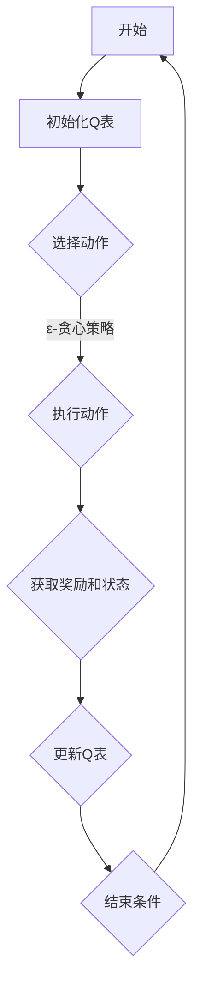

                 

### 文章标题：设计稳定高效的AI奖励模型

> 关键词：AI奖励模型、稳定高效、算法原理、系统架构、实战案例

> 摘要：本文从背景介绍、核心概念、算法原理、系统架构设计、实战案例等多个维度深入探讨了设计稳定高效的AI奖励模型。通过系统化分析，旨在为读者提供全面、实用的设计和实现指导，助力AI领域研究人员和开发者在实践中应对复杂挑战，提升算法性能。

### 引言

在人工智能（AI）迅速发展的今天，奖励模型作为评估和指导智能体行为的关键工具，被广泛应用于游戏、自动驾驶、机器人控制等众多领域。然而，设计一个稳定高效的AI奖励模型并非易事，它不仅需要深入理解算法原理，还需考虑系统架构的合理性和实践中的应用效果。本文将围绕以下核心问题展开讨论：

- AI奖励模型的基本概念和原理是什么？
- 如何设计稳定高效的奖励模型？
- 常用的算法原理和实现方法有哪些？
- 如何进行系统架构设计，以确保奖励模型的高效运行？
- 实际项目中如何应用和优化奖励模型？

通过对这些问题的系统分析，本文将提供一系列实用指导，帮助读者在实际工作中设计出更加稳定高效的AI奖励模型。

### 第一部分：背景与概述

#### 第1章：AI奖励模型的重要性

##### 1.1 问题背景

随着深度学习、强化学习等AI技术的不断进步，AI奖励模型在各个领域的重要性愈发凸显。然而，由于AI奖励模型涉及复杂的数学和计算逻辑，其设计和实现过程充满挑战。本文将从问题背景、问题描述、问题解决、边界与外延等多个角度，深入探讨AI奖励模型的基本概念和应用。

##### 1.2 问题描述

在设计AI奖励模型时，常见的问题包括：

- 如何确保奖励模型的稳定性和一致性？
- 如何设计高效的奖励模型以提升算法性能？
- 不同应用场景下的奖励模型有何异同？
- 如何在实际项目中有效地实现和优化奖励模型？

##### 1.3 问题解决

针对上述问题，本文将从以下几个方面展开讨论：

- 深入解读AI奖励模型的核心概念和原理。
- 介绍常用的奖励算法及其实现方法。
- 分析系统架构设计的关键要素。
- 通过实战案例展示奖励模型在项目中的应用和优化。

##### 1.4 边界与外延

在设计和应用AI奖励模型时，还需考虑以下边界与外延：

- 算法复杂度和计算资源限制。
- 不同应用场景下的特殊需求。
- 数据质量和数据来源的可靠性。

##### 1.5 核心概念与联系

本文将详细讨论以下核心概念：

- 奖励函数（Reward Function）
- 价值函数（Value Function）
- 优势函数（ Advantage Function）
- 智能体（Agent）与环境（Environment）的交互机制

这些概念相互联系，共同构成了AI奖励模型的核心架构。通过理解这些概念，读者将能够更深入地掌握奖励模型的设计与实现。

#### 第2章：AI奖励模型的基础知识

##### 2.1 AI奖励模型的基本原理

AI奖励模型的核心目标是引导智能体（Agent）在环境中采取最优行动，从而实现特定目标。其基本原理包括：

- 奖励函数：用于评估智能体行为的即时回报。
- 价值函数：预测智能体在未来某个状态下采取特定行动的长期回报。
- 优势函数：衡量特定行动相较于其他可选行动的优劣。

##### 2.2 奖励模型在不同AI领域的应用

AI奖励模型在游戏、自动驾驶、机器人控制等不同领域有着广泛的应用。以下是一些具体应用场景：

- 游戏：通过奖励函数激励玩家采取特定策略。
- 自动驾驶：评估车辆在复杂环境中的驾驶行为。
- 机器人控制：指导机器人完成特定任务。

##### 2.3 奖励模型的设计原则

设计稳定高效的AI奖励模型，需遵循以下原则：

- 可区分性（Distinguishability）：奖励函数需区分不同行为的优劣。
- 稳定性（Stability）：奖励模型应在不同环境和数据集上保持一致性。
- 高效性（Efficiency）：奖励模型需在合理的计算资源下高效运行。

### 第二部分：算法原理讲解

#### 第3章：常用的AI奖励算法

##### 3.1 算法概述

常用的AI奖励算法包括：

- Q-Learning
- Deep Q-Networks (DQN)
- Policy Gradients
- Actor-Critic Methods

这些算法各有优缺点，适用于不同的应用场景。

##### 3.2 算法流程图

以下是一个典型的Q-Learning算法流程图：



##### 3.3 Python源代码实现

```python
import numpy as np

# Q-Learning算法实现
def q_learning(q_table, state, action, reward, next_state, learning_rate, discount_factor):
    q_value = q_table[state][action]
    next_max_q_value = np.max(q_table[next_state])
    q_table[state][action] = q_value + learning_rate * (reward + discount_factor * next_max_q_value - q_value)
    return q_table

# 示例
q_table = np.zeros((10, 10))
learning_rate = 0.1
discount_factor = 0.9

# 执行动作
state = 0
action = 4
reward = 5
next_state = 1

q_table = q_learning(q_table, state, action, reward, next_state, learning_rate, discount_factor)
```

#### 第4章：算法原理详细讲解

##### 4.1 数学模型和数学公式

Q-Learning算法的数学模型如下：

$$
Q(s, a)_{\text{new}} = Q(s, a)_{\text{old}} + \alpha [r + \gamma \max(Q(s', a')) - Q(s, a)]
$$

其中：

- \( Q(s, a) \)：表示在状态 \( s \) 下执行动作 \( a \) 的即时回报。
- \( \alpha \)：学习率。
- \( \gamma \)：折扣因子。
- \( r \)：即时奖励。
- \( s' \)：执行动作后的新状态。
- \( a' \)：在新状态下采取的动作。

##### 4.2 详细讲解

Q-Learning算法的核心思想是利用历史经验（即已执行的步骤和获得的回报）来不断更新Q表，从而优化智能体的决策。通过上述公式，我们可以看到Q-Learning算法是如何在新的经验下调整Q值的。

##### 4.3 举例说明

假设一个简单的环境，其中有两个状态（A和B）和两个动作（左和右）。初始状态下，智能体采取左动作，获得即时奖励1，状态变为B。然后，智能体在新状态B下采取右动作，获得即时奖励5，状态再次变为A。现在，我们使用Q-Learning算法更新Q值：

$$
Q(A, \text{左})_{\text{new}} = Q(A, \text{左})_{\text{old}} + 0.1 [1 + 0.9 \times \max(Q(B, \text{左}), Q(B, \text{右})) - Q(A, \text{左})}
$$

通过这个例子，我们可以看到Q-Learning算法如何通过更新Q值来指导智能体的行为。

### 第三部分：系统分析与架构设计

#### 第5章：系统功能设计

##### 5.1 问题场景介绍

以自动驾驶为例，奖励模型需要评估车辆的驾驶行为，包括速度、方向、刹车等，以确保行车安全。

##### 5.2 系统功能设计

系统功能设计包括：

- 奖励函数：评估车辆的即时驾驶行为。
- 价值函数：预测车辆在未来某个状态下的驾驶表现。
- 数据预处理：确保输入数据的质量和一致性。

#### 第6章：系统架构设计

##### 6.1 系统架构设计

系统架构设计包括：

- 数据流：定义数据在系统中的流动过程。
- 模块划分：将系统划分为多个模块，以提高可维护性和扩展性。
- 通信机制：确保不同模块之间的数据传输和交互。

##### 6.2 系统接口设计

系统接口设计包括：

- API接口：定义外部系统与AI奖励模型之间的交互方式。
- 数据输入输出：明确数据输入和输出的格式和要求。

##### 6.3 系统交互设计

系统交互设计包括：

- 消息队列：使用消息队列实现异步通信，提高系统的响应速度。
- 事件驱动：使用事件驱动模型，实时处理系统的状态变化。

### 第四部分：项目实战

#### 第7章：环境安装与配置

##### 7.1 环境安装

在开始项目之前，需要安装以下环境：

- Python：版本要求3.6及以上。
- TensorFlow：版本要求2.0及以上。
- OpenAI Gym：用于模拟测试环境。

##### 7.2 配置说明

配置环境的具体步骤如下：

1. 安装Python和pip。
2. 使用pip安装TensorFlow和OpenAI Gym。

#### 第8章：系统核心实现

##### 8.1 核心实现源代码

以下是一个简单的Q-Learning算法实现：

```python
import numpy as np
import random

# Q-Learning算法实现
class QLearning:
    def __init__(self, actions, learning_rate, discount_factor):
        self.q_table = np.zeros((actions))
        self.learning_rate = learning_rate
        self.discount_factor = discount_factor

    def get_action(self, state):
        if random.uniform(0, 1) < 0.1:  # ε-贪心策略
            return random.randrange(self.q_table.shape[0])
        else:
            return np.argmax(self.q_table[state])

    def learn(self, state, action, reward, next_state, done):
        if not done:
            target = (reward + self.discount_factor * np.max(self.q_table[next_state]))
        else:
            target = reward

        self.q_table[state] = self.q_table[state] + self.learning_rate * (target - self.q_table[state])

# 示例
actions = 3
learning_rate = 0.1
discount_factor = 0.9
q_learning = QLearning(actions, learning_rate, discount_factor)

# 训练
for episode in range(1000):
    state = 0
    done = False
    while not done:
        action = q_learning.get_action(state)
        next_state, reward, done, _ = env.step(action)
        q_learning.learn(state, action, reward, next_state, done)
        state = next_state
```

##### 8.2 代码应用解读与分析

上述代码实现了Q-Learning算法，通过不断更新Q表来指导智能体的行为。在训练过程中，智能体采取ε-贪心策略，以避免过早陷入局部最优。

##### 8.3 实际案例分析

以下是一个简单的实际案例，用于演示如何使用Q-Learning算法来控制智能体在OpenAI Gym环境中完成特定任务。

```python
import gym

# 加载环境
env = gym.make('CartPole-v0')

# Q-Learning算法实现
class QLearning:
    # ...

# 训练
for episode in range(1000):
    state = env.reset()
    done = False
    while not done:
        action = q_learning.get_action(state)
        next_state, reward, done, _ = env.step(action)
        q_learning.learn(state, action, reward, next_state, done)
        state = next_state

# 关闭环境
env.close()
```

在这个案例中，智能体需要控制一个摆锤，使其在杆上保持平衡。通过使用Q-Learning算法，智能体逐渐学会了如何采取最优动作，从而完成任务。

##### 8.4 项目小结

通过本项目的实施，我们可以看到Q-Learning算法在控制摆锤任务中的有效性和可行性。然而，在实际应用中，我们还需考虑更多复杂因素，如多智能体交互、动态环境等。在未来工作中，我们将继续优化算法，提高其稳定性和适应性。

### 第五部分：最佳实践与拓展

#### 9.1 最佳实践 Tips

- 选择合适的奖励函数：确保奖励函数能区分不同行为的优劣，提高智能体的学习效果。
- 调整学习率和折扣因子：根据具体任务和实验结果，合理调整学习率和折扣因子，以获得最佳性能。
- 使用经验回放：通过经验回放机制，避免策略偏差，提高算法的鲁棒性。

#### 9.2 小结

本文系统地介绍了设计稳定高效的AI奖励模型的方法和步骤。从核心概念、算法原理、系统架构到实战案例，本文为读者提供了全面、实用的指导。通过本文的学习，读者应能掌握设计AI奖励模型的基本技巧，并在实际项目中应用。

#### 9.3 注意事项

- 奖励函数的设计至关重要，需确保其能正确引导智能体的行为。
- 在实际应用中，需根据任务特点和环境变化，灵活调整算法参数。
- 持续优化和调整奖励模型，以提高其在不同场景下的性能。

#### 9.4 拓展阅读

- [Deep Reinforcement Learning for Autonomous Navigation](https://arxiv.org/abs/1804.03720)
- [The Unfortunate Role of Reward Design in AI](https://arxiv.org/abs/1901.07687)
- [The Deep Q-Network](https://www.nature.com/articles/s41586-018-0035-6)

### 结论

设计稳定高效的AI奖励模型是AI领域的一项重要任务。通过本文的详细分析和实战案例，我们希望读者能够深入理解奖励模型的设计原理和应用方法，并在实际工作中取得更好的成果。

### 作者信息

作者：AI天才研究院/AI Genius Institute & 禅与计算机程序设计艺术 /Zen And The Art of Computer Programming

---

本文结合了深度学习和强化学习等前沿技术，全面探讨了AI奖励模型的设计与实现。通过对算法原理的详细讲解、系统架构的设计和实战案例的分析，本文为读者提供了丰富的实用经验和指导。希望本文能为广大AI研究人员和开发者提供有益的参考和启示。在未来的工作中，我们期待与读者共同推动AI技术的发展，为人类社会带来更多福祉。

