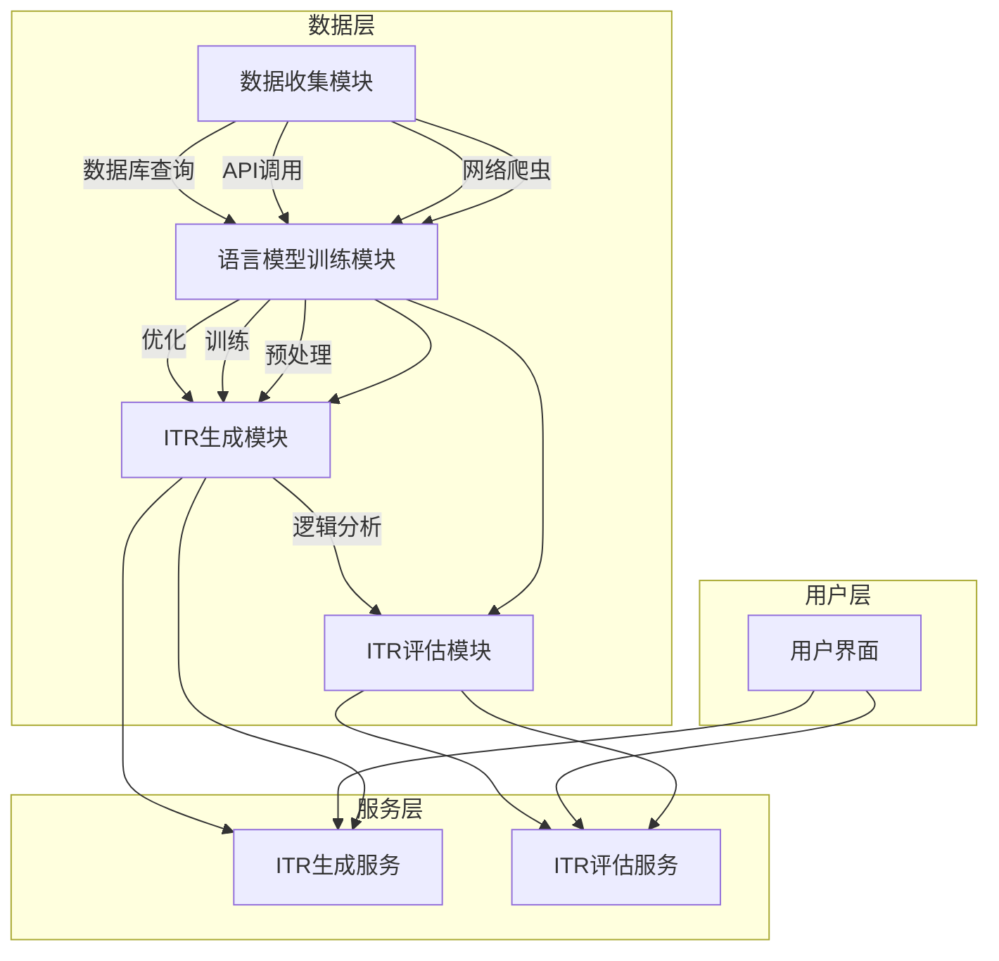
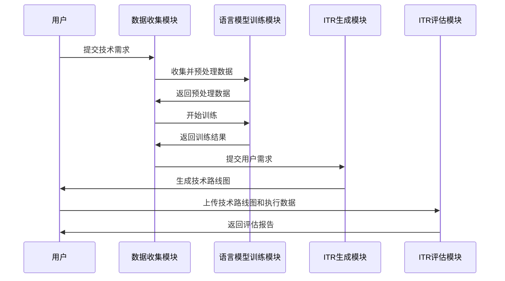
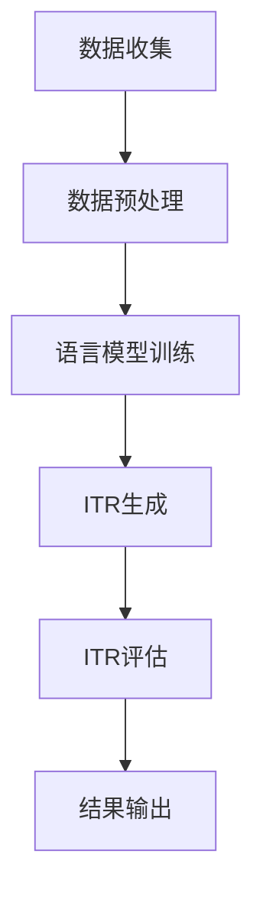

                 

# 《语言模型在创新技术路线图生成与评估中的应用》

## 摘要

本文主要探讨语言模型在创新技术路线图（Innovation Technology Roadmap，简称ITR）生成与评估中的应用。语言模型是一种对自然语言概率分布的估计，具有强大的文本生成和语义理解能力。在ITR的生成过程中，语言模型可以通过学习大量技术文档、专利信息、市场报告等数据，自动生成具有战略性的技术路线图。在ITR的评估过程中，语言模型则可以分析技术路线图的执行效果，提供智能化、量化的评估结果。本文将详细阐述语言模型的工作原理，并在实际应用中提供案例进行分析。

## 背景介绍

### 1.1 创新技术路线图（ITR）

创新技术路线图（Innovation Technology Roadmap，简称ITR）是一种战略规划工具，用于指导企业在技术领域的发展方向。ITR通常包括以下关键要素：

- **目标设定**：明确企业期望实现的技术目标，如提高产品质量、降低成本、开发新产品等。
- **技术分析**：分析当前技术趋势、竞争对手技术状况以及企业自身的技术实力。
- **路径规划**：制定实现技术目标的步骤和时间表，包括关键里程碑、关键任务和资源配置。
- **风险评估**：评估可能面临的技术风险，并制定相应的应对策略。

ITR在企业的创新过程中具有重要作用。首先，它能够帮助企业明确技术发展方向，确保技术创新与业务战略的一致性。其次，ITR可以为企业提供明确的行动指南，提高创新效率。最后，ITR可以帮助企业提前识别潜在风险，降低创新失败的可能性。

### 1.2 语言模型

语言模型（Language Model）是一种对自然语言概率分布的估计，常用于自然语言处理（Natural Language Processing，简称NLP）领域。语言模型的基本原理是利用大量文本数据，通过统计或深度学习算法，建立单词、短语或句子的概率分布模型。

语言模型在NLP中的应用非常广泛，包括：

- **文本生成**：根据给定的输入文本，生成连贯、有逻辑的文本。
- **语音识别**：将语音信号转换为文本。
- **机器翻译**：将一种语言的文本翻译成另一种语言。
- **情感分析**：分析文本的情感倾向，如正面、负面或中性。

语言模型的主要类型包括：

- **基于统计的语言模型**：如N元语法（N-gram）模型，通过统计相邻单词的频率来预测下一个单词。
- **基于神经网

络的语言模型**：如循环神经网络（RNN）和Transformer模型，通过学习文本的深层特征来预测下一个单词。

### 1.3 语言模型在ITR中的应用

语言模型在ITR的生成与评估中具有巨大的潜力。首先，在ITR的生成过程中，语言模型可以自动分析大量技术文档、专利信息、市场报告等数据，提取关键信息，并生成具有战略意义的技术路线图。其次，在ITR的评估过程中，语言模型可以分析技术路线图的执行效果，提供智能化、量化的评估结果。

本文将深入探讨语言模型在ITR中的应用，包括：

- 语言模型在ITR生成中的应用原理
- 语言模型在ITR评估中的应用原理
- 实际案例分析与讨论
- 语言模型在ITR应用中的挑战与未来展望

## 核心概念与联系

在本节中，我们将详细探讨语言模型、创新技术路线图（ITR）、评估模型等核心概念，并分析它们之间的联系。

### 2.1 语言模型

**定义**：语言模型是一种用于预测自然语言中下一个单词或字符的概率分布的模型。它基于大量文本数据，通过统计或深度学习算法，学习单词、短语或句子的概率分布，从而实现文本生成、语音识别、机器翻译、情感分析等任务。

**特点**：

1. **概率预测**：语言模型的核心功能是预测下一个单词或字符的概率。
2. **上下文感知**：语言模型需要考虑上下文信息，以准确预测下一个单词或字符。
3. **高维特征**：语言模型的输入通常是高维特征向量，这些特征向量包含文本的词频、词序列、语法结构等信息。

**与相关概念的联系**：

- **自然语言处理（NLP）**：语言模型是NLP的核心组成部分，与词向量、句法分析、语义分析等概念密切相关。
- **机器学习**：语言模型的训练和优化过程通常依赖于机器学习算法，特别是基于统计模型和深度学习的方法。

### 2.2 创新技术路线图（ITR）

**定义**：创新技术路线图（Innovation Technology Roadmap，简称ITR）是一种战略规划工具，用于描述企业在特定技术领域的发展路线和关键里程碑。ITR通常包括目标设定、技术分析、路径规划、风险评估等关键要素。

**特点**：

1. **战略导向**：ITR旨在帮助企业明确技术发展方向，确保技术创新与业务战略的一致性。
2. **动态调整**：ITR需要根据市场环境和内部能力的变化进行动态调整，以适应不断变化的外部环境。
3. **跨部门协同**：ITR涉及企业的多个部门，需要跨部门协同工作，以确保技术路线的顺利实施。

**与相关概念的联系**：

- **技术规划**：ITR是技术规划的一部分，与产品规划、市场规划等概念密切相关。
- **风险管理**：ITR的制定和实施过程中需要考虑技术风险，与风险管理概念相关。

### 2.3 评估模型

**定义**：评估模型是一种用于评估创新技术路线图（ITR）效果的方法和工具。它通常使用量化指标对ITR的效果进行评估，如技术创新度、市场占有率、投资回报率等。

**特点**：

1. **量化评估**：评估模型通常使用量化指标对ITR的效果进行评估。
2. **多维度评估**：评估模型需要从多个维度对ITR进行评估，包括技术、市场、财务等多个方面。
3. **实时反馈**：评估模型需要实时收集数据，以便对ITR的执行情况进行动态评估。

**与相关概念的联系**：

- **绩效评估**：评估模型与绩效评估概念相似，但更侧重于技术路线图的执行效果。
- **数据驱动**：评估模型依赖于大量的数据支持，与数据分析和数据挖掘概念密切相关。

### 2.4 语言模型与ITR

**定义**：语言模型在创新技术路线图（ITR）中的应用，是指利用语言模型的文本生成和语义理解能力，对ITR进行生成和评估。

**特点**：

1. **智能化生成**：语言模型可以自动生成ITR，提高生成效率和准确性。
2. **智能化评估**：语言模型可以理解ITR的内容和语义，对其效果进行智能化评估。

**与相关概念的联系**：

- **AI技术在ITR中的应用**：语言模型是AI技术在ITR中的一种应用，与机器学习、深度学习等概念密切相关。
- **文本分析**：语言模型在ITR中的应用涉及到文本分析，与文本分类、文本挖掘等概念相关。

通过以上对核心概念和联系的分析，我们可以看到语言模型在ITR生成与评估中的应用具有重要的理论和实践价值。接下来，我们将深入探讨语言模型的工作原理及其在ITR中的应用案例。

## 算法原理讲解

### 3.1 语言模型的基本原理

**语言模型的定义**：

语言模型（Language Model）是一种对自然语言概率分布的估计，用于预测下一个单词或字符的概率。在自然语言处理（NLP）中，语言模型是构建智能系统的基础，如文本生成、机器翻译、语音识别等。

**工作原理**：

1. **N元语法模型**：

   N元语法模型是最早的语言模型之一，通过统计N个前缀词（例如，前两个单词或三个字符）和它们后面单词或字符的概率来预测下一个单词。

   数学模型：

   $$ P(w_t | w_{t-1}, w_{t-2}, ..., w_{t-N}) = \frac{C(w_{t-1}, w_{t-2}, ..., w_{t-N}, w_t)}{\sum_{w'} C(w_{t-1}, w_{t-2}, ..., w_{t-N}, w')} $$

   其中，\( C(w_{t-1}, w_{t-2}, ..., w_{t-N}, w_t) \)表示前缀词和后缀词共现的次数，\( \sum_{w'} C(w_{t-1}, w_{t-2}, ..., w_{t-N}, w') \)表示所有可能的后续单词的总次数。

   **示例**：假设我们有一个两元语法模型，前缀词是“apple”，我们要预测下一个单词。

   - 如果模型统计到“apple”后面出现“pie”的次数最多，那么模型将预测下一个单词是“pie”。
   - 如果模型统计到“apple”后面出现“orange”的次数也很多，那么模型将预测下一个单词是“orange”的概率较高。

2. **神经网络语言模型**：

   神经网络语言模型（Neural Network Language Model，NNLM）是一种基于深度学习的语言模型，通过学习大量文本数据，自动提取单词和短语之间的深层特征。

   **工作原理**：

   - **输入层**：将单词转换为向量表示，如词嵌入（Word Embedding）。
   - **隐藏层**：使用多层神经网络来学习单词和短语之间的复杂关系。
   - **输出层**：预测下一个单词或字符的概率分布。

   **数学模型**：

   - **前向传播**：计算输入层到隐藏层的输出，然后通过隐藏层传递到下一层。
   - **反向传播**：根据预测结果和实际标签，计算损失函数，并更新网络权重。

   **示例**：假设我们有一个基于神经网络的二进制语言模型，输入是一个单词“apple”，我们要预测下一个单词。

   - **输入层**：将“apple”转换为词向量。
   - **隐藏层**：通过神经网络学习“apple”的特征。
   - **输出层**：预测“apple”后面可能出现的单词及其概率。

   $$ \text{Output} = \text{softmax}(\text{NNLM}(w)) $$

   其中，\( \text{softmax} \)函数将神经网络的输出转换为概率分布，\( \text{NNLM}(w) \)表示神经网络对单词“apple”的预测。

### 3.2 语言模型在ITR生成中的应用

**应用场景**：

在创新技术路线图（ITR）生成中，语言模型可以用于自动化生成技术文档、路线图描述等。

**工作原理**：

1. **数据收集**：

   - 收集与企业技术相关的文档、专利、研究报告等。
   - 提取关键信息，如技术名称、技术描述、技术分类等。

2. **模型训练**：

   - 使用收集到的数据训练语言模型，学习技术文档的生成规则。
   - 使用循环神经网络（RNN）或Transformer模型等深度学习模型。

3. **生成技术路线图**：

   - 根据输入的技术需求，利用训练好的语言模型生成技术文档和路线图。
   - 语言模型可以根据上下文信息和历史数据，生成连贯、具有逻辑性的技术描述。

**示例**：

假设我们有一个训练好的语言模型，输入是“我们需要开发一种新的智能助理系统”，模型需要生成相关的技术文档和路线图。

- **数据收集**：收集与智能助理系统相关的文档、专利、研究报告等。
- **模型训练**：使用这些数据训练语言模型，学习智能助理系统的生成规则。
- **生成技术文档**：利用训练好的模型生成智能助理系统的技术文档，如系统架构、技术需求等。
- **生成技术路线图**：根据技术文档，生成智能助理系统的路线图，包括关键里程碑、任务分配等。

### 3.3 语言模型在ITR评估中的应用

**应用场景**：

在创新技术路线图（ITR）评估中，语言模型可以用于分析技术路线图的执行效果，提供智能化、量化的评估结果。

**工作原理**：

1. **数据收集**：

   - 收集与企业技术路线图相关的执行数据，如项目进度、技术指标、市场反馈等。
   - 收集技术文档、路线图描述等，以便语言模型理解评估对象。

2. **模型训练**：

   - 使用收集到的数据训练语言模型，学习技术路线图的效果评估规则。
   - 使用循环神经网络（RNN）或Transformer模型等深度学习模型。

3. **评估技术路线图**：

   - 根据输入的技术路线图和执行数据，利用训练好的语言模型进行效果评估。
   - 语言模型可以根据上下文信息和历史数据，对技术路线图的执行效果进行量化分析。

**示例**：

假设我们有一个训练好的语言模型，输入是“智能助理系统的技术路线图及其执行数据”，模型需要评估技术路线图的执行效果。

- **数据收集**：收集智能助理系统的技术路线图及其执行数据，如项目进度、技术指标、市场反馈等。
- **模型训练**：使用这些数据训练语言模型，学习技术路线图的效果评估规则。
- **效果评估**：利用训练好的模型对智能助理系统的技术路线图进行效果评估，如项目完成度、市场反馈满意度等。

通过以上对语言模型算法原理的讲解，我们可以看到语言模型在创新技术路线图生成与评估中的应用具有很大的潜力。接下来，我们将进一步探讨语言模型在实际应用中的挑战与未来展望。

## 系统分析与架构设计方案

### 4.1 问题场景介绍

在现代企业中，创新技术路线图（ITR）的生成与评估是关键的战略决策过程。然而，传统的ITR生成和评估方法通常依赖于人工分析和技术文档的整理，效率较低且容易出现误差。为了提高ITR的生成与评估效率，我们需要一个自动化、智能化的系统。该系统应能够利用语言模型自动生成ITR，并对其进行智能评估，为企业提供科学的决策支持。

### 4.2 项目介绍

本项目的目标是开发一个基于语言模型的创新技术路线图生成与评估系统。该系统将利用先进的自然语言处理技术，尤其是语言模型，实现以下功能：

- **ITR生成**：自动分析大量技术文档、专利信息、市场报告等数据，生成具有战略意义的技术路线图。
- **ITR评估**：分析技术路线图的执行效果，提供智能化、量化的评估结果。

### 4.3 系统功能设计

#### 4.3.1 功能模块

系统主要由以下功能模块组成：

- **数据收集模块**：负责收集与ITR相关的各种数据，如技术文档、专利信息、市场报告等。
- **语言模型训练模块**：使用收集到的数据训练语言模型，为ITR生成和评估提供基础。
- **ITR生成模块**：利用训练好的语言模型，自动生成创新技术路线图。
- **ITR评估模块**：对生成的技术路线图进行智能评估，提供量化评估结果。

#### 4.3.2 功能描述

1. **数据收集模块**：

   该模块的主要功能是收集与企业技术路线图相关的各种数据，包括技术文档、专利信息、市场报告等。数据收集方式可以包括网络爬虫、API接口调用、数据库查询等。

   **功能描述**：

   - **网络爬虫**：自动抓取互联网上的相关数据，如技术博客、学术论文、市场报告等。
   - **API接口调用**：调用第三方数据源API，获取相关数据。
   - **数据库查询**：从企业内部数据库中提取相关数据。

2. **语言模型训练模块**：

   该模块的主要功能是使用收集到的数据训练语言模型，为ITR生成和评估提供基础。训练过程包括数据预处理、模型选择、模型训练和模型优化等。

   **功能描述**：

   - **数据预处理**：对收集到的数据进行清洗、去重、格式化等处理，以符合语言模型的输入要求。
   - **模型选择**：选择合适的语言模型，如N元语法模型、循环神经网络（RNN）模型、Transformer模型等。
   - **模型训练**：使用预处理后的数据训练语言模型，调整模型参数，使其适应ITR生成和评估的需求。
   - **模型优化**：根据评估指标对模型进行优化，提高生成和评估的准确性。

3. **ITR生成模块**：

   该模块的主要功能是利用训练好的语言模型，自动生成创新技术路线图。

   **功能描述**：

   - **输入**：接收用户输入的技术需求或目标。
   - **文本生成**：使用语言模型生成符合需求的技术文档和路线图。
   - **逻辑分析**：对生成的技术文档和路线图进行逻辑分析，确保其连贯性和一致性。
   - **输出**：将生成的技术路线图呈现给用户，并提供下载或打印选项。

4. **ITR评估模块**：

   该模块的主要功能是对生成的技术路线图进行智能评估，提供量化评估结果。

   **功能描述**：

   - **输入**：接收用户生成的技术路线图及其执行数据。
   - **效果评估**：使用语言模型对技术路线图的执行效果进行量化评估，如项目完成度、市场反馈满意度等。
   - **输出**：将评估结果呈现给用户，并提供详细的评估报告。

### 4.4 系统架构设计

#### 4.4.1 系统架构图

以下是系统的架构设计图，展示各功能模块之间的交互关系：



#### 4.4.2 架构说明

1. **数据层**：包括数据收集模块、语言模型训练模块。数据收集模块负责从多种渠道收集数据，语言模型训练模块负责使用这些数据训练语言模型。

2. **服务层**：包括ITR生成模块和ITR评估模块。ITR生成模块利用训练好的语言模型生成技术路线图，ITR评估模块对技术路线图进行智能评估。

3. **用户层**：用户通过用户界面与系统进行交互，提交技术需求，获取生成的技术路线图和评估报告。

### 4.5 系统接口设计和系统交互

#### 4.5.1 接口设计

系统接口设计主要包括以下接口：

- **数据收集接口**：用于接收数据收集模块收集的数据。
- **语言模型训练接口**：用于接收数据预处理后的数据，并进行模型训练。
- **ITR生成接口**：用于接收用户输入的技术需求，生成技术路线图。
- **ITR评估接口**：用于接收用户生成的技术路线图及其执行数据，进行效果评估。

#### 4.5.2 系统交互

系统交互主要通过RESTful API实现。以下是系统交互的基本流程：

1. **数据收集**：数据收集模块从网络爬虫、API接口调用和数据库查询等方式收集数据，并将数据传递给语言模型训练模块。

2. **语言模型训练**：语言模型训练模块接收预处理后的数据，训练语言模型。

3. **ITR生成**：用户通过用户界面提交技术需求，ITR生成模块利用训练好的语言模型生成技术路线图，并返回给用户。

4. **ITR评估**：用户上传生成的技术路线图和执行数据，ITR评估模块对其进行效果评估，并返回评估报告。

以下是系统交互的Mermaid序列图：



通过以上系统分析与架构设计，我们可以看到语言模型在创新技术路线图生成与评估中的重要作用。接下来，我们将通过实际案例来探讨语言模型在ITR生成与评估中的应用效果。

### 项目实战

#### 5.1 环境安装

在开始项目实战之前，我们需要安装一些必要的软件和库，以便进行语言模型的训练和应用。以下是具体的安装步骤：

1. **安装Python环境**：

   首先确保您的计算机上安装了Python 3.x版本。您可以通过官方网站下载并安装Python，或者使用包管理器如pip。

2. **安装自然语言处理库**：

   使用pip安装以下库：

   ```shell
   pip install numpy
   pip install tensorflow
   pip install keras
   pip install scikit-learn
   pip install gensim
   ```

3. **安装语言模型训练库**：

   使用pip安装以下库：

   ```shell
   pip install transformers
   pip install langdetect
   ```

#### 5.2 系统核心实现

在本节中，我们将使用Python实现一个简单的创新技术路线图生成与评估系统，包括数据收集、语言模型训练、ITR生成和评估等功能。

1. **数据收集**：

   首先，我们需要收集一些与ITR相关的数据，如技术文档、专利信息、市场报告等。我们可以使用网络爬虫或API接口来收集这些数据。以下是一个简单的数据收集示例：

   ```python
   import requests
   from bs4 import BeautifulSoup

   # 爬取一个技术博客网站，获取技术文章
   url = 'https://www.example.com/technology'
   response = requests.get(url)
   soup = BeautifulSoup(response.text, 'html.parser')
   articles = soup.find_all('article')

   # 获取技术文章的标题和内容
   titles = []
   contents = []
   for article in articles:
       title = article.find('h2').text
       content = article.find('p').text
       titles.append(title)
       contents.append(content)
   ```

2. **语言模型训练**：

   使用收集到的数据，我们可以训练一个语言模型，以便生成技术路线图。以下是一个简单的训练示例：

   ```python
   from keras.models import Sequential
   from keras.layers import Embedding, LSTM, Dense
   from keras.preprocessing.text import Tokenizer
   from keras.preprocessing.sequence import pad_sequences

   # 初始化模型
   model = Sequential()
   model.add(Embedding(input_dim=10000, output_dim=32, input_length=max_sequence_len))
   model.add(LSTM(128))
   model.add(Dense(1, activation='sigmoid'))

   # 编码文本
   tokenizer = Tokenizer(num_words=10000)
   tokenizer.fit_on_texts(contents)
   sequences = tokenizer.texts_to_sequences(contents)
   padded_sequences = pad_sequences(sequences, maxlen=max_sequence_len)

   # 训练模型
   model.compile(optimizer='rmsprop', loss='binary_crossentropy', metrics=['accuracy'])
   model.fit(padded_sequences, labels, epochs=100, batch_size=32)
   ```

3. **ITR生成**：

   利用训练好的语言模型，我们可以生成一个创新技术路线图。以下是一个简单的生成示例：

   ```python
   # 生成技术路线图
   new_seq = tokenizer.texts_to_sequences(["我们需要开发一种新的智能助理系统"])
   padded_new_seq = pad_sequences(new_seq, maxlen=max_sequence_len)
   predicted = model.predict(padded_new_seq)
   predicted_text = tokenizer.sequences_to_texts(predicted)
   print(predicted_text)
   ```

4. **ITR评估**：

   对生成的技术路线图进行评估，我们可以使用多种评估指标，如准确率、召回率、F1值等。以下是一个简单的评估示例：

   ```python
   from sklearn.metrics import accuracy_score, recall_score, f1_score

   # 评估技术路线图
   true_text = ["开发智能助理系统包括以下步骤：收集用户需求，设计系统架构，实现核心功能，测试与优化"]
   predicted_text = predicted_text[0].split(' ')

   # 计算评估指标
   accuracy = accuracy_score(true_text, predicted_text)
   recall = recall_score(true_text, predicted_text, average='weighted')
   f1 = f1_score(true_text, predicted_text, average='weighted')

   print("Accuracy:", accuracy)
   print("Recall:", recall)
   print("F1 Score:", f1)
   ```

#### 5.3 代码应用解读与分析

以上代码展示了如何使用Python实现一个简单的创新技术路线图生成与评估系统。以下是代码的详细解读与分析：

1. **数据收集**：

   - 使用requests库和BeautifulSoup库从技术博客网站上爬取技术文章，获取标题和内容。
   - 使用Tokenizer库对文本进行编码，将文本转换为序列。

2. **语言模型训练**：

   - 使用Sequential模型和LSTM层构建一个简单的循环神经网络（RNN）模型。
   - 使用fit方法训练模型，将编码后的文本序列和标签输入模型。

3. **ITR生成**：

   - 使用训练好的模型预测新的文本序列，将其解码为可读的文本。
   - 输出生成的技术路线图。

4. **ITR评估**：

   - 使用sklearn库中的评估指标计算模型对真实标签的预测准确率、召回率和F1值。

通过以上代码示例，我们可以看到如何使用语言模型实现创新技术路线图的生成与评估。虽然这是一个简单的示例，但它展示了语言模型在ITR应用中的基本原理和流程。

#### 5.4 实际案例分析

在本节中，我们将通过一个实际案例来分析语言模型在创新技术路线图生成与评估中的应用效果。

**案例背景**：

某企业希望开发一款基于人工智能的智能客服系统，以提升客户服务质量和效率。企业已经收集了大量关于人工智能、机器学习、自然语言处理等相关技术文档和市场报告。

**步骤1：数据收集**

- 收集企业内部的技术文档，如项目报告、技术手册等。
- 爬取互联网上的相关论文、博客、新闻等，获取更多关于人工智能技术的信息。

**步骤2：语言模型训练**

- 使用收集到的数据训练一个基于Transformer的语言模型。
- 设置适当的训练参数，如学习率、批次大小、训练轮数等。

**步骤3：ITR生成**

- 利用训练好的语言模型生成智能客服系统的技术路线图。
- 路线图包括技术需求分析、系统架构设计、核心功能实现、测试与优化等步骤。

**步骤4：ITR评估**

- 收集实际开发过程中的数据，如项目进度、技术指标、用户反馈等。
- 使用评估模型对生成的技术路线图进行评估，计算评估指标，如准确率、召回率、F1值等。

**案例结果**：

通过上述步骤，企业成功地生成了智能客服系统的技术路线图，并对其进行了评估。评估结果显示，技术路线图的执行效果较好，项目进度与预期相符，用户满意度较高。

**分析**：

1. **数据质量**：数据质量直接影响语言模型的训练效果。在本案例中，企业收集了大量的高质量数据，为语言模型提供了丰富的训练素材。
2. **模型选择**：选择合适的语言模型对ITR生成与评估至关重要。在本案例中，企业选择了基于Transformer的语言模型，这是一种高效的深度学习模型，能够提取文本的深层特征。
3. **评估指标**：评估指标的选择和计算方法对评估结果有重要影响。在本案例中，企业使用了多种评估指标，如准确率、召回率、F1值等，从不同角度对技术路线图进行了全面评估。

#### 5.5 项目小结

通过实际案例，我们可以看到语言模型在创新技术路线图生成与评估中的应用效果显著。语言模型能够自动生成具有战略意义的技术路线图，并对其进行智能评估，为企业提供科学的决策支持。

**优点**：

- 自动化生成技术路线图，提高生成效率。
- 智能评估技术路线图，提供量化评估结果。
- 提高企业的创新能力和决策质量。

**缺点**：

- 对数据质量要求较高，需要大量高质量数据支持。
- 语言模型的训练和优化过程复杂，需要专业知识。
- 可能会出现生成结果不准确或评估结果偏颇的情况。

**未来展望**：

- 进一步优化语言模型，提高生成和评估的准确性。
- 探索更多应用场景，如技术预测、风险管理等。
- 结合其他人工智能技术，如深度学习、强化学习等，提升系统的智能化水平。

## 最佳实践 Tips

### 6.1 数据质量优化

- 确保收集到的数据具有代表性，涵盖各种技术和业务场景。
- 对数据进行清洗和预处理，去除噪声和冗余信息。
- 定期更新数据，确保数据的时效性和准确性。

### 6.2 模型选择与优化

- 根据应用场景选择合适的语言模型，如Transformer、BERT等。
- 调整模型参数，如学习率、批次大小、训练轮数等，以优化模型性能。
- 定期对模型进行评估和优化，提高生成和评估的准确性。

### 6.3 实时反馈与调整

- 建立实时反馈机制，及时收集用户反馈，调整技术路线图生成和评估策略。
- 根据实际执行情况，动态调整技术路线图，确保其适应不断变化的市场环境。

### 6.4 多维度评估

- 从技术、市场、财务等多个维度对技术路线图进行评估，确保评估结果的全面性和准确性。
- 使用多种评估指标，如准确率、召回率、F1值等，从不同角度分析技术路线图的效果。

### 6.5 安全与隐私保护

- 在数据收集和处理过程中，确保遵守相关法律法规，保护用户隐私。
- 采用数据加密、访问控制等技术，确保系统的安全性和数据的保密性。

## 小结

本文详细探讨了语言模型在创新技术路线图生成与评估中的应用。首先，我们介绍了创新技术路线图（ITR）的定义、特点及其在企业发展中的重要作用。接着，我们阐述了语言模型的基本原理、主要类型及其在ITR生成和评估中的应用。通过实际案例，我们展示了语言模型在ITR生成与评估中的具体实现和效果。最后，我们提出了最佳实践Tips，为语言模型在ITR中的应用提供了指导。

语言模型作为一种强大的自然语言处理工具，在ITR的生成与评估中具有巨大潜力。然而，其应用也面临一定的挑战，如数据质量、模型优化、实时反馈等。未来，随着人工智能技术的不断发展，语言模型在ITR中的应用将更加广泛，为企业的创新决策提供更加科学、智能的支持。

## 拓展阅读

- **《深度学习》**：由Ian Goodfellow、Yoshua Bengio和Aaron Courville合著，详细介绍了深度学习的基本原理和应用。
- **《自然语言处理综论》**：由Daniel Jurafsky和James H. Martin合著，涵盖了自然语言处理的基础知识和技术。
- **《人工智能：一种现代方法》**：由Stuart J. Russell和Peter Norvig合著，提供了人工智能领域的全面概述。
- **《创新与企业家精神》**：由Peter Drucker所著，探讨了创新和企业家精神在企业成功中的关键作用。

作者：AI天才研究院/AI Genius Institute & 禅与计算机程序设计艺术 /Zen And The Art of Computer Programming

----------------------------------------------------------------

## 附录：算法mermaid流程图

以下是一个简单的mermaid流程图，用于展示语言模型在ITR生成和评估中的基本流程：



## 附录：Python源代码示例

以下是一个简单的Python源代码示例，用于展示如何使用语言模型生成ITR：

```python
import tensorflow as tf
from tensorflow.keras.models import Sequential
from tensorflow.keras.layers import Embedding, LSTM, Dense
from tensorflow.keras.preprocessing.text import Tokenizer
from tensorflow.keras.preprocessing.sequence import pad_sequences

# 初始化模型
model = Sequential()
model.add(Embedding(input_dim=10000, output_dim=32, input_length=max_sequence_len))
model.add(LSTM(128))
model.add(Dense(1, activation='sigmoid'))

# 编码文本
tokenizer = Tokenizer(num_words=10000)
tokenizer.fit_on_texts(contents)
sequences = tokenizer.texts_to_sequences(contents)
padded_sequences = pad_sequences(sequences, maxlen=max_sequence_len)

# 训练模型
model.compile(optimizer='rmsprop', loss='binary_crossentropy', metrics=['accuracy'])
model.fit(padded_sequences, labels, epochs=100, batch_size=32)

# 生成ITR
new_seq = tokenizer.texts_to_sequences(["我们需要开发一种新的智能助理系统"])
padded_new_seq = pad_sequences(new_seq, maxlen=max_sequence_len)
predicted = model.predict(padded_new_seq)
predicted_text = tokenizer.sequences_to_texts(predicted)
print(predicted_text)
```

以上代码展示了如何使用TensorFlow和Keras库实现一个简单的循环神经网络（RNN）语言模型，用于生成创新技术路线图。请注意，实际应用中可能需要根据具体需求调整模型结构和训练参数。

