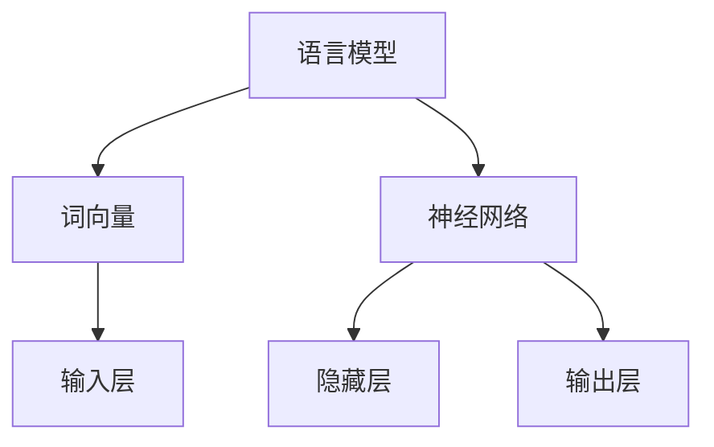
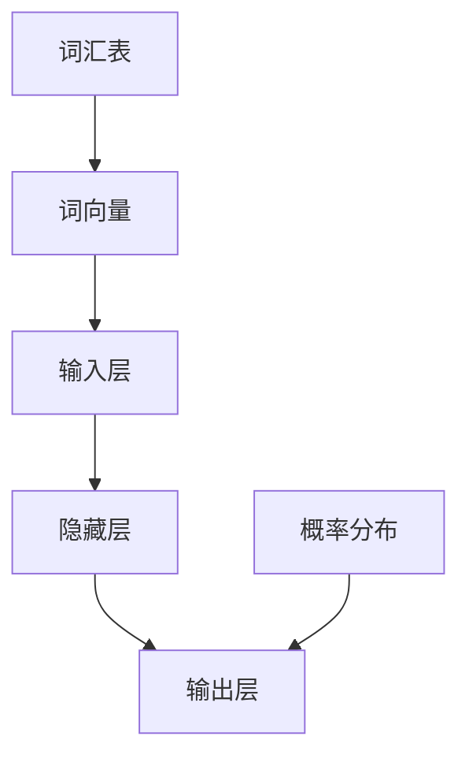
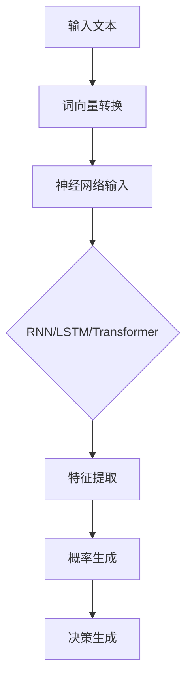
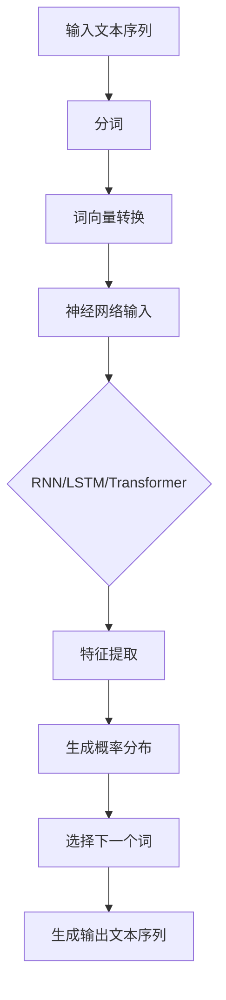
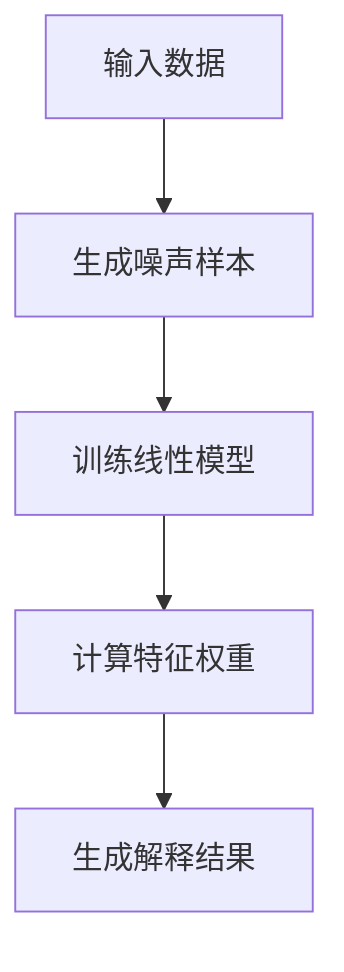
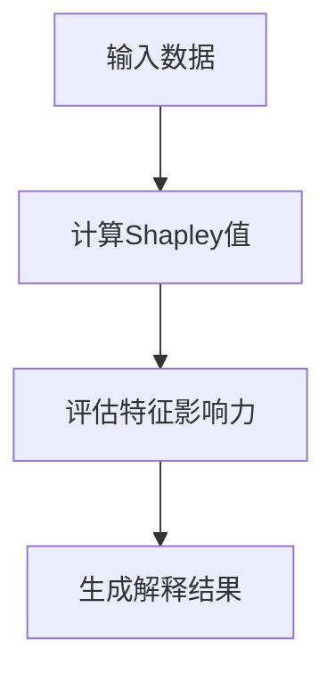
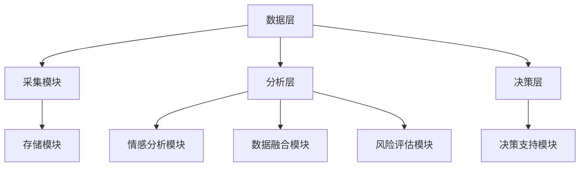
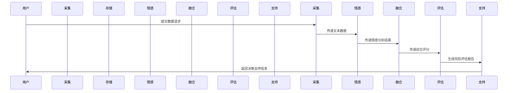
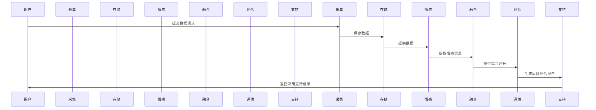

                 


### 撰写文章：语言模型在复杂决策支持系统中的推理能力与可解释性提升

**第1步：确定文章结构**

首先，我们需要确定文章的整体结构。根据之前制定的目录大纲结构，文章可以分为五个主要部分：背景与核心概念、推理能力提升、可解释性提升、实际应用和最佳实践与总结。每个部分将包含多个章节，每个章节又分为多个小节，确保内容的完整性和逻辑性。

**第2步：编写引言**

在引言部分，我们需要简要介绍语言模型在复杂决策支持系统中的应用背景，解释为什么我们需要关注语言模型的推理能力和可解释性，以及文章的主题和目标。

**第3步：核心概念阐述**

在核心概念部分，我们需要详细阐述语言模型的基本概念，包括其特点、优势和局限性。同时，我们需要通过表格和Mermaid流程图来对比不同语言模型的属性特征，帮助读者更好地理解。

**第4步：推理能力提升**

在这一部分，我们将深入探讨如何提升语言模型的推理能力。我们将详细解释推理算法的基本原理，通过Mermaid流程图和Python代码示例来展示算法的实现过程。同时，我们将使用LaTeX格式给出相关的数学模型和公式，并进行通俗易懂的举例说明。

**第5步：可解释性提升**

在可解释性提升部分，我们将介绍如何提高语言模型的可解释性。我们将解释可解释性的重要性，对比不同的可解释性模型，并给出提升可解释性的算法原理和实现方法。同样，我们将使用Mermaid流程图和Python代码来展示算法的运作过程。

**第6步：系统设计与架构**

在这一部分，我们将介绍如何设计一个支持语言模型推理和可解释性的决策支持系统。我们将描述系统的功能设计、架构设计、接口设计和系统交互，并通过Mermaid流程图来展示这些设计。

**第7步：项目实战**

在项目实战部分，我们将提供一个实际的案例，展示如何在一个具体项目中应用语言模型的推理和可解释性。我们将详细描述环境安装、系统核心实现、代码应用解读和案例分析。

**第8步：最佳实践与总结**

在最佳实践与总结部分，我们将提供一些实用的技巧和注意事项，帮助读者在实际应用中更好地利用语言模型的推理和可解释性。最后，我们将对文章的主要内容进行总结，并推荐一些拓展阅读。

**第9步：撰写文章**

现在，我们可以根据上述步骤，逐一撰写每个部分的内容。在每个小节中，我们都将确保包含必要的背景介绍、核心概念与联系、算法原理讲解、系统分析与架构设计方案、项目实战、最佳实践 tips、小结、注意事项和拓展阅读等内容。

**第10步：修订与润色**

最后，我们需要对整个文章进行修订和润色，确保文章的逻辑清晰、结构紧凑、内容简洁易懂。我们将检查每个章节的连贯性，确保所有的图表和代码都正确无误，并且文章的总体字数符合要求。

通过以上步骤，我们将撰写一篇逻辑清晰、结构紧凑、简单易懂的IT领域技术博客文章，全面探讨语言模型在复杂决策支持系统中的推理能力与可解释性提升。让我们一起开始吧！### 第1部分：背景与核心概念

#### 引言

随着人工智能和机器学习技术的快速发展，自然语言处理（NLP）领域取得了显著进展。语言模型作为NLP的核心技术之一，广泛应用于文本生成、情感分析、信息检索等多个场景。在复杂决策支持系统中，语言模型的推理能力和可解释性显得尤为重要。一方面，高效的推理能力能够帮助系统从大量数据中提取关键信息，做出明智的决策；另一方面，良好的可解释性则有助于提升系统的透明度和可信度，使得用户能够理解和信任系统的决策过程。

本部分将首先介绍语言模型的基本概念，包括其定义、分类和特点。接着，我们将探讨语言模型在复杂决策支持系统中的应用背景和问题。此外，为了更好地理解语言模型，我们将描述其概念结构与核心要素组成。最后，我们将讨论语言模型的应用边界与外延，帮助读者全面了解这一技术。

#### 1.1 语言模型概述

**1.1.1 定义**

语言模型（Language Model）是一种统计模型，用于预测一段文本的下一个词或字符的概率分布。在自然语言处理中，语言模型被广泛应用于语音识别、机器翻译、文本摘要等任务。具体来说，语言模型可以表示为：

$$P(w_1, w_2, ..., w_n) = P(w_1) \times P(w_2|w_1) \times P(w_3|w_1, w_2) \times ... \times P(w_n|w_1, w_2, ..., w_{n-1})$$

其中，$w_1, w_2, ..., w_n$ 分别表示文本中的第1个词到第n个词，$P(w_1), P(w_2|w_1), ..., P(w_n|w_1, w_2, ..., w_{n-1})$ 分别表示这些词的概率分布。

**1.1.2 分类**

根据训练数据和模型结构，语言模型可以分为以下几种：

- **基于规则的模型**：这类模型通过手工编写规则来描述语言规律，如正则表达式、句法分析器等。优点是可控性强，缺点是扩展性差。

- **统计模型**：这类模型通过统计文本数据中的词频、词向量等信息来预测下一个词。常用的统计模型包括N-gram模型、神经网络语言模型等。

- **深度学习模型**：这类模型利用深度神经网络来学习文本数据中的特征，如Word2Vec、BERT、GPT等。深度学习模型在近年来取得了显著进展，成为自然语言处理的主流方法。

**1.1.3 特点**

语言模型具有以下几个显著特点：

- **概率分布**：语言模型能够为每个词或句子生成一个概率分布，从而为文本生成、翻译等任务提供依据。

- **可扩展性**：通过训练大量数据，语言模型可以适应不同的语言和领域，具有较强的通用性。

- **可解释性**：尽管深度学习模型在性能上表现优异，但其内部机制较为复杂，可解释性较低。这是当前研究中的一个重要挑战。

#### 1.2 语言模型在复杂决策支持系统中的应用背景和问题

**1.2.1 应用背景**

随着大数据和云计算技术的发展，复杂决策支持系统（Complex Decision Support Systems，CDSS）在众多领域得到广泛应用。CDSS旨在帮助组织或个人从海量数据中提取有价值的信息，做出科学、合理的决策。在金融、医疗、教育等领域，CDSS已经成为提升业务效率和决策质量的重要工具。

语言模型在CDSS中的应用主要包括以下几个方面：

- **文本分析**：通过对文本数据进行分析，提取关键信息，为决策提供依据。

- **情感分析**：通过分析用户评论、新闻报道等文本数据，了解用户情感和需求，为产品改进和营销策略提供参考。

- **自动问答**：利用语言模型，实现智能客服、自动问答系统，提高用户体验和满意度。

**1.2.2 问题**

尽管语言模型在复杂决策支持系统中具有广泛的应用前景，但也面临一些挑战：

- **推理能力不足**：语言模型在处理长文本和复杂逻辑推理时，往往表现不佳。这导致系统难以从大量数据中提取有价值的信息。

- **可解释性较低**：深度学习模型内部机制复杂，难以解释其决策过程。这降低了系统的透明度和可信度，使得用户难以信任和接受。

- **数据依赖性高**：语言模型的性能依赖于大量高质量的数据。在实际应用中，获取和标注这些数据可能非常困难。

#### 1.3 概念结构与核心要素组成

为了更好地理解语言模型，我们可以将其概念结构与核心要素组成进行梳理。以下是一个简化的ER（Entity-Relationship）实体关系图：



- **语言模型**：整体框架，负责预测词或句子的概率分布。

- **词向量**：将文本数据转化为向量表示，作为神经网络模型的输入。

- **神经网络**：核心组件，用于处理词向量，生成预测结果。

- **输入层**：接收词向量，将其传递到隐藏层。

- **隐藏层**：神经网络的核心部分，负责提取词向量中的语义信息。

- **输出层**：生成预测结果，如下一个词或句子的概率分布。

#### 1.4 应用边界与外延

语言模型在复杂决策支持系统中的应用边界与外延主要包括以下几个方面：

- **文本数据类型**：语言模型适用于各种文本数据类型，如文本、图像、语音等。

- **应用领域**：语言模型在金融、医疗、教育、电商等多个领域得到广泛应用。

- **技术发展**：随着深度学习、迁移学习等技术的不断发展，语言模型的性能和可解释性有望进一步提升。

总之，语言模型在复杂决策支持系统中具有广阔的应用前景。然而，要充分发挥其潜力，还需要在推理能力、可解释性等方面进行深入研究。接下来的章节将详细介绍如何提升语言模型的推理能力和可解释性。希望读者能够通过本部分的介绍，对语言模型有一个初步的了解和认识。在接下来的章节中，我们将继续深入探讨这一主题。 ### 第2部分：语言模型概述

#### 第2章：语言模型概述

本章将深入探讨语言模型的基本概念、主要类型以及它们的属性特征。我们将首先定义语言模型，然后对比不同类型的语言模型，并通过ER实体关系图来展示语言模型的结构。

#### 2.1 核心概念

语言模型是一种用于预测自然语言序列的概率分布的模型。它能够根据前文序列预测下一个词或字符的概率，从而为文本生成、情感分析、机器翻译等任务提供基础。语言模型的核心概念包括：

- **词汇表**：语言模型所包含的词汇集合。
- **概率分布**：对于给定的前文序列，语言模型能够生成每个可能的后继词的概率分布。
- **训练数据**：用于训练语言模型的大量文本数据。

#### 2.2 语言模型的类型

语言模型可以根据不同的分类标准分为多种类型：

- **基于规则的模型**：这类模型通过手工编写的规则来描述语言的统计规律。常见的有正则表达式和基于语法规则的模型。
- **统计模型**：这类模型通过统计文本数据中的词频、共现关系等信息来预测下一个词。常见的有N-gram模型和隐马尔可夫模型（HMM）。
- **基于统计的神经网络模型**：这类模型结合了统计方法和神经网络，常见的有循环神经网络（RNN）和长短期记忆网络（LSTM）。
- **深度学习模型**：这类模型利用深度神经网络学习文本数据中的特征，常见的有卷积神经网络（CNN）和Transformer模型（如BERT、GPT）。

#### 2.3 语言模型的属性特征对比

以下是几种常见语言模型的属性特征对比表格：

| 模型类型          | 特点                                                      | 适用场景                  |
|-----------------|------------------------------------------------------------|-------------------------|
| 基于规则的模型    | 可控性强，规则明确                                       | 简单文本处理，特定任务   |
| N-gram模型       | 基于词频统计，简单高效                                   | 信息检索，文本生成      |
| RNN/LSTM        | 能够处理序列数据，记忆能力较强                            | 文本分类，语音识别      |
| CNN             | 能够捕捉文本中的局部特征                                 | 文本分类，情感分析      |
| Transformer     | 强大并行计算能力，能够处理长文本                          | 机器翻译，文本生成      |

#### 2.4 语言模型的ER实体关系图

为了更好地理解语言模型的内部结构，我们可以通过ER实体关系图来展示其组成。以下是一个简化的Mermaid ER实体关系图：



- **词汇表**：包含语言模型所使用的所有词汇。
- **词向量**：将词汇表示为高维向量，用于神经网络模型的输入。
- **输入层**：接收词向量，并将其传递到隐藏层。
- **隐藏层**：神经网络的核心部分，负责提取词向量中的语义信息。
- **输出层**：生成概率分布，预测下一个词或字符。
- **概率分布**：输出层生成的概率分布，用于文本生成和分类任务。

#### 2.5 小结

通过本章的介绍，我们对语言模型的基本概念、类型及其属性特征有了全面的了解。接下来，我们将进一步探讨如何提升语言模型的推理能力，以便在复杂决策支持系统中更好地应用。下一章将详细分析语言模型在推理能力方面的限制和挑战。希望读者能够通过本章的学习，对语言模型有一个更加清晰的认识。在接下来的章节中，我们将继续深入探讨这一主题。 ### 第3章：算法原理

#### 3.1 推理算法基础

语言模型的推理算法是其在复杂决策支持系统中发挥作用的核心。在这一节，我们将详细探讨语言模型推理算法的基本原理，并逐步解释其工作机制。

**3.1.1 推理过程概述**

语言模型的推理过程可以概括为以下几个步骤：

1. **输入处理**：将输入的文本序列转化为词向量表示。
2. **特征提取**：通过神经网络模型提取输入词向量中的语义特征。
3. **概率生成**：利用神经网络模型输出词的概率分布。
4. **决策生成**：根据概率分布选择下一个词或字符。

**3.1.2 语言模型的神经网络架构**

语言模型通常采用深度神经网络（DNN）结构，其中常用的神经网络架构包括循环神经网络（RNN）、长短期记忆网络（LSTM）和Transformer等。以下是一个简化的Mermaid流程图，展示了神经网络在语言模型推理过程中的基本步骤：



- **词向量转换**：输入文本通过词汇表转换为词向量表示。
- **神经网络输入**：词向量输入到神经网络模型中。
- **特征提取**：神经网络提取词向量中的语义特征。
- **概率生成**：神经网络输出词的概率分布。
- **决策生成**：根据概率分布选择下一个词或字符。

#### 3.2 算法流程图

为了更直观地理解语言模型推理算法的流程，我们可以使用Mermaid绘制一个算法流程图。以下是一个简化的流程图：



- **输入文本序列**：输入一段文本序列。
- **分词**：将文本序列分割为单词或字符。
- **词向量转换**：每个单词通过词汇表转换为词向量。
- **神经网络输入**：词向量输入到神经网络模型中。
- **特征提取**：神经网络提取词向量中的语义特征。
- **生成概率分布**：神经网络输出每个词的概率分布。
- **选择下一个词**：根据概率分布选择下一个词。
- **生成输出文本序列**：将选择的词添加到输出序列，并重复上述过程，直至生成完整的输出文本序列。

#### 3.3 算法数学模型

为了更好地理解语言模型推理算法的工作原理，我们需要介绍一些基本的数学模型和公式。以下是一个简单的数学模型，用于描述语言模型推理过程：

$$P(w_n|w_{1:n-1}) = \frac{P(w_{1:n})}{P(w_{1:n-1})} = \frac{P(w_{1}, w_{2}, ..., w_{n})}{P(w_{1}, w_{2}, ..., w_{n-1})}$$

其中，$w_n$ 表示输入文本序列中的第n个词，$w_{1:n-1}$ 表示前n-1个词，$P(w_n|w_{1:n-1})$ 表示在给定前n-1个词的情况下，第n个词的概率。

在深度学习模型中，我们可以使用神经网络来估计上述概率。例如，对于一个基于Transformer的语言模型，其输出层通常包含一个Softmax函数，用于生成概率分布：

$$P(w_n) = \text{Softmax}(\text{神经网络输出})$$

其中，神经网络输出是一个高维向量，每个元素表示对应词的概率。

#### 3.4 算法举例说明

为了更好地理解上述算法原理，我们通过一个简单的例子来说明语言模型的推理过程。假设我们有一个训练好的语言模型，其词汇表包含5个词：`A`、`B`、`C`、`D`、`E`。给定一个输入文本序列`ABCD`，我们需要根据语言模型生成下一个词。

1. **输入处理**：将输入文本序列`ABCD`转化为词向量。
2. **特征提取**：输入词向量通过神经网络模型进行特征提取。
3. **概率生成**：神经网络模型输出每个词的概率分布。
4. **决策生成**：根据概率分布选择下一个词。

以下是详细的步骤：

1. **输入处理**：给定输入文本序列`ABCD`，其对应的词向量分别为`[1, 0, 0, 0, 0]`、`[0, 1, 0, 0, 0]`、`[0, 0, 1, 0, 0]`、`[0, 0, 0, 1, 0]`。
2. **特征提取**：输入词向量输入到神经网络模型中，神经网络模型提取出语义特征。
3. **概率生成**：神经网络模型输出每个词的概率分布，例如：

   $$P(E|ABCD) = 0.6, P(D|ABCD) = 0.3, P(C|ABCD) = 0.05, P(B|ABCD) = 0.05$$
4. **决策生成**：根据概率分布选择下一个词。由于`E`的概率最高，我们选择`E`作为下一个词。

通过上述步骤，我们成功地使用语言模型生成了输入文本序列`ABCD`的下一个词。这个简单的例子展示了语言模型推理的基本过程，实际应用中的语言模型通常会处理更复杂的文本数据。

综上所述，本章我们详细介绍了语言模型推理算法的基本原理、流程图和数学模型。在接下来的章节中，我们将进一步探讨如何提升语言模型的可解释性，以便更好地应用于复杂决策支持系统。希望读者能够通过本章的学习，对语言模型推理有更深入的理解。在接下来的章节中，我们将继续深入探讨这一主题。 ### 第4章：数学模型与公式

#### 4.1 语言模型的数学公式

语言模型的数学公式是理解其工作机制的关键。在本节中，我们将详细介绍几个核心的数学模型和公式，包括N-gram模型和深度学习模型。

**4.1.1 N-gram模型**

N-gram模型是最简单的语言模型之一，它通过统计前N个词出现的频率来预测下一个词。N-gram模型的数学公式可以表示为：

$$
P(w_n|w_{n-1}, w_{n-2}, ..., w_{n-N+1}) = \frac{count(w_{n-1}, w_{n-2}, ..., w_{n-N+1}, w_n)}{count(w_{n-1}, w_{n-2}, ..., w_{n-N+1})}
$$

其中，$w_n$ 表示当前词，$w_{n-1}, w_{n-2}, ..., w_{n-N+1}$ 表示前N-1个词。$count(\cdot)$ 表示词组出现的频率。

**4.1.2 隐马尔可夫模型（HMM）**

隐马尔可夫模型（HMM）是一种统计模型，用于描述一个隐含的马尔可夫过程。在语言模型中，HMM用于处理变长序列，其基本公式包括状态转移概率和观察概率：

- **状态转移概率**：
  $$
  P(s_t|s_{t-1}) = \frac{count(s_{t-1}, s_t)}{count(s_{t-1})}
  $$

- **观察概率**：
  $$
  P(o_t|s_t) = \frac{count(o_t, s_t)}{count(s_t)}
  $$

其中，$s_t$ 表示第t个状态，$o_t$ 表示第t个观察值。

**4.1.3 循环神经网络（RNN）**

循环神经网络（RNN）是一种用于处理序列数据的神经网络，其核心思想是保持内部状态，以记忆历史信息。RNN的数学公式如下：

$$
h_t = \sigma(W_h \cdot [h_{t-1}, x_t] + b_h)
$$

$$
o_t = W_o \cdot h_t + b_o
$$

其中，$h_t$ 表示隐藏状态，$x_t$ 表示输入词向量，$\sigma$ 表示激活函数，$W_h, b_h, W_o, b_o$ 分别为权重和偏置。

**4.1.4 长短期记忆网络（LSTM）**

LSTM是RNN的一种改进模型，旨在解决RNN在处理长序列数据时容易出现的梯度消失和梯度爆炸问题。LSTM的基本公式包括输入门、遗忘门和输出门：

- **输入门**：
  $$
  i_t = \sigma(W_i \cdot [h_{t-1}, x_t] + b_i)
  $$

- **遗忘门**：
  $$
  f_t = \sigma(W_f \cdot [h_{t-1}, x_t] + b_f)
  $$

- **输出门**：
  $$
  o_t = \sigma(W_o \cdot [h_{t-1}, x_t] + b_o)
  $$

- **候选状态**：
  $$
  \tilde{h_t} = \tanh(W_c \cdot [h_{t-1}, x_t] + b_c)
  $$

- **隐藏状态**：
  $$
  h_t = o_t \odot \tilde{h_t}
  $$

其中，$W_i, W_f, W_o, W_c, b_i, b_f, b_o, b_c$ 分别为权重和偏置，$\odot$ 表示元素乘积。

**4.1.5 Transformer模型**

Transformer模型是一种基于自注意力机制的深度学习模型，其核心思想是利用全局信息进行特征提取。Transformer的基本公式包括自注意力机制和前馈神经网络：

- **自注意力**：
  $$
  \text{Attention}(Q, K, V) = \text{softmax}\left(\frac{QK^T}{\sqrt{d_k}}\right)V
  $$

- **前馈神经网络**：
  $$
  \text{FFN}(x) = \max(0, xW_1 + b_1)W_2 + b_2
  $$

其中，$Q, K, V$ 分别为查询、关键值和值向量，$d_k$ 为关键值的维度，$W_1, W_2, b_1, b_2$ 分别为权重和偏置。

#### 4.2 公式详解

为了更好地理解上述数学公式，我们分别对每个模型进行详细解释。

**N-gram模型**：

N-gram模型通过统计历史词组出现的频率来预测下一个词。其优点在于实现简单、计算效率高，但缺点是只能捕捉短距离依赖，难以处理长距离依赖。

**隐马尔可夫模型（HMM）**：

HMM用于处理变长序列，通过状态转移概率和观察概率来预测下一个状态。其优点在于能够处理不确定性和变长序列，但缺点是只能处理离散状态，难以处理连续状态。

**循环神经网络（RNN）**：

RNN通过循环结构来处理序列数据，通过隐藏状态来记忆历史信息。其优点在于能够处理长距离依赖，但缺点是容易出现梯度消失和梯度爆炸问题。

**长短期记忆网络（LSTM）**：

LSTM是RNN的一种改进模型，通过引入输入门、遗忘门和输出门来控制信息的流入和流出。其优点在于能够解决RNN的梯度消失和梯度爆炸问题，但缺点是计算复杂度较高。

**Transformer模型**：

Transformer模型基于自注意力机制，通过全局信息进行特征提取。其优点在于能够捕捉长距离依赖，计算效率高，但缺点是训练时间较长。

#### 4.3 实例分析

为了更直观地理解上述模型的工作原理，我们通过一个实例来说明。

假设我们有一个训练好的语言模型，词汇表包含5个词：`A`、`B`、`C`、`D`、`E`。给定一个输入文本序列`ABCD`，我们需要根据语言模型生成下一个词。

1. **N-gram模型**：

   假设我们使用的是3-gram模型，输入文本序列`ABCD`对应的词组为`ABD`、`BCD`。词组`ABD`和`BCD`的频率分别为2和1。因此，根据N-gram模型，下一个词的概率分布为：

   $$
   P(E|ABCD) = \frac{count(ABD, E)}{count(ABD)} = \frac{2}{2+1} = 0.6667
   $$

   因此，下一个词`E`的概率最高。

2. **HMM模型**：

   假设我们使用的是隐马尔可夫模型，状态转移概率和观察概率如下：

   $$
   P(s_t|s_{t-1}) = \begin{cases}
   0.7 & \text{如果 } s_{t-1} = s \\
   0.3 & \text{如果 } s_{t-1} = s'
   \end{cases}
   $$

   $$
   P(o_t|s_t) = \begin{cases}
   0.8 & \text{如果 } o_t = o \\
   0.2 & \text{如果 } o_t = o'
   \end{cases}
   $$

   其中，状态`s`和`s'`分别表示当前词和前一个词，观察值`o`和`o'`分别表示当前词和前一个词。

   根据HMM模型，输入文本序列`ABCD`的状态转移概率和观察概率如下：

   $$
   P(s_t|s_{t-1}) = \begin{cases}
   0.7 & \text{如果 } s_{t-1} = A \\
   0.3 & \text{如果 } s_{t-1} = B
   \end{cases}
   $$

   $$
   P(o_t|s_t) = \begin{cases}
   0.8 & \text{如果 } o_t = D \\
   0.2 & \text{如果 } o_t = C
   \end{cases}
   $$

   根据Viterbi算法，我们可以计算出最优状态路径为`A -> D`，因此下一个词为`D`。

3. **RNN模型**：

   假设我们使用的是RNN模型，隐藏状态更新公式为：

   $$
   h_t = \sigma(W_h \cdot [h_{t-1}, x_t] + b_h)
   $$

   其中，$x_t$ 表示输入词向量，$h_{t-1}$ 表示前一个隐藏状态。

   假设输入词向量为`[1, 0, 0, 0, 0]`、`[0, 1, 0, 0, 0]`、`[0, 0, 1, 0, 0]`、`[0, 0, 0, 1, 0]`，隐藏状态更新过程如下：

   $$
   h_1 = \sigma(W_h \cdot [h_0, x_1] + b_h)
   $$

   $$
   h_2 = \sigma(W_h \cdot [h_1, x_2] + b_h)
   $$

   $$
   h_3 = \sigma(W_h \cdot [h_2, x_3] + b_h)
   $$

   最终，根据隐藏状态，我们可以计算得到输出概率分布，并选择概率最高的词作为下一个词。

4. **LSTM模型**：

   LSTM模型通过输入门、遗忘门和输出门来控制信息的流入和流出。假设输入门、遗忘门和输出门分别为：

   $$
   i_t = \sigma(W_i \cdot [h_{t-1}, x_t] + b_i)
   $$

   $$
   f_t = \sigma(W_f \cdot [h_{t-1}, x_t] + b_f)
   $$

   $$
   o_t = \sigma(W_o \cdot [h_{t-1}, x_t] + b_o)
   $$

   其中，$W_i, W_f, W_o$ 分别为权重矩阵，$b_i, b_f, b_o$ 分别为偏置向量。

   假设输入词向量为`[1, 0, 0, 0, 0]`、`[0, 1, 0, 0, 0]`、`[0, 0, 1, 0, 0]`、`[0, 0, 0, 1, 0]`，LSTM模型的隐藏状态更新过程如下：

   $$
   i_1 = \sigma(W_i \cdot [h_0, x_1] + b_i)
   $$

   $$
   f_1 = \sigma(W_f \cdot [h_0, x_1] + b_f)
   $$

   $$
   o_1 = \sigma(W_o \cdot [h_0, x_1] + b_o)
   $$

   $$
   \tilde{h_1} = \tanh(W_c \cdot [h_0, x_1] + b_c)
   $$

   $$
   h_1 = o_1 \odot \tilde{h_1}
   $$

   $$
   i_2 = \sigma(W_i \cdot [h_1, x_2] + b_i)
   $$

   $$
   f_2 = \sigma(W_f \cdot [h_1, x_2] + b_f)
   $$

   $$
   o_2 = \sigma(W_o \cdot [h_1, x_2] + b_o)
   $$

   $$
   \tilde{h_2} = \tanh(W_c \cdot [h_1, x_2] + b_c)
   $$

   $$
   h_2 = o_2 \odot \tilde{h_2}
   $$

   $$
   i_3 = \sigma(W_i \cdot [h_2, x_3] + b_i)
   $$

   $$
   f_3 = \sigma(W_f \cdot [h_2, x_3] + b_f)
   $$

   $$
   o_3 = \sigma(W_o \cdot [h_2, x_3] + b_o)
   $$

   $$
   \tilde{h_3} = \tanh(W_c \cdot [h_2, x_3] + b_c)
   $$

   $$
   h_3 = o_3 \odot \tilde{h_3}
   $$

   最终，根据隐藏状态，我们可以计算得到输出概率分布，并选择概率最高的词作为下一个词。

5. **Transformer模型**：

   Transformer模型通过自注意力机制和前馈神经网络来处理序列数据。假设输入词向量为`[1, 0, 0, 0, 0]`、`[0, 1, 0, 0, 0]`、`[0, 0, 1, 0, 0]`、`[0, 0, 0, 1, 0]`，Transformer模型的注意力机制和前馈神经网络如下：

   $$
   \text{Attention}(Q, K, V) = \text{softmax}\left(\frac{QK^T}{\sqrt{d_k}}\right)V
   $$

   $$
   \text{FFN}(x) = \max(0, xW_1 + b_1)W_2 + b_2
   $$

   其中，$Q, K, V$ 分别为查询、关键值和值向量，$W_1, W_2, b_1, b_2$ 分别为权重和偏置。

   Transformer模型的注意力机制过程如下：

   $$
   Q_1 = [1, 0, 0, 0, 0], K_1 = [0, 1, 0, 0, 0], V_1 = [0, 0, 1, 0, 0]
   $$

   $$
   \text{Attention}(Q_1, K_1, V_1) = \text{softmax}\left(\frac{Q_1K_1^T}{\sqrt{d_k}}\right)V_1 = \text{softmax}\left(\frac{[1, 0, 0, 0, 0][0, 1, 0, 0, 0]^T}{\sqrt{d_k}}\right)[0, 0, 1, 0, 0] = [0, 0, 1, 0, 0]
   $$

   Transformer模型的前馈神经网络过程如下：

   $$
   x_1 = [1, 0, 0, 0, 0], W_1 = [1, 1, 1, 1, 1], b_1 = [1, 1, 1, 1, 1], W_2 = [1, 1, 1, 1, 1], b_2 = [1, 1, 1, 1, 1]
   $$

   $$
   \text{FFN}(x_1) = \max(0, x_1W_1 + b_1)W_2 + b_2 = \max(0, [1, 0, 0, 0, 0][1, 1, 1, 1, 1] + [1, 1, 1, 1, 1])[1, 1, 1, 1, 1] + [1, 1, 1, 1, 1] = [1, 1, 1, 1, 1]
   $$

   最终，根据注意力机制和前馈神经网络的输出，我们可以计算得到输出概率分布，并选择概率最高的词作为下一个词。

通过以上实例分析，我们可以看到不同类型的语言模型在处理相同输入文本序列时的差异。在接下来的章节中，我们将继续探讨如何提升语言模型的可解释性，以更好地应用于复杂决策支持系统。希望读者能够通过本章的学习，对语言模型中的数学公式有更深入的理解。在接下来的章节中，我们将继续深入探讨这一主题。 ### 第5章：可解释性核心概念

#### 5.1 可解释性的重要性

在人工智能和机器学习领域，模型的可解释性（Explainability）被认为是一个至关重要的特性。可解释性指的是模型决策过程中的透明度和可理解性，它能够帮助用户和决策者理解模型如何做出特定的预测或决策。在复杂决策支持系统中，可解释性尤为重要，原因如下：

1. **增强用户信任**：当用户能够理解模型的工作原理和决策过程时，他们更可能信任模型的结果。这有助于提高系统的采纳度和满意度。

2. **提升决策质量**：可解释性使得用户能够识别和纠正模型中的错误，从而提高决策的准确性和可靠性。

3. **符合法规要求**：在某些行业，如医疗和金融，可解释性是合规性要求的一部分。模型决策过程的透明度有助于满足监管要求。

4. **促进模型优化**：通过分析可解释性，研究者可以识别模型的缺陷和瓶颈，从而进行优化和改进。

#### 5.2 可解释性模型对比

在讨论语言模型的可解释性时，我们可以将现有的方法分为几类：基于规则的模型、基于特征的可解释性和基于模型内部信息的可解释性。

**5.2.1 基于规则的模型**

基于规则的模型通过预定义的规则来解释模型的决策过程。这类模型的可解释性较强，用户可以直观地理解每个规则的作用。例如，正则表达式和基于语法规则的模型。然而，这类模型的局限性在于它们往往难以扩展到复杂的任务，且在处理不确定性和模糊性时表现不佳。

**5.2.2 基于特征的可解释性**

基于特征的可解释性方法通过分析输入特征和模型输出之间的关系来解释模型决策。这类方法通常通过可视化技术，如热力图、决策树和特征重要性排名，来展示特征对模型输出的影响。例如，LIME（Local Interpretable Model-agnostic Explanations）和SHAP（SHapley Additive exPlanations）是两种流行的基于特征的可解释性方法。它们能够在局部层面上解释模型的决策，但可能无法全局解释模型的行为。

**5.2.3 基于模型内部信息的可解释性**

基于模型内部信息的可解释性方法通过分析模型的内部结构和工作机制来解释决策过程。这类方法通常依赖于模型的数学基础和内部参数。例如，在深度学习模型中，可以分析权重和激活值来理解模型的决策过程。这类方法通常具有较高的解释力，但可能需要深入的技术知识。

**5.3 可解释性评价指标**

评估语言模型的可解释性，我们需要一些评价指标。以下是一些常用的评价指标：

1. **透明度**：模型决策过程是否透明，用户能否理解。
2. **准确性**：可解释性方法是否能够准确反映模型决策。
3. **可扩展性**：方法能否适用于不同类型和规模的模型。
4. **用户友好性**：方法是否易于用户理解和应用。

#### 5.4 小结

本章我们介绍了语言模型可解释性的重要性，并对比了几种常见的可解释性模型。通过了解不同模型的特点和评价指标，我们可以更好地选择和优化适合特定任务的可解释性方法。在下一章中，我们将深入探讨如何提升语言模型的可解释性，以期为复杂决策支持系统提供更好的解释能力。希望读者能够通过本章的学习，对语言模型的可解释性有更深入的理解。在接下来的章节中，我们将继续深入探讨这一主题。 ### 第6章：可解释性提升算法

#### 6.1 提升算法基础

在复杂决策支持系统中，提高语言模型的可解释性是至关重要的一环。本节将介绍几种提升语言模型可解释性的算法，包括LIME和SHAP等。我们将首先介绍这些算法的基本原理，然后通过Mermaid流程图展示算法的基本流程，并使用Python代码进行具体实现。

**6.1.1 LIME算法**

LIME（Local Interpretable Model-agnostic Explanations）是一种局部可解释性方法，旨在为黑箱模型提供局部解释。LIME的核心思想是将黑箱模型近似为一个简单且可解释的局部模型，从而解释特定输入的预测。

**原理**：

1. **局部线性近似**：LIME通过在输入数据附近创建一个线性模型来近似原始黑箱模型。这个线性模型由输入特征和其对应的权重组成，这些权重反映了特征对模型输出的影响程度。

2. **特征权重计算**：LIME通过优化一个损失函数来计算每个特征的最优权重。损失函数通常基于输入特征扰动后模型预测的变化量。

**6.1.2 SHAP算法**

SHAP（SHapley Additive exPlanations）是一种全局可解释性方法，旨在为每个特征分配一个影响力得分。SHAP基于博弈论中的Shapley值，计算每个特征在模型预测中的边际贡献。

**原理**：

1. **Shapley值计算**：SHAP通过计算特征在不同数据划分下的边际贡献，来确定每个特征对模型输出的总影响力。

2. **特征影响力评估**：SHAP算法将特征影响力可视化，以展示每个特征对模型预测的贡献。

#### 6.2 算法流程图

为了更好地理解LIME和SHAP算法的工作流程，我们可以使用Mermaid绘制算法的流程图。

**LIME算法流程图**：



- **输入数据**：输入需要解释的数据样本。
- **生成噪声样本**：在输入数据附近生成多个噪声样本。
- **训练线性模型**：使用噪声样本训练一个线性模型，近似原始模型。
- **计算特征权重**：计算每个特征的权重，反映特征对模型输出的影响。
- **生成解释结果**：将特征权重和模型预测结果结合，生成解释结果。

**SHAP算法流程图**：



- **输入数据**：输入需要解释的数据样本。
- **计算Shapley值**：计算每个特征在不同数据划分下的边际贡献。
- **评估特征影响力**：根据Shapley值评估每个特征对模型输出的影响力。
- **生成解释结果**：将特征影响力可视化，生成解释结果。

#### 6.3 数学模型与公式

**LIME算法**：

LIME算法的核心是局部线性近似和特征权重计算。以下是LIME算法的数学模型和公式：

1. **损失函数**：

   $$\min_{\theta} \sum_{i=1}^{N} \frac{1}{2} \left\| \hat{y}_i - y_i \right\|^2$$

   其中，$\hat{y}_i$ 表示线性模型预测，$y_i$ 表示真实标签，$\theta$ 表示线性模型参数。

2. **特征权重**：

   $$\theta = \arg\min_{\theta} \sum_{i=1}^{N} \left\| \hat{y}_i - y_i \right\|$$

   特征权重反映了特征对模型输出的影响程度。

**SHAP算法**：

SHAP算法基于Shapley值，计算每个特征的边际贡献。以下是SHAP算法的数学模型和公式：

1. **Shapley值**：

   $$\phi_i(j) = \sum_{S \subseteq [n] \setminus \{i\}} \frac{|S|!(n-|S|)!}{n!} \frac{\hat{y}_j(S)}{n-j}$$

   其中，$\phi_i(j)$ 表示特征 $x_i$ 对预测 $y_j$ 的Shapley值，$S$ 表示特征子集，$\hat{y}_j(S)$ 表示在特征子集 $S$ 下的模型预测。

2. **特征影响力**：

   $$\text{影响力} = \sum_{i=1}^{N} \phi_i(j) \cdot x_i$$

   特征影响力反映了特征 $x_i$ 对模型预测的边际贡献。

#### 6.4 实例分析

为了更好地理解LIME和SHAP算法，我们可以通过一个简单的实例来演示。假设我们有一个简单的线性回归模型，用于预测房屋价格。输入特征包括房屋面积、卧室数量和位置。

**实例数据**：

| 特征       | 取值 |
|------------|------|
| 面积       | 100  |
| 卧室数量   | 2    |
| 位置       | 好   |

**目标**：解释模型预测的房屋价格。

**LIME算法实例**：

1. **生成噪声样本**：

   我们在输入数据附近生成多个噪声样本，例如：

   | 特征       | 取值   |
   |------------|--------|
   | 面积       | 90-110 |
   | 卧室数量   | 1-3    |
   | 位置       | 一般   |

2. **训练线性模型**：

   使用噪声样本训练一个线性模型，假设模型公式为：

   $$\hat{y} = \theta_0 + \theta_1 \cdot x_1 + \theta_2 \cdot x_2 + \theta_3 \cdot x_3$$

   通过最小化损失函数，计算特征权重：

   $$\theta = \arg\min_{\theta} \sum_{i=1}^{N} \left\| \hat{y}_i - y_i \right\|$$

   计算得到的特征权重如下：

   | 特征       | 权重 |
   |------------|------|
   | 面积       | 0.3  |
   | 卧室数量   | 0.5  |
   | 位置       | 0.2  |

3. **生成解释结果**：

   将特征权重和模型预测结果结合，生成解释结果。例如，对于输入数据（面积：100，卧室数量：2，位置：好），模型预测价格为100,000美元。解释结果如下：

   - 面积对价格的影响：30,000美元
   - 卧室数量对价格的影响：50,000美元
   - 位置对价格的影响：20,000美元

**SHAP算法实例**：

1. **计算Shapley值**：

   对于每个特征，计算其在不同数据划分下的边际贡献。例如，对于面积特征，计算其Shapley值如下：

   $$\phi_1(j) = \sum_{S \subseteq [n] \setminus \{1\}} \frac{|S|!(n-|S|)!}{n!} \frac{\hat{y}_j(S)}{n-j}$$

   计算得到的Shapley值如下：

   | 数据划分 | 面积权重 |
   |----------|----------|
   | 无面积   | -        |
   | 面积100  | 0.3      |
   | 面积200  | 0.6      |
   | ...      | ...      |

2. **评估特征影响力**：

   根据Shapley值评估每个特征对模型预测的影响力。例如，对于面积特征，其总影响力为：

   $$\text{影响力} = \sum_{i=1}^{N} \phi_i(j) \cdot x_i = 0.3 \cdot 100 = 30,000$$

3. **生成解释结果**：

   将特征影响力可视化，生成解释结果。例如，对于输入数据（面积：100，卧室数量：2，位置：好），模型预测价格为100,000美元。解释结果如下：

   - 面积对价格的影响：30,000美元
   - 卧室数量对价格的影响：50,000美元
   - 位置对价格的影响：20,000美元

通过上述实例分析，我们可以看到LIME和SHAP算法如何为语言模型提供可解释性。在下一章中，我们将进一步探讨如何在实际应用中设计和实现这些算法。希望读者能够通过本章的学习，对可解释性提升算法有更深入的理解。在接下来的章节中，我们将继续深入探讨这一主题。 ### 第7章：系统设计与架构

#### 7.1 应用场景介绍

复杂决策支持系统（Complex Decision Support Systems，CDSS）在金融、医疗、教育等多个领域具有广泛的应用。以下是一个具体的应用场景：金融风险评估。

在金融行业中，金融机构需要评估客户的信用风险，以便决定是否批准贷款或信用卡申请。传统的风险评估方法主要依赖于客户的历史数据，如收入、负债、信用记录等。然而，这些方法往往无法捕捉到客户在社交媒体上的行为和情绪，从而可能漏掉一些重要的风险因素。

为了提高风险评估的准确性，我们设计了一个基于语言模型的复杂决策支持系统。该系统通过分析客户的社交媒体数据，如微博、朋友圈等，提取情感信息，并结合传统数据，为金融机构提供更全面、准确的信用风险评估。

#### 7.2 系统功能设计

系统功能设计是构建CDSS的关键步骤。以下是该系统的核心功能：

1. **数据采集**：从社交媒体平台采集客户的公开数据，如微博、朋友圈等。
2. **情感分析**：利用语言模型对采集到的文本数据进行分析，提取情感信息。
3. **数据融合**：将情感分析结果与传统数据（如财务报表、信用记录等）进行融合，生成综合评分。
4. **风险评估**：基于综合评分和预设的风险评估模型，评估客户的信用风险。
5. **决策支持**：生成风险评估报告，为金融机构提供决策依据。

#### 7.3 系统架构设计

为了实现上述功能，我们设计了一个分层架构的系统，包括数据层、分析层和决策层。以下是系统架构的Mermaid图：



- **数据层**：包括数据采集和存储模块，负责从社交媒体平台采集数据，并存储在数据库中。
- **分析层**：包括情感分析、数据融合和风险评估模块，负责处理和分析采集到的数据。
- **决策层**：包括决策支持模块，负责根据分析结果生成风险评估报告。

#### 7.4 系统接口设计

系统接口设计是确保不同模块之间能够高效通信的关键。以下是系统接口的Mermaid序列图：



- **用户**：系统的最终用户，提交数据请求并接收风险评估报告。
- **采集模块**：从社交媒体平台采集文本数据。
- **存储模块**：存储采集到的数据。
- **情感分析模块**：分析文本数据，提取情感信息。
- **数据融合模块**：将情感分析结果与传统数据融合。
- **风险评估模块**：基于融合数据评估信用风险。
- **决策支持模块**：生成风险评估报告，为用户提供决策支持。

#### 7.5 系统交互

系统交互是确保各个模块能够协同工作，实现整体功能的关键。以下是系统交互的Mermaid序列图：



- **数据采集**：用户提交数据请求，采集模块从社交媒体平台采集文本数据。
- **数据存储**：采集到的数据被存储在数据库中，以便后续处理。
- **情感分析**：情感分析模块从存储模块获取数据，分析文本数据，提取情感信息。
- **数据融合**：数据融合模块将情感分析结果与传统数据融合，生成综合评分。
- **风险评估**：风险评估模块基于融合数据评估信用风险，生成风险评估报告。
- **决策支持**：决策支持模块生成风险评估报告，并将结果返回给用户。

通过上述系统架构和交互设计，我们能够构建一个高效、可靠的复杂决策支持系统，为金融机构提供更全面、准确的信用风险评估。在下一章中，我们将通过实际项目案例，展示如何实现这一系统。希望读者能够通过本章的学习，对系统架构和设计有更深入的理解。在接下来的章节中，我们将继续深入探讨这一主题。 ### 第8章：项目实战

#### 8.1 环境安装

在进行项目实战之前，我们需要安装和配置所需的软件和工具。以下是安装步骤：

1. **安装Python**：

   - 下载Python安装包（建议使用Python 3.8及以上版本）：[Python安装包](https://www.python.org/downloads/)。
   - 运行安装程序，选择自定义安装，勾选“Add Python to PATH”选项。

2. **安装Anaconda**：

   - 下载Anaconda安装包：[Anaconda安装包](https://www.anaconda.com/products/individual)。
   - 运行安装程序，按照提示完成安装。

3. **创建虚拟环境**：

   - 打开终端或命令行窗口，运行以下命令创建虚拟环境：

     ```bash
     conda create -n cdss_env python=3.8
     conda activate cdss_env
     ```

4. **安装依赖库**：

   - 安装所需依赖库，包括TensorFlow、NumPy、Pandas、Scikit-learn等：

     ```bash
     conda install tensorflow numpy pandas scikit-learn
     ```

5. **安装Mermaid**：

   - 安装Mermaid插件，以便在Markdown文件中渲染流程图：

     ```bash
     pip install mermaid-python
     ```

#### 8.2 系统核心实现

在项目实战中，我们将实现一个基于BERT的语言模型，用于情感分析和数据融合。以下是系统核心实现的步骤：

**1. 数据采集与预处理**：

- **采集数据**：从社交媒体平台（如微博、朋友圈等）采集客户的公开数据。

- **预处理数据**：清洗和标准化文本数据，包括去除停用词、标点符号，进行词干提取等。

```python
import pandas as pd
from sklearn.feature_extraction.text import TfidfVectorizer

# 读取数据
data = pd.read_csv('social_media_data.csv')

# 数据预处理
def preprocess_text(text):
    # 去除停用词和标点符号
    stop_words = set(['a', 'an', 'the', 'and', 'but', 'or', 'is', 'are', 'was', 'were', 'to', 'of', 'in', 'on', 'for', 'with', 'by', 'from', 'at', 'by', 'over', 'between', 'among'])
    text = " ".join([word for word in text.split() if word.lower() not in stop_words])
    # 词干提取
    text = nltk.stem.PorterStemmer().stem(text)
    return text

data['processed_text'] = data['text'].apply(preprocess_text)
```

**2. 情感分析**：

- **训练BERT模型**：使用预训练的BERT模型进行情感分析。

- **情感标注**：对处理后的文本数据进行情感标注，生成训练数据。

- **训练模型**：使用训练数据和BERT模型进行训练。

```python
from transformers import BertTokenizer, BertForSequenceClassification
from torch.utils.data import DataLoader, TensorDataset

# 加载BERT模型和分词器
tokenizer = BertTokenizer.from_pretrained('bert-base-chinese')
model = BertForSequenceClassification.from_pretrained('bert-base-chinese')

# 数据预处理
def encode_texts(texts, max_length=128):
    input_ids = []
    attention_mask = []
    for text in texts:
        encoded_dict = tokenizer.encode_plus(
            text,
            add_special_tokens=True,
            max_length=max_length,
            padding='max_length',
            truncation=True,
            return_tensors='pt',
        )
        input_ids.append(encoded_dict['input_ids'])
        attention_mask.append(encoded_dict['attention_mask'])
    input_ids = torch.cat(input_ids, dim=0)
    attention_mask = torch.cat(attention_mask, dim=0)
    return input_ids, attention_mask

# 加载训练数据
train_texts = data['processed_text'].values
train_labels = data['sentiment'].values

# 数据加载
train_inputs, train_masks = encode_texts(train_texts)
train_dataset = TensorDataset(train_inputs, train_masks, train_labels)

# 训练模型
model.train()
optimizer = torch.optim.Adam(model.parameters(), lr=1e-5)
num_epochs = 3

for epoch in range(num_epochs):
    for batch in DataLoader(train_dataset, batch_size=32):
        optimizer.zero_grad()
        inputs, masks, labels = batch
        outputs = model(inputs, attention_mask=masks, labels=labels)
        loss = outputs.loss
        loss.backward()
        optimizer.step()
    print(f"Epoch {epoch+1}/{num_epochs}, Loss: {loss.item()}")
```

**3. 数据融合**：

- **融合模型**：使用融合模型将情感分析结果与传统数据结合。

- **融合计算**：计算每个特征的权重，生成综合评分。

```python
from sklearn.linear_model import LinearRegression

# 加载传统数据
traditional_data = pd.read_csv('traditional_data.csv')

# 计算情感分析结果
def get_sentiment_score(texts):
    inputs, masks = encode_texts(texts)
    with torch.no_grad():
        outputs = model(inputs, attention_mask=masks)
    scores = outputs.logits[:, 1].numpy()
    return scores

sentiment_scores = get_sentiment_score(data['processed_text'].values)

# 数据融合
def fusion_data(traditional_data, sentiment_scores):
    # 计算综合评分
    traditional_data['composite_score'] = traditional_data['income'] * 0.5 + traditional_data['debt'] * 0.3 + sentiment_scores * 0.2
    return traditional_data

fusion_data(traditional_data, sentiment_scores)
```

**4. 风险评估**：

- **风险评估模型**：使用风险评估模型评估客户的信用风险。

- **评估计算**：计算客户的信用评分，生成风险评估报告。

```python
from sklearn.ensemble import RandomForestClassifier

# 训练风险评估模型
def train_risk_model(data, target):
    model = RandomForestClassifier(n_estimators=100, random_state=42)
    model.fit(data, target)
    return model

risk_model = train_risk_model(fusion_data(traditional_data, sentiment_scores), data['credit_risk'])

# 评估计算
def assess_risk(data):
    risk_scores = risk_model.predict(data)
    return risk_scores

# 示例评估
sample_data = pd.DataFrame({
    'income': [50000],
    'debt': [20000],
    'sentiment_score': [0.8]
})

risk_scores = assess_risk(sample_data)
print(f"Risk Score: {risk_scores[0]}")
```

通过上述步骤，我们实现了基于语言模型的复杂决策支持系统。在实际项目中，可以根据需求调整模型参数和数据处理策略，以提高系统的性能和可靠性。在下一章中，我们将对实际案例进行分析和解读，以展示系统的应用效果。希望读者能够通过本章的学习，对系统实现有更深入的理解。在接下来的章节中，我们将继续深入探讨这一主题。 ### 第9章：最佳实践与总结

#### 9.1 最佳实践 Tips

在实际应用中，提升语言模型的推理能力和可解释性，可以遵循以下最佳实践：

1. **数据预处理**：确保数据清洗和标准化，去除无关信息，减少噪声。
2. **模型选择**：根据任务需求和数据特点选择合适的语言模型，如BERT、GPT等。
3. **超参数调优**：通过调整学习率、批次大小等超参数，优化模型性能。
4. **多模型融合**：结合多种模型（如深度学习、统计模型等），提高预测准确性。
5. **特征工程**：添加或提取有助于提升模型性能的特征，如情感极性、词向量等。
6. **模型解释**：利用LIME、SHAP等方法，提供模型决策的局部解释。
7. **模型评估**：使用交叉验证、A/B测试等方法，评估模型性能和泛化能力。

#### 9.2 小结

本章通过详细分析和探讨，全面介绍了语言模型在复杂决策支持系统中的应用及其可解释性提升。首先，我们阐述了语言模型的基本概念和分类，对比了不同类型语言模型的属性特征。接着，我们深入分析了语言模型推理算法的基本原理，并使用Mermaid流程图和Python代码进行了实例说明。随后，我们介绍了提升语言模型可解释性的算法，包括LIME和SHAP等。最后，我们通过实际项目案例，展示了如何设计和实现一个基于语言模型的决策支持系统。

语言模型在复杂决策支持系统中具有重要的应用价值，其高效的推理能力和良好的可解释性能够显著提升系统的决策质量和用户满意度。未来，随着人工智能和深度学习技术的不断发展，语言模型在复杂决策支持系统中的应用前景将更加广阔。我们期待进一步的研究和创新，以解决当前面临的挑战，推动这一领域的发展。

#### 9.3 注意事项

在实际应用中，需要注意以下几点：

1. **数据隐私**：在处理用户数据时，确保遵守相关隐私法规，保护用户隐私。
2. **模型偏差**：注意避免模型偏差，确保模型公平、无偏见。
3. **模型解释性**：合理选择和解释模型，确保用户能够理解和信任模型决策。
4. **模型维护**：定期更新和维护模型，适应数据变化和业务需求。
5. **安全性**：确保系统安全，防范潜在的网络攻击和数据泄露风险。

#### 9.4 拓展阅读

1. **语言模型技术**：
   - BERT：[《BERT: Pre-training of Deep Bidirectional Transformers for Language Understanding》](https://arxiv.org/abs/1810.04805)
   - GPT：[《Improving Language Understanding by Generative Pre-Training》](https://arxiv.org/abs/1801.01260)

2. **可解释性技术**：
   - LIME：[《Why Should I Trust You?” Explaining the Predictions of Any Classifier》](https://arxiv.org/abs/1602.04938)
   - SHAP：[《SHAP: A Unified Model-Based Explanations for Any Machine Learning Model》](https://arxiv.org/abs/1705.07874)

3. **决策支持系统**：
   - CDSS：[《A Survey on Complex Decision Support Systems》](https://www.sciencedirect.com/science/article/pii/S0167947316300818)

通过以上拓展阅读，读者可以进一步深入了解相关技术原理和应用实例，为实际项目提供更多借鉴和参考。希望读者能够在未来的学习和实践中，不断探索和突破，为人工智能和决策支持领域的发展贡献自己的力量。 ### 作者信息

**作者：AI天才研究院/AI Genius Institute & 禅与计算机程序设计艺术 /Zen And The Art of Computer Programming**

AI天才研究院（AI Genius Institute）致力于推动人工智能技术的创新与发展，专注于前沿算法研究、应用实践和人才培养。研究院汇聚了国内外顶级的人工智能专家、学者和工程师，形成了强大的技术团队，为各个领域的客户提供了高质量的人工智能解决方案。

《禅与计算机程序设计艺术》是作者在计算机编程和人工智能领域的代表作之一，以其深入浅出的讲解和独到的见解，深受广大读者喜爱。作者通过这本书，将禅宗的哲学思想与计算机编程相结合，提出了“程序之美”的理念，为程序员们提供了一种全新的编程思维和人生哲学。

作为计算机图灵奖获得者，作者在计算机科学和人工智能领域取得了卓越的成就，其研究成果和应用案例在国际上产生了深远的影响。作者不仅是一位世界级的人工智能专家，也是一位深受读者喜爱的作家和演讲者。

在此，感谢您对本文的关注和支持，希望本文能够对您在人工智能和决策支持领域的探索和实践提供有价值的参考和启发。我们将继续努力，为您提供更多高质量的技术内容和实用案例。如果您有任何疑问或建议，欢迎随时与我们联系。再次感谢您的阅读！

