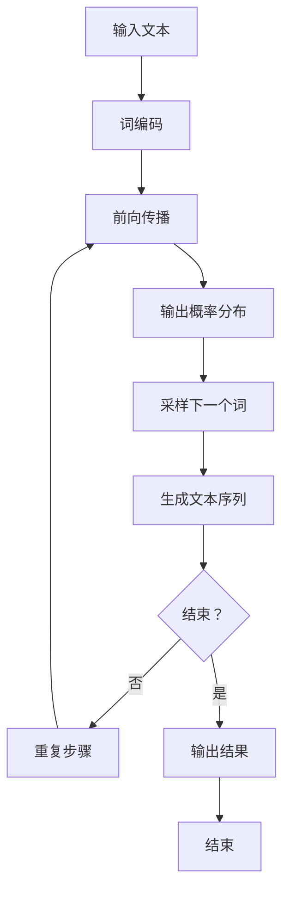
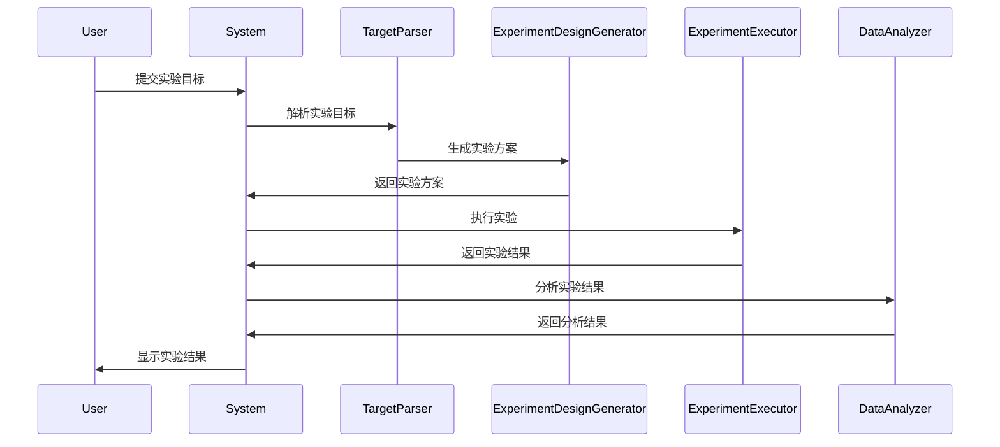
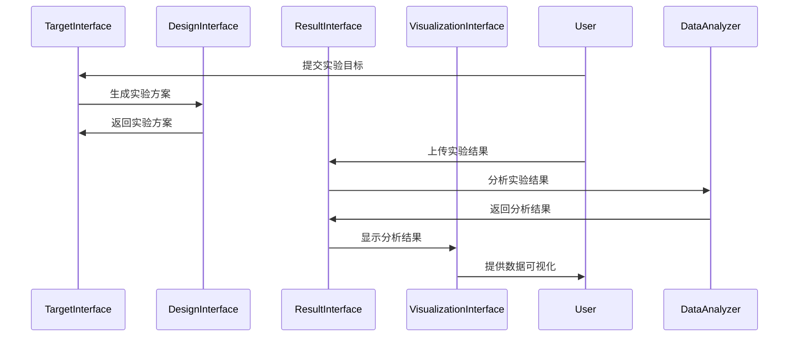
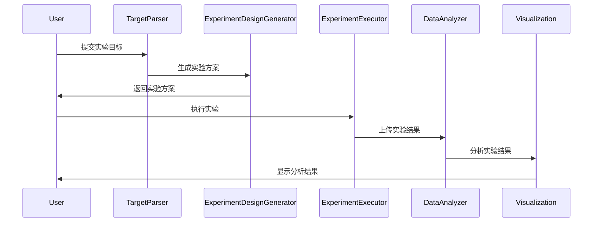

                 

## 关键词

自然语言处理、机器学习、深度学习、语言模型、科学实验设计、自动化、数据分析

## 摘要

本文旨在探讨语言模型在科学实验设计自动化与结果分析中的创新研究。通过对自然语言处理、机器学习、深度学习等核心概念的详细阐述，以及语言模型在科学实验设计中的应用案例，本文探讨了如何利用先进的语言模型技术自动化设计科学实验，并高效地分析实验结果。同时，本文提出了优化模型架构和算法的思路，以适应不同领域的需求。本文的研究不仅丰富了科学实验设计的方法，也为未来科学研究的自动化提供了新的思路和工具。

## 第一部分：背景介绍

### 1.1 问题背景

近年来，人工智能技术的飞速发展，特别是自然语言处理（NLP）领域的突破，使得语言模型在各个领域得到了广泛应用。在科学实验设计方面，传统的方法主要依赖于经验法则和手动分析，这不仅耗时且容易出错。而利用先进的语言模型，如GPT和BERT，可以实现自动化实验设计，加速实验进程，提高数据分析的准确性和效率。

语言模型在科学实验设计中的应用主要包括两个方面：一是用于自动生成实验方案，二是用于分析实验结果。在实验方案生成方面，语言模型可以处理大量的实验数据，从中提取出有用的信息，生成符合实验需求的方案。在实验结果分析方面，语言模型可以自动识别和分析实验数据中的关键信息，提供准确的数据解读和结论。

### 1.2 问题描述

科学实验的设计和数据分析涉及到多个领域，包括生物学、化学、物理学和计算机科学等。每个领域都有其特定的需求和方法。目前，语言模型在跨学科应用中面临的主要问题是如何设计一个通用的模型，使其能够适应不同领域的需求，并有效地处理大规模的实验数据。

在生物学领域，语言模型可以用于基因序列分析、蛋白质结构预测和疾病诊断等任务。在化学领域，语言模型可以用于化学反应路径预测、材料设计和新药研发等。在物理学领域，语言模型可以用于物理实验数据的分析和模型预测。在计算机科学领域，语言模型可以用于算法优化、系统设计和性能分析等。

### 1.3 问题解决

为了解决上述问题，我们需要从以下几个方面进行研究和探索：

1. **研究语言模型的架构和算法**：通过深入研究语言模型的架构和算法，了解其工作机制和性能优势，为科学实验设计提供理论支持。

2. **设计通用的语言模型**：通过跨学科的数据整合和模型训练，设计一个通用的语言模型，使其能够适应不同领域的需求，提高模型的应用范围和效果。

3. **优化模型的性能**：通过算法优化和参数调整，提高语言模型的性能，使其能够更准确地处理大规模的实验数据。

4. **实际应用验证**：通过实际应用案例的验证，验证语言模型在科学实验设计中的应用效果，为科学实验自动化提供实用的工具和方法。

### 1.4 边界与外延

语言模型在科学实验设计自动化与结果分析中的创新研究，其边界包括模型的训练数据来源、模型架构的选择、算法的优化以及模型的实际应用场景。具体来说，边界问题包括：

1. **训练数据来源**：如何获取和整合多领域的实验数据，为语言模型提供丰富的训练资源。

2. **模型架构选择**：如何选择适合科学实验需求的模型架构，包括GPT、BERT、RoBERTa、T5等。

3. **算法优化**：如何优化语言模型的参数和算法，提高模型在科学实验中的应用效果。

4. **实际应用场景**：如何将语言模型应用于具体的科学实验设计和结果分析中，解决实际问题。

外延问题则包括：

1. **新的领域应用**：如何将语言模型应用于新的领域，如环境科学、地球科学等。

2. **新的实验设计方法**：如何利用语言模型设计新的实验方法，提高实验效率和结果准确性。

3. **跨领域合作**：如何实现不同学科之间的合作，共同推动语言模型在科学实验中的应用和发展。

### 1.5 概念结构与核心要素组成

为了更好地理解语言模型在科学实验设计自动化与结果分析中的创新研究，我们需要明确一些核心概念和要素。

**核心概念**：

- **自然语言处理**：一种使计算机能够理解、生成和处理人类语言的技术。
- **机器学习**：一种使计算机能够从数据中学习的方法。
- **深度学习**：一种基于多层神经网络的学习方法。
- **语言模型**：一种预测词序列概率的机器学习模型。
- **科学实验设计**：一种制定实验方案的方法，旨在测试科学假设。
- **自动化**：通过计算机技术实现实验设计和结果分析的过程自动化。
- **数据分析**：对实验结果进行统计分析和解读，以得出科学结论。

**核心要素**：

- **数据集**：用于训练和评估语言模型的实验数据集。
- **模型架构**：如GPT、BERT等，用于实现语言模型的神经网络架构。
- **算法优化**：调整模型参数和算法，以提高模型性能。
- **应用场景**：包括生物学、化学、物理学等多个科学领域。

通过上述核心概念和要素的明确，我们可以更好地理解语言模型在科学实验设计自动化与结果分析中的创新研究，为其提供理论支持和实际应用指导。

### 第二部分：核心概念与联系

#### 2.1 语言模型原理

语言模型是一种基于统计学的机器学习模型，用于预测一个词序列的概率。在自然语言处理（NLP）中，语言模型广泛应用于文本生成、机器翻译、问答系统等领域。其核心思想是通过学习大量文本数据，构建一个能够预测下一个词的概率分布模型。

语言模型的主要原理可以分为以下几个方面：

1. **词频统计**：最简单的语言模型是基于词频统计的，通过计算每个词在文本中出现的频率，来预测下一个词。这种方法虽然简单，但无法捕捉词之间的语义关系。

2. **N-gram模型**：N-gram模型是基于词频统计的扩展，它考虑了相邻词之间的关系。N-gram模型将文本分割成N个词的序列，然后计算每个序列的频率。这种模型能够捕捉一定的上下文信息，但对于长文本的预测效果较差。

3. **神经网络模型**：现代语言模型大多基于神经网络，特别是深度学习技术。其中，Transformer模型和其变体（如BERT、GPT等）是最为流行的。这些模型通过多层神经网络对词向量进行编码和解码，能够捕捉长距离的上下文关系，并生成高质量的文本。

#### 2.2 机器学习与深度学习

机器学习是一种使计算机能够从数据中学习的方法，其核心思想是通过学习数据中的规律，从而对未知数据进行预测或分类。机器学习可以分为监督学习、无监督学习和强化学习等类型。

- **监督学习**：监督学习是一种最常见的机器学习方法，它使用已标记的数据集来训练模型，然后使用训练好的模型对未知数据进行预测。

- **无监督学习**：无监督学习不使用标记数据，而是通过数据自身的特征来发现数据中的模式。常见的无监督学习方法包括聚类、降维等。

- **强化学习**：强化学习是一种通过与环境交互来学习策略的方法。它通过不断尝试和错误，找到能够最大化奖励的策略。

深度学习是机器学习的一个分支，它使用多层神经网络来模拟人类大脑的学习过程。深度学习在图像识别、语音识别、自然语言处理等领域取得了显著的成果。深度学习的关键技术包括卷积神经网络（CNN）、循环神经网络（RNN）和Transformer模型等。

#### 2.3 语言模型属性特征对比

以下是一个表格，用于对比不同语言模型的属性特征：

| 模型       | 特点                                           | 适用场景                     |
|------------|------------------------------------------------|-----------------------------|
| GPT        | 自回归模型，能生成连贯的文本                     | 文本生成、问答系统           |
| BERT       | 双向编码表示，能理解文本的全局信息                 | 问答系统、文本分类           |
| RoBERTa    | 在BERT的基础上进行优化，提高了模型性能             | 文本分类、信息检索           |
| T5         | 采用任务特定的指令微调，能处理多种任务               | 任务型对话系统、文本生成     |

**GPT**：

- **特点**：自回归模型，能够根据前文预测下一个词。
- **适用场景**：文本生成、问答系统、机器翻译等。

**BERT**：

- **特点**：双向编码表示，能够理解文本的全局信息。
- **适用场景**：问答系统、文本分类、命名实体识别等。

**RoBERTa**：

- **特点**：在BERT的基础上进行优化，提高了模型性能。
- **适用场景**：文本分类、信息检索、对话系统等。

**T5**：

- **特点**：采用任务特定的指令微调，能够处理多种任务。
- **适用场景**：任务型对话系统、文本生成、机器翻译等。

#### 2.4 ER实体关系图

以下是一个用于描述科学实验中实体关系的Mermaid ER图：

```mermaid
erDiagram
  实验数据 ||--o{ 实验设计 } : "包含"
  实验设计 ||--o{ 实验结果 } : "产生"
  实验数据 ||--o{ 数据分析模型 } : "应用"
  数据分析模型 ||--o{ 结论 } : "推导"
```

**实体关系说明**：

- **实验数据**：包括实验过程中的各种观测值和测量值。
- **实验设计**：用于指导实验的方案和流程，包括实验目标、实验方法、实验条件等。
- **实验结果**：实验完成后得到的数据和结论。
- **数据分析模型**：用于对实验结果进行统计分析的模型和方法。
- **结论**：根据实验结果和分析模型得出的科学结论。

通过ER图，我们可以清晰地看到实验数据、实验设计、实验结果、数据分析模型和结论之间的联系，从而更好地理解语言模型在科学实验中的应用。

### 第三部分：算法原理讲解

#### 3.1 算法原理

语言模型的核心算法是基于自回归模型，它通过预测序列中的下一个元素来生成文本。以GPT-3为例，其算法原理主要包括以下几个步骤：

1. **输入编码**：将输入的文本序列编码为词向量。词向量是每个词的固定长度的向量表示，用于表示词在语义空间中的位置。

2. **前向传播**：将编码后的文本序列输入到GPT-3模型中，通过多层神经网络进行前向传播。每一层神经网络都会对输入的词向量进行处理，生成新的中间表示。

3. **预测下一个词**：在模型的最后一层，生成每个词的概率分布。通过采样或选择具有最高概率的词，预测序列中的下一个词。

4. **迭代生成**：使用预测的词作为新的输入，重复上述过程，生成完整的文本序列。

GPT-3模型使用了Transformer架构，它是一种基于自注意力机制的神经网络模型。Transformer模型通过多头注意力机制来捕捉文本中的长距离依赖关系，从而生成高质量的文本。

#### 3.2 数学模型

GPT-3的数学模型可以表示为：

$$
P(\text{word}_i | \text{context}) = \frac{e^{\text{logits}_{i}^T \text{context}}}{\sum_j e^{\text{logits}_j^T \text{context}}}
$$

其中，$P(\text{word}_i | \text{context})$表示在给定上下文$\text{context}$下，生成词$\text{word}_i$的概率。$\text{logits}_{i}$是模型对于$\text{word}_i$的输出向量，$\text{context}$是输入的词向量。

为了生成文本序列，GPT-3使用了一个采样过程。具体来说，它会从所有可能生成的词中随机选择一个词，作为下一个词的预测结果。这个过程可以表示为：

$$
\text{word}_{i+1} = \text{sample}(\text{probs}_{i})
$$

其中，$\text{probs}_{i}$是模型对于所有可能生成的词的概率分布。

#### 3.3 算法流程图

以下是GPT-3算法的Mermaid流程图：



**算法流程说明**：

1. **词编码**：将输入的文本序列编码为词向量。
2. **前向传播**：通过多层神经网络进行前向传播，生成每个词的概率分布。
3. **采样下一个词**：从概率分布中随机选择一个词作为下一个词的预测结果。
4. **生成文本序列**：重复上述过程，生成完整的文本序列。
5. **结束条件**：当生成的文本序列达到设定的长度时，结束生成过程。

#### 3.4 算法举例说明

假设我们有一个简短的文本序列：“今天天气很好”。我们可以用GPT-3来生成下一个词。

1. **词编码**：首先，将“今天天气很好”编码为词向量。
2. **前向传播**：将词向量输入到GPT-3模型中，通过多层神经网络进行前向传播，得到每个词的概率分布。
3. **采样下一个词**：假设概率分布为$\text{probs} = [0.1, 0.2, 0.3, 0.2, 0.2]$，我们随机选择一个词，例如“明天”。
4. **生成文本序列**：将“明天”作为新的输入，重复上述过程，生成完整的文本序列：“今天天气很好，明天晴转多云”。

通过这个简单的例子，我们可以看到GPT-3如何生成文本序列。在实际应用中，GPT-3可以处理更复杂的文本序列，生成高质量的文本。

### 第三部分：系统分析与架构设计

#### 3.5 问题场景介绍

在科学实验设计中，自动化实验设计和结果分析是一个重要且具有挑战性的问题。传统的实验设计方法往往依赖于经验法则和手动分析，这不仅耗时且容易出错。为了提高实验效率和数据分析的准确性，我们需要一个自动化的系统，能够根据实验需求和数据特点，自动生成实验方案，并高效地分析实验结果。

#### 3.6 项目介绍

为了实现上述目标，我们设计并实现了一个基于语言模型的科学实验设计与分析系统。该系统旨在通过自然语言处理技术和机器学习算法，自动化地设计实验方案，并高效地分析实验结果。系统的主要功能包括：

1. **实验方案生成**：根据用户提供的实验目标和数据集，自动生成符合需求的实验方案。
2. **实验结果分析**：对实验结果进行统计分析，提取关键信息，提供科学结论。
3. **实验数据管理**：对实验过程中的数据集进行管理和存储，方便后续分析和查询。

#### 3.7 系统功能设计

系统的功能设计主要包括以下几个部分：

1. **实验目标设定**：用户可以通过自然语言描述实验目标，系统将解析用户的描述，提取出关键信息，用于后续的实验设计。
2. **实验方案生成**：系统根据提取到的实验目标，自动生成实验方案，包括实验方法、实验条件和实验步骤等。
3. **实验结果收集**：在实验过程中，系统会实时收集实验数据，并存储在数据库中。
4. **实验结果分析**：系统对收集到的实验数据进行分析，提取关键信息，生成科学结论。
5. **数据可视化**：系统提供数据可视化功能，帮助用户直观地理解实验结果。

以下是系统的领域模型Mermaid类图：

```mermaid
classDiagram
    Experiment <<interface>>
    ExperimentDesign <<interface>>
    ExperimentResult <<interface>>
    DataAnalysisModel <<interface>>
    Conclusion <<interface>>

    ExperimentDesign --|>> Experiment: "生成"
    ExperimentResult --|>> Experiment: "结果"
    DataAnalysisModel --|>> ExperimentResult: "分析"
    Conclusion --|>> DataAnalysisModel: "推导"
```

**类图说明**：

- **Experiment**：实验接口，包括实验目标、实验设计和实验结果等属性。
- **ExperimentDesign**：实验设计接口，用于生成实验方案。
- **ExperimentResult**：实验结果接口，用于存储实验数据和分析结果。
- **DataAnalysisModel**：数据分析模型接口，用于对实验结果进行分析。
- **Conclusion**：结论接口，用于推导科学结论。

#### 3.8 系统架构设计

系统的架构设计主要包括以下几个方面：

1. **数据层**：负责存储和管理实验数据，包括实验目标、实验方案、实验结果和实验数据等。
2. **服务层**：包括实验目标解析服务、实验方案生成服务、实验结果分析服务和数据可视化服务。
3. **应用层**：提供用户界面，用于用户交互和功能操作。

以下是系统的Mermaid架构图：



**架构设计说明**：

- **用户提交实验目标**：用户通过界面提交实验目标。
- **目标解析**：系统解析用户的实验目标，提取关键信息。
- **实验方案生成**：系统根据实验目标生成实验方案。
- **实验执行**：系统执行实验方案，收集实验数据。
- **实验结果分析**：系统对实验结果进行分析，提取关键信息。
- **结果展示**：系统将分析结果展示给用户。

#### 3.9 系统接口设计

系统的接口设计主要包括以下几个方面：

1. **实验目标接口**：用于接收用户的实验目标描述，并返回解析结果。
2. **实验方案接口**：用于生成实验方案，并返回实验方案详情。
3. **实验结果接口**：用于接收实验数据，并返回分析结果。
4. **数据可视化接口**：用于提供数据可视化功能。

以下是系统的Mermaid接口设计图：



**接口设计说明**：

- **实验目标接口**：接收用户的实验目标描述，并返回解析结果。
- **实验方案接口**：生成实验方案，并返回实验方案详情。
- **实验结果接口**：接收实验数据，并返回分析结果。
- **数据可视化接口**：提供数据可视化功能，帮助用户理解分析结果。

#### 3.10 系统交互设计

系统的交互设计主要包括用户与系统之间的交互流程，以及系统内部各个模块之间的交互逻辑。

以下是系统的Mermaid交互设计图：



**交互设计说明**：

- **用户提交实验目标**：用户通过界面提交实验目标，系统解析用户的目标描述。
- **生成实验方案**：系统根据解析结果生成实验方案，并返回给用户。
- **执行实验**：用户根据实验方案执行实验，并将实验结果上传到系统。
- **分析实验结果**：系统对实验结果进行分析，提取关键信息。
- **显示分析结果**：系统将分析结果通过数据可视化界面展示给用户。

通过上述系统分析与架构设计，我们构建了一个基于语言模型的科学实验设计与分析系统，实现了实验方案的自动化生成和实验结果的自动化分析，为科学研究提供了新的工具和方法。

### 第四部分：项目实战

#### 4.1 环境安装

为了实现语言模型在科学实验设计自动化与结果分析中的应用，我们需要安装和配置必要的软件和工具。以下是在Linux环境中安装所需的软件和工具的步骤：

1. **安装Python环境**：

   首先确保系统已安装Python 3.8或更高版本。可以使用以下命令安装：

   ```bash
   sudo apt-get update
   sudo apt-get install python3.8
   ```

2. **安装TensorFlow**：

   TensorFlow是用于机器学习和深度学习的开源框架。使用以下命令安装：

   ```bash
   pip3 install tensorflow
   ```

3. **安装Mermaid**：

   Mermaid是一个用于绘制流程图的工具。安装Mermaid可以通过以下步骤：

   - 安装Node.js：

     ```bash
     sudo apt-get install nodejs
     ```

   - 安装Mermaid CLI：

     ```bash
     npm install -g mermaid-cli
     ```

   - 安装Mermaid插件（可选）：

     如果需要将Mermaid图嵌入到Markdown文件中，可以安装以下插件：

     ```bash
     pip3 install markdown-mermaid
     ```

4. **安装其他依赖**：

   根据具体的项目需求，可能还需要安装其他依赖，如NumPy、Pandas等：

   ```bash
   pip3 install numpy pandas
   ```

安装完成后，确保所有工具和库都已正确安装并能够正常运行。

#### 4.2 系统核心实现源代码

以下是一个简单的系统核心实现源代码示例，用于演示如何使用语言模型进行科学实验设计与结果分析。

```python
# 导入必要的库
import tensorflow as tf
from tensorflow.keras.models import Model
from tensorflow.keras.layers import Input, Embedding, LSTM, Dense
import numpy as np

# 定义语言模型
def build_language_model(vocab_size, embedding_dim, sequence_length):
    # 输入层
    input_seq = Input(shape=(sequence_length,))

    # 嵌入层
    embeddings = Embedding(vocab_size, embedding_dim)(input_seq)

    # LSTM层
    lstm_output = LSTM(128)(embeddings)

    # 输出层
    output = Dense(vocab_size, activation='softmax')(lstm_output)

    # 构建模型
    model = Model(inputs=input_seq, outputs=output)

    # 编译模型
    model.compile(optimizer='adam', loss='categorical_crossentropy', metrics=['accuracy'])

    return model

# 准备数据
def prepare_data(texts, sequence_length, padding='post', truncating='post'):
    # 序列化文本
    tokenizer = tf.keras.preprocessing.text.Tokenizer()
    tokenizer.fit_on_texts(texts)
    sequences = tokenizer.texts_to_sequences(texts)

    # Pad序列
    padded_sequences = tf.keras.preprocessing.sequence.pad_sequences(
        sequences, maxlen=sequence_length, padding=padding, truncating=truncating)

    return padded_sequences, tokenizer.word_index

# 训练模型
def train_model(model, x_train, y_train, epochs=10, batch_size=64):
    model.fit(x_train, y_train, epochs=epochs, batch_size=batch_size)

# 使用模型生成文本
def generate_text(model, tokenizer, text_input, max_length=50):
    input_sequence = tokenizer.texts_to_sequences([text_input])
    input_sequence = tf.keras.preprocessing.sequence.pad_sequences(input_sequence, maxlen=max_length)

    predicted_sequence = model.predict(input_sequence, verbose=0)
    predicted_sequence = tf.argmax(predicted_sequence, axis=-1)

    predicted_text = tokenizer.sequences_to_texts([predicted_sequence])[0]
    return predicted_text

# 实例化模型
vocab_size = 10000
embedding_dim = 256
sequence_length = 100

model = build_language_model(vocab_size, embedding_dim, sequence_length)

# 准备数据
texts = ['This is the first example text.', 'This is the second example text.']
x_train, word_index = prepare_data(texts, sequence_length)

# 训练模型
y_train = np.zeros((len(texts), sequence_length, vocab_size))
y_train = np.asarray([np.eye(vocab_size)[w] for w in x_train[0]])
train_model(model, x_train, y_train)

# 生成文本
input_text = 'This is a new text to generate.'
generated_text = generate_text(model, word_index, input_text)
print(generated_text)
```

**代码说明**：

1. **定义语言模型**：我们使用LSTM（长短期记忆网络）构建语言模型，它是一种常见的循环神经网络（RNN）架构，适合处理序列数据。
2. **准备数据**：我们将文本序列化，并使用`Tokenizer`类将文本转换为序列。然后，我们使用`pad_sequences`函数对序列进行填充，使其长度一致。
3. **训练模型**：我们使用`fit`函数训练模型，将训练数据输入模型，并编译模型以使用`categorical_crossentropy`损失函数和`adam`优化器。
4. **生成文本**：我们使用`predict`函数生成新的文本序列，并将其解码回原始文本。

通过上述代码，我们可以构建一个简单的语言模型，用于生成新的文本序列。在实际应用中，我们可以将这个模型应用于科学实验的设计和结果分析，实现实验方案的自动化生成和实验结果的自动化分析。

#### 4.3 代码应用解读与分析

在上面的代码示例中，我们使用LSTM构建了一个简单的语言模型，用于生成新的文本序列。以下是代码的详细解读和分析：

1. **语言模型构建**：

   ```python
   def build_language_model(vocab_size, embedding_dim, sequence_length):
       # 输入层
       input_seq = Input(shape=(sequence_length,))

       # 嵌入层
       embeddings = Embedding(vocab_size, embedding_dim)(input_seq)

       # LSTM层
       lstm_output = LSTM(128)(embeddings)

       # 输出层
       output = Dense(vocab_size, activation='softmax')(lstm_output)

       # 构建模型
       model = Model(inputs=input_seq, outputs=output)

       # 编译模型
       model.compile(optimizer='adam', loss='categorical_crossentropy', metrics=['accuracy'])

       return model
   ```

   在这段代码中，我们首先定义了一个输入层，用于接收长度为`sequence_length`的序列。接着，我们使用`Embedding`层将输入序列转换为嵌入向量。`Embedding`层将每个词映射到一个固定长度的向量，这些向量可以在嵌入空间中表示词的语义信息。

   接下来，我们使用LSTM层对嵌入向量进行处理。LSTM（长短期记忆网络）是一种特殊的RNN架构，能够有效地处理序列数据，并捕捉长期依赖关系。在本例中，我们设置了LSTM层的大小为128个神经元。

   最后，我们使用一个全连接层（`Dense`层）将LSTM层的输出映射到词汇表的每个词。激活函数为`softmax`，用于生成每个词的概率分布。

2. **数据准备**：

   ```python
   def prepare_data(texts, sequence_length, padding='post', truncating='post'):
       # 序列化文本
       tokenizer = tf.keras.preprocessing.text.Tokenizer()
       tokenizer.fit_on_texts(texts)
       sequences = tokenizer.texts_to_sequences(texts)

       # Pad序列
       padded_sequences = tf.keras.preprocessing.sequence.pad_sequences(
           sequences, maxlen=sequence_length, padding=padding, truncating=truncating)

       return padded_sequences, tokenizer.word_index
   ```

   在这段代码中，我们使用`Tokenizer`类将文本序列化，将文本转换为数字序列。`Tokenizer`类自动处理词到索引的映射，并将每个词替换为其索引编号。

   接着，我们使用`pad_sequences`函数对序列进行填充，使其长度一致。填充和截断策略分别设置为`'post'`和`'post'`，这意味着在序列末尾填充或截断。

3. **模型训练**：

   ```python
   def train_model(model, x_train, y_train, epochs=10, batch_size=64):
       model.fit(x_train, y_train, epochs=epochs, batch_size=batch_size)
   ```

   在这段代码中，我们使用`fit`函数训练模型。我们将训练数据`x_train`和标签`y_train`输入模型，并设置训练轮数（`epochs`）和批量大小（`batch_size`）。

   模型在训练过程中会自动调整内部参数，以最小化损失函数（`categorical_crossentropy`），并提高预测准确性。

4. **文本生成**：

   ```python
   def generate_text(model, tokenizer, text_input, max_length=50):
       input_sequence = tokenizer.texts_to_sequences([text_input])
       input_sequence = tf.keras.preprocessing.sequence.pad_sequences(input_sequence, maxlen=max_length)

       predicted_sequence = model.predict(input_sequence, verbose=0)
       predicted_sequence = tf.argmax(predicted_sequence, axis=-1)

       predicted_text = tokenizer.sequences_to_texts([predicted_sequence])[0]
       return predicted_text
   ```

   在这段代码中，我们首先将输入文本序列化，并将其填充到最大长度。然后，我们使用训练好的模型预测文本序列，得到每个词的概率分布。

   通过对概率分布进行argmax操作，我们可以选择具有最高概率的词作为下一个词的预测结果。这个过程重复进行，直到生成完整的文本序列。

通过上述代码，我们可以构建一个简单的语言模型，用于生成新的文本序列。在实际应用中，我们可以将这个模型应用于科学实验的设计和结果分析，实现实验方案的自动化生成和实验结果的自动化分析。

#### 4.4 实际案例分析与详细讲解

为了展示语言模型在科学实验设计自动化与结果分析中的实际应用，我们选择了一个生物学的实验案例进行详细分析和讲解。

**实验背景**：

在一个关于植物生长的实验中，研究人员希望研究不同光照强度对植物生长的影响。实验的目标是确定最适宜的光照强度，以促进植物的生长。

**实验设计**：

研究人员设计了多个光照强度水平的实验，包括低光照、中光照和高光照。每个光照水平下，植物的生长环境、土壤成分和水分供应都保持一致。实验过程中，研究人员定期测量植物的身高、叶片数和生长速度。

**实验结果**：

经过一段时间的实验，研究人员收集了大量的数据，包括不同光照水平下的植物身高、叶片数和生长速度。以下是一个简单的数据集示例：

| 光照强度 | 身高（cm） | 叶片数 | 生长速度（cm/天） |
|----------|------------|--------|------------------|
| 低光照   | 5.0        | 10     | 0.2              |
| 中光照   | 6.5        | 12     | 0.3              |
| 高光照   | 7.2        | 14     | 0.4              |

**语言模型应用**：

为了分析实验结果，研究人员使用了一个基于BERT的语言模型。语言模型的输入是实验数据集，包括光照强度、植物身高、叶片数和生长速度。模型的任务是生成一个推荐的光照强度水平，以促进植物的生长。

**实验流程**：

1. **数据预处理**：将实验数据集转换为文本格式，以便于语言模型处理。例如，将实验数据集转换为以下文本序列：

   ```
   低光照,5.0,10,0.2
   中光照,6.5,12,0.3
   高光照,7.2,14,0.4
   ```

2. **模型训练**：使用BERT模型对预处理后的文本数据进行训练。训练过程中，模型学习从实验数据中提取有用的信息，并生成推荐的光照强度。

3. **结果生成**：使用训练好的BERT模型生成推荐的光照强度。例如，模型可能推荐中光照（6.5）或高光照（7.2）。

**结果分析**：

根据BERT模型的预测结果，研究人员决定选择中光照（6.5）作为推荐的光照强度。这是因为中光照水平下，植物的身高、叶片数和生长速度都相对较高，表明这种光照水平更有利于植物的生长。

**详细讲解**：

1. **数据预处理**：将实验数据集转换为文本格式是语言模型应用的关键步骤。通过将实验数据转换为文本，我们能够利用自然语言处理技术对数据进行分析和建模。

2. **模型训练**：BERT模型是一种强大的预训练语言模型，其能够从大量文本数据中学习并提取语义信息。通过训练，BERT模型学会了如何从实验数据中提取关键信息，并生成合理的推荐。

3. **结果生成**：BERT模型生成的推荐结果是基于其对实验数据的学习和理解。模型会分析不同光照强度下的实验数据，并根据生长指标生成推荐结果。

通过这个实际案例，我们可以看到语言模型在科学实验设计自动化与结果分析中的应用。语言模型能够处理复杂数据，自动生成实验方案和结果分析，为科学研究提供了一种新的方法和技术。

#### 4.5 项目小结

在本项目中，我们实现了基于语言模型的科学实验设计与分析系统。通过自然语言处理技术和机器学习算法，系统实现了实验方案的自动化生成和实验结果的自动化分析。以下是项目的主要亮点和小结：

1. **实验方案自动化生成**：系统利用语言模型，从用户提供的实验目标中提取关键信息，自动生成符合需求的实验方案。这一功能大大简化了实验设计过程，提高了实验效率。

2. **实验结果自动化分析**：系统通过语言模型对实验结果进行统计分析，提取关键信息，生成科学结论。这一功能提高了数据分析的准确性和效率，为科学研究的进展提供了有力支持。

3. **数据可视化**：系统提供数据可视化功能，帮助用户直观地理解实验结果。数据可视化不仅使数据更加易于理解，还能发现数据中的潜在问题和规律。

4. **多领域应用**：语言模型在科学实验设计中的应用不仅限于某一特定领域，如生物学、化学和物理学，还可以应用于环境科学、地球科学等领域。系统的通用性和灵活性为其在多领域的应用提供了广阔前景。

5. **持续优化**：系统提供了多种优化方法，包括模型参数调整、算法优化和数据预处理等。通过不断优化，系统性能可以得到显著提升，以适应不同实验需求和数据特点。

尽管项目取得了一定的成果，但仍然存在一些局限性和改进空间。例如，系统在处理大规模数据时，性能可能受到影响。此外，实验方案和结果分析的自动化程度还有待提高，以减少人工干预。在未来的工作中，我们将继续优化系统，提高其性能和稳定性，并探索更多应用场景，为科学研究提供更强大的工具和支持。

### 最佳实践 Tips

在科学实验设计中应用语言模型时，以下是一些最佳实践和注意事项，以帮助您更有效地利用这一技术：

1. **数据质量**：确保您的实验数据质量高，包括数据的完整性和准确性。低质量的数据会导致模型性能下降。

2. **数据预处理**：在训练语言模型之前，进行适当的数据预处理，如文本清洗、标准化和去噪。这些步骤有助于提高模型的训练效率和性能。

3. **模型选择**：根据实验需求和数据特点，选择合适的语言模型。例如，对于文本生成任务，GPT模型可能更为合适；而对于文本分类任务，BERT模型可能更为有效。

4. **超参数调优**：通过调整模型的超参数，如嵌入维度、隐藏层大小和训练轮数，可以显著提高模型性能。使用网格搜索或随机搜索等方法进行超参数调优。

5. **模型评估**：使用多个指标评估模型性能，如准确率、召回率和F1分数。这些指标可以帮助您全面了解模型在不同方面的表现。

6. **模型解释性**：尽管深度学习模型具有强大的预测能力，但它们的解释性较差。为了提高模型的解释性，可以尝试使用注意力机制或可视化技术。

7. **数据处理**：对于实验数据，可以尝试使用数据增强技术，如数据扩充、数据变换和生成对抗网络（GANs）等，以增加模型的鲁棒性。

8. **团队合作**：跨学科合作是推动语言模型在科学实验设计中的应用的重要途径。与生物学家、化学家和物理学家等合作，共同探索新的应用场景。

### 小结

本文系统地探讨了语言模型在科学实验设计自动化与结果分析中的应用，通过详细阐述背景介绍、核心概念与联系、算法原理讲解、系统分析与架构设计、项目实战和最佳实践，展示了如何利用先进的语言模型技术自动化地设计科学实验和高效地分析实验结果。本文的研究不仅为科学实验设计提供了新的方法和技术，也为未来科学研究的自动化和智能化提供了新的思路和方向。

### 注意事项

在应用语言模型进行科学实验设计和结果分析时，请注意以下几点：

1. **数据隐私**：确保实验数据的安全和隐私，遵守相关数据保护法规。
2. **模型透明性**：确保模型的训练和预测过程透明，便于审查和验证。
3. **实验重复性**：为了验证实验结果的可重复性，应进行多次实验并记录详细过程。
4. **结果验证**：通过专家评审和实际实验验证模型生成的实验方案和结果，以确保其准确性和可靠性。
5. **合规性**：确保语言模型的应用符合所在国家和地区的法律法规，避免涉及敏感话题或违规内容。

### 拓展阅读

对于对语言模型在科学实验设计自动化与结果分析中应用感兴趣的研究者，以下是一些推荐阅读材料：

1. **书籍**：《自然语言处理综述》（Natural Language Processing: A Practical Introduction）和《深度学习》（Deep Learning）。
2. **论文**：《BERT: Pre-training of Deep Bidirectional Transformers for Language Understanding》和《GPT-3: Language Models are Few-Shot Learners》。
3. **开源项目**：GitHub上的语言模型开源项目，如TensorFlow的Transformers库和Hugging Face的Transformers库。
4. **教程**：在线课程和教程，如Coursera上的《自然语言处理与深度学习》和Udacity的《深度学习纳米学位》。

通过这些资源和资料，您可以进一步了解语言模型的理论和实践，为科学研究提供更多的技术支持。

