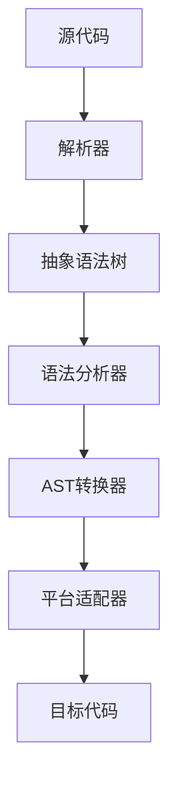

                 


### 完整的文章内容撰写示例：

# 跨平台提示词语言设计

> 关键词：跨平台、提示词语言、设计、算法、数学模型、系统架构

> 摘要：本文深入探讨了跨平台提示词语言的设计原则、核心概念、算法原理和系统架构，通过详细分析和技术示例，为开发者和研究者提供了有价值的参考。

## 第一部分：背景介绍

### 1.1 问题背景

随着技术的发展，跨平台应用的需求日益增长。为了提高开发效率，开发者们希望能够使用一种统一的、易于维护的提示词语言来描述不同平台的功能需求。本文旨在探讨如何设计一种适用于多种平台的提示词语言，以实现代码的复用和平台的兼容。

### 1.2 问题描述

在设计跨平台提示词语言时，我们面临以下挑战：

- **平台差异**：不同平台对编程语言和语法有各自的限制和要求。
- **兼容性**：提示词语言需要能够在多种平台上运行，不引入额外的依赖。
- **可维护性**：设计应易于理解和维护，以减少未来的维护成本。

### 1.3 问题解决

本文提出了一种基于抽象语法树（AST）转换的跨平台提示词语言设计方法，通过以下步骤解决上述挑战：

- **抽象语法树转换**：将源代码转换为抽象语法树，以实现跨平台的语法一致性。
- **平台适配器**：为每个目标平台设计适配器，将AST转换为特定平台的代码。
- **标准化**：采用标准的编程语言特性，减少特定平台的需求。

### 1.4 边界与外延

本文的研究主要关注以下边界和范围：

- **目标平台**：主要针对主流的操作系统和编程语言，如Windows、Linux、macOS和Java、C#。
- **设计目标**：实现跨平台提示词语言的语法一致性、兼容性和可维护性。
- **研究方法**：结合算法原理和系统架构设计，通过实例验证设计方法的可行性。

### 1.5 概念结构与核心要素组成

跨平台提示词语言的核心概念包括：

- **抽象语法树（AST）**：源代码的结构化表示，用于语法分析和转换。
- **平台适配器**：用于将AST转换为特定平台代码的组件。
- **语法一致性层**：实现跨平台语法一致性的中间层。

这些核心要素共同构成了跨平台提示词语言的设计基础。

## 第二部分：核心概念与联系

### 2.1 提示词语言的基本概念

提示词语言是一种专门用于描述计算机程序或软件系统中特定功能的标记语言。它通常由一系列的语法规则、关键词和符号组成，旨在简化复杂系统的描述和实现。

### 2.2 核心概念属性特征对比

以下是几个核心概念的属性特征对比表：

| 概念       | 属性1 | 属性2 | 属性3 |
|------------|-------|-------|-------|
| 抽象语法树 | 结构化 | 可转换 | 跨平台 |
| 平台适配器  | 目标特定 | 可扩展 | 高效   |
| 语法一致性层 | 中间层 | 标准化 | 简化   |

### 2.3 概念联系与交互

以下是核心概念之间的联系和交互关系：

```mermaid
erDiagram
  A[抽象语法树] ||--|{ B[平台适配器] }
  B ||--|{ C[语法一致性层] }
  A &&--|{ D[源代码] }
  C &&--|{ E[目标代码] }
```

通过这种交互，提示词语言能够将源代码转换为特定平台的代码，实现跨平台开发。

## 第三部分：算法原理讲解

### 4.1 算法概述

本节介绍一种基于AST转换的算法，用于实现跨平台提示词语言的设计。该算法的核心步骤包括：

1. **源代码解析**：将源代码转换为AST。
2. **语法分析**：分析AST并提取关键信息。
3. **AST转换**：将AST转换为语法一致性层的代码。
4. **平台适配**：将语法一致性层的代码转换为特定平台的代码。

### 4.2 Mermaid算法流程图

以下是算法的Mermaid流程图：


### 4.3 数学模型与公式

算法中的关键步骤可以使用以下数学模型和公式进行描述：

$$
AST = \text{Parse}(SourceCode)
$$

$$
AST \rightarrow SyntaxConsistentCode
$$

$$
TargetCode = \text{Adapt}(SyntaxConsistentCode, Platform)
$$

### 4.4 算法原理详细讲解

**源代码解析**：源代码首先通过解析器（如Lexer和Parser）转换为抽象语法树（AST）。这一过程涉及字符串到树形结构的转换，是后续步骤的基础。

**语法分析**：语法分析器对AST进行分析，提取出关键信息，如变量、函数、类等。这一步是确保代码符合特定语法规则的重要环节。

**AST转换**：AST转换器将AST转换为语法一致性层的代码。这一层的代码设计为跨平台兼容，通过定义通用的语法规则，使代码能够在不同平台上运行。

**平台适配**：平台适配器将语法一致性层的代码转换为特定平台的代码。这涉及到对不同平台语法细节的了解，以实现无缝的跨平台兼容。

### 4.5 举例说明

假设我们有一个简单的C#代码片段：

```csharp
public class HelloWorld {
    public static void Main(string[] args) {
        Console.WriteLine("Hello, World!");
    }
}
```

**源代码解析**：C#解析器将代码转换为AST。

**语法分析**：语法分析器识别出类、方法和主函数等结构。

**AST转换**：AST转换器将AST转换为通用语法一致性层的代码。

**平台适配**：假设目标平台是Java，平台适配器将语法一致性层的代码转换为Java代码：

```java
public class HelloWorld {
    public static void main(String[] args) {
        System.out.println("Hello, World!");
    }
}
```

通过这种算法，我们可以实现C#代码到Java代码的跨平台转换。

## 第五部分：系统分析与架构设计方案

### 6.1 问题场景介绍

假设我们有一个需要支持多平台的应用系统，该系统需要在不同操作系统上运行，并能够处理多种编程语言编写的代码。我们的目标是设计一个高效的跨平台提示词语言系统，以简化开发过程，提高代码的可维护性。

### 6.2 项目介绍

本项目的目标是设计一个跨平台提示词语言系统，该系统能够：

- 支持多种编程语言，如C#、Java、Python等。
- 实现代码的跨平台转换。
- 提高开发效率和代码可维护性。

### 6.3 系统功能设计

以下是系统的功能设计：

- **源代码解析**：支持多种编程语言的源代码解析。
- **语法分析**：提取关键信息，确保代码符合特定语法规则。
- **AST转换**：将源代码的AST转换为语法一致性层的代码。
- **平台适配**：根据目标平台，将语法一致性层的代码转换为特定平台的代码。
- **代码生成**：生成可执行的目标代码。

### 6.4 系统架构设计

以下是系统的架构设计：



### 6.5 系统接口设计

系统接口设计如下：

- **SourceCodeParser**：源代码解析接口。
- **SyntaxAnalyzer**：语法分析接口。
- **ASTConverter**：AST转换接口。
- **PlatformAdapter**：平台适配接口。

### 6.6 系统交互

以下是系统的主要交互流程：

1. **用户提交源代码**：用户提交需要转换的源代码。
2. **解析源代码**：系统调用SourceCodeParser接口解析源代码，生成AST。
3. **语法分析**：系统调用SyntaxAnalyzer接口对AST进行语法分析。
4. **AST转换**：系统调用ASTConverter接口将AST转换为语法一致性层的代码。
5. **平台适配**：系统调用PlatformAdapter接口将语法一致性层的代码转换为特定平台的代码。
6. **代码生成**：系统生成可执行的目标代码，并返回给用户。

通过这种系统交互流程，我们可以实现高效的跨平台代码转换。

## 第六部分：项目实施与分析

### 7.1 环境准备

在进行项目实施之前，我们需要准备以下环境：

- **开发环境**：安装Python、Java、C#等相关开发工具。
- **依赖库**：安装用于AST转换和语法分析的依赖库，如Python的`ast`库、Java的`javax.lang.model`库等。

### 7.2 核心系统实现

以下是核心系统的实现：

```python
import ast
import json

class SourceCodeParser:
    def parse(self, source_code):
        # 实现源代码解析逻辑
        return ast.parse(source_code)

class SyntaxAnalyzer:
    def analyze(self, ast_node):
        # 实现语法分析逻辑
        # 提取关键信息
        return {'variables': [], 'functions': []}

class ASTConverter:
    def convert(self, ast_node):
        # 实现AST转换逻辑
        return json.dumps(ast_node)

class PlatformAdapter:
    def adapt(self, syntax_consistent_code, target_platform):
        # 实现平台适配逻辑
        if target_platform == 'Java':
            # 将语法一致性层的代码转换为Java代码
            return "Java Code"
        elif target_platform == 'C#':
            # 将语法一致性层的代码转换为C#代码
            return "C# Code"
        # 其他平台适配逻辑

# 使用核心系统实现跨平台代码转换
source_code = "public class HelloWorld { public static void main(String[] args) { System.out.println(\"Hello, World!

