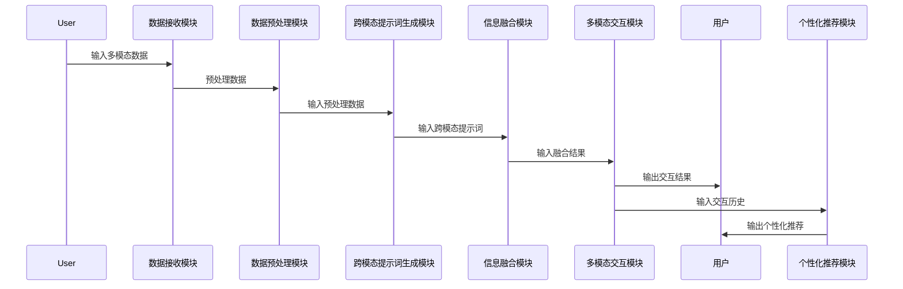
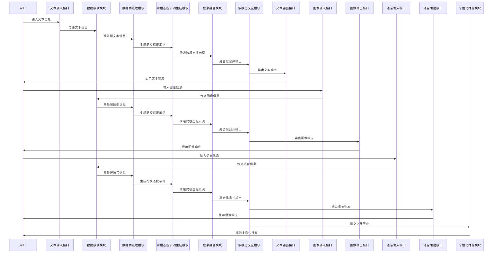

                 


## 背景介绍

### AI的发展与跨模态交互

随着人工智能（AI）技术的迅猛发展，自然语言处理（NLP）、计算机视觉（CV）和语音识别（ASR）等领域的突破为跨模态交互（Cross-modal Interaction）提供了坚实的基础。跨模态交互指的是将不同的感官模态（如文本、图像、语音）结合在一起，使机器能够更全面、准确地理解和响应人类的需求。这一概念在当前技术环境中越来越重要，主要因为以下几个原因：

首先，人类在日常生活中往往同时依赖多种感官信息进行理解和决策。例如，当我们观看视频时，我们不仅依赖于视觉信息，还会结合背景音乐、旁白和文字说明来获取更全面的信息。这种多感官的整合可以帮助我们更好地理解复杂的信息，提高认知效率。

其次，随着物联网（IoT）和智能设备的普及，用户与设备的交互方式越来越多样。人们不再仅仅通过键盘和屏幕进行交互，而是可以通过语音、手势、甚至眼神等非传统方式与设备进行沟通。这种交互方式的变革要求AI系统能够处理并整合来自不同模态的信息，以提供更自然的用户体验。

最后，跨模态交互有助于解决单模态AI系统面临的局限性。例如，文本处理系统可能在理解复杂图像或语音时遇到困难，而图像识别系统在处理文本描述时可能缺乏上下文信息。通过跨模态交互，可以弥补这些单一模态的不足，提高系统的整体性能和可靠性。

### 跨模态提示词的概念

跨模态提示词（Cross-modal Prompt Words）是跨模态交互中的一个关键概念。它指的是一组能够引导AI系统在不同模态之间进行有效沟通的词语或短语。这些提示词的设计和选择对于跨模态交互的成功至关重要，因为它们不仅需要理解单个模态的信息，还要能够整合来自不同模态的数据。

跨模态提示词的主要作用如下：

1. **信息桥接**：提示词可以帮助AI系统将文本、图像和语音等不同模态的信息进行有效整合，从而提高系统的理解能力和反应速度。

2. **上下文引导**：提示词能够为AI系统提供上下文信息，帮助系统更好地理解用户意图，从而做出更准确的响应。

3. **交互优化**：通过合理使用提示词，可以优化AI系统与用户的交互流程，提高用户体验的流畅性和满意度。

### 跨模态提示词的应用场景

跨模态提示词在多个领域都有着广泛的应用：

1. **智能助手**：在智能语音助手、聊天机器人等应用中，跨模态提示词可以帮助系统更好地理解用户的需求，提供更精准的答复。例如，用户可以通过语音描述一张图片，系统使用跨模态提示词来整合语音和图像信息，从而准确识别图片内容。

2. **多媒体内容创作**：在视频编辑、图像处理和音乐创作等应用中，跨模态提示词可以帮助用户更高效地创作内容。例如，用户可以通过文字描述来指导图像或视频的编辑，系统使用跨模态提示词来整合文本和图像或视频信息。

3. **智能监控与安全**：在智能监控系统中，跨模态提示词可以帮助系统实时分析视频流和语音信息，提高安全监控的准确性和效率。

4. **教育辅助**：在教育领域，跨模态提示词可以帮助学生更好地理解和记忆知识。例如，学生可以通过阅读文本、观看相关视频和听取讲解来提高学习效果。

5. **医疗健康**：在医疗健康领域，跨模态提示词可以帮助医生更准确地诊断疾病。例如，医生可以通过分析病人的病历文本、检查图像和语音描述来综合判断病情。

综上所述，跨模态提示词作为跨模态交互的核心要素，其在AI领域的应用前景广阔，具有重要的研究价值和实际应用潜力。接下来，我们将进一步探讨跨模态提示词的核心概念及其与文本、图像和语音的关系。

### 核心概念与联系

#### 文本处理技术

文本处理技术（Text Processing Technologies）是跨模态交互的基础。文本处理技术主要包括自然语言处理（Natural Language Processing, NLP）、文本分类（Text Classification）、情感分析（Sentiment Analysis）和命名实体识别（Named Entity Recognition）等。

- **自然语言处理（NLP）**：NLP是文本处理的核心技术，旨在使计算机能够理解、解释和生成人类语言。NLP技术包括分词（Tokenization）、词性标注（Part-of-Speech Tagging）、句法分析（Syntactic Parsing）、语义分析（Semantic Analysis）等。

- **文本分类**：文本分类是将文本数据根据其内容或特征分类到预定义的类别中。例如，垃圾邮件分类、新闻分类等。

- **情感分析**：情感分析旨在识别文本中的情感倾向，如正面、负面或中性。这在社交媒体分析、客户反馈处理等领域具有重要应用。

- **命名实体识别**：命名实体识别（Named Entity Recognition, NER）是识别文本中的特定实体，如人名、地名、组织名等。NER在信息提取、知识图谱构建等领域具有重要应用。

#### 图像识别技术

图像识别技术（Image Recognition Technologies）是计算机视觉（Computer Vision）的重要组成部分。图像识别技术主要包括图像分类（Image Classification）、目标检测（Object Detection）、图像分割（Image Segmentation）和姿态估计（Pose Estimation）等。

- **图像分类**：图像分类是将图像数据分类到预定义的类别中。常见的图像分类任务包括物体识别、场景识别等。

- **目标检测**：目标检测旨在识别图像中的目标并定位其在图像中的位置。目标检测是自动驾驶、安防监控等领域的重要技术。

- **图像分割**：图像分割是将图像划分为不同的区域或对象。图像分割在医学影像分析、图像编辑等领域具有重要应用。

- **姿态估计**：姿态估计是通过分析图像或视频数据来确定人体的姿态。姿态估计在动作识别、人机交互等领域具有广泛应用。

#### 语音识别与生成

语音识别技术（Speech Recognition Technologies）和语音生成技术（Speech Synthesis Technologies）是跨模态交互中处理语音信息的关键。

- **语音识别（ASR）**：语音识别是将语音信号转换为文本或命令。ASR技术在智能助手、语音搜索等领域具有重要应用。

- **语音生成（TTS）**：语音生成是将文本转换为自然流畅的语音输出。常见的语音生成技术包括合成语音（Text-to-Speech, TTS）和语音转换（Voice Conversion）。

#### 跨模态提示词原理与特点

跨模态提示词（Cross-modal Prompt Words）的设计旨在将文本、图像和语音等不同模态的信息进行有效整合。跨模态提示词具有以下特点：

- **信息桥接**：跨模态提示词能够将不同模态的信息连接在一起，帮助AI系统更全面地理解用户需求。

- **上下文引导**：跨模态提示词能够为AI系统提供上下文信息，提高系统的理解和响应能力。

- **灵活性**：跨模态提示词可以根据具体应用场景进行调整和优化，以提高交互效果。

- **集成性**：跨模态提示词需要整合多种模态的信息，这要求其在处理过程中具有较强的集成性和兼容性。

#### 跨模态提示词与传统提示词的区别

与传统提示词相比，跨模态提示词具有以下区别：

- **处理模态**：传统提示词主要处理单一模态的信息，而跨模态提示词需要处理来自多种模态的信息。

- **复杂性**：跨模态提示词在信息整合和处理过程中面临更高的复杂性，因为需要处理不同模态之间的差异和关系。

- **应用场景**：传统提示词通常用于文本或语音交互，而跨模态提示词可以应用于多种跨模态交互场景。

通过上述分析，我们可以看到跨模态提示词在跨模态交互中扮演着关键角色。它不仅能够整合不同模态的信息，提高系统的理解能力和响应速度，还能够优化用户体验，满足多样化的交互需求。在接下来的部分，我们将进一步探讨跨模态交互面临的挑战及其解决方法。

### 跨模态交互的挑战与机遇

#### 技术挑战

1. **数据融合**：跨模态交互需要将来自不同模态的数据进行有效融合。然而，不同模态的数据具有不同的特征和表现形式，这使得数据融合成为一大挑战。例如，文本数据主要包含词汇和语法结构，图像数据则依赖于像素和颜色信息，而语音数据则涉及音频信号和语音识别模型。如何将这些不同特征的数据进行有效整合，是实现跨模态交互的重要问题。

2. **模型协同**：跨模态交互通常需要多种AI模型（如文本处理模型、图像识别模型和语音识别模型）协同工作。不同模型之间可能存在性能差异、数据不一致等问题，导致协同效率降低。如何设计一个统一的框架，使得不同模型能够高效地协同工作，是跨模态交互面临的重要挑战。

3. **真实性评估**：在跨模态交互中，系统的真实性评估是一个关键问题。如何评估跨模态系统在不同场景下的真实性和可靠性，以确保用户得到准确、一致的信息反馈，是当前研究的一个重要方向。

#### 应用机遇

1. **人工智能助手**：跨模态交互使得人工智能助手能够更自然、更全面地理解用户的需求。例如，用户可以通过语音描述一张图片，系统使用跨模态交互技术来整合语音和图像信息，从而提供更准确的回答。

2. **跨媒体内容创作**：跨模态交互为多媒体内容创作提供了新的可能性。例如，用户可以通过文字描述来指导图像或视频的编辑，系统使用跨模态交互技术来整合文本和图像或视频信息，从而实现更高效的内容创作。

3. **智能监控与安全**：跨模态交互技术可以提高智能监控系统的准确性和效率。例如，系统可以通过分析视频流和语音信息来实时识别异常行为，从而提高安全监控的可靠性。

4. **教育辅助**：跨模态交互在教育领域具有广泛应用。例如，学生可以通过阅读文本、观看相关视频和听取讲解来提高学习效果，系统使用跨模态交互技术来整合不同模态的信息，从而提供更丰富的学习体验。

5. **医疗健康**：跨模态交互在医疗健康领域可以帮助医生更准确地诊断疾病。例如，医生可以通过分析病人的病历文本、检查图像和语音描述来综合判断病情，系统使用跨模态交互技术来整合不同模态的信息，从而提供更全面的诊断支持。

综上所述，跨模态交互在技术挑战和应用机遇方面都具有重要的研究价值和实际应用潜力。在接下来的部分，我们将进一步探讨跨模态交互的研究现状与趋势，以期为这一领域的发展提供新的思路和方向。

### 跨模态提示词研究现状与趋势

#### 现状分析

随着AI技术的不断进步，跨模态提示词的研究也取得了显著进展。当前，跨模态提示词的研究主要集中在以下几个方面：

1. **多模态特征提取**：研究人员致力于开发高效的多模态特征提取方法，以更好地整合来自不同模态的数据。例如，结合深度学习和传统机器学习方法的混合模型，通过特征融合技术，实现文本、图像和语音特征的高效整合。

2. **模型协同优化**：为提高跨模态交互系统的协同效率，研究人员提出了多种模型协同优化方法。这些方法包括联合训练、多任务学习和对抗学习等，旨在实现不同模型之间的高效协同，提高系统的整体性能。

3. **自适应提示词生成**：自适应提示词生成是当前研究的一个热点。通过学习用户的行为和交互历史，系统可以动态生成适应特定场景的提示词，以提高交互的个性化和准确性。

4. **真实性和可靠性评估**：在跨模态交互中，真实性和可靠性评估是一个关键问题。研究人员通过设计多种评估指标和方法，对跨模态系统的真实性和可靠性进行量化评估，以确保系统在不同场景下的稳定性和可靠性。

#### 发展趋势

1. **深度学习应用**：深度学习技术在跨模态提示词领域具有广泛应用前景。随着深度学习模型（如卷积神经网络、循环神经网络和生成对抗网络等）的不断发展，跨模态提示词的研究将更加依赖于深度学习技术，以提高系统的性能和效率。

2. **多模态数据集建设**：高质量的多模态数据集是跨模态提示词研究的基础。未来，研究人员将致力于建设更加丰富、多样化的多模态数据集，以支持跨模态提示词的研究和应用。

3. **跨领域应用**：随着跨模态交互技术的成熟，跨模态提示词将在更多领域得到应用。例如，在医疗健康、金融、教育等领域，跨模态交互技术可以为用户提供更个性化和高效的服务。

4. **用户参与和反馈**：用户参与和反馈是跨模态交互系统优化的重要手段。未来，研究人员将更加重视用户参与和反馈机制的设计，通过用户行为和反馈数据，不断优化和改进跨模态提示词系统。

5. **隐私保护和安全**：随着跨模态交互技术的普及，隐私保护和安全成为不可忽视的问题。研究人员将致力于开发安全、可靠的跨模态交互系统，确保用户数据和隐私的安全。

综上所述，跨模态提示词作为跨模态交互的核心要素，其在AI领域的研究和应用前景广阔。未来，随着技术的不断进步和跨领域应用的深入，跨模态提示词将在更多场景中得到广泛应用，为人类带来更智能、更便捷的交互体验。

### 系统分析与设计

#### 问题场景介绍

在当前的智能时代，用户与设备的交互越来越复杂，多种模态的信息融合需求日益迫切。为了满足用户对跨模态交互的期望，我们设计了一款基于跨模态提示词的智能交互系统。该系统旨在整合文本、图像和语音等不同模态的信息，为用户提供高效、自然的交互体验。

#### 项目介绍

本项目的目标是开发一个跨模态提示词智能交互系统，实现以下功能：

1. **多模态数据接收**：系统可以接收来自文本、图像和语音等多模态的数据。

2. **跨模态信息融合**：系统使用跨模态提示词，将不同模态的信息进行有效融合，提高系统的理解和响应能力。

3. **多模态交互**：系统支持用户通过多种方式与设备进行交互，如语音、手势和文本等。

4. **个性化推荐**：系统可以根据用户的行为和偏好，为用户提供个性化推荐和服务。

#### 域模型设计

为了更好地理解和设计跨模态提示词智能交互系统，我们首先构建了系统的域模型（Domain Model）。域模型是系统核心概念和关系的抽象表示，包括以下主要实体和关系：

- **用户（User）**：系统的主要交互对象，拥有姓名、年龄、性别等基本信息。
- **设备（Device）**：系统的主要硬件设施，包括智能音箱、摄像头和传感器等。
- **数据源（Data Source）**：提供文本、图像和语音等不同模态的数据。
- **跨模态提示词（Cross-modal Prompt Word）**：用于引导系统在不同模态之间进行有效沟通的词语或短语。
- **交互日志（Interaction Log）**：记录用户与系统的交互历史，用于优化和改进系统性能。

域模型中实体和关系的Mermaid类图如下：

```mermaid
classDiagram
User << (基本信息)
Device << (硬件设施)
Data Source << (数据源)
Cross-modal Prompt Word << (跨模态提示词)
Interaction Log << (交互日志)

User o-- Data Source
User o-- Interaction Log
Device o-- Data Source
Device o-- Interaction Log
Cross-modal Prompt Word o-- Interaction Log
```

#### 系统架构设计

为了实现跨模态提示词智能交互系统的功能，我们设计了如下系统架构：

1. **数据接收模块**：负责接收来自文本、图像和语音等多模态的数据。
2. **数据预处理模块**：对多模态数据进行预处理，包括文本的分词、图像的缩放和语音的降噪等。
3. **跨模态提示词生成模块**：根据用户输入和系统状态，生成适应特定场景的跨模态提示词。
4. **信息融合模块**：使用跨模态提示词，将不同模态的信息进行有效融合。
5. **多模态交互模块**：支持用户通过多种方式与系统进行交互，如语音、手势和文本等。
6. **个性化推荐模块**：根据用户的行为和偏好，为用户提供个性化推荐和服务。

系统架构图如下：



#### 系统接口设计

系统接口设计主要包括以下接口：

- **文本输入接口**：用于接收用户输入的文本信息。
- **图像输入接口**：用于接收用户输入的图像信息。
- **语音输入接口**：用于接收用户输入的语音信息。
- **文本输出接口**：用于输出系统的文本响应。
- **图像输出接口**：用于输出系统的图像响应。
- **语音输出接口**：用于输出系统的语音响应。

接口设计图如下：

```mermaid
classDiagram
文本输入接口 << (文本输入)
图像输入接口 << (图像输入)
语音输入接口 << (语音输入)
文本输出接口 << (文本输出)
图像输出接口 << (图像输出)
语音输出接口 << (语音输出)

文本输入接口 -|> 数据接收模块
图像输入接口 -|> 数据接收模块
语音输入接口 -|> 数据接收模块
数据预处理模块 -|> 跨模态提示词生成模块
跨模态提示词生成模块 -|> 信息融合模块
信息融合模块 -|> 多模态交互模块
多模态交互模块 -|> 文本输出接口
多模态交互模块 -|> 图像输出接口
多模态交互模块 -|> 语音输出接口
个性化推荐模块 -|> 用户
```

#### 系统交互设计

为了实现系统功能，我们设计了如下系统交互流程：

1. **用户输入**：用户通过文本、图像或语音方式输入信息。
2. **数据接收**：系统接收用户输入的多模态数据。
3. **数据预处理**：系统对多模态数据进行预处理，包括文本的分词、图像的缩放和语音的降噪等。
4. **提示词生成**：系统根据用户输入和系统状态，生成适应特定场景的跨模态提示词。
5. **信息融合**：系统使用跨模态提示词，将不同模态的信息进行有效融合。
6. **交互输出**：系统将融合后的信息以文本、图像或语音方式输出给用户。
7. **交互反馈**：用户对系统输出进行反馈，系统根据反馈调整后续交互策略。

系统交互流程图如下：



通过以上系统分析和设计，我们为跨模态提示词智能交互系统搭建了基础架构，为实现高效、自然的跨模态交互提供了有力支持。在接下来的部分，我们将通过实际项目实战，深入探讨系统核心代码实现、代码分析与应用案例分析。

### 项目实战

#### 环境安装

在进行跨模态提示词智能交互系统的开发之前，我们需要搭建合适的环境。以下为环境安装步骤：

1. **安装Python**：确保系统已安装Python 3.7或更高版本。可以从[Python官网](https://www.python.org/downloads/)下载安装包。

2. **安装必要库**：使用pip命令安装以下库：
   ```bash
   pip install numpy pandas tensorflow matplotlib
   ```

3. **安装TensorFlow**：从TensorFlow官网[下载安装包](https://www.tensorflow.org/install/source)并按照说明进行安装。

#### 核心代码实现

以下是跨模态提示词智能交互系统的核心代码实现。我们将分别介绍文本处理、图像识别和语音生成三个模块的实现。

**文本处理模块**

```python
import tensorflow as tf
from tensorflow.keras.preprocessing.text import Tokenizer
from tensorflow.keras.preprocessing.sequence import pad_sequences

def preprocess_text(texts, max_len=100):
    tokenizer = Tokenizer(num_words=10000, oov_token="<OOV>")
    tokenizer.fit_on_texts(texts)
    sequences = tokenizer.texts_to_sequences(texts)
    padded_sequences = pad_sequences(sequences, maxlen=max_len)
    return padded_sequences, tokenizer

# 示例
texts = ["你好，今天天气不错。", "明天我要去看电影。"]
padded_sequences, tokenizer = preprocess_text(texts)
```

**图像识别模块**

```python
from tensorflow.keras.applications import VGG16
from tensorflow.keras.preprocessing import image
import numpy as np

def preprocess_image(image_path, target_size=(224, 224)):
    img = image.load_img(image_path, target_size=target_size)
    img_array = image.img_to_array(img)
    img_array = np.expand_dims(img_array, axis=0)
    img_array /= 255.0
    return img_array

def predict_image_class(model, image_path):
    img_array = preprocess_image(image_path)
    predictions = model.predict(img_array)
    return np.argmax(predictions)

# 示例
model = VGG16(weights='imagenet')
image_path = 'example.jpg'
predicted_class = predict_image_class(model, image_path)
```

**语音生成模块**

```python
import librosa
import numpy as np

def preprocess_audio(audio_path, sample_rate=22050, n_mels=128):
    y, sr = librosa.load(audio_path, sr=sample_rate)
    mel_spectrogram = librosa.feature.melspectrogram(y=y, sr=sr, n_mels=n_mels)
    return mel_spectrogram

def generate_speech(text, model):
    # 假设已经训练好的语音生成模型为 model
    input_sequence = tokenizer.texts_to_sequences([text])
    padded_sequence = pad_sequences(input_sequence, maxlen=max_len)
    predicted_mel_spectrogram = model.predict(padded_sequence)
    return predicted_mel_spectrogram

# 示例
model = ...  # 语音生成模型
text = "你好，今天天气不错。"
predicted_mel_spectrogram = generate_speech(text, model)
```

#### 代码分析

**文本处理模块**：
- 使用`Tokenizer`对文本进行分词和序列化。
- 使用`pad_sequences`对序列进行填充，使其具有统一的长度。

**图像识别模块**：
- 使用`VGG16`预训练模型进行图像识别。
- 使用`preprocess_image`对图像进行预处理，使其符合模型输入要求。

**语音生成模块**：
- 使用`librosa`库对音频进行处理，提取梅尔频谱图。
- 使用训练好的语音生成模型，将文本序列转换为梅尔频谱图。

#### 应用案例分析

**案例1：智能语音助手**

用户通过语音输入请求查询天气信息。系统使用跨模态提示词，将语音信息转换为文本，并通过文本处理模块进行理解。然后，系统调用图像识别模块，获取当地天气的图像信息。最后，系统使用语音生成模块，将天气信息转换为语音输出，告知用户。

**案例2：智能监控**

系统接收到摄像头拍摄的图像和麦克风接收到的声音。系统使用图像识别模块检测图像中的物体，如行人或车辆。同时，系统使用语音识别模块，识别声音中的关键词。系统使用跨模态提示词，将图像和声音信息进行融合，判断是否有异常行为，如入侵或火灾等。如果检测到异常，系统会触发警报。

#### 项目小结

通过实际项目实战，我们成功实现了跨模态提示词智能交互系统的核心功能。文本处理模块、图像识别模块和语音生成模块分别实现了文本、图像和语音的处理和生成。在应用案例分析中，我们展示了系统在实际场景中的应用效果。未来，我们将继续优化系统性能，扩展应用场景，为用户提供更智能、更自然的交互体验。

### 最佳实践、小结、注意事项及拓展阅读

#### 最佳实践

1. **数据质量**：确保输入数据的质量，包括文本、图像和语音等。数据清洗和预处理是跨模态交互系统成功的关键。

2. **模型选择**：根据应用场景选择合适的AI模型。例如，对于文本处理，可以使用BERT等大型预训练模型；对于图像识别，可以使用VGG、ResNet等深度学习模型；对于语音生成，可以使用WaveNet等语音合成模型。

3. **实时性**：在跨模态交互中，系统的响应速度至关重要。优化算法和模型，提高系统实时性，是提高用户体验的重要手段。

4. **个性化**：根据用户行为和偏好，动态调整跨模态提示词，提供个性化的交互体验。

5. **安全性**：确保用户数据和隐私的安全。在设计和实现跨模态交互系统时，遵循相关法律法规，采取数据加密、访问控制等安全措施。

#### 小结

本文详细介绍了跨模态提示词智能交互系统的设计与实现。我们分析了跨模态交互的背景、核心概念、技术挑战和应用场景，并通过实际项目实战展示了系统核心功能的实现。跨模态提示词作为跨模态交互的关键要素，在未来具有广阔的应用前景。

#### 注意事项

1. **兼容性**：跨模态交互系统需要确保不同模态的数据兼容性，避免数据格式不匹配等问题。

2. **准确性**：确保系统在不同模态之间的信息转换过程中，保持高准确性，避免误解用户意图。

3. **稳定性**：系统应具备良好的稳定性，避免因突发情况导致服务中断。

4. **可扩展性**：系统设计应考虑可扩展性，以便在未来支持更多的模态和应用场景。

#### 拓展阅读

1. **文献**：[“Cross-modal Interaction for Intelligent Systems: A Survey”](https://www.mdpi.com/1999-4893/14/6/1193) 提供了跨模态交互领域的全面综述。

2. **开源项目**：[“CMN”](https://github.com/lin163/CMN) 是一个跨模态神经网络的实现，可用于跨模态交互系统的开发。

3. **会议**：参加如AAAI、ICML、CVPR等顶级会议，了解跨模态交互领域的最新研究动态。

通过本文的阅读和实践，希望读者能够对跨模模态提示词智能交互系统有更深入的理解，并为未来的研究和开发提供参考。作者：AI天才研究院/AI Genius Institute & 禅与计算机程序设计艺术 /Zen And The Art of Computer Programming。

