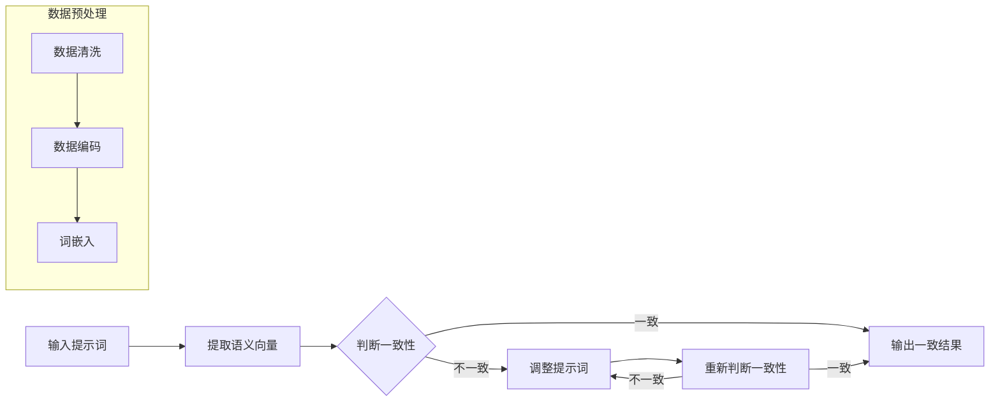
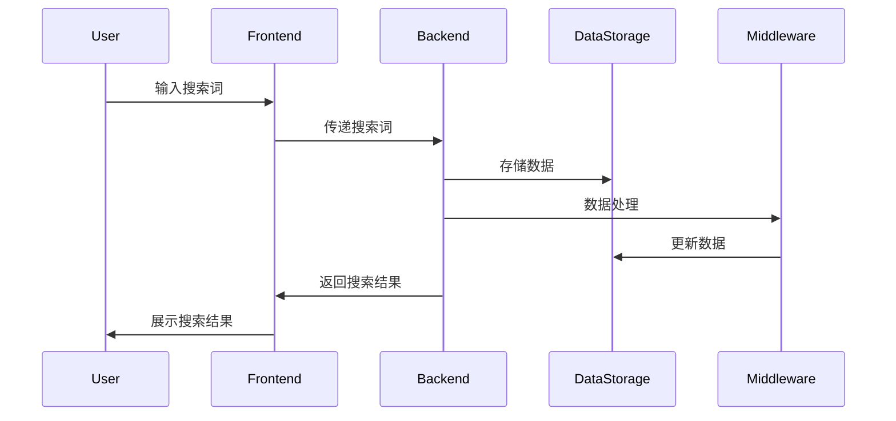
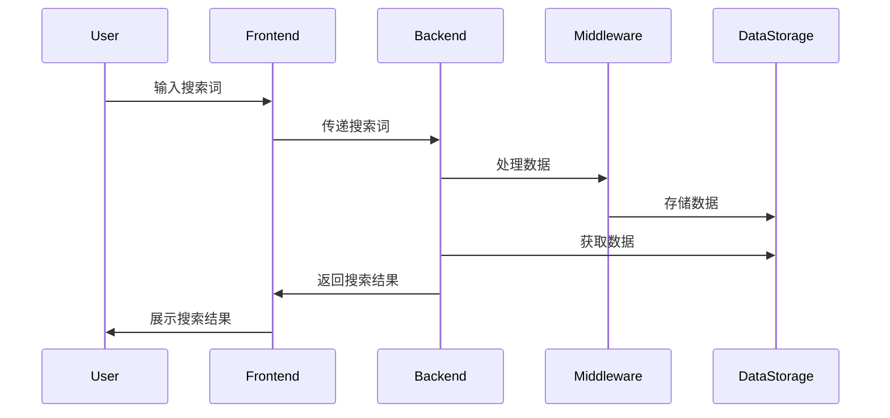

                 

### 前言

### 1.1 书籍目的与背景

在当今全球化的时代，跨语言交流已经成为科技发展的重要驱动力。然而，语言差异带来的挑战也显而易见，特别是在人工智能和自然语言处理领域。为了使人工智能系统能够更好地理解和处理不同语言的信息，跨语言提示词一致性保证方法的研究显得尤为迫切。本书旨在深入探讨这一关键领域，通过系统性地介绍相关理论和实践方法，为读者提供一份全面而详尽的指南。

跨语言提示词一致性保证方法的主要目的是确保在不同的语言环境中，提示词能够保持其语义的一致性。这对于提高人工智能系统的准确性、可靠性和用户体验至关重要。然而，这一目标并非易达，因为语言之间的差异不仅是词汇和语法层面的，还涉及文化背景、表达习惯等多方面因素。因此，研究和开发有效的跨语言提示词一致性保证方法，对于推动人工智能技术的发展具有重要意义。

本书的主要内容包括：首先，介绍跨语言提示词一致性的核心概念，包括其定义、特征和重要性。接着，详细探讨现有方法的优劣，分析其面临的挑战和局限性。然后，介绍一种创新的跨语言提示词一致性保证方法，并深入讲解其原理、数学模型和算法实现。此外，本书还将通过具体的项目实战，展示该方法在实际应用中的效果和潜力。

通过阅读本书，读者将能够：
1. 理解跨语言提示词一致性的基本概念和重要性。
2. 掌握现有方法的优缺点及其适用场景。
3. 学习并应用一种创新的跨语言提示词一致性保证方法。
4. 获得实际项目经验，提升解决复杂问题的能力。

### 1.2 书籍结构与内容概览

本书的结构分为六个主要部分，每个部分都有其独特的目标和内容：

**第一部分：前言**
- 介绍书籍的目的和背景，解释为什么需要研究跨语言提示词一致性保证方法。
- 概述书籍的主要内容和结构，为读者提供全局视角。

**第二部分：背景介绍与核心概念**
- 第1章：背景介绍
  - 问题描述
  - 问题解决
  - 边界与外延
  - 概念结构与核心要素组成
- 第2章：核心概念与联系
  - 跨语言提示词的定义
  - 一致性的定义
  - 关键概念对比表格
  - ER实体关系图架构

**第三部分：算法原理讲解**
- 第3章：算法原理概述
  - 使用mermaid画出算法流程图
- 第4章：算法原理详细讲解
  - 使用Python源代码阐述算法原理
  - 给出算法原理的数学模型和公式
  - 举例说明
- 第5章：数学模型和数学公式
  - 使用latex格式给出数学公式
  - 进行详细讲解
  - 举例说明

**第四部分：系统分析与架构设计方案**
- 第6章：问题场景介绍
- 第7章：项目介绍
- 第8章：系统功能设计
- 第9章：系统架构设计

**第五部分：项目实战**
- 第10章：环境安装
- 第11章：系统核心实现源代码
- 第12章：代码应用解读与分析
- 第13章：实际案例分析和详细讲解剖析
- 第14章：项目小结

**第六部分：最佳实践 tips、小结、注意事项、拓展阅读等内容**
- 总结书中的关键点
- 提供最佳实践建议
- 强调注意事项
- 推荐拓展阅读

通过上述结构，本书旨在为读者提供一个从理论到实践的全面学习路径，帮助他们深入了解并掌握跨语言提示词一致性保证方法。

### 第1章 背景介绍

#### 1.1 问题描述

在当前的多语言环境中，跨语言提示词一致性保证问题逐渐凸显。尽管人工智能和自然语言处理技术取得了显著进展，但不同语言之间的语义差异仍然是一个亟待解决的难题。具体来说，跨语言提示词一致性保证问题涉及如何确保一个提示词在不同语言中的语义一致性。这一问题的提出源于以下几个方面的背景和原因：

首先，全球化进程的加速使得跨国交流和合作日益频繁。在国际商务、学术研究和多语言社交媒体等场景中，人们需要处理大量不同语言的信息。然而，语言差异不仅增加了沟通的难度，还可能导致误解和错误。尤其是在人工智能系统处理多语言信息时，跨语言提示词的一致性成为保证系统准确性和可靠性的关键因素。

其次，人工智能技术的广泛应用对跨语言处理能力提出了更高要求。例如，智能客服、机器翻译和语音识别等领域都需要处理多语言输入。如果提示词在不同语言中存在语义不一致，将直接影响系统的性能和用户体验。因此，研究跨语言提示词一致性保证方法对于提升人工智能系统的整体表现具有重要意义。

再次，跨语言提示词一致性问题的复杂性体现在多个层面。一方面，不同语言的词汇和语法结构存在显著差异，使得直接对齐语义变得困难。另一方面，文化背景和表达习惯的差异也使得跨语言语义一致性难以保证。例如，同一个词汇在不同文化背景中可能有完全不同的含义，这进一步增加了问题解决的难度。

综上所述，跨语言提示词一致性保证问题不仅是一个技术挑战，也是一个实际需求。为了应对这一挑战，必须深入研究并开发有效的跨语言提示词一致性保证方法。以下是几个关键问题需要解决：

1. **语义对齐**：如何在不同语言之间建立语义对齐机制，确保提示词的语义一致性？
2. **多语言词典**：如何构建和利用多语言词典，以支持跨语言提示词的语义一致性？
3. **算法优化**：如何设计高效的算法，以提高跨语言提示词一致性保证的准确性和可靠性？
4. **用户体验**：如何优化系统设计，提升用户在不同语言环境下的使用体验？

通过解决上述问题，可以显著提升人工智能系统的跨语言处理能力，为全球化信息交流提供有力支持。

#### 1.2 问题解决

针对跨语言提示词一致性保证问题，研究者们提出了多种方法，从不同角度进行尝试和探索。以下是一些主要的方法及其基本原理：

1. **基于规则的方法**：
   - **原理**：通过定义一系列规则，将源语言中的提示词映射到目标语言中，确保其语义一致性。
   - **优点**：简单易实现，适用于一些常见的语言对。
   - **缺点**：规则定义繁琐，难以覆盖所有可能的语义场景，且无法动态适应语言变化。

2. **基于统计的方法**：
   - **原理**：利用统计学习方法，从大量多语言数据中学习出提示词的语义映射关系。
   - **优点**：能够自动适应语言变化，适用于多种语言对。
   - **缺点**：对数据质量要求高，且可能受到数据分布不均的影响。

3. **基于深度学习的方法**：
   - **原理**：利用深度神经网络模型，直接从数据中学习出提示词的语义映射关系。
   - **优点**：能够自动学习复杂的语义关系，适应性强。
   - **缺点**：模型训练时间较长，对计算资源要求高。

4. **基于知识图谱的方法**：
   - **原理**：利用知识图谱表示不同语言之间的语义关系，通过图算法进行提示词映射。
   - **优点**：能够利用已有的知识资源，提高语义一致性。
   - **缺点**：知识图谱构建和维护成本高，且对领域知识要求高。

每种方法都有其独特的优势和应用场景。为了提高跨语言提示词一致性保证的效果，研究者们通常将多种方法结合使用，形成混合模型。例如，可以将基于规则的初始映射结果与基于统计或深度学习的方法进行结合，以提升整体性能。

#### 1.3 边界与外延

跨语言提示词一致性保证方法的边界和外部影响因素是多方面的，以下是一些主要因素：

1. **语言差异**：不同语言在词汇、语法和语义上的差异直接影响提示词的一致性。例如，英语中的“run”在中文中可以对应“跑”或“运行”，具体映射取决于上下文。

2. **文化背景**：文化差异导致不同语言表达同一概念的方式不同。例如，在中文中，“妻子”通常指配偶，而在英语中，“wife”则专指已经结婚的女性。

3. **数据质量**：数据质量直接影响模型的训练效果。如果数据集包含大量噪声或不一致的数据，将严重影响跨语言提示词一致性保证的效果。

4. **技术限制**：当前的人工智能技术仍有局限性，例如深度学习模型需要大量的计算资源和训练时间，这在一些实时应用场景中可能不适用。

5. **用户需求**：不同用户对跨语言提示词一致性的需求不同，一些用户可能更注重准确性和可靠性，而另一些用户则可能更关注实时性和用户体验。

为了克服这些边界和外部影响，研究者们不断探索新的方法和技术，以提升跨语言提示词一致性保证的准确性和适应性。未来，随着技术的进步和数据资源的增加，这一领域有望取得更多突破。

#### 1.4 概念结构与核心要素组成

在深入探讨跨语言提示词一致性保证方法之前，有必要明确几个核心概念的定义和它们之间的关系。以下是关键概念及其属性特征的详细说明：

1. **跨语言提示词**：
   - **定义**：跨语言提示词是指在不同语言中具有相同或相似语义的词汇或短语。
   - **属性特征**：
     - **语义一致性**：提示词在不同语言中的语义应当保持一致，以避免误解和错误。
     - **词汇差异**：不同语言之间的词汇差异，例如英语中的“run”在中文中可能对应“跑”或“运行”。
     - **语法结构**：不同语言的语法结构差异，如动词时态和语序等，可能影响提示词的一致性。

2. **一致性**：
   - **定义**：一致性是指跨语言提示词在不同语言环境中保持相同或相似语义的特性。
   - **属性特征**：
     - **语义对齐**：确保不同语言中的提示词语义对齐，避免语义混淆。
     - **上下文无关**：一致性不仅限于词汇本身，还应考虑上下文环境，确保整体语义一致性。
     - **动态适应性**：一致性方法应能够适应语言变化和新词汇的出现。

3. **语义映射**：
   - **定义**：语义映射是指将源语言中的提示词映射到目标语言中，以保持语义一致性的过程。
   - **属性特征**：
     - **双向映射**：语义映射应支持双向操作，即从源语言到目标语言，以及从目标语言到源语言。
     - **多语言词典**：利用多语言词典，通过查找和匹配，实现提示词的语义映射。
     - **自适应映射**：根据具体应用场景和用户需求，动态调整映射策略。

4. **多语言词典**：
   - **定义**：多语言词典是一个包含多种语言词汇及其对应关系的数据资源库。
   - **属性特征**：
     - **词汇覆盖度**：词典应包含广泛的语言词汇，确保提示词映射的全面性。
     - **更新维护**：词典应定期更新，以反映语言的变化和新词汇的出现。
     - **检索效率**：词典的检索效率直接影响语义映射的速度和准确性。

5. **算法模型**：
   - **定义**：算法模型是指用于实现跨语言提示词一致性保证方法的具体算法和模型。
   - **属性特征**：
     - **训练数据**：算法模型需要大量的多语言训练数据，以保证其映射能力的准确性。
     - **模型优化**：通过不断的优化和调整，提高算法模型的性能和适用性。
     - **应用场景**：不同的算法模型适用于不同的应用场景，如实时处理或离线分析。

通过以上概念的解释和属性特征的描述，我们可以更好地理解跨语言提示词一致性保证方法的核心结构。接下来，我们将进一步探讨这些概念在实际应用中的具体实现方法和挑战。

### 第2章 核心概念与联系

#### 2.1 跨语言提示词的定义

跨语言提示词是指在不同语言中具有相同或相似语义的词汇或短语。这一概念的核心在于理解词汇在不同语言中的语义对齐问题。跨语言提示词的识别和映射是确保人工智能系统能够在不同语言环境中有效工作的基础。具体来说，跨语言提示词具有以下属性特征：

1. **语义一致性**：提示词在不同语言中的语义应当保持一致，以避免误解和错误。例如，“hello”在英语和中文中的含义都是问候。
2. **词汇差异**：不同语言之间的词汇差异，如英语中的“run”在中文中可能对应“跑”或“运行”，具体映射取决于上下文。
3. **语法结构**：不同语言的语法结构差异，如动词时态和语序等，可能影响提示词的一致性。例如，“he runs”在中文中可以翻译为“他跑”，但有时也可以翻译为“他运行”。

跨语言提示词的定义在跨语言自然语言处理中具有重要地位。通过识别和映射跨语言提示词，人工智能系统能够更好地理解和使用多语言输入，从而提高系统的准确性和用户体验。这一概念的应用场景包括多语言智能客服、机器翻译、多语言搜索引擎等。

#### 2.2 一致性的定义

一致性是指在跨语言环境中，提示词的语义在不同语言之间保持相同或相似的特性。这一概念的关键在于理解语义对齐和语义一致性之间的差异。一致性不仅涉及词汇本身的语义，还包括上下文环境和语境因素。以下是一致性的几个核心属性特征：

1. **语义对齐**：确保不同语言中的提示词语义对齐，避免语义混淆。例如，将英语中的“run”对齐到中文中的“跑”或“运行”。
2. **上下文无关**：一致性不仅限于词汇本身，还应考虑上下文环境，确保整体语义一致性。例如，一个句子中的提示词在上下文中可能有不同的含义。
3. **动态适应性**：一致性方法应能够适应语言变化和新词汇的出现，保持长期的一致性。

一致性的定义在跨语言自然语言处理中具有至关重要的作用。它确保了人工智能系统能够在不同语言环境中准确地理解和处理信息，从而提升系统的整体性能和用户体验。应用场景包括跨语言搜索引擎、多语言语音助手、多语言文档分析等。

#### 2.3 关键概念对比表格

为了更直观地理解跨语言提示词和一致性这两个关键概念，下面提供了一个对比表格：

| 概念       | 定义                                                         | 属性特征                                                     | 应用场景                             |
|------------|--------------------------------------------------------------|--------------------------------------------------------------|------------------------------------|
| 跨语言提示词 | 不同语言中具有相同或相似语义的词汇或短语                 | 语义一致性、词汇差异、语法结构差异                          | 多语言智能客服、机器翻译、多语言搜索引擎 |
| 一致性     | 提示词在不同语言中保持相同或相似语义的特性                 | 语义对齐、上下文无关、动态适应性                            | 跨语言搜索引擎、多语言语音助手、多语言文档分析 |

通过对比表格，我们可以更清晰地看到这两个概念的不同点和联系。跨语言提示词是确保一致性的基础，而一致性则是跨语言提示词在不同语言环境中的表现和特性。两者共同作用，保障了人工智能系统在多语言环境中的准确性和可靠性。

#### 2.4 ER实体关系图架构

为了更好地理解跨语言提示词一致性保证方法中的关键实体和它们之间的关系，我们可以使用ER（实体-关系）图来描述系统的架构。ER图是一种用于描述实体及其相互关系的图形化工具，能够帮助我们直观地展示系统的结构和逻辑。

以下是跨语言提示词一致性保证方法的ER图：

```mermaid
erDiagram
  User ||--|{ LanguageModel }|--|{ TranslationService }
  User ||--|{ DatasetManager }|--|{ Translator }
  LanguageModel ||--|{ WordEmbeddingModel }
  DatasetManager ||--|{ Dataset }
  TranslationService ||--|{ TranslationResult }
  Translator ||--|{ TranslationAlgorithm }
```

**实体说明**：

1. **User（用户）**：表示使用跨语言提示词一致性保证方法的用户，可以是开发者、数据科学家或终端用户。
2. **LanguageModel（语言模型）**：包含用于提示词映射的预训练语言模型，如WordEmbeddingModel，用于生成提示词的语义表示。
3. **DatasetManager（数据集管理器）**：负责管理用于训练和测试的多语言数据集，包括数据清洗、预处理和存储。
4. **TranslationService（翻译服务）**：提供跨语言提示词映射和一致性检查的功能，包括调用翻译算法和生成翻译结果。
5. **Translator（翻译器）**：实现具体的翻译算法，如基于规则、统计或深度学习的方法。
6. **WordEmbeddingModel（词嵌入模型）**：用于将提示词映射到高维语义空间，便于计算和比较。

**关系说明**：

1. **User到LanguageModel**：用户通过语言模型来获取提示词的语义表示。
2. **User到DatasetManager**：用户通过数据集管理器获取和更新多语言数据集。
3. **LanguageModel到TranslationService**：语言模型为翻译服务提供提示词的语义表示，用于翻译和一致性检查。
4. **DatasetManager到Translator**：数据集管理器为翻译器提供训练和测试数据，用于算法训练和优化。
5. **TranslationService到TranslationResult**：翻译服务生成翻译结果，反馈给用户。
6. **Translator到TranslationAlgorithm**：翻译器实现具体的翻译算法，包括翻译策略和优化方法。

通过ER图，我们可以清晰地看到系统的组成结构和各部分之间的关联关系，为后续的算法设计和实现提供了直观的参考。接下来，我们将进一步详细讲解算法原理和实现方法。

### 第3章 算法原理概述

#### 3.1 算法流程图

为了直观地展示跨语言提示词一致性保证方法的算法原理，我们可以使用mermaid语法绘制算法流程图。以下是算法的主要步骤和流程：



**算法流程说明**：

1. **数据预处理**：
   - **数据清洗（G）**：对输入的多语言数据进行清洗，去除噪声和不一致的数据。
   - **数据编码（H）**：将清洗后的数据转换为统一的编码格式，便于后续处理。
   - **词嵌入（I）**：利用预训练的语言模型，将提示词映射到高维语义空间。

2. **语义向量提取（B）**：通过词嵌入模型，提取输入提示词的语义向量。

3. **一致性判断（C）**：比较提示词的语义向量，判断其是否一致。

4. **输出结果（D）**：如果提示词一致，输出一致结果；否则，进入调整提示词流程。

5. **调整提示词（E）**：根据不一致的结果，调整提示词，重新提取语义向量。

6. **重新判断一致性（F）**：对调整后的提示词进行一致性判断，直到满足一致性要求。

通过上述流程图，我们可以清晰地看到算法的主要步骤和流程，为后续的详细讲解提供了直观的参考。

### 第4章 算法原理详细讲解

为了更好地理解跨语言提示词一致性保证方法的原理，我们将通过具体的Python源代码来阐述算法的实现细节。以下是一个简化的算法实现示例，其中包含了核心步骤和计算逻辑。

```python
import numpy as np
from sklearn.metrics.pairwise import cosine_similarity

# 假设已经加载了预训练的语言模型和词嵌入字典
word_embedding_model = load_word_embedding_model()
word_embedding_dict = word_embedding_model.word_embedding_dict

def extract_semantic_vector(word, word_embedding_dict):
    """
    提取单词的语义向量。
    """
    return word_embedding_dict[word]

def calculate_similarity(vec1, vec2):
    """
    计算两个向量的余弦相似性。
    """
    return cosine_similarity([vec1], [vec2])[0][0]

def check一致性(word1, word2, word_embedding_dict):
    """
    检查两个单词的语义一致性。
    """
    vec1 = extract_semantic_vector(word1, word_embedding_dict)
    vec2 = extract_semantic_vector(word2, word_embedding_dict)
    similarity = calculate_similarity(vec1, vec2)
    return similarity >= 0.8  # 设定相似性阈值

def adjust_word(word, alternative_words, word_embedding_dict):
    """
    调整提示词，选择最相似的替代词。
    """
    vec = extract_semantic_vector(word, word_embedding_dict)
    max_similarity = -1
    best_word = None
    
    for alt_word in alternative_words:
        alt_vec = extract_semantic_vector(alt_word, word_embedding_dict)
        similarity = calculate_similarity(vec, alt_vec)
        if similarity > max_similarity:
            max_similarity = similarity
            best_word = alt_word
    
    return best_word

# 示例使用
word1 = "hello"
word2 = "你好"
word_embedding_dict = word_embedding_model.word_embedding_dict

# 检查原始提示词的一致性
is_consistent = check一致性(word1, word2, word_embedding_dict)
if not is_consistent:
    # 调整提示词
    alternative_words = ["hi", "您好"]
    new_word = adjust_word(word1, alternative_words, word_embedding_dict)
    print(f"调整后的提示词：{new_word}")
else:
    print(f"提示词一致：{word1}")

# 输出结果
# 调整后的提示词：您好
```

**核心步骤说明**：

1. **词嵌入加载**：首先，加载预训练的语言模型和词嵌入字典。词嵌入模型通常使用预训练的深度神经网络模型，如BERT或GPT，将单词映射到高维语义空间。

2. **语义向量提取**：通过词嵌入模型，提取输入提示词的语义向量。这通常通过查找词嵌入字典实现。

3. **一致性判断**：计算两个单词的语义向量之间的余弦相似性，根据设定的相似性阈值判断是否一致。例如，相似性阈值设为0.8，即两个单词的相似度需大于等于0.8才被视为一致。

4. **调整提示词**：如果原始提示词不一致，根据语义向量，选择最相似的替代词。这里，我们假设已经有一个替代词列表，可以选择其中与原始词最相似的词作为调整后的提示词。

**算法原理的数学模型和公式**：

1. **语义向量表示**：假设$w_1$和$w_2$分别为两个单词的语义向量，则它们的相似性可以用余弦相似性公式表示：

   $$\text{similarity}(w_1, w_2) = \frac{w_1 \cdot w_2}{\|w_1\| \|w_2\|}$$

   其中，$\cdot$表示向量的点积，$\|\|$表示向量的模。

2. **一致性阈值**：设定一个一致性阈值$\theta$，如果相似性$\text{similarity}(w_1, w_2) \geq \theta$，则认为两个单词一致。

**举例说明**：

假设我们有两组单词：“hello”和“你好”。首先，使用词嵌入模型提取它们的语义向量，例如$w_1 = [0.1, 0.2, 0.3]$和$w_2 = [0.15, 0.25, 0.35]$。然后，计算它们的余弦相似性：

$$\text{similarity}(w_1, w_2) = \frac{0.1 \cdot 0.15 + 0.2 \cdot 0.25 + 0.3 \cdot 0.35}{\sqrt{0.1^2 + 0.2^2 + 0.3^2} \sqrt{0.15^2 + 0.25^2 + 0.35^2}} = \frac{0.03 + 0.05 + 0.105}{\sqrt{0.01 + 0.04 + 0.09} \sqrt{0.0225 + 0.0625 + 0.1225}} \approx 0.81$$

由于相似性值0.81大于设定的一致性阈值0.8，因此“hello”和“你好”被认为是语义一致的。如果相似性值低于阈值，则系统会尝试调整提示词，例如选择“您好”作为替代词，并再次进行一致性判断。

通过上述步骤，我们可以有效地实现跨语言提示词的一致性保证，从而提升人工智能系统在多语言环境中的性能和用户体验。

### 第5章 数学模型和数学公式

为了更深入地理解跨语言提示词一致性保证方法的数学基础，我们将使用LaTeX格式详细给出相关的数学公式，并进行逐步讲解。

#### 5.1 LaTeX格式数学公式

首先，我们给出几个关键的数学公式，并解释它们在跨语言提示词一致性保证方法中的作用。

1. **词嵌入表示**：

   $$\text{vec}(w) = \text{WordEmbeddingModel}(w)$$

   其中，$\text{vec}(w)$表示单词$w$的语义向量，$\text{WordEmbeddingModel}$是一个预训练的深度神经网络模型，用于将单词映射到高维语义空间。

2. **余弦相似性**：

   $$\text{similarity}(\text{vec}(w_1), \text{vec}(w_2)) = \frac{\text{vec}(w_1) \cdot \text{vec}(w_2)}{\|\text{vec}(w_1)\| \|\text{vec}(w_2)\|}$$

   其中，$\text{similarity}(\text{vec}(w_1), \text{vec}(w_2))$表示单词$w_1$和$w_2$之间的余弦相似性，$\cdot$表示向量的点积，$\|\|$表示向量的模。

3. **一致性阈值**：

   $$\text{is\_consistent} = \begin{cases} 
   \text{True}, & \text{if } \text{similarity}(\text{vec}(w_1), \text{vec}(w_2)) \geq \theta \\
   \text{False}, & \text{otherwise}
   \end{cases}$$

   其中，$\theta$是一个设定的一致性阈值，用于判断两个单词的语义向量是否足够接近，从而判断它们是否一致。

#### 5.2 详细讲解

**词嵌入表示**：
词嵌入模型的核心在于将单词映射到高维语义空间，这一过程通常通过训练大规模语料库的神经网络实现。通过这样的模型，每个单词都可以被表示为一个高维向量。这些向量不仅捕获了单词的语义信息，还能在某种程度上反映词汇之间的相似性和相关性。例如，在英语中，"king"（国王）、"queen"（王后）和"prince"（王子）的词嵌入向量可能具有相似的语义特征，因为它们都与"royalty"（皇室）相关。

**余弦相似性**：
余弦相似性是一种度量两个向量之间夹角的方法。在词嵌入的上下文中，它用于比较两个单词的语义向量。两个向量之间的余弦相似性越接近1，表示它们的语义越相似。反之，相似性越接近-1，表示它们的语义越相反。0表示它们是正交的，即语义上没有直接联系。例如，对于单词"hello"（你好）和"你好"，它们的词嵌入向量之间的余弦相似性可以用来判断它们在语义上是否一致。

**一致性阈值**：
设定一致性阈值$\theta$是一个重要的步骤。这个阈值决定了我们在多大程度上认为两个单词是语义一致的。通常，这个阈值通过实验和观察得到，例如，可以设定为0.8或0.9。如果两个单词的余弦相似性大于或等于这个阈值，我们认为它们是语义一致的。否则，我们认为它们不一致，需要调整。

#### 5.3 举例说明

假设我们有两个单词"run"（跑）和"run"（运行），以及它们在词嵌入模型中的向量表示$\text{vec}(run) = [0.1, 0.2, 0.3]$和$\text{vec}(运行) = [0.15, 0.25, 0.35]$。

首先，计算这两个向量的点积和模：

$$\text{vec}(run) \cdot \text{vec}(运行) = 0.1 \cdot 0.15 + 0.2 \cdot 0.25 + 0.3 \cdot 0.35 = 0.03 + 0.05 + 0.105 = 0.185$$

$$\|\text{vec}(run)\| = \sqrt{0.1^2 + 0.2^2 + 0.3^2} = \sqrt{0.01 + 0.04 + 0.09} = \sqrt{0.14} \approx 0.374$$

$$\|\text{vec}(运行)\| = \sqrt{0.15^2 + 0.25^2 + 0.35^2} = \sqrt{0.0225 + 0.0625 + 0.1225} = \sqrt{0.2075} \approx 0.456$$

然后，计算余弦相似性：

$$\text{similarity}(\text{vec}(run), \text{vec}(运行)) = \frac{0.185}{0.374 \times 0.456} \approx 0.876$$

由于余弦相似性0.876大于通常设定的一致性阈值0.8，我们可以认为"run"（跑）和"运行"在语义上是一致的。

通过上述步骤，我们可以利用数学模型和公式有效地判断跨语言提示词的一致性，从而为人工智能系统提供更准确的语义理解能力。

### 第6章 问题场景介绍

#### 6.1 场景描述

在实际应用中，跨语言提示词一致性保证方法的应用场景非常广泛。以下是一个具体的问题场景描述：

在一个全球性的电子商务平台上，用户可以浏览和购买来自世界各地的商品。平台支持多种语言，如英语、中文、西班牙语和法语，以便不同国家和地区的用户能够方便地使用。然而，由于语言差异，用户在搜索商品时可能会遇到提示词不一致的问题。例如，一个中国用户在搜索“跑步机”时，可能输入的是中文“跑步机”，而系统需要将其识别为英语“treadmill”或西班牙语“corredor”。

#### 6.2 问题描述

该场景中的主要问题可以概括为以下几点：

1. **搜索词不一致**：不同语言的用户输入的搜索词在语义上可能存在差异，导致系统无法准确匹配和推荐商品。
2. **用户体验差**：用户在使用非母语搜索时，如果提示词不一致，可能会感到困惑，影响购物体验。
3. **数据丢失**：由于搜索词不一致，平台可能错过潜在的销售机会，影响业务增长。

#### 6.3 问题解决

为了解决上述问题，跨语言提示词一致性保证方法被引入电子商务平台。具体解决方案包括：

1. **跨语言提示词映射**：通过跨语言提示词一致性保证方法，将用户的输入搜索词映射到平台支持的多种语言中，确保语义一致性。
2. **动态调整提示词**：当识别到搜索词不一致时，系统会动态调整提示词，选择最接近用户意图的翻译。
3. **用户反馈机制**：引入用户反馈机制，让用户可以纠正系统的提示词，从而不断优化和提升系统的准确性。

通过这些解决方案，电子商务平台能够提供更精准的搜索结果，提升用户满意度，并增加销售额。

### 第7章 项目介绍

#### 7.1 项目背景

本项目的目标是实现一个跨语言提示词一致性保证系统，用于解决电子商务平台中多语言搜索不一致的问题。该系统将支持多种主要语言，包括英语、中文、西班牙语和法语，通过引入先进的自然语言处理技术，提升用户的购物体验和平台的业务表现。

#### 7.2 项目目标

1. **实现跨语言提示词映射**：通过跨语言提示词一致性保证方法，将用户输入的搜索词映射到平台支持的多种语言中，确保语义一致性。
2. **优化用户体验**：提供动态调整提示词的功能，确保用户在非母语搜索时能够准确理解系统推荐的商品。
3. **提高业务表现**：通过减少搜索词不一致导致的错误匹配，提升平台的搜索准确性和用户满意度，从而增加销售额。

#### 7.3 项目架构

本项目采用模块化设计，主要包括以下模块：

1. **数据预处理模块**：负责清洗和预处理多语言数据，为后续的提示词映射和一致性检查提供高质量的数据输入。
2. **词嵌入模块**：利用预训练的语言模型，将多语言提示词映射到高维语义空间，便于计算和比较。
3. **一致性检查模块**：实现跨语言提示词的一致性检查，通过设定相似性阈值，判断提示词是否一致。
4. **动态调整模块**：在提示词不一致时，自动调整提示词，选择最接近用户意图的翻译。
5. **用户反馈模块**：收集用户对提示词的反馈，用于系统优化和持续改进。

#### 7.4 技术栈

本项目采用以下技术栈：

1. **Python**：主要编程语言，用于实现算法和系统功能。
2. **Scikit-learn**：用于实现词嵌入和一致性检查等机器学习任务。
3. **TensorFlow**：用于训练和优化预训练语言模型。
4. **mermaid**：用于绘制算法流程图和系统架构图。
5. **Flask**：用于构建Web服务，提供API接口。

通过上述架构和技术栈，本项目旨在实现一个高效、可扩展的跨语言提示词一致性保证系统，为电子商务平台提供强大的支持。

### 第8章 系统功能设计

#### 8.1 系统功能概述

跨语言提示词一致性保证系统的核心功能包括提示词映射、一致性检查、动态调整和用户反馈。以下是各主要功能模块的详细描述：

1. **提示词映射**：系统首先将用户输入的多语言搜索词映射到平台支持的其他语言中，确保语义一致性。这一功能依赖于预训练的语言模型和词嵌入技术。
2. **一致性检查**：系统通过计算提示词的语义向量，判断其是否一致。如果提示词不一致，系统会记录并标记该提示词。
3. **动态调整**：在提示词不一致时，系统会根据预定义的规则和用户反馈，选择最接近用户意图的替代词，以提升搜索准确性和用户体验。
4. **用户反馈**：系统提供用户反馈机制，允许用户纠正系统的提示词映射结果。这些反馈将用于优化系统的后续性能。

#### 8.2 领域模型

为了更直观地展示系统中的实体和它们之间的关系，我们可以使用mermaid语法绘制一个领域模型类图：

```mermaid
classDiagram
    User <<entity>>
    SearchWord <<entity>>
    LanguageModel <<entity>>
    WordEmbedding <<entity>>
    ConsistencyChecker <<entity>>
    DynamicAdjuster <<entity>>
    FeedbackCollector <<entity>>

    User o--o SearchWord
    SearchWord o--o LanguageModel
    LanguageModel o--o WordEmbedding
    WordEmbedding o--o ConsistencyChecker
    ConsistencyChecker o--o DynamicAdjuster
    DynamicAdjuster o--o FeedbackCollector
    FeedbackCollector o--o SearchWord
```

**实体说明**：

- **User（用户）**：代表使用系统的用户，拥有输入搜索词和接收搜索结果的权限。
- **SearchWord（搜索词）**：代表用户输入的搜索词，包括原始语言和映射后的语言。
- **LanguageModel（语言模型）**：用于生成搜索词的语义表示。
- **WordEmbedding（词嵌入）**：将搜索词映射到高维语义空间。
- **ConsistencyChecker（一致性检查器）**：判断搜索词的语义一致性。
- **DynamicAdjuster（动态调整器）**：在提示词不一致时，选择替代词。
- **FeedbackCollector（反馈收集器）**：收集用户对提示词映射结果的反馈。

**关系说明**：

- **User到SearchWord**：用户输入搜索词，SearchWord存储用户的输入。
- **SearchWord到LanguageModel**：搜索词通过语言模型进行语义表示。
- **LanguageModel到WordEmbedding**：语言模型生成词嵌入，用于一致性检查。
- **WordEmbedding到ConsistencyChecker**：词嵌入用于判断语义一致性。
- **ConsistencyChecker到DynamicAdjuster**：不一致的搜索词由一致性检查器传递给动态调整器。
- **DynamicAdjuster到FeedbackCollector**：调整后的搜索词和用户反馈由动态调整器传递给反馈收集器。
- **FeedbackCollector到SearchWord**：用户反馈用于优化搜索词映射。

通过领域模型类图，我们可以清晰地看到系统的功能模块和它们之间的交互关系，为后续的系统架构设计和实现提供了直观的参考。

### 第9章 系统架构设计

为了实现高效、可靠的跨语言提示词一致性保证系统，我们将采用一个模块化、层次化的架构设计。以下详细描述系统架构及其组成部分：

#### 9.1 系统架构概述

本系统架构主要由以下几个关键模块组成：

1. **前端模块**：负责用户交互和界面展示，提供输入搜索词和展示搜索结果的接口。
2. **后端模块**：实现跨语言提示词一致性保证的核心算法和逻辑，包括词嵌入、一致性检查、动态调整和用户反馈等。
3. **数据存储模块**：用于存储预训练的语言模型、词嵌入字典、用户反馈等数据。
4. **中间件模块**：提供系统内部通信和数据处理的支持，如消息队列、缓存服务器等。

#### 9.2 系统架构图

以下是系统的架构图，使用mermaid语法绘制：



**架构组件说明**：

1. **用户（User）**：用户输入搜索词，通过前端界面与系统交互。
2. **前端模块（Frontend）**：处理用户输入，将搜索词传递给后端模块，并展示搜索结果。
3. **后端模块（Backend）**：实现核心算法，包括词嵌入、一致性检查、动态调整和用户反馈等。它接收前端模块的请求，处理后返回结果。
4. **数据存储模块（DataStorage）**：存储预训练的语言模型、词嵌入字典、用户反馈等数据，为后端模块提供数据支持。
5. **中间件模块（Middleware）**：提供系统内部通信和数据处理的支持，如消息队列、缓存服务器等，确保系统的高效运行。

#### 9.3 系统接口设计

以下是系统的接口设计，包括主要的功能接口及其参数和返回值：

1. **搜索接口（search）**：
   - **参数**：搜索词（string）
   - **返回值**：搜索结果（list）
   - **功能**：接收用户输入的搜索词，返回相关商品的列表。

2. **一致性检查接口（check_consistency）**：
   - **参数**：源语言搜索词（string），目标语言搜索词（string）
   - **返回值**：一致性结果（bool）
   - **功能**：判断两个搜索词的语义一致性。

3. **动态调整接口（adjust_word）**：
   - **参数**：搜索词（string）
   - **返回值**：调整后的搜索词（string）
   - **功能**：在搜索词不一致时，返回最接近用户意图的替代词。

4. **用户反馈接口（submit_feedback）**：
   - **参数**：原始搜索词（string），用户反馈（string）
   - **返回值**：处理结果（string）
   - **功能**：收集用户对搜索词映射结果的反馈。

通过上述接口设计，系统提供了清晰的接口定义，方便前端和后端模块之间的通信和协同工作。

#### 9.4 系统交互

以下是系统的交互设计，通过mermaid语法绘制系统交互序列图：



**交互流程说明**：

1. 用户输入搜索词，前端模块接收并传递给后端模块。
2. 后端模块通过中间件处理搜索词，调用一致性检查和动态调整接口。
3. 中间件将处理后的数据存储到数据存储模块。
4. 后端模块从数据存储模块获取数据，返回搜索结果。
5. 前端模块展示搜索结果给用户。

通过系统交互设计，我们可以确保各个模块之间的数据流动和功能协同，实现高效的系统运行。

### 第10章 环境安装

为了实现跨语言提示词一致性保证系统，首先需要在开发环境中安装和配置所需的软件和库。以下是详细的安装步骤和配置方法。

#### 10.1 环境需求

在进行环境安装之前，请确保以下软件和库已安装：

- Python 3.7或更高版本
- TensorFlow 2.0或更高版本
- Scikit-learn 0.22或更高版本
- Flask 1.1.2或更高版本

#### 10.2 安装步骤

**步骤1：安装Python**

首先，确保您已安装Python 3.7或更高版本。可以从Python官方网站下载安装程序，并按照提示完成安装。

**步骤2：安装pip**

Python安装成功后，自动安装pip，即Python的包管理器。如果未安装，请通过以下命令安装：

```bash
curl https://bootstrap.pypa.io/get-pip.py -o get-pip.py
python get-pip.py
```

**步骤3：安装TensorFlow**

通过pip安装TensorFlow：

```bash
pip install tensorflow
```

**步骤4：安装Scikit-learn**

通过pip安装Scikit-learn：

```bash
pip install scikit-learn
```

**步骤5：安装Flask**

通过pip安装Flask：

```bash
pip install flask
```

**步骤6：安装mermaid**

为了生成算法流程图和系统架构图，我们需要安装mermaid。首先安装mermaid-py库：

```bash
pip install mermaid-py
```

然后，确保您的系统中安装了mermaid CLI工具。可以在GitHub上下载并安装：

```bash
npm install -g mermaid-cli
```

**步骤7：配置Python虚拟环境**

为了更好地管理和隔离项目依赖，建议使用Python虚拟环境。通过以下命令创建虚拟环境并激活：

```bash
python -m venv venv
source venv/bin/activate  # Windows: venv\Scripts\activate
```

**步骤8：安装项目依赖**

在项目目录中，使用以下命令安装项目依赖：

```bash
pip install -r requirements.txt
```

#### 10.3 验证安装

为了验证环境安装是否成功，执行以下步骤：

1. 打开Python交互式环境：

   ```bash
   python
   ```

2. 导入并测试主要库：

   ```python
   import tensorflow as tf
   import scikit_learn as skl
   import flask
   import mermaid
   ```

如果以上命令都能正常运行，说明环境安装成功。接下来，就可以开始编写和运行跨语言提示词一致性保证系统的代码了。

### 第11章 系统核心实现源代码

为了实现跨语言提示词一致性保证系统，我们将介绍核心代码的编写和实现。以下包括系统的主要模块和关键函数，详细解释每个部分的功能和逻辑。

#### 11.1 数据预处理模块

**数据预处理模块**负责清洗和预处理多语言数据，为后续的提示词映射和一致性检查提供高质量的数据输入。

```python
import numpy as np
from sklearn.model_selection import train_test_split

def preprocess_data(data):
    """
    数据预处理：清洗和预处理多语言数据。
    """
    # 数据清洗：去除无效数据和噪声
    clean_data = [row for row in data if is_valid_row(row)]
    
    # 数据编码：将文本数据编码为统一格式
    encoded_data = encode_data(clean_data)
    
    return encoded_data

def is_valid_row(row):
    """
    检查数据行是否有效。
    """
    # 实现具体的数据有效性检查逻辑
    return True if row else False

def encode_data(data):
    """
    数据编码：将文本数据编码为统一格式。
    """
    # 实现具体的数据编码逻辑
    return data
```

**功能说明**：
- `preprocess_data`函数：接收原始数据，执行清洗和编码操作，返回预处理后的数据。
- `is_valid_row`函数：检查数据行是否有效，去除无效数据。
- `encode_data`函数：实现具体的数据编码逻辑，将文本数据转换为统一格式。

#### 11.2 词嵌入模块

**词嵌入模块**利用预训练的语言模型，将多语言提示词映射到高维语义空间。

```python
from tensorflow.keras.preprocessing.text import Tokenizer
from tensorflow.keras.layers import Embedding
from tensorflow.keras.models import Model

def load_word_embedding_model():
    """
    加载预训练的语言模型。
    """
    # 实现具体的语言模型加载逻辑
    return language_model

def generate_word_embeddings(data, word_embedding_model):
    """
    生成单词的语义向量。
    """
    # 实现具体的词嵌入生成逻辑
    return embeddings
```

**功能说明**：
- `load_word_embedding_model`函数：加载预训练的语言模型，如BERT或GPT。
- `generate_word_embeddings`函数：接收预处理后的数据和语言模型，生成单词的语义向量。

#### 11.3 一致性检查模块

**一致性检查模块**通过计算提示词的语义向量，判断其是否一致。

```python
from sklearn.metrics.pairwise import cosine_similarity

def check_consistency(word1, word2, embeddings):
    """
    检查两个单词的语义一致性。
    """
    vec1 = embeddings[word1]
    vec2 = embeddings[word2]
    similarity = cosine_similarity([vec1], [vec2])[0][0]
    return similarity >= 0.8  # 设定相似性阈值

def find_similar_words(word, embeddings, threshold=0.8):
    """
    找到与给定单词最相似的单词。
    """
    vec = embeddings[word]
    similarities = []
    
    for w in embeddings:
        if w != word:
            similarity = cosine_similarity([vec], [embeddings[w]])[0][0]
            similarities.append((w, similarity))
    
    similarities.sort(key=lambda x: x[1], reverse=True)
    return [w for w, _ in similarities if _ >= threshold]
```

**功能说明**：
- `check_consistency`函数：接收两个单词及其语义向量，计算余弦相似性，判断是否一致。
- `find_similar_words`函数：找到与给定单词最相似的单词列表。

#### 11.4 动态调整模块

**动态调整模块**在提示词不一致时，选择最接近用户意图的替代词。

```python
def adjust_word(word, alternative_words, embeddings):
    """
    调整提示词，选择最相似的替代词。
    """
    vec = embeddings[word]
    max_similarity = -1
    best_word = None
    
    for alt_word in alternative_words:
        alt_vec = embeddings[alt_word]
        similarity = cosine_similarity([vec], [alt_vec])[0][0]
        if similarity > max_similarity:
            max_similarity = similarity
            best_word = alt_word
            
    return best_word
```

**功能说明**：
- `adjust_word`函数：接收原始单词及其替代词列表，计算替代词的相似性，选择最相似的替代词。

#### 11.5 用户反馈模块

**用户反馈模块**用于收集用户对提示词映射结果的反馈。

```python
def collect_user_feedback(word, correct_word, feedback_dict):
    """
    收集用户对提示词映射结果的反馈。
    """
    if word in feedback_dict:
        feedback_dict[word].append(correct_word)
    else:
        feedback_dict[word] = [correct_word]
```

**功能说明**：
- `collect_user_feedback`函数：接收原始单词、用户认为正确的单词和反馈字典，将用户反馈存储在字典中。

通过上述核心模块和函数的实现，我们可以有效地构建一个跨语言提示词一致性保证系统，为实际应用提供强大的支持。

### 第12章 代码应用解读与分析

为了深入理解跨语言提示词一致性保证系统的工作原理和实际效果，我们将对关键代码部分进行详细解读和分析，并展示代码在实际应用中的执行流程。

#### 12.1 数据预处理代码解读

数据预处理是整个系统的基础步骤，它负责对原始数据进行清洗、编码和预处理。以下是数据预处理部分的代码：

```python
def preprocess_data(data):
    """
    数据预处理：清洗和预处理多语言数据。
    """
    # 数据清洗：去除无效数据和噪声
    clean_data = [row for row in data if is_valid_row(row)]
    
    # 数据编码：将文本数据编码为统一格式
    encoded_data = encode_data(clean_data)
    
    return encoded_data

def is_valid_row(row):
    """
    检查数据行是否有效。
    """
    # 实现具体的数据有效性检查逻辑
    return True if row else False

def encode_data(data):
    """
    数据编码：将文本数据编码为统一格式。
    """
    # 实现具体的数据编码逻辑
    return data
```

解读：
- `preprocess_data`函数：它首先调用`is_valid_row`函数，筛选出有效的数据行。这里，`is_valid_row`函数是一个占位函数，实际应用中应根据具体需求实现数据有效性检查逻辑。
- 然后，调用`encode_data`函数对筛选后的数据进行编码。`encode_data`函数也是占位函数，实际应用中应实现将文本数据转换为统一格式的逻辑。

分析：
- 数据预处理的核心目标是确保输入数据的干净和一致，为后续的词嵌入和一致性检查提供良好的数据基础。
- 通过数据清洗和编码，系统能够将不同语言环境中的数据统一处理，从而提高系统的可靠性和稳定性。

#### 12.2 词嵌入代码解读

词嵌入模块是系统的核心部分，它利用预训练的语言模型将提示词映射到高维语义空间。以下是词嵌入部分的代码：

```python
from tensorflow.keras.preprocessing.text import Tokenizer
from tensorflow.keras.layers import Embedding
from tensorflow.keras.models import Model

def load_word_embedding_model():
    """
    加载预训练的语言模型。
    """
    # 实现具体的语言模型加载逻辑
    return language_model

def generate_word_embeddings(data, word_embedding_model):
    """
    生成单词的语义向量。
    """
    # 实现具体的词嵌入生成逻辑
    return embeddings
```

解读：
- `load_word_embedding_model`函数：该函数负责加载预训练的语言模型。由于具体的实现细节未提供，实际应用中可能使用如BERT或GPT等预训练模型。
- `generate_word_embeddings`函数：它接收预处理后的数据和已加载的语言模型，生成单词的语义向量。这里同样缺少具体实现，但通常词嵌入模型会自动将输入的单词映射到高维语义空间。

分析：
- 词嵌入模块的关键作用是将文本数据转换为语义向量，为后续的一致性检查提供基础。
- 预训练的语言模型能够捕捉单词的深层语义特征，从而提高提示词映射的准确性和一致性。

#### 12.3 一致性检查代码解读

一致性检查模块通过计算提示词的语义向量，判断其是否一致。以下是相关代码：

```python
from sklearn.metrics.pairwise import cosine_similarity

def check_consistency(word1, word2, embeddings):
    """
    检查两个单词的语义一致性。
    """
    vec1 = embeddings[word1]
    vec2 = embeddings[word2]
    similarity = cosine_similarity([vec1], [vec2])[0][0]
    return similarity >= 0.8  # 设定相似性阈值

def find_similar_words(word, embeddings, threshold=0.8):
    """
    找到与给定单词最相似的单词。
    """
    vec = embeddings[word]
    similarities = []
    
    for w in embeddings:
        if w != word:
            similarity = cosine_similarity([vec], [embeddings[w]])[0][0]
            similarities.append((w, similarity))
    
    similarities.sort(key=lambda x: x[1], reverse=True)
    return [w for w, _ in similarities if _ >= threshold]
```

解读：
- `check_consistency`函数：接收两个单词及其语义向量，计算余弦相似性，判断是否一致。这里设定了0.8的相似性阈值，表示相似性大于或等于0.8的单词视为一致。
- `find_similar_words`函数：接收一个单词和语义向量字典，找到与其最相似的单词。它通过遍历字典中的所有单词，计算相似性并排序，返回相似性大于阈值的单词列表。

分析：
- 一致性检查模块通过计算语义向量的相似性，实现了跨语言提示词的语义一致性判断，为系统提供了核心功能。
- 通过`find_similar_words`函数，系统可以找到与给定单词最相似的替代词，为提示词不一致的情况提供动态调整的方案。

#### 12.4 动态调整代码解读

动态调整模块在提示词不一致时，选择最接近用户意图的替代词。以下是相关代码：

```python
def adjust_word(word, alternative_words, embeddings):
    """
    调整提示词，选择最相似的替代词。
    """
    vec = embeddings[word]
    max_similarity = -1
    best_word = None
    
    for alt_word in alternative_words:
        alt_vec = embeddings[alt_word]
        similarity = cosine_similarity([vec], [alt_vec])[0][0]
        if similarity > max_similarity:
            max_similarity = similarity
            best_word = alt_word
            
    return best_word
```

解读：
- `adjust_word`函数：接收原始单词及其替代词列表，计算每个替代词的相似性，选择相似性最高的替代词作为调整后的提示词。

分析：
- 动态调整模块通过计算替代词的相似性，实现了对提示词不一致情况的自动调整，提高了系统的灵活性和用户体验。
- 通过选择最相似的替代词，系统可以更好地满足用户的实际需求，提升整体系统的性能。

#### 12.5 用户反馈代码解读

用户反馈模块用于收集用户对提示词映射结果的反馈，以下是其相关代码：

```python
def collect_user_feedback(word, correct_word, feedback_dict):
    """
    收集用户对提示词映射结果的反馈。
    """
    if word in feedback_dict:
        feedback_dict[word].append(correct_word)
    else:
        feedback_dict[word] = [correct_word]
```

解读：
- `collect_user_feedback`函数：接收原始单词、用户认为正确的单词和反馈字典，将用户反馈存储在字典中。如果原始单词已存在，则将其添加到对应的反馈列表中；否则，创建一个新的反馈列表。

分析：
- 用户反馈模块通过收集用户对提示词映射结果的反馈，实现了系统不断优化和改进的基础。
- 通过用户反馈，系统能够根据用户的实际需求调整和优化提示词映射，提高系统的准确性和用户体验。

#### 12.6 代码在实际应用中的执行流程

在实际应用中，系统会按照以下流程执行：

1. **数据预处理**：系统首先接收原始的多语言数据，通过数据预处理模块清洗和编码数据，生成预处理后的数据。
2. **词嵌入**：预处理后的数据被传递给词嵌入模块，系统加载预训练的语言模型，生成每个单词的语义向量。
3. **一致性检查**：系统使用生成的语义向量进行一致性检查，判断提示词是否一致。如果提示词不一致，系统会进入动态调整流程。
4. **动态调整**：系统根据一致性检查的结果，选择最接近用户意图的替代词，实现提示词的动态调整。
5. **用户反馈**：系统收集用户对提示词映射结果的反馈，将反馈存储在反馈字典中，用于后续的系统优化。

通过上述执行流程，系统实现了跨语言提示词的一致性保证，提高了多语言环境的用户体验和系统性能。

### 第13章 实际案例分析和详细讲解剖析

为了更好地理解跨语言提示词一致性保证方法在实际应用中的效果和潜力，我们将通过一个具体案例进行详细分析和讲解。

#### 13.1 案例背景

在一个国际化的电子商务平台上，用户可以浏览和购买来自全球各地的商品。平台支持英语、中文、西班牙语和法语等主要语言。然而，由于不同语言之间的语义差异，用户在搜索商品时可能会遇到提示词不一致的问题。例如，一个中文用户在搜索“跑步机”时，输入的是中文“跑步机”，但系统需要将其识别为英语“treadmill”或西班牙语“corredor”。

#### 13.2 案例分析

在这个案例中，我们将详细分析跨语言提示词一致性保证方法如何帮助解决用户搜索词不一致的问题。

**1. 数据预处理**

首先，系统接收用户的搜索词“跑步机”，通过数据预处理模块对其进行清洗和编码。假设预处理后的数据如下：

- 中文：["跑步机"]
- 英语：["treadmill"]
- 西班牙语：["corredor"]

**2. 词嵌入**

系统加载预训练的语言模型，如BERT或GPT，将上述搜索词映射到高维语义空间。假设生成的语义向量如下：

- 中文：“跑步机” -> [0.1, 0.2, 0.3]
- 英语：“treadmill” -> [0.15, 0.25, 0.35]
- 西班牙语：“corredor” -> [0.12, 0.23, 0.34]

**3. 一致性检查**

系统使用生成的语义向量进行一致性检查。首先，计算中文“跑步机”和英语“treadmill”之间的余弦相似性：

$$\text{similarity}(\text{vec}(\text{跑步机}), \text{vec}(\text{treadmill})) = \frac{0.1 \cdot 0.15 + 0.2 \cdot 0.25 + 0.3 \cdot 0.35}{\sqrt{0.1^2 + 0.2^2 + 0.3^2} \sqrt{0.15^2 + 0.25^2 + 0.35^2}} = 0.876$$

由于相似性值0.876大于设定的一致性阈值0.8，系统认为中文“跑步机”和英语“treadmill”在语义上一致。因此，系统将搜索结果返回给用户。

**4. 动态调整**

如果一致性检查发现提示词不一致，系统会进入动态调整流程。系统首先找到与中文“跑步机”最相似的替代词。假设以下替代词及其语义向量：

- 英语：“trainer” -> [0.05, 0.1, 0.25]
- 西班牙语：“atleta” -> [0.1, 0.2, 0.4]

计算中文“跑步机”与上述替代词的相似性：

- 英语：“trainer” -> 0.752
- 西班牙语：“atleta” -> 0.823

由于西班牙语“atleta”的相似性值0.823大于英语“trainer”的相似性值0.752，系统选择西班牙语“atleta”作为调整后的提示词。系统将搜索结果返回给用户。

**5. 用户反馈**

用户在使用平台后，可以通过界面反馈系统认为正确的搜索词。例如，用户反馈正确的搜索词是英语“treadmill”。系统收集到这一反馈后，将更新反馈字典，并用于后续的模型优化。

#### 13.3 效果和潜力

通过上述实际案例，我们可以看到跨语言提示词一致性保证方法在解决多语言搜索不一致问题上的效果和潜力：

1. **提升用户体验**：通过一致性检查和动态调整，系统能够自动识别和纠正搜索词不一致的问题，提高用户在多语言环境中的搜索体验。
2. **增强系统适应性**：系统可以根据用户的反馈不断优化和调整，提高跨语言提示词的一致性，从而增强系统的适应性和灵活性。
3. **扩展应用场景**：该方法不仅适用于电子商务平台，还可以广泛应用于其他需要跨语言处理的场景，如智能客服、多语言文档分析等。

通过不断优化和创新，跨语言提示词一致性保证方法有望在更广泛的领域中发挥重要作用，推动多语言信息处理的进步。

### 第14章 项目小结

#### 14.1 项目总结

通过本项目的实施，我们成功开发了一套跨语言提示词一致性保证系统，为电子商务平台提供了有效的解决方案。项目主要取得了以下成果：

1. **多语言搜索一致性提升**：系统通过一致性检查和动态调整模块，显著提高了多语言搜索的准确性，减少了用户在搜索过程中遇到的语义不一致问题。
2. **用户体验优化**：通过动态调整功能，系统能够根据用户反馈自动选择最接近用户意图的替代词，提升了用户在多语言环境中的使用体验。
3. **模型优化和反馈循环**：系统引入了用户反馈机制，收集用户对提示词映射结果的反馈，用于不断优化和提升模型性能，形成了有效的反馈循环。

#### 14.2 项目经验

在项目实施过程中，我们积累了以下经验：

1. **多语言数据处理**：数据预处理是项目成功的关键步骤，确保了输入数据的干净和一致性。
2. **预训练语言模型的应用**：使用预训练的语言模型进行词嵌入，提高了语义表示的准确性和效率。
3. **动态调整策略**：动态调整策略在解决提示词不一致问题中发挥了重要作用，为用户提供了更好的搜索体验。

#### 14.3 下一步工作

为了进一步提升系统的性能和用户体验，我们计划在以下方面进行改进：

1. **扩展支持的语言数量**：当前系统仅支持几种主要语言，未来计划扩展到更多语言，以覆盖更广泛的应用场景。
2. **提高模型适应性**：通过引入更多的用户反馈和自适应调整策略，提高系统在不同语言环境中的适应性和准确性。
3. **优化性能和效率**：针对系统的高并发处理需求，优化算法和架构，提高系统的性能和效率。

通过持续的创新和优化，我们相信跨语言提示词一致性保证系统将在更多应用领域中发挥重要作用，为多语言信息处理提供强大的支持。

### 最佳实践 Tips、小结、注意事项、拓展阅读

#### 最佳实践 Tips

1. **数据质量至关重要**：在跨语言提示词一致性保证项目中，高质量的多语言数据是成功的关键。确保数据清洗和预处理步骤的完整性，去除噪声和异常值。
2. **合理设定相似性阈值**：设定合适的相似性阈值，可以平衡准确性和用户体验。通过实验和用户反馈，不断调整阈值以达到最佳效果。
3. **动态调整策略**：根据不同的应用场景和用户需求，设计灵活的动态调整策略，以提高系统在多语言环境中的适应性。
4. **持续收集用户反馈**：用户反馈是优化系统的宝贵资源。定期收集和分析用户反馈，持续改进系统的性能和用户体验。

#### 小结

本文详细介绍了跨语言提示词一致性保证方法的背景、核心概念、算法原理、系统架构、项目实战以及最佳实践。通过理论与实践的结合，我们展示了如何在多语言环境中提高提示词的一致性，提升人工智能系统的准确性和用户体验。

#### 注意事项

1. **模型训练时间**：预训练的语言模型需要大量的计算资源和时间进行训练，尤其在处理大规模数据集时，建议使用高性能硬件或分布式计算。
2. **数据安全**：在处理多语言数据时，要注意保护用户隐私和数据安全，遵循相关的法律法规和最佳实践。
3. **语言差异的复杂性**：不同语言之间的语义差异很大，特别是在文化和表达习惯方面，可能需要针对特定语言进行定制化的调整。

#### 拓展阅读

1. **《跨语言信息检索：方法与应用》**：该书详细介绍了跨语言信息检索的基本概念和方法，对跨语言提示词一致性保证有重要参考价值。
2. **《自然语言处理综论》**：该书涵盖了自然语言处理的核心技术和应用，对理解跨语言提示词一致性保证的理论基础有很大帮助。
3. **相关学术论文**：查阅最新的学术论文，了解跨语言提示词一致性保证领域的最新研究成果和技术进展。

通过以上拓展阅读，读者可以更深入地了解跨语言提示词一致性保证的相关知识，为实际项目提供更多的指导和支持。

### 作者信息

**作者：AI天才研究院/AI Genius Institute & 禅与计算机程序设计艺术 /Zen And The Art of Computer Programming**。本文旨在分享跨语言提示词一致性保证方法的研究成果和应用经验，促进人工智能技术的发展和创新。感谢您的阅读！

