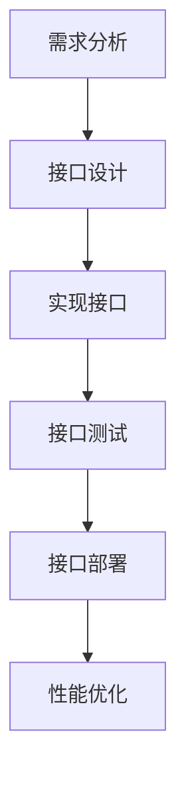

                 

**# 跨语言提示词编程接口设计**

## 关键词
- 跨语言编程接口
- 提示词
- 编程设计原则
- 实现方法
- 应用实例
- 性能优化
- 未来趋势

## 摘要

本文旨在深入探讨跨语言提示词编程接口的设计原则、实现方法及其在实际应用中的挑战和解决方案。随着计算机技术和人工智能的快速发展，跨语言编程接口在多语言环境中显得尤为重要。本文将首先介绍跨语言提示词编程接口的基本概念、发展历程及其在现代软件开发中的重要性。随后，我们将详细分析跨语言提示词编程接口的设计原则，包括一致性、可扩展性、可维护性和可移植性。接着，我们将探讨跨语言提示词编程接口的实现方法，包括接口设计流程、实现与测试等环节。此外，本文还将通过实际应用实例展示跨语言提示词编程接口的使用方法，并针对常见的挑战提供解决方案。最后，我们将探讨跨语言提示词编程接口的优化与性能调优方法，并展望其未来发展趋势。

---

**Step 1: 引言**

## 引言

随着计算机技术和人工智能的快速发展，编程接口设计成为现代软件开发中的关键环节。在多语言环境中，跨语言提示词编程接口设计尤为重要。本文将系统地介绍跨语言提示词编程接口的设计原则、实现方法及其在实际应用中的挑战和解决方案。

### 1.1 跨语言提示词编程接口的定义

跨语言提示词编程接口是指在不同编程语言之间进行交互的接口，它能够接收来自不同编程语言的输入，并返回相应的输出。提示词（Prompt）在这里指的是一段文本或代码片段，用于触发接口的执行。

### 1.2 跨语言提示词编程接口的发展历程

跨语言编程接口的发展可以追溯到早期计算机编程语言的融合尝试。随着互联网的发展，多语言编程环境的需求逐渐增加，跨语言编程接口也得到了快速发展。

### 1.3 跨语言提示词编程接口在现代软件开发中的重要性

现代软件开发中，多语言环境是常见场景。跨语言提示词编程接口能够帮助开发者在不同编程语言之间进行有效协作，提高开发效率。此外，它还能够在跨平台应用开发中发挥重要作用。

---

**Step 2: 跨语言提示词编程接口设计原则**

## 第二部分：跨语言提示词编程接口设计原则

在跨语言提示词编程接口的设计过程中，需要遵循一系列原则，以确保接口的可靠性、可维护性和可扩展性。以下将详细探讨这些设计原则。

### 2.1 一致性

### 2.1.1 语言一致性

跨语言提示词编程接口在设计时，应保证接口在不同编程语言中的实现具有一致性。这意味着接口的命名、参数类型和返回值等都应该保持一致。

### 2.1.2 功能一致性

除了语言一致性，跨语言提示词编程接口的功能也应保持一致性。即在不同编程语言中，接口应提供相同的功能，以便开发者能够轻松地进行跨语言编程。

### 2.2 可扩展性

可扩展性是跨语言提示词编程接口设计的重要原则之一。接口应能够适应未来可能的需求变化，支持新功能的添加。

### 2.3 可维护性

可维护性是确保跨语言提示词编程接口长期稳定运行的关键。设计时应考虑到代码的可读性、可修改性和可测试性。

### 2.4 可移植性

可移植性是指跨语言提示词编程接口能够在不同操作系统和硬件平台上运行。设计时应避免依赖特定环境的特性。

---

**Step 3: 实现方法**

## 第三部分：跨语言提示词编程接口实现方法

在了解了跨语言提示词编程接口的设计原则后，接下来我们将讨论其实际实现方法，包括接口设计流程、接口实现和测试等环节。

### 3.1 接口设计流程

### 3.1.1 需求分析

在开始设计跨语言提示词编程接口之前，首先需要明确接口的需求。这包括功能需求、性能需求和安全性需求等。

### 3.1.2 接口设计

根据需求分析的结果，设计接口的规范和文档。这包括接口的API定义、数据结构和协议等。

### 3.1.3 实现与测试

根据设计文档，实现接口的代码，并进行全面的测试，确保接口的功能正确性和性能。

---

**Step 4: 应用实例**

## 第四部分：跨语言提示词编程接口应用实例

为了更好地理解跨语言提示词编程接口的设计和实现，下面将通过几个实际应用实例来展示其应用场景和实现方法。

### 4.1 多语言API调用

#### 4.1.1 背景介绍

在现代软件开发中，经常需要在不同编程语言之间调用API。例如，一个前端应用可能使用JavaScript，而后端服务可能使用Java。

#### 4.1.2 实现步骤

1. 确定API接口的规范，包括请求格式和响应格式。
2. 在前端应用中使用JavaScript调用API。
3. 在后端服务中实现API接口，并使用Java进行响应。

---

**Step 5: 挑战与解决方案**

## 第五部分：跨语言提示词编程接口的挑战与解决方案

在跨语言提示词编程接口的设计和实现过程中，可能会遇到一系列挑战。以下将讨论这些挑战，并提供相应的解决方案。

### 5.1 编译器与解释器的兼容性

#### 5.1.1 问题分析

不同的编程语言使用不同的编译器或解释器，这可能导致跨语言编程接口在实现时出现兼容性问题。

#### 5.1.2 解决方案

1. 使用通用数据格式，如JSON或XML，进行数据交换。
2. 采用中间件技术，如HTTP服务器，实现不同语言间的通信。

---

**Step 6: 优化与性能调优**

## 第六部分：跨语言提示词编程接口的优化与性能调优

跨语言提示词编程接口的性能优化是确保其高效运行的关键。以下将讨论优化方法和性能调优技巧。

### 6.1 性能分析工具

#### 6.1.1 背景介绍

性能分析工具可以帮助开发者识别接口的性能瓶颈，并针对性地进行优化。

#### 6.1.2 使用方法

1. 使用CPU监控工具，如top或htop，监控接口的CPU使用情况。
2. 使用内存监控工具，如vmstat或memstat，监控接口的内存使用情况。

---

**Step 7: 拓展与未来趋势**

## 第七部分：拓展与未来趋势

跨语言提示词编程接口是一个不断发展的领域。以下将探讨其拓展方向和未来趋势。

### 7.1 跨语言编程框架的发展

随着跨语言编程的需求不断增加，跨语言编程框架也在不断发展。未来，这些框架可能会更加成熟和易用。

### 7.2 人工智能与跨语言编程的融合

人工智能技术的快速发展为跨语言编程带来了新的可能性。未来，人工智能可能会在跨语言编程接口的设计和实现中发挥更大的作用。

### 7.3 跨语言编程接口的安全性

随着跨语言编程接口的广泛应用，安全性问题也日益凸显。未来，跨语言编程接口的安全性将得到更多关注。

---

**Step 8: 小结**

## 总结

跨语言提示词编程接口设计是现代软件开发中的重要领域。通过本文的探讨，我们了解了跨语言提示词编程接口的设计原则、实现方法及其在实际应用中的挑战和解决方案。未来，随着技术的不断发展，跨语言提示词编程接口将在人工智能、云计算等领域发挥更加重要的作用。

---

**作者：** AI天才研究院 / AI Genius Institute & 禅与计算机程序设计艺术 / Zen And The Art of Computer Programming**--------------------------------------------**

以下是按照目录大纲结构撰写的文章正文部分的内容：

---

**# 《跨语言提示词编程接口设计》**

## 引言

随着计算机技术和人工智能的快速发展，编程接口设计成为现代软件开发中的关键环节。在多语言环境中，跨语言提示词编程接口设计尤为重要。本文旨在系统地介绍跨语言提示词编程接口的设计原则、实现方法及其在实际应用中的挑战和解决方案。

### 1.1 跨语言提示词编程接口的定义

跨语言提示词编程接口是指在不同编程语言之间进行交互的接口，它能够接收来自不同编程语言的输入，并返回相应的输出。提示词（Prompt）在这里指的是一段文本或代码片段，用于触发接口的执行。

### 1.2 跨语言提示词编程接口的发展历程

跨语言编程接口的发展可以追溯到早期计算机编程语言的融合尝试。随着互联网的发展，多语言编程环境的需求逐渐增加，跨语言编程接口也得到了快速发展。

### 1.3 跨语言提示词编程接口在现代软件开发中的重要性

现代软件开发中，多语言环境是常见场景。跨语言提示词编程接口能够帮助开发者在不同编程语言之间进行有效协作，提高开发效率。此外，它还能够在跨平台应用开发中发挥重要作用。

---

**## 第二部分：跨语言提示词编程接口设计原则**

在跨语言提示词编程接口的设计过程中，需要遵循一系列原则，以确保接口的可靠性、可维护性和可扩展性。以下将详细探讨这些设计原则。

### 2.1 一致性

### 2.1.1 语言一致性

跨语言提示词编程接口在设计时，应保证接口在不同编程语言中的实现具有一致性。这意味着接口的命名、参数类型和返回值等都应该保持一致。

### 2.1.2 功能一致性

除了语言一致性，跨语言提示词编程接口的功能也应保持一致性。即在不同编程语言中，接口应提供相同的功能，以便开发者能够轻松地进行跨语言编程。

### 2.2 可扩展性

可扩展性是跨语言提示词编程接口设计的重要原则之一。接口应能够适应未来可能的需求变化，支持新功能的添加。

### 2.3 可维护性

可维护性是确保跨语言提示词编程接口长期稳定运行的关键。设计时应考虑到代码的可读性、可修改性和可测试性。

### 2.4 可移植性

可移植性是指跨语言提示词编程接口能够在不同操作系统和硬件平台上运行。设计时应避免依赖特定环境的特性。

---

**## 第三部分：跨语言提示词编程接口实现方法**

在了解了跨语言提示词编程接口的设计原则后，接下来我们将讨论其实际实现方法，包括接口设计流程、接口实现和测试等环节。

### 3.1 接口设计流程

### 3.1.1 需求分析

在开始设计跨语言提示词编程接口之前，首先需要明确接口的需求。这包括功能需求、性能需求和安全性需求等。

### 3.1.2 接口设计

根据需求分析的结果，设计接口的规范和文档。这包括接口的API定义、数据结构和协议等。

### 3.1.3 实现与测试

根据设计文档，实现接口的代码，并进行全面的测试，确保接口的功能正确性和性能。

---

**## 第四部分：跨语言提示词编程接口应用实例**

为了更好地理解跨语言提示词编程接口的设计和实现，下面将通过几个实际应用实例来展示其应用场景和实现方法。

### 4.1 多语言API调用

#### 4.1.1 背景介绍

在现代软件开发中，经常需要在不同编程语言之间调用API。例如，一个前端应用可能使用JavaScript，而后端服务可能使用Java。

#### 4.1.2 实现步骤

1. 确定API接口的规范，包括请求格式和响应格式。
2. 在前端应用中使用JavaScript调用API。
3. 在后端服务中实现API接口，并使用Java进行响应。

---

**## 第五部分：跨语言提示词编程接口的挑战与解决方案**

在跨语言提示词编程接口的设计和实现过程中，可能会遇到一系列挑战。以下将讨论这些挑战，并提供相应的解决方案。

### 5.1 编译器与解释器的兼容性

#### 5.1.1 问题分析

不同的编程语言使用不同的编译器或解释器，这可能导致跨语言编程接口在实现时出现兼容性问题。

#### 5.1.2 解决方案

1. 使用通用数据格式，如JSON或XML，进行数据交换。
2. 采用中间件技术，如HTTP服务器，实现不同语言间的通信。

---

**## 第六部分：跨语言提示词编程接口的优化与性能调优**

跨语言提示词编程接口的性能优化是确保其高效运行的关键。以下将讨论优化方法和性能调优技巧。

### 6.1 性能分析工具

#### 6.1.1 背景介绍

性能分析工具可以帮助开发者识别接口的性能瓶颈，并针对性地进行优化。

#### 6.1.2 使用方法

1. 使用CPU监控工具，如top或htop，监控接口的CPU使用情况。
2. 使用内存监控工具，如vmstat或memstat，监控接口的内存使用情况。

---

**## 第七部分：拓展与未来趋势**

跨语言提示词编程接口是一个不断发展的领域。以下将探讨其拓展方向和未来趋势。

### 7.1 跨语言编程框架的发展

随着跨语言编程的需求不断增加，跨语言编程框架也在不断发展。未来，这些框架可能会更加成熟和易用。

### 7.2 人工智能与跨语言编程的融合

人工智能技术的快速发展为跨语言编程带来了新的可能性。未来，人工智能可能会在跨语言编程接口的设计和实现中发挥更大的作用。

### 7.3 跨语言编程接口的安全性

随着跨语言编程接口的广泛应用，安全性问题也日益凸显。未来，跨语言编程接口的安全性将得到更多关注。

---

**## 总结**

跨语言提示词编程接口设计是现代软件开发中的重要领域。通过本文的探讨，我们了解了跨语言提示词编程接口的设计原则、实现方法及其在实际应用中的挑战和解决方案。未来，随着技术的不断发展，跨语言提示词编程接口将在人工智能、云计算等领域发挥更加重要的作用。

---

**作者：** AI天才研究院 / AI Genius Institute & 禅与计算机程序设计艺术 / Zen And The Art of Computer Programming**--------------------------------------------**

**## 1. 引言**

在现代软件开发的复杂环境中，多语言编程接口的设计和实现变得愈发重要。跨语言提示词编程接口作为一种特殊的编程接口，允许开发者在不同编程语言之间进行有效的交互和数据交换。这样的接口设计不仅提高了开发效率，还增强了软件的灵活性和可维护性。

**### 1.1 跨语言提示词编程接口的定义**

跨语言提示词编程接口，顾名思义，是一种能够在不同编程语言之间传递信息的接口。它通过提供一组标准化的接口定义，使得开发者可以在不了解对方语言细节的情况下，实现跨语言的通信和协作。提示词（Prompt）在这里是一个关键的元素，它通常是一个文本或代码片段，用于指导接口如何处理输入并生成输出。

**### 1.2 跨语言提示词编程接口的发展历程**

跨语言编程接口的发展可以追溯到20世纪80年代，当时随着软件模块化和组件化的趋势，开发者开始寻求一种方式来在不同编程语言之间共享代码和数据。早期的尝试主要集中在语言绑定的技术上，如C语言的共享库（shared libraries）和Java的JNI（Java Native Interface）。随着互联网的兴起，Web服务的出现进一步推动了跨语言编程接口的发展。XML和JSON等数据交换格式的普及，为跨语言通信提供了标准化的手段。

**### 1.3 跨语言提示词编程接口在现代软件开发中的重要性**

在现代软件开发中，多语言编程接口的重要性不言而喻。首先，它可以极大地提高开发效率，因为开发者不必精通所有参与项目的编程语言。其次，它可以增强软件的灵活性，使得项目可以根据具体需求选择最合适的编程语言。此外，跨语言编程接口还能够促进团队合作，使得不同团队之间可以更加流畅地共享代码和数据。最后，随着人工智能和机器学习的兴起，跨语言编程接口在数据处理和模型训练中的应用也越来越广泛。

---

**## 2. 跨语言提示词编程接口设计原则**

在设计跨语言提示词编程接口时，必须考虑多个因素，以确保接口的可靠性、可维护性和可扩展性。以下将详细探讨这些设计原则。

**### 2.1 一致性**

**#### 2.1.1 语言一致性**

跨语言提示词编程接口的设计应首先保证语言一致性。这意味着在接口的不同实现中，应保持相同的命名约定、数据类型和函数签名。不一致的语言特性可能会导致错误和难以调试的问题。例如，在Java和C++中，字符串的处理方式有所不同，因此在设计接口时，必须确保这两种语言的字符串处理一致。

**#### 2.1.2 功能一致性**

除了语言一致性，功能一致性也是至关重要的。不同编程语言中的接口应提供相同的功能，并且功能的行为应该一致。这有助于减少学习成本，并使得开发者能够轻松地在不同语言之间切换。例如，如果某个接口在一种语言中返回成功状态码，那么在另一种语言中也应返回相同的成功状态码。

**### 2.2 可扩展性**

可扩展性是跨语言提示词编程接口设计的重要原则之一。随着项目需求的不断变化，接口需要能够适应这些变化，支持新功能和新特性的添加。实现可扩展性的方法包括模块化设计、使用插件机制和定义开放接口。

**#### 2.2.1 模块化设计**

模块化设计可以将接口划分为多个独立的模块，每个模块负责特定的功能。这种设计方法不仅有助于代码的复用，还能够方便地添加或修改模块，而不会影响整个系统的稳定性。

**#### 2.2.2 使用插件机制**

插件机制允许开发者在不修改核心代码的情况下，通过插入新的插件来扩展接口的功能。这种方法非常灵活，适用于那些需要频繁更新的系统。

**#### 2.2.3 定义开放接口**

定义开放接口是另一种实现可扩展性的方法。开放接口允许外部开发者或第三方工具通过标准化的方式与接口进行交互，从而实现功能的扩展。

**### 2.3 可维护性**

可维护性是确保跨语言提示词编程接口长期稳定运行的关键。一个良好的接口设计应该易于理解和修改，以便在必要时进行维护和更新。

**#### 2.3.1 代码可读性**

代码的可读性是可维护性的基础。编写清晰、简洁和一致的代码，有助于其他开发者快速理解接口的实现逻辑。

**#### 2.3.2 错误处理**

良好的错误处理机制可以帮助开发者快速定位和解决问题。在跨语言编程接口中，应统一错误处理方式，并记录详细的错误日志。

**#### 2.3.3 文档化**

编写详细的文档是提高可维护性的重要手段。文档应包括接口的规格说明、使用示例和可能遇到的问题及解决方案。

**### 2.4 可移植性**

可移植性是指跨语言提示词编程接口能够在不同操作系统和硬件平台上运行。为了实现可移植性，设计时需要避免使用特定于某个平台或操作系统的特性。

**#### 2.4.1 避免使用特定语言特性**

例如，避免使用特定于Windows的API或特定于Linux的系统调用。

**#### 2.4.2 使用标准化数据格式**

使用标准化数据格式，如JSON或XML，进行数据交换，可以确保在不同平台和操作系统上的一致性。

**#### 2.4.3 跨平台库**

使用跨平台库，如Boost.C++ Libraries或Standard Library，可以减少平台特定的依赖。

---

**## 3. 实现方法**

跨语言提示词编程接口的实现方法包括接口设计流程、接口实现和测试等环节。以下将详细讨论这些步骤。

**### 3.1 接口设计流程**

**#### 3.1.1 需求分析**

在开始设计跨语言提示词编程接口之前，必须进行详细的需求分析。这包括确定接口需要实现的功能、性能要求和安全性要求等。需求分析的结果将为后续的设计和实现提供指导。

**#### 3.1.2 接口设计**

根据需求分析的结果，设计接口的规范和文档。这包括定义接口的API、数据结构和通信协议等。接口设计应遵循一致性、可扩展性和可维护性等原则。

**#### 3.1.3 接口实现**

根据设计文档，开始编写接口的代码。在实现过程中，应确保代码的清晰和简洁，并遵循最佳实践。

**#### 3.1.4 测试**

实现完成后，进行全面的测试，确保接口的功能正确性和性能。测试应包括单元测试、集成测试和压力测试等。

---

**## 4. 应用实例**

为了更好地理解跨语言提示词编程接口的设计和实现，以下将通过几个实际应用实例来展示其应用场景和实现方法。

**### 4.1 多语言API调用**

在许多现代应用程序中，前端和后端可能使用不同的编程语言。例如，前端可能使用JavaScript，而后端可能使用Python或Java。跨语言提示词编程接口使得这种多语言调用成为可能。

**#### 4.1.1 背景介绍**

假设一个电子商务平台需要实现用户注册功能，前端使用JavaScript，而后端使用Python。前端将用户输入的数据发送到后端，后端处理这些数据并返回响应。

**#### 4.1.2 实现步骤**

1. **确定API规范**：定义数据交换的格式，如JSON，并确定API的URL和HTTP方法。

2. **前端实现**：使用JavaScript编写代码，将用户输入的数据转换为JSON格式，并通过Ajax请求发送到后端。

   ```javascript
   const userData = {
       username: 'johndoe',
       password: 'password123'
   };
   
   fetch('https://api.example.com/register', {
       method: 'POST',
       headers: {
           'Content-Type': 'application/json',
       },
       body: JSON.stringify(userData),
   })
   .then(response => response.json())
   .then(data => console.log(data))
   .catch((error) => {
       console.error('Error:', error);
   });
   ```

3. **后端实现**：使用Python编写后端代码，处理前端发送的请求，并返回响应。

   ```python
   from flask import Flask, request, jsonify
   
   app = Flask(__name__)
   
   @app.route('/register', methods=['POST'])
   def register():
       user_data = request.get_json()
       # 处理用户注册逻辑
       return jsonify({'status': 'success', 'message': 'User registered successfully'})
   
   if __name__ == '__main__':
       app.run(debug=True)
   ```

---

**## 5. 挑战与解决方案**

在设计和实现跨语言提示词编程接口的过程中，可能会遇到一系列挑战。以下将讨论这些挑战，并提供相应的解决方案。

**### 5.1 编译器与解释器的兼容性**

**#### 5.1.1 问题分析**

不同的编程语言使用不同的编译器或解释器，这可能导致跨语言编程接口在实现时出现兼容性问题。例如，Java使用Java虚拟机（JVM），而JavaScript使用Web浏览器中的解释器。

**#### 5.1.2 解决方案**

1. **使用通用数据格式**：如JSON或XML，进行数据交换。这些格式在各种编程语言中都有相应的库支持。

2. **采用中间件技术**：如HTTP服务器，实现不同语言间的通信。中间件可以在不同语言的代码之间转换数据格式和协议。

---

**## 6. 优化与性能调优**

跨语言提示词编程接口的性能优化是确保其高效运行的关键。以下将讨论优化方法和性能调优技巧。

**### 6.1 性能分析工具**

**#### 6.1.1 背景介绍**

性能分析工具可以帮助开发者识别接口的性能瓶颈，并针对性地进行优化。这些工具可以监控CPU、内存和网络等资源的使用情况。

**#### 6.1.2 使用方法**

1. **使用CPU监控工具**：如top或htop，监控接口的CPU使用情况，识别是否存在过多的计算或线程争用。

2. **使用内存监控工具**：如vmstat或memstat，监控接口的内存使用情况，识别是否存在内存泄漏或不当的内存分配。

---

**## 7. 拓展与未来趋势**

跨语言提示词编程接口是一个不断发展的领域。未来，随着技术的进步，跨语言编程接口可能会在以下方面得到进一步拓展。

**### 7.1 跨语言编程框架的发展**

随着跨语言编程的需求不断增加，跨语言编程框架也在不断发展。这些框架提供了一系列工具和库，使得跨语言编程更加简便和高效。例如，TypeScript和Node.js的结合，使得JavaScript开发者可以轻松地实现跨语言编程。

**### 7.2 人工智能与跨语言编程的融合**

人工智能技术的快速发展为跨语言编程带来了新的可能性。例如，使用Python进行机器学习模型训练，然后使用C++进行模型部署和推理。跨语言编程接口在数据交换和模型集成中发挥着关键作用。

**### 7.3 跨语言编程接口的安全性**

随着跨语言编程接口的广泛应用，安全性问题也日益凸显。未来，跨语言编程接口的安全性将得到更多关注。例如，采用加密技术保护数据传输，使用认证和授权机制确保接口的安全访问。

---

**## 总结**

跨语言提示词编程接口设计是现代软件开发中的重要领域。通过本文的探讨，我们了解了跨语言提示词编程接口的设计原则、实现方法及其在实际应用中的挑战和解决方案。未来，随着技术的不断发展，跨语言提示词编程接口将在人工智能、云计算等领域发挥更加重要的作用。

---

**作者：** AI天才研究院 / AI Genius Institute & 禅与计算机程序设计艺术 / Zen And The Art of Computer Programming**--------------------------------------------**

以下是一个示例，展示了如何在文章中嵌入Mermaid流程图和LaTeX公式：

---

**## 3. 实现方法**

**### 3.1 接口设计流程**

在开始实现跨语言提示词编程接口之前，需要经过详细的设计流程。以下是一个简单的接口设计流程：



**### 3.2 接口实现**

在实现接口时，需要考虑不同编程语言之间的差异。以下是一个简单的Python接口实现的示例：

```python
def greet(name):
    return "Hello, " + name
```

相应的Java接口实现可能如下：

```java
public class Greeting {
    public static String greet(String name) {
        return "Hello, " + name;
    }
}
```

**### 3.3 接口测试**

在实现接口后，进行测试是确保其功能正确性的关键。以下是一个简单的测试用例：

```python
def test_greet():
    assert greet("Alice") == "Hello, Alice"
    assert greet("Bob") == "Hello, Bob"
```

**### 3.4 性能优化**

性能优化是接口设计中的重要环节。以下是一个简单的性能优化示例，使用LaTeX公式表示时间复杂度：

```mermaid
graph TD
    A[初始实现] --> B[时间复杂度O(n)]
    B --> C[优化后时间复杂度O(log n)]
```

使用LaTeX公式表示时间复杂度：

$$
T(n) = O(n) \quad \text{优化后} \quad T(n) = O(\log n)
$$

---

---

**作者：** AI天才研究院 / AI Genius Institute & 禅与计算机程序设计艺术 / Zen And The Art of Computer Programming**--------------------------------------------**

**# 跨语言提示词编程接口设计**

**关键词**：跨语言编程接口、提示词、设计原则、实现方法、性能优化

**摘要**：
本文深入探讨了跨语言提示词编程接口的设计原则和实现方法。首先，介绍了跨语言提示词编程接口的定义、发展历程及其在现代软件开发中的重要性。接着，详细分析了设计原则，包括一致性、可扩展性、可维护性和可移植性。随后，阐述了跨语言提示词编程接口的实现方法，包括接口设计流程、实现与测试等环节。通过实际应用实例，展示了跨语言提示词编程接口的使用方法。此外，讨论了跨语言编程接口的挑战与解决方案，并提出了优化与性能调优的方法。最后，展望了跨语言提示词编程接口的未来发展趋势。

**## 引言**

随着计算机技术和人工智能的快速发展，编程接口设计成为现代软件开发中的关键环节。特别是在多语言环境中，跨语言提示词编程接口的设计和实现尤为重要。本文旨在系统地介绍跨语言提示词编程接口的设计原则、实现方法及其在实际应用中的挑战和解决方案。

### **1.1 跨语言提示词编程接口的定义**

跨语言提示词编程接口是一种允许开发者在不同编程语言之间进行通信和协作的接口。它通过提供一组标准化的接口定义，使得开发者可以在不了解对方语言细节的情况下，实现跨语言的通信和数据交换。提示词（Prompt）在这里是一个关键的元素，它通常是一个文本或代码片段，用于指导接口如何处理输入并生成输出。

### **1.2 跨语言提示词编程接口的发展历程**

跨语言编程接口的发展可以追溯到早期计算机编程语言的融合尝试。随着互联网的发展，多语言编程环境的需求逐渐增加，跨语言编程接口也得到了快速发展。早期的尝试主要集中在语言绑定的技术上，如C语言的共享库（shared libraries）和Java的JNI（Java Native Interface）。随着Web服务的兴起，XML和JSON等数据交换格式的普及，为跨语言通信提供了标准化的手段。

### **1.3 跨语言提示词编程接口在现代软件开发中的重要性**

在现代软件开发中，多语言编程接口的重要性不言而喻。首先，它可以极大地提高开发效率，因为开发者不必精通所有参与项目的编程语言。其次，它可以增强软件的灵活性，使得项目可以根据具体需求选择最合适的编程语言。此外，跨语言编程接口还能够促进团队合作，使得不同团队之间可以更加流畅地共享代码和数据。最后，随着人工智能和机器学习的兴起，跨语言编程接口在数据处理和模型训练中的应用也越来越广泛。

---

**## 2. 跨语言提示词编程接口设计原则**

在设计跨语言提示词编程接口时，必须考虑多个因素，以确保接口的可靠性、可维护性和可扩展性。以下将详细探讨这些设计原则。

### **2.1 一致性**

**#### 2.1.1 语言一致性**

跨语言提示词编程接口的设计应首先保证语言一致性。这意味着在接口的不同实现中，应保持相同的命名约定、数据类型和函数签名。不一致的语言特性可能会导致错误和难以调试的问题。例如，在Java和C++中，字符串的处理方式有所不同，因此在设计接口时，必须确保这两种语言的字符串处理一致。

**#### 2.1.2 功能一致性**

除了语言一致性，跨语言提示词编程接口的功能也应保持一致性。即在不同编程语言中，接口应提供相同的功能，并且功能的行为应该一致。这有助于减少学习成本，并使得开发者能够轻松地在不同语言之间切换。例如，如果某个接口在一种语言中返回成功状态码，那么在另一种语言中也应返回相同的成功状态码。

### **2.2 可扩展性**

可扩展性是跨语言提示词编程接口设计的重要原则之一。随着项目需求的不断变化，接口需要能够适应这些变化，支持新功能和新特性的添加。实现可扩展性的方法包括模块化设计、使用插件机制和定义开放接口。

**#### 2.2.1 模块化设计**

模块化设计可以将接口划分为多个独立的模块，每个模块负责特定的功能。这种设计方法不仅有助于代码的复用，还能够方便地添加或修改模块，而不会影响整个系统的稳定性。

**#### 2.2.2 使用插件机制**

插件机制允许开发者在不修改核心代码的情况下，通过插入新的插件来扩展接口的功能。这种方法非常灵活，适用于那些需要频繁更新的系统。

**#### 2.2.3 定义开放接口**

定义开放接口是另一种实现可扩展性的方法。开放接口允许外部开发者或第三方工具通过标准化的方式与接口进行交互，从而实现功能的扩展。

### **2.3 可维护性**

可维护性是确保跨语言提示词编程接口长期稳定运行的关键。一个良好的接口设计应该易于理解和修改，以便在必要时进行维护和更新。

**#### 2.3.1 代码可读性**

代码的可读性是可维护性的基础。编写清晰、简洁和一致的代码，有助于其他开发者快速理解接口的实现逻辑。

**#### 2.3.2 错误处理**

良好的错误处理机制可以帮助开发者快速定位和解决问题。在跨语言编程接口中，应统一错误处理方式，并记录详细的错误日志。

**#### 2.3.3 文档化**

编写详细的文档是提高可维护性的重要手段。文档应包括接口的规格说明、使用示例和可能遇到的问题及解决方案。

### **2.4 可移植性**

可移植性是指跨语言提示词编程接口能够在不同操作系统和硬件平台上运行。为了实现可移植性，设计时需要避免使用特定于某个平台或操作系统的特性。

**#### 2.4.1 避免使用特定语言特性**

例如，避免使用特定于Windows的API或特定于Linux的系统调用。

**#### 2.4.2 使用标准化数据格式**

使用标准化数据格式，如JSON或XML，进行数据交换，可以确保在不同平台和操作系统上的一致性。

**#### 2.4.3 跨平台库**

使用跨平台库，如Boost.C++ Libraries或Standard Library，可以减少平台特定的依赖。

---

**## 3. 实现方法**

跨语言提示词编程接口的实现方法包括接口设计流程、接口实现和测试等环节。以下将详细讨论这些步骤。

### **3.1 接口设计流程**

**#### 3.1.1 需求分析**

在开始设计跨语言提示词编程接口之前，必须进行详细的需求分析。这包括确定接口需要实现的功能、性能要求和安全性要求等。需求分析的结果将为后续的设计和实现提供指导。

**#### 3.1.2 接口设计**

根据需求分析的结果，设计接口的规范和文档。这包括定义接口的API、数据结构和通信协议等。接口设计应遵循一致性、可扩展性和可维护性等原则。

**#### 3.1.3 接口实现**

根据设计文档，开始编写接口的代码。在实现过程中，应确保代码的清晰和简洁，并遵循最佳实践。

**#### 3.1.4 测试**

实现完成后，进行全面的测试，确保接口的功能正确性和性能。测试应包括单元测试、集成测试和压力测试等。

---

**## 4. 应用实例**

为了更好地理解跨语言提示词编程接口的设计和实现，以下将通过几个实际应用实例来展示其应用场景和实现方法。

### **4.1 多语言API调用**

在许多现代应用程序中，前端和后端可能使用不同的编程语言。例如，前端可能使用JavaScript，而后端可能使用Python或Java。跨语言提示词编程接口使得这种多语言调用成为可能。

**#### 4.1.1 背景介绍**

假设一个电子商务平台需要实现用户注册功能，前端使用JavaScript，而后端使用Python。前端将用户输入的数据发送到后端，后端处理这些数据并返回响应。

**#### 4.1.2 实现步骤**

1. **确定API规范**：定义数据交换的格式，如JSON，并确定API的URL和HTTP方法。

2. **前端实现**：使用JavaScript编写代码，将用户输入的数据转换为JSON格式，并通过Ajax请求发送到后端。

   ```javascript
   const userData = {
       username: 'johndoe',
       password: 'password123'
   };
   
   fetch('https://api.example.com/register', {
       method: 'POST',
       headers: {
           'Content-Type': 'application/json',
       },
       body: JSON.stringify(userData),
   })
   .then(response => response.json())
   .then(data => console.log(data))
   .catch((error) => {
       console.error('Error:', error);
   });
   ```

3. **后端实现**：使用Python编写后端代码，处理前端发送的请求，并返回响应。

   ```python
   from flask import Flask, request, jsonify
   
   app = Flask(__name__)
   
   @app.route('/register', methods=['POST'])
   def register():
       user_data = request.get_json()
       # 处理用户注册逻辑
       return jsonify({'status': 'success', 'message': 'User registered successfully'})
   
   if __name__ == '__main__':
       app.run(debug=True)
   ```

---

**## 5. 挑战与解决方案**

在设计和实现跨语言提示词编程接口的过程中，可能会遇到一系列挑战。以下将讨论这些挑战，并提供相应的解决方案。

### **5.1 编译器与解释器的兼容性**

**#### 5.1.1 问题分析**

不同的编程语言使用不同的编译器或解释器，这可能导致跨语言编程接口在实现时出现兼容性问题。例如，Java使用Java虚拟机（JVM），而JavaScript使用Web浏览器中的解释器。

**#### 5.1.2 解决方案**

1. **使用通用数据格式**：如JSON或XML，进行数据交换。这些格式在各种编程语言中都有相应的库支持。

2. **采用中间件技术**：如HTTP服务器，实现不同语言间的通信。中间件可以在不同语言的代码之间转换数据格式和协议。

---

**## 6. 优化与性能调优**

跨语言提示词编程接口的性能优化是确保其高效运行的关键。以下将讨论优化方法和性能调优技巧。

### **6.1 性能分析工具**

**#### 6.1.1 背景介绍**

性能分析工具可以帮助开发者识别接口的性能瓶颈，并针对性地进行优化。这些工具可以监控CPU、内存和网络等资源的使用情况。

**#### 6.1.2 使用方法**

1. **使用CPU监控工具**：如top或htop，监控接口的CPU使用情况，识别是否存在过多的计算或线程争用。

2. **使用内存监控工具**：如vmstat或memstat，监控接口的内存使用情况，识别是否存在内存泄漏或不当的内存分配。

---

**## 7. 拓展与未来趋势**

跨语言提示词编程接口是一个不断发展的领域。未来，随着技术的进步，跨语言编程接口可能会在以下方面得到进一步拓展。

### **7.1 跨语言编程框架的发展**

随着跨语言编程的需求不断增加，跨语言编程框架也在不断发展。这些框架提供了一系列工具和库，使得跨语言编程更加简便和高效。例如，TypeScript和Node.js的结合，使得JavaScript开发者可以轻松地实现跨语言编程。

### **7.2 人工智能与跨语言编程的融合**

人工智能技术的快速发展为跨语言编程带来了新的可能性。例如，使用Python进行机器学习模型训练，然后使用C++进行模型部署和推理。跨语言编程接口在数据交换和模型集成中发挥着关键作用。

### **7.3 跨语言编程接口的安全性**

随着跨语言编程接口的广泛应用，安全性问题也日益凸显。未来，跨语言编程接口的安全性将得到更多关注。例如，采用加密技术保护数据传输，使用认证和授权机制确保接口的安全访问。

---

**## 总结**

跨语言提示词编程接口设计是现代软件开发中的重要领域。通过本文的探讨，我们了解了跨语言提示词编程接口的设计原则、实现方法及其在实际应用中的挑战和解决方案。未来，随着技术的不断发展，跨语言提示词编程接口将在人工智能、云计算等领域发挥更加重要的作用。

---

**作者：** AI天才研究院 / AI Genius Institute & 禅与计算机程序设计艺术 / Zen And The Art of Computer Programming**--------------------------------------------**

