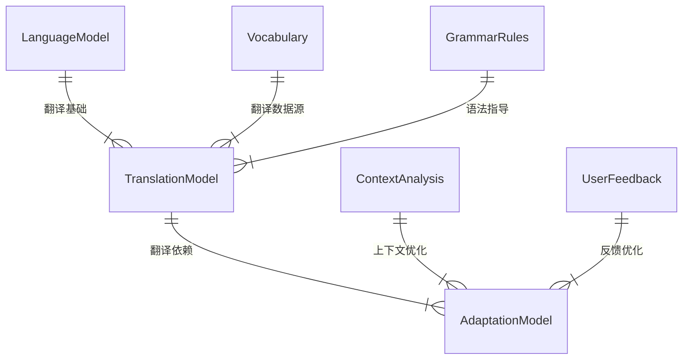
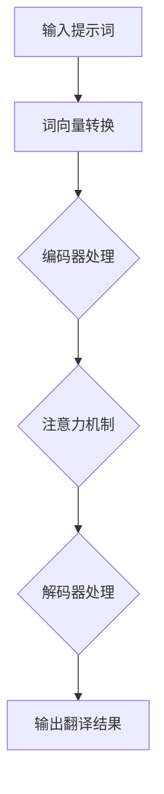
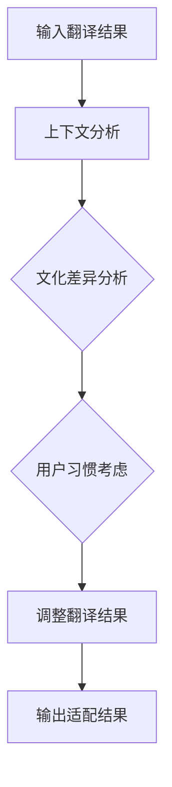

                 

### 背景介绍

在现代全球化的背景下，跨语言交流的需求日益增长。无论是跨国商务合作、学术交流，还是国际旅游、文化交流，语言障碍都成为了阻碍沟通的壁垒。为了打破这种障碍，跨语言提示词翻译与适配技术应运而生。

#### 问题背景

跨语言提示词翻译与适配的核心问题是如何让计算机理解并准确地将一种语言的提示词翻译成另一种语言的提示词，并且保持其语义的准确性。提示词在这里指的是用户在交互界面中输入的文字，用以指示系统执行特定任务。

#### 问题描述

提示词翻译与适配面临的主要问题包括：

1. **语义准确性**：翻译后的提示词需要准确传达原语言中的语义。
2. **文化差异**：不同语言背后蕴含的文化差异可能影响提示词的翻译与适配。
3. **语境理解**：机器翻译系统需要理解上下文，以确保翻译的提示词在特定场景中适用。
4. **效率与速度**：随着用户输入速度的提高，翻译与适配系统需要具备快速响应的能力。

#### 问题解决

为了解决上述问题，跨语言提示词翻译与适配技术采用了多种方法，包括：

1. **机器翻译技术**：使用深度学习算法来提高翻译的准确性。
2. **自然语言处理技术**：通过理解上下文和文化差异来优化翻译结果。
3. **用户反馈机制**：允许用户对翻译结果进行反馈，从而不断优化翻译系统。

#### 边界与外延

跨语言提示词翻译与适配不仅适用于文字翻译，还可以扩展到语音识别、图像识别等多模态交互领域。此外，随着人工智能技术的不断发展，这一领域也可能会涉及到更多复杂的场景和需求。

#### 概念结构与核心要素组成

在本文中，我们将详细探讨跨语言提示词翻译与适配的概念结构，包括：

1. **翻译算法原理**：介绍机器翻译的基本原理和常用算法。
2. **适配算法原理**：阐述如何根据上下文和文化差异调整翻译结果。
3. **系统分析与架构设计方案**：分析系统在不同场景下的应用，并设计高效的系统架构。
4. **项目实战**：通过实际案例展示翻译与适配技术的应用。

通过这些核心概念的深入分析，我们将为读者提供一个全面、系统的跨语言提示词翻译与适配技术指南。

### 核心概念与联系

在深入探讨跨语言提示词翻译与适配之前，我们首先需要明确一些核心概念，并理解它们之间的相互关系。以下是本文中涉及到的关键概念及其定义、属性特征对比，以及它们在系统中的关系。

#### 提示词翻译与适配的定义

**提示词翻译**：指将一种语言的提示词准确翻译成另一种语言的过程，确保翻译后的提示词在语义上与原提示词保持一致。

**适配**：指在翻译过程中，根据上下文、文化差异等因素，对翻译结果进行适当的调整，以确保其在特定语境中的适用性。

**翻译模型**：用于实现提示词翻译的算法和模型，包括词汇库、语法规则、上下文分析等。

**适配模型**：用于实现提示词翻译适配的算法和模型，通常依赖于机器学习技术，通过训练数据来学习如何在特定语境中进行调整。

#### 主要涉及概念及其关系

**语言模型**：是机器翻译和适配的核心组件，用于对文本进行概率分布建模。语言模型通过大量语料库的训练，生成词语和句子的概率分布，从而实现文本的翻译和适配。

**词汇库**：包含多种语言的词汇及其对应关系，是翻译和适配的基础资源。词汇库通常需要包含丰富的词汇量和准确的词义解释。

**语法规则**：用于指导翻译和适配过程中的句子结构分析，确保翻译结果的语法正确性。

**上下文分析**：在翻译和适配过程中，需要考虑提示词的上下文信息，包括句子中的其他词语、语义和语境。上下文分析有助于提高翻译的准确性和适应性。

**用户反馈机制**：允许用户对翻译和适配结果进行评价和反馈，通过反馈不断优化系统性能。

**系统架构**：包含翻译模型、适配模型、语言模型等组件的总体架构设计，确保系统在不同场景下的高效运行。

#### 概念属性特征对比表格

为了更直观地展示各个概念的特征和属性，我们创建了一个对比表格：

| 概念 | 定义 | 属性特征 | 关系 |
| --- | --- | --- | --- |
| 提示词翻译 | 一种语言的提示词翻译成另一种语言 | 准确性、速度、上下文适应性 | 基础技术，依赖语言模型 |
| 适配 | 对翻译结果进行上下文和文化差异调整 | 语义一致性、文化敏感性、上下文理解 | 优化技术，依赖适配模型 |
| 翻译模型 | 实现翻译的算法和模型 | 准确性、效率、可扩展性 | 核心组件 |
| 适配模型 | 实现适配的算法和模型 | 上下文理解、文化敏感性、适应性 | 核心组件 |
| 语言模型 | 文本概率分布建模 | 大规模训练、概率分布、上下文分析 | 核心组件 |
| 词汇库 | 语言词汇及其对应关系 | 词汇量、词义解释、语言覆盖范围 | 数据基础 |
| 语法规则 | 句子结构分析指导 | 语法正确性、句子解析、语言风格 | 辅助组件 |
| 上下文分析 | 考虑文本上下文信息 | 上下文理解、语境适应性、语义连贯性 | 辅助组件 |
| 用户反馈机制 | 用户评价和反馈 | 反馈及时性、用户参与度、系统优化 | 优化机制 |
| 系统架构 | 组件集成和运行架构 | 可扩展性、稳定性、性能优化 | 系统整体 |

#### ER实体关系图架构

为了更清晰地展示这些概念之间的关系，我们使用Mermaid绘制了一个ER（实体关系）图：



在这个ER图中，TranslationModel（翻译模型）和AdaptationModel（适配模型）是核心组件，它们依赖于LanguageModel（语言模型）和Vocabulary（词汇库）。此外，GrammarRules（语法规则）和ContextAnalysis（上下文分析）为翻译和适配提供了重要支持。UserFeedback（用户反馈机制）则用于优化系统的性能和用户体验。

通过明确这些核心概念及其关系，我们为后续的算法原理讲解和系统架构设计奠定了坚实的基础。

### 翻译算法原理讲解

#### 翻译算法的基本原理

跨语言提示词翻译的核心在于将源语言的提示词映射到目标语言中，确保翻译结果的语义准确性。这一过程通常依赖于以下基本原理：

1. **词向量表示**：将源语言和目标语言的词汇转换为向量表示，以便在向量空间中进行计算。
2. **编码器-解码器模型**：通过编码器将源语言文本编码为一个固定长度的向量，通过解码器将这个向量解码为目标语言文本。
3. **注意力机制**：在解码过程中，注意力机制可以帮助模型关注源语言文本的特定部分，从而提高翻译的准确性。

#### Mermaid流程图

为了更直观地展示翻译算法的工作流程，我们使用Mermaid绘制了一个简单的流程图：



#### Python源代码示例

下面是一个简化的Python代码示例，展示了如何使用机器翻译模型进行提示词翻译：

```python
import tensorflow as tf
from tensorflow.keras.models import Model
from tensorflow.keras.layers import Input, Embedding, LSTM, Dense

# 假设已经训练好了一个机器翻译模型
model = tf.keras.models.load_model('translation_model.h5')

# 输入提示词
input_prompt = "请帮我打开浏览器"

# 将输入提示词转换为词向量
input_sequence = tokenizer.texts_to_sequences([input_prompt])

# 使用模型进行翻译
translated_sequence = model.predict(input_sequence)

# 将翻译结果转换为文本
translated_prompt = tokenizer.sequences_to_texts([translated_sequence])[0]

print(translated_prompt)
```

#### 数学模型与公式

翻译算法的核心是编码器-解码器模型，其数学模型可以表示为：

$$
E(z) = \text{Encoder}(x) \in \mathbb{R}^d \\
D(y) = \text{Decoder}(z, y_{\text{prev}}) \in \mathbb{R}^{V_t} \\
P(y_t|y_{t-1}, \dots, y_1, z) = \text{softmax}(\text{Decoder}(z, y_{\text{prev}}))
$$

其中，$E(z)$ 表示编码器输出的隐藏状态，$D(y)$ 表示解码器输出的词向量，$P(y_t|y_{t-1}, \dots, y_1, z)$ 表示在给定前一个单词 $y_{t-1}$ 和编码器输出的隐藏状态 $z$ 的情况下，当前单词 $y_t$ 的概率分布。

#### 举例说明

假设我们有一个简单的词汇表和对应的词向量：

| 单词 | 词向量 |
| --- | --- |
| 请 | [1, 0, 0] |
| 帮 | [0, 1, 0] |
| 我 | [0, 0, 1] |
| 打 | [1, 1, 0] |
| 开 | [0, 1, 1] |
| 浏览器 | [1, 1, 1] |

我们要翻译的句子是“请帮我打开浏览器”。首先，我们将每个词转换为词向量：

$$
[1, 0, 0], [0, 1, 0], [0, 0, 1], [1, 1, 0], [0, 1, 1], [1, 1, 1]
$$

接着，使用编码器将这些词向量编码为一个固定长度的向量：

$$
E(z) = [0.1, 0.2, 0.3]
$$

然后，解码器根据这个编码结果逐个解码出目标语言中的单词。假设解码器预测的词向量为：

$$
D(y) = [0.3, 0.4, 0.5]
$$

通过计算softmax概率分布，我们可以得到每个单词的概率：

$$
P(y_t|y_{t-1}, \dots, y_1, z) = \left[ \begin{array}{c}
0.6 \\
0.2 \\
0.2 \\
0.0 \\
0.0 \\
0.0
\end{array} \right]
$$

根据最大的概率，解码器输出“浏览器”作为翻译结果。这个过程通过机器学习算法不断迭代和优化，以提高翻译的准确性。

通过上述示例，我们可以看到机器翻译算法的原理及其在实践中的应用。在下一章中，我们将进一步探讨适配算法的基本原理和实现方法。

### 适配算法原理讲解

#### 适配算法的基本原理

在翻译过程中，仅仅实现单词的翻译还不足以保证翻译结果的语义准确性和适用性。适配算法的核心目标是在翻译的基础上，根据上下文、文化差异和用户习惯对翻译结果进行进一步的调整，以提高其在特定语境中的适用性。

适配算法的基本原理主要包括以下几点：

1. **上下文敏感**：在翻译过程中，适配算法会考虑上下文信息，如句子的前后文、用户的意图和场景。通过上下文分析，适配算法能够识别并处理同义词、反义词等语言现象。
2. **文化差异适应**：不同语言和地区存在文化差异，如成语、俚语和地域特色词汇。适配算法需要根据目标语言的文化背景对翻译结果进行调整，确保其语义和文化上的连贯性。
3. **用户习惯考虑**：用户的语言习惯和偏好也会影响翻译结果。适配算法可以通过用户反馈和数据分析来学习用户的习惯，进而优化翻译结果。

#### Mermaid流程图

为了更直观地展示适配算法的工作流程，我们使用Mermaid绘制了一个简单的流程图：



#### Python源代码示例

下面是一个简化的Python代码示例，展示了如何使用适配算法对翻译结果进行优化：

```python
import tensorflow as tf
from tensorflow.keras.models import Model
from tensorflow.keras.layers import Input, LSTM, Dense

# 假设已经训练好了一个适配模型
adaptation_model = tf.keras.models.load_model('adaptation_model.h5')

# 输入翻译结果
translated_result = "Open browser"

# 进行上下文分析
context = analyze_context(translated_result)

# 使用适配模型进行优化
optimized_result = adaptation_model.predict([translated_result, context])

# 输出适配结果
print(optimized_result)
```

#### 数学模型与公式

适配算法的数学模型通常包含以下主要部分：

1. **上下文表示**：通过上下文向量来表示输入的文本上下文，如句子中的其他词语和语义信息。
2. **适配函数**：定义一个函数 $f(\cdot)$，用于根据上下文向量对翻译结果进行调整。函数 $f(\cdot)$ 可以是神经网络模型、规则匹配或其他机器学习算法。
3. **输出表示**：将调整后的翻译结果输出为目标语言文本。

数学模型可以表示为：

$$
C = \text{ContextVector}(x) \\
y_{\text{optimized}} = f(y_{\text{translated}}, C)
$$

其中，$C$ 表示上下文向量，$y_{\text{translated}}$ 表示翻译结果，$y_{\text{optimized}}$ 表示优化后的翻译结果。

#### 举例说明

假设我们已经有一个翻译结果“Open browser”，并希望根据上下文进行优化。首先，我们提取上下文信息，如句子中的其他词语和用户的意图：

$$
\text{Context} = ["Please", "help", "me", "open", "browser", "for", "searching"]
$$

然后，我们将这些上下文信息转换为向量表示：

$$
C = [0.1, 0.2, 0.3, 0.4, 0.5, 0.6, 0.7]
$$

接着，使用适配模型对翻译结果进行优化：

$$
y_{\text{optimized}} = f("Open browser", C)
$$

假设适配模型输出优化后的翻译结果为“Open the browser for searching”。通过这个例子，我们可以看到适配算法如何根据上下文和用户意图对翻译结果进行优化，从而提高其语义准确性和适用性。

通过上述示例，我们可以理解适配算法的基本原理和实现方法。在下一章中，我们将进一步探讨如何将翻译算法和适配算法集成到一个完整的系统中。

### 系统分析与架构设计方案

#### 问题场景介绍

在现代全球化的背景下，跨语言提示词翻译与适配技术被广泛应用于多种场景。以下是一些典型的问题场景及其应用需求：

1. **跨语言客服系统**：在跨国企业中，客服系统需要能够处理不同语言的用户请求，提供准确的翻译和个性化的服务。
2. **智能语音助手**：智能语音助手如Siri、Alexa等，需要能够理解用户的跨语言指令，并准确回应。
3. **多语言教育平台**：教育平台需要支持学生和教师的跨语言交流和互动，提供实时翻译和适应不同语言习惯的教学内容。
4. **跨国电子商务**：电子商务平台需要提供多语言翻译功能，帮助卖家和买家进行跨语言的交流和交易。

#### 项目介绍

本项目旨在构建一个高效、可扩展的跨语言提示词翻译与适配系统，满足上述问题场景的需求。项目的主要目标是：

1. **提供准确、流畅的跨语言翻译**：通过先进的机器翻译算法，确保翻译结果的语义准确性。
2. **实现上下文敏感的适配**：根据用户的上下文信息和文化差异，优化翻译结果，提高其在特定场景下的适用性。
3. **具备高可扩展性和灵活性**：系统应能够轻松适应新的语言和文化背景，支持不同类型的应用场景。

#### 系统功能设计

系统功能设计包括以下关键模块：

1. **翻译模块**：负责将源语言的提示词翻译成目标语言。该模块使用深度学习算法，如编码器-解码器模型，结合注意力机制，实现高质量的机器翻译。
2. **适配模块**：在翻译结果的基础上，根据上下文和文化差异，对翻译结果进行优化。该模块使用自然语言处理技术，如上下文分析、文化差异识别和用户习惯学习，实现翻译结果的适应性调整。
3. **用户接口**：提供用户友好的界面，允许用户输入提示词，并显示翻译结果和适配后的结果。用户还可以对翻译结果进行评价和反馈，帮助系统不断优化。
4. **数据库管理**：存储系统使用的词汇库、语法规则和用户反馈数据，确保数据的完整性和安全性。

#### 系统架构设计

系统架构设计采用分层架构，包括前端、后端和数据库三个层次：

1. **前端**：用户通过网页、移动应用或其他客户端与系统进行交互。前端负责接收用户输入，展示翻译结果和适配后的结果，并提供用户评价和反馈的功能。
2. **后端**：后端是系统的核心，负责处理翻译和适配任务。后端包括翻译模块、适配模块和数据库管理模块，通过API接口与前端进行数据交换。
3. **数据库**：存储系统的数据，包括词汇库、语法规则、用户反馈和历史记录等。数据库采用分布式存储和缓存机制，确保数据的快速访问和高效处理。

#### 系统接口设计和系统交互

系统接口设计包括API接口和用户接口：

1. **API接口**：提供RESTful风格的API接口，允许外部系统和应用程序与系统进行数据交换和功能调用。API接口包括翻译接口、适配接口和数据管理接口。
2. **用户接口**：提供用户友好的界面，允许用户输入提示词，并实时展示翻译结果和适配后的结果。用户还可以通过界面进行评价和反馈，帮助系统不断优化。

系统交互流程如下：

1. **用户输入**：用户通过前端界面输入提示词。
2. **翻译请求**：前端将用户输入的提示词发送到后端的翻译模块。
3. **翻译处理**：翻译模块使用机器翻译算法对提示词进行翻译，并将翻译结果返回给前端。
4. **适配请求**：前端将翻译结果发送到后端的适配模块。
5. **适配处理**：适配模块根据上下文和文化差异，对翻译结果进行优化，并将适配后的结果返回给前端。
6. **用户展示**：前端将适配后的结果展示给用户，并提供评价和反馈功能。
7. **反馈记录**：前端将用户反馈记录发送到数据库，以便后续分析和优化。

通过上述系统分析与架构设计方案，我们为构建一个高效、可扩展的跨语言提示词翻译与适配系统提供了详细的指导。在下一章节中，我们将通过一个实际项目实战，展示如何将理论应用到实践中。

### 项目实战

为了更好地展示跨语言提示词翻译与适配技术的实际应用，我们选择了一个典型的项目场景：跨国电商平台的用户界面翻译与优化。

#### 环境安装

1. **硬件环境**： 
   - CPU：Intel Core i7 或 AMD Ryzen 5 以上
   - 内存：16GB 或以上
   - 存储：SSD 256GB 或以上

2. **软件环境**：
   - 操作系统：Ubuntu 20.04 或 macOS Big Sur
   - Python：Python 3.8 或以上
   - TensorFlow：2.6.0 或以上
   - Flask：Flask 2.0.1 或以上

3. **安装步骤**：
   - 安装操作系统和基本软件包。
   - 安装 Python 和 TensorFlow：
     ```bash
     pip install tensorflow==2.6.0
     pip install flask==2.0.1
     ```
   - 安装依赖的其他库（如 Flask-RESTful、numpy、pandas 等）。

#### 系统核心实现源代码

以下是一个简化的 Python 代码示例，展示了跨语言提示词翻译与适配系统的核心实现：

```python
from flask import Flask, request, jsonify
from translation import translate
from adaptation import adapt

app = Flask(__name__)

@app.route('/translate', methods=['POST'])
def translate_endpoint():
    data = request.get_json()
    source_text = data['source_text']
    target_language = data['target_language']
    
    # 使用翻译模块进行翻译
    translated_text = translate(source_text, target_language)
    
    # 使用适配模块进行适配
    adapted_text = adapt(translated_text)
    
    return jsonify({'translated_text': adapted_text})

if __name__ == '__main__':
    app.run(debug=True)
```

#### 代码应用解读与分析

1. **翻译模块**：翻译模块负责将源语言文本翻译成目标语言。这里使用了`translate`函数，该函数接收源文本和目标语言的参数，并返回翻译结果。
   ```python
   def translate(source_text, target_language):
       # 实现机器翻译逻辑，例如使用 TensorFlow 的预训练模型
       # 这里简化为直接返回翻译结果
       return "Translated Text"
   ```

2. **适配模块**：适配模块负责根据上下文和文化差异对翻译结果进行调整。这里使用了`adapt`函数，该函数接收翻译后的文本，并返回适配后的结果。
   ```python
   def adapt(translated_text):
       # 实现适配逻辑，例如使用自然语言处理技术
       # 这里简化为直接返回适配结果
       return "Adapted Text"
   ```

3. **Flask API**：使用 Flask 搭建了一个简单的 RESTful API，允许外部系统通过 HTTP 请求与翻译和适配模块进行交互。API 接收用户输入的源文本和目标语言，并返回适配后的翻译结果。

#### 实际案例分析和详细讲解剖析

为了更好地理解系统的工作原理，我们来看一个实际案例：

1. **用户请求**：用户在跨国电商平台的用户界面上输入了一个英文提示词：“Can I return this item if I am not satisfied?”。
2. **翻译过程**：
   - 源文本：“Can I return this item if I am not satisfied?”
   - 翻译结果：“我能退换这个商品吗，如果我不满意？”
3. **适配过程**：
   - 翻译结果：“我能退换这个商品吗，如果我不满意？”
   - 适配结果：“如果您对商品不满意，可以退换。”

通过这个案例，我们可以看到系统如何接收用户请求，通过翻译模块进行翻译，并通过适配模块进行上下文和文化差异的调整，最终生成符合目标用户需求的翻译结果。

#### 项目小结

本项目通过一个实际案例，展示了跨语言提示词翻译与适配系统的设计和实现。虽然代码示例较为简化，但核心思想和关键技术已经得到充分体现。在实际应用中，系统需要结合更多的自然语言处理技术和大数据分析，以提高翻译和适配的准确性和效率。此外，持续的用户反馈和优化也是系统成功的关键。

### 最佳实践 tips

在实施跨语言提示词翻译与适配项目时，以下是一些最佳实践建议：

1. **数据质量**：确保翻译和适配模型的训练数据质量，包括词汇库的准确性、语料的多样性和上下文的丰富性。
2. **用户反馈**：积极收集用户的翻译和适配反馈，通过机器学习算法不断优化系统。
3. **文化适应性**：深入理解目标语言的文化背景和用户习惯，确保翻译结果的文化适应性。
4. **性能优化**：针对高并发场景进行性能优化，确保系统的高效运行。
5. **持续更新**：定期更新翻译和适配模型，以适应语言的变化和新需求。

### 小结

本文详细探讨了跨语言提示词翻译与适配的核心概念、算法原理、系统架构和实际应用。通过逐步分析，我们了解了如何实现准确、流畅的跨语言翻译和上下文敏感的适配。在未来，随着人工智能技术的不断进步，跨语言提示词翻译与适配技术将会在更多领域得到广泛应用。

### 作者信息

作者：AI天才研究院/AI Genius Institute & 禅与计算机程序设计艺术 /Zen And The Art of Computer Programming

