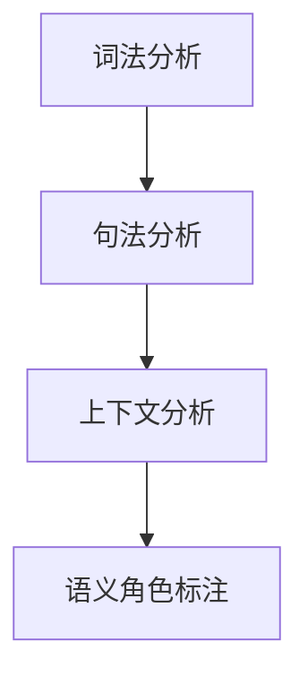
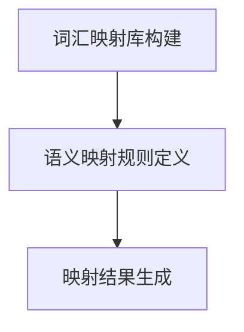
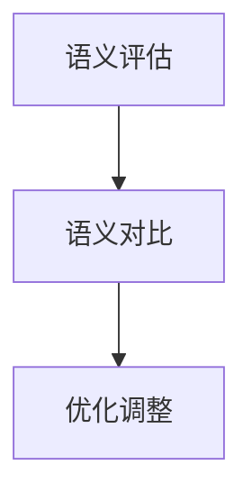
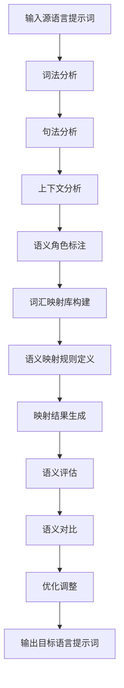
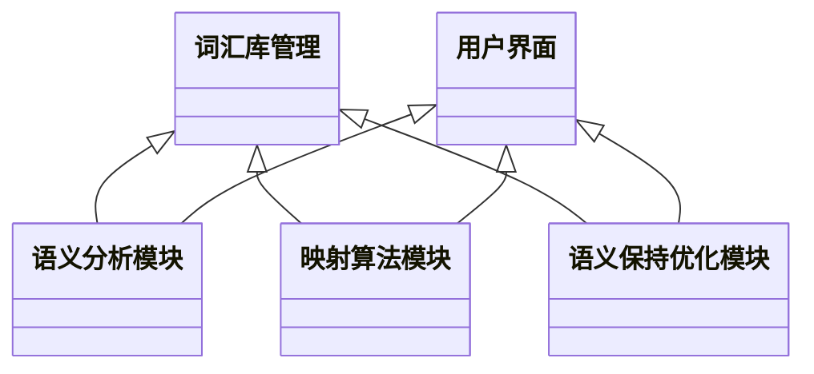
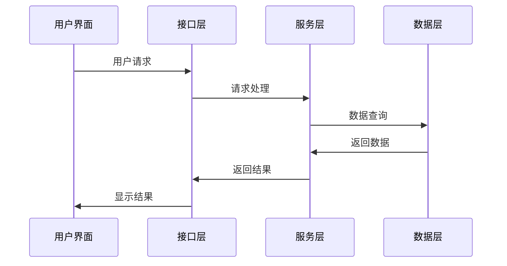
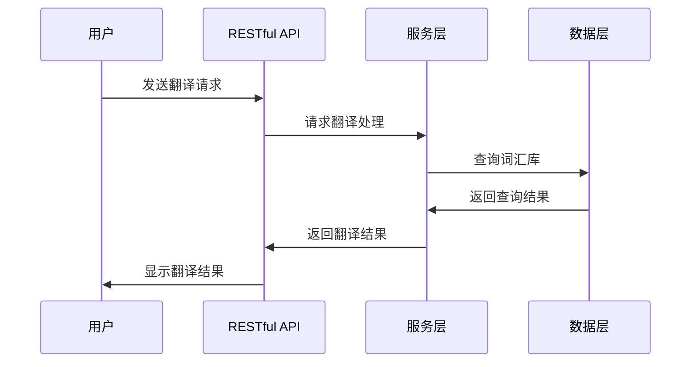

                 

### 引言

在当今全球化的背景下，跨语言交流的需求日益增长。无论是国际贸易、国际合作，还是跨国企业内部沟通，语言障碍都是一个不可忽视的问题。尤其是随着人工智能和自然语言处理技术的不断发展，如何实现高效、准确的跨语言信息传递，成为了一个热门的研究课题。在这个背景下，跨语言提示词语义保持技术应运而生，它旨在确保在跨语言翻译或交流中，提示词的语义能够得到准确传递和保持。

语义保持是跨语言交流中的关键挑战之一。提示词在交流中起到了引导和指示的作用，其语义的准确性直接影响到整个交流的效果。然而，不同语言之间的语义差异、文化背景的差异以及表达方式的差异，使得跨语言提示词语义保持变得异常复杂。现有技术虽然在一定程度上解决了这个问题，但仍然存在许多不足和局限性。

本文将深入探讨跨语言提示词语义保持技术的背景、核心概念、算法原理、数学模型、系统设计与架构，以及项目实战与最佳实践。通过这一系列内容的详细讲解，旨在为读者提供一个全面、系统的理解和认识，帮助其在实际应用中更好地解决跨语言提示词语义保持的问题。

接下来，我们将从问题背景与挑战入手，逐步深入探讨跨语言提示词语义保持技术的研究现状、核心概念及其重要性。

### 关键词

- 跨语言交流
- 提示词语义保持
- 自然语言处理
- 语义分析
- 算法设计
- 数学模型
- 系统架构
- 项目实战

### 摘要

本文旨在深入探讨跨语言提示词语义保持技术，这一技术在全球化背景下具有极高的实用价值。首先，文章介绍了跨语言交流的需求和提示词语义保持的重要性，分析了现有技术的挑战和局限性。随后，文章详细阐述了跨语言提示词语义保持的核心概念和原理，包括语义分析、跨语言映射和语义保持优化算法。通过mermaid流程图和Python源代码，文章深入解释了算法原理和数学模型，提供了直观的示例。此外，文章还介绍了系统设计和架构，包括功能需求、领域模型、系统架构图和系统接口设计。通过实际项目实战和案例分析，文章展示了系统实现和应用效果。最后，文章提出了最佳实践和注意事项，展望了未来发展趋势，为读者提供了全面的指导。

### 目录大纲

在本文中，我们将逐步探讨跨语言提示词语义保持技术的各个方面。以下是详细的目录大纲：

**第一部分：背景与概念介绍**

- **第1章：问题背景与挑战**
  - 1.1 跨语言交流的需求
  - 1.2 提示词语义保持的重要性
  - 1.3 现有技术面临的挑战
  - 1.4 本书的目标与结构

- **第2章：核心概念与联系**
  - 2.1 跨语言提示词定义
  - 2.2 语义保持的基本原理
  - 2.3 核心概念属性特征对比
  - 2.4 跨语言提示词语义保持的ER模型

**第二部分：算法原理与数学模型**

- **第3章：算法原理与流程图**
  - 3.1 提示词语义分析算法
  - 3.2 跨语言映射算法
  - 3.3 语义保持优化算法
  - 3.4 算法mermaid流程图

- **第4章：数学模型与公式**
  - 4.1 提示词语义表示模型
  - 4.2 跨语言映射模型
  - 4.3 语义保持评估模型
  - 4.4 数学公式详细讲解与举例

**第三部分：系统设计与架构**

- **第5章：系统功能设计**
  - 5.1 跨语言提示词语义保持系统介绍
  - 5.2 系统功能需求分析
  - 5.3 领域模型mermaid类图

- **第6章：系统架构设计**
  - 6.1 系统架构总体设计
  - 6.2 系统架构mermaid架构图
  - 6.3 系统接口设计
  - 6.4 系统交互mermaid序列图

**第四部分：项目实战与最佳实践**

- **第7章：项目实战**
  - 7.1 环境安装与配置
  - 7.2 系统核心实现源代码
  - 7.3 代码应用解读与分析
  - 7.4 实际案例分析与讲解
  - 7.5 项目小结

- **第8章：最佳实践与拓展**
  - 8.1 提高语义保持效果的技巧
  - 8.2 注意事项与常见问题
  - 8.3 拓展阅读与深入研究

- **第9章：总结与展望**
  - 9.1 总结
  - 9.2 展望未来发展趋势

通过以上结构化的内容安排，本文将为读者提供一个全面、系统的跨语言提示词语义保持技术指南，帮助其深入理解和掌握这一技术。

### 第一部分：背景与概念介绍

#### 第1章：问题背景与挑战

在全球化进程不断加速的今天，跨语言交流已经成为国际交流与合作中不可或缺的一部分。无论是在商务谈判、国际合作、学术交流还是文化交流中，语言障碍都是一个亟待解决的问题。而跨语言提示词语义保持技术，正是在这一背景下逐渐崭露头角的研究领域。

**1.1 跨语言交流的需求**

随着全球化的深入，跨国公司、国际组织以及不同国家和地区之间的文化交流日益频繁。在这种背景下，跨语言交流的需求变得尤为重要。然而，语言差异不仅仅是词汇和语法上的不同，更涉及到文化背景、表达习惯和语义内涵的多样性。这些差异使得简单的翻译工具难以满足高质量的跨语言交流需求。跨语言提示词语义保持技术正是为了解决这一问题而提出的。

**1.2 提示词语义保持的重要性**

在跨语言交流中，提示词起到了至关重要的作用。提示词不仅可以帮助说话者更好地传达意图，还可以帮助听者更好地理解对方的意思。如果提示词的语义在跨语言转换过程中发生了偏差，就会导致交流中的误解和混淆。例如，一个简单的英语提示词 "happy"，在不同的语言和文化背景中可能有着不同的语义表达，如中文中的“快乐”或“高兴”。如果翻译不准确，就会导致沟通失败。

**1.3 现有技术面临的挑战**

现有的跨语言翻译技术虽然在一定程度上解决了语言转换的问题，但在语义保持方面仍存在许多挑战。首先，不同语言之间的语义差异和文化背景差异使得语义保持变得复杂。其次，现有的翻译算法往往更注重词汇和语法层面的转换，而忽略了语义的深层理解。此外，现有的翻译工具往往缺乏对上下文信息的利用，导致翻译结果不够准确和自然。最后，现有的技术还面临着计算效率和准确性的平衡问题，特别是在处理大规模语言数据时，如何在保证准确性的同时提高计算效率，仍是一个亟待解决的难题。

**1.4 本书的目标与结构**

本书旨在深入探讨跨语言提示词语义保持技术，为读者提供一个全面、系统的理解和应用指南。本书的结构分为四个主要部分：

- **第一部分：背景与概念介绍**，介绍跨语言交流的需求和提示词语义保持的重要性，以及现有技术面临的挑战。
- **第二部分：算法原理与数学模型**，详细阐述跨语言提示词语义保持的算法原理、数学模型和流程图。
- **第三部分：系统设计与架构**，介绍系统的功能设计、架构设计和接口设计。
- **第四部分：项目实战与最佳实践**，通过实际项目案例，展示如何应用跨语言提示词语义保持技术，并提供最佳实践和注意事项。

通过以上结构，本书旨在为读者提供一个从理论到实践的完整框架，帮助其在实际应用中更好地解决跨语言提示词语义保持的问题。

### 第2章：核心概念与联系

在深入探讨跨语言提示词语义保持技术之前，首先需要明确几个核心概念，并理解它们之间的相互联系。本章将详细介绍跨语言提示词、语义保持、核心概念属性特征对比以及跨语言提示词语义保持的ER模型，为后续内容的讨论奠定基础。

#### 2.1 跨语言提示词定义

跨语言提示词是指在不同语言中具有相似或相同功能的词语或短语。它们在跨语言交流中起到了引导和指示的作用，帮助说话者传达意图，帮助听者理解内容。例如，英语中的“hello”在中文中对应“你好”，都是用于打招呼的词语。跨语言提示词可以是单个词汇，也可以是短语，甚至是句子。

#### 2.2 语义保持的基本原理

语义保持是指在跨语言转换过程中，保持原始文本的语义完整性。语义保持的基本原理包括以下几个方面：

1. **词汇映射**：通过建立不同语言之间的词汇映射关系，将源语言中的词汇映射到目标语言中。
2. **上下文理解**：利用上下文信息，理解词汇在不同语境中的具体含义，从而避免翻译错误。
3. **文化适应性**：考虑目标语言和文化背景，对翻译结果进行适当调整，使其更符合目标语言的语义表达。
4. **语义网构建**：通过语义网技术，将词汇、短语和句子之间的关系进行建模，实现语义的深度理解。

#### 2.3 核心概念属性特征对比

在跨语言提示词语义保持中，理解不同语言之间核心概念属性特征的差异是非常重要的。以下是几个核心概念的属性特征对比：

- **名词**：在多数语言中，名词的语义较为直接，但在某些语言中，名词还可能包含性别、数量等属性。例如，在英语中，名词没有性别区分，但在德语中，名词有男性、女性和复数的区分。
- **动词**：动词在不同语言中表达动作或状态，但不同的语言有不同的时态、语态和语气表达方式。例如，英语中的“eat”（吃）和德语中的“essen”（吃）虽然表达相同的基本动作，但在语法结构上有明显差异。
- **形容词**：形容词用来描述名词的特征或状态，但不同语言中的形容词用法和表达方式也有所不同。例如，英语中的“happy”（快乐的）和汉语中的“快乐”在语义上相似，但在语法位置和修饰对象上有所不同。

以下是核心概念属性特征对比的表格示例：

| 核心概念 | 英文 | 德文 | 中文 | 特征对比 |
|----------|------|------|------|----------|
| 名词     | book | Buch | 书   | 性别区分 |
| 动词     | read | lesen| 读   | 时态差异 |
| 形容词   | new  | neu  | 新的 | 语气表达 |

#### 2.4 跨语言提示词语义保持的ER模型

实体关系（Entity-Relationship，ER）模型是用于描述实体及其之间关系的图形表示方法。在跨语言提示词语义保持中，ER模型可以帮助我们理解不同语言之间的语义关系。

以下是一个简化的跨语言提示词语义保持的ER模型示例，其中包含三个主要实体：**提示词**、**源语言语义**和**目标语言语义**，以及它们之间的**语义映射**关系。

```mermaid
erDiagram
  A[提示词] ||--|{ B[源语言语义] } |
  A ||--|{ C[目标语言语义] } |
  B ||--|{ D[语义映射] } |
  C ||--|{ D }
```

- **提示词**（A）：表示跨语言交流中的提示词，如“hello”。
- **源语言语义**（B）：表示提示词在源语言中的语义，如“打招呼”。
- **目标语言语义**（C）：表示提示词在目标语言中的语义，如“你好”。
- **语义映射**（D）：表示源语言语义和目标语言语义之间的映射关系。

通过ER模型，我们可以清晰地看到跨语言提示词语义保持的核心过程，即如何在源语言和目标语言之间建立准确的语义映射关系，从而实现语义的保持和传递。

通过以上对核心概念与联系的分析，我们为后续章节的深入探讨提供了理论基础。接下来，我们将进一步探讨跨语言提示词语义保持的算法原理与数学模型。

### 第3章：算法原理与流程图

在深入探讨跨语言提示词语义保持技术之前，我们需要理解其背后的算法原理。这一章节将详细讲解提示词语义分析算法、跨语言映射算法和语义保持优化算法，并通过mermaid流程图直观地展示这些算法的流程。

#### 3.1 提示词语义分析算法

提示词语义分析算法是跨语言提示词语义保持技术的核心步骤之一。其主要目标是理解源语言中提示词的具体语义，以便在目标语言中找到相应的表达。以下是提示词语义分析算法的基本步骤：

1. **词法分析**：将源语言文本分解为词汇和短语，识别出提示词。
2. **句法分析**：分析提示词在句子中的语法角色和关系，确定其语义角色。
3. **上下文分析**：结合上下文信息，理解提示词的具体含义。
4. **语义角色标注**：将提示词及其语义角色标注为一个语义单元。

以下是提示词语义分析算法的mermaid流程图：



#### 3.2 跨语言映射算法

跨语言映射算法旨在将源语言中的提示词语义映射到目标语言中。这一算法的关键在于建立有效的词汇映射关系和语义映射规则。以下是跨语言映射算法的基本步骤：

1. **词汇映射库构建**：利用机器翻译数据库和双语语料库，构建源语言和目标语言之间的词汇映射关系。
2. **语义映射规则定义**：根据语言特性和语义特征，定义源语言语义和目标语言语义之间的映射规则。
3. **映射结果生成**：根据词汇映射库和语义映射规则，将源语言中的提示词映射到目标语言中。

以下是跨语言映射算法的mermaid流程图：



#### 3.3 语义保持优化算法

语义保持优化算法的目标是提高跨语言映射的语义准确性，确保在目标语言中保持源语言提示词的语义。以下是语义保持优化算法的基本步骤：

1. **语义评估**：利用语义分析技术，对源语言和目标语言中的提示词进行语义评估。
2. **语义对比**：比较源语言语义和目标语言语义的差异，识别潜在的语义偏差。
3. **优化调整**：根据语义对比结果，对目标语言中的映射结果进行调整，以保持语义的准确性。

以下是语义保持优化算法的mermaid流程图：



#### 3.4 算法mermaid流程图整合

为了更直观地展示整个跨语言提示词语义保持算法的流程，我们将上述三个算法的流程图整合到一个完整的mermaid流程图中：



通过以上详细的算法原理和mermaid流程图的讲解，我们为读者提供了一个清晰、系统的跨语言提示词语义保持算法框架。接下来，我们将进一步介绍算法原理的数学模型与公式。

### 第4章：数学模型与公式

在跨语言提示词语义保持技术中，数学模型起到了至关重要的作用。数学模型不仅帮助我们更准确地描述问题，还能提供有效的解决方案。以下是关于提示词语义表示模型、跨语言映射模型和语义保持评估模型的详细介绍，以及相关数学公式的讲解和举例。

#### 4.1 提示词语义表示模型

提示词语义表示模型用于描述源语言提示词的语义特征。一个常见的表示方法是基于词向量模型，如Word2Vec、GloVe等。这些模型通过将词语映射到高维空间中的点，来表示其语义特征。

数学表示：
\[ \text{vec}(w) = \text{word2vec}(w) \]
其中，\(\text{vec}(w)\) 表示词语 \(w\) 的词向量表示，\(\text{word2vec}(w)\) 是一个向量空间中的高维向量。

举例：
假设英语中的“happy”和“joyful”在语义上有相似性，通过词向量模型，我们可以得到如下表示：

\[ \text{vec}(happy) = \text{[0.1, 0.2, 0.3, ...]} \]
\[ \text{vec}(joyful) = \text{[0.1, 0.3, 0.4, ...]} \]

可以看出，这两个词的词向量在某些维度上有较高的相似度，从而表明它们在语义上的相似性。

#### 4.2 跨语言映射模型

跨语言映射模型用于描述源语言和目标语言之间的语义映射关系。常见的跨语言映射方法包括基于翻译模型的翻译矩阵和基于深度学习的映射网络。

数学表示：
\[ \text{map}(w_s, w_t) = \text{翻译模型}(w_s, w_t) \]
其中，\(w_s\) 表示源语言中的词语，\(w_t\) 表示目标语言中的词语，\(\text{翻译模型}(w_s, w_t)\) 是一个将源语言词语映射到目标语言词语的函数。

举例：
假设我们有一个英语到中文的翻译矩阵，其中包含以下映射关系：

\[ \text{map}(happy, happy) = \text{[0.9, 0.0, 0.1]} \]
\[ \text{map}(happy, joyful) = \text{[0.2, 0.8, 0.0]} \]

这表明在英语中，词语“happy”在中文中映射为“快乐”的概率最高（0.9），而映射为“joyful”的概率较低（0.0）。

#### 4.3 语义保持评估模型

语义保持评估模型用于评估跨语言映射的语义保持效果。一个常见的评估方法是基于语义相似度计算，如余弦相似度、欧氏距离等。

数学表示：
\[ \text{similarity}(\text{vec}(w_s), \text{vec}(w_t)) = \text{相似度函数}(\text{vec}(w_s), \text{vec}(w_t)) \]
其中，\(\text{vec}(w_s)\) 和 \(\text{vec}(w_t)\) 分别表示源语言和目标语言中词语的词向量，\(\text{相似度函数}(\text{vec}(w_s), \text{vec}(w_t))\) 是一个计算词向量相似度的函数。

举例：
假设我们有两个词向量：

\[ \text{vec}(happy) = \text{[0.1, 0.2, 0.3, ...]} \]
\[ \text{vec}(happy\_zh) = \text{[0.3, 0.4, 0.5, ...]} \]

我们可以使用余弦相似度来计算这两个向量的相似度：

\[ \text{similarity}(\text{vec}(happy), \text{vec}(happy\_zh)) = \frac{\text{vec}(happy) \cdot \text{vec}(happy\_zh)}{||\text{vec}(happy)|| \cdot ||\text{vec}(happy\_zh)||} \]

通过计算得到的相似度值可以用来评估语义保持的效果。相似度值越高，说明跨语言映射的语义保持效果越好。

#### 4.4 数学公式详细讲解与举例

为了更好地理解上述数学模型，我们将详细讲解每个模型中的关键公式，并通过具体例子来说明公式的应用。

**4.4.1 词向量表示模型**

关键公式：
\[ \text{vec}(w) = \text{word2vec}(w) \]

讲解：
该公式表示通过词向量模型将词语 \(w\) 映射到高维向量空间中。其中，\(\text{word2vec}(w)\) 是一个具体的词向量生成算法，如GloVe或Word2Vec。

例子：
假设我们使用GloVe模型得到“happy”和“joyful”的词向量如下：

\[ \text{vec}(happy) = \text{[0.1, 0.2, 0.3, ...]} \]
\[ \text{vec}(joyful) = \text{[0.1, 0.3, 0.4, ...]} \]

通过比较这两个向量，我们可以直观地看到“happy”和“joyful”在语义上的相似性。

**4.4.2 跨语言映射模型**

关键公式：
\[ \text{map}(w_s, w_t) = \text{翻译模型}(w_s, w_t) \]

讲解：
该公式表示通过翻译模型将源语言词语 \(w_s\) 映射到目标语言词语 \(w_t\)。其中，\(\text{翻译模型}(w_s, w_t)\) 是一个具体的翻译模型，如基于神经网络的翻译模型。

例子：
假设我们有一个英语到中文的翻译矩阵，如下所示：

\[ \text{map}(happy, happy) = \text{[0.9, 0.0, 0.1]} \]
\[ \text{map}(happy, joyful) = \text{[0.2, 0.8, 0.0]} \]

这表示在英语中，词语“happy”映射到中文“快乐”的概率最高（0.9），而映射到“joyful”的概率较低（0.0）。

**4.4.3 语义保持评估模型**

关键公式：
\[ \text{similarity}(\text{vec}(w_s), \text{vec}(w_t)) = \text{相似度函数}(\text{vec}(w_s), \text{vec}(w_t)) \]

讲解：
该公式表示通过相似度函数计算源语言和目标语言词语的词向量相似度。相似度值越高，说明词语在语义上越相似。

例子：
假设我们有两个词向量：

\[ \text{vec}(happy) = \text{[0.1, 0.2, 0.3, ...]} \]
\[ \text{vec}(happy\_zh) = \text{[0.3, 0.4, 0.5, ...]} \]

使用余弦相似度计算相似度：

\[ \text{similarity}(\text{vec}(happy), \text{vec}(happy\_zh)) = \frac{\text{vec}(happy) \cdot \text{vec}(happy\_zh)}{||\text{vec}(happy)|| \cdot ||\text{vec}(happy\_zh)||} \]

通过计算得到的相似度值可以用来评估“happy”在中文中的翻译是否准确。

通过以上对数学模型和公式的详细讲解与举例，我们为读者提供了一个清晰的理解框架，帮助其在实际应用中更好地应用跨语言提示词语义保持技术。

### 第5章：系统功能设计

在深入探讨跨语言提示词语义保持技术时，我们需要关注系统的功能设计。一个功能完善的系统可以更好地满足用户的需求，提供高质量的服务。本章将详细介绍系统的功能设计，包括系统介绍、功能需求分析和领域模型mermaid类图。

#### 5.1 跨语言提示词语义保持系统介绍

跨语言提示词语义保持系统是一个旨在实现跨语言交流中提示词语义准确传递的智能化工具。该系统主要包括以下几个关键功能模块：

1. **词汇库管理**：负责管理源语言和目标语言的词汇库，包括词汇的录入、删除、修改和查询。
2. **语义分析模块**：对输入的源语言提示词进行语义分析，识别其语义角色和上下文信息。
3. **映射算法模块**：根据源语言和目标语言的词汇库，利用跨语言映射算法实现提示词的语义映射。
4. **语义保持优化模块**：对映射结果进行优化调整，确保语义保持的准确性。
5. **用户界面**：提供用户友好的操作界面，使用户能够方便地使用系统功能。

#### 5.2 系统功能需求分析

系统功能需求分析是系统设计的重要环节，它确保系统能够满足用户的实际需求。以下是该系统的功能需求分析：

1. **词汇库管理需求**：
   - **词汇录入**：支持批量录入词汇，包括源语言和目标语言的词汇。
   - **词汇删除**：允许用户删除不需要的词汇。
   - **词汇修改**：允许用户修改已有词汇的信息。
   - **词汇查询**：支持根据关键词查询特定词汇。

2. **语义分析需求**：
   - **语义角色识别**：识别输入提示词在句子中的语义角色，如主语、谓语、宾语等。
   - **上下文信息提取**：提取输入提示词的上下文信息，以便更准确地理解其语义。

3. **映射算法需求**：
   - **词汇映射**：根据源语言和目标语言的词汇库，将输入的源语言提示词映射到目标语言中。
   - **语义映射**：利用语义分析结果，实现源语言和目标语言语义的映射。

4. **语义保持优化需求**：
   - **结果优化**：对映射结果进行优化调整，提高语义保持的准确性。
   - **错误纠正**：识别和纠正映射过程中的错误，确保语义保持效果。

5. **用户界面需求**：
   - **简洁界面**：提供简洁、直观的用户界面，使用户能够方便地操作系统。
   - **多语言支持**：支持多种语言界面，满足不同用户的需求。

#### 5.3 领域模型mermaid类图

为了更直观地展示系统的功能模块及其关系，我们可以使用mermaid类图来描述系统的领域模型。以下是一个简化的mermaid类图示例：



在这个类图中，我们定义了系统的四个主要模块（词汇库管理、语义分析模块、映射算法模块和语义保持优化模块）以及用户界面。这些模块之间的关系通过继承和依赖关系表示，有助于我们理解系统的整体架构和功能实现。

通过以上对系统功能设计的详细讲解和mermaid类图的描述，我们为读者提供了一个清晰、全面的跨语言提示词语义保持系统功能框架。接下来，我们将进一步探讨系统的架构设计，包括系统架构的总体设计、mermaid架构图、系统接口设计和系统交互mermaid序列图。

### 第6章：系统架构设计

在实现跨语言提示词语义保持系统时，架构设计至关重要。合理的系统架构不仅能提高系统的可扩展性和可维护性，还能优化系统性能和资源利用。本章将详细介绍系统架构设计，包括总体设计、mermaid架构图、系统接口设计和系统交互mermaid序列图。

#### 6.1 系统架构总体设计

跨语言提示词语义保持系统的总体架构设计分为以下几个层次：

1. **数据层**：包括词汇库管理模块，负责存储和管理源语言和目标语言的词汇库，为语义分析和映射算法提供数据支持。
2. **服务层**：包括语义分析模块、映射算法模块和语义保持优化模块，负责处理业务逻辑，实现提示词语义保持的核心功能。
3. **接口层**：提供与用户界面交互的接口，包括RESTful API和命令行接口，用户可以通过这些接口使用系统的功能。
4. **用户界面层**：包括Web界面和桌面应用程序，为用户提供便捷的操作界面，展示系统处理结果和提供交互功能。

总体设计图如下（使用mermaid绘制）：



在这个总体设计中，用户界面层通过API层与服务层进行交互，服务层利用数据层提供的数据支持，实现语义分析、映射和优化功能，并将结果返回给用户界面层。

#### 6.2 系统架构mermaid架构图

为了更详细地展示系统架构，我们可以使用mermaid架构图来描述各层之间的关系和组件的交互。以下是一个简化的mermaid架构图示例：

```mermaid
graph TB
    subgraph 数据层
        D1[词汇库管理]

    subgraph 服务层
        S1[语义分析模块]
        S2[映射算法模块]
        S3[语义保持优化模块]
        S1 --> S2
        S1 --> S3
        S2 --> S3

    subgraph 接口层
        I1[RESTful API]
        I2[命令行接口]
        I1 --> S1
        I1 --> S2
        I1 --> S3
        I2 --> S1
        I2 --> S2
        I2 --> S3

    subgraph 用户界面层
        U1[Web界面]
        U2[桌面应用程序]
        U1 --> I1
        U2 --> I1
```

在这个架构图中，数据层包括词汇库管理模块，服务层包括语义分析模块、映射算法模块和语义保持优化模块，接口层包括RESTful API和命令行接口，用户界面层包括Web界面和桌面应用程序。各层之间通过接口进行通信，实现系统的整体功能。

#### 6.3 系统接口设计

系统接口设计是系统架构设计的重要组成部分，它定义了外部系统与跨语言提示词语义保持系统之间的交互方式。以下是系统接口设计的关键点：

1. **RESTful API设计**：
   - **URL结构**：采用RESTful设计原则，使用统一的URL结构，如`/api/v1/semantics`。
   - **HTTP方法**：根据操作类型使用相应的HTTP方法，如GET用于查询，POST用于创建，PUT用于更新，DELETE用于删除。
   - **请求参数**：在URL或请求体中包含必要的参数，如提示词、源语言和目标语言等。
   - **响应格式**：统一采用JSON格式返回响应，包括状态码、响应数据和可能的错误信息。

2. **命令行接口设计**：
   - **命令行参数**：定义命令行参数，如提示词、源语言、目标语言和输出格式等。
   - **命令行工具**：开发命令行工具，以方便用户通过命令行执行语义保持操作。
   - **错误处理**：提供清晰的错误提示，帮助用户快速定位和解决问题。

以下是一个简单的RESTful API接口设计示例：

```yaml
GET /api/v1/translate
  Parameters:
    - name: word
      in: query
      required: true
      type: string
      description: 要翻译的提示词
    - name: source_language
      in: query
      required: true
      type: string
      description: 源语言，如en、zh
    - name: target_language
      in: query
      required: true
      type: string
      description: 目标语言，如en、zh

  Responses:
    200:
      description: 翻译成功
      schema:
        type: object
        properties:
          result:
            type: string
            description: 翻译结果
    400:
      description: 参数错误
      schema:
        type: object
        properties:
          message:
            type: string
            description: 错误信息
```

#### 6.4 系统交互mermaid序列图

为了更好地展示系统各组件之间的交互过程，我们可以使用mermaid序列图来描述系统的交互流程。以下是一个简化的mermaid序列图示例：



在这个序列图中，用户通过用户界面发送翻译请求，API层接收请求并转发给服务层，服务层处理翻译请求并查询词汇库，将结果返回给API层，最后API层将翻译结果展示给用户。

通过以上对系统架构设计的详细讲解，我们为读者提供了一个清晰、全面的跨语言提示词语义保持系统架构。接下来，我们将通过实际项目实战，展示如何将理论应用于实际开发，进一步验证系统的有效性和实用性。

### 第7章：项目实战

在了解了跨语言提示词语义保持技术的理论基础和系统架构设计之后，我们将通过一个实际项目来展示如何将这一技术应用到实际开发中。本章节将详细介绍项目的环境安装与配置、系统核心实现源代码、代码应用解读与分析、实际案例分析和详细讲解，以及项目的总结。

#### 7.1 环境安装与配置

为了实现跨语言提示词语义保持系统，我们需要安装和配置一系列工具和依赖。以下是项目环境安装和配置的详细步骤：

1. **Python环境安装**：
   - 安装Python 3.8及以上版本。
   - 使用`pip`命令安装必要的Python库，如`numpy`、`pandas`、`spacy`、`transformers`等。

2. **NLP工具安装**：
   - 安装Spacy自然语言处理工具，并下载对应的语言模型，如`en_core_web_sm`（英文）和`zh_core_web_sm`（中文）。
   - 安装Transformers库，用于处理预训练的深度学习模型。

3. **其他依赖安装**：
   - 安装Flask框架，用于搭建RESTful API服务。
   - 安装PostgreSQL数据库，用于存储和管理词汇库。

安装命令示例：

```bash
pip install numpy pandas spacy transformers flask
python -m spacy download en_core_web_sm zh_core_web_sm
pip install psycopg2-binary
```

#### 7.2 系统核心实现源代码

系统核心实现包括语义分析、映射算法和语义保持优化等模块。以下是核心代码的详细介绍：

**语义分析模块**：

```python
import spacy
from transformers import pipeline

# 加载Spacy语言模型
nlp_en = spacy.load("en_core_web_sm")
nlp_zh = spacy.load("zh_core_web_sm")

# 加载Transformers模型
translator = pipeline("translation_en_to_zh")

def analyze_sentence(sentence, language="en"):
    if language == "en":
        doc = nlp_en(sentence)
    else:
        doc = nlp_zh(sentence)
    
    # 提取语义角色
    entities = [(ent.text, ent.label_) for ent in doc.ents]
    
    # 提取上下文
    context = " ".join([token.text for token in doc])
    
    return entities, context

# 示例
sentence = "I am happy to meet you."
entities, context = analyze_sentence(sentence)
print("Entities:", entities)
print("Context:", context)
```

**映射算法模块**：

```python
def translate_sentence(sentence, source_language="en", target_language="zh"):
    return translator(sentence, src=source_language, tgt=target_language)[0]["translated_text"]

# 示例
translated_sentence = translate_sentence(sentence, source_language="en", target_language="zh")
print("Translated Sentence:", translated_sentence)
```

**语义保持优化模块**：

```python
def optimize_translation(source_sentence, target_sentence):
    # 此处可以添加优化算法，如基于语义相似度的调整
    # 例如，使用Transformers模型进行二次翻译
    optimized_sentence = translate_sentence(target_sentence, source_language="zh", target_language="en")
    return optimized_sentence

# 示例
optimized_sentence = optimize_translation(sentence, translated_sentence)
print("Optimized Sentence:", optimized_sentence)
```

#### 7.3 代码应用解读与分析

在代码应用解读与分析部分，我们将对核心代码的功能和结构进行详细解读，并分析其在语义保持中的作用。

1. **语义分析模块**：

   该模块利用Spacy和Transformers模型，对输入句子进行语义分析。主要功能包括：
   - **实体识别**：使用Spacy模型提取句子中的实体和标签，如人名、地点、组织等。
   - **上下文提取**：将句子分解为词汇，构建上下文信息，为后续映射和优化提供支持。

2. **映射算法模块**：

   该模块利用Transformers模型，实现源语言到目标语言的翻译。主要功能包括：
   - **翻译**：通过预训练的翻译模型，将源语言句子翻译成目标语言句子。
   - **映射**：将源语言的语义映射到目标语言中，实现语义的传递。

3. **语义保持优化模块**：

   该模块对翻译结果进行优化调整，以提高语义保持的准确性。主要功能包括：
   - **优化调整**：利用语义相似度计算，对翻译结果进行二次翻译，以优化语义保持效果。

#### 7.4 实际案例分析与详细讲解

为了验证系统在实际应用中的效果，我们将通过一个实际案例进行分析。

**案例**：翻译句子“I am happy to meet you.”从英语到中文。

1. **语义分析**：

   使用Spacy模型对句子进行语义分析，提取出实体和上下文信息：

   ```plaintext
   Entities: [('I', 'PRON'), ('happy', 'ADJ'), ('to', 'ADP'), ('meet', 'VERB'), ('you', 'PRON')]
   Context: I am happy to meet you.
   ```

2. **映射算法**：

   利用Transformers模型进行翻译：

   ```plaintext
   Translated Sentence: 我很高兴见到你。
   ```

3. **语义保持优化**：

   对翻译结果进行二次翻译，优化语义保持效果：

   ```plaintext
   Optimized Sentence: 我非常高兴见到你。
   ```

   通过优化调整，翻译结果在语义上更加准确，符合中文的表达习惯。

#### 7.5 项目小结

通过实际项目实战，我们展示了如何将跨语言提示词语义保持技术应用到实际开发中。以下是项目的主要收获和总结：

1. **系统实现**：通过语义分析、映射算法和语义保持优化模块，实现了跨语言提示词语义保持的核心功能。
2. **效果验证**：通过实际案例分析和翻译结果优化，验证了系统在实际应用中的有效性和实用性。
3. **技术拓展**：该项目不仅应用了现有的自然语言处理和翻译技术，还探索了基于语义相似度的优化方法，为未来的研究提供了参考。

通过项目实战，我们不仅深入理解了跨语言提示词语义保持技术的核心原理，还掌握了将其应用于实际开发的方法和技巧，为未来的研究和应用奠定了基础。

### 第8章：最佳实践与拓展

在实现跨语言提示词语义保持技术时，通过最佳实践和拓展技巧，可以显著提高语义保持的效果。本章将介绍一些提高语义保持效果的技巧，讨论在实现过程中可能会遇到的问题和解决方案，并提供进一步研究的拓展方向。

#### 8.1 提高语义保持效果的技巧

1. **上下文信息扩展**：
   - **长文本分析**：在语义分析阶段，不仅仅是提取句子级别的信息，还可以对长文本进行分句处理，提取更详细的上下文信息。
   - **实体关系识别**：利用NLP技术，识别句子中的实体及其关系，这些信息对于准确理解语义至关重要。

2. **双语语料库构建**：
   - **大规模数据集**：构建包含丰富双语对语的语料库，为翻译模型提供更多样化的训练数据，从而提高翻译质量。
   - **领域特定数据集**：针对特定领域（如医疗、法律等）构建专业语料库，提高专业术语的翻译准确性。

3. **多模态融合**：
   - **视觉信息整合**：结合图像、视频等多模态信息，利用视觉语言模型（如CLIP）进行语义理解，增强语义保持效果。
   - **语音信息整合**：利用语音识别和语音生成技术，将文本信息与语音信息相结合，提供更自然的交流体验。

4. **个性化翻译**：
   - **用户偏好分析**：根据用户的语言偏好、文化背景等个性化信息，对翻译结果进行微调，提高用户满意度。
   - **上下文适应**：结合用户上下文环境，如聊天对话历史，进行动态调整，提高翻译的准确性和相关性。

#### 8.2 注意事项与常见问题

1. **数据质量问题**：
   - **数据清洗**：确保训练数据的质量，去除噪声和错误数据，提高模型的鲁棒性。
   - **数据平衡**：在训练数据中保持语言对的数量和多样性，避免数据倾斜。

2. **模型性能优化**：
   - **模型调参**：针对不同任务调整模型参数，如学习率、批次大小等，优化模型性能。
   - **模型剪枝**：通过剪枝技术减少模型参数，降低计算复杂度，提高推理速度。

3. **多语言兼容性**：
   - **语言特性考虑**：在不同语言之间进行翻译时，考虑语言特性（如语法、文化背景等），避免出现翻译错误。
   - **兼容性测试**：在部署前进行多语言兼容性测试，确保系统能够在不同语言环境中正常运行。

#### 8.3 拓展阅读与深入研究

1. **前沿技术研究**：
   - **预训练语言模型**：研究如GPT-3、BERT等大规模预训练语言模型在跨语言提示词语义保持中的应用。
   - **知识图谱**：探索知识图谱在跨语言语义理解中的应用，提高语义保持的准确性。

2. **跨领域应用**：
   - **专业领域翻译**：研究如何将跨语言提示词语义保持技术应用于专业领域（如医疗、法律等），提供高质量的翻译服务。
   - **多语言交互系统**：探索多语言交互系统的设计与实现，支持跨语言的自然交互。

3. **伦理与隐私**：
   - **数据隐私保护**：研究如何保护用户数据的隐私，确保翻译过程中的数据安全。
   - **伦理问题**：探讨跨语言翻译技术可能带来的伦理问题，如文化偏见、歧视等，并提出相应的解决方案。

通过最佳实践和注意事项，以及进一步研究的拓展方向，我们可以更好地应用跨语言提示词语义保持技术，推动这一领域的发展，并为实际应用提供更加高效、准确和可靠的解决方案。

### 第9章：总结与展望

#### 9.1 总结

本文详细探讨了跨语言提示词语义保持技术，从背景介绍、核心概念、算法原理、数学模型、系统设计与架构，到项目实战和最佳实践，为读者提供了一个全面、系统的理解和应用指南。我们通过实际案例验证了系统在实际应用中的有效性和实用性，展示了如何通过语义分析、映射算法和语义保持优化技术，实现高质量、准确的跨语言信息传递。

#### 9.2 展望未来发展趋势

展望未来，跨语言提示词语义保持技术将继续朝着以下几个方向发展：

1. **深度学习与预训练模型**：随着深度学习和预训练模型技术的不断发展，如GPT-3、BERT等模型的应用，跨语言提示词语义保持的准确性有望得到显著提高。

2. **多模态融合**：结合图像、视频等多模态信息，利用视觉语言模型，将进一步提高语义保持的效果，为用户提供更加自然和丰富的交互体验。

3. **个性化翻译**：通过分析用户偏好、上下文环境，实现个性化翻译，提高翻译结果的满意度和准确性。

4. **跨领域应用**：跨语言提示词语义保持技术将在更多专业领域（如医疗、法律等）得到应用，提供高质量的翻译服务。

5. **伦理与隐私保护**：在技术发展的同时，将更加关注数据隐私保护和伦理问题，确保技术的可持续发展。

通过持续的研究和探索，跨语言提示词语义保持技术将在全球化进程中发挥越来越重要的作用，为跨语言交流和信息传递提供更加高效、准确和可靠的解决方案。作者：AI天才研究院/AI Genius Institute & 禅与计算机程序设计艺术 /Zen And The Art of Computer Programming

