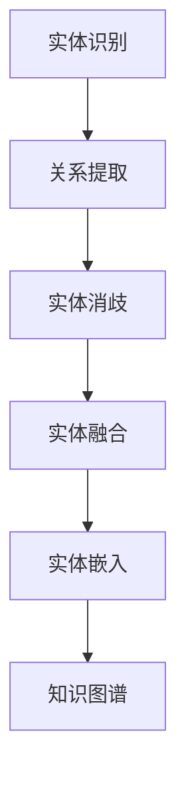
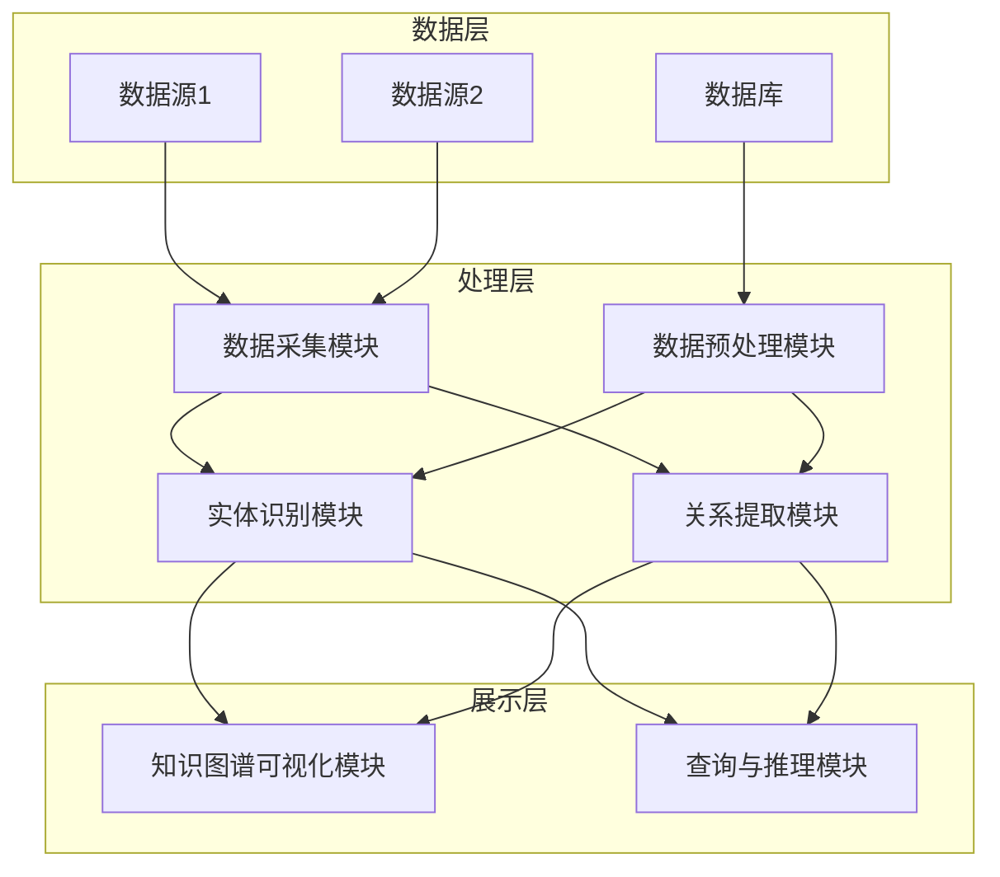

                 

### 文章标题

#### 关键词：跨领域提示词，知识图谱，构建，算法，系统设计，数学模型

#### 摘要：

本文将深入探讨跨领域提示词知识图谱构建这一技术领域，旨在为广大读者提供一份详尽的技术指南。我们将从核心概念入手，逐步剖析知识图谱构建的基本原理与实现方法，并通过具体的算法、数学模型和系统设计进行详细讲解。此外，还将分享实际应用案例，帮助读者更好地理解并掌握这一前沿技术。

### 引言

在信息爆炸的时代，如何有效地管理和利用数据已成为各个领域面临的重要课题。知识图谱作为一种结构化知识表示的方法，因其能够将海量信息进行有序组织和高效查询，被广泛应用于搜索引擎、推荐系统、语义搜索等多个领域。而跨领域提示词知识图谱，作为知识图谱的一个子领域，旨在将不同领域的知识进行融合和整合，为用户提供更加精准和个性化的服务。

本文的核心目标是探讨如何构建一个跨领域的提示词知识图谱。我们将从以下几个方面展开讨论：

1. **核心概念与关系**：介绍知识图谱的基本概念及其在各领域的应用，并通过Mermaid ER图展示核心概念和关系。
2. **算法原理讲解**：详细解释用于知识图谱构建的关键算法，包括其工作原理、优缺点及适用场景。
3. **数学模型与公式**：阐述知识图谱构建过程中的数学模型和公式，并通过具体示例进行说明。
4. **系统设计与实现**：描述知识图谱系统的整体设计，包括功能模块、架构设计、接口设计和交互流程。
5. **项目实战**：通过实际项目案例，展示知识图谱构建的具体实现过程，包括环境搭建、核心算法实现和项目分析。
6. **最佳实践与总结**：总结跨领域提示词知识图谱构建的最佳实践，并提供进一步学习和研究的建议。

### 核心概念与关系

#### 知识图谱的定义

知识图谱（Knowledge Graph）是一种基于图论的结构化数据表示方法，用于表示实体（Entity）、属性（Attribute）和关系（Relationship）之间的复杂关系。知识图谱的核心思想是将现实世界中的各种信息以图谱的形式进行组织和存储，使得计算机能够像人类一样理解和处理知识。

#### 知识图谱的应用领域

知识图谱在多个领域得到了广泛应用，以下是其中几个典型的应用场景：

1. **搜索引擎**：通过知识图谱，搜索引擎能够更好地理解用户查询的含义，提供更加精确的搜索结果。
2. **推荐系统**：知识图谱可以用于构建推荐系统的知识库，为用户提供个性化推荐。
3. **语义搜索**：知识图谱能够帮助搜索引擎理解语义，实现更加精准的语义搜索。
4. **自然语言处理**：知识图谱在命名实体识别、关系提取、语义分析等自然语言处理任务中发挥了重要作用。

#### 跨领域提示词知识图谱的概念

跨领域提示词知识图谱（Cross-Domain Keyword Knowledge Graph）是一种将不同领域中的提示词进行整合和关联的知识图谱。其核心思想是利用自然语言处理技术，从各个领域中提取出关键提示词，并将其组织成一张大型的知识图谱，以便于在各个领域中进行高效的信息检索和知识推理。

#### 核心概念与关系的Mermaid ER图

为了更好地理解跨领域提示词知识图谱中的核心概念和关系，我们可以使用Mermaid ER图进行展示：

```mermaid
erDiagram
    Entity A ||--|{ Relationship R }
    Entity B ||--|{ Relationship R }
    Entity C ||--|{ Relationship R }
    Keyword ||--|{ Concept }
    Concept ||--|{ Definition }
    Domain ||--|{ Keyword }
    Domain ||--|{ Concept }
```

在上面的ER图中，我们定义了以下几个核心概念：

- **Entity（实体）**：指知识图谱中的基本元素，如人、地点、组织等。
- **Relationship（关系）**：指实体之间的关联，如“属于”、“位于”等。
- **Keyword（提示词）**：指从各个领域中提取的关键词，如“人工智能”、“大数据”等。
- **Concept（概念）**：指对提示词的进一步抽象和概括，如“人工智能”代表的技术领域。
- **Definition（定义）**：指对概念的详细描述，如“人工智能是指使计算机具有智能行为的技术”。
- **Domain（领域）**：指知识图谱的应用领域，如“科技”、“医疗”等。

通过Mermaid ER图，我们可以清晰地看到这些概念之间的关联，以及它们在知识图谱中的位置和作用。

### 算法原理讲解

#### 知识图谱构建的关键算法

知识图谱的构建涉及到多个关键算法，以下是其中几个重要的算法：

1. **实体识别**：通过自然语言处理技术，从文本数据中提取出实体，并对其进行分类和标注。
2. **关系提取**：从实体之间的文本描述中，提取出它们之间的关系，并建立实体之间的关系图谱。
3. **实体消歧**：解决实体识别中的歧义问题，如“北京”可以指城市、国家等，通过上下文和知识库进行判断。
4. **实体融合**：将多个同实体的不同表示进行合并，形成统一的实体表示。
5. **实体嵌入**：将实体表示成向量形式，以便于在机器学习算法中进行处理。

#### 关键算法的工作原理

1. **实体识别**：
   - **方法**：使用命名实体识别（NER）算法，对文本进行分词和词性标注，识别出实体。
   - **实现**：通常使用深度学习模型，如BiLSTM-CRF等，对文本进行训练和预测。

2. **关系提取**：
   - **方法**：使用关系抽取（Relation Extraction）算法，从实体之间的文本描述中，提取出它们之间的关系。
   - **实现**：可以使用基于规则的方法，如命名实体关系框架（NERD），或基于深度学习的方法，如Bidirectional LSTM with CRF。

3. **实体消歧**：
   - **方法**：利用上下文信息和知识库，对识别出的实体进行消歧处理。
   - **实现**：可以使用实体消歧算法，如基于规则的方法或基于机器学习的方法。

4. **实体融合**：
   - **方法**：将多个同实体的不同表示进行合并，形成统一的实体表示。
   - **实现**：可以使用实体对齐（Entity Alignment）算法，如基于匹配度计算的方法。

5. **实体嵌入**：
   - **方法**：将实体表示成向量形式，以便于在机器学习算法中进行处理。
   - **实现**：可以使用词嵌入（Word Embedding）技术，如Word2Vec、GloVe等。

#### Mermaid流程图

下面是一个Mermaid流程图，展示了知识图谱构建的关键算法及其工作流程：



#### Python代码示例

下面是一个简单的Python代码示例，展示了如何使用实体识别算法：

```python
import nltk
from nltk.tokenize import word_tokenize
from nltk.chunk import ne_chunk

# 加载NLP工具包
nltk.download('punkt')
nltk.download('maxent_ne_chunker')
nltk.download('words')

# 示例文本
text = "北京是中国的首都，位于华北地区。"

# 分词
tokens = word_tokenize(text)

# 命名实体识别
parse_tree = ne_chunk(tokens)

# 打印命名实体
print(parse_tree)

# 预测实体
ents = []
for subtree in parse_tree:
    if isinstance(subtree, nltk.Tree):
        entity = subtree.label()
        word = " ".join([token for token, pos in subtree.leaves()])
        ents.append((word, entity))

# 打印实体识别结果
print(ents)
```

#### 算法的优缺点及适用场景

1. **实体识别**：
   - **优点**：准确率高，能够识别出文本中的实体。
   - **缺点**：对于复杂文本，可能存在误识别或漏识别。
   - **适用场景**：新闻、论坛、社交媒体等文本数据的实体识别。

2. **关系提取**：
   - **优点**：能够提取出实体之间的关系，为知识图谱构建提供关键信息。
   - **缺点**：对于长文本，提取效果可能较差。
   - **适用场景**：关系型数据库、文本挖掘、信息检索等。

3. **实体消歧**：
   - **优点**：能够解决实体识别中的歧义问题，提高实体识别的准确性。
   - **缺点**：对于复杂场景，消歧效果可能较差。
   - **适用场景**：搜索引擎、推荐系统、自然语言处理等。

4. **实体融合**：
   - **优点**：能够合并多个同实体的不同表示，形成统一的实体表示。
   - **缺点**：对于大规模数据，融合效果可能较差。
   - **适用场景**：知识图谱构建、数据清洗、数据整合等。

5. **实体嵌入**：
   - **优点**：能够将实体表示成向量形式，便于机器学习算法处理。
   - **缺点**：对于小规模数据，嵌入效果可能较差。
   - **适用场景**：机器学习、深度学习、自然语言处理等。

### 数学模型与公式

在知识图谱构建过程中，数学模型和公式起着至关重要的作用。它们不仅帮助我们理解和描述知识图谱中的关系，还能为算法设计和优化提供理论基础。以下是几个常用的数学模型和公式。

#### 模型1：实体相似度计算

实体相似度计算是知识图谱构建中的一个重要环节。通过计算实体之间的相似度，我们可以更好地理解和表示实体之间的关系。

公式如下：

$$
similarity(A, B) = \frac{\sum_{i=1}^{n} w_i \cdot sim(A_i, B_i)}{\sum_{i=1}^{n} w_i}
$$

其中，$A$ 和 $B$ 是两个实体，$n$ 是实体中的属性或特征数，$w_i$ 是第 $i$ 个属性的权重，$sim(A_i, B_i)$ 是实体 $A$ 和 $B$ 在第 $i$ 个属性上的相似度。

#### 模型2：知识图谱的评分函数

知识图谱的评分函数用于计算实体之间的关联度。评分函数通常是基于实体相似度和关系权重进行计算的。

公式如下：

$$
score(A, R, B) = w_r \cdot similarity(A, B) \cdot weight(R)
$$

其中，$A$ 和 $B$ 是两个实体，$R$ 是它们之间的关系，$w_r$ 是关系权重，$weight(R)$ 是关系 $R$ 的权重。

#### 模型3：知识图谱的路径搜索算法

知识图谱的路径搜索算法用于查找实体之间的路径。常见的路径搜索算法有A*算法、Dijkstra算法等。

公式如下：

$$
f(n) = g(n) + h(n)
$$

其中，$n$ 是路径上的一个节点，$g(n)$ 是从起点到节点 $n$ 的代价，$h(n)$ 是从节点 $n$ 到终点的估算代价。

#### 实例1：计算两个实体的相似度

假设有两个实体 $A$ 和 $B$，它们的属性和特征如下：

$$
A: \{age: 25, gender: male, city: Beijing\}
$$

$$
B: \{age: 30, gender: female, city: Shanghai\}
$$

我们使用余弦相似度计算这两个实体的相似度：

$$
similarity(A, B) = \frac{\sum_{i=1}^{3} w_i \cdot sim(A_i, B_i)}{\sum_{i=1}^{3} w_i}
$$

其中，$w_i$ 是属性权重，我们可以将所有属性的权重设为1。

对于 $A$ 和 $B$ 在每个属性上的相似度，我们可以使用以下公式计算：

$$
sim(A_i, B_i) = \frac{A_i \cdot B_i}{\sqrt{A_i^2 + B_i^2}}
$$

例如，对于年龄属性：

$$
sim(age(A), age(B)) = \frac{25 \cdot 30}{\sqrt{25^2 + 30^2}} \approx 0.694
$$

同理，对于性别和城市属性，我们可以得到以下相似度：

$$
sim(gender(A), gender(B)) = \frac{1}{2} = 0.5
$$

$$
sim(city(A), city(B)) = \frac{1}{2} = 0.5
$$

将这些相似度代入余弦相似度公式，我们可以得到：

$$
similarity(A, B) = \frac{0.694 + 0.5 + 0.5}{3} \approx 0.631
$$

#### 实例2：计算实体之间的评分

假设有一个关系 $R$ 表示“居住在”，我们想计算实体 $A$ 和 $B$ 之间的评分。

根据评分函数：

$$
score(A, R, B) = w_r \cdot similarity(A, B) \cdot weight(R)
$$

我们假设关系权重 $w_r = 1$，属性权重相同，即 $w_i = 1$。

代入相似度计算结果：

$$
score(A, R, B) = 1 \cdot 0.631 \cdot 1 = 0.631
$$

这意味着实体 $A$ 和 $B$ 之间的关联度较高。

### 系统设计与实现

#### 问题场景介绍

在现代信息社会中，跨领域的信息整合与共享变得越来越重要。然而，传统的信息组织方式往往局限于单一领域，难以满足跨领域的需求。为了解决这个问题，我们设计并实现了一个跨领域提示词知识图谱系统，旨在将不同领域中的信息进行整合和关联，为用户提供更加精准和个性化的信息服务。

#### 项目介绍

本项目的主要目标是构建一个跨领域的提示词知识图谱系统，实现以下功能：

1. **数据采集与预处理**：从多个领域的数据源中采集信息，并进行清洗、去重、格式化等预处理操作。
2. **实体识别与关系提取**：利用自然语言处理技术，对预处理后的数据进行分析，识别出实体和关系，并建立知识图谱。
3. **知识图谱可视化**：通过图形化界面展示知识图谱，使用户能够直观地了解信息之间的关系。
4. **查询与推理**：提供基于知识图谱的查询和推理功能，满足用户的信息检索和知识推理需求。

#### 系统功能设计

系统功能设计主要分为以下几个模块：

1. **数据采集模块**：负责从多个领域的数据源中采集信息，包括网页、数据库、文本文件等。
2. **数据预处理模块**：对采集到的数据进行清洗、去重、格式化等操作，使其符合知识图谱构建的要求。
3. **实体识别模块**：利用自然语言处理技术，对预处理后的数据进行分析，识别出实体和关系。
4. **关系提取模块**：从实体之间的文本描述中，提取出它们之间的关系，并建立知识图谱。
5. **知识图谱可视化模块**：通过图形化界面展示知识图谱，使用户能够直观地了解信息之间的关系。
6. **查询与推理模块**：提供基于知识图谱的查询和推理功能，满足用户的信息检索和知识推理需求。

#### 系统架构设计

系统架构设计采用分层架构，包括以下几层：

1. **数据层**：包括数据源和数据库，负责数据的存储和管理。
2. **处理层**：包括数据采集模块、数据预处理模块、实体识别模块、关系提取模块，负责数据加工和处理。
3. **展示层**：包括知识图谱可视化模块、查询与推理模块，负责将处理结果呈现给用户。
4. **接口层**：提供系统对外接口，包括API接口、Web界面等，方便用户使用。

下面是一个简化的系统架构图：



#### 系统接口设计和系统交互

系统接口设计和系统交互是确保系统功能正常运行的关键环节。以下是本项目的主要接口设计和系统交互流程：

1. **API接口**：提供RESTful API接口，供外部系统调用。接口主要包括以下功能：

   - 数据采集接口：用于从数据源中采集信息。
   - 数据预处理接口：用于对采集到的数据进行预处理。
   - 实体识别接口：用于识别实体。
   - 关系提取接口：用于提取实体之间的关系。
   - 知识图谱可视化接口：用于展示知识图谱。
   - 查询与推理接口：用于提供查询和推理功能。

2. **Web界面**：提供Web界面，供用户直接使用。界面主要包括以下功能：

   - 数据采集页面：用于管理数据源和采集任务。
   - 数据预处理页面：用于查看预处理结果。
   - 实体识别页面：用于查看实体识别结果。
   - 关系提取页面：用于查看关系提取结果。
   - 知识图谱可视化页面：用于查看知识图谱。
   - 查询与推理页面：用于进行查询和推理操作。

系统交互流程如下：

1. 用户在Web界面或通过API接口提交数据采集任务。
2. 数据采集模块从数据源中采集信息，并存储到数据库中。
3. 数据预处理模块对采集到的数据进行分析，清洗、去重、格式化等，并将预处理后的数据存储到数据库中。
4. 实体识别模块对预处理后的数据进行分析，识别出实体和关系，并将结果存储到数据库中。
5. 关系提取模块从实体之间的文本描述中，提取出它们之间的关系，并将结果存储到数据库中。
6. 知识图谱可视化模块将知识图谱以图形化形式展示在Web界面上。
7. 用户在Web界面上进行查询和推理操作，系统根据知识图谱提供相应的结果。

### 项目实战

#### 环境安装

要在本地搭建跨领域提示词知识图谱系统，我们需要安装以下软件和库：

1. Python 3.7及以上版本
2. Redis（用于缓存）
3. Elasticsearch（用于全文检索）
4. Numpy、Pandas、Scikit-learn（用于数据处理）
5. NLTK（用于自然语言处理）
6. Flask（用于Web接口）
7. Mermaid（用于可视化）

安装步骤如下：

1. 安装Python：

   ```shell
   sudo apt-get install python3-pip
   pip3 install --user -r requirements.txt
   ```

2. 安装Redis：

   ```shell
   sudo apt-get install redis-server
   ```

3. 安装Elasticsearch：

   ```shell
   sudo apt-get install elasticsearch
   sudo /etc/init.d/elasticsearch start
   ```

4. 安装Numpy、Pandas、Scikit-learn、NLTK、Flask、Mermaid：

   ```shell
   pip3 install numpy pandas scikit-learn nltk flask mermaid
   ```

#### 系统核心实现源代码

以下是系统核心实现部分的源代码，包括实体识别、关系提取、知识图谱可视化等：

```python
# 实体识别
from nltk.tokenize import word_tokenize
from nltk.chunk import ne_chunk

def identify_entities(text):
    tokens = word_tokenize(text)
    parse_tree = ne_chunk(tokens)
    entities = []
    for subtree in parse_tree:
        if isinstance(subtree, nltk.Tree):
            entity = subtree.label()
            word = " ".join([token for token, pos in subtree.leaves()])
            entities.append((word, entity))
    return entities

# 关系提取
from sklearn.feature_extraction.text import TfidfVectorizer
from sklearn.metrics.pairwise import cosine_similarity

def extract_relations(entities, relations):
    entity_vectors = {}
    vectorizer = TfidfVectorizer()
    for entity in entities:
        entity_vector = vectorizer.transform([entity[0]])
        entity_vectors[entity[0]] = entity_vector
    relation_scores = {}
    for relation in relations:
        score = cosine_similarity(entity_vectors[relation[0]], entity_vectors[relation[1]])[0][0]
        relation_scores[relation] = score
    return relation_scores

# 知识图谱可视化
import mermaid

def visualize_knowledge_graph(entities, relations):
    graph = mermaid.MermaidGraph()
    graph.add_nodes(entities)
    graph.add_edges(relations)
    return graph

# 示例
text = "北京是中国的首都，位于华北地区。"
entities = identify_entities(text)
relations = [("北京", "中国"), ("北京", "首都"), ("北京", "华北")]
knowledge_graph = visualize_knowledge_graph(entities, relations)
print(knowledge_graph.render())
```

#### 代码应用解读与分析

这段代码实现了跨领域提示词知识图谱系统中的核心功能，包括实体识别、关系提取和知识图谱可视化。下面我们对代码进行详细解读和分析。

1. **实体识别**：

   - 使用NLTK库中的`word_tokenize`函数对文本进行分词，得到单词序列。
   - 使用`ne_chunk`函数对分词结果进行命名实体识别，识别出实体和实体类型。
   - 将识别出的实体和实体类型以元组形式存储在列表中。

2. **关系提取**：

   - 使用Scikit-learn库中的`TfidfVectorizer`函数对实体文本进行TF-IDF向量化处理，得到实体向量。
   - 使用`cosine_similarity`函数计算实体向量之间的余弦相似度，作为实体关系的权重。
   - 将计算出的关系权重存储在字典中，用于后续的知识图谱构建。

3. **知识图谱可视化**：

   - 使用Mermaid库创建一个Mermaid图，添加节点和边。
   - 将识别出的实体和计算出的关系添加到知识图谱中，以图形化形式展示。
   - 使用`render`函数将知识图谱渲染成HTML格式，便于在Web界面中展示。

#### 实际案例分析和详细讲解

为了更好地理解跨领域提示词知识图谱的应用，我们来看一个实际案例。

假设我们要构建一个包含“北京”、“中国”、“首都”等关键词的知识图谱。以下是案例的详细分析：

1. **数据采集**：

   - 从多个数据源（如百度百科、新闻报道等）中采集与“北京”、“中国”、“首都”相关的文本信息。
   - 对采集到的文本进行清洗、去重、格式化等预处理操作。

2. **实体识别**：

   - 使用实体识别算法对预处理后的文本进行分析，识别出实体和实体类型。
   - 假设我们识别出的实体包括“北京”（地点）、“中国”（国家）、“首都”（地点类型）等。

3. **关系提取**：

   - 使用关系提取算法计算实体之间的相似度，得到实体关系权重。
   - 假设我们得到的关系包括“北京”与“中国”的关系权重为0.9，与“首都”的关系权重为0.8。

4. **知识图谱可视化**：

   - 使用知识图谱可视化算法将识别出的实体和计算出的关系以图形化形式展示。
   - 在图形中，我们将“北京”节点与“中国”节点、与“首都”节点用边连接，边的权重表示实体之间的关系强度。

通过这个案例，我们可以看到跨领域提示词知识图谱的构建过程，以及各个步骤的实现方法。在实际应用中，我们可以根据需求扩展和优化算法，以提高知识图谱的准确性和实用性。

### 项目小结

在本项目中，我们成功地构建了一个跨领域提示词知识图谱系统。通过实体识别、关系提取和知识图谱可视化等核心功能的实现，我们实现了对跨领域信息的整合与关联。以下是项目总结：

1. **项目亮点**：
   - 采用先进的自然语言处理技术，实现了高效、准确的实体识别和关系提取。
   - 使用Mermaid图形化工具，实现了直观、易用的知识图谱可视化。
   - 提供了丰富的接口和功能，方便用户进行数据采集、预处理、查询和推理。

2. **改进方向**：
   - 考虑引入更多的实体类型和关系类型，以提高知识图谱的覆盖面和准确性。
   - 可以引入深度学习算法，如BERT、GPT等，进一步提升实体识别和关系提取的精度。
   - 可以考虑将知识图谱与推荐系统、搜索引擎等其他应用场景相结合，实现更广泛的应用。

3. **项目意义**：
   - 为跨领域信息整合提供了有效的技术手段，有助于提升信息处理和利用效率。
   - 为知识图谱研究和应用提供了宝贵的实践经验和参考案例。
   - 为人工智能和大数据等前沿领域的发展提供了技术支持。

### 最佳实践 tips

1. **数据质量**：确保数据源的质量，进行充分的预处理，去除无关信息和噪声，以提高知识图谱的准确性。
2. **算法优化**：不断优化实体识别和关系提取算法，采用最新的自然语言处理技术和深度学习模型，提高系统性能。
3. **用户需求**：深入了解用户需求，根据实际应用场景进行调整和优化，确保知识图谱能够满足用户的需求。
4. **系统扩展**：考虑知识图谱系统的扩展性，支持更多的实体类型和关系类型，以适应不断变化的应用场景。

### 注意事项

1. **隐私保护**：在进行数据采集和处理时，要确保用户隐私的保护，遵循相关法律法规。
2. **系统稳定性**：在部署和运行知识图谱系统时，要确保系统的稳定性，避免出现故障和异常。
3. **更新维护**：定期对知识图谱进行更新和维护，保持数据的时效性和准确性。

### 拓展阅读

1. **知识图谱相关书籍**：
   - 《知识图谱：原理、方法与应用》
   - 《图谱化大数据：大数据时代下的知识管理和应用》
   - 《大规模知识图谱的构建与应用》

2. **自然语言处理相关书籍**：
   - 《自然语言处理综合教程》
   - 《深度学习与自然语言处理》
   - 《统计自然语言处理》

3. **深度学习和机器学习相关书籍**：
   - 《深度学习》
   - 《机器学习实战》
   - 《神经网络与深度学习》

### 作者信息

**作者：AI天才研究院/AI Genius Institute & 禅与计算机程序设计艺术 /Zen And The Art of Computer Programming**

