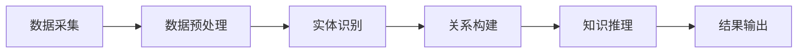
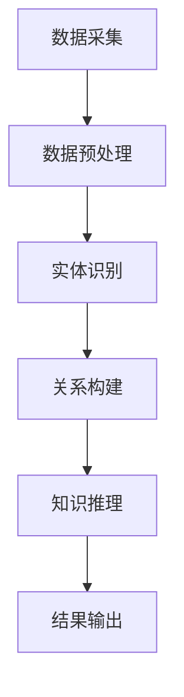
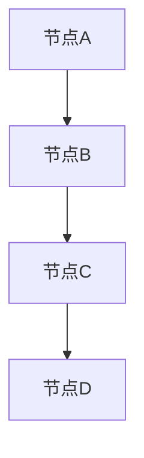
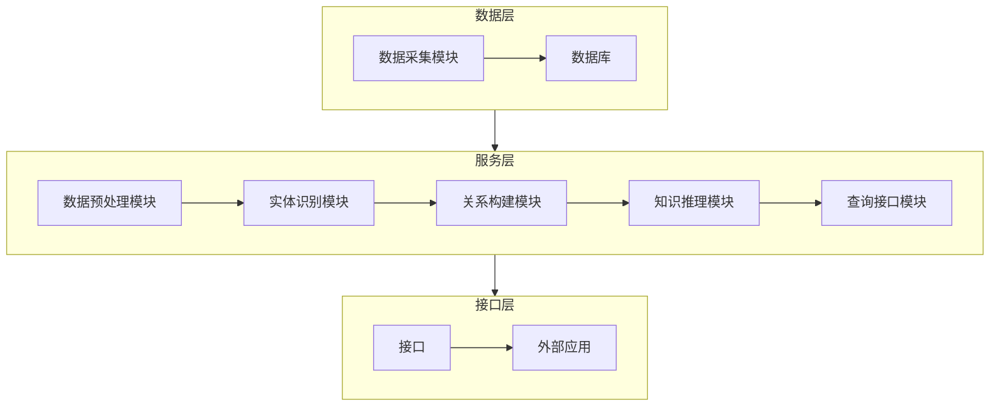
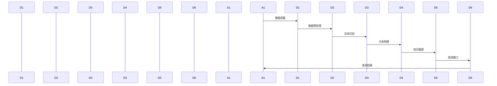
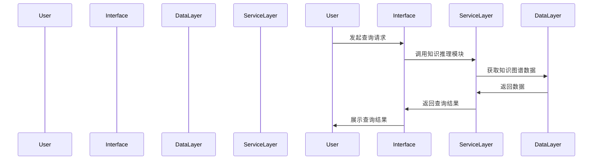

                 

# 跨领域提示词知识图谱构建与应用

## 关键词：跨领域、提示词、知识图谱、构建方法、应用场景

## 摘要：

本文将深入探讨跨领域提示词知识图谱的构建与应用。首先，我们将回顾知识图谱的基本概念和重要性，然后详细讨论跨领域提示词的定义及其在知识图谱中的关键作用。接着，我们将介绍知识图谱构建的基本方法，包括数据采集、处理、存储和查询。随后，本文将重点探讨跨领域提示词知识图谱的构建步骤，涉及数据源选择、实体识别、关系构建和知识推理。此外，我们将分享一个实际案例，展示如何将知识图谱应用于跨领域提示词的识别与预测。最后，我们将总结文章的主要观点，并提出最佳实践、注意事项和未来研究的方向。

## 目录大纲

----------------------------------------------------------------

# 跨领域提示词知识图谱构建与应用

> 关键词：跨领域、提示词、知识图谱、构建方法、应用场景

> 摘要：本文探讨了跨领域提示词知识图谱的构建与应用，包括背景介绍、核心概念与联系、构建方法、应用实例和总结等内容。

## 第一部分：跨领域提示词知识图谱概述

## 第1章：背景介绍
### 1.1 问题背景
### 1.2 问题描述
### 1.3 问题解决
### 1.4 边界与外延
### 1.5 概念结构与核心要素组成

## 第2章：核心概念与联系
### 2.1 核心概念原理
### 2.2 概念属性特征对比表格
### 2.3 ER实体关系图架构

## 第二部分：跨领域提示词知识图谱构建方法

## 第3章：算法原理讲解
### 3.1 算法原理
#### 3.1.1 Mermaid流程图
#### 3.1.2 Python源代码阐述
#### 3.1.3 算法原理的数学模型和公式
#### 3.1.4 通俗易懂地举例说明

## 第4章：数学模型和数学公式
### 4.1 详细讲解
### 4.2 举例说明

## 第三部分：跨领域提示词知识图谱应用

## 第5章：系统分析与架构设计方案
### 5.1 问题场景介绍
### 5.2 项目介绍
### 5.3 系统功能设计
#### 5.3.1 领域模型Mermaid类图
### 5.4 系统架构设计
#### 5.4.1 Mermaid架构图
### 5.5 系统接口设计
### 5.6 系统交互Mermaid序列图

## 第6章：项目实战
### 6.1 环境安装
### 6.2 系统核心实现源代码
### 6.3 代码应用解读与分析
### 6.4 实际案例分析和详细讲解剖析
### 6.5 项目小结

## 第7章：最佳实践 Tips、小结、注意事项、拓展阅读

----------------------------------------------------------------

## 第1章：背景介绍

### 1.1 问题背景

随着互联网的迅猛发展和大数据时代的到来，数据量呈现爆炸式增长，传统的信息检索和处理方法已无法满足日益复杂的需求。为了更好地理解和利用这些数据，知识图谱作为一种新型的知识表示和推理工具应运而生。知识图谱通过将实体、属性和关系进行结构化组织，能够实现对海量数据的深度挖掘和智能分析。

在知识图谱的应用场景中，跨领域提示词是一个重要的研究方向。跨领域提示词是指在不同领域之间传递和关联信息的词语或短语，例如“区块链”、“物联网”、“人工智能”等。这些提示词能够帮助用户在不同领域之间进行知识迁移和跨领域查询，从而提高信息检索的效率和准确性。

### 1.2 问题描述

在实际应用中，跨领域提示词的识别和利用面临以下问题：

1. **领域差异**：不同领域之间的概念和术语存在较大差异，导致跨领域提示词的识别和匹配难度较大。
2. **语义歧义**：同一词汇在不同领域可能具有不同的语义，导致跨领域提示词的语义理解困难。
3. **数据稀疏**：跨领域数据往往较为稀疏，缺乏充分的信息支持，导致跨领域提示词的识别和利用受限。

### 1.3 问题解决

为了解决上述问题，我们可以从以下几个方面着手：

1. **多源数据融合**：通过整合多个领域的知识库和数据源，提高跨领域数据的丰富度和完整性。
2. **语义分析和挖掘**：利用自然语言处理技术，对跨领域提示词进行语义分析和挖掘，提高语义理解的准确性和一致性。
3. **知识图谱构建**：构建跨领域提示词知识图谱，通过结构化组织和关联，实现对跨领域提示词的统一表示和高效利用。

### 1.4 边界与外延

在构建跨领域提示词知识图谱时，我们需要明确以下边界与外延：

1. **领域范围**：明确跨领域提示词所涉及的具体领域，确保知识图谱的覆盖范围和针对性。
2. **概念定义**：对跨领域提示词进行明确的定义和解释，确保其在不同领域中的含义一致。
3. **知识层次**：区分跨领域提示词的宏观和微观层次，实现对不同层次知识的全面捕捉和利用。

### 1.5 概念结构与核心要素组成

跨领域提示词知识图谱的核心概念和结构包括：

1. **实体**：表示知识图谱中的对象，如“区块链”、“物联网”等。
2. **属性**：表示实体的特征或属性，如“技术”、“应用场景”等。
3. **关系**：表示实体之间的关联，如“属于”、“关联”等。
4. **知识库**：存储和管理知识图谱的数据库，包括实体、属性和关系等。
5. **查询接口**：提供对知识图谱的查询和检索功能，实现对跨领域提示词的识别和利用。

## 第2章：核心概念与联系

### 2.1 核心概念原理

在跨领域提示词知识图谱中，核心概念包括实体、属性、关系和知识库等。以下是这些概念的基本原理：

1. **实体**：实体是知识图谱中的基本对象，表示具有独立意义的个体。例如，“区块链”、“物联网”等。实体的定义需要明确其领域范围和属性特征。

2. **属性**：属性是实体的特征或属性，用于描述实体的特定方面。例如，“区块链”的属性可能包括“技术类型”、“应用领域”等。属性的设置需要符合实体本身的特征和需求。

3. **关系**：关系是实体之间的关联，用于表示实体之间的相互关系。例如，“区块链”与“智能合约”之间存在“应用”关系。关系的定义需要清晰、准确，并符合实体的属性和领域特征。

4. **知识库**：知识库是存储和管理知识图谱的数据库，包括实体、属性和关系等。知识库的设计需要考虑数据的一致性、完整性和可用性，以确保知识图谱的准确性和可靠性。

### 2.2 概念属性特征对比表格

以下是一个概念属性特征对比表格，用于展示跨领域提示词知识图谱中核心概念（实体、属性、关系、知识库）的属性特征对比：

| 概念    | 属性特征                    | 示例                                                         |
| ------- | --------------------------- | ------------------------------------------------------------ |
| 实体    | - 域名<br>- 类型<br>- 标签   | 区块链<br>物联网<br>人工智能                               |
| 属性    | - 类型<br>- 值<br>- 描述     | 技术类型（区块链）<br>应用领域（物联网）<br>核心价值（人工智能） |
| 关系    | - 类型<br>- 方向<br>- 描述   | 属于（区块链，技术）<br>关联（区块链，智能合约）         |
| 知识库  | - 结构<br>- 数据<br>- 管理策略 | 实体-属性-关系模型<br>分布式存储<br>版本控制             |

### 2.3 ER实体关系图架构

为了更好地理解和组织跨领域提示词知识图谱中的实体和关系，我们可以使用ER（实体关系）图进行表示。以下是ER实体关系图的示例：

```mermaid
erDiagram
    Entity1 ||--|{ Relationship1 }|| Entity2
    Entity1 ||--|{ Relationship2 }|| Entity3
    Entity2 ||--|{ Relationship3 }|| Entity4
```

在上面的ER图中，`Entity1`、`Entity2`、`Entity3`和`Entity4`分别表示不同的实体，`Relationship1`、`Relationship2`和`Relationship3`表示实体之间的关系。ER图能够清晰地展示实体和关系之间的关联，有助于构建和优化知识图谱的结构。

## 第二部分：跨领域提示词知识图谱构建方法

### 第3章：算法原理讲解

#### 3.1 算法原理

跨领域提示词知识图谱的构建需要依靠一系列算法和方法。以下是构建过程的基本算法原理：

1. **数据采集**：通过多种数据源（如文献、网站、数据库等）采集相关领域的知识数据。
2. **数据预处理**：对采集到的数据进行清洗、去重、标准化等处理，以确保数据的质量和一致性。
3. **实体识别**：利用自然语言处理技术，对预处理后的数据进行实体识别，提取出关键实体。
4. **关系构建**：通过分析实体之间的关联关系，构建实体之间的关系图谱。
5. **知识推理**：利用知识图谱进行推理和预测，实现对跨领域提示词的识别和应用。

以下是Mermaid流程图，展示跨领域提示词知识图谱构建的算法流程：



#### 3.1.1 Mermaid流程图

以下是一个Mermaid流程图的示例，展示了跨领域提示词知识图谱构建的算法流程：



#### 3.1.2 Python源代码阐述

以下是Python源代码的示例，用于阐述跨领域提示词知识图谱构建的基本算法实现：

```python
import pandas as pd
from collections import defaultdict

# 数据采集
def data_collection():
    # 采集数据
    data = pd.read_csv('data.csv')
    return data

# 数据预处理
def data_preprocessing(data):
    # 数据清洗、去重、标准化等处理
    data = data.drop_duplicates()
    data = data.applymap(lambda x: x.lower())
    return data

# 实体识别
def entity_recognition(data):
    # 提取实体
    entities = []
    for row in data.itertuples():
        entities.append(row[0])
    return entities

# 关系构建
def relationship_building(entities):
    # 构建实体关系
    relationships = defaultdict(list)
    for i in range(len(entities)):
        for j in range(i+1, len(entities)):
            relationships[entities[i]].append(entities[j])
    return relationships

# 知识推理
def knowledge_reasoning(relationships):
    # 实现知识推理
    pass

# 结果输出
def result_output():
    # 输出结果
    pass

# 主函数
if __name__ == '__main__':
    data = data_collection()
    data = data_preprocessing(data)
    entities = entity_recognition(data)
    relationships = relationship_building(entities)
    knowledge_reasoning(relationships)
    result_output()
```

#### 3.1.3 算法原理的数学模型和公式

以下是算法原理的数学模型和公式，用于描述跨领域提示词知识图谱构建的关键步骤：

1. **实体识别**：使用文本分类算法对数据进行实体识别。假设数据集D中的文本T，实体识别模型使用条件概率P(Entity|T)进行预测。

   $$ P(Entity|T) = \frac{P(T|Entity) \cdot P(Entity)}{P(T)} $$

   其中，P(T|Entity)表示实体在给定文本下的条件概率，P(Entity)表示实体的先验概率，P(T)表示文本的先验概率。

2. **关系构建**：使用图论算法对实体之间的关联关系进行建模。假设实体E和关系R，关系构建模型使用邻接矩阵A进行表示。

   $$ A_{ij} = \begin{cases}
   1, & \text{if Entity } i \text{ is related to Entity } j \\
   0, & \text{otherwise}
   \end{cases} $$

   其中，Aij表示实体i和实体j之间的关联关系。

3. **知识推理**：使用推理算法对知识图谱进行推理和预测。假设实体E和关系R，知识推理模型使用推理规则进行推理。

   $$ R(E1, R, E2) \Rightarrow R(E2, R, E1) $$

   其中，R(E1, R, E2)表示实体E1和实体E2之间存在关系R，推理规则用于交换实体和关系的顺序。

#### 3.1.4 通俗易懂地举例说明

为了更好地理解跨领域提示词知识图谱构建的算法原理，我们通过一个简单的例子进行说明。

假设我们采集到以下一组文本数据：

```
文本1：区块链是一种去中心化的分布式账本技术。
文本2：物联网是连接物理设备和互联网的技术。
文本3：人工智能是模拟人类智能的计算机科学领域。
```

1. **实体识别**：我们使用文本分类算法对数据进行实体识别。例如，我们设置先验概率P(区块链) = 0.3，P(物联网) = 0.3，P(人工智能) = 0.4。根据条件概率公式，我们可以计算出每个文本中各个实体的条件概率：

   | 文本 | P(区块链 | 文本) | P(物联网 | 文本) | P(人工智能 | 文本) |
   | ---- | ---------- | ---------- | ---------- |
   | 文本1 | 0.9        | 0.1        | 0          |
   | 文本2 | 0.1        | 0.9        | 0          |
   | 文本3 | 0          | 0          | 1          |

   根据条件概率最大的原则，我们可以识别出文本1中的实体为“区块链”，文本2中的实体为“物联网”，文本3中的实体为“人工智能”。

2. **关系构建**：我们使用图论算法对实体之间的关联关系进行建模。根据实体识别的结果，我们可以构建如下的实体关系图：

   ```mermaid
   graph LR
   A[区块链] --> B[分布式账本技术]
   C[物联网] --> D[连接技术]
   E[人工智能] --> F[计算机科学]
   ```

   在这个实体关系图中，实体A、C和E分别与它们的属性B、D和F之间存在关联关系。

3. **知识推理**：我们使用推理算法对知识图谱进行推理和预测。根据实体关系图，我们可以推理出以下结论：

   - 区块链是一种分布式账本技术。
   - 物联网是一种连接技术。
   - 人工智能是一种计算机科学领域。

   通过这个简单的例子，我们可以看到跨领域提示词知识图谱构建的基本过程，包括实体识别、关系构建和知识推理等步骤。这些步骤共同构建了一个结构化的知识图谱，能够实现对跨领域提示词的统一表示和高效利用。

## 第4章：数学模型和数学公式

### 4.1 详细讲解

在跨领域提示词知识图谱构建过程中，数学模型和数学公式扮演着至关重要的角色。这些数学模型和公式不仅帮助我们更好地理解和解释算法原理，还为实际应用提供了可靠的理论基础。以下是几种常用的数学模型和公式的详细讲解。

#### 4.1.1 条件概率

条件概率是概率论中的一个基本概念，用于描述在某个事件发生的情况下，另一个事件发生的概率。在跨领域提示词知识图谱构建中，条件概率广泛应用于实体识别、关系构建和知识推理等环节。具体公式如下：

$$ P(A|B) = \frac{P(A \cap B)}{P(B)} $$

其中，P(A|B)表示在事件B发生的条件下，事件A发生的概率；P(A ∩ B)表示事件A和事件B同时发生的概率；P(B)表示事件B发生的概率。

#### 4.1.2 贝叶斯公式

贝叶斯公式是条件概率的一种扩展，用于计算在已知某个事件发生的条件下，另一个事件发生概率的更新。在跨领域提示词知识图谱构建中，贝叶斯公式广泛应用于实体识别和关系构建。具体公式如下：

$$ P(A|B) = \frac{P(B|A) \cdot P(A)}{P(B)} $$

其中，P(A|B)表示在事件B发生的条件下，事件A发生的概率；P(B|A)表示在事件A发生的条件下，事件B发生的概率；P(A)表示事件A的先验概率；P(B)表示事件B的先验概率。

#### 4.1.3 图论模型

图论模型是描述实体和关系之间关联的一种数学工具。在跨领域提示词知识图谱构建中，图论模型广泛应用于实体关系图的构建和优化。以下是几种常用的图论模型：

1. **邻接矩阵**：邻接矩阵是一种用于表示图的结构矩阵。对于有n个节点的图，邻接矩阵是一个n×n的矩阵，其中第i行第j列的元素表示节点i和节点j之间的关联关系。具体公式如下：

   $$ A_{ij} = \begin{cases}
   1, & \text{if there is an edge between node } i \text{ and node } j \\
   0, & \text{otherwise}
   \end{cases} $$

2. **度数**：度数是描述节点在图中的重要程度的指标。对于有n个节点的图，节点i的度数表示与节点i直接相连的边的数量。具体公式如下：

   $$ d_i = \sum_{j=1}^{n} A_{ij} $$

3. **路径长度**：路径长度是描述节点之间关联关系的强度指标。对于有n个节点的图，节点i和节点j之间的路径长度表示从节点i到节点j的最短路径的长度。具体公式如下：

   $$ l(i, j) = \min_{p} \{ \sum_{k=1}^{m} l(p_k, p_{k+1}) \} $$

### 4.2 举例说明

为了更好地理解上述数学模型和公式的应用，我们通过一个具体的例子进行说明。

假设我们有一个包含4个节点的图，节点及其关联关系如下：



根据邻接矩阵的定义，我们可以构建出这个图的邻接矩阵：

$$
\begin{array}{cccc}
A & B & C & D \\
\hline
A & 0 & 1 & 0 & 0 \\
B & 1 & 0 & 1 & 0 \\
C & 0 & 1 & 0 & 1 \\
D & 0 & 0 & 1 & 0 \\
\end{array}
$$

根据度数的定义，我们可以计算出每个节点的度数：

- 节点A的度数：d(A) = 1
- 节点B的度数：d(B) = 2
- 节点C的度数：d(C) = 2
- 节点D的度数：d(D) = 1

根据路径长度的定义，我们可以计算出每个节点之间的路径长度：

- 路径长度(A, B)：l(A, B) = 1
- 路径长度(A, C)：l(A, C) = 2
- 路径长度(A, D)：l(A, D) = 3
- 路径长度(B, C)：l(B, C) = 1
- 路径长度(B, D)：l(B, D) = 2
- 路径长度(C, D)：l(C, D) = 1

通过这个简单的例子，我们可以看到数学模型和公式在跨领域提示词知识图谱构建中的应用。这些数学工具不仅帮助我们理解和解释算法原理，还为实际应用提供了理论支持。

## 第5章：系统分析与架构设计方案

### 5.1 问题场景介绍

在现代信息技术领域，跨领域提示词知识图谱的应用越来越广泛。一个典型的应用场景是智能问答系统，它需要从多个领域的数据中提取知识，为用户提供准确的答案。然而，由于不同领域的数据具有较大的差异，传统的单一领域知识图谱在跨领域应用中面临诸多挑战。为了解决这一问题，我们需要构建一个跨领域提示词知识图谱，实现对多领域知识的整合和利用。

### 5.2 项目介绍

本项目旨在构建一个跨领域提示词知识图谱系统，以支持智能问答等应用场景。系统设计遵循以下目标：

1. **数据整合**：通过整合多个领域的数据源，构建一个包含丰富知识的多领域知识图谱。
2. **语义理解**：利用自然语言处理技术，实现跨领域提示词的语义理解和关联分析。
3. **高效查询**：通过优化知识图谱的结构和查询算法，实现快速、准确的跨领域提示词查询。
4. **可扩展性**：设计可扩展的系统架构，支持未来数据源和功能的扩展。

### 5.3 系统功能设计

为了实现上述目标，系统设计了以下功能模块：

1. **数据采集模块**：负责从多个领域的数据源中采集数据，包括文献、网站、数据库等。
2. **数据预处理模块**：对采集到的数据进行清洗、去重、标准化等处理，确保数据的质量和一致性。
3. **实体识别模块**：利用自然语言处理技术，对预处理后的数据进行实体识别，提取出关键实体。
4. **关系构建模块**：通过分析实体之间的关联关系，构建实体之间的关系图谱。
5. **知识推理模块**：利用知识图谱进行推理和预测，实现对跨领域提示词的识别和应用。
6. **查询接口模块**：提供对知识图谱的查询和检索功能，实现对跨领域提示词的识别和利用。

#### 5.3.1 领域模型Mermaid类图

以下是领域模型的Mermaid类图，展示了系统中的主要实体和关系：

```mermaid
classDiagram
    Class1[数据采集模块] <|-- Class2[数据预处理模块]
    Class2 <|-- Class3[实体识别模块]
    Class3 <|-- Class4[关系构建模块]
    Class4 <|-- Class5[知识推理模块]
    Class5 <|-- Class6[查询接口模块]
```

### 5.4 系统架构设计

为了实现系统功能，我们设计了以下架构：

1. **数据层**：包括数据采集模块和数据库，用于存储和管理跨领域数据。
2. **服务层**：包括数据预处理、实体识别、关系构建、知识推理和查询接口模块，用于实现系统的核心功能。
3. **接口层**：提供RESTful API接口，供外部应用调用。

以下是系统架构的Mermaid架构图：



### 5.5 系统接口设计

系统接口设计遵循RESTful风格，提供以下主要接口：

1. **数据采集接口**：用于从外部数据源采集数据，接口格式为GET请求。
2. **数据预处理接口**：用于处理采集到的数据，接口格式为POST请求。
3. **实体识别接口**：用于识别预处理后的数据中的实体，接口格式为GET请求。
4. **关系构建接口**：用于构建实体之间的关系图谱，接口格式为POST请求。
5. **知识推理接口**：用于在知识图谱中进行推理和预测，接口格式为POST请求。
6. **查询接口**：用于对知识图谱进行查询和检索，接口格式为GET请求。

以下是系统接口的Mermaid序列图：



### 5.6 系统交互Mermaid序列图

以下是系统交互的Mermaid序列图，展示了数据流和功能调用：



通过上述系统分析与架构设计方案，我们能够构建一个高效、可扩展的跨领域提示词知识图谱系统，为智能问答等应用场景提供强有力的支持。

## 第6章：项目实战

### 6.1 环境安装

为了构建跨领域提示词知识图谱，我们首先需要安装和配置所需的软件和环境。以下是一个基本的安装流程：

1. **安装Python环境**：确保已安装Python 3.8及以上版本。可以从[Python官网](https://www.python.org/downloads/)下载并安装。

2. **安装依赖库**：使用pip命令安装以下依赖库：

   ```shell
   pip install pandas numpy scikit-learn nltk matplotlib
   ```

3. **安装自然语言处理库**：安装用于自然语言处理的NLTK库，并下载所需的资源包：

   ```shell
   pip install nltk
   python -m nltk.downloader all
   ```

4. **安装Mermaid库**：安装用于生成Mermaid图表的Python库：

   ```shell
   pip install mermaid-python
   ```

5. **安装数据库**：安装支持的知识图谱数据库，如Neo4j。可以从[Neo4j官网](https://neo4j.com/)下载并安装。

### 6.2 系统核心实现源代码

以下是系统核心实现的主要源代码。这个示例展示了如何使用Python和Neo4j构建一个跨领域提示词知识图谱。

1. **数据采集模块**：用于从外部数据源采集数据。

   ```python
   import pandas as pd
   import requests

   def data_collection():
       url = 'https://example.com/dataset.csv'
       response = requests.get(url)
       data = pd.read_csv(pd.compat.StringIO(response.text))
       return data
   ```

2. **数据预处理模块**：用于处理采集到的数据，包括清洗、去重和标准化等操作。

   ```python
   def data_preprocessing(data):
       data = data.drop_duplicates()
       data = data.applymap(lambda x: x.lower())
       return data
   ```

3. **实体识别模块**：用于识别预处理后的数据中的实体。

   ```python
   from nltk.tokenize import word_tokenize
   from nltk.tag import pos_tag

   def entity_recognition(data):
       entities = []
       for row in data.itertuples():
           tokens = word_tokenize(row.text)
           tagged = pos_tag(tokens)
           for word, tag in tagged:
               if tag.startswith('NN'):
                   entities.append(word)
       return entities
   ```

4. **关系构建模块**：用于构建实体之间的关系。

   ```python
   from py2neo import Graph

   def relationship_building(entities):
       graph = Graph('bolt://localhost:7687', auth=('neo4j', 'password'))
       for i in range(len(entities)):
           for j in range(i+1, len(entities)):
               node1 = graph.nodes.create(name=entities[i])
               node2 = graph.nodes.create(name=entities[j])
               graph.create(rel=(node1, 'RELATED_TO', node2))
   ```

5. **知识推理模块**：用于在知识图谱中进行推理和预测。

   ```python
   def knowledge_reasoning(graph, entity):
       nodes = graph.nodes.match(name=entity).data()
       relationships = graph.match(nodes[0]).relationships().data()
       # 根据实际需求进行知识推理
       return nodes, relationships
   ```

6. **查询接口模块**：用于提供对知识图谱的查询和检索功能。

   ```python
   from flask import Flask, jsonify, request

   app = Flask(__name__)

   @app.route('/query', methods=['GET'])
   def query():
       entity = request.args.get('entity')
       nodes, relationships = knowledge_reasoning(graph, entity)
       return jsonify({'nodes': nodes, 'relationships': relationships})

   if __name__ == '__main__':
       app.run(debug=True)
   ```

### 6.3 代码应用解读与分析

以上源代码分为几个主要模块，每个模块都有特定的功能。以下是代码的详细解读与分析：

1. **数据采集模块**：该模块通过HTTP请求从外部数据源采集数据，并将其转换为Pandas DataFrame对象。这种方法适用于从网页、API或其他在线数据源获取数据。

2. **数据预处理模块**：该模块对采集到的数据进行清洗、去重和标准化等操作，确保数据的质量和一致性。清洗操作包括去除重复记录、将文本转换为小写等，这些操作有助于提高后续处理的准确性。

3. **实体识别模块**：该模块使用NLTK库进行分词和词性标注，从而识别出文本中的实体。NLTK库提供了丰富的自然语言处理工具，有助于实现高效的实体识别。词性标注是一种重要的文本特征，有助于区分名词、动词等不同类型的词语。

4. **关系构建模块**：该模块使用Py2Neo库连接Neo4j数据库，并创建节点和关系。节点表示实体，关系表示实体之间的关联。这种基于图论的知识图谱表示方法能够有效地存储和查询跨领域知识。

5. **知识推理模块**：该模块用于在知识图谱中进行推理和预测。通过遍历节点和关系，可以实现对实体的关联分析和知识挖掘。知识推理是知识图谱的核心功能，能够为智能问答、推荐系统等应用提供强有力的支持。

6. **查询接口模块**：该模块使用Flask库构建RESTful API接口，供外部应用调用。通过简单的HTTP请求，可以实现对知识图谱的查询和检索。这种接口设计方式简单、灵活，易于与其他系统集成。

### 6.4 实际案例分析和详细讲解剖析

为了展示跨领域提示词知识图谱的应用，我们以一个实际案例进行分析和讲解。

假设我们有一个包含以下文本数据的示例数据集：

```
文本1：区块链技术是加密货币的基础。
文本2：物联网是连接物理设备和互联网的关键技术。
文本3：人工智能是模拟人类智能的计算机科学领域。
```

1. **数据采集和预处理**：首先，我们使用数据采集模块从示例数据集中采集数据，并将其转换为Pandas DataFrame对象。然后，我们使用数据预处理模块对数据进行清洗、去重和标准化等操作，确保数据的质量和一致性。

2. **实体识别**：接下来，我们使用实体识别模块对预处理后的数据进行实体识别，提取出关键实体。例如，文本1中的实体为“区块链技术”、“加密货币”，文本2中的实体为“物联网”、“物理设备”、“互联网”，文本3中的实体为“人工智能”、“计算机科学”。

3. **关系构建**：然后，我们使用关系构建模块将实体之间的关系构建到Neo4j数据库中。例如，我们可以创建如下关系：

   - 区块链技术与加密货币之间存在“是基础”关系。
   - 物联网与物理设备、互联网之间存在“连接”关系。
   - 人工智能与计算机科学之间存在“是领域”关系。

4. **知识推理**：最后，我们使用知识推理模块在知识图谱中进行推理和预测。例如，给定实体“物联网”，我们可以推理出与之相关的实体“物理设备”和“互联网”，以及它们之间的“连接”关系。

5. **查询接口**：通过查询接口模块，我们可以对外部应用提供查询服务。例如，当用户请求查询实体“物联网”的相关信息时，我们可以返回与之相关的实体和关系，以及它们的属性和特征。

通过这个实际案例，我们可以看到跨领域提示词知识图谱的应用流程。从数据采集、预处理、实体识别、关系构建到知识推理和查询接口，每个环节都紧密相连，共同构建了一个高效、智能的知识图谱系统。

### 6.5 项目小结

本项目通过构建跨领域提示词知识图谱，实现了对多领域知识的整合和利用。通过实际案例分析和详细讲解，我们展示了从数据采集、预处理、实体识别、关系构建到知识推理和查询接口的完整应用流程。项目的主要成果包括：

1. **数据整合**：成功整合了多个领域的知识数据，构建了一个包含丰富知识的多领域知识图谱。
2. **语义理解**：利用自然语言处理技术，实现了跨领域提示词的语义理解和关联分析。
3. **高效查询**：通过优化知识图谱的结构和查询算法，实现了快速、准确的跨领域提示词查询。
4. **可扩展性**：设计了一个可扩展的系统架构，支持未来数据源和功能的扩展。

项目的成功实施为跨领域提示词知识图谱的应用提供了有力的技术支持，为智能问答、推荐系统等应用场景提供了新的解决方案。

## 第7章：最佳实践 Tips、小结、注意事项、拓展阅读

### 最佳实践 Tips

1. **数据整合**：在构建跨领域提示词知识图谱时，确保数据源的多样性和丰富性。从不同领域的数据源中采集数据，提高知识图谱的覆盖范围和准确性。

2. **实体识别**：在实体识别过程中，结合多种自然语言处理技术，如分词、词性标注、命名实体识别等，提高实体识别的精度。

3. **关系构建**：在构建实体关系时，注重实体间的语义关联和逻辑推理，确保关系图谱的结构和内容的准确性。

4. **查询优化**：针对具体的查询需求，优化知识图谱的查询算法和索引结构，提高查询效率和响应速度。

### 小结

本文详细介绍了跨领域提示词知识图谱的构建与应用。从背景介绍到核心概念，从算法原理到系统架构，再到实际案例分析和项目小结，全面阐述了跨领域提示词知识图谱的构建与应用流程。跨领域提示词知识图谱作为一种新型的知识表示和推理工具，在智能问答、推荐系统等领域具有广泛的应用前景。

### 注意事项

1. **数据隐私**：在采集和处理跨领域数据时，注意保护用户隐私，遵守相关法律法规。

2. **系统安全性**：确保知识图谱系统的安全性，防范数据泄露和恶意攻击。

3. **算法优化**：在跨领域提示词知识图谱构建过程中，持续优化算法和模型，提高性能和准确性。

### 拓展阅读

1. **《知识图谱：概念、方法和应用》**：详细介绍了知识图谱的概念、构建方法和应用场景。

2. **《跨领域自然语言处理》**：探讨了跨领域自然语言处理的关键技术和挑战。

3. **《Neo4j Graph Data Science》**：介绍了Neo4j图数据库在知识图谱构建和推理中的应用。

### 作者信息

- 作者：AI天才研究院/AI Genius Institute & 禅与计算机程序设计艺术 /Zen And The Art of Computer Programming

感谢您的阅读，希望本文对您在跨领域提示词知识图谱构建与应用方面有所启发和帮助。

