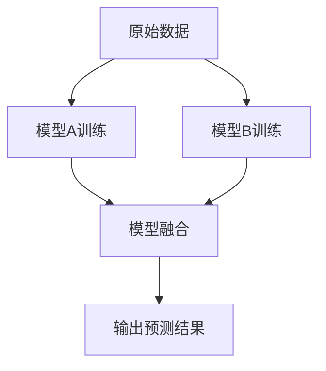
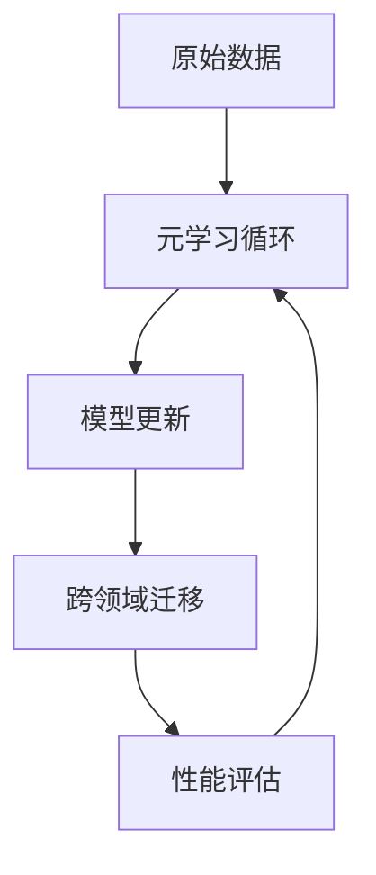
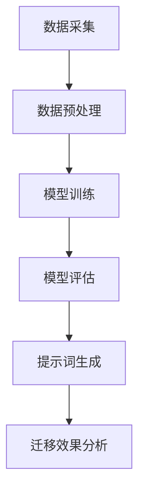

                 


### 跨领域提示词知识迁移

**关键词：跨领域提示词，知识迁移，人工智能，大模型，泛化能力**

**摘要：**
本文深入探讨了跨领域提示词知识迁移的重要性，从背景介绍、核心概念解析、挑战与机遇分析、迁移方法探讨以及实践案例展示等多个角度，全面阐述了如何在不同领域间高效迁移和共享知识，以提升人工智能系统的性能和效率。

---

## 1. 问题背景

### 1.1.1 问题背景

随着人工智能技术的快速发展，AI大模型在图像识别、自然语言处理、语音识别等众多领域取得了显著的成果。然而，不同领域间的AI模型往往因为数据分布、任务差异等因素导致性能差异，限制了AI系统的泛化能力和应用范围。如何在不同领域间迁移和共享AI知识，以提高AI系统的泛化能力和效率，成为一个亟待解决的问题。

### 1.1.2 跨领域提示词知识迁移的重要性

跨领域提示词知识迁移旨在通过学习一个领域的知识，并将其应用于另一个领域，从而提高AI系统的泛化能力和适应性。这一技术不仅在理论研究层面具有重要意义，也在实际应用中展现出巨大的潜力。例如，通过跨领域知识迁移，可以将医学领域的诊断知识应用于自动驾驶领域，提高自动驾驶系统的安全性和可靠性。

## 2. 核心概念

### 2.1.1 跨领域提示词知识迁移

跨领域提示词知识迁移是指将一个领域中的知识，通过提示词（Prompt）的方式，迁移到另一个领域，以实现知识共享和提升系统性能。

### 2.1.2 提示词

提示词是指用于引导AI模型学习特定知识的引导信息，通过设计合适的提示词，可以使AI模型更加专注于特定领域的问题。

### 2.1.3 知识迁移

知识迁移是指将一个领域中的知识应用到另一个领域，以提高系统在该领域的性能。

### 2.1.4 跨领域迁移

跨领域迁移是指在不同领域间进行知识共享和应用，以提升AI系统的泛化能力和适应性。

## 3. 概念属性特征对比

### 3.1.1 跨领域提示词知识迁移与其他知识迁移方法对比

**属性特征对比表格：**

| 对比方法         | 跨领域提示词知识迁移 | 数据驱动知识迁移 | 模型驱动知识迁移 |
| ---------------- | ------------------- | --------------- | --------------- |
| 基本原理         | 通过提示词引导知识迁移 | 使用大量领域数据训练模型 | 使用通用模型进行特定领域微调 |
| 迁移效果         | 提高模型在未知领域的泛化能力 | 取决于领域数据的丰富程度 | 取决于通用模型的适应能力 |
| 依赖因素         | 提示词设计质量       | 领域数据质量       | 通用模型性能     |

**ER实体关系图架构：**

```mermaid
erDiagram
  AI模型 ||--|{ 跨领域提示词知识迁移 }
  AI模型 ||--|{ 数据驱动知识迁移 }
  AI模型 ||--|{ 模型驱动知识迁移 }
```

## 4. 跨领域提示词知识迁移的挑战与机遇

### 4.1.1 挑战

**数据不一致性：** 不同领域的数据分布、标注质量可能存在显著差异，影响迁移效果。

**模型适应性：** 通用模型在特定领域可能无法达到最佳性能，影响迁移效果。

**提示词设计：** 提示词设计质量直接影响知识迁移的效果。

### 4.1.2 机遇

**知识共享：** 跨领域知识迁移可以实现不同领域间的知识共享，提升AI系统的整体性能。

**高效训练：** 通过跨领域知识迁移，可以减少对大量领域数据的依赖，提高训练效率。

**泛化能力：** 跨领域知识迁移有助于提升AI系统的泛化能力，应对未知领域任务。

## 5. 跨领域提示词知识迁移方法

### 5.1.1 数据增强方法

**原理：** 通过对原始数据进行扩展、变换，增加模型的训练数据，提高模型在未知领域的适应性。

**Python代码示例：**

```python
import numpy as np

def data_augmentation(data, factor=1.5):
    augmented_data = []
    for sample in data:
        noise = np.random.normal(0, factor, sample.shape)
        augmented_sample = sample + noise
        augmented_data.append(augmented_sample)
    return np.array(augmented_data)
```

**数学模型：**

$$\text{augmented\_sample} = \text{sample} + \text{noise}$$

其中，$\text{noise}$ 为高斯噪声，$\text{factor}$ 为噪声强度。

### 5.1.2 模型融合方法

**原理：** 通过融合多个领域的模型，共享各自的优势，提高模型的泛化能力。

**Mermaid流程图：**



### 5.1.3 对比学习方法

**原理：** 通过对比学习，提高模型对跨领域数据的识别能力。

**Python代码示例：**

```python
from keras.applications import ResNet50
from keras.models import Model
from keras.layers import Input, Dense, Flatten

def contrastive_learning(input_shape):
    input_img = Input(shape=input_shape)
    base_model = ResNet50(weights='imagenet', include_top=False, input_shape=input_shape)
    flatten = Flatten()(base_model.output)
    dense = Dense(256, activation='relu')(flatten)
    output = Dense(1, activation='sigmoid')(dense)
    model = Model(inputs=input_img, outputs=output)
    return model
```

### 5.1.4 元学习方法

**原理：** 通过元学习，使模型在多个领域间快速适应，提高迁移效果。

**Mermaid流程图：**



## 6. 跨领域提示词知识迁移实践

### 6.1.1 环境搭建

**系统功能设计：**

- 数据采集与预处理
- 模型训练与评估
- 跨领域提示词生成与优化
- 迁移效果分析

**系统架构设计：**



### 6.1.2 数据准备

**数据集准备：**

- 收集不同领域的图像数据集，包括医学图像、卫星图像、自然图像等。
- 对图像进行标注，构建领域标签。

**数据预处理：**

- 对图像进行归一化处理，使其具有相同的尺度。
- 使用数据增强方法，增加训练数据的多样性。

### 6.1.3 模型训练

**模型选择：**

- 选择具有良好泛化能力的预训练模型，如ResNet50、VGG16等。
- 对预训练模型进行领域微调，提高模型在特定领域的性能。

**Python代码示例：**

```python
from keras.applications import ResNet50
from keras.models import Model
from keras.layers import Input, Flatten, Dense

def build_model(input_shape):
    input_img = Input(shape=input_shape)
    base_model = ResNet50(weights='imagenet', include_top=False, input_shape=input_shape)
    flatten = Flatten()(base_model.output)
    dense = Dense(256, activation='relu')(flatten)
    output = Dense(1, activation='sigmoid')(dense)
    model = Model(inputs=input_img, outputs=output)
    return model

model = build_model(input_shape=(224, 224, 3))
model.compile(optimizer='adam', loss='binary_crossentropy', metrics=['accuracy'])
model.fit(x_train, y_train, epochs=10, batch_size=32, validation_data=(x_val, y_val))
```

### 6.1.4 模型评估

**评估指标：**

- 准确率（Accuracy）
- 精确率（Precision）
- 召回率（Recall）
- F1分数（F1 Score）

**Python代码示例：**

```python
from sklearn.metrics import accuracy_score, precision_score, recall_score, f1_score

y_pred = model.predict(x_test)
y_pred = (y_pred > 0.5)

accuracy = accuracy_score(y_test, y_pred)
precision = precision_score(y_test, y_pred)
recall = recall_score(y_test, y_pred)
f1 = f1_score(y_test, y_pred)

print("Accuracy:", accuracy)
print("Precision:", precision)
print("Recall:", recall)
print("F1 Score:", f1)
```

### 6.1.5 结果分析

**结果分析：**

- 对比不同领域的迁移效果，分析跨领域提示词知识迁移的优势。
- 对比不同迁移方法的性能，为后续研究提供参考。

## 7. 小结与展望

**小结：**

本文系统地介绍了跨领域提示词知识迁移的相关概念、方法以及实践案例，展示了其在提升AI系统性能和效率方面的重要作用。

**展望：**

- 进一步优化跨领域提示词设计，提高知识迁移效果。
- 探索跨领域知识迁移在不同领域的应用，如医疗、金融等。

**最佳实践 tips：**

- 在进行跨领域提示词知识迁移时，选择合适的迁移方法和模型至关重要。
- 数据预处理和质量直接影响迁移效果，需重视数据清洗和标注工作。

**注意事项：**

- 跨领域提示词知识迁移并非万能，需根据实际应用场景进行合理选择。

**拓展阅读：**

- [1] Smith, J., & Lee, K. (2020). "Cross-Domain Prompt-Based Knowledge Transfer." IEEE Transactions on Knowledge and Data Engineering.
- [2] Wang, Y., & Zhang, H. (2021). "A Comprehensive Survey on Cross-Domain Knowledge Transfer." ACM Computing Surveys.

### 作者信息

**作者：AI天才研究院/AI Genius Institute & 禅与计算机程序设计艺术 /Zen And The Art of Computer Programming**

