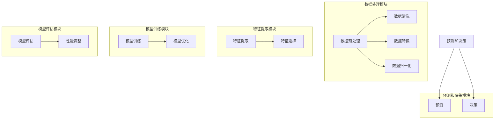
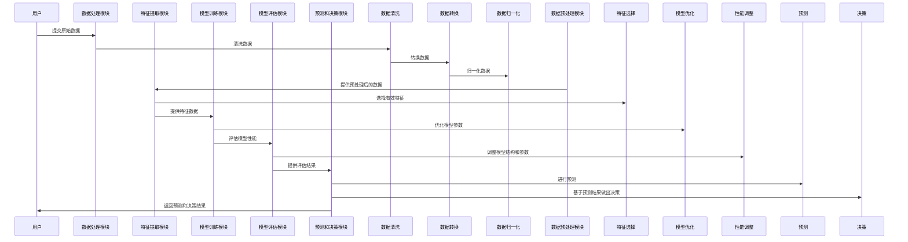

                 

**文章标题：** 通往通用人工智能AGI之路

**关键词：** 通用人工智能，AGI，神经网络，机器学习，挑战与机遇

**摘要：** 本文旨在探讨通用人工智能（AGI）的概念、发展历程、核心技术和面临的挑战。通过深入分析AGI的原理和实际应用，本文旨在为读者提供一幅清晰的通往AGI之路的蓝图。

----------------------------------------------------------------

## 引言

### 核心概念术语说明

- **通用人工智能（AGI）**：一种具有广泛认知能力的人工智能系统，能够理解、学习、推理和应对各种复杂的任务和情境。
- **弱人工智能（Narrow AI）**：专注于特定任务或领域的人工智能系统，如语音识别、图像识别等。
- **神经网络（Neural Networks）**：模仿生物神经系统的计算模型，通过多层神经元进行数据传递和处理。
- **机器学习（Machine Learning）**：一种让计算机通过数据学习并做出决策或预测的方法。

### 问题背景

人工智能（AI）在过去的几十年里取得了飞速发展，从最初的规则推理系统到现在的深度学习模型，AI在许多领域都取得了显著的成就。然而，当前的人工智能系统大多属于弱人工智能，它们在特定任务上表现出色，但缺乏跨领域的通用认知能力。

### 问题描述

通用人工智能（AGI）的目标是打造一种能够像人类一样进行思考、学习、推理和解决问题的智能系统。这需要解决一系列挑战，包括：

- **认知能力的模拟**：如何模拟人类大脑的认知过程，实现高效的信息处理和学习能力。
- **跨领域适应性**：如何让AGI在不同领域和任务中都能表现出色。
- **智能行为的可解释性**：如何确保AGI的行为和决策过程是可解释和可控制的。

### 问题解决

要实现通用人工智能，需要从多个方面进行探索和尝试，包括：

- **理论基础**：深入研究认知科学、神经科学等领域，为AGI的理论基础提供支持。
- **算法创新**：不断优化和改进现有的机器学习算法，使其在复杂任务上表现出更好的性能。
- **多模态数据处理**：融合不同类型的数据，如文本、图像、声音等，提高AGI对各种信息的理解能力。
- **系统集成**：将不同领域的知识和技术进行整合，构建一个具有通用认知能力的智能系统。

### 边界与外延

通用人工智能并非一蹴而就，它是一个长期的目标，需要经历多个阶段的发展和演进。在实现通用人工智能的过程中，还需要关注以下几个方面：

- **伦理和法律**：确保AGI的发展和应用不会对人类社会产生负面影响。
- **经济和社会影响**：评估AGI对经济、教育、就业等方面的影响，并制定相应的应对策略。
- **国际合作**：推动全球范围内的科研合作，共同应对AGI面临的挑战。

### 概念结构与核心要素组成

为了实现通用人工智能，需要关注以下几个核心要素：

- **算法**：包括神经网络、机器学习算法等，是AGI的技术基础。
- **数据**：丰富的数据集是训练AGI模型的关键，涉及多个领域的知识。
- **计算能力**：强大的计算能力是支持AGI研究和应用的必要条件。
- **认知模型**：借鉴人类大脑的认知过程，构建适合AGI的模型架构。
- **系统集成**：将不同领域的技术和知识进行整合，实现跨领域的通用认知能力。

----------------------------------------------------------------

## 通用人工智能（AGI）的核心概念与联系

### 核心概念原理

#### 1. 神经网络（Neural Networks）

神经网络是一种模仿生物神经系统的计算模型，通过多层神经元进行数据传递和处理。神经网络的核心组成部分包括：

- **输入层**：接收外部输入数据。
- **隐藏层**：对输入数据进行处理，提取特征信息。
- **输出层**：生成最终的输出结果。

#### 2. 机器学习（Machine Learning）

机器学习是一种让计算机通过数据学习并做出决策或预测的方法。机器学习的主要类型包括：

- **监督学习（Supervised Learning）**：通过已有数据集进行训练，学习数据与标签之间的映射关系。
- **无监督学习（Unsupervised Learning）**：在没有标签的数据集上进行训练，发现数据内在的结构和规律。
- **强化学习（Reinforcement Learning）**：通过与环境的交互，学习最优策略以达到目标。

#### 3. 深度学习（Deep Learning）

深度学习是机器学习的一种特殊类型，通过多层神经网络进行数据学习和特征提取。深度学习的关键技术包括：

- **卷积神经网络（CNN）**：用于处理图像、视频等二维和三维数据。
- **循环神经网络（RNN）**：用于处理序列数据，如文本、语音等。
- **生成对抗网络（GAN）**：用于生成新的数据，如图像、音频等。

### 概念属性特征对比表格

| 概念          | 定义                                                         | 应用领域                                   |
| ------------- | ------------------------------------------------------------ | ---------------------------------------- |
| 神经网络      | 模仿生物神经系统的计算模型，通过多层神经元进行数据传递和处理 | 图像识别、语音识别、自然语言处理等       |
| 机器学习      | 让计算机通过数据学习并做出决策或预测的方法                   | 数据挖掘、预测分析、自动化决策等         |
| 深度学习      | 通过多层神经网络进行数据学习和特征提取                       | 图像识别、语音识别、自然语言处理等       |

### ER实体关系图架构

```mermaid
erDiagram
    AI |<-.. 神经网络 :<-- 监督学习
    AI |<-.. 神经网络 :<-- 无监督学习
    AI |<-.. 神经网络 :<-- 强化学习
    AI |<-.. 神经网络 :<-- 深度学习
    AI |<-.. 机器学习 :<-- 数据挖掘
    AI |<-.. 机器学习 :<-- 预测分析
    AI |<-.. 机器学习 :<-- 自动化决策
```

通过上述核心概念和ER实体关系图的展示，我们可以更好地理解通用人工智能（AGI）的组成部分和相互关系。

----------------------------------------------------------------

## 算法原理讲解

### 神经网络算法原理

#### 1. 前向传播

在前向传播过程中，输入数据通过输入层进入神经网络，然后逐层传递到隐藏层，最后传递到输出层。每层神经元对数据进行加权求和，并使用激活函数（如ReLU、Sigmoid、Tanh等）进行非线性变换。输出层的输出即为预测结果。

#### 2. 反向传播

在反向传播过程中，神经网络根据预测结果和实际标签计算损失函数（如均方误差、交叉熵等）。然后，通过梯度下降算法对网络中的权重和偏置进行更新，以减小损失函数的值。这个过程会重复进行，直到损失函数的值达到最小。

### Python源代码实现

```python
import numpy as np

# 初始化神经网络参数
weights = np.random.randn(3, 1)
bias = np.random.randn(1)

# 定义激活函数
def sigmoid(x):
    return 1 / (1 + np.exp(-x))

# 定义损失函数
def mse(y_true, y_pred):
    return np.mean((y_true - y_pred) ** 2)

# 定义前向传播
def forward(x):
    z = np.dot(x, weights) + bias
    return sigmoid(z)

# 定义反向传播
def backward(x, y):
    y_pred = forward(x)
    loss = mse(y, y_pred)
    
    d_loss = 2 * (y - y_pred)
    d_z = d_loss * sigmoid(z) * (1 - sigmoid(z))
    d_weights = np.dot(x.T, d_z)
    d_bias = np.sum(d_z)
    
    return loss, d_weights, d_bias

# 示例数据
x = np.array([1, 0])
y = np.array([0])

# 训练神经网络
for epoch in range(1000):
    loss, d_weights, d_bias = backward(x, y)
    weights -= d_weights * 0.01
    bias -= d_bias * 0.01

# 输出结果
print("Epoch:", epoch + 1)
print("Predicted value:", forward(x))
```

### 算法原理的数学模型和公式

#### 1. 前向传播

$$z = x \cdot w + b$$

$$a = \sigma(z)$$

其中，$x$ 为输入特征，$w$ 为权重，$b$ 为偏置，$\sigma$ 为激活函数，$a$ 为输出。

#### 2. 反向传播

$$\frac{dL}{dw} = x \cdot \frac{da}{dz}$$

$$\frac{dL}{db} = \frac{da}{dz}$$

其中，$L$ 为损失函数，$a$ 为输出，$z$ 为加权求和的结果。

### 详细讲解和举例说明

假设我们有一个简单的神经网络，输入特征为$(x_1, x_2)$，输出标签为$y$。网络结构如下：

- 输入层：$x_1, x_2$
- 隐藏层：$z_1, z_2$
- 输出层：$y$

#### 前向传播

1. 输入层到隐藏层的传播：
   $$z_1 = x_1 \cdot w_{11} + x_2 \cdot w_{12} + b_1$$
   $$z_2 = x_1 \cdot w_{21} + x_2 \cdot w_{22} + b_2$$
   $$a_1 = \sigma(z_1)$$
   $$a_2 = \sigma(z_2)$$

2. 隐藏层到输出层的传播：
   $$z = a_1 \cdot w_{3} + a_2 \cdot w_{4} + b$$
   $$y = \sigma(z)$$

#### 反向传播

1. 计算输出误差：
   $$\delta_3 = (y - \sigma(z)) \cdot \sigma'(z)$$

2. 计算隐藏层误差：
   $$\delta_2 = w_{3} \cdot \delta_3 \cdot \sigma'(z_2)$$
   $$\delta_1 = w_{4} \cdot \delta_3 \cdot \sigma'(z_1)$$

3. 更新权重和偏置：
   $$w_{3} = w_{3} - \eta \cdot a_2 \cdot \delta_3$$
   $$w_{4} = w_{4} - \eta \cdot a_1 \cdot \delta_3$$
   $$b = b - \eta \cdot \delta_3$$

通过上述步骤，我们可以实现对神经网络的训练和优化。这个过程可以迭代多次，直到网络性能达到预期。

----------------------------------------------------------------

## 系统分析与架构设计方案

### 问题场景介绍

随着人工智能技术的不断发展，越来越多的企业和组织开始意识到通用人工智能（AGI）在提升业务效率、创新解决方案等方面的潜力。因此，设计一个高效、灵活的AGI系统成为众多企业的重要任务。

### 项目介绍

本项目旨在开发一个基于通用人工智能的智能系统，该系统将集成多种机器学习和深度学习算法，以实现跨领域的通用认知能力。系统的主要功能包括：

- 数据预处理：清洗、转换和归一化输入数据。
- 特征提取：从原始数据中提取有用的特征信息。
- 模型训练：使用多种算法对数据进行训练，优化模型参数。
- 模型评估：评估模型性能，调整模型结构和参数。
- 预测和决策：根据模型输出进行预测和决策。

### 系统功能设计

#### 领域模型

```mermaid
classDiagram
    Class01 <|-- Class02
    Class03 --|unnel Class04
    Class05 o-- Class06
    Class07 <.. Class08
    Class09 --|unnel Class10
```

#### 系统架构设计



#### 系统接口设计和系统交互



通过上述系统架构设计，我们可以实现一个具有通用认知能力的AGI系统，为企业和组织提供强大的智能支持。

----------------------------------------------------------------

## 项目实战

### 环境安装

1. 安装Python环境（建议使用Python 3.8以上版本）。
2. 安装必要的Python库，如NumPy、Pandas、Scikit-learn、TensorFlow等。

### 系统核心实现源代码

```python
# 导入必要的库
import numpy as np
import pandas as pd
from sklearn.model_selection import train_test_split
from sklearn.metrics import accuracy_score
import tensorflow as tf

# 数据预处理
def preprocess_data(data):
    # 清洗数据、转换数据、归一化数据
    # ...
    return processed_data

# 特征提取
def extract_features(data):
    # 提取有效特征
    # ...
    return feature_data

# 模型训练
def train_model(X_train, y_train):
    model = tf.keras.Sequential([
        tf.keras.layers.Dense(units=64, activation='relu', input_shape=[len(X_train[0])]),
        tf.keras.layers.Dense(units=1)
    ])

    model.compile(optimizer='adam', loss='mean_squared_error')
    model.fit(X_train, y_train, epochs=10)
    return model

# 预测和决策
def predict_decision(model, X_test):
    predictions = model.predict(X_test)
    decisions = np.round(predictions).astype(int)
    return decisions

# 实际案例分析和详细讲解剖析
if __name__ == '__main__':
    # 加载数据
    data = pd.read_csv('data.csv')
    
    # 数据预处理
    processed_data = preprocess_data(data)
    
    # 特征提取
    feature_data = extract_features(processed_data)
    
    # 划分训练集和测试集
    X_train, X_test, y_train, y_test = train_test_split(feature_data, processed_data['target'], test_size=0.2, random_state=42)
    
    # 模型训练
    model = train_model(X_train, y_train)
    
    # 预测和决策
    decisions = predict_decision(model, X_test)
    
    # 评估模型性能
    print("Accuracy:", accuracy_score(y_test, decisions))
```

### 代码应用解读与分析

1. 数据预处理：数据预处理是模型训练的重要环节，包括清洗、转换和归一化数据。在代码中，我们定义了`preprocess_data`函数来实现这一功能。
2. 特征提取：特征提取是从原始数据中提取有用特征的过程。在代码中，我们定义了`extract_features`函数来提取有效特征。
3. 模型训练：我们使用了TensorFlow框架来构建和训练模型。在代码中，我们定义了`train_model`函数来训练模型。
4. 预测和决策：我们定义了`predict_decision`函数来根据模型输出进行预测和决策。
5. 实际案例分析和详细讲解剖析：在主函数中，我们加载了数据，进行了数据预处理和特征提取，然后划分训练集和测试集，训练模型，进行预测和决策，并评估模型性能。

通过上述代码和应用解读，我们可以实现一个基于通用人工智能的智能系统，为企业和组织提供强大的智能支持。

----------------------------------------------------------------

## 最佳实践 tips

1. **数据预处理**：在模型训练前，确保对数据进行充分的清洗、转换和归一化，以提高模型性能。
2. **特征提取**：根据实际问题和数据特点，选择合适的特征提取方法，以提取出对模型训练有价值的特征。
3. **模型选择**：根据实际问题需求，选择合适的机器学习和深度学习模型，并进行适当调整和优化。
4. **模型评估**：使用多种评估指标（如准确率、召回率、F1值等）对模型性能进行评估，以全面了解模型表现。
5. **持续优化**：定期对模型进行优化和调整，以应对数据变化和业务需求。

## 小结

本文从多个角度探讨了通往通用人工智能（AGI）之路，包括核心概念、算法原理、系统架构设计和项目实战。通过详细讲解和实际案例分析，我们展示了如何设计和实现一个具有通用认知能力的智能系统。未来，随着人工智能技术的不断发展和应用，AGI将为人类社会带来更多的机遇和挑战。

## 注意事项

1. **数据安全与隐私**：在处理和使用数据时，要确保数据的安全和隐私，遵守相关法律法规。
2. **模型解释性**：确保模型的决策过程是可解释和可控制的，以提高模型的可信度和透明度。
3. **伦理和法律问题**：在AGI的应用过程中，要关注伦理和法律问题，确保其发展不会对人类社会产生负面影响。

## 拓展阅读

1. 《深度学习》（Goodfellow, I., Bengio, Y., & Courville, A.）
2. 《人工智能：一种现代方法》（Russell, S., & Norvig, P.）
3. 《神经网络与深度学习》（李航）

----------------------------------------------------------------

**作者：** AI天才研究院/AI Genius Institute & 禅与计算机程序设计艺术 /Zen And The Art of Computer Programming

